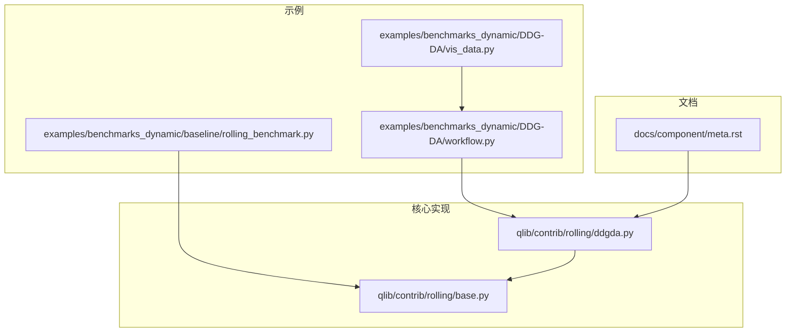
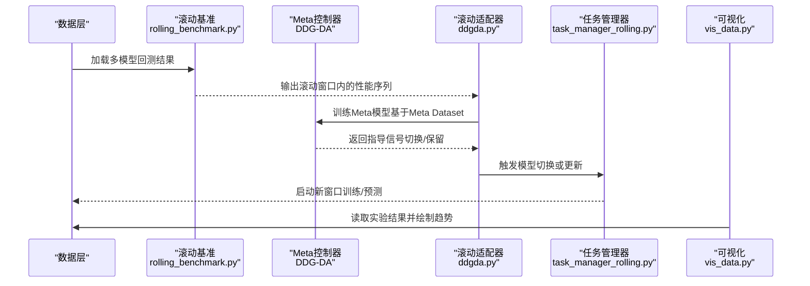
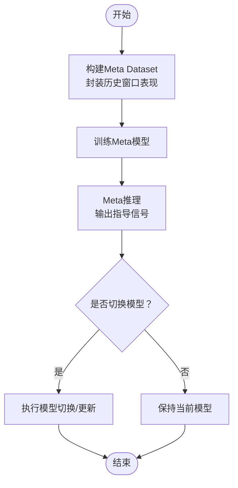
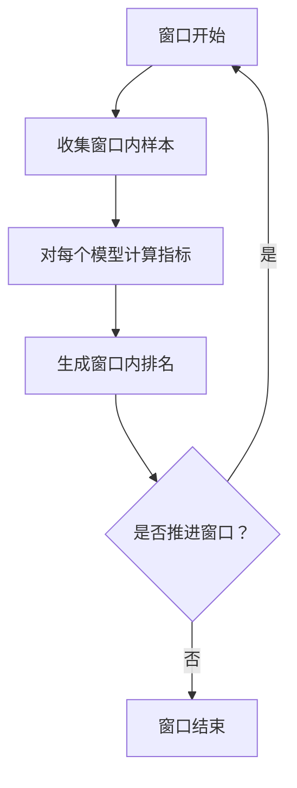
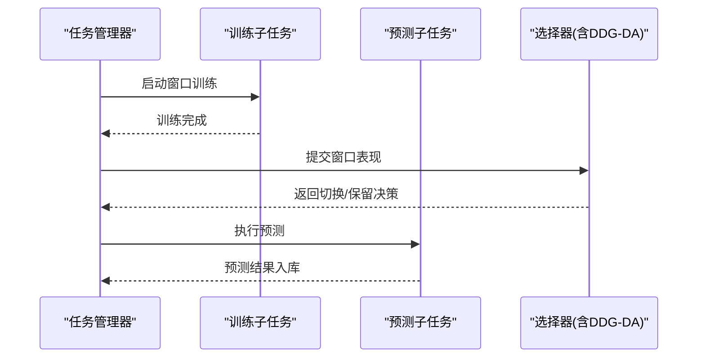
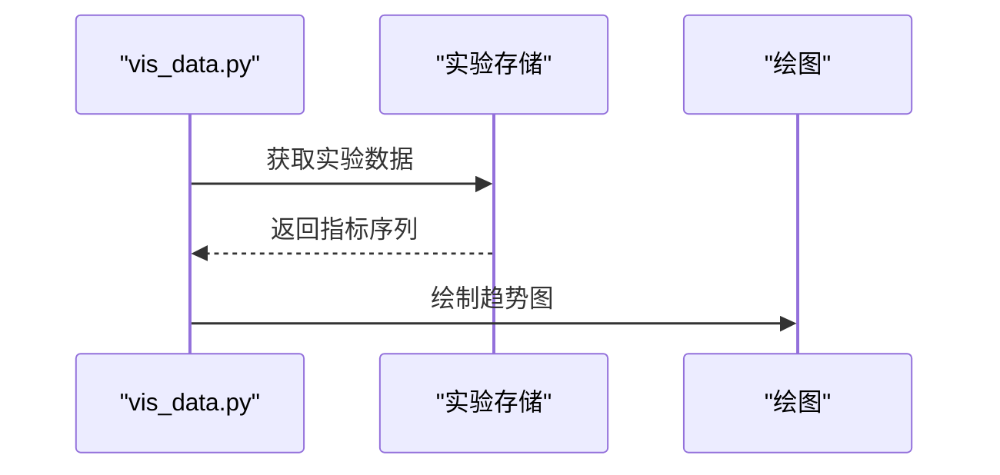
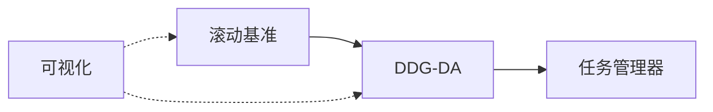

# 动态模型选择

<cite>
**本文引用的文件**
- [ddgda.py](file://qlib/contrib/rolling/ddgda.py)
- [workflow.py](file://examples/benchmarks_dynamic/DDG-DA/workflow.py)
- [rolling_benchmark.py](file://examples/benchmarks_dynamic/baseline/rolling_benchmark.py)
- [task_manager_rolling.py](file://examples/model_rolling/task_manager_rolling.py)
- [base.py](file://qlib/contrib/rolling/base.py)
- [meta.rst](file://docs/component/meta.rst)
- [README.md](file://examples/benchmarks_dynamic/DDG-DA/README.md)
- [vis_data.py](file://examples/benchmarks_dynamic/DDG-DA/vis_data.py)
</cite>

## 目录
1. [引言](#引言)
2. [项目结构](#项目结构)
3. [核心组件](#核心组件)
4. [架构总览](#架构总览)
5. [详细组件分析](#详细组件分析)
6. [依赖关系分析](#依赖关系分析)
7. [性能考量](#性能考量)
8. [故障排除指南](#故障排除指南)
9. [结论](#结论)
10. [附录](#附录)

## 引言
本文件面向希望在Qlib中构建“动态模型选择系统”的工程师与研究者，系统化介绍以下能力：
- 基于历史表现的模型自动选择策略：性能评估指标、选择算法、切换条件
- DDG-DA（Dynamic Data-driven Adaptation）方法：概念漂移预测、模型性能监控、自适应切换
- 滚动基准测试：时间窗口选择、性能对比、模型更新策略
- 完整配置示例与使用指南：如何搭建可运行的智能动态模型选择系统
- 性能优化建议与常见问题排查

## 项目结构
围绕动态模型选择，本仓库的关键位置如下：
- 核心实现：qlib/contrib/rolling/ddgda.py 提供基于Meta Controller的滚动式DDG-DA实现
- 示例工作流：examples/benchmarks_dynamic/DDG-DA/workflow.py 展示从数据到实验的完整流程
- 基线滚动基准：examples/benchmarks_dynamic/baseline/rolling_benchmark.py 提供滚动对比基线
- 模型滚动任务管理：examples/model_rolling/task_manager_rolling.py 展示滚动训练/预测的任务编排
- 文档说明：docs/component/meta.rst 对Meta Controller与DDG-DA步骤进行说明
- 可视化与验证：examples/benchmarks_dynamic/DDG-DA/vis_data.py 展示实验结果可视化

**图示来源**
- [workflow.py](file://examples/benchmarks_dynamic/DDG-DA/workflow.py)
- [rolling_benchmark.py](file://examples/benchmarks_dynamic/baseline/rolling_benchmark.py)
- [ddgda.py](file://qlib/contrib/rolling/ddgda.py)
- [base.py](file://qlib/contrib/rolling/base.py)
- [meta.rst](file://docs/component/meta.rst)
- [vis_data.py](file://examples/benchmarks_dynamic/DDG-DA/vis_data.py)

**章节来源**
- [ddgda.py](file://qlib/contrib/rolling/ddgda.py)
- [workflow.py](file://examples/benchmarks_dynamic/DDG-DA/workflow.py)
- [rolling_benchmark.py](file://examples/benchmarks_dynamic/baseline/rolling_benchmark.py)
- [base.py](file://qlib/contrib/rolling/base.py)
- [meta.rst](file://docs/component/meta.rst)
- [README.md](file://examples/benchmarks_dynamic/DDG-DA/README.md)
- [vis_data.py](file://examples/benchmarks_dynamic/DDG-DA/vis_data.py)

## 核心组件
- DDG-DA滚动适配器：封装Meta Controller，按滚动窗口对多个候选模型进行元学习与指导，实现自适应切换
- 滚动基准测试：以滑动时间窗为单位，对多个模型进行统一的回测与指标对比，输出趋势与排名
- 任务管理器：协调滚动训练、预测与更新，确保在线/离线场景下的连续性
- 实验可视化：加载实验结果，展示IC等指标随时间的变化趋势

**章节来源**
- [ddgda.py](file://qlib/contrib/rolling/ddgda.py)
- [workflow.py](file://examples/benchmarks_dynamic/DDG-DA/workflow.py)
- [rolling_benchmark.py](file://examples/benchmarks_dynamic/baseline/rolling_benchmark.py)
- [task_manager_rolling.py](file://examples/model_rolling/task_manager_rolling.py)
- [vis_data.py](file://examples/benchmarks_dynamic/DDG-DA/vis_data.py)

## 架构总览
下图展示了从数据准备到动态选择与可视化的端到端流程。

**图示来源**
- [rolling_benchmark.py](file://examples/benchmarks_dynamic/baseline/rolling_benchmark.py)
- [ddgda.py](file://qlib/contrib/rolling/ddgda.py)
- [workflow.py](file://examples/benchmarks_dynamic/DDG-DA/workflow.py)
- [task_manager_rolling.py](file://examples/model_rolling/task_manager_rolling.py)
- [vis_data.py](file://examples/benchmarks_dynamic/DDG-DA/vis_data.py)

## 详细组件分析

### DDG-DA滚动适配器（基于Meta Controller）
- 元任务封装：将历史窗口内的模型表现抽象为Meta Task，形成Meta Dataset
- Meta模型训练：利用Meta Dataset训练预测未来分布或指导切换的模型
- 推理与应用：在新窗口推理得到指导信息，并将其应用于候选模型的训练/切换
- 实验名称与存储：实验名固定为“DDG-DA”，Meta模型持久化在该实验空间内

**图示来源**
- [ddgda.py](file://qlib/contrib/rolling/ddgda.py)

**章节来源**
- [ddgda.py](file://qlib/contrib/rolling/ddgda.py)
- [meta.rst](file://docs/component/meta.rst)
- [README.md](file://examples/benchmarks_dynamic/DDG-DA/README.md)

### 滚动基准测试（Rolling Benchmark）
- 时间窗口：以滚动窗口为单位，逐窗计算各模型的性能指标（如IC、IR等）
- 统一对比：在同一窗口内对多个模型进行公平对比，输出排名与趋势
- 更新策略：根据窗口推进，动态更新候选集与权重，支持在线/离线两种模式

**图示来源**
- [rolling_benchmark.py](file://examples/benchmarks_dynamic/baseline/rolling_benchmark.py)

**章节来源**
- [rolling_benchmark.py](file://examples/benchmarks_dynamic/baseline/rolling_benchmark.py)

### 任务管理器（Rolling Task Manager）
- 协调滚动周期内的训练、预测与更新
- 支持多模型并行与资源调度
- 与DDG-DA/滚动基准对接，实现“策略驱动的模型选择”

**图示来源**
- [task_manager_rolling.py](file://examples/model_rolling/task_manager_rolling.py)
- [ddgda.py](file://qlib/contrib/rolling/ddgda.py)

**章节来源**
- [task_manager_rolling.py](file://examples/model_rolling/task_manager_rolling.py)
- [ddgda.py](file://qlib/contrib/rolling/ddgda.py)

### 实验可视化（Result Visualization）
- 通过实验名加载实验结果
- 可视化IC、收益等指标的时间序列，辅助判断模型选择效果

**图示来源**
- [vis_data.py](file://examples/benchmarks_dynamic/DDG-DA/vis_data.py)

**章节来源**
- [vis_data.py](file://examples/benchmarks_dynamic/DDG-DA/vis_data.py)

## 依赖关系分析
- 组件耦合
  - DDG-DA依赖滚动基准提供的指标序列作为Meta Dataset输入
  - 任务管理器负责编排训练/预测与选择器交互
  - 可视化模块独立加载实验结果，不直接参与决策
- 外部依赖
  - Meta Controller框架与Qlib实验记录系统
  - 数据层提供多模型回测所需的历史与实时数据

**图示来源**
- [rolling_benchmark.py](file://examples/benchmarks_dynamic/baseline/rolling_benchmark.py)
- [ddgda.py](file://qlib/contrib/rolling/ddgda.py)
- [task_manager_rolling.py](file://examples/model_rolling/task_manager_rolling.py)
- [vis_data.py](file://examples/benchmarks_dynamic/DDG-DA/vis_data.py)

**章节来源**
- [rolling_benchmark.py](file://examples/benchmarks_dynamic/baseline/rolling_benchmark.py)
- [ddgda.py](file://qlib/contrib/rolling/ddgda.py)
- [task_manager_rolling.py](file://examples/model_rolling/task_manager_rolling.py)
- [vis_data.py](file://examples/benchmarks_dynamic/DDG-DA/vis_data.py)

## 性能考量
- 窗口大小与步长
  - 较小窗口：响应快但噪声大；较大窗口：更稳健但滞后
  - 步长应与业务频率匹配，避免过度重算
- 指标选择
  - 使用稳定且对漂移敏感的指标（如IC、IR、年化收益/回撤）
  - 多指标融合，降低单一指标波动影响
- 计算开销
  - Meta模型训练与推理需批量化与缓存
  - 滚动基准可并行化，充分利用多模型/多进程
- 存储与I/O
  - 将窗口内指标与中间结果持久化，减少重复计算
  - 预聚合常用统计量，加速可视化与报表生成

## 故障排除指南
- 实验未找到或为空
  - 检查实验名是否正确（例如“DDG-DA”），确认滚动基准已写入结果
  - 参考可视化脚本加载实验的方式进行核对
- 指标异常波动
  - 核查窗口边界与样本分布是否合理
  - 检查是否存在数据清洗或缺失处理导致的偏差
- 切换过于频繁
  - 调整Meta模型阈值或引入切换冷却期
  - 结合多指标与滑动平均，平滑切换信号
- 性能不足
  - 并行化滚动基准与任务管理
  - 缓存Meta模型与中间结果，减少重复训练

**章节来源**
- [vis_data.py](file://examples/benchmarks_dynamic/DDG-DA/vis_data.py)
- [rolling_benchmark.py](file://examples/benchmarks_dynamic/baseline/rolling_benchmark.py)
- [ddgda.py](file://qlib/contrib/rolling/ddgda.py)

## 结论
通过将Meta Controller与滚动基准结合，Qlib提供了可复用的动态模型选择框架。DDG-DA能够预测概念漂移趋势并指导模型切换，滚动基准则提供稳定的性能对比与更新策略。配合任务管理器与可视化工具，用户可以快速搭建一套“基于历史表现”的智能动态模型选择系统，并在实践中不断优化窗口参数、指标与切换策略。

## 附录

### 使用指南与配置要点
- 准备数据与回测
  - 使用滚动基准对多个候选模型进行统一回测，输出指标序列
- 配置DDG-DA
  - 在Meta Controller框架下，将滚动指标封装为Meta Dataset并训练Meta模型
  - 设置实验名为“DDG-DA”，以便后续可视化与检索
- 集成任务管理器
  - 在每个滚动窗口结束时，触发Meta推理并根据结果执行模型切换或更新
- 可视化与评估
  - 使用可视化脚本加载实验，观察IC/收益等指标随时间变化的趋势

**章节来源**
- [workflow.py](file://examples/benchmarks_dynamic/DDG-DA/workflow.py)
- [rolling_benchmark.py](file://examples/benchmarks_dynamic/baseline/rolling_benchmark.py)
- [ddgda.py](file://qlib/contrib/rolling/ddgda.py)
- [meta.rst](file://docs/component/meta.rst)
- [README.md](file://examples/benchmarks_dynamic/DDG-DA/README.md)
- [vis_data.py](file://examples/benchmarks_dynamic/DDG-DA/vis_data.py)