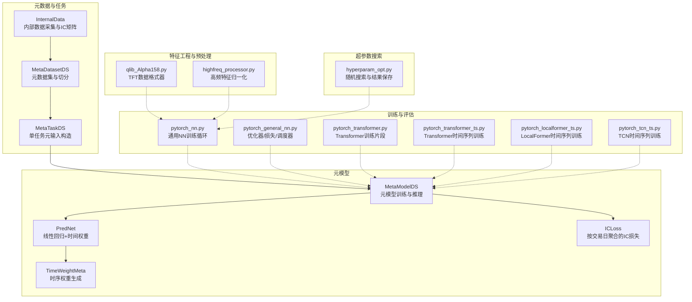
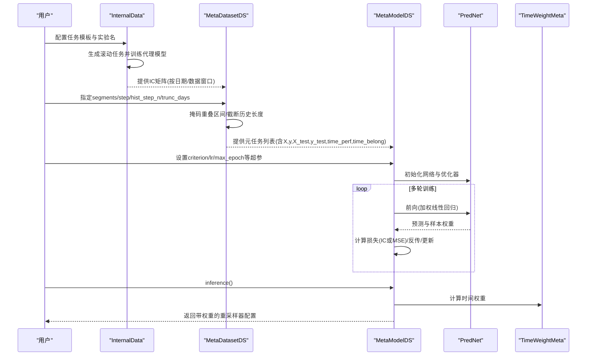
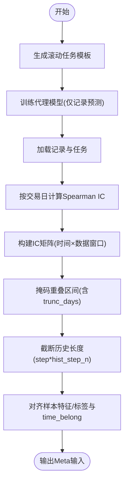
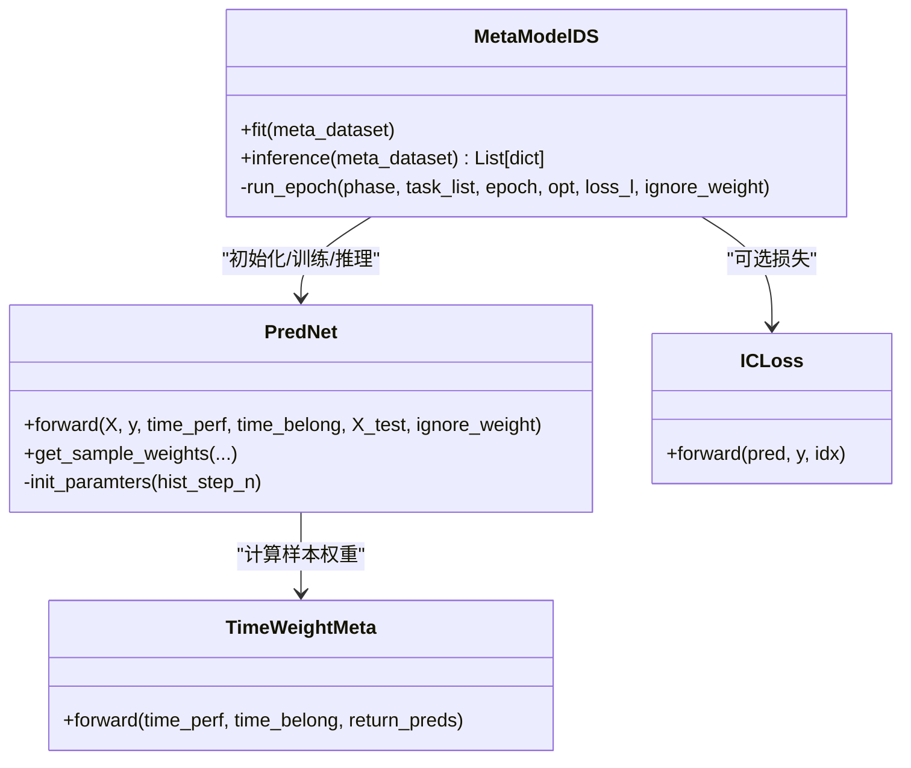
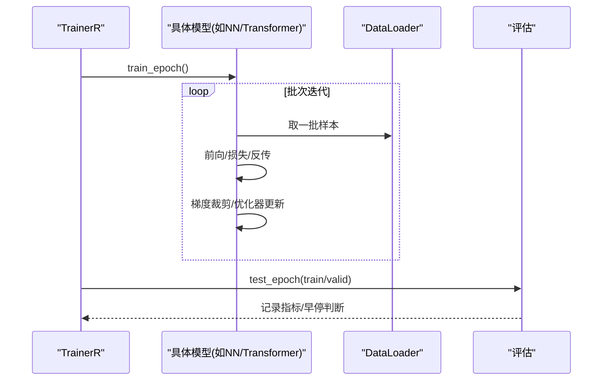
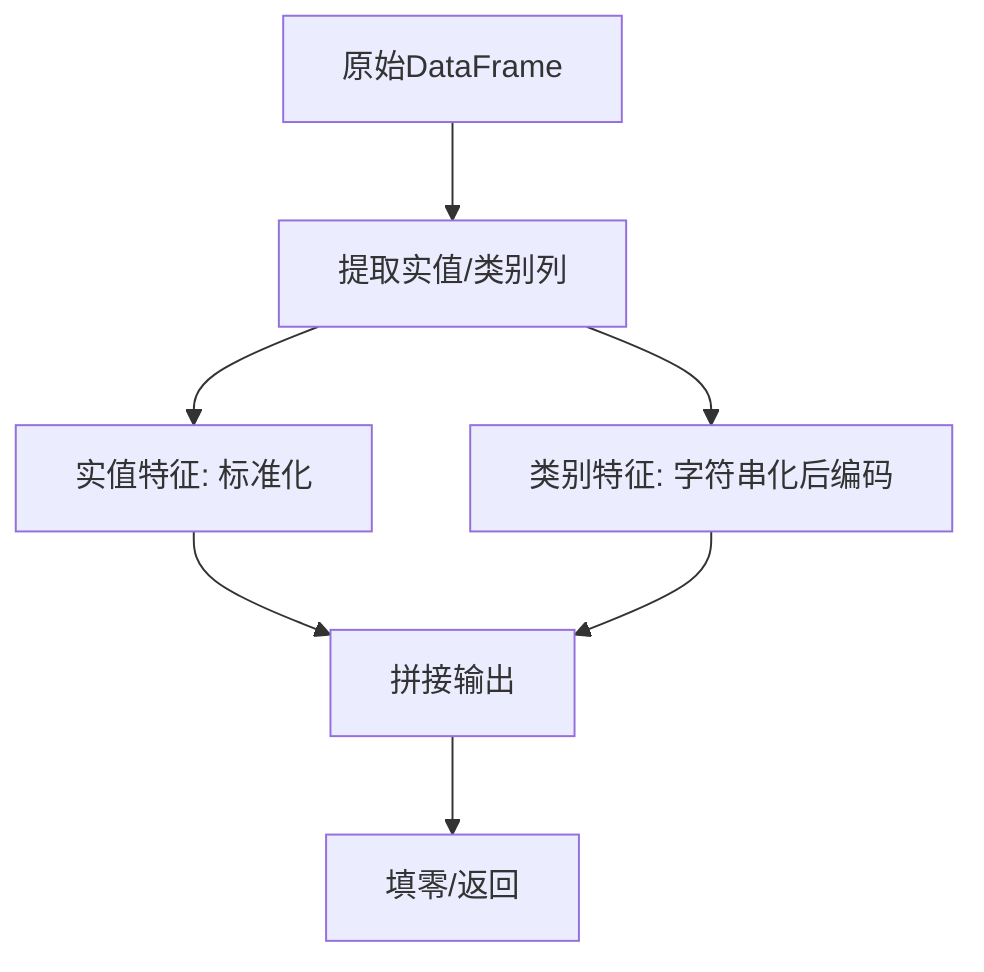
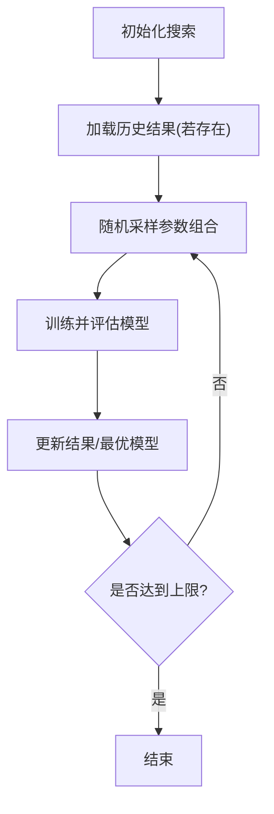
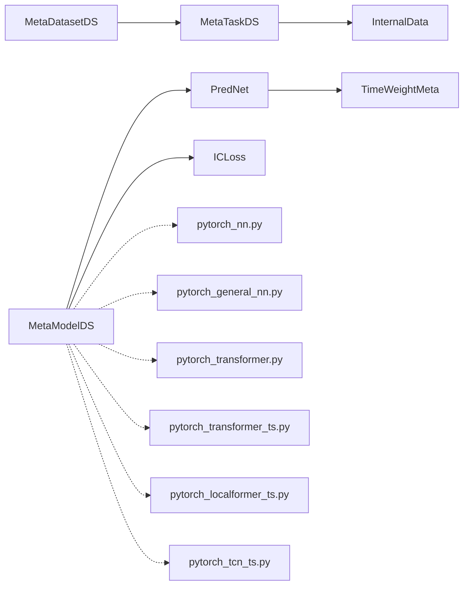

# 数据选择系统

<cite>
**本文引用的文件**
- [dataset.py](file://qlib/contrib/meta/data_selection/dataset.py)
- [model.py](file://qlib/contrib/meta/data_selection/model.py)
- [net.py](file://qlib/contrib/meta/data_selection/net.py)
- [utils.py](file://qlib/contrib/meta/data_selection/utils.py)
- [base.py](file://qlib/model/base.py)
- [pytorch_general_nn.py](file://qlib/contrib/model/pytorch_general_nn.py)
- [pytorch_nn.py](file://qlib/contrib/model/pytorch_nn.py)
- [pytorch_transformer.py](file://qlib/contrib/model/pytorch_transformer.py)
- [pytorch_transformer_ts.py](file://qlib/contrib/model/pytorch_transformer_ts.py)
- [pytorch_localformer_ts.py](file://qlib/contrib/model/pytorch_localformer_ts.py)
- [pytorch_tcn_ts.py](file://qlib/contrib/model/pytorch_tcn_ts.py)
- [hyperparam_opt.py](file://examples/benchmarks/TFT/libs/hyperparam_opt.py)
- [qlib_Alpha158.py](file://examples/benchmarks/TFT/data_formatters/qlib_Alpha158.py)
- [highfreq_processor.py](file://qlib/contrib/data/highfreq_processor.py)
- [base.py](file://qlib/contrib/rolling/base.py)
</cite>

## 目录
1. [引言](#引言)
2. [项目结构](#项目结构)
3. [核心组件](#核心组件)
4. [架构总览](#架构总览)
5. [详细组件分析](#详细组件分析)
6. [依赖分析](#依赖分析)
7. [性能考虑](#性能考虑)
8. [故障排查指南](#故障排查指南)
9. [结论](#结论)
10. [附录：使用示例与配置参数](#附录使用示例与配置参数)

## 引言
本文件面向希望在Qlib框架内构建“基于历史表现的数据选择系统”的工程师与研究者，系统性阐述以下内容：
- 基于历史表现的数据质量评估指标与选择策略
- 数据集构建过程（特征工程、数据预处理、样本平衡）
- 模型训练与验证流程（交叉验证、超参数调优、模型评估）
- 网络架构设计与训练技巧（损失函数、优化器、正则化）
- 实际使用示例与关键配置参数说明

该系统以“元学习”思想为核心，通过代理任务的历史IC（秩相关）表现，学习对样本权重进行动态重加权，从而实现“数据选择”。

## 项目结构
围绕数据选择系统的关键模块分布如下：
- 元数据与任务组织：MetaDatasetDS、MetaTaskDS、InternalData
- 元模型与推理：MetaModelDS、PredNet、TimeWeightMeta
- 损失与权重工具：ICLoss、preds_to_weight_with_clamp
- 训练与评估：通用PyTorch模型基类与若干典型模型实现
- 特征工程与预处理：TFT数据格式器、高频处理器
- 超参数搜索：随机搜索与结果记录
- 滚动实验：快速滚动训练与测试

**图示来源**
- [dataset.py:23-417](file://qlib/contrib/meta/data_selection/dataset.py#L23-L417)
- [model.py:40-197](file://qlib/contrib/meta/data_selection/model.py#L40-L197)
- [net.py:43-75](file://qlib/contrib/meta/data_selection/net.py#L43-L75)
- [utils.py:12-119](file://qlib/contrib/meta/data_selection/utils.py#L12-L119)
- [pytorch_general_nn.py:133-214](file://qlib/contrib/model/pytorch_general_nn.py#L133-L214)
- [pytorch_nn.py:289-314](file://qlib/contrib/model/pytorch_nn.py#L289-L314)
- [pytorch_transformer.py:82-122](file://qlib/contrib/model/pytorch_transformer.py#L82-L122)
- [pytorch_transformer_ts.py:156-193](file://qlib/contrib/model/pytorch_transformer_ts.py#L156-L193)
- [pytorch_localformer_ts.py:156-193](file://qlib/contrib/model/pytorch_localformer_ts.py#L156-L193)
- [pytorch_tcn_ts.py:217-246](file://qlib/contrib/model/pytorch_tcn_ts.py#L217-L246)
- [qlib_Alpha158.py:147-184](file://examples/benchmarks/TFT/data_formatters/qlib_Alpha158.py#L147-L184)
- [highfreq_processor.py:62-80](file://qlib/contrib/data/highfreq_processor.py#L62-L80)
- [hyperparam_opt.py:40-220](file://examples/benchmarks/TFT/libs/hyperparam_opt.py#L40-L220)

**章节来源**
- [dataset.py:23-417](file://qlib/contrib/meta/data_selection/dataset.py#L23-L417)
- [model.py:40-197](file://qlib/contrib/meta/data_selection/model.py#L40-L197)
- [net.py:43-75](file://qlib/contrib/meta/data_selection/net.py#L43-L75)
- [utils.py:12-119](file://qlib/contrib/meta/data_selection/utils.py#L12-L119)

## 核心组件
- InternalData：基于滚动任务模板训练代理模型，提取各数据窗口的IC序列，形成“数据相似度矩阵”，用于后续元学习。
- MetaTaskDS/MetaDatasetDS：将IC矩阵与样本特征/标签对齐，构造元学习输入（X/y/X_test/y_test/time_perf/time_belong），并进行历史步长截断与重叠掩码。
- MetaModelDS：元模型训练与推理入口，支持MSE或IC损失；输出按交易日聚合的IC作为评估指标；推理阶段返回带权重的重采样器配置。
- PredNet/TimeWeightMeta：线性回归+时间权重模块，通过历史IC均值学习样本权重，支持多种裁剪方式（tanh/clamp/sigmoid）。
- ICLoss：按交易日聚合计算秩相关损失，跳过样本过少或方差为零的日期，避免异常影响。

**章节来源**
- [dataset.py:23-417](file://qlib/contrib/meta/data_selection/dataset.py#L23-L417)
- [model.py:40-197](file://qlib/contrib/meta/data_selection/model.py#L40-L197)
- [net.py:43-75](file://qlib/contrib/meta/data_selection/net.py#L43-L75)
- [utils.py:12-119](file://qlib/contrib/meta/data_selection/utils.py#L12-L119)

## 架构总览
下图展示了从原始任务到元模型训练再到推理出数据权重的整体流程。

**图示来源**
- [dataset.py:29-120](file://qlib/contrib/meta/data_selection/dataset.py#L29-L120)
- [model.py:137-197](file://qlib/contrib/meta/data_selection/model.py#L137-L197)
- [net.py:65-70](file://qlib/contrib/meta/data_selection/net.py#L65-L70)
- [utils.py:12-64](file://qlib/contrib/meta/data_selection/utils.py#L12-L64)

## 详细组件分析

### 组件A：元数据与任务组织（InternalData/MetaTaskDS/MetaDatasetDS）
- InternalData负责：
  - 构造滚动任务模板，训练代理模型，仅保留预测结果；
  - 从记录中提取预测与标签，按交易日计算Spearman IC，得到IC矩阵；
  - 将IC矩阵按时间窗口对齐，便于后续元学习。
- MetaTaskDS/MetaDatasetDS负责：
  - 读取训练/测试样本，丢弃缺失过多样本；
  - 构造time_belong矩阵，将样本归属到对应数据窗口；
  - 对IC矩阵进行填充与掩码，确保不泄漏未来信息；
  - 输出标准化后的time_perf与样本级特征/标签。

**图示来源**
- [dataset.py:29-120](file://qlib/contrib/meta/data_selection/dataset.py#L29-L120)
- [dataset.py:331-417](file://qlib/contrib/meta/data_selection/dataset.py#L331-L417)

**章节来源**
- [dataset.py:23-417](file://qlib/contrib/meta/data_selection/dataset.py#L23-L417)

### 组件B：元模型与推理（MetaModelDS/PredNet/TimeWeightMeta）
- MetaModelDS：
  - 支持两种目标函数：MSE与IC Loss；
  - 训练前先跑一次无权重与初始化权重的基准评估；
  - 每轮记录loss与IC（按交易日聚合），并保存模型；
  - 推理阶段根据time_perf计算权重，包装为重采样器配置返回。
- PredNet：
  - 使用样本加权的最小二乘估计theta；
  - 通过TimeWeightMeta对历史IC进行加权，得到样本权重；
  - 支持正则化alpha对齐子模型。
- TimeWeightMeta：
  - 对历史IC做时间维平均，线性映射后经非线性裁剪得到权重；
  - 支持tanh/clamp/sigmoid三种裁剪方式与阈值控制。

**图示来源**
- [model.py:40-197](file://qlib/contrib/meta/data_selection/model.py#L40-L197)
- [net.py:43-75](file://qlib/contrib/meta/data_selection/net.py#L43-L75)
- [utils.py:12-119](file://qlib/contrib/meta/data_selection/utils.py#L12-L119)

**章节来源**
- [model.py:40-197](file://qlib/contrib/meta/data_selection/model.py#L40-L197)
- [net.py:43-75](file://qlib/contrib/meta/data_selection/net.py#L43-L75)
- [utils.py:12-119](file://qlib/contrib/meta/data_selection/utils.py#L12-L119)

### 组件C：训练与评估（通用与典型模型）
- 通用训练循环与评估：
  - 通用NN训练循环与指标记录；
  - 优化器/损失/梯度裁剪/学习率调度；
  - 时间序列模型的早停与最佳模型保存。
- 典型模型片段：
  - Transformer训练/评估循环；
  - LocalFormer/TCN时间序列训练循环。

**图示来源**
- [pytorch_general_nn.py:133-214](file://qlib/contrib/model/pytorch_general_nn.py#L133-L214)
- [pytorch_nn.py:289-314](file://qlib/contrib/model/pytorch_nn.py#L289-L314)
- [pytorch_transformer.py:82-122](file://qlib/contrib/model/pytorch_transformer.py#L82-L122)
- [pytorch_transformer_ts.py:156-193](file://qlib/contrib/model/pytorch_transformer_ts.py#L156-L193)
- [pytorch_localformer_ts.py:156-193](file://qlib/contrib/model/pytorch_localformer_ts.py#L156-L193)
- [pytorch_tcn_ts.py:217-246](file://qlib/contrib/model/pytorch_tcn_ts.py#L217-L246)

**章节来源**
- [pytorch_general_nn.py:133-214](file://qlib/contrib/model/pytorch_general_nn.py#L133-L214)
- [pytorch_nn.py:289-314](file://qlib/contrib/model/pytorch_nn.py#L289-L314)
- [pytorch_transformer.py:82-122](file://qlib/contrib/model/pytorch_transformer.py#L82-L122)
- [pytorch_transformer_ts.py:156-193](file://qlib/contrib/model/pytorch_transformer_ts.py#L156-L193)
- [pytorch_localformer_ts.py:156-193](file://qlib/contrib/model/pytorch_localformer_ts.py#L156-L193)
- [pytorch_tcn_ts.py:217-246](file://qlib/contrib/model/pytorch_tcn_ts.py#L217-L246)

### 组件D：特征工程与数据预处理
- TFT数据格式器：对实值与类别特征分别进行缩放与编码，统一输出格式；
- 高频处理器：对不同特征组进行分组归一化，并对成交量做log1p变换，最后填零。

**图示来源**
- [qlib_Alpha158.py:147-184](file://examples/benchmarks/TFT/data_formatters/qlib_Alpha158.py#L147-L184)
- [highfreq_processor.py:62-80](file://qlib/contrib/data/highfreq_processor.py#L62-L80)

**章节来源**
- [qlib_Alpha158.py:147-184](file://examples/benchmarks/TFT/data_formatters/qlib_Alpha158.py#L147-L184)
- [highfreq_processor.py:62-80](file://qlib/contrib/data/highfreq_processor.py#L62-L80)

### 组件E：超参数搜索与结果管理
- 随机搜索：定义参数范围与固定参数，自动加载历史结果，更新最优配置；
- 结果保存：记录验证损失与信息字段，必要时保存模型。

**图示来源**
- [hyperparam_opt.py:40-220](file://examples/benchmarks/TFT/libs/hyperparam_opt.py#L40-L220)

**章节来源**
- [hyperparam_opt.py:40-220](file://examples/benchmarks/TFT/libs/hyperparam_opt.py#L40-L220)

## 依赖分析
- 内部依赖：
  - MetaModelDS依赖PredNet与ICLoss；
  - PredNet依赖TimeWeightMeta与权重裁剪工具；
  - MetaDatasetDS依赖InternalData提供的IC矩阵与样本对齐；
  - 训练循环依赖通用模型基类与若干具体模型实现。
- 外部依赖：
  - PyTorch张量运算与优化器；
  - Qlib工作流记录与实验管理；
  - Joblib并行计算（InternalData中用于IC计算）。

**图示来源**
- [model.py:40-197](file://qlib/contrib/meta/data_selection/model.py#L40-L197)
- [net.py:43-75](file://qlib/contrib/meta/data_selection/net.py#L43-L75)
- [utils.py:12-119](file://qlib/contrib/meta/data_selection/utils.py#L12-L119)
- [dataset.py:23-417](file://qlib/contrib/meta/data_selection/dataset.py#L23-L417)
- [pytorch_general_nn.py:133-214](file://qlib/contrib/model/pytorch_general_nn.py#L133-L214)
- [pytorch_nn.py:289-314](file://qlib/contrib/model/pytorch_nn.py#L289-L314)
- [pytorch_transformer.py:82-122](file://qlib/contrib/model/pytorch_transformer.py#L82-L122)
- [pytorch_transformer_ts.py:156-193](file://qlib/contrib/model/pytorch_transformer_ts.py#L156-L193)
- [pytorch_localformer_ts.py:156-193](file://qlib/contrib/model/pytorch_localformer_ts.py#L156-L193)
- [pytorch_tcn_ts.py:217-246](file://qlib/contrib/model/pytorch_tcn_ts.py#L217-L246)

**章节来源**
- [model.py:40-197](file://qlib/contrib/meta/data_selection/model.py#L40-L197)
- [net.py:43-75](file://qlib/contrib/meta/data_selection/net.py#L43-L75)
- [utils.py:12-119](file://qlib/contrib/meta/data_selection/utils.py#L12-L119)
- [dataset.py:23-417](file://qlib/contrib/meta/data_selection/dataset.py#L23-L417)

## 性能考虑
- IC矩阵规模与内存：
  - MetaTaskDS在构造time_belong时会遍历样本索引切片，注意数据规模与时间窗口数量；
  - 建议合理设置hist_step_n与trunc_days，避免过大导致内存压力。
- 并行与加速：
  - InternalData中使用并行计算IC，建议根据CPU核数调整并行度；
  - 训练阶段可启用多进程DataLoader与GPU加速。
- 正则化与数值稳定：
  - PredNet在求解theta时加入正则项，有助于缓解病态问题；
  - ICLoss对小样本与零方差日期进行跳过，减少异常影响。
- 学习率与早停：
  - 采用ReduceLROnPlateau自适应调整学习率；
  - 时间序列模型支持早停，防止过拟合。

[本节为通用指导，无需特定文件分析]

## 故障排查指南
- IC矩阵为空或历史不足：
  - 检查segments与trunc_days设置，确保历史长度满足hist_step_n*step；
  - 若历史过短，抛出异常提示需要更长的时间序列。
- 样本被大量丢弃：
  - MetaTaskDS在构造时会检查测试集中有效样本比例，若过低会报错；
  - 建议检查数据清洗与缺失处理策略。
- ICLoss异常：
  - 当某日样本过少或标准差为零时会被跳过；
  - 若全部跳过，会触发异常，需检查数据分布与分组逻辑。
- NaN损失或权重异常：
  - 训练中显式校验NaN损失；
  - 权重裁剪参数clip_weight与clip_method需合理设置，避免极端权重。

**章节来源**
- [dataset.py:155-170](file://qlib/contrib/meta/data_selection/dataset.py#L155-L170)
- [dataset.py:380-384](file://qlib/contrib/meta/data_selection/dataset.py#L380-L384)
- [utils.py:56-64](file://qlib/contrib/meta/data_selection/utils.py#L56-L64)
- [model.py:106-107](file://qlib/contrib/meta/data_selection/model.py#L106-L107)

## 结论
本数据选择系统以“历史IC”为代理指标，结合元学习与线性回归，实现了对样本权重的自适应重加权。其优势在于：
- 利用代理模型的历史表现，避免直接建模复杂信号分布；
- 通过时间窗口对齐与掩码，有效规避信息泄漏；
- 支持多种损失与权重裁剪策略，兼顾鲁棒性与可解释性。

在工程实践中，建议优先保证IC矩阵的质量与时序覆盖，合理设置元学习超参，并结合超参数搜索与早停策略提升稳定性与泛化能力。

[本节为总结性内容，无需特定文件分析]

## 附录：使用示例与配置参数

### 使用示例（概念流程）
- 准备任务模板与滚动参数，运行InternalData生成IC矩阵；
- 构造MetaDatasetDS，指定segments/step/hist_step_n/trunc_days；
- 初始化MetaModelDS，设置criterion/lr/max_epoch等；
- fit训练后，调用inference获取带权重的任务配置；
- 在下游模型训练中应用TimeReweighter进行重采样。

[本节为概念流程说明，无需特定文件分析]

### 关键配置参数说明
- InternalData
  - task_tpl：任务模板
  - step：滚动步长
  - exp_name：实验名（用于缓存代理模型预测）
- MetaDatasetDS
  - task_tpl：任务模板或任务列表
  - step：滚动步长
  - trunc_days：测试起始处截断天数
  - rolling_ext_days：扩展滚动期
  - exp_name：实验名或InternalData实例
  - segments：训练/测试划分（浮点比例/字符串边界/区间）
  - hist_step_n：历史IC步数
  - task_mode：任务模式（全量/增量）
  - fill_method：IC矩阵填充方式（max/zero等）
- MetaModelDS
  - step：滚动步长
  - hist_step_n：历史IC步数
  - clip_method：权重裁剪方法（tanh/clamp/sigmoid）
  - clip_weight：裁剪阈值
  - criterion：损失类型（mse/ic_loss）
  - lr：学习率
  - max_epoch：最大训练轮数
  - seed：随机种子
  - alpha：正则化系数
  - loss_skip_thresh：IC损失中按日期聚合的样本阈值
- PredNet/TimeWeightMeta
  - hist_step_n：历史步数
  - clip_weight/clip_method：权重裁剪
  - alpha：正则化

**章节来源**
- [dataset.py:251-320](file://qlib/contrib/meta/data_selection/dataset.py#L251-L320)
- [model.py:45-72](file://qlib/contrib/meta/data_selection/model.py#L45-L72)
- [net.py:43-56](file://qlib/contrib/meta/data_selection/net.py#L43-L56)
- [utils.py:67-96](file://qlib/contrib/meta/data_selection/utils.py#L67-L96)