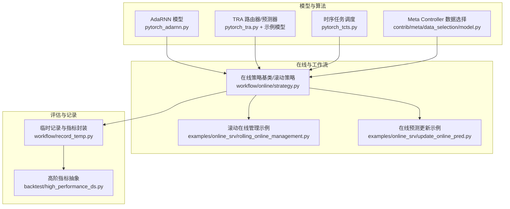
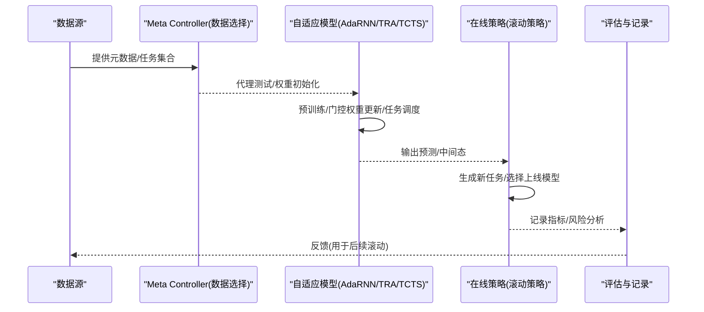
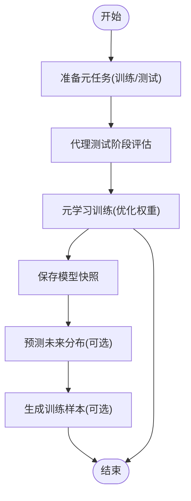
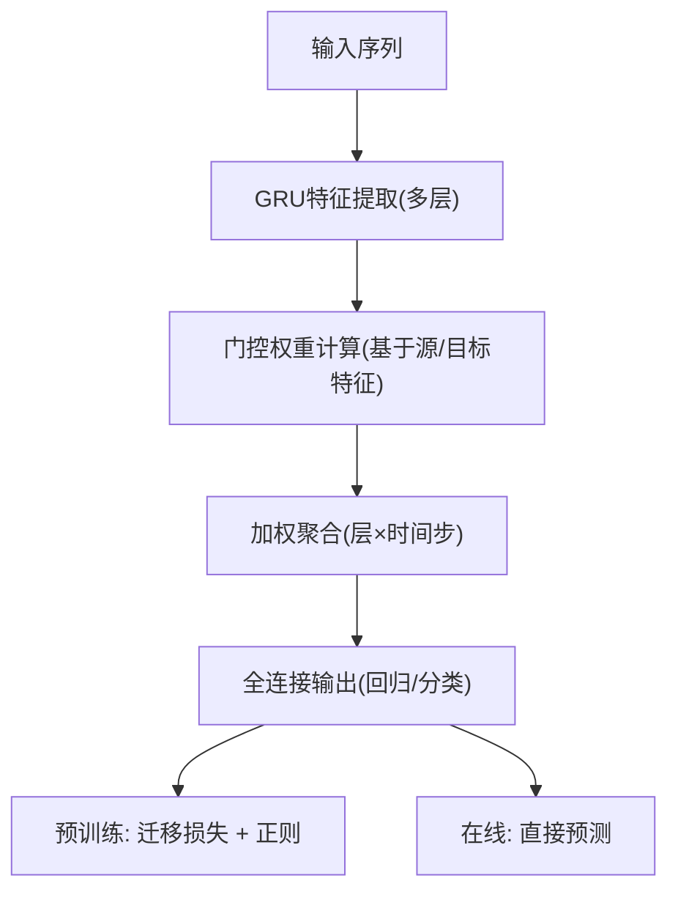
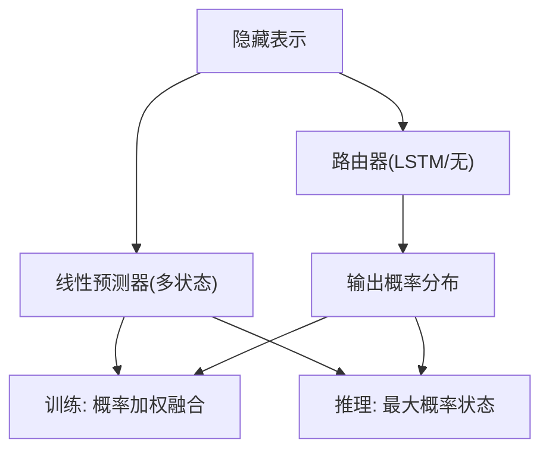
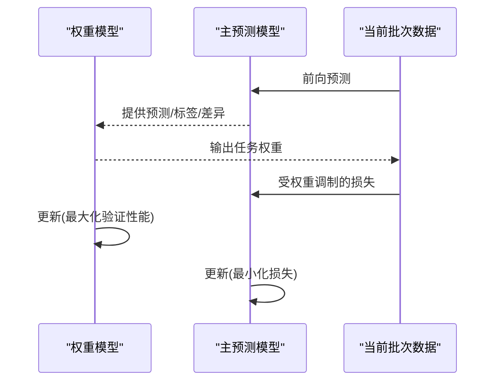
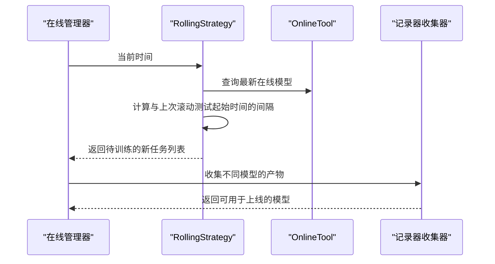
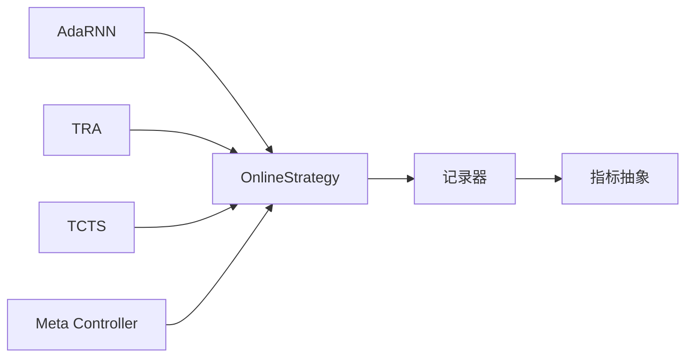

# 自适应学习机制

<cite>
**本文引用的文件**
- [pytorch_adarnn.py](file://qlib/contrib/model/pytorch_adarnn.py)
- [pytorch_tra.py](file://qlib/contrib/model/pytorch_tra.py)
- [pytorch_tcts.py](file://qlib/contrib/model/pytorch_tcts.py)
- [model.py](file://qlib/contrib/meta/data_selection/model.py)
- [strategy.py](file://qlib/workflow/online/strategy.py)
- [rolling_online_management.py](file://examples/online_srv/rolling_online_management.py)
- [update_online_pred.py](file://examples/online_srv/update_online_pred.py)
- [README.md（DDG-DA）](file://examples/benchmarks_dynamic/DDG-DA/README.md)
- [README.md（TCTS）](file://examples/benchmarks/TCTS/README.md)
- [README.md（ADARNN）](file://examples/benchmarks/ADARNN/README.md)
- [model.py（TRA 示例）](file://examples/benchmarks/TRA/src/model.py)
- [record_temp.py](file://qlib/workflow/record_temp.py)
- [high_performance_ds.py](file://qlib/backtest/high_performance_ds.py)
</cite>

## 目录
1. [引言](#引言)
2. [项目结构](#项目结构)
3. [核心组件](#核心组件)
4. [架构总览](#架构总览)
5. [详细组件分析](#详细组件分析)
6. [依赖关系分析](#依赖关系分析)
7. [性能考量](#性能考量)
8. [故障排查指南](#故障排查指南)
9. [结论](#结论)
10. [附录](#附录)

## 引言
本文件围绕Qlib中的自适应学习机制展开，系统梳理概念漂移检测与应对策略、模型切换与平滑过渡、自适应训练框架（学习率、权重更新、微调）、以及性能监控与评估体系，并结合仓库内的示例与实现给出可操作的最佳实践，帮助构建鲁棒的自适应量化系统。

## 项目结构
Qlib在“贡献模块”中提供了多种自适应学习相关实现，包括AdaRNN、TRA、TCTS、Meta Controller数据选择、以及在线滚动策略与示例脚本。这些组件共同构成了从数据分布预测、任务调度到模型在线滚动更新的完整闭环。

图示来源
- [pytorch_adarnn.py](file://qlib/contrib/model/pytorch_adarnn.py)
- [pytorch_tra.py](file://qlib/contrib/model/pytorch_tra.py)
- [pytorch_tcts.py](file://qlib/contrib/model/pytorch_tcts.py)
- [model.py](file://qlib/contrib/meta/data_selection/model.py)
- [strategy.py](file://qlib/workflow/online/strategy.py)
- [rolling_online_management.py](file://examples/online_srv/rolling_online_management.py)
- [update_online_pred.py](file://examples/online_srv/update_online_pred.py)
- [record_temp.py](file://qlib/workflow/record_temp.py)
- [high_performance_ds.py](file://qlib/backtest/high_performance_ds.py)

章节来源
- [pytorch_adarnn.py](file://qlib/contrib/model/pytorch_adarnn.py)
- [pytorch_tra.py](file://qlib/contrib/model/pytorch_tra.py)
- [pytorch_tcts.py](file://qlib/contrib/model/pytorch_tcts.py)
- [model.py](file://qlib/contrib/meta/data_selection/model.py)
- [strategy.py](file://qlib/workflow/online/strategy.py)
- [rolling_online_management.py](file://examples/online_srv/rolling_online_management.py)
- [update_online_pred.py](file://examples/online_srv/update_online_pred.py)
- [record_temp.py](file://qlib/workflow/record_temp.py)
- [high_performance_ds.py](file://qlib/backtest/high_performance_ds.py)

## 核心组件
- 概念漂移与数据分布预测
  - DDG-DA：通过Meta Controller预测未来数据分布并生成样本，提升模型对可预测性漂移的适应能力。
  - 参考：[README.md（DDG-DA）](file://examples/benchmarks_dynamic/DDG-DA/README.md)
- 自适应模型
  - AdaRNN：基于门控机制与迁移损失的自适应序列模型，支持预训练与权重更新。
  - TRA：多状态预测器+路由器，依据历史损失与潜在信息进行路由决策，实现自适应组合。
  - TCTS：时序相关辅助任务的可学习调度，通过双层优化实现任务选择与主任务训练协同。
  - 参考：[pytorch_adarnn.py](file://qlib/contrib/model/pytorch_adarnn.py)，[pytorch_tra.py](file://qlib/contrib/model/pytorch_tra.py)，[pytorch_tcts.py](file://qlib/contrib/model/pytorch_tcts.py)，[README.md（TCTS）](file://examples/benchmarks/TCTS/README.md)，[README.md（ADARNN）](file://examples/benchmarks/ADARNN/README.md)
- 在线滚动策略与更新
  - OnlineStrategy/RollingStrategy：按滚动窗口生成新任务、选择最新模型上线、在线更新预测。
  - 参考：[strategy.py](file://qlib/workflow/online/strategy.py)，[rolling_online_management.py](file://examples/online_srv/rolling_online_management.py)，[update_online_pred.py](file://examples/online_srv/update_online_pred.py)
- 性能监控与评估
  - 记录器与指标封装：提供指标序列化、风险分析、IC等可视化与分析入口。
  - 参考：[record_temp.py](file://qlib/workflow/record_temp.py)，[high_performance_ds.py](file://qlib/backtest/high_performance_ds.py)

章节来源
- [README.md（DDG-DA）](file://examples/benchmarks_dynamic/DDG-DA/README.md)
- [pytorch_adarnn.py](file://qlib/contrib/model/pytorch_adarnn.py)
- [pytorch_tra.py](file://qlib/contrib/model/pytorch_tra.py)
- [pytorch_tcts.py](file://qlib/contrib/model/pytorch_tcts.py)
- [README.md（TCTS）](file://examples/benchmarks/TCTS/README.md)
- [README.md（ADARNN）](file://examples/benchmarks/ADARNN/README.md)
- [strategy.py](file://qlib/workflow/online/strategy.py)
- [rolling_online_management.py](file://examples/online_srv/rolling_online_management.py)
- [update_online_pred.py](file://examples/online_srv/update_online_pred.py)
- [record_temp.py](file://qlib/workflow/record_temp.py)
- [high_performance_ds.py](file://qlib/backtest/high_performance_ds.py)

## 架构总览
下图展示了从数据到模型、再到在线策略与评估的整体流程，体现概念漂移检测与自适应切换的关键节点。

图示来源
- [model.py](file://qlib/contrib/meta/data_selection/model.py)
- [pytorch_adarnn.py](file://qlib/contrib/model/pytorch_adarnn.py)
- [pytorch_tra.py](file://qlib/contrib/model/pytorch_tra.py)
- [pytorch_tcts.py](file://qlib/contrib/model/pytorch_tcts.py)
- [strategy.py](file://qlib/workflow/online/strategy.py)
- [record_temp.py](file://qlib/workflow/record_temp.py)

## 详细组件分析

### 概念漂移检测与数据分布预测（DDG-DA + Meta Controller）
- 方法概述
  - 利用Meta Controller对任务进行元建模，通过代理测试与IC等指标评估不同阶段表现，为后续数据分布预测与样本生成提供依据。
  - 结合DDG-DA思想，预测未来数据分布趋势，提前生成训练样本以增强模型鲁棒性。
- 关键点
  - 代理测试阶段：记录测试起始时间、IC等指标，便于对比不同阶段性能。
  - 元学习权重更新：在训练过程中迭代优化权重，保存模型快照。
- 流程示意

图示来源
- [model.py](file://qlib/contrib/meta/data_selection/model.py)
- [README.md（DDG-DA）](file://examples/benchmarks_dynamic/DDG-DA/README.md)

章节来源
- [model.py](file://qlib/contrib/meta/data_selection/model.py)
- [README.md（DDG-DA）](file://examples/benchmarks_dynamic/DDG-DA/README.md)

### 自适应模型：AdaRNN（门控与迁移损失）
- 设计要点
  - 多层GRU特征提取，逐层输出用于门控权重计算。
  - 基于源/目标域特征的距离度量（如MMD/余弦），动态调整各层的时间步权重。
  - 支持预训练阶段与在线预测阶段的分离处理。
- 学习与更新
  - 预训练：计算迁移损失并累加，作为正则项参与训练。
  - 在线：根据当前输入进行前向推理，得到最终预测。
- 流程示意

图示来源
- [pytorch_adarnn.py](file://qlib/contrib/model/pytorch_adarnn.py)

章节来源
- [pytorch_adarnn.py](file://qlib/contrib/model/pytorch_adarnn.py)

### 自适应模型：TRA（多状态预测器+路由器）
- 设计要点
  - 单一预测器或多个状态的预测器集合；当状态数>1时，引入路由器（如LSTM）依据历史损失与潜在信息进行概率分配。
  - 前向过程：线性预测器输出多状态预测，路由器输出概率分布，训练时采用软化Gumbel-Softmax，推理时选择最大概率对应的状态。
- 关键接口
  - 初始化：设置状态数、温度参数、RNN架构与信息源类型（LR/TPE/LR_TPE）。
  - 前向：返回最终预测、各状态预测与概率。
- 流程示意

图示来源
- [pytorch_tra.py](file://qlib/contrib/model/pytorch_tra.py)
- [model.py（TRA 示例）](file://examples/benchmarks/TRA/src/model.py)

章节来源
- [pytorch_tra.py](file://qlib/contrib/model/pytorch_tra.py)
- [model.py（TRA 示例）](file://examples/benchmarks/TRA/src/model.py)

### 自适应模型：TCTS（时序相关任务调度）
- 设计要点
  - 主任务模型与可学习权重模型解耦：前者负责预测，后者根据当前批次的残差、标签、预测值与任务嵌入等特征输出任务权重。
  - 双层优化：权重模型最大化验证性能，主模型最小化受权重调制的损失。
- 关键接口
  - 训练阶段：计算初始预测与当前预测差异，拼接特征后输出权重，反传更新权重模型。
  - 测试阶段：评估平均损失，用于性能监控。
- 流程示意

图示来源
- [pytorch_tcts.py](file://qlib/contrib/model/pytorch_tcts.py)
- [README.md（TCTS）](file://examples/benchmarks/TCTS/README.md)

章节来源
- [pytorch_tcts.py](file://qlib/contrib/model/pytorch_tcts.py)
- [README.md（TCTS）](file://examples/benchmarks/TCTS/README.md)

### 在线策略与模型切换（RollingStrategy）
- 设计要点
  - OnlineStrategy定义通用接口：首次任务生成、新任务准备、在线模型选择与收集器配置。
  - RollingStrategy默认策略：始终使用最新的滚动模型作为在线模型；按当前时间与最后滚动测试起始时间间隔决定是否生成后续任务。
- 关键流程

图示来源
- [strategy.py](file://qlib/workflow/online/strategy.py)
- [rolling_online_management.py](file://examples/online_srv/rolling_online_management.py)
- [update_online_pred.py](file://examples/online_srv/update_online_pred.py)

章节来源
- [strategy.py](file://qlib/workflow/online/strategy.py)
- [rolling_online_management.py](file://examples/online_srv/rolling_online_management.py)
- [update_online_pred.py](file://examples/online_srv/update_online_pred.py)

### 性能监控与评估体系
- 指标封装
  - 临时记录器：支持序列化指标对象、风险分析、IC等。
  - 指标抽象：提供单指标运算、系列获取、索引数据访问等接口，便于扩展。
- 实践建议
  - 将IC、收益、成本、换手等纳入记录器，定期生成报告图表。
  - 对滚动策略的性能进行分频率分析，关注异常波动并触发预警。

章节来源
- [record_temp.py](file://qlib/workflow/record_temp.py)
- [high_performance_ds.py](file://qlib/backtest/high_performance_ds.py)

## 依赖关系分析
- 组件内聚与耦合
  - AdaRNN/TRA/TCTS均为独立模型实现，通过统一的训练/推理接口与在线策略对接。
  - Meta Controller与在线策略通过记录器与评估指标形成弱耦合的数据反馈链路。
- 外部依赖
  - 在线策略依赖记录器与工具类完成模型选择与预测更新。
  - 评估模块依赖回测与记录器提供的指标数据。

图示来源
- [pytorch_adarnn.py](file://qlib/contrib/model/pytorch_adarnn.py)
- [pytorch_tra.py](file://qlib/contrib/model/pytorch_tra.py)
- [pytorch_tcts.py](file://qlib/contrib/model/pytorch_tcts.py)
- [model.py](file://qlib/contrib/meta/data_selection/model.py)
- [strategy.py](file://qlib/workflow/online/strategy.py)
- [record_temp.py](file://qlib/workflow/record_temp.py)
- [high_performance_ds.py](file://qlib/backtest/high_performance_ds.py)

## 性能考量
- 训练稳定性
  - AdaRNN的门控权重使用归一化与软激活，避免梯度爆炸；TCTS的权重模型采用裁剪与对数似然约束，提升稳定性。
- 在线切换成本
  - RollingStrategy默认“总是使用最新滚动模型”，可降低切换复杂度；若需平滑过渡，可在策略中引入权重混合或延迟切换。
- 评估效率
  - 使用记录器批量收集指标，避免重复计算；对高频指标（如IC）进行缓存与增量更新。

## 故障排查指南
- 常见问题
  - NaN损失：Meta Controller训练中显式检查NaN并抛出断言，需检查数据质量与损失函数设置。
  - 指标缺失：记录器在某些频率下可能未生成报告，需确认环境配置与分析频率设置。
- 定位步骤
  - 检查记录器产物是否存在；核对评估频率与回测配置。
  - 对比不同滚动窗口的IC变化，定位性能退化区间。

章节来源
- [model.py](file://qlib/contrib/meta/data_selection/model.py)
- [record_temp.py](file://qlib/workflow/record_temp.py)

## 结论
Qlib在自适应学习方面提供了从概念漂移预测、多模型自适应到在线滚动更新的完整方案。通过AdaRNN的门控与迁移损失、TRA的概率路由、TCTS的任务调度与Meta Controller的权重优化，配合在线策略与评估体系，能够有效应对非平稳市场带来的挑战。实践中建议结合业务场景选择合适的自适应模型，并以记录器与指标体系持续监控性能，确保系统的鲁棒性与可解释性。

## 附录
- 应用案例与最佳实践
  - 使用DDG-DA与Meta Controller进行数据分布预测与样本生成，提升模型对可预测性漂移的适应能力。
  - 在线滚动策略：每日/每周生成新任务，基于最新滚动窗口选择最优模型上线；对关键指标设置阈值预警。
  - 模型微调：在AdaRNN中启用预训练阶段的迁移损失，在TRA中引入路由器的历史损失信息，在TCTS中利用双层优化提升任务调度效果。