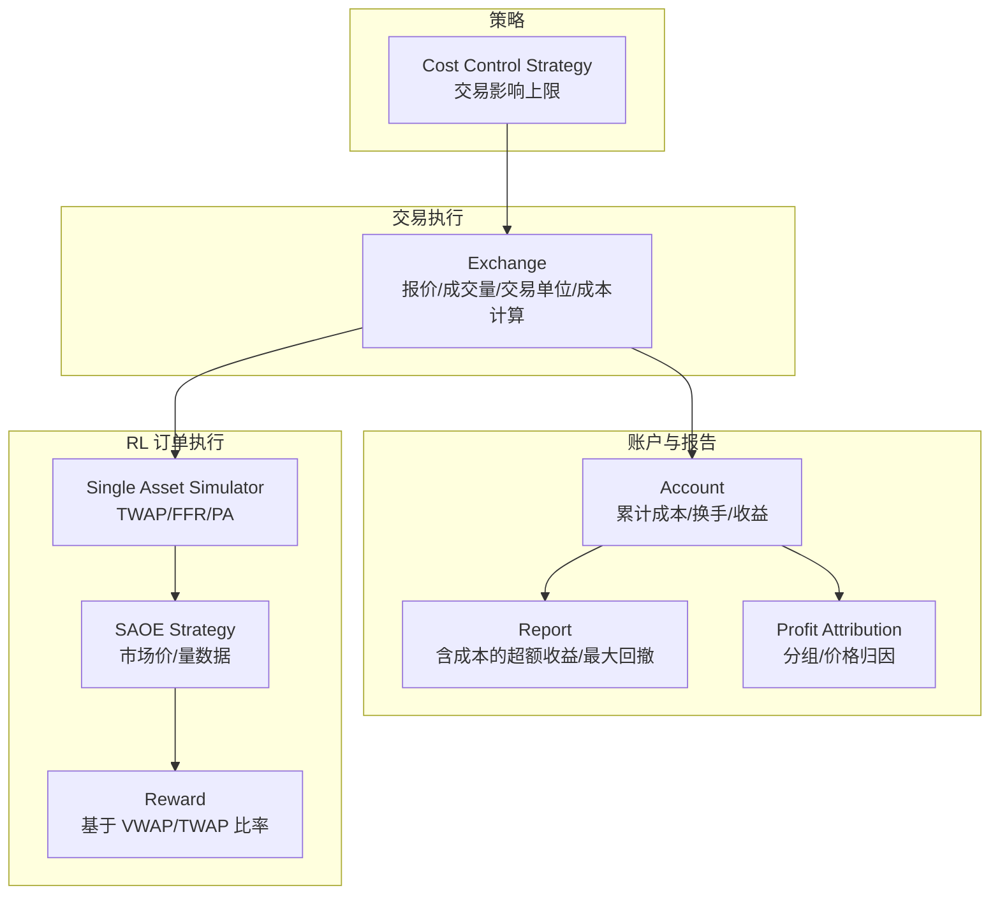
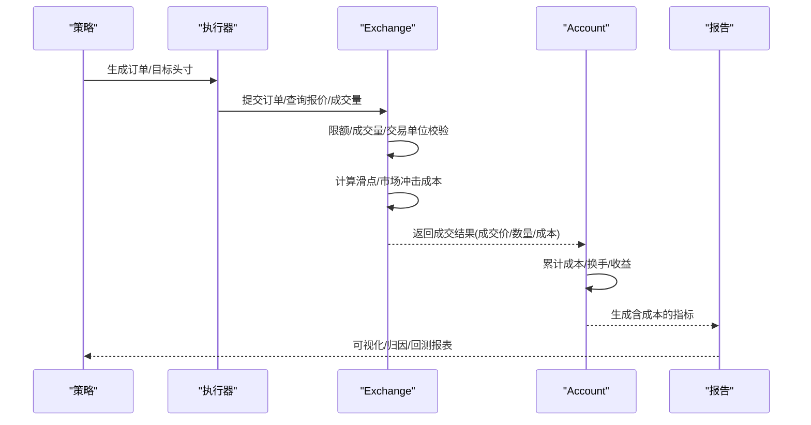
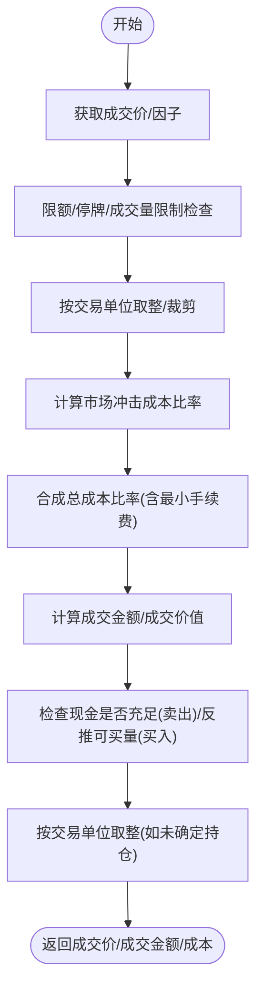
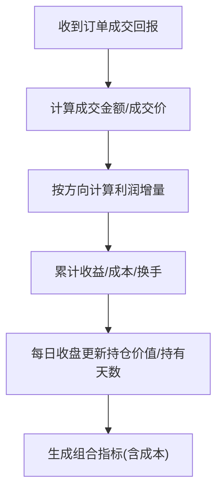
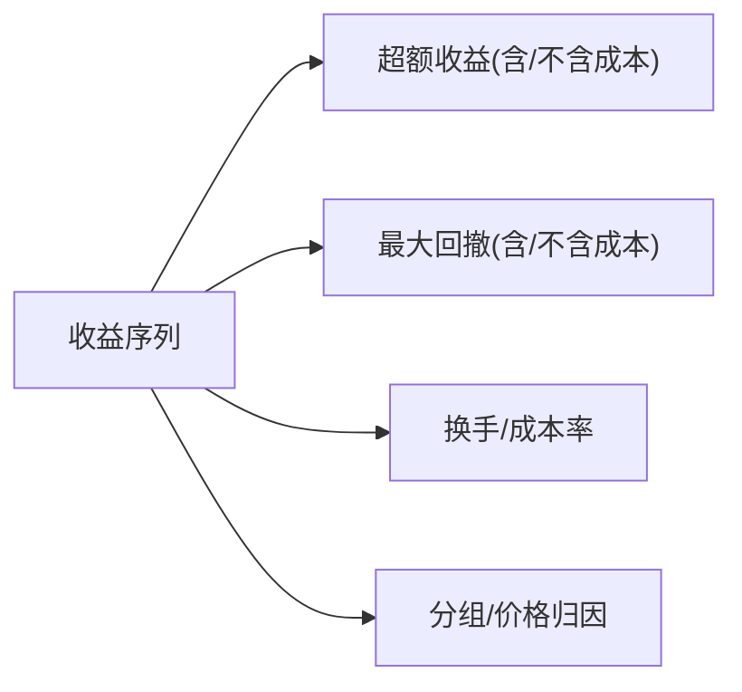
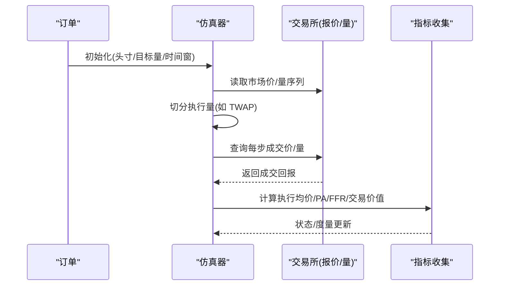
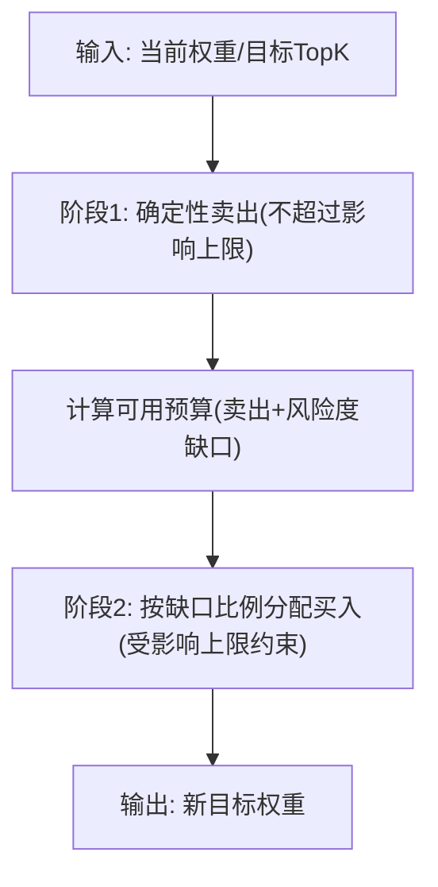
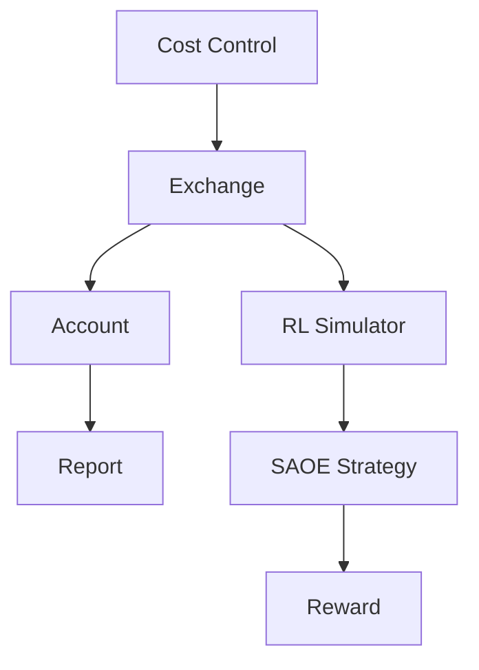

# 交易成本建模

<cite>
**本文引用的文件**   
- [exchange.py](file://qlib/backtest/exchange.py)
- [account.py](file://qlib/backtest/account.py)
- [__init__.py](file://qlib/backtest/__init__.py)
- [report.py](file://qlib/backtest/report.py)
- [profit_attribution.py](file://qlib/backtest/profit_attribution.py)
- [cost_control.py](file://qlib/contrib/strategy/cost_control.py)
- [simulator_simple.py](file://qlib/rl/order_execution/simulator_simple.py)
- [strategy.py](file://qlib/rl/order_execution/strategy.py)
- [reward.py](file://qlib/rl/order_execution/reward.py)
- [report.py（分析持仓）](file://qlib/contrib/report/analysis_position/report.py)
- [risk_analysis.py（分析持仓）](file://qlib/contrib/report/analysis_position/risk_analysis.py)
</cite>

## 目录
1. [引言](#引言)
2. [项目结构](#项目结构)
3. [核心组件](#核心组件)
4. [架构总览](#架构总览)
5. [详细组件分析](#详细组件分析)
6. [依赖分析](#依赖分析)
7. [性能考量](#性能考量)
8. [故障排查指南](#故障排查指南)
9. [结论](#结论)
10. [附录：配置与参数调优](#附录配置与参数调优)

## 引言
本文件系统化梳理 Qlib 的交易成本建模能力，覆盖买卖价差、印花税、过户费、佣金等固定与比例费用，滑点/市场冲击成本的建模与计算，以及在不同市场（A 股、美股、期货）下的差异化配置建议。同时给出成本优化策略、参数调优最佳实践与常见问题的排查路径。

## 项目结构
围绕交易成本建模的关键模块如下：
- 交易执行层：Exchange 负责报价、成交量约束、交易单位、滑点/冲击成本计算与成交更新
- 账户与指标：Account 累计成本、换手、收益；报告模块产出含成本的超额收益与最大回撤等指标
- 订单执行仿真：RL 单资产订单执行仿真器与策略，支持 TWAP、FFR、PA 等指标
- 成本控制策略：软 Top-K 再平衡中引入“交易影响上限”，避免单笔冲击过大
- 收益归因：按组/价格等维度分解收益来源，辅助评估成本对收益的影响

**图表来源**
- [exchange.py](file://qlib/backtest/exchange.py)
- [account.py](file://qlib/backtest/account.py)
- [report.py](file://qlib/backtest/report.py)
- [profit_attribution.py](file://qlib/backtest/profit_attribution.py)
- [simulator_simple.py](file://qlib/rl/order_execution/simulator_simple.py)
- [strategy.py](file://qlib/rl/order_execution/strategy.py)
- [reward.py](file://qlib/rl/order_execution/reward.py)
- [cost_control.py](file://qlib/contrib/strategy/cost_control.py)

**章节来源**
- [exchange.py](file://qlib/backtest/exchange.py)
- [account.py](file://qlib/backtest/account.py)
- [report.py](file://qlib/backtest/report.py)
- [profit_attribution.py](file://qlib/backtest/profit_attribution.py)
- [simulator_simple.py](file://qlib/rl/order_execution/simulator_simple.py)
- [strategy.py](file://qlib/rl/order_execution/strategy.py)
- [reward.py](file://qlib/rl/order_execution/reward.py)
- [cost_control.py](file://qlib/contrib/strategy/cost_control.py)

## 核心组件
- 交易成本构成
  - 开仓/平仓费率（比例）、最小手续费（绝对）
  - 市场冲击/滑点（比例），随交易额占当日成交额的比例平方增长
- 成交流程
  - 限额检查（涨跌停/停牌）、成交量限制、交易单位取整
  - 计算成交均价、成交金额、成本（含最小手续费兜底）
- 报告与归因
  - 累计成本、换手、超额收益（含/不含成本）、最大回撤
  - 分组/价格归因，辅助定位成本对收益的拖累来源

**章节来源**
- [exchange.py](file://qlib/backtest/exchange.py)
- [account.py](file://qlib/backtest/account.py)
- [report.py](file://qlib/backtest/report.py)
- [report.py（分析持仓）](file://qlib/contrib/report/analysis_position/report.py)
- [risk_analysis.py（分析持仓）](file://qlib/contrib/report/analysis_position/risk_analysis.py)

## 架构总览
下图展示从策略到执行再到报告的成本闭环：

**图表来源**
- [exchange.py](file://qlib/backtest/exchange.py)
- [account.py](file://qlib/backtest/account.py)
- [report.py](file://qlib/backtest/report.py)

## 详细组件分析

### 交易执行器（Exchange）与成本计算
- 关键参数
  - 开仓费率、平仓费率、最小手续费、市场冲击系数
- 成交步骤
  - 获取成交价（支持买/卖价或统一成交价）
  - 依据涨跌停/停牌/成交量限制裁剪订单
  - 计算交易额占当日总成交额的比例，得到调整后的冲击成本比率
  - 合成总成本比率（开仓/平仓费率 ± 冲击项），并以最小手续费兜底
  - 对于卖出，进一步按当前持仓裁剪成交数量，并确保现金充足
  - 对于买入，按可用资金与成本比率反推可成交数量，必要时取整至交易单位
- 交易单位与因子
  - 支持按因子与交易单位进行取整，避免非整数手成交

**图表来源**
- [exchange.py](file://qlib/backtest/exchange.py)

**章节来源**
- [exchange.py](file://qlib/backtest/exchange.py)

### 账户与累计指标（Account）
- 累计指标
  - 累计收益（不含成本）、累计成本、累计换手
- 更新逻辑
  - 按订单方向分别计算利润贡献，记录当期换手与成本
  - 在每日收盘后，根据持仓市值变化更新收益，使“收益”与“收益-成本=净值变化”的视角一致
- 报告联动
  - 与报告模块配合，输出含成本的超额收益序列与最大回撤

**图表来源**
- [account.py](file://qlib/backtest/account.py)

**章节来源**
- [account.py](file://qlib/backtest/account.py)

### 报告与归因（含成本）
- 报告指标
  - 超额收益（含/不含成本）、最大回撤（含/不含成本）
  - 换手率、成本率等
- 收益归因
  - 按行业/价格等维度分解收益，识别成本对收益的拖累

**图表来源**
- [report.py](file://qlib/backtest/report.py)
- [report.py（分析持仓）](file://qlib/contrib/report/analysis_position/report.py)
- [risk_analysis.py（分析持仓）](file://qlib/contrib/report/analysis_position/risk_analysis.py)

**章节来源**
- [report.py](file://qlib/backtest/report.py)
- [report.py（分析持仓）](file://qlib/contrib/report/analysis_position/report.py)
- [risk_analysis.py（分析持仓）](file://qlib/contrib/report/analysis_position/risk_analysis.py)

### RL 单资产订单执行仿真（滑点/市场冲击）
- 模型要点
  - 使用市场价与成交量序列驱动执行
  - 计算执行均价、TWAP、价格优势（Price Advantage, PA）与完成率（Fill Frequency Rate, FFR）
  - 奖励函数基于 VWAP/TWAP 比率，引导策略在可接受范围内执行
- 指标
  - 执行均价、交易价值、剩余头寸、PA、FFR、市场价/量统计

**图表来源**
- [simulator_simple.py](file://qlib/rl/order_execution/simulator_simple.py)
- [strategy.py](file://qlib/rl/order_execution/strategy.py)
- [reward.py](file://qlib/rl/order_execution/reward.py)

**章节来源**
- [simulator_simple.py](file://qlib/rl/order_execution/simulator_simple.py)
- [strategy.py](file://qlib/rl/order_execution/strategy.py)
- [reward.py](file://qlib/rl/order_execution/reward.py)

### 成本控制策略（SoftTopk）
- 目标
  - 在预算约束下进行再平衡，通过“交易影响上限”限制单次权重变动，降低冲击
- 关键机制
  - 先行卖出不超过上限的头寸，回收资金
  - 在剩余预算内按缺口比例分配买入额度，并受“影响上限”约束
  - 保证买入/卖出同步性与确定性

**图表来源**
- [cost_control.py](file://qlib/contrib/strategy/cost_control.py)

**章节来源**
- [cost_control.py](file://qlib/contrib/strategy/cost_control.py)

## 依赖分析
- 组件耦合
  - Exchange 与 Account：成交回报驱动累计指标
  - Account 与 Report：提供报告所需的成本/换手/收益序列
  - RL 仿真与 Exchange：通过市场价/量接口模拟真实冲击
  - SoftTopk 与 Exchange：通过交易影响上限降低冲击
- 外部依赖
  - 数据源：通过 D.features 获取报价、成交量、因子等字段
  - 配置：可通过 backtest.__init__ 中的 exchange_kwargs 注入成本参数

**图表来源**
- [exchange.py](file://qlib/backtest/exchange.py)
- [account.py](file://qlib/backtest/account.py)
- [report.py](file://qlib/backtest/report.py)
- [simulator_simple.py](file://qlib/rl/order_execution/simulator_simple.py)
- [strategy.py](file://qlib/rl/order_execution/strategy.py)
- [reward.py](file://qlib/rl/order_execution/reward.py)
- [cost_control.py](file://qlib/contrib/strategy/cost_control.py)

**章节来源**
- [__init__.py](file://qlib/backtest/__init__.py)
- [exchange.py](file://qlib/backtest/exchange.py)
- [account.py](file://qlib/backtest/account.py)
- [report.py](file://qlib/backtest/report.py)

## 性能考量
- 成本计算复杂度
  - 主要为 O(N) 的报价/成交量查询与一次滑点比率计算
- 仿真执行
  - RL 仿真按时间切片迭代，注意市场价/量序列长度与执行步长匹配
- 报告与归因
  - 分组/价格归因需前向填充缺失值，注意时间窗口扩展带来的内存与计算压力

[本节为通用指导，不直接分析具体文件]

## 故障排查指南
- 成交量限制导致订单被裁剪
  - 现象：订单成交数量小于预期
  - 排查：检查 volume_threshold 配置与当日累计成交量
  - 参考路径：[exchange.py](file://qlib/backtest/exchange.py)
- 现金不足导致无法成交
  - 现象：买入订单被裁剪或成交为 0
  - 排查：核对最小手续费与成本比率，确认可用资金是否覆盖
  - 参考路径：[exchange.py](file://qlib/backtest/exchange.py)
- 滑点/冲击异常放大
  - 现象：成交均价显著偏离市场均价
  - 排查：检查 impact_cost 参数设置与交易额占比
  - 参考路径：[exchange.py](file://qlib/backtest/exchange.py)
- RL 仿真执行异常
  - 现象：执行量非法或完成率异常
  - 排查：检查时间切片、执行量切分策略与 TWAP 参数
  - 参考路径：[simulator_simple.py](file://qlib/rl/order_execution/simulator_simple.py)
- 报告中成本/超额收益异常
  - 现象：成本率过高或超额收益为负但波动异常
  - 排查：核对最小手续费、费率与交易单位设置，检查归因字段是否缺失
  - 参考路径：[report.py](file://qlib/backtest/report.py)、[report.py（分析持仓）](file://qlib/contrib/report/analysis_position/report.py)

**章节来源**
- [exchange.py](file://qlib/backtest/exchange.py)
- [simulator_simple.py](file://qlib/rl/order_execution/simulator_simple.py)
- [report.py](file://qlib/backtest/report.py)
- [report.py（分析持仓）](file://qlib/contrib/report/analysis_position/report.py)

## 结论
Qlib 的交易成本建模以 Exchange 为核心，结合 Account 的累计指标与 RL 仿真，形成从策略到执行再到报告的完整闭环。通过比例+最小费用的组合、基于交易额占比的市场冲击模型，以及 SoftTopk 等成本控制策略，能够在不同市场环境下有效刻画交易成本并指导优化。

[本节为总结性内容，不直接分析具体文件]

## 附录：配置与参数调优

### 参数定义与默认值
- 开仓费率、平仓费率、最小手续费、市场冲击系数
- 交易单位与因子用于取整
- 参考路径：[exchange.py](file://qlib/backtest/exchange.py)、[__init__.py](file://qlib/backtest/__init__.py)

### 不同市场环境的差异化配置建议
- A 股
  - 开仓/平仓费率：参考默认值
  - 印花税：通常为卖出单边收取，可在平仓成本中体现
  - 过户费：按成交金额万分之几，可作为最小手续费或单独建模
  - 交易单位：100 股
  - 参考路径：[exchange.py](file://qlib/backtest/exchange.py)
- 美股
  - 佣金：按笔或按比例，建议设为较小比例并配最小手续费
  - 印花税：通常无
  - 交易单位：按股
  - 参考路径：[exchange.py](file://qlib/backtest/exchange.py)
- 期货
  - 交易单位：按合约乘数
  - 保证金与手续费：可将保证金视为机会成本，手续费纳入最小费用
  - 参考路径：[exchange.py](file://qlib/backtest/exchange.py)

### 成本优化策略与参数调优
- 降低冲击
  - 减小 impact_cost 或采用时间分散执行（TWAP/Volume-Weighted）
  - 使用 SoftTopk 的交易影响上限，限制单次权重变动
  - 参考路径：[exchange.py](file://qlib/backtest/exchange.py)、[cost_control.py](file://qlib/contrib/strategy/cost_control.py)
- 控制最小费用侵蚀
  - 合理设置最小手续费，避免过低导致频繁小额交易
  - 参考路径：[exchange.py](file://qlib/backtest/exchange.py)
- 报告与归因验证
  - 对比含/不含成本的超额收益与最大回撤，定位成本拖累来源
  - 参考路径：[report.py](file://qlib/backtest/report.py)、[report.py（分析持仓）](file://qlib/contrib/report/analysis_position/report.py)

**章节来源**
- [exchange.py](file://qlib/backtest/exchange.py)
- [cost_control.py](file://qlib/contrib/strategy/cost_control.py)
- [report.py](file://qlib/backtest/report.py)
- [report.py（分析持仓）](file://qlib/contrib/report/analysis_position/report.py)