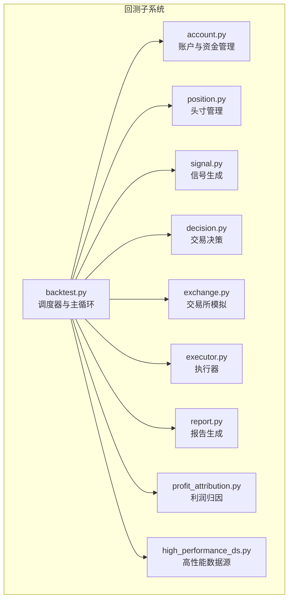
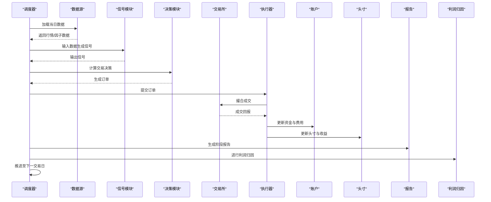
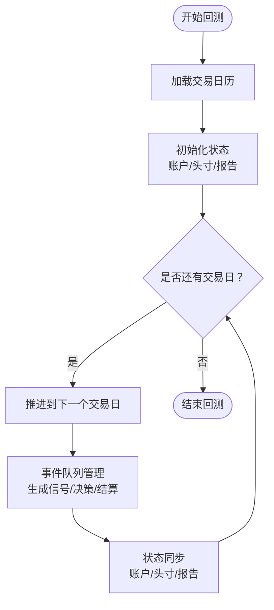
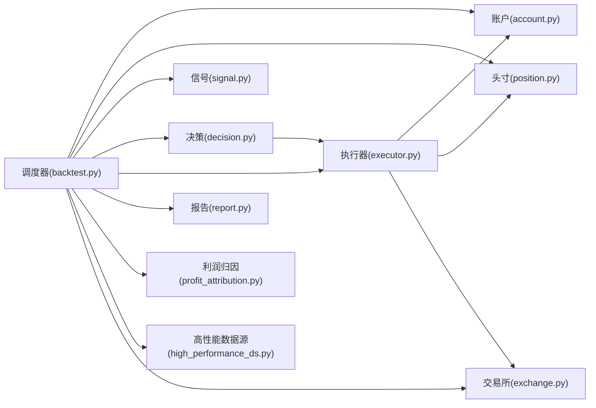

# 回测引擎架构

<cite>
**本文引用的文件**
- [backtest.py](file://qlib/backtest/backtest.py)
- [account.py](file://qlib/backtest/account.py)
- [position.py](file://qlib/backtest/position.py)
- [decision.py](file://qlib/backtest/decision.py)
- [exchange.py](file://qlib/backtest/exchange.py)
- [executor.py](file://qlib/backtest/executor.py)
- [signal.py](file://qlib/backtest/signal.py)
- [report.py](file://qlib/backtest/report.py)
- [profit_attribution.py](file://qlib/backtest/profit_attribution.py)
- [high_performance_ds.py](file://qlib/backtest/high_performance_ds.py)
- [__init__.py](file://qlib/backtest/__init__.py)
- [workflow.py](file://examples/workflow_by_code.py)
- [workflow_config_lightgbm_multi_freq.yaml](file://examples/benchmarks/LightGBM/workflow_config_lightgbm_multi_freq.yaml)
- [workflow_config_lightgbm_multi_freq.yaml](file://examples/benchmarks/LightGBM/workflow_config_lightgbm_multi_freq.yaml)
</cite>

## 目录
1. [引言](#引言)
2. [项目结构](#项目结构)
3. [核心组件](#核心组件)
4. [架构总览](#架构总览)
5. [详细组件分析](#详细组件分析)
6. [依赖分析](#依赖分析)
7. [性能考虑](#性能考虑)
8. [故障排查指南](#故障排查指南)
9. [结论](#结论)
10. [附录](#附录)

## 引言
本文件系统性梳理 Qlib 回测引擎的架构与实现，重点覆盖以下方面：
- 时间推进机制：如何在回测中按日推进市场时间，驱动事件队列与状态更新。
- 事件驱动架构：事件类型、事件队列管理、调度器的执行循环。
- 数据流处理：从数据提供器到信号生成、决策、执行、报告的完整链路。
- 回测调度器工作原理：日期循环、事件队列管理、状态同步与一致性保障。
- 配置参数设计：交易频率、数据加载策略、内存管理等。
- 初始化与启动流程：从配置到回测运行的端到端步骤与最佳实践。
- 组件交互：与数据提供器、模型预测器、执行器等的集成方式。

## 项目结构
回测子系统位于 qlib/backtest 目录，采用模块化设计，围绕“账户、头寸、信号、决策、交易所、执行器、报告、利润归因”等核心模块构建，形成清晰的职责边界与可扩展接口。

图表来源
- [backtest.py](file://qlib/backtest/backtest.py)
- [account.py](file://qlib/backtest/account.py)
- [position.py](file://qlib/backtest/position.py)
- [signal.py](file://qlib/backtest/signal.py)
- [decision.py](file://qlib/backtest/decision.py)
- [exchange.py](file://qlib/backtest/exchange.py)
- [executor.py](file://qlib/backtest/executor.py)
- [report.py](file://qlib/backtest/report.py)
- [profit_attribution.py](file://qlib/backtest/profit_attribution.py)
- [high_performance_ds.py](file://qlib/backtest/high_performance_ds.py)

章节来源
- [backtest.py](file://qlib/backtest/backtest.py)
- [__init__.py](file://qlib/backtest/__init__.py)

## 核心组件
- 调度器（backtest.py）：负责日期推进、事件队列管理、状态同步与主循环控制。
- 账户（account.py）：管理资金、费用、滑点、手续费等账户级状态。
- 头寸（position.py）：跟踪多空头寸、市值、收益与风险指标。
- 信号（signal.py）：接收模型输出或外部信号，作为交易输入。
- 决策（decision.py）：根据信号与约束生成买卖指令（订单）。
- 交易所（exchange.py）：模拟市场流动性、价格撮合与交易规则。
- 执行器（executor.py）：将订单转换为成交记录，更新账户与头寸。
- 报告（report.py）：汇总收益、风险指标与交易行为。
- 利润归因（profit_attribution.py）：对收益进行分项归因分析。
- 高性能数据源（high_performance_ds.py）：优化数据访问与缓存策略。

章节来源
- [backtest.py](file://qlib/backtest/backtest.py)
- [account.py](file://qlib/backtest/account.py)
- [position.py](file://qlib/backtest/position.py)
- [signal.py](file://qlib/backtest/signal.py)
- [decision.py](file://qlib/backtest/decision.py)
- [exchange.py](file://qlib/backtest/exchange.py)
- [executor.py](file://qlib/backtest/executor.py)
- [report.py](file://qlib/backtest/report.py)
- [profit_attribution.py](file://qlib/backtest/profit_attribution.py)
- [high_performance_ds.py](file://qlib/backtest/high_performance_ds.py)

## 架构总览
回测引擎采用事件驱动与时间推进相结合的架构。调度器以“日”为单位推进时间，驱动各模块按序执行：信号生成、决策、执行、报告与归因。数据通过高性能数据源提供，账户与头寸模块贯穿整个流程，确保状态一致性与可审计性。

图表来源
- [backtest.py](file://qlib/backtest/backtest.py)
- [signal.py](file://qlib/backtest/signal.py)
- [decision.py](file://qlib/backtest/decision.py)
- [exchange.py](file://qlib/backtest/exchange.py)
- [executor.py](file://qlib/backtest/executor.py)
- [account.py](file://qlib/backtest/account.py)
- [position.py](file://qlib/backtest/position.py)
- [report.py](file://qlib/backtest/report.py)
- [profit_attribution.py](file://qlib/backtest/profit_attribution.py)

## 详细组件分析

### 调度器（backtest.py）
- 职责：维护交易日历、事件队列、状态同步与主循环；协调各模块协作。
- 关键机制：
  - 日期推进：基于交易日历迭代，支持跨周期与跨频率。
  - 事件队列：按优先级与时间顺序调度事件（如信号生成、订单提交、结算等）。
  - 状态同步：在每个时点保证账户、头寸与报告的一致性。
  - 可扩展性：通过插件式模块（信号、决策、执行器）接入不同策略与模型。

图表来源
- [backtest.py](file://qlib/backtest/backtest.py)

章节来源
- [backtest.py](file://qlib/backtest/backtest.py)

### 账户（account.py）
- 职责：管理可用资金、冻结资金、累计费用与滑点成本；提供下单前后的资金校验。
- 关键点：
  - 资金计算：支持多币种/多市场场景下的统一账户视图。
  - 费用模型：支持佣金、印花税、滑点等费用参数化。
  - 限额控制：防止超买/超卖与保证金不足导致的异常。

章节来源
- [account.py](file://qlib/backtest/account.py)

### 头寸（position.py）
- 职责：跟踪每只股票的多空头寸、持仓均价、当前市值与浮动盈亏。
- 关键点：
  - 多空分离：分别统计多头与空头头寸，便于风控与归因。
  - 收益追踪：结合收盘价与交易流水计算收益曲线。
  - 风险指标：提供波动率、最大回撤等常用指标入口。

章节来源
- [position.py](file://qlib/backtest/position.py)

### 信号（signal.py）
- 职责：接收模型输出或外部信号，进行标准化与过滤，作为交易输入。
- 关键点：
  - 信号格式：统一为标准化信号矩阵，支持多资产、多时间窗口。
  - 过滤策略：可配置停牌、涨跌停、流动性不足等过滤条件。
  - 与模型解耦：通过接口抽象，适配不同模型输出格式。

章节来源
- [signal.py](file://qlib/backtest/signal.py)

### 决策（decision.py）
- 职责：根据信号与约束生成买卖指令（订单），支持止盈止损、仓位控制等。
- 关键点：
  - 订单类型：市价单、限价单、止损单等。
  - 仓位管理：支持目标仓位、固定手数、风险预算等策略。
  - 约束检查：避免重复下单、越界下单与超仓。

章节来源
- [decision.py](file://qlib/backtest/decision.py)

### 交易所（exchange.py）
- 职责：模拟市场流动性、价格撮合与交易规则（涨跌停、最小变动单位等）。
- 关键点：
  - 撮合算法：支持逐笔成交与批量成交两种模式。
  - 流动性模型：支持流动性不足时的延迟成交或部分成交。
  - 交易规则：严格遵循市场的涨跌停、交易时间与最小单位。

章节来源
- [exchange.py](file://qlib/backtest/exchange.py)

### 执行器（executor.py）
- 职责：将订单转换为成交记录，更新账户与头寸，并触发后续事件。
- 关键点：
  - 成交回报：记录成交价格、数量、时间与费用。
  - 事件联动：触发结算、报告与归因等后续流程。
  - 性能优化：批量化处理与低开销的数据结构。

章节来源
- [executor.py](file://qlib/backtest/executor.py)

### 报告（report.py）
- 职责：汇总每日/阶段收益、风险指标与交易行为，生成可视化与报表。
- 关键点：
  - 收益曲线：净值、累计收益、年化收益与波动率。
  - 风险指标：最大回撤、夏普比率、胜率等。
  - 交易摘要：换手率、手续费、订单执行质量等。

章节来源
- [report.py](file://qlib/backtest/report.py)

### 利润归因（profit_attribution.py）
- 职责：对收益进行分项归因，识别alpha、行业、风格等贡献来源。
- 关键点：
  - 分层归因：个股、行业、风格等多层级分解。
  - 动态权重：按持仓比例与时间权重计算贡献。
  - 可视化支持：提供归因图与表格输出。

章节来源
- [profit_attribution.py](file://qlib/backtest/profit_attribution.py)

### 高性能数据源（high_performance_ds.py）
- 职责：优化数据加载与缓存，降低回测中的I/O与内存压力。
- 关键点：
  - 缓存策略：按日/按批次缓存数据，减少重复读取。
  - 内存管理：支持数据分页与懒加载，避免OOM。
  - 并发访问：多线程/多进程安全的数据访问接口。

章节来源
- [high_performance_ds.py](file://qlib/backtest/high_performance_ds.py)

## 依赖分析
回测引擎内部模块之间存在明确的依赖关系，调度器作为中枢协调各模块；外部依赖主要来自数据提供器与模型预测器。

图表来源
- [backtest.py](file://qlib/backtest/backtest.py)
- [account.py](file://qlib/backtest/account.py)
- [position.py](file://qlib/backtest/position.py)
- [signal.py](file://qlib/backtest/signal.py)
- [decision.py](file://qlib/backtest/decision.py)
- [executor.py](file://qlib/backtest/executor.py)
- [report.py](file://qlib/backtest/report.py)
- [profit_attribution.py](file://qlib/backtest/profit_attribution.py)
- [high_performance_ds.py](file://qlib/backtest/high_performance_ds.py)
- [exchange.py](file://qlib/backtest/exchange.py)

章节来源
- [backtest.py](file://qlib/backtest/backtest.py)

## 性能考虑
- 数据加载优化：使用高性能数据源与缓存策略，减少重复I/O；按需加载与分页读取。
- 事件队列管理：采用优先队列与批处理，降低调度开销；避免在热路径上进行昂贵操作。
- 内存管理：及时释放中间结果与临时对象；合理设置缓存大小与淘汰策略。
- 并发与并行：在不破坏时序一致性的前提下，利用多核提升吞吐；注意线程安全与锁竞争。
- 报告与归因：延迟计算与增量更新，避免每次时点都全量重算。

## 故障排查指南
- 资金不足或超仓：检查账户费用模型与止盈止损设置，确认下单金额与手数限制。
- 信号异常：核对信号生成逻辑与过滤条件，确保无停牌/涨跌停/流动性不足误判。
- 成交失败：检查交易所撮合规则与流动性模型，确认订单类型与价格合理性。
- 报告不一致：核对状态同步点与事件顺序，确保结算与报告生成的时序正确。
- 性能瓶颈：定位数据加载、事件队列与执行器热点，优化缓存与批处理策略。

## 结论
Qlib 回测引擎通过事件驱动与时间推进相结合的方式，实现了高内聚、低耦合的模块化架构。调度器作为中枢，协调账户、头寸、信号、决策、执行、报告与归因等模块，形成完整的回测闭环。通过高性能数据源与可配置的费用/规则模型，系统在准确性与效率之间取得良好平衡，适合从研究到生产的全流程应用。

## 附录

### 回测初始化与启动流程（端到端）
- 步骤概览
  - 准备配置：定义交易日历、数据源、信号生成器、决策策略、执行器与费用模型。
  - 初始化调度器：加载配置并创建账户、头寸、报告与归因对象。
  - 启动回测：进入主循环，按日推进并驱动事件队列。
  - 生成报告：在回测结束后输出收益曲线、风险指标与归因分析。
- 最佳实践
  - 使用高性能数据源与缓存策略，避免I/O成为瓶颈。
  - 将信号生成与决策逻辑解耦，便于快速替换与对比。
  - 在执行器中统一处理费用与滑点，确保回测与实盘一致性。
  - 定期验证状态同步点，确保报告与归因的准确性。

章节来源
- [backtest.py](file://qlib/backtest/backtest.py)
- [workflow.py](file://examples/workflow_by_code.py)
- [workflow_config_lightgbm_multi_freq.yaml](file://examples/benchmarks/LightGBM/workflow_config_lightgbm_multi_freq.yaml)