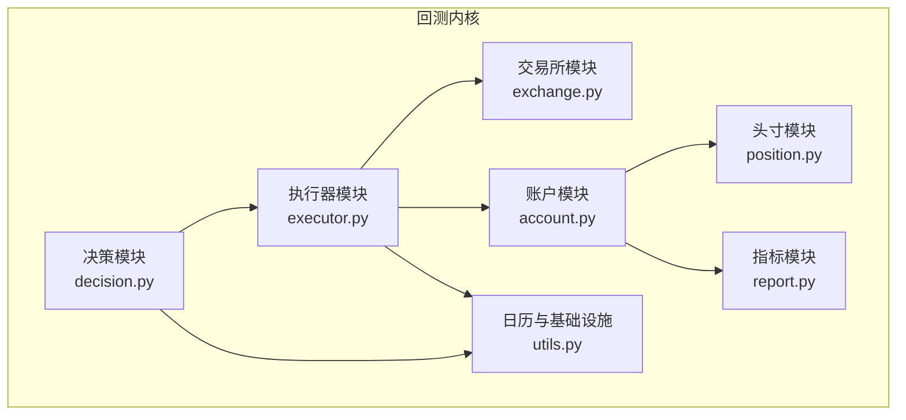
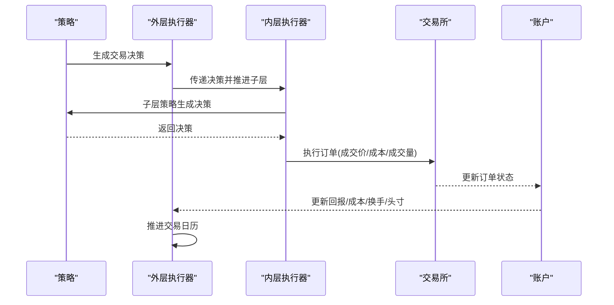
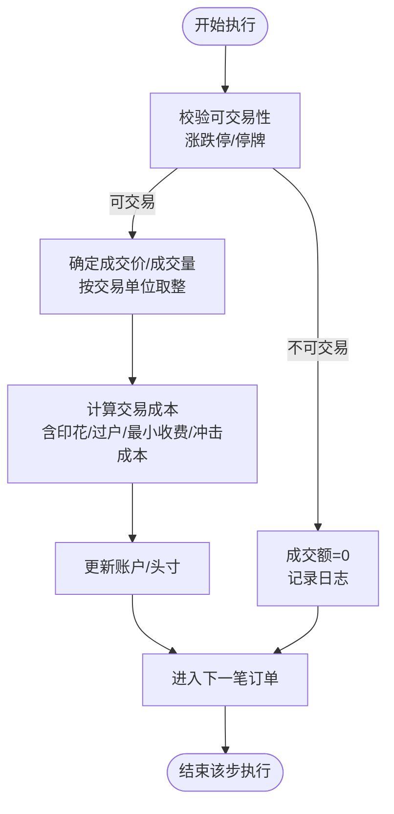
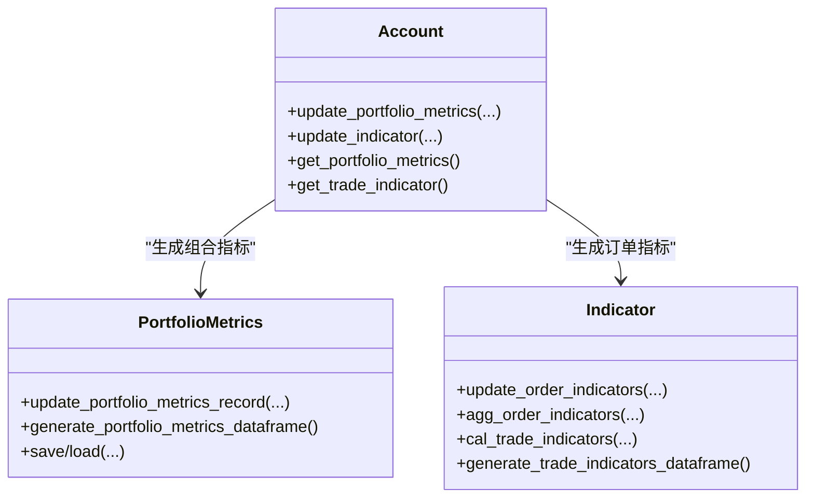
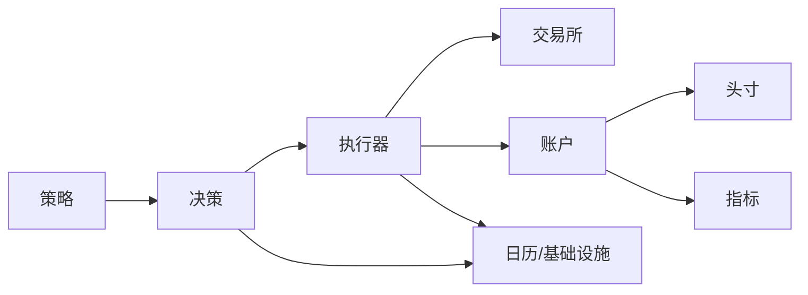

# 回测执行系统

<cite>
**本文引用的文件**
- [backtest.py](file://qlib/backtest/backtest.py)
- [executor.py](file://qlib/backtest/executor.py)
- [exchange.py](file://qlib/backtest/exchange.py)
- [account.py](file://qlib/backtest/account.py)
- [position.py](file://qlib/backtest/position.py)
- [report.py](file://qlib/backtest/report.py)
- [decision.py](file://qlib/backtest/decision.py)
- [utils.py](file://qlib/backtest/utils.py)
- [signal_strategy.py](file://qlib/contrib/strategy/signal_strategy.py)
- [strategy.rst](file://docs/component/strategy.rst)
- [evaluate.py](file://qlib/contrib/evaluate.py)
- [evaluate_portfolio.py](file://qlib/contrib/evaluate_portfolio.py)
</cite>

## 目录
1. [引言](#引言)
2. [项目结构](#项目结构)
3. [核心组件](#核心组件)
4. [架构总览](#架构总览)
5. [详细组件分析](#详细组件分析)
6. [依赖关系分析](#依赖关系分析)
7. [性能考量](#性能考量)
8. [故障排查指南](#故障排查指南)
9. [结论](#结论)
10. [附录](#附录)

## 引言
本文件面向希望深入理解与使用 Qlib 回测执行系统的读者，系统性梳理回测引擎的架构设计、交易成本与滑点建模、市场冲击处理、风险管理与分析指标、回测结果可视化与统计解读，并给出策略对比与性能评估的最佳实践。文档以代码为依据，辅以图示帮助不同背景的读者快速掌握系统。

## 项目结构
回测相关代码集中在 qlib/backtest 目录，围绕“决策-执行-账户-指标”闭环组织：
- 决策层：定义订单与交易决策抽象，支持时间窗限制与多级传播
- 执行层：模拟真实市场，执行订单、计算成交价与费用、更新账户
- 账户层：维护头寸、累计收益/成本/换手、生成组合指标
- 指标层：高频订单指标（成交率、价格优势、胜率）与组合指标（收益、成本、换手、基准比较）
- 工具层：交易日历、基础设施注入、范围裁剪辅助函数

图表来源
- [decision.py:30-150](file://qlib/backtest/decision.py#L30-L150)
- [executor.py:22-120](file://qlib/backtest/executor.py#L22-L120)
- [account.py:71-137](file://qlib/backtest/account.py#L71-L137)
- [position.py:16-50](file://qlib/backtest/position.py#L16-L50)
- [report.py:22-95](file://qlib/backtest/report.py#L22-L95)
- [exchange.py:28-60](file://qlib/backtest/exchange.py#L28-L60)
- [utils.py:23-77](file://qlib/backtest/utils.py#L23-L77)

章节来源
- [backtest.py:25-110](file://qlib/backtest/backtest.py#L25-L110)
- [utils.py:23-101](file://qlib/backtest/utils.py#L23-L101)

## 核心组件
- 决策与订单
  - 订单对象封装股票、数量、方向、时间窗与成交结果字段；提供符号转换、增量量度等属性
  - 交易决策抽象支持时间窗限制、多层传播与空决策处理
- 执行器
  - 基类负责重置、推进交易日历、调用策略生成决策、执行订单并更新账户
  - 支持嵌套执行器以实现高频子循环；支持串行/并行订单执行顺序
- 交易所
  - 提供报价、成交量、因子、涨跌停检查、按交易单位取整、按容量阈值裁剪等
  - 统一成交流程：校验可交易性、计算成交价/价值/成本、更新账户或头寸
- 账户与头寸
  - 累计回报、成本、换手；每日收盘价更新、持有天数累加；组合指标与历史头寸记录
  - 头寸支持普通与无限头寸，支持结算延迟机制
- 指标
  - 订单级指标：成交额、成交数量、成交均价、成交成本、成交方向、成交率、价格优势、胜率
  - 组合指标：账户价值、收益、总/当期换手、总/当期成本、基准收益、最新记录时间等

章节来源
- [decision.py:36-151](file://qlib/backtest/decision.py#L36-L151)
- [executor.py:22-120](file://qlib/backtest/executor.py#L22-L120)
- [exchange.py:421-463](file://qlib/backtest/exchange.py#L421-L463)
- [account.py:79-176](file://qlib/backtest/account.py#L79-L176)
- [position.py:231-501](file://qlib/backtest/position.py#L231-L501)
- [report.py:22-220](file://qlib/backtest/report.py#L22-L220)

## 架构总览
回测主循环通过外层策略与最外层执行器交互，逐“交易步”推进。每步中：
- 策略生成交易决策
- 执行器收集决策并驱动子执行器（如存在），在子层按更高频推进
- 子层执行订单，交易所计算成交价与成本，账户更新回报/成本/换手与头寸
- 执行器推进日历，完成 bar 结束时的指标与组合指标更新

图表来源
- [backtest.py:52-110](file://qlib/backtest/backtest.py#L52-L110)
- [executor.py:227-303](file://qlib/backtest/executor.py#L227-L303)
- [exchange.py:421-463](file://qlib/backtest/exchange.py#L421-L463)
- [account.py:338-403](file://qlib/backtest/account.py#L338-L403)

## 详细组件分析

### 交易执行机制与订单处理
- 订单生成与传播
  - 策略在每步生成交易决策，决策可携带时间窗限制与空决策
  - 嵌套执行器支持将外层决策传播到内层，内层可基于自身日历裁剪执行范围
- 订单执行
  - 串行/并行两种执行顺序：并行模式下先买后卖以规避资金冲突假设
  - 每笔订单经交易所校验可交易性、计算成交价/价值/成本，更新账户或头寸
- 日志与追踪
  - 可开启详细日志输出每笔交易的成交细节

图表来源
- [executor.py:590-628](file://qlib/backtest/executor.py#L590-L628)
- [exchange.py:421-463](file://qlib/backtest/exchange.py#L421-L463)
- [account.py:203-224](file://qlib/backtest/account.py#L203-L224)

章节来源
- [executor.py:513-628](file://qlib/backtest/executor.py#L513-L628)
- [exchange.py:421-587](file://qlib/backtest/exchange.py#L421-L587)

### 成本建模与滑点/冲击处理
- 成本构成
  - 开仓/平仓费率、最小费用、交易单位取整
  - 市场冲击成本（滑点）作为额外成本参数，用于放大成交成本
- 交易单位与取整
  - 支持按交易因子与交易单位向下取整，避免非整数手
- 容量限制
  - 支持按累计/即时成交量限制买卖额度，自动裁剪订单规模

章节来源
- [exchange.py:48-127](file://qlib/backtest/exchange.py#L48-L127)
- [exchange.py:786-800](file://qlib/backtest/exchange.py#L786-L800)
- [exchange.py:728-784](file://qlib/backtest/exchange.py#L728-L784)

### 风险管理与分析指标
- 组合指标
  - 每日账户价值、收益、总/当期换手、总/当期成本、基准收益、现金与有价证券价值
  - 基准收益通过采样高/低频序列计算区间复合收益
- 订单级指标
  - 成交率（FFR）、价格优势（PA）、胜率（POS）、成交金额/价值、订单数量
  - 支持按金额/价值加权聚合
- 统计分析
  - 年化收益、波动率、信息比率、最大回撤等指标均可从组合指标序列派生

图表来源
- [report.py:22-220](file://qlib/backtest/report.py#L22-L220)
- [report.py:249-652](file://qlib/backtest/report.py#L249-L652)
- [account.py:250-417](file://qlib/backtest/account.py#L250-L417)

章节来源
- [report.py:22-220](file://qlib/backtest/report.py#L22-L220)
- [report.py:549-652](file://qlib/backtest/report.py#L549-L652)
- [account.py:250-417](file://qlib/backtest/account.py#L250-L417)

### 回测结果分析与可视化
- 组合指标导出
  - 将账户价值、收益、成本、换手、基准等导出为 DataFrame，便于进一步分析
- 风险指标解读
  - 收益序列可计算年化、波动、IR、最大回撤等
  - 文档示例展示基准超额收益与扣费后超额收益的风险分析结果

章节来源
- [report.py:203-247](file://qlib/backtest/report.py#L203-L247)
- [evaluate.py:65-97](file://qlib/contrib/evaluate.py#L65-L97)
- [evaluate_portfolio.py:143-201](file://qlib/contrib/evaluate_portfolio.py#L143-L201)
- [strategy.rst:253-282](file://docs/component/strategy.rst#L253-L282)

### 策略实现与配置示例
- 策略接口
  - 策略需实现生成交易决策的方法，并与执行器共享日历与基础设施
- 订单生成
  - 通过订单助手创建订单，自动填充时间窗；根据信号生成目标权重头寸并转化为订单列表
- 执行器配置
  - 可配置成交价、涨跌停/成交量限制、交易单位、最小费用、冲击成本、是否生成组合指标、是否显示指标等

章节来源
- [signal_strategy.py:330-357](file://qlib/contrib/strategy/signal_strategy.py#L330-L357)
- [decision.py:154-204](file://qlib/backtest/decision.py#L154-L204)
- [exchange.py:38-130](file://qlib/backtest/exchange.py#L38-L130)

## 依赖关系分析
- 组件耦合
  - 执行器依赖策略、交易所、账户与日历；策略依赖日历与基础设施；账户依赖头寸与指标
- 关键依赖链
  - 策略 → 决策 → 执行器 → 交易所 → 账户 → 指标
- 循环依赖
  - 未见直接循环依赖；各模块职责清晰，通过抽象接口解耦

图表来源
- [executor.py:177-181](file://qlib/backtest/executor.py#L177-L181)
- [utils.py:23-101](file://qlib/backtest/utils.py#L23-L101)
- [decision.py:302-420](file://qlib/backtest/decision.py#L302-L420)

章节来源
- [executor.py:177-181](file://qlib/backtest/executor.py#L177-L181)
- [utils.py:23-101](file://qlib/backtest/utils.py#L23-L101)

## 性能考量
- 数据访问与缓存
  - 交易所从数据层批量拉取所需字段，减少重复查询
- 指标聚合
  - 订单级指标按步骤聚合，避免每笔订单重复计算
- 日历推进
  - 使用索引定位与步进，避免逐条遍历

[本节为通用指导，不涉及具体文件分析]

## 故障排查指南
- 常见问题
  - 订单无法成交：检查涨跌停/停牌/成交量限制；确认交易单位取整是否导致成交额为 0
  - 指标为空：确保启用组合指标与正确的时间范围
  - 嵌套执行器报错：确认外层决策的时间窗限制与内层日历匹配
- 定位方法
  - 启用执行器详细日志查看每笔成交细节
  - 校验交易单位与因子设置，避免极端取整导致无效交易
  - 检查基准配置与频率一致性

章节来源
- [exchange.py:437-442](file://qlib/backtest/exchange.py#L437-L442)
- [executor.py:613-628](file://qlib/backtest/executor.py#L613-L628)

## 结论
Qlib 回测系统以清晰的“策略-决策-执行-账户-指标”分层架构为核心，提供了完整的交易成本建模（含滑点/冲击）、市场限制处理、高频订单指标与组合指标体系，并支持策略对比与风险分析。通过合理配置执行器参数与策略逻辑，可在保证精度的同时获得良好的性能与可扩展性。

[本节为总结性内容，不涉及具体文件分析]

## 附录
- 实战建议
  - 成交价与成本：优先使用真实报价字段，结合最小费用与交易单位取整
  - 滑点建模：适度设置冲击成本参数，观察对 IR 与最大回撤的影响
  - 时间窗控制：利用决策时间窗限制高频内层执行范围，提升稳定性
  - 指标解读：关注扣费后的超额收益与 IR，结合最大回撤评估风险收益比
- 参考路径
  - 组合指标导出与分析：[report.py:203-247](file://qlib/backtest/report.py#L203-L247)
  - 风险指标计算示例：[evaluate.py:65-97](file://qlib/contrib/evaluate.py#L65-L97)
  - 基准超额收益分析示例：[strategy.rst:253-282](file://docs/component/strategy.rst#L253-L282)