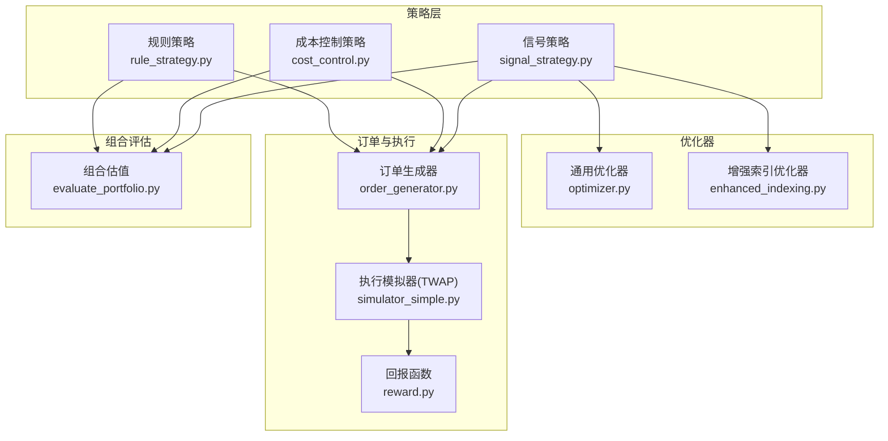
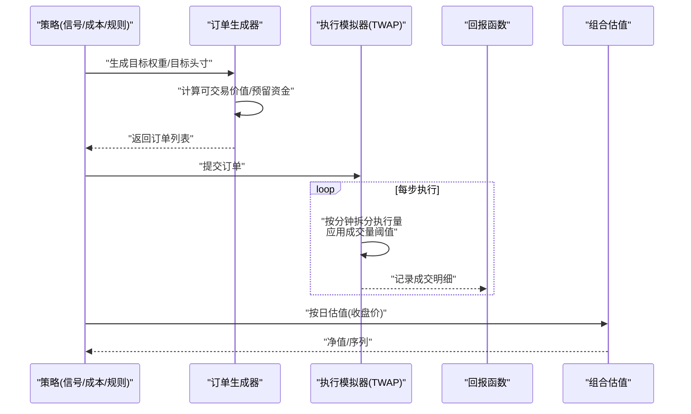
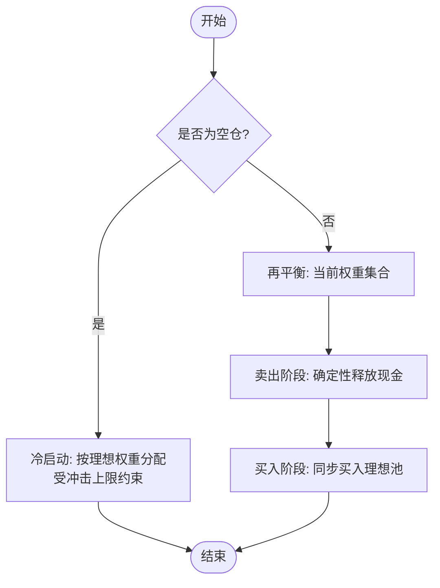
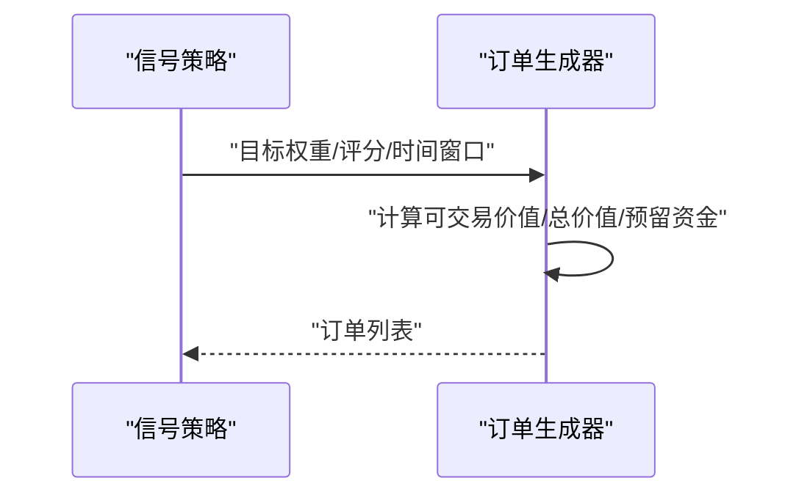
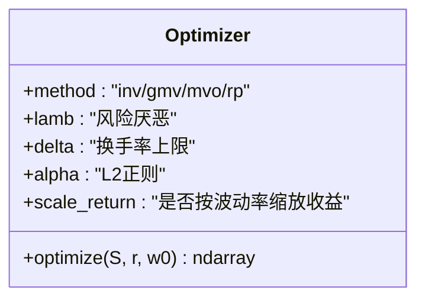
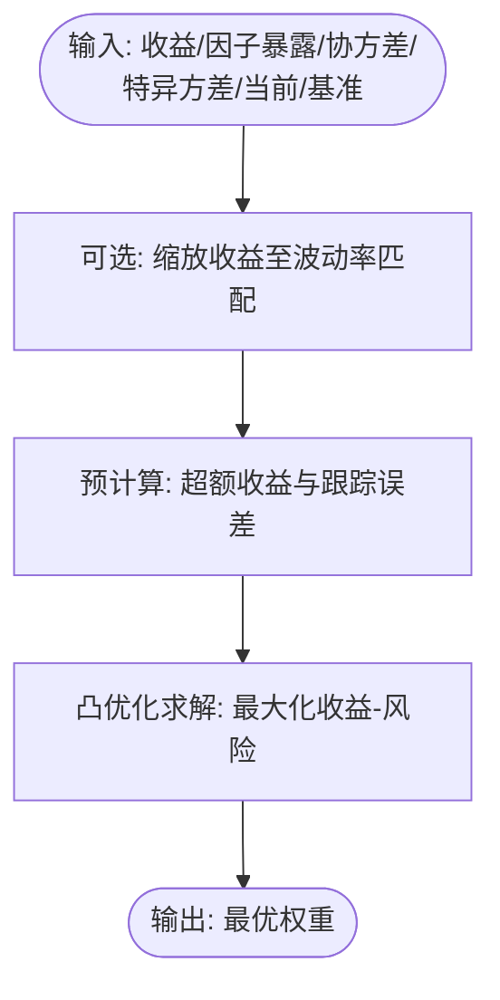
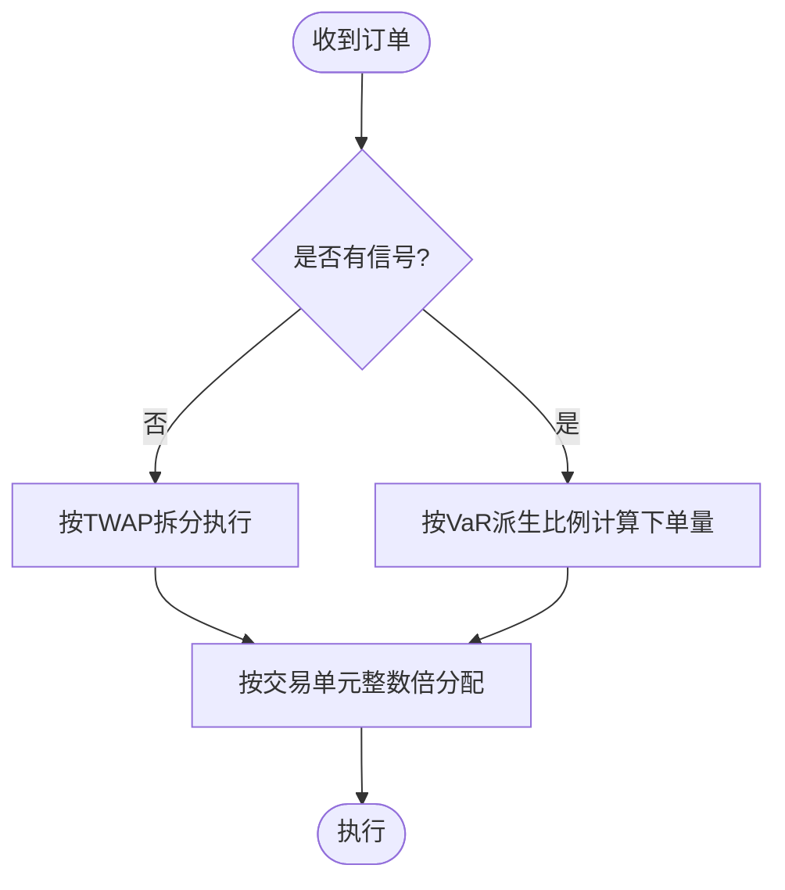
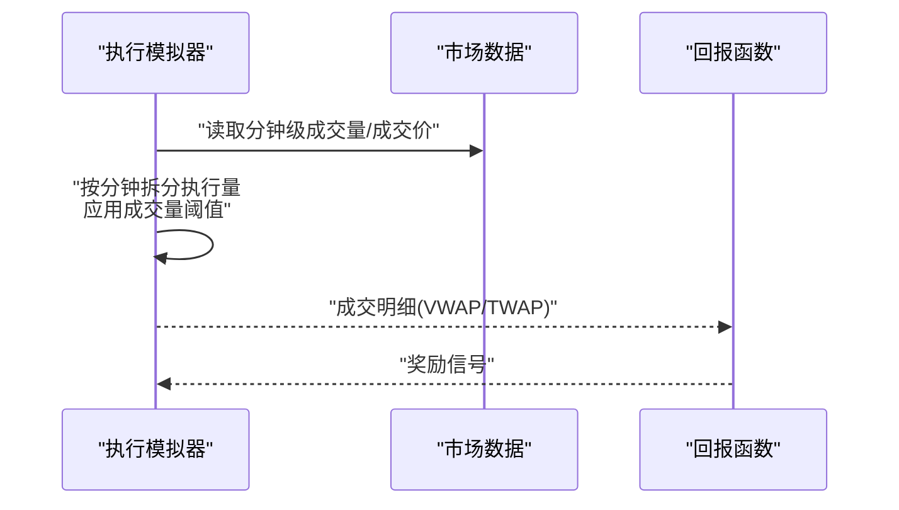
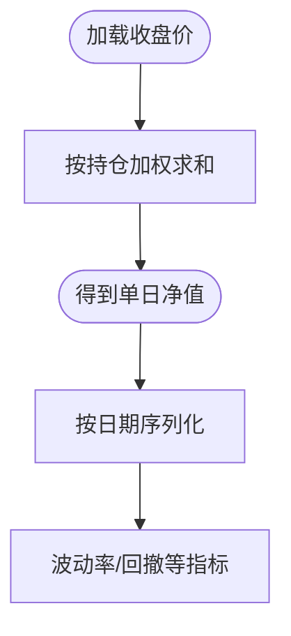
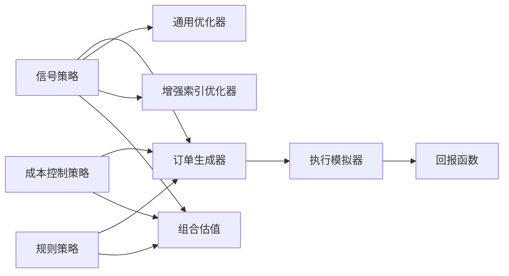

# 头寸管理

<cite>
**本文引用的文件**
- [cost_control.py](file://qlib/contrib/strategy/cost_control.py)
- [signal_strategy.py](file://qlib/contrib/strategy/signal_strategy.py)
- [order_generator.py](file://qlib/contrib/strategy/order_generator.py)
- [optimizer.py](file://qlib/contrib/strategy/optimizer/optimizer.py)
- [enhanced_indexing.py](file://qlib/contrib/strategy/optimizer/enhanced_indexing.py)
- [rule_strategy.py](file://qlib/contrib/strategy/rule_strategy.py)
- [evaluate_portfolio.py](file://qlib/contrib/evaluate_portfolio.py)
- [simulator_simple.py](file://qlib/rl/order_execution/simulator_simple.py)
- [reward.py](file://qlib/rl/order_execution/reward.py)
</cite>

## 目录
1. [引言](#引言)
2. [项目结构](#项目结构)
3. [核心组件](#核心组件)
4. [架构总览](#架构总览)
5. [详细组件分析](#详细组件分析)
6. [依赖关系分析](#依赖关系分析)
7. [性能考量](#性能考量)
8. [故障排查指南](#故障排查指南)
9. [结论](#结论)
10. [附录](#附录)

## 引言
本文件系统化梳理 Qlib 中的头寸管理系统与相关策略实现，围绕头寸规模确定、风险限额控制、动态调整机制、头寸计算（净值、收益、波动率）、约束与风控（单券、行业暴露、集中度）展开，并给出均值回归、动量、因子中性等风格的头寸管理策略示例与交易执行层面的监控预警建议。内容兼顾工程实现细节与可操作的最佳实践。

## 项目结构
与头寸管理直接相关的关键模块分布如下：
- 策略层：信号策略、成本控制策略、规则策略
- 优化器：通用投资组合优化、增强索引优化
- 订单生成与执行：订单生成器、RL 执行模拟器与回报函数
- 组合评估：按日估值与净值序列生成
- 回测与账户：账户、决策、执行、报告等基础能力

图表来源
- [signal_strategy.py:359-391](file://qlib/contrib/strategy/signal_strategy.py#L359-L391)
- [cost_control.py:44-79](file://qlib/contrib/strategy/cost_control.py#L44-L79)
- [order_generator.py:89-113](file://qlib/contrib/strategy/order_generator.py#L89-L113)
- [optimizer.py:27-230](file://qlib/contrib/strategy/optimizer/optimizer.py#L27-L230)
- [enhanced_indexing.py:46-128](file://qlib/contrib/strategy/optimizer/enhanced_indexing.py#L46-L128)
- [rule_strategy.py:490-511](file://qlib/contrib/strategy/rule_strategy.py#L490-L511)
- [evaluate_portfolio.py:53-102](file://qlib/contrib/evaluate_portfolio.py#L53-L102)
- [simulator_simple.py:265-294](file://qlib/rl/order_execution/simulator_simple.py#L265-L294)
- [reward.py:71-99](file://qlib/rl/order_execution/reward.py#L71-L99)

章节来源
- [signal_strategy.py:359-391](file://qlib/contrib/strategy/signal_strategy.py#L359-L391)
- [cost_control.py:44-79](file://qlib/contrib/strategy/cost_control.py#L44-L79)
- [order_generator.py:89-113](file://qlib/contrib/strategy/order_generator.py#L89-L113)
- [optimizer.py:27-230](file://qlib/contrib/strategy/optimizer/optimizer.py#L27-L230)
- [enhanced_indexing.py:46-128](file://qlib/contrib/strategy/optimizer/enhanced_indexing.py#L46-L128)
- [rule_strategy.py:490-511](file://qlib/contrib/strategy/rule_strategy.py#L490-L511)
- [evaluate_portfolio.py:53-102](file://qlib/contrib/evaluate_portfolio.py#L53-L102)
- [simulator_simple.py:265-294](file://qlib/rl/order_execution/simulator_simple.py#L265-L294)
- [reward.py:71-99](file://qlib/rl/order_execution/reward.py#L71-L99)

## 核心组件
- 风险度与影响限制：通过“风险度”和“交易冲击上限”控制每期可动用资金与单边冲击，避免大额订单对市场的过度扰动。
- 目标权重生成：基于评分排序与目标池大小，生成目标权重分配；在冷启动与再平衡场景下分别处理。
- 订单生成与资金预留：根据当前可交易价值、现金与风险度预留，计算可用于下单的资金池。
- 投资组合优化：支持逆波动率、最小方差、均值-方差、风险平价等多类优化目标，并可施加换手率等约束。
- 增强指数优化：在跟踪误差框架下，同时考虑基准偏差与因子偏差约束，实现因子中性与稳健跟踪。
- 执行模拟与回报：以 TWAP 为基础拆分执行量，结合市场成交量阈值与尾盘撮合，定义回报函数用于 RL 训练。
- 组合估值：按日加载收盘价，计算持仓净值序列，支撑回撤、波动率等风控指标。

章节来源
- [cost_control.py:44-79](file://qlib/contrib/strategy/cost_control.py#L44-L79)
- [signal_strategy.py:359-391](file://qlib/contrib/strategy/signal_strategy.py#L359-L391)
- [order_generator.py:89-113](file://qlib/contrib/strategy/order_generator.py#L89-L113)
- [optimizer.py:27-230](file://qlib/contrib/strategy/optimizer/optimizer.py#L27-L230)
- [enhanced_indexing.py:46-128](file://qlib/contrib/strategy/optimizer/enhanced_indexing.py#L46-L128)
- [simulator_simple.py:265-294](file://qlib/rl/order_execution/simulator_simple.py#L265-L294)
- [evaluate_portfolio.py:53-102](file://qlib/contrib/evaluate_portfolio.py#L53-L102)

## 架构总览
下图展示从信号到订单、再到执行与回报的整体流程，以及与优化器、估值模块的交互。

图表来源
- [signal_strategy.py:359-391](file://qlib/contrib/strategy/signal_strategy.py#L359-L391)
- [order_generator.py:89-113](file://qlib/contrib/strategy/order_generator.py#L89-L113)
- [simulator_simple.py:265-294](file://qlib/rl/order_execution/simulator_simple.py#L265-L294)
- [reward.py:71-99](file://qlib/rl/order_execution/reward.py#L71-L99)
- [evaluate_portfolio.py:53-102](file://qlib/contrib/evaluate_portfolio.py#L53-L102)

## 详细组件分析

### 成本控制策略（Proportional Budget Allocation）
- 冷启动：当无历史仓位时，按“风险度/目标池大小”均匀分配理想权重，并受“交易冲击上限”保护。
- 再平衡：在当前权重基础上，先进行确定性卖出释放现金，再同步买入理想池内标的，确保冲击可控。
- 影响限制：单只冲击不超过设定阈值，避免对流动性薄弱股票造成过大滑点。

图表来源
- [cost_control.py:44-79](file://qlib/contrib/strategy/cost_control.py#L44-L79)

章节来源
- [cost_control.py:44-79](file://qlib/contrib/strategy/cost_control.py#L44-L79)

### 信号策略与订单生成
- 信号策略调用“目标权重生成”，随后由“订单生成器”将目标权重转换为具体订单。
- 订单生成器会计算当前可交易价值、总价值与现金，并按“风险度”预留部分资金，剩余部分参与下单。
- 该流程贯穿于均值回归、动量等策略的下单环节。

图表来源
- [signal_strategy.py:359-391](file://qlib/contrib/strategy/signal_strategy.py#L359-L391)
- [order_generator.py:89-113](file://qlib/contrib/strategy/order_generator.py#L89-L113)

章节来源
- [signal_strategy.py:359-391](file://qlib/contrib/strategy/signal_strategy.py#L359-L391)
- [order_generator.py:89-113](file://qlib/contrib/strategy/order_generator.py#L89-L113)

### 通用投资组合优化（逆波动率/最小方差/均值-方差/风险平价）
- 方法选择：支持 INV（逆波动率）、GMV（全球最小方差）、MVO（均值-方差）、RP（风险平价）。
- 约束：非负权重、全仓、换手率上限；可选 L2 正则。
- 返回：优化后的权重向量，作为目标权重输入到订单生成器。

图表来源
- [optimizer.py:27-230](file://qlib/contrib/strategy/optimizer/optimizer.py#L27-L230)

章节来源
- [optimizer.py:27-230](file://qlib/contrib/strategy/optimizer/optimizer.py#L27-L230)

### 增强指数优化（跟踪误差+因子中性）
- 目标：最大化超额收益减去跟踪误差风险，同时控制基准偏差与因子偏差。
- 输入：预期收益、因子暴露矩阵、因子协方差、特异方差、当前权重、基准权重、强制持有/卖出掩码。
- 输出：在约束下的最优权重，适合构建因子中性、稳健跟踪的组合。

图表来源
- [enhanced_indexing.py:46-128](file://qlib/contrib/strategy/optimizer/enhanced_indexing.py#L46-L128)

章节来源
- [enhanced_indexing.py:46-128](file://qlib/contrib/strategy/optimizer/enhanced_indexing.py#L46-L128)

### 规则策略（TWAP/VaR派生）与交易单元
- 在无信号或信号缺失时采用 TWAP 分批执行。
- 若存在交易单元限制，则按“交易单元数量”整数倍分配每步下单量，保证合规与流动性适配。
- 可结合 VaR 派生的比例参数动态决定下单比例。

图表来源
- [rule_strategy.py:490-511](file://qlib/contrib/strategy/rule_strategy.py#L490-L511)

章节来源
- [rule_strategy.py:490-511](file://qlib/contrib/strategy/rule_strategy.py#L490-L511)

### 执行模拟器与回报函数（TWAP + 市场对比）
- 执行模拟器按分钟拆分订单，考虑市场成交量阈值与尾盘补足，形成 VWAP/TWAP 的对比基础。
- 回报函数以 VWAP/TWAP 的比值衡量执行质量，用于 RL 训练的奖励信号。

图表来源
- [simulator_simple.py:265-294](file://qlib/rl/order_execution/simulator_simple.py#L265-L294)
- [reward.py:71-99](file://qlib/rl/order_execution/reward.py#L71-L99)

章节来源
- [simulator_simple.py:265-294](file://qlib/rl/order_execution/simulator_simple.py#L265-L294)
- [reward.py:71-99](file://qlib/rl/order_execution/reward.py#L71-L99)

### 组合估值与净值序列
- 单日估值：按持仓清单加载当日收盘价，计算总价值。
- 多日序列：批量加载时间窗内收盘价，生成净值序列，便于后续波动率、最大回撤等风控指标计算。

图表来源
- [evaluate_portfolio.py:53-102](file://qlib/contrib/evaluate_portfolio.py#L53-L102)

章节来源
- [evaluate_portfolio.py:53-102](file://qlib/contrib/evaluate_portfolio.py#L53-L102)

## 依赖关系分析
- 策略层依赖订单生成器与优化器；订单生成器依赖交易环境与账户状态；执行模拟器依赖回测数据；回报函数依赖执行模拟器状态；估值模块独立但被策略与回测共同使用。
- 约束耦合：风险度、冲击上限、换手率、交易单元等参数在多个组件间传递，需统一配置与校验。

图表来源
- [signal_strategy.py:359-391](file://qlib/contrib/strategy/signal_strategy.py#L359-L391)
- [cost_control.py:44-79](file://qlib/contrib/strategy/cost_control.py#L44-L79)
- [order_generator.py:89-113](file://qlib/contrib/strategy/order_generator.py#L89-L113)
- [optimizer.py:27-230](file://qlib/contrib/strategy/optimizer/optimizer.py#L27-L230)
- [enhanced_indexing.py:46-128](file://qlib/contrib/strategy/optimizer/enhanced_indexing.py#L46-L128)
- [rule_strategy.py:490-511](file://qlib/contrib/strategy/rule_strategy.py#L490-L511)
- [evaluate_portfolio.py:53-102](file://qlib/contrib/evaluate_portfolio.py#L53-L102)
- [simulator_simple.py:265-294](file://qlib/rl/order_execution/simulator_simple.py#L265-L294)
- [reward.py:71-99](file://qlib/rl/order_execution/reward.py#L71-L99)

章节来源
- [signal_strategy.py:359-391](file://qlib/contrib/strategy/signal_strategy.py#L359-L391)
- [cost_control.py:44-79](file://qlib/contrib/strategy/cost_control.py#L44-L79)
- [order_generator.py:89-113](file://qlib/contrib/strategy/order_generator.py#L89-L113)
- [optimizer.py:27-230](file://qlib/contrib/strategy/optimizer/optimizer.py#L27-L230)
- [enhanced_indexing.py:46-128](file://qlib/contrib/strategy/optimizer/enhanced_indexing.py#L46-L128)
- [rule_strategy.py:490-511](file://qlib/contrib/strategy/rule_strategy.py#L490-L511)
- [evaluate_portfolio.py:53-102](file://qlib/contrib/evaluate_portfolio.py#L53-L102)
- [simulator_simple.py:265-294](file://qlib/rl/order_execution/simulator_simple.py#L265-L294)
- [reward.py:71-99](file://qlib/rl/order_execution/reward.py#L71-L99)

## 性能考量
- 订单拆分与执行：优先使用 TWAP 并结合成交量阈值，减少滑点与冲击；尾盘补足确保订单完成。
- 优化器收敛：合理设置风险厌恶、换手率上限与正则项，避免过拟合与数值不稳定。
- 估值批量化：按日期与股票集合批量加载特征，减少 IO 次数，提升净值序列生成效率。
- 参数敏感性：风险度、冲击上限、交易单元等参数对策略稳定性影响显著，应通过回测网格搜索与压力测试校准。

## 故障排查指南
- 订单金额异常
  - 检查“风险度”与“预留资金”计算是否正确，确认当前可交易价值与现金余额。
  - 关注“交易单元”限制导致的下单量整数化偏差。
- 执行效果不佳
  - 对比 VWAP/TWAP 比值，若长期劣于基准，检查成交量阈值设置与尾盘补足逻辑。
  - 结合回报函数评估，定位执行阶段的异常步长或价格偏离。
- 优化结果失真
  - 校验输入协方差与收益缩放是否一致；检查换手率约束是否过严导致退化。
  - 对增强指数优化，确认基准偏差与因子偏差约束是否合理。
- 估值不一致
  - 确认收盘价数据加载的时间窗口与日期连续性；检查是否遗漏“cash”字段。

章节来源
- [order_generator.py:89-113](file://qlib/contrib/strategy/order_generator.py#L89-L113)
- [rule_strategy.py:490-511](file://qlib/contrib/strategy/rule_strategy.py#L490-L511)
- [simulator_simple.py:265-294](file://qlib/rl/order_execution/simulator_simple.py#L265-L294)
- [reward.py:71-99](file://qlib/rl/order_execution/reward.py#L71-L99)
- [evaluate_portfolio.py:53-102](file://qlib/contrib/evaluate_portfolio.py#L53-L102)

## 结论
Qlib 的头寸管理体系以“策略—订单—执行—评估”为主线，通过风险度与冲击限制保障稳健性，利用多种优化器实现不同风格的头寸管理，并以 TWAP 与回报函数驱动执行质量。结合组合估值与风控指标，可在实盘交易中实现动态调整与有效监控。

## 附录

### 头寸计算与关键指标
- 净值计算：按日加载收盘价，加权汇总得到总净值。
- 收益率统计：基于净值序列计算日/月/年化收益与波动率。
- 波动率估计：可采用移动窗口或指数加权方式估计局部波动率，用于风险预算与止损触发。

章节来源
- [evaluate_portfolio.py:53-102](file://qlib/contrib/evaluate_portfolio.py#L53-L102)

### 风控约束与限制规则
- 单券限制：通过“交易冲击上限”与“交易单元”限制单只股票的单次/累计下单规模。
- 行业暴露限制：在增强指数优化中引入因子偏差约束，控制行业因子暴露偏离。
- 集中度控制：通过“换手率上限”与“全仓约束”限制集中度与交易频率。

章节来源
- [cost_control.py:44-79](file://qlib/contrib/strategy/cost_control.py#L44-L79)
- [enhanced_indexing.py:46-128](file://qlib/contrib/strategy/optimizer/enhanced_indexing.py#L46-L128)
- [optimizer.py:27-230](file://qlib/contrib/strategy/optimizer/optimizer.py#L27-L230)

### 策略实现示例（风格与方法）
- 均值回归：以逆波动率或最小方差优化为目标，降低个股特异风险，适合震荡市场。
- 动量策略：以均值-方差优化为目标，提高收益风险比，适合趋势市场。
- 因子中性：以增强指数优化为目标，在跟踪基准的同时控制行业/风格因子暴露，适合稳健型产品。

章节来源
- [optimizer.py:27-230](file://qlib/contrib/strategy/optimizer/optimizer.py#L27-L230)
- [enhanced_indexing.py:46-128](file://qlib/contrib/strategy/optimizer/enhanced_indexing.py#L46-L128)

### 监控与预警配置建议
- 执行层面：设置 VWAP/TWAP 比值阈值与尾盘补足开关，异常时触发告警。
- 组合层面：设置最大回撤、波动率上界与换手率上限，超限时自动降仓或暂停下单。
- 参数层面：对风险度、冲击上限、交易单元等参数建立参数扫描与压力测试机制。

章节来源
- [simulator_simple.py:265-294](file://qlib/rl/order_execution/simulator_simple.py#L265-L294)
- [reward.py:71-99](file://qlib/rl/order_execution/reward.py#L71-L99)
- [evaluate_portfolio.py:53-102](file://qlib/contrib/evaluate_portfolio.py#L53-L102)