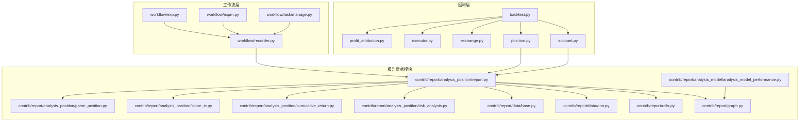
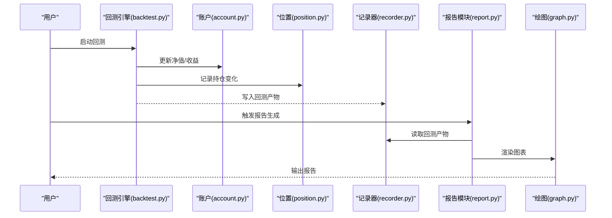
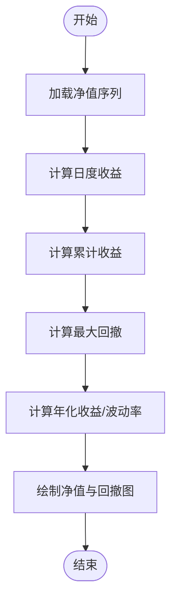
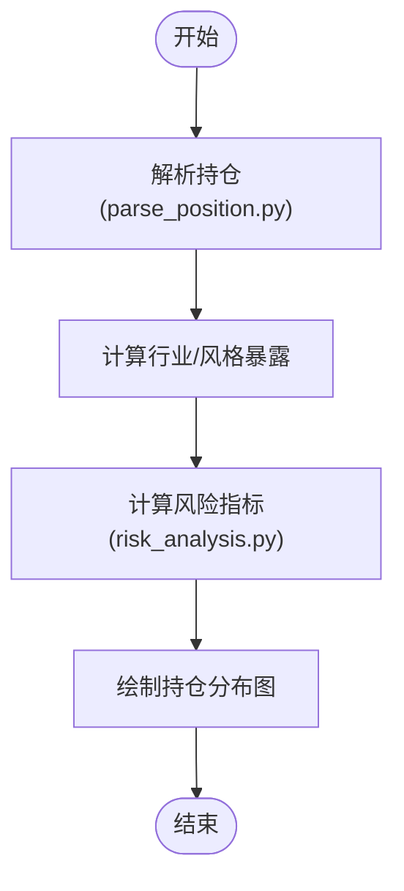
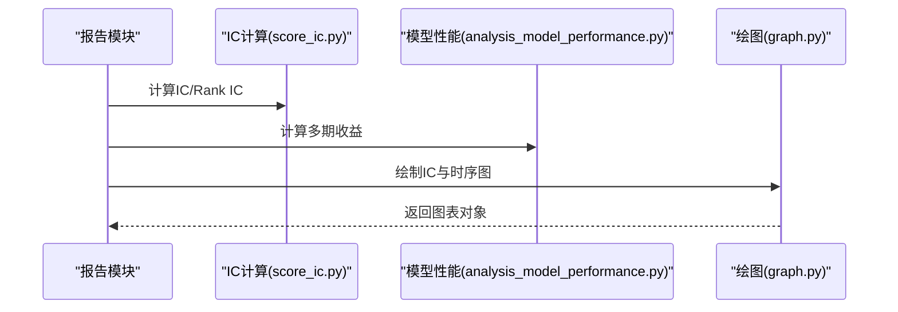
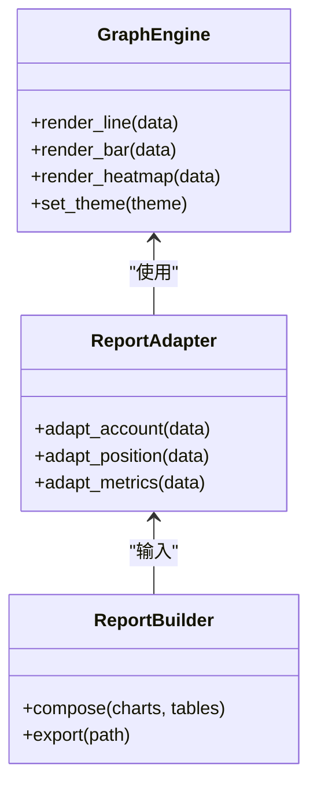
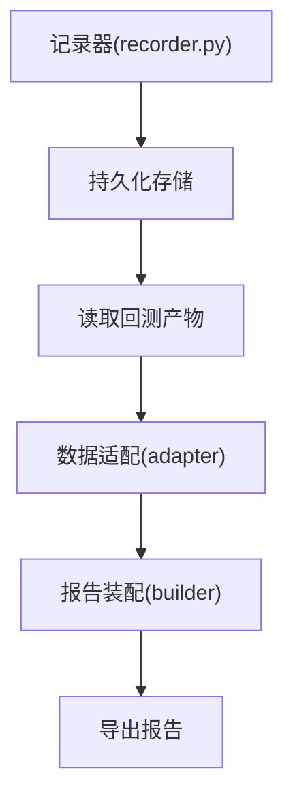
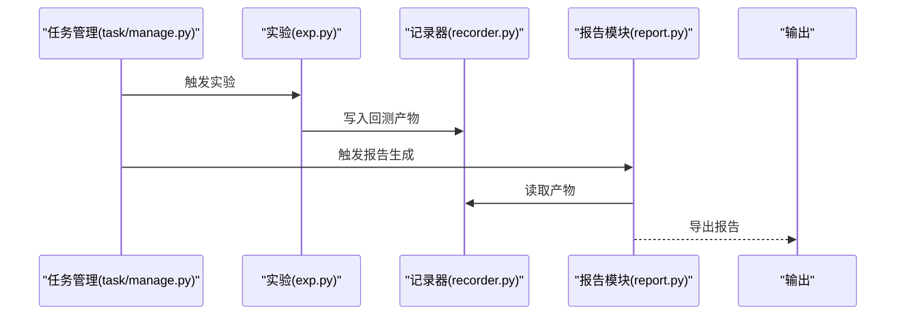
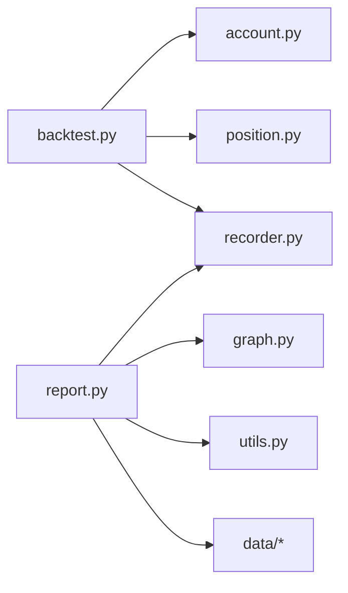

# 报告生成

<cite>
**本文引用的文件**
- [qlib/backtest/report.py](file://qlib/backtest/report.py)
- [qlib/contrib/report/analysis_position/report.py](file://qlib/contrib/report/analysis_position/report.py)
- [qlib/contrib/report/analysis_position/risk_analysis.py](file://qlib/contrib/report/analysis_position/risk_analysis.py)
- [qlib/contrib/report/analysis_position/cumulative_return.py](file://qlib/contrib/report/analysis_position/cumulative_return.py)
- [qlib/contrib/report/analysis_position/score_ic.py](file://qlib/contrib/report/analysis_position/score_ic.py)
- [qlib/contrib/report/analysis_position/parse_position.py](file://qlib/contrib/report/analysis_position/parse_position.py)
- [qlib/contrib/report/analysis_model/analysis_model_performance.py](file://qlib/contrib/report/analysis_model/analysis_model_performance.py)
- [qlib/contrib/report/graph.py](file://qlib/contrib/report/graph.py)
- [qlib/contrib/report/utils.py](file://qlib/contrib/report/utils.py)
- [qlib/contrib/report/data/base.py](file://qlib/contrib/report/data/base.py)
- [qlib/contrib/report/data/ana.py](file://qlib/contrib/report/data/ana.py)
- [qlib/backtest/backtest.py](file://qlib/backtest/backtest.py)
- [qlib/backtest/account.py](file://qlib/backtest/account.py)
- [qlib/backtest/position.py](file://qlib/backtest/position.py)
- [qlib/backtest/exchange.py](file://qlib/backtest/exchange.py)
- [qlib/backtest/executor.py](file://qlib/backtest/executor.py)
- [qlib/backtest/profit_attribution.py](file://qlib/backtest/profit_attribution.py)
- [qlib/workflow/recorder.py](file://qlib/workflow/recorder.py)
- [qlib/workflow/exp.py](file://qlib/workflow/exp.py)
- [qlib/workflow/expm.py](file://qlib/workflow/expm.py)
- [qlib/workflow/task/manage.py](file://qlib/workflow/task/manage.py)
- [qlib/workflow/task/gen.py](file://qlib/workflow/task/gen.py)
- [qlib/workflow/task/collect.py](file://qlib/workflow/task/collect.py)
- [qlib/workflow/task/utils.py](file://qlib/workflow/task/utils.py)
- [qlib/evaluate.py](file://qlib/evaluate.py)
- [qlib/evaluate_portfolio.py](file://qlib/evaluate_portfolio.py)
</cite>

## 目录
1. [引言](#引言)
2. [项目结构](#项目结构)
3. [核心组件](#核心组件)
4. [架构总览](#架构总览)
5. [详细组件分析](#详细组件分析)
6. [依赖关系分析](#依赖关系分析)
7. [性能考虑](#性能考虑)
8. [故障排查指南](#故障排查指南)
9. [结论](#结论)
10. [附录](#附录)

## 引言
本文件面向Qlib回测报告生成系统，系统性梳理报告模板体系、数据聚合与图表渲染机制、各类报告（收益曲线、回撤分析、持仓分布、风险指标表等）的生成流程，以及报告数据的组织与存储方式。同时提供自定义报告模板的开发指南、自动化生成与分发方案、性能优化与最佳实践，帮助读者在不直接阅读源码的情况下高效掌握报告生成能力。

## 项目结构
Qlib的报告生成主要分布在以下模块：
- 回测层：负责交易执行、账户管理、收益归因等，输出可用于报告的数据源
- 报告贡献模块：提供分析型报告（收益、回撤、持仓、IC等）与通用绘图工具
- 工作流层：记录器与实验管理负责将回测结果持久化为可复用的报告数据

**图示来源**
- [qlib/backtest/backtest.py](file://qlib/backtest/backtest.py)
- [qlib/backtest/account.py](file://qlib/backtest/account.py)
- [qlib/backtest/position.py](file://qlib/backtest/position.py)
- [qlib/backtest/exchange.py](file://qlib/backtest/exchange.py)
- [qlib/backtest/executor.py](file://qlib/backtest/executor.py)
- [qlib/backtest/profit_attribution.py](file://qlib/backtest/profit_attribution.py)
- [qlib/contrib/report/analysis_position/report.py](file://qlib/contrib/report/analysis_position/report.py)
- [qlib/contrib/report/analysis_position/risk_analysis.py](file://qlib/contrib/report/analysis_position/risk_analysis.py)
- [qlib/contrib/report/analysis_position/cumulative_return.py](file://qlib/contrib/report/analysis_position/cumulative_return.py)
- [qlib/contrib/report/analysis_position/score_ic.py](file://qlib/contrib/report/analysis_position/score_ic.py)
- [qlib/contrib/report/analysis_position/parse_position.py](file://qlib/contrib/report/analysis_position/parse_position.py)
- [qlib/contrib/report/graph.py](file://qlib/contrib/report/graph.py)
- [qlib/contrib/report/utils.py](file://qlib/contrib/report/utils.py)
- [qlib/contrib/report/data/ana.py](file://qlib/contrib/report/data/ana.py)
- [qlib/contrib/report/data/base.py](file://qlib/contrib/report/data/base.py)
- [qlib/contrib/report/analysis_model/analysis_model_performance.py](file://qlib/contrib/report/analysis_model/analysis_model_performance.py)
- [qlib/workflow/recorder.py](file://qlib/workflow/recorder.py)
- [qlib/workflow/exp.py](file://qlib/workflow/exp.py)
- [qlib/workflow/expm.py](file://qlib/workflow/expm.py)
- [qlib/workflow/task/manage.py](file://qlib/workflow/task/manage.py)

**章节来源**
- [qlib/backtest/report.py](file://qlib/backtest/report.py)
- [qlib/contrib/report/analysis_position/report.py](file://qlib/contrib/report/analysis_position/report.py)
- [qlib/contrib/report/analysis_position/risk_analysis.py](file://qlib/contrib/report/analysis_position/risk_analysis.py)
- [qlib/contrib/report/analysis_position/cumulative_return.py](file://qlib/contrib/report/analysis_position/cumulative_return.py)
- [qlib/contrib/report/analysis_position/score_ic.py](file://qlib/contrib/report/analysis_position/score_ic.py)
- [qlib/contrib/report/analysis_position/parse_position.py](file://qlib/contrib/report/analysis_position/parse_position.py)
- [qlib/contrib/report/analysis_model/analysis_model_performance.py](file://qlib/contrib/report/analysis_model/analysis_model_performance.py)
- [qlib/contrib/report/graph.py](file://qlib/contrib/report/graph.py)
- [qlib/contrib/report/utils.py](file://qlib/contrib/report/utils.py)
- [qlib/contrib/report/data/base.py](file://qlib/contrib/report/data/base.py)
- [qlib/contrib/report/data/ana.py](file://qlib/contrib/report/data/ana.py)
- [qlib/backtest/backtest.py](file://qlib/backtest/backtest.py)
- [qlib/backtest/account.py](file://qlib/backtest/account.py)
- [qlib/backtest/position.py](file://qlib/backtest/position.py)
- [qlib/backtest/exchange.py](file://qlib/backtest/exchange.py)
- [qlib/backtest/executor.py](file://qlib/backtest/executor.py)
- [qlib/backtest/profit_attribution.py](file://qlib/backtest/profit_attribution.py)
- [qlib/workflow/recorder.py](file://qlib/workflow/recorder.py)
- [qlib/workflow/exp.py](file://qlib/workflow/exp.py)
- [qlib/workflow/expm.py](file://qlib/workflow/expm.py)
- [qlib/workflow/task/manage.py](file://qlib/workflow/task/manage.py)

## 核心组件
- 报告模板系统
  - 图表渲染引擎：基于通用绘图模块与工具函数，封装折线、柱状、热力图等可视化元素
  - 数据适配器：将回测与评估结果转换为报告所需的结构化数据
- 数据聚合机制
  - 收益曲线与回撤：从账户净值序列中提取日度收益、累计收益、最大回撤等
  - 持仓分布：从位置对象解析持仓名单、权重分布、行业/风格暴露
  - 风险指标：波动率、夏普比率、最大回撤、Calmar比率等
  - 模型评估：IC、Rank IC、多期收益等
- 报告生成流程
  - 自动化：通过工作流记录器与任务管理，将回测产物持久化并触发报告生成
  - 手工调用：直接调用报告模块接口，传入所需数据进行渲染

**章节来源**
- [qlib/contrib/report/graph.py](file://qlib/contrib/report/graph.py)
- [qlib/contrib/report/utils.py](file://qlib/contrib/report/utils.py)
- [qlib/contrib/report/data/base.py](file://qlib/contrib/report/data/base.py)
- [qlib/contrib/report/data/ana.py](file://qlib/contrib/report/data/ana.py)
- [qlib/contrib/report/analysis_position/report.py](file://qlib/contrib/report/analysis_position/report.py)
- [qlib/contrib/report/analysis_position/risk_analysis.py](file://qlib/contrib/report/analysis_position/risk_analysis.py)
- [qlib/contrib/report/analysis_position/cumulative_return.py](file://qlib/contrib/report/analysis_position/cumulative_return.py)
- [qlib/contrib/report/analysis_position/score_ic.py](file://qlib/contrib/report/analysis_position/score_ic.py)
- [qlib/contrib/report/analysis_model/analysis_model_performance.py](file://qlib/contrib/report/analysis_model/analysis_model_performance.py)
- [qlib/backtest/account.py](file://qlib/backtest/account.py)
- [qlib/backtest/position.py](file://qlib/backtest/position.py)
- [qlib/workflow/recorder.py](file://qlib/workflow/recorder.py)
- [qlib/workflow/exp.py](file://qlib/workflow/exp.py)
- [qlib/workflow/expm.py](file://qlib/workflow/expm.py)
- [qlib/workflow/task/manage.py](file://qlib/workflow/task/manage.py)

## 架构总览
下图展示从回测到报告生成的关键路径：回测引擎产出账户与位置数据，经由工作流记录器持久化，再由报告模块读取并渲染为图表与表格。

**图示来源**
- [qlib/backtest/backtest.py](file://qlib/backtest/backtest.py)
- [qlib/backtest/account.py](file://qlib/backtest/account.py)
- [qlib/backtest/position.py](file://qlib/backtest/position.py)
- [qlib/workflow/recorder.py](file://qlib/workflow/recorder.py)
- [qlib/backtest/report.py](file://qlib/backtest/report.py)
- [qlib/contrib/report/graph.py](file://qlib/contrib/report/graph.py)

## 详细组件分析

### 收益曲线与回撤分析
- 数据来源
  - 账户净值序列、日度收益序列、累计收益序列
- 关键算法
  - 最大回撤：基于滚动高点与回撤幅度计算
  - 年化收益/波动率：基于日度收益序列估计
- 可视化
  - 净值曲线、回撤曲线、滚动最大回撤带

**图示来源**
- [qlib/contrib/report/analysis_position/cumulative_return.py](file://qlib/contrib/report/analysis_position/cumulative_return.py)
- [qlib/contrib/report/analysis_position/risk_analysis.py](file://qlib/contrib/report/analysis_position/risk_analysis.py)
- [qlib/contrib/report/graph.py](file://qlib/contrib/report/graph.py)

**章节来源**
- [qlib/contrib/report/analysis_position/cumulative_return.py](file://qlib/contrib/report/analysis_position/cumulative_return.py)
- [qlib/contrib/report/analysis_position/risk_analysis.py](file://qlib/contrib/report/analysis_position/risk_analysis.py)
- [qlib/contrib/report/graph.py](file://qlib/contrib/report/graph.py)

### 持仓分布与风险分析
- 持仓解析
  - 从位置对象解析持份数量、权重、市值
  - 行业/风格暴露计算
- 风险指标
  - 波动率、最大回撤、夏普比率、Calmar比率
  - 分位数与尾部风险度量

**图示来源**
- [qlib/contrib/report/analysis_position/parse_position.py](file://qlib/contrib/report/analysis_position/parse_position.py)
- [qlib/contrib/report/analysis_position/risk_analysis.py](file://qlib/contrib/report/analysis_position/risk_analysis.py)
- [qlib/contrib/report/graph.py](file://qlib/contrib/report/graph.py)

**章节来源**
- [qlib/contrib/report/analysis_position/parse_position.py](file://qlib/contrib/report/analysis_position/parse_position.py)
- [qlib/contrib/report/analysis_position/risk_analysis.py](file://qlib/contrib/report/analysis_position/risk_analysis.py)
- [qlib/contrib/report/graph.py](file://qlib/contrib/report/graph.py)

### 模型评估与IC分析
- IC与Rank IC
  - 计算预测与未来收益的秩相关系数
- 多期收益
  - 按持有期聚合多期收益，评估模型稳定性
- 可视化
  - IC时序、分布直方图、多期收益箱线图

**图示来源**
- [qlib/contrib/report/analysis_position/score_ic.py](file://qlib/contrib/report/analysis_position/score_ic.py)
- [qlib/contrib/report/analysis_model/analysis_model_performance.py](file://qlib/contrib/report/analysis_model/analysis_model_performance.py)
- [qlib/contrib/report/graph.py](file://qlib/contrib/report/graph.py)

**章节来源**
- [qlib/contrib/report/analysis_position/score_ic.py](file://qlib/contrib/report/analysis_position/score_ic.py)
- [qlib/contrib/report/analysis_model/analysis_model_performance.py](file://qlib/contrib/report/analysis_model/analysis_model_performance.py)
- [qlib/contrib/report/graph.py](file://qlib/contrib/report/graph.py)

### 报告模板系统与数据适配
- 模板系统
  - 以通用绘图函数与工具函数为核心，支持主题、布局、颜色等配置
- 数据适配
  - 将回测产物映射为图表需要的X/Y轴、分组、标注等
- 报告装配
  - 将多个图表与表格组合为完整报告

**图示来源**
- [qlib/contrib/report/graph.py](file://qlib/contrib/report/graph.py)
- [qlib/contrib/report/utils.py](file://qlib/contrib/report/utils.py)
- [qlib/contrib/report/data/base.py](file://qlib/contrib/report/data/base.py)
- [qlib/contrib/report/data/ana.py](file://qlib/contrib/report/data/ana.py)

**章节来源**
- [qlib/contrib/report/graph.py](file://qlib/contrib/report/graph.py)
- [qlib/contrib/report/utils.py](file://qlib/contrib/report/utils.py)
- [qlib/contrib/report/data/base.py](file://qlib/contrib/report/data/base.py)
- [qlib/contrib/report/data/ana.py](file://qlib/contrib/report/data/ana.py)

### 报告数据组织与存储
- 存储介质
  - 工作流记录器将回测产物写入持久化存储，便于后续读取与复用
- 数据结构
  - 时间序列：日频净值、收益、回撤
  - 统计指标：年化收益、波动率、最大回撤、IC等
  - 可视化元素：坐标轴、图例、注释框
- 读取与装配
  - 报告模块从记录器读取数据，按模板装配图表与表格

**图示来源**
- [qlib/workflow/recorder.py](file://qlib/workflow/recorder.py)
- [qlib/contrib/report/data/base.py](file://qlib/contrib/report/data/base.py)
- [qlib/contrib/report/data/ana.py](file://qlib/contrib/report/data/ana.py)

**章节来源**
- [qlib/workflow/recorder.py](file://qlib/workflow/recorder.py)
- [qlib/contrib/report/data/base.py](file://qlib/contrib/report/data/base.py)
- [qlib/contrib/report/data/ana.py](file://qlib/contrib/report/data/ana.py)

### 自定义报告模板开发指南
- 图表样式定制
  - 使用绘图引擎的主题设置与样式参数，统一颜色、字体、网格等
- 指标计算扩展
  - 在数据适配层新增指标计算逻辑，保持与现有数据结构兼容
- 报告格式配置
  - 通过报告装配器组合图表与表格，控制布局与导出格式

**章节来源**
- [qlib/contrib/report/graph.py](file://qlib/contrib/report/graph.py)
- [qlib/contrib/report/utils.py](file://qlib/contrib/report/utils.py)
- [qlib/contrib/report/data/base.py](file://qlib/contrib/report/data/base.py)

### 报告自动化生成与分发
- 自动化
  - 通过工作流任务管理器调度回测与报告生成任务
- 分发
  - 报告导出为HTML/PDF等格式，结合CI/CD或邮件系统进行分发

**图示来源**
- [qlib/workflow/task/manage.py](file://qlib/workflow/task/manage.py)
- [qlib/workflow/exp.py](file://qlib/workflow/exp.py)
- [qlib/workflow/recorder.py](file://qlib/workflow/recorder.py)
- [qlib/backtest/report.py](file://qlib/backtest/report.py)

**章节来源**
- [qlib/workflow/task/manage.py](file://qlib/workflow/task/manage.py)
- [qlib/workflow/exp.py](file://qlib/workflow/exp.py)
- [qlib/workflow/recorder.py](file://qlib/workflow/recorder.py)
- [qlib/backtest/report.py](file://qlib/backtest/report.py)

## 依赖关系分析
- 组件耦合
  - 报告模块依赖回测产物与工作流记录器；绘图模块独立于业务逻辑，便于扩展
- 外部依赖
  - 图表渲染依赖通用绘图工具；数据适配依赖回测与评估模块
- 潜在循环依赖
  - 当前结构清晰，未发现循环依赖迹象

**图示来源**
- [qlib/backtest/backtest.py](file://qlib/backtest/backtest.py)
- [qlib/backtest/account.py](file://qlib/backtest/account.py)
- [qlib/backtest/position.py](file://qlib/backtest/position.py)
- [qlib/workflow/recorder.py](file://qlib/workflow/recorder.py)
- [qlib/backtest/report.py](file://qlib/backtest/report.py)
- [qlib/contrib/report/graph.py](file://qlib/contrib/report/graph.py)
- [qlib/contrib/report/utils.py](file://qlib/contrib/report/utils.py)
- [qlib/contrib/report/data/base.py](file://qlib/contrib/report/data/base.py)

**章节来源**
- [qlib/backtest/backtest.py](file://qlib/backtest/backtest.py)
- [qlib/backtest/account.py](file://qlib/backtest/account.py)
- [qlib/backtest/position.py](file://qlib/backtest/position.py)
- [qlib/workflow/recorder.py](file://qlib/workflow/recorder.py)
- [qlib/backtest/report.py](file://qlib/backtest/report.py)
- [qlib/contrib/report/graph.py](file://qlib/contrib/report/graph.py)
- [qlib/contrib/report/utils.py](file://qlib/contrib/report/utils.py)
- [qlib/contrib/report/data/base.py](file://qlib/contrib/report/data/base.py)

## 性能考虑
- 数据缓存与复用
  - 利用工作流记录器缓存回测产物，避免重复计算
- 图表批处理
  - 合理批量生成图表，减少I/O与渲染开销
- 指标计算优化
  - 对时间序列指标采用向量化与滚动窗口优化
- 并行化
  - 在任务层面并行运行多个回测与报告生成任务

## 故障排查指南
- 报告为空或指标缺失
  - 检查回测是否成功写入记录器；确认报告读取路径正确
- 图表异常
  - 检查数据适配层字段映射；核对绘图参数与主题配置
- 性能瓶颈
  - 审视指标计算复杂度；优化数据读取与缓存策略

**章节来源**
- [qlib/workflow/recorder.py](file://qlib/workflow/recorder.py)
- [qlib/contrib/report/graph.py](file://qlib/contrib/report/graph.py)
- [qlib/contrib/report/utils.py](file://qlib/contrib/report/utils.py)

## 结论
Qlib报告生成系统以“回测产物+报告模板+绘图引擎”为核心，实现了从收益曲线、回撤分析、持仓分布到风险指标与模型评估的全链路报告能力。通过工作流记录器与任务管理，系统支持自动化生成与分发。建议在实际应用中结合缓存、批处理与并行化策略，持续优化性能与可维护性。

## 附录
- 相关评估模块
  - 投资组合评估与回测评估模块可用于补充报告维度

**章节来源**
- [qlib/evaluate.py](file://qlib/evaluate.py)
- [qlib/evaluate_portfolio.py](file://qlib/evaluate_portfolio.py)