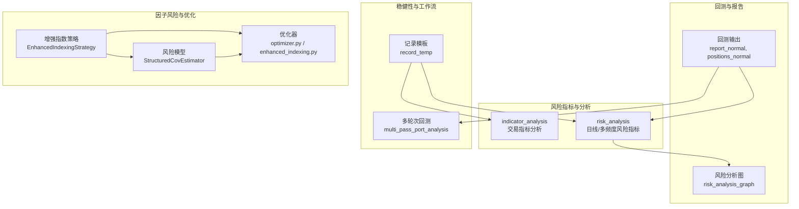
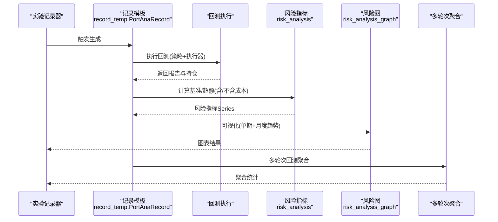
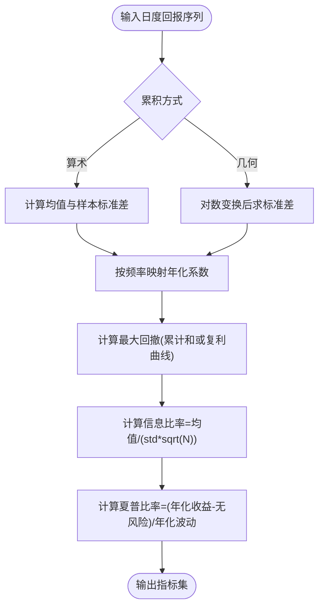
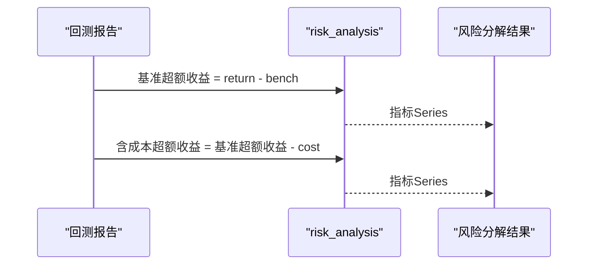
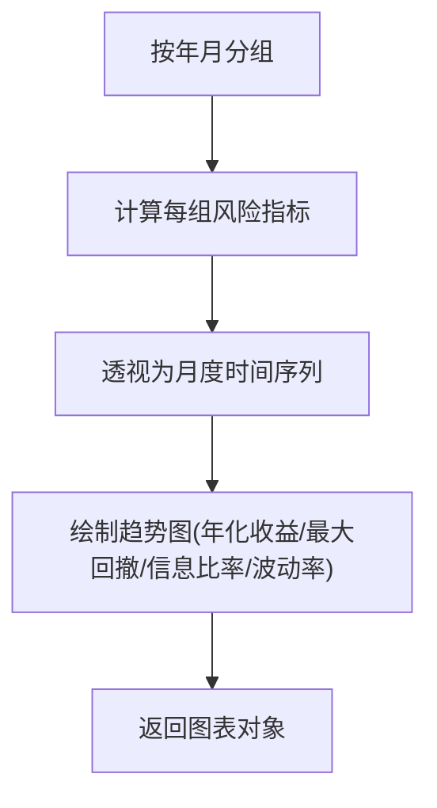
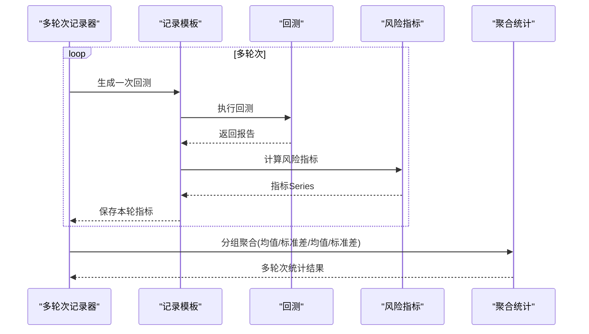
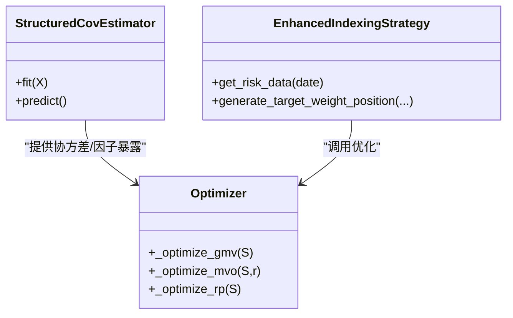
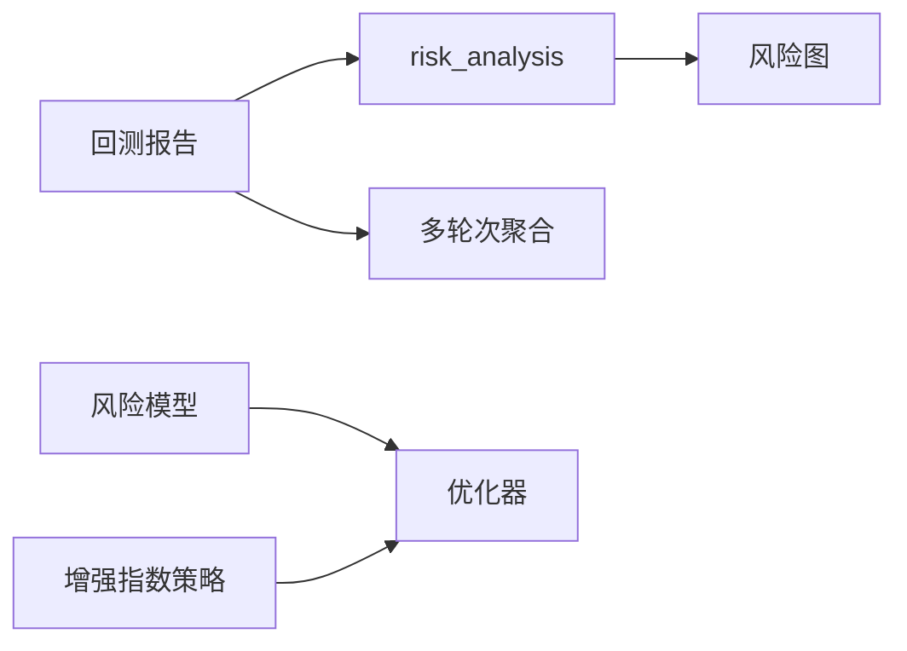

# 风险分析

<cite>
**本文引用的文件**
- [evaluate.py](file://qlib/contrib/evaluate.py)
- [evaluate_portfolio.py](file://qlib/contrib/evaluate_portfolio.py)
- [risk_analysis.py](file://qlib/contrib/report/analysis_position/risk_analysis.py)
- [record_temp.py](file://qlib/workflow/record_temp.py)
- [signal_strategy.py](file://qlib/contrib/strategy/signal_strategy.py)
- [optimizer.py](file://qlib/contrib/strategy/optimizer/optimizer.py)
- [enhanced_indexing.py](file://qlib/contrib/strategy/optimizer/enhanced_indexing.py)
- [structured.py](file://qlib/model/riskmodel/structured.py)
- [README.md（示例：组合优化）](file://examples/portfolio/README.md)
</cite>

## 目录
1. [简介](#简介)
2. [项目结构](#项目结构)
3. [核心组件](#核心组件)
4. [架构总览](#架构总览)
5. [详细组件分析](#详细组件分析)
6. [依赖关系分析](#依赖关系分析)
7. [性能考量](#性能考量)
8. [故障排查指南](#故障排查指南)
9. [结论](#结论)
10. [附录](#附录)

## 简介
本文件系统化梳理 Qlib 风险分析能力，覆盖风险指标体系（收益统计、波动率、最大回撤、夏普比率、信息比率等）、风险分解与归因（因子风险暴露、个股风险贡献、行业风险分析）、风险监控与预警（多频度风险分析、多轮次稳健性检验）、风险报告生成（可视化图表与统计摘要）、以及不同投资策略的风险特征与控制策略设计。目标是帮助读者快速理解并应用 Qlib 的风险分析工具链。

## 项目结构
围绕风险分析的关键模块分布如下：
- 指标计算与分析：risk_analysis（日线/多频度风险指标）、indicator_analysis（交易指标分析）
- 组合层面风险：基于回测报告的超额收益与基准收益风险分解
- 报告与可视化：风险分析图、月度趋势图
- 多轮次稳健性：多轮次回测聚合统计
- 因子风险建模与优化：增强指数策略、协方差估计器、优化器

**图表来源**
- [evaluate.py:26-93](file://qlib/contrib/evaluate.py#L26-L93)
- [risk_analysis.py:15-92](file://qlib/contrib/report/analysis_position/risk_analysis.py#L15-L92)
- [record_temp.py:499-549](file://qlib/workflow/record_temp.py#L499-L549)
- [signal_strategy.py:375-460](file://qlib/contrib/strategy/signal_strategy.py#L375-L460)
- [structured.py:11-65](file://qlib/model/riskmodel/structured.py#L11-L65)
- [optimizer.py:146-177](file://qlib/contrib/strategy/optimizer/optimizer.py#L146-L177)
- [enhanced_indexing.py:87-128](file://qlib/contrib/strategy/optimizer/enhanced_indexing.py#L87-L128)

**章节来源**
- [evaluate.py:26-93](file://qlib/contrib/evaluate.py#L26-L93)
- [risk_analysis.py:15-92](file://qlib/contrib/report/analysis_position/risk_analysis.py#L15-L92)
- [record_temp.py:499-549](file://qlib/workflow/record_temp.py#L499-L549)

## 核心组件
- 日线/多频度风险指标：支持算术累加与几何累加两种累积方式，统一输出均值、标准差、年化收益、信息比率、最大回撤，并按频率映射年化系数。
- 组合超额收益风险分解：在回测报告基础上，分别计算“无成本超额收益”和“含成本超额收益”的风险指标，便于评估交易成本对风险收益的影响。
- 月度风险趋势可视化：按月聚合风险指标，输出折线图，便于观察风险收益随时间的变化。
- 多轮次稳健性分析：多次随机初始化信号首日打乱，重复回测并聚合统计（均值、标准差、均值/标准差），评估策略稳定性。
- 因子风险建模与优化：通过结构化协方差估计器提取因子暴露与残差风险，结合优化器进行跟踪误差最小化的投资组合构建。

**章节来源**
- [evaluate.py:26-93](file://qlib/contrib/evaluate.py#L26-L93)
- [risk_analysis.py:15-92](file://qlib/contrib/report/analysis_position/risk_analysis.py#L15-L92)
- [record_temp.py:575-684](file://qlib/workflow/record_temp.py#L575-L684)
- [structured.py:11-65](file://qlib/model/riskmodel/structured.py#L11-L65)

## 架构总览
下图展示从回测到风险分析再到报告可视化的端到端流程。

**图表来源**
- [record_temp.py:488-549](file://qlib/workflow/record_temp.py#L488-L549)
- [evaluate.py:26-93](file://qlib/contrib/evaluate.py#L26-L93)
- [risk_analysis.py:162-297](file://qlib/contrib/report/analysis_position/risk_analysis.py#L162-L297)

## 详细组件分析

### 风险指标体系与计算
- 收益统计
  - 均值：日度回报的算术均值
  - 年化收益：根据频率映射至年化尺度（日频约252，周频约50，月频约12）
  - 几何方式：以对数收益率的标准差衡量波动，复合年化增长率作为年化收益
- 波动率分析
  - 算术方式：直接对日度回报求样本标准差
  - 对数方式：对日度回报取对数后求标准差
- 最大回撤
  - 算术方式：累计和的滚动峰值回撤
  - 几何方式：复利曲线的滚动峰值回撤
- 夏普比率
  - 使用年化收益与年化波动率（按√250年化）计算
- 信息比率
  - 年化信息比率 = 年化超额收益 / 年化跟踪误差（此处为回报序列标准差×√N）

**图表来源**
- [evaluate.py:26-93](file://qlib/contrib/evaluate.py#L26-L93)

**章节来源**
- [evaluate.py:26-93](file://qlib/contrib/evaluate.py#L26-L93)

### 组合超额收益风险分解
- 在回测报告中，分别计算“基准超额收益”和“基准超额收益-交易成本”的风险指标，用于评估交易成本对风险收益的影响。
- 输出包含“excess_return_without_cost”和“excess_return_with_cost”，便于对比分析。

**图表来源**
- [record_temp.py:507-512](file://qlib/workflow/record_temp.py#L507-L512)
- [evaluate.py:26-93](file://qlib/contrib/evaluate.py#L26-L93)

**章节来源**
- [record_temp.py:507-512](file://qlib/workflow/record_temp.py#L507-L512)

### 月度风险趋势与可视化
- 将日度风险指标按自然月聚合，输出“年化收益、最大回撤、信息比率、波动率”的月度折线图，便于观察策略在不同月份的表现。
- 提供“单期风险柱状图”与“月度趋势图”的组合输出。

**图表来源**
- [risk_analysis.py:57-109](file://qlib/contrib/report/analysis_position/risk_analysis.py#L57-L109)

**章节来源**
- [risk_analysis.py:112-159](file://qlib/contrib/report/analysis_position/risk_analysis.py#L112-L159)

### 多轮次稳健性分析
- 通过随机打乱首日预测分数，重复运行回测，得到多轮次风险指标序列
- 对“年化收益”和“信息比率”进行均值、标准差与均值/标准差的统计汇总，评估策略稳定性

**图表来源**
- [record_temp.py:635-684](file://qlib/workflow/record_temp.py#L635-L684)

**章节来源**
- [record_temp.py:575-684](file://qlib/workflow/record_temp.py#L575-L684)

### 因子风险建模与优化
- 结构化协方差估计器：基于主成分或因子分析估计因子暴露矩阵与残差风险，从而得到可分解的协方差结构
- 增强指数策略：在给定基准权重与跟踪误差约束下，最大化超额收益并控制因子与个股风险
- 优化器：提供全局最小方差、均值-方差、风险平价等优化目标，支持非负权重与和约束

**图表来源**
- [structured.py:11-65](file://qlib/model/riskmodel/structured.py#L11-L65)
- [signal_strategy.py:406-460](file://qlib/contrib/strategy/signal_strategy.py#L406-L460)
- [optimizer.py:146-177](file://qlib/contrib/strategy/optimizer/optimizer.py#L146-L177)
- [enhanced_indexing.py:87-128](file://qlib/contrib/strategy/optimizer/enhanced_indexing.py#L87-L128)

**章节来源**
- [structured.py:11-65](file://qlib/model/riskmodel/structured.py#L11-L65)
- [signal_strategy.py:375-460](file://qlib/contrib/strategy/signal_strategy.py#L375-L460)
- [optimizer.py:146-177](file://qlib/contrib/strategy/optimizer/optimizer.py#L146-L177)
- [enhanced_indexing.py:87-128](file://qlib/contrib/strategy/optimizer/enhanced_indexing.py#L87-L128)

### 风险监控与预警机制
- 多频度风险分析：通过频率参数映射年化系数，支持分钟、日、周、月等不同粒度的风险指标计算
- 多轮次稳健性：通过随机初始化首日信号，评估策略在不同初始条件下的稳定性
- 成本敏感分析：对比“无成本超额收益”和“含成本超额收益”，识别交易成本对风险收益的侵蚀

**章节来源**
- [evaluate.py:48-63](file://qlib/contrib/evaluate.py#L48-L63)
- [record_temp.py:617-633](file://qlib/workflow/record_temp.py#L617-L633)
- [record_temp.py:507-512](file://qlib/workflow/record_temp.py#L507-L512)

### 风险报告生成与实现指南
- 单期风险指标：输出“均值、标准差、年化收益、信息比率、最大回撤”
- 月度趋势图：按月聚合并绘制四类关键指标的时间序列
- 多轮次统计：输出“均值、标准差、均值/标准差”的汇总统计
- 可视化接口：支持在 Notebook 中直接显示或返回图表对象

**章节来源**
- [risk_analysis.py:162-297](file://qlib/contrib/report/analysis_position/risk_analysis.py#L162-L297)
- [record_temp.py:514-549](file://qlib/workflow/record_temp.py#L514-L549)
- [record_temp.py:660-683](file://qlib/workflow/record_temp.py#L660-L683)

### 不同投资策略的风险特征与控制
- 增强指数策略：通过因子暴露与残差风险控制跟踪误差，适合追求稳健超额收益的被动增强场景
- 交易成本控制：在策略层面对买卖冲击与交易限额进行建模，降低对市场波动的扰动
- 多因子风险控制：利用结构化协方差估计器识别主要风险来源，指导资产配置与头寸调整

**章节来源**
- [README.md（示例：组合优化）:1-48](file://examples/portfolio/README.md#L1-L48)
- [signal_strategy.py:375-460](file://qlib/contrib/strategy/signal_strategy.py#L375-L460)
- [structured.py:11-65](file://qlib/model/riskmodel/structured.py#L11-L65)

## 依赖关系分析
- 指标计算依赖于回测报告中的“return、bench、cost”等字段
- 可视化依赖于指标计算结果与绘图工具
- 多轮次稳健性依赖于记录模板的回测执行与指标聚合
- 因子风险建模与优化依赖于风险模型数据与优化器

**图表来源**
- [evaluate.py:26-93](file://qlib/contrib/evaluate.py#L26-L93)
- [risk_analysis.py:162-297](file://qlib/contrib/report/analysis_position/risk_analysis.py#L162-L297)
- [record_temp.py:635-684](file://qlib/workflow/record_temp.py#L635-L684)
- [structured.py:11-65](file://qlib/model/riskmodel/structured.py#L11-L65)
- [optimizer.py:146-177](file://qlib/contrib/strategy/optimizer/optimizer.py#L146-L177)
- [signal_strategy.py:375-460](file://qlib/contrib/strategy/signal_strategy.py#L375-L460)

**章节来源**
- [evaluate.py:26-93](file://qlib/contrib/evaluate.py#L26-L93)
- [risk_analysis.py:162-297](file://qlib/contrib/report/analysis_position/risk_analysis.py#L162-L297)
- [record_temp.py:635-684](file://qlib/workflow/record_temp.py#L635-L684)

## 性能考量
- 指标计算复杂度：O(n)，其中 n 为交易日数量；月度聚合 O(n)
- 多轮次稳健性：受轮次数影响，建议合理设置轮数并在资源允许范围内运行
- 可视化渲染：在 Notebook 环境中批量渲染图表时注意内存占用
- 因子建模：PCA/FA 的复杂度与因子数量和样本规模相关，建议在保证精度的前提下选择合适因子数量

## 故障排查指南
- 频率参数冲突：当同时提供 N 和 freq 时会发出警告，建议仅保留一个
- 回测报告缺失：若指定的分析频率未生成报告，请确保执行器已开启“生成组合指标”
- 月度数据不足：当某月交易日少于阈值时会被跳过，避免图表断点
- 多轮次异常：若策略不支持信号替换或未正确注入信号，需检查记录模板的占位符替换逻辑

**章节来源**
- [evaluate.py:58-62](file://qlib/contrib/evaluate.py#L58-L62)
- [record_temp.py:500-503](file://qlib/workflow/record_temp.py#L500-L503)
- [risk_analysis.py:80-83](file://qlib/contrib/report/analysis_position/risk_analysis.py#L80-L83)

## 结论
Qlib 的风险分析体系以“回测—指标—可视化—稳健性—因子建模—优化”为主线，既覆盖了基础的风险指标计算与分解，也提供了面向实战的多轮次稳健性与因子风险控制能力。通过统一的记录模板与可视化接口，用户可以高效地生成风险报告并进行策略迭代优化。

## 附录
- 关键函数与路径参考
  - 日线/多频度风险指标：[risk_analysis:26-93](file://qlib/contrib/evaluate.py#L26-L93)
  - 组合超额收益风险分解：[PortAnaRecord._generate:507-512](file://qlib/workflow/record_temp.py#L507-L512)
  - 月度风险趋势图：[risk_analysis_graph:162-297](file://qlib/contrib/report/analysis_position/risk_analysis.py#L162-L297)
  - 多轮次稳健性：[MultiPassPortAnaRecord._generate:635-684](file://qlib/workflow/record_temp.py#L635-L684)
  - 因子风险建模：[StructuredCovEstimator:11-65](file://qlib/model/riskmodel/structured.py#L11-L65)
  - 增强指数策略：[EnhancedIndexingStrategy:375-460](file://qlib/contrib/strategy/signal_strategy.py#L375-L460)
  - 优化器：[optimizer.py:146-177](file://qlib/contrib/strategy/optimizer/optimizer.py#L146-L177), [enhanced_indexing.py:87-128](file://qlib/contrib/strategy/optimizer/enhanced_indexing.py#L87-L128)