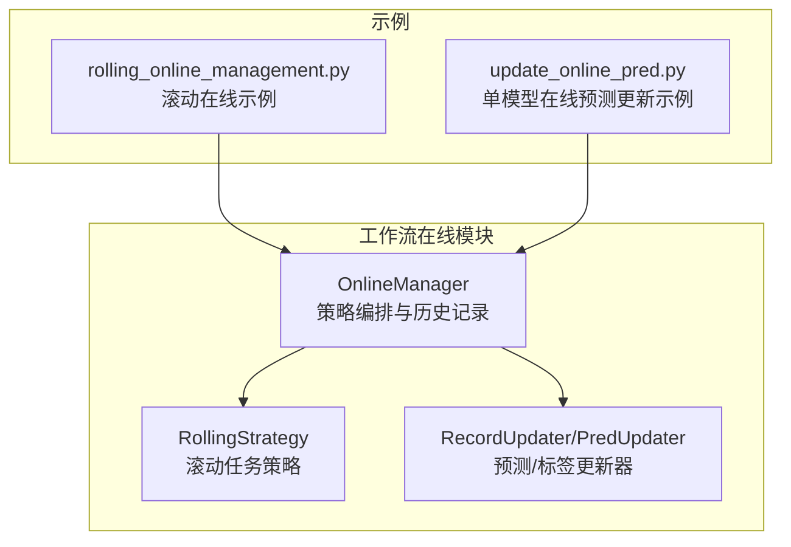
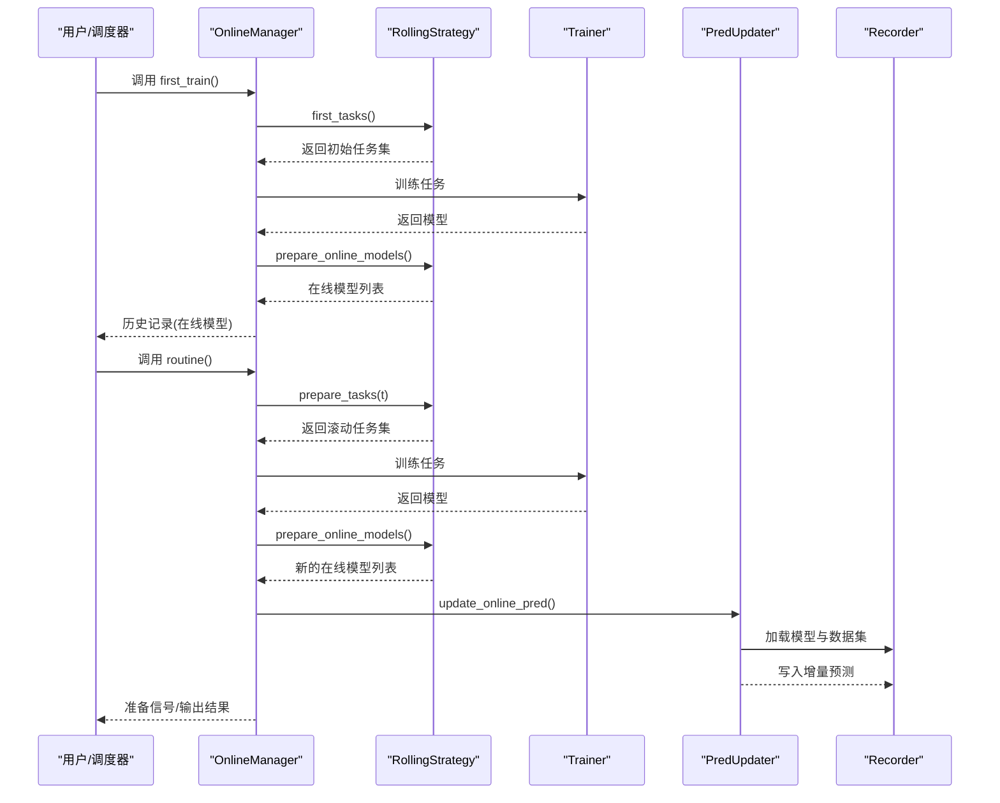
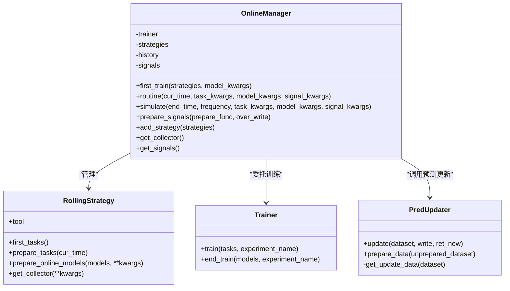
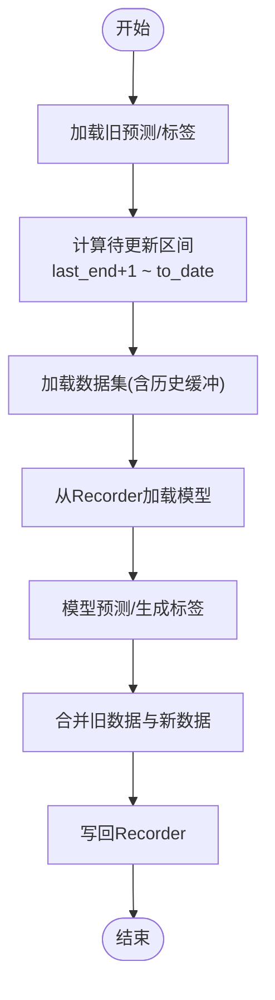
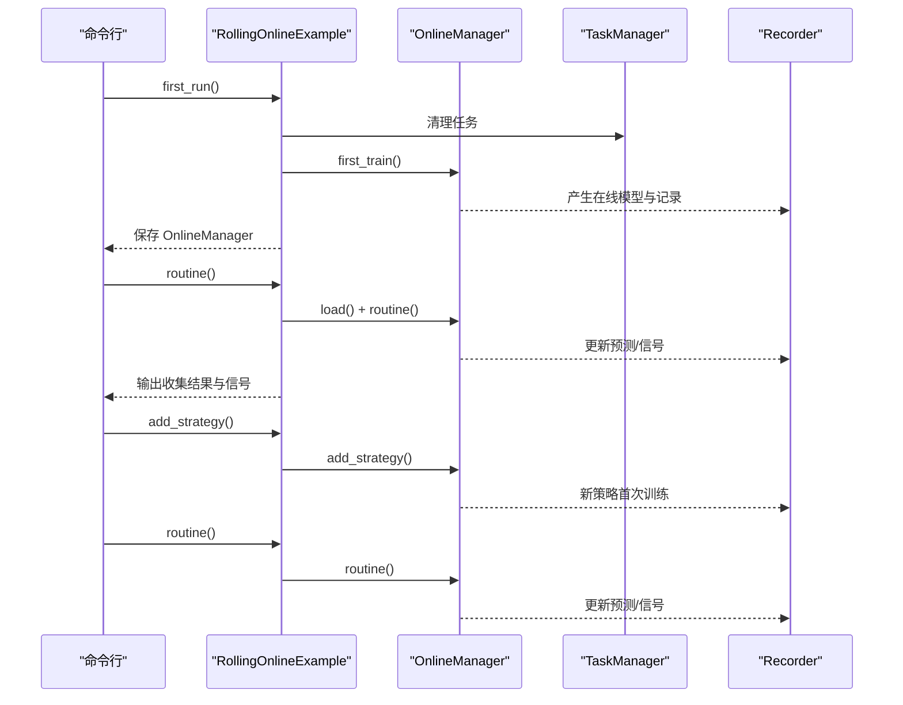
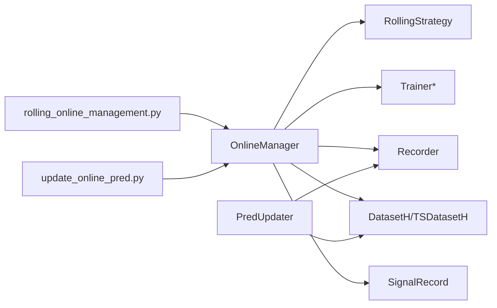

# 在线服务系统

<cite>
**本文引用的文件**
- [manager.py](file://qlib/workflow/online/manager.py)
- [update.py](file://qlib/workflow/online/update.py)
- [rolling_online_management.py](file://examples/online_srv/rolling_online_management.py)
- [update_online_pred.py](file://examples/online_srv/update_online_pred.py)
- [manager.py](file://qlib/contrib/online/manager.py)
- [online_model.py](file://qlib/contrib/online/online_model.py)
</cite>

## 目录
1. [引言](#引言)
2. [项目结构](#项目结构)
3. [核心组件](#核心组件)
4. [架构总览](#架构总览)
5. [详细组件分析](#详细组件分析)
6. [依赖关系分析](#依赖关系分析)
7. [性能考量](#性能考量)
8. [故障排查指南](#故障排查指南)
9. [结论](#结论)
10. [附录](#附录)

## 引言
本文件面向构建“在线量化服务平台”的工程团队，系统性阐述 Qlib 在线服务系统的架构设计与实现要点，覆盖以下主题：
- 实时预测接口与模型更新机制
- 在线预测的实现原理（模型加载、数据预处理、预测执行）
- 模型滚动更新策略（增量学习、模型替换、版本管理）
- 在线服务部署与运维（容器化、负载均衡、故障恢复）
- 离线模式与在线模式的差异与优势
- 提供可直接参考的示例与配置路径，帮助快速落地

## 项目结构
在线服务相关代码主要分布在两个层次：
- 工作流层（workflow/online）：提供在线策略编排、滚动任务、信号生成与历史记录能力
- 示例层（examples/online_srv）：提供可运行的在线服务示例脚本，演示首次训练、滚动更新与策略扩展

图表来源
- [manager.py:101-383](file://qlib/workflow/online/manager.py#L101-L383)
- [update.py:66-299](file://qlib/workflow/online/update.py#L66-L299)
- [rolling_online_management.py:25-145](file://examples/online_srv/rolling_online_management.py#L25-L145)
- [update_online_pred.py:27-56](file://examples/online_srv/update_online_pred.py#L27-L56)

章节来源
- [manager.py:1-383](file://qlib/workflow/online/manager.py#L1-L383)
- [update.py:1-299](file://qlib/workflow/online/update.py#L1-L299)
- [rolling_online_management.py:1-145](file://examples/online_srv/rolling_online_management.py#L1-L145)
- [update_online_pred.py:1-56](file://examples/online_srv/update_online_pred.py#L1-L56)

## 核心组件
- OnlineManager：负责在线策略的生命周期管理，包括首次训练、例行更新、信号准备与历史记录；支持模拟回测与延迟训练以提升并行度
- RollingStrategy：基于滚动窗口的任务生成策略，适配在线滚动训练与模型替换
- RecordUpdater/PredUpdater：对 Recorder 中的预测、标签进行增量更新，确保在线预测随数据演进而刷新
- 示例脚本：演示从首次训练到日常滚动更新的完整流程，并支持动态添加新策略

章节来源
- [manager.py:101-383](file://qlib/workflow/online/manager.py#L101-L383)
- [update.py:66-299](file://qlib/workflow/online/update.py#L66-L299)
- [rolling_online_management.py:25-145](file://examples/online_srv/rolling_online_management.py#L25-L145)
- [update_online_pred.py:27-56](file://examples/online_srv/update_online_pred.py#L27-L56)

## 架构总览
在线服务系统围绕“策略驱动的滚动训练与预测更新”展开，核心流程如下：
- 首次训练：各策略生成初始任务并训练，产出在线模型
- 日常例行：更新预测 → 准备任务 → 准备在线模型 → 准备信号
- 历史记录：记录每个时间点各策略的在线模型集合
- 延迟训练：在模拟或批量场景下，统一在末尾完成训练与信号准备，提高吞吐

图表来源
- [manager.py:156-229](file://qlib/workflow/online/manager.py#L156-L229)
- [update.py:270-282](file://qlib/workflow/online/update.py#L270-L282)

## 详细组件分析

### OnlineManager 组件
- 职责
  - 管理多个在线策略，按日/分钟等频率执行例行流程
  - 记录“某时刻哪些策略选择了哪些在线模型”，形成在线历史
  - 支持模拟回测与延迟训练，便于并行与验证
- 关键方法
  - first_train：首次训练并设置在线模型
  - routine：例行流程（更新预测 → 准备任务 → 准备在线模型 → 准备信号）
  - simulate：历史模拟，支持延迟准备
  - prepare_signals：聚合多策略预测，生成交易信号
  - add_strategy：动态添加新策略并完成其首次训练
- 并发与延迟
  - 使用延迟训练器时，训练与信号准备延后至统一阶段，减少阻塞

图表来源
- [manager.py:101-383](file://qlib/workflow/online/manager.py#L101-L383)
- [update.py:66-299](file://qlib/workflow/online/update.py#L66-L299)

章节来源
- [manager.py:101-383](file://qlib/workflow/online/manager.py#L101-L383)

### 预测更新器（RecordUpdater/PredUpdater）
- 设计目标
  - 在股票数据更新时，对 Recorder 中的预测/标签进行增量更新，避免全量重算
- 数据流
  - 通过 RMDLoader 从 Recorder 加载模型与数据集
  - 自动推断历史依赖长度（如时序数据的步长）
  - 对比旧数据的时间边界，仅对新区间进行预测/标签生成
  - 合并旧数据与新数据，写回 Recorder
- 关键点
  - 支持指定时间范围 to_date/from_date
  - 处理 GPU 模型在 CPU 上反序列化的兼容问题（日志提示）

图表来源
- [update.py:180-249](file://qlib/workflow/online/update.py#L180-L249)

章节来源
- [update.py:21-299](file://qlib/workflow/online/update.py#L21-L299)

### 示例：滚动在线管理（rolling_online_management.py）
- 场景
  - 展示首次训练、例行更新、新增策略、再次例行更新的完整流程
  - 支持多种训练器（TrainerR、TrainerRM、DelayTrainerR、DelayTrainerRM）
  - 可选 MongoDB 任务池，支持分布式 worker
- 关键步骤
  - reset：清理任务与实验记录
  - first_run：首次训练并保存 OnlineManager
  - routine：加载 OnlineManager 执行例行流程
  - add_strategy：动态添加新策略并完成其首次训练
  - 再次 routine：更新所有策略

图表来源
- [rolling_online_management.py:88-133](file://examples/online_srv/rolling_online_management.py#L88-L133)

章节来源
- [rolling_online_management.py:25-145](file://examples/online_srv/rolling_online_management.py#L25-L145)

### 示例：单模型在线预测更新（update_online_pred.py）
- 场景
  - 首次训练并将模型标记为在线模型
  - 定期更新在线预测
- 关键步骤
  - first_train：训练并设置在线标签
  - update_online_pred：调用在线工具更新预测

章节来源
- [update_online_pred.py:27-56](file://examples/online_srv/update_online_pred.py#L27-L56)

### 用户与账户管理（contrib/online）
- UserManager：管理用户数据目录、加载/保存用户实例（账户、策略、模型），支持新增与删除用户
- OnlineModel（示例模型）：加载评分文件作为只读模型，返回指定日期的分数

章节来源
- [manager.py:17-149](file://qlib/contrib/online/manager.py#L17-L149)
- [online_model.py:13-40](file://qlib/contrib/online/online_model.py#L13-L40)

## 依赖关系分析
- OnlineManager 依赖
  - 策略：OnlineStrategy/RollingStrategy
  - 训练器：Trainer/TrainerR/DelayTrainer*
  - 数据：D 日历、数据集与处理器
  - 记录：Recorder、SignalRecord
- 预测更新器依赖
  - Recorder 对象用于加载模型与数据集
  - DatasetH/TSDatasetH 用于推理数据准备
- 示例依赖
  - MongoDB 任务池（可选）
  - 测试配置任务模板

图表来源
- [manager.py:94-98](file://qlib/workflow/online/manager.py#L94-L98)
- [update.py:13-18](file://qlib/workflow/online/update.py#L13-L18)
- [rolling_online_management.py:16-22](file://examples/online_srv/rolling_online_management.py#L16-L22)
- [update_online_pred.py:14-16](file://examples/online_srv/update_online_pred.py#L14-L16)

章节来源
- [manager.py:94-98](file://qlib/workflow/online/manager.py#L94-L98)
- [update.py:13-18](file://qlib/workflow/online/update.py#L13-L18)
- [rolling_online_management.py:16-22](file://examples/online_srv/rolling_online_management.py#L16-L22)
- [update_online_pred.py:14-16](file://examples/online_srv/update_online_pred.py#L14-L16)

## 性能考量
- 延迟训练与并行
  - 使用 DelayTrainer* 将训练集中到末尾执行，减少策略准备阶段的阻塞
  - 支持多进程/分布式 worker（TrainerRM）加速任务训练
- 数据与模型加载
  - 预测更新器仅对新区间进行推理，避免全量重算
  - 自动推断历史依赖长度，合理设置缓冲区，平衡内存与性能
- 日志与可观测性
  - OnlineManager 在模拟与在线状态分别调整日志级别，便于定位问题
  - 预测更新器记录更新条数与 Recorder ID，便于审计

[本节为通用指导，不直接分析具体文件]

## 故障排查指南
- 模型加载异常（CUDA/CPU 不匹配）
  - 现象：反序列化时报错，提示在 CUDA 设备上反序列化但当前为 CPU-only
  - 处理：在加载模型时指定 map_location，或将模型导出到 CPU 设备
  - 参考：预测更新器中的错误提示与注释
- 预测更新未生效
  - 检查 to_date 是否晚于最新日历日期，确认是否被裁剪
  - 检查 from_date 与 last_end 的关系，确保新区间存在
  - 确认 Recorder 中的模型与数据集对象是否正确加载
- 在线历史记录为空
  - 确认策略已调用 prepare_online_models 并返回非空在线模型列表
  - 确认 routine 执行顺序中已先更新预测再准备在线模型
- 分布式训练（TrainerRM）冲突
  - 确保 worker 进程与主进程的时序一致，避免信号提前生成导致污染

章节来源
- [update.py:227-236](file://qlib/workflow/online/update.py#L227-L236)
- [manager.py:220-228](file://qlib/workflow/online/manager.py#L220-L228)

## 结论
Qlib 在线服务系统通过“策略驱动的滚动训练 + 增量预测更新”的组合，实现了低停机、高吞吐的在线量化平台能力。配合延迟训练与分布式训练器，可在保证准确性的同时显著提升效率。建议在生产环境中结合容器化与任务编排，实现弹性扩缩容与故障自愈。

[本节为总结性内容，不直接分析具体文件]

## 附录

### 在线服务部署与运维建议
- 容器化
  - 基于官方镜像或自建镜像，封装 Python 环境与依赖
  - 将数据提供者（如本地文件系统/NFS/MongoDB）挂载到容器
- 负载均衡
  - 将多个在线服务实例暴露为无状态服务，前端通过负载均衡分发请求
  - 对预测接口采用读多写少的缓存策略（可选）
- 故障恢复
  - 使用持久化存储保存 OnlineManager 的序列化状态与 Recorder
  - 对训练器采用重试与幂等设计，避免重复训练
- 监控与告警
  - 监控预测更新耗时、数据边界、模型加载成功率
  - 对 Routine 成功/失败率、信号生成时间进行告警

[本节为通用指导，不直接分析具体文件]

### 离线模式与在线模式的差异与优势
- 差异
  - 在线模式：按日/分钟等频率滚动更新，强调实时性与连续性
  - 离线模式：批处理训练与回测，强调准确性和可复现性
- 优势
  - 在线模式适合高频交易与动态策略，能及时响应市场变化
  - 离线模式适合策略开发与参数搜索，便于对比与审计

[本节为概念性说明，不直接分析具体文件]