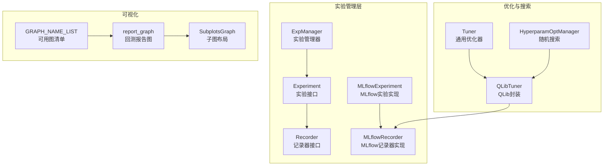
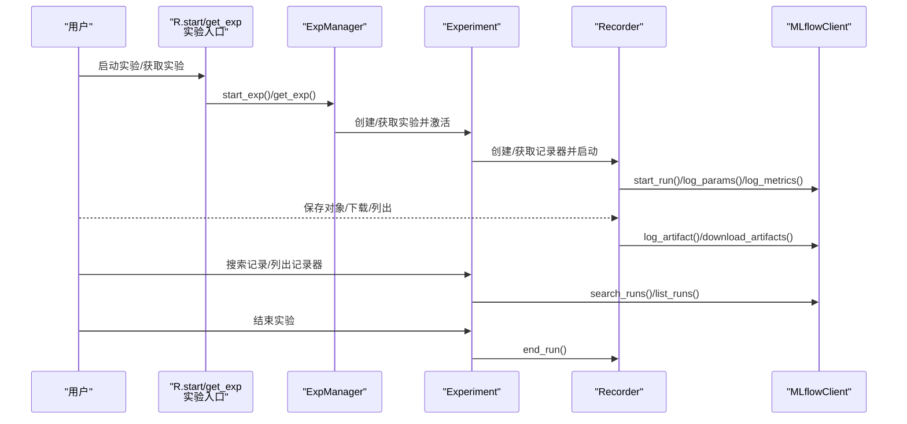
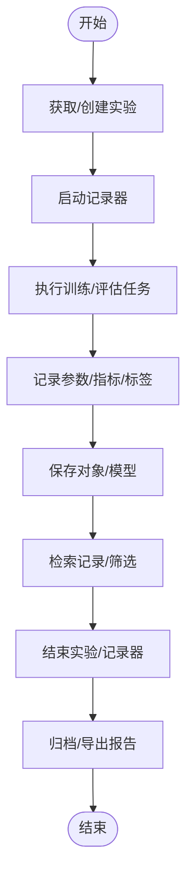
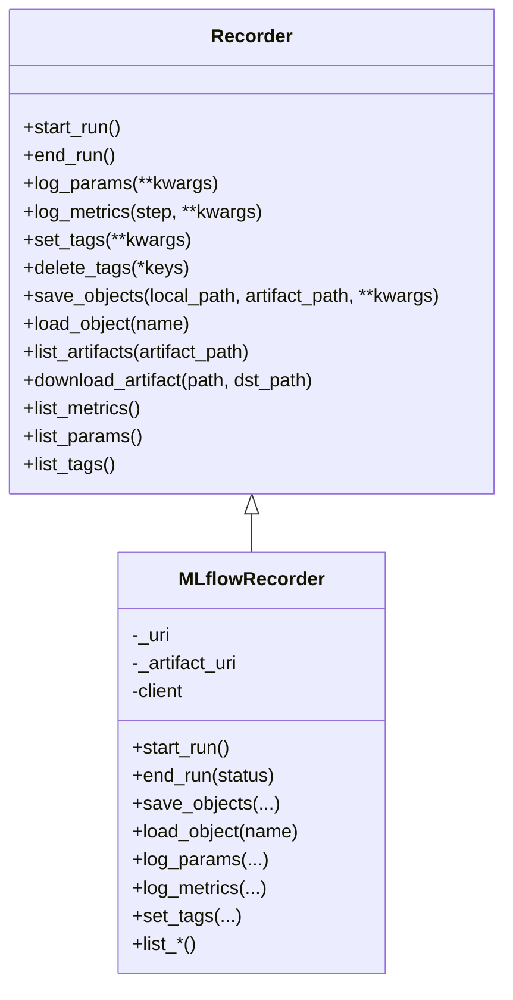
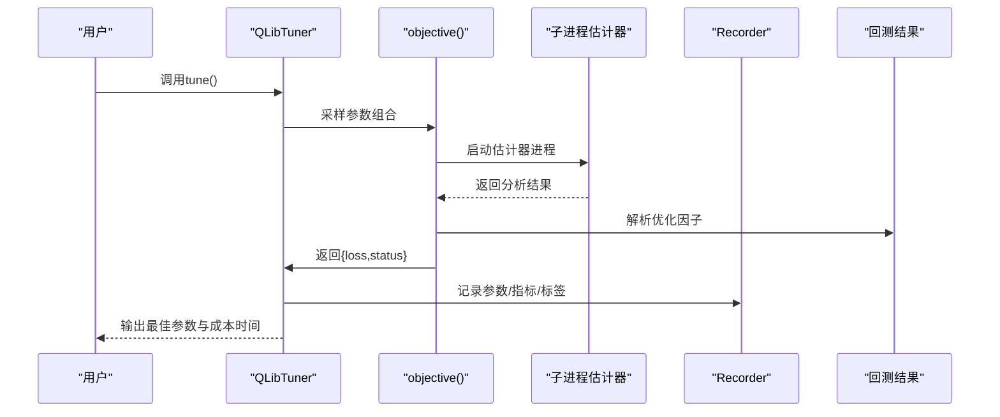
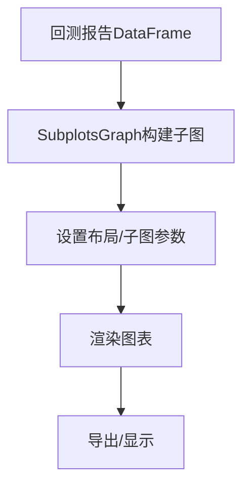
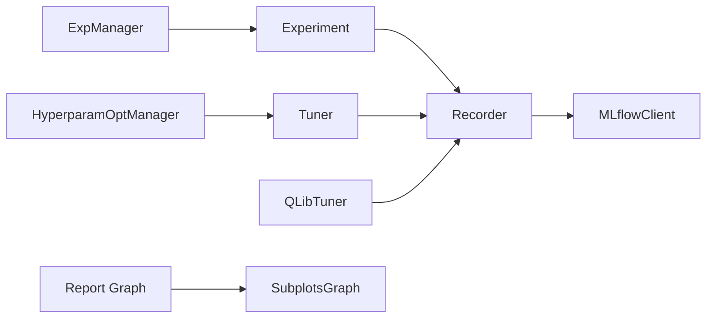

# 实验管理系统

<cite>
**本文引用的文件**
- [exp.py](file://qlib/workflow/exp.py)
- [recorder.py](file://qlib/workflow/recorder.py)
- [expm.py](file://qlib/workflow/expm.py)
- [tuner.py](file://qlib/contrib/tuner/tuner.py)
- [hyperparam_opt.py](file://examples/benchmarks/TFT/libs/hyperparam_opt.py)
- [report.py](file://qlib/contrib/report/analysis_position/report.py)
- [graph.py](file://qlib/contrib/report/graph.py)
- [__init__.py（报告入口）](file://qlib/contrib/report/__init__.py)
- [__init__.py（实验入口）](file://qlib/workflow/__init__.py)
- [workflow.py](file://examples/highfreq/workflow.py)
- [workflow_config_lightgbm_Alpha158.yaml](file://examples/benchmarks/LightGBM/workflow_config_lightgbm_Alpha158.yaml)
- [workflow_config_lightgbm_Alpha360.yaml](file://examples/benchmarks/LightGBM/workflow_config_lightgbm_Alpha360.yaml)
- [workflow_config_TFT.yaml](file://examples/benchmarks/TFT/workflow_config_tft_Alpha158.yaml)
- [workflow_config_ADARNN.yaml](file://examples/benchmarks/ADARNN/workflow_config_adarnn_Alpha360.yaml)
- [workflow_config_GRU.yaml](file://examples/benchmarks/GRU/workflow_config_gru.yaml)
- [workflow_config_MLP.yaml](file://examples/benchmarks/MLP/workflow_config_mlp.yaml)
- [workflow_config_XGBoost.yaml](file://examples/benchmarks/XGBoost/workflow_config_xgboost_Alpha158.yaml)
- [workflow_config_CatBoost.yaml](file://examples/benchmarks/CatBoost/workflow_config_catboost_Alpha158.yaml)
- [workflow_config_LSTM.yaml](file://examples/benchmarks/LSTM/workflow_config_lstm_Alpha158.yaml)
- [workflow_config_TabNet.yaml](file://examples/benchmarks/TabNet/workflow_config_TabNet_Alpha158.yaml)
- [workflow_config_Transformer.yaml](file://examples/benchmarks/Transformer/workflow_config_transformer_Alpha158.yaml)
- [workflow_config_GATs.yaml](file://examples/benchmarks/GATs/workflow_config_gats_Alpha158.yaml)
- [workflow_config_ALSTM.yaml](file://examples/benchmarks/ALSTM/workflow_config_alstm_Alpha158.yaml)
- [workflow_config_SFM.yaml](file://examples/benchmarks/SFM/workflow_config_sfm_Alpha360.yaml)
- [workflow_config_TCN.yaml](file://examples/benchmarks/TCN/workflow_config_tcn_Alpha158.yaml)
- [workflow_config_TCTS.yaml](file://examples/benchmarks/TCTS/workflow_config_tcts_Alpha360.yaml)
- [workflow_config_DoubleEnsemble.yaml](file://examples/benchmarks/DoubleEnsemble/workflow_config_doubleensemble_Alpha158.yaml)
- [workflow_config_HIST.yaml](file://examples/benchmarks/HIST/workflow_config_hist_Alpha360.yaml)
- [workflow_config_KRNN.yaml](file://examples/benchmarks/KRNN/workflow_config_krnn_Alpha360.yaml)
- [workflow_config_Localformer.yaml](file://examples/benchmarks/Localformer/workflow_config_localformer_Alpha158.yaml)
- [workflow_config_IGMTF.yaml](file://examples/benchmarks/IGMTF/workflow_config_igmtf_Alpha360.yaml)
- [workflow_config_Sandwich.yaml](file://examples/benchmarks/Sandwich/workflow_config_sandwich_Alpha360.yaml)
- [workflow_config_tra.yaml](file://examples/benchmarks/TRA/workflow_config_tra_Alpha158.yaml)
- [workflow_config_tra_full.yaml](file://examples/benchmarks/TRA/workflow_config_tra_Alpha360_full.yaml)
- [workflow_config_tra_init.yaml](file://examples/benchmarks/TRA/workflow_config_tra_Alpha158_init.yaml)
- [workflow_config_tra_init_full.yaml](file://examples/benchmarks/TRA/workflow_config_tra_Alpha360_init.yaml)
- [workflow_config_lightgbm_configurable_dataset.yaml](file://examples/benchmarks/LightGBM/workflow_config_lightgbm_configurable_dataset.yaml)
- [workflow_config_lightgbm_multi_freq.yaml](file://examples/benchmarks/LightGBM/workflow_config_lightgbm_multi_freq.yaml)
- [workflow_config_lightgbm_Alpha158_csi500.yaml](file://examples/benchmarks/LightGBM/workflow_config_lightgbm_Alpha158_csi500.yaml)
- [workflow_config_lightgbm_Alpha360_csi500.yaml](file://examples/benchmarks/LightGBM/workflow_config_lightgbm_Alpha360_csi500.yaml)
- [workflow_config_lightgbm_Alpha158_multi_pass_bt.yaml](file://examples/benchmarks/LightGBM/workflow_config_lightgbm_Alpha158_multi_pass_bt.yaml)
- [workflow_config_gru2mlp.yaml](file://examples/benchmarks/GeneralPtNN/workflow_config_gru2mlp.yaml)
- [workflow_config_mlp.yaml](file://examples/benchmarks/GeneralPtNN/workflow_config_mlp.yaml)
- [workflow_config_gru.yaml](file://examples/benchmarks/GeneralPtNN/workflow_config_gru.yaml)
- [workflow_config_doubleensemble_early_stop.yaml](file://examples/benchmarks/DoubleEnsemble/workflow_config_doubleensemble_early_stop_Alpha158.yaml)
- [workflow_config_catboost_Alpha158_csi500.yaml](file://examples/benchmarks/CatBoost/workflow_config_catboost_Alpha158_csi500.yaml)
- [workflow_config_catboost_Alpha360_csi500.yaml](file://examples/benchmarks/CatBoost/workflow_config_catboost_Alpha360_csi500.yaml)
- [workflow_config_catboost_Alpha158_multi_freq.yaml](file://examples/benchmarks/CatBoost/workflow_config_catboost_Alpha158_multi_freq.yaml)
- [workflow_config_catboost_Alpha360_multi_freq.yaml](file://examples/benchmarks/CatBoost/workflow_config_catboost_Alpha360_multi_freq.yaml)
- [workflow_config_lstm_Alpha360.yaml](file://examples/benchmarks/LSTM/workflow_config_lstm_Alpha360.yaml)
- [workflow_config_gru_Alpha360.yaml](file://examples/benchmarks/GRU/workflow_config_gru_Alpha360.yaml)
- [workflow_config_mlp_Alpha360.yaml](file://examples/benchmarks/MLP/workflow_config_mlp_Alpha360.yaml)
- [workflow_config_mlp_Alpha158.yaml](file://examples/benchmarks/MLP/workflow_config_mlp_Alpha158.yaml)
- [workflow_config_mlp_Alpha360_csi500.yaml](file://examples/benchmarks/MLP/workflow_config_mlp_Alpha360_csi500.yaml)
- [workflow_config_mlp_Alpha158_csi500.yaml](file://examples/benchmarks/MLP/workflow_config_mlp_Alpha158_csi500.yaml)
- [workflow_config_alstm_Alpha360.yaml](file://examples/benchmarks/ALSTM/workflow_config_alstm_Alpha360.yaml)
- [workflow_config_gats_Alpha360.yaml](file://examples/benchmarks/GATs/workflow_config_gats_Alpha360.yaml)
- [workflow_config_localformer_Alpha360.yaml](file://examples/benchmarks/Localformer/workflow_config_localformer_Alpha360.yaml)
- [workflow_config_sfm_Alpha360.yaml](file://examples/benchmarks/SFM/workflow_config_sfm_Alpha360.yaml)
- [workflow_config_tcn_Alpha360.yaml](file://examples/benchmarks/TCN/workflow_config_tcn_Alpha360.yaml)
- [workflow_config_tcts_Alpha360.yaml](file://examples/benchmarks/TCTS/workflow_config_tcts_Alpha360.yaml)
- [workflow_config_doubleensemble_Alpha360.yaml](file://examples/benchmarks/DoubleEnsemble/workflow_config_doubleensemble_Alpha360.yaml)
- [workflow_config_hist_Alpha360.yaml](file://examples/benchmarks/HIST/workflow_config_hist_Alpha360.yaml)
- [workflow_config_krnn_Alpha360.yaml](file://examples/benchmarks/KRNN/workflow_config_krnn_Alpha360.yaml)
- [workflow_config_igmtf_Alpha360.yaml](file://examples/benchmarks/IGMTF/workflow_config_igmtf_Alpha360.yaml)
- [workflow_config_sandwich_Alpha360.yaml](file://examples/benchmarks/Sandwich/workflow_config_sandwich_Alpha360.yaml)
- [workflow_config_tra_Alpha360.yaml](file://examples/benchmarks/TRA/workflow_config_tra_Alpha360.yaml)
- [workflow_config_tra_Alpha158.yaml](file://examples/benchmarks/TRA/workflow_config_tra_Alpha158.yaml)
- [workflow_config_tra_Alpha360_full.yaml](file://examples/benchmarks/TRA/workflow_config_tra_Alpha360_full.yaml)
- [workflow_config_tra_Alpha158_full.yaml](file://examples/benchmarks/TRA/workflow_config_tra_Alpha158_full.yaml)
- [workflow_config_tra_Alpha360_init.yaml](file://examples/benchmarks/TRA/workflow_config_tra_Alpha360_init.yaml)
- [workflow_config_tra_Alpha158_init.yaml](file://examples/benchmarks/TRA/workflow_config_tra_Alpha158_init.yaml)
</cite>

## 目录
1. [简介](#简介)
2. [项目结构](#项目结构)
3. [核心组件](#核心组件)
4. [架构总览](#架构总览)
5. [详细组件分析](#详细组件分析)
6. [依赖关系分析](#依赖关系分析)
7. [性能考量](#性能考量)
8. [故障排查指南](#故障排查指南)
9. [结论](#结论)
10. [附录：操作示例与最佳实践](#附录操作示例与最佳实践)

## 简介
本文件面向Qlib实验管理系统，系统性梳理实验生命周期管理（创建、执行、监控、归档）、MLflow集成（参数/指标/标签/模型对象记录与版本化）、参数搜索与比较（含超参数优化）、结果可视化（图表与报告导出）、A/B测试与实验对比，并提供可操作的配置与实践建议。目标是帮助读者快速建立规范的实验管理流程。

## 项目结构
围绕实验管理的关键代码位于以下模块：
- 实验与记录器抽象及MLflow实现：workflow/exp.py、workflow/recorder.py、workflow/expm.py
- 超参数搜索与优化：contrib/tuner/tuner.py、examples/benchmarks/TFT/libs/hyperparam_opt.py
- 结果可视化：contrib/report/analysis_position/report.py、contrib/report/graph.py、contrib/report/__init__.py
- 实验入口与上下文：workflow/__init__.py
- 示例工作流与配置：examples目录下的多个workflow.py与yaml配置

**图示来源**
- [expm.py:22-136](file://qlib/workflow/expm.py#L22-L136)
- [exp.py:15-117](file://qlib/workflow/exp.py#L15-L117)
- [recorder.py:28-121](file://qlib/workflow/recorder.py#L28-L121)
- [tuner.py:25-82](file://qlib/contrib/tuner/tuner.py#L25-L82)
- [hyperparam_opt.py:38-227](file://examples/benchmarks/TFT/libs/hyperparam_opt.py#L38-L227)
- [report.py:166-167](file://qlib/contrib/report/analysis_position/report.py#L166-L167)
- [graph.py:295-339](file://qlib/contrib/report/graph.py#L295-L339)
- [__init__.py（报告入口）:1-11](file://qlib/contrib/report/__init__.py#L1-L11)

**章节来源**
- [expm.py:22-136](file://qlib/workflow/expm.py#L22-L136)
- [exp.py:15-117](file://qlib/workflow/exp.py#L15-L117)
- [recorder.py:28-121](file://qlib/workflow/recorder.py#L28-L121)
- [tuner.py:25-82](file://qlib/contrib/tuner/tuner.py#L25-L82)
- [hyperparam_opt.py:38-227](file://examples/benchmarks/TFT/libs/hyperparam_opt.py#L38-L227)
- [report.py:166-167](file://qlib/contrib/report/analysis_position/report.py#L166-L167)
- [graph.py:295-339](file://qlib/contrib/report/graph.py#L295-L339)
- [__init__.py（报告入口）:1-11](file://qlib/contrib/report/__init__.py#L1-L11)

## 核心组件
- 实验管理器（ExpManager）：负责实验的创建、启动、结束、查询与删除；支持多URI并行管理；维护当前活动实验。
- 实验（Experiment）：抽象实验接口，提供启动/结束、记录器获取/创建、记录检索、删除记录器等能力；MLflow实现提供基于MLflow的持久化与查询。
- 记录器（Recorder）：抽象记录器接口，提供参数/指标/标签/对象存取等能力；MLflow实现对接MLflow客户端，支持异步日志、自动记录未提交代码、环境变量等。
- 超参数搜索（Tuner/QLibTuner/HyperparamOptManager）：提供基于hyperopt或随机搜索的参数空间探索，结合实验记录器进行结果记录与最佳参数保存。
- 可视化（Report Graph/SubplotsGraph）：提供回测报告、IC、累计收益、风险分析等图表生成与子图布局。

**章节来源**
- [expm.py:22-136](file://qlib/workflow/expm.py#L22-L136)
- [exp.py:15-117](file://qlib/workflow/exp.py#L15-L117)
- [recorder.py:28-121](file://qlib/workflow/recorder.py#L28-L121)
- [tuner.py:25-82](file://qlib/contrib/tuner/tuner.py#L25-L82)
- [hyperparam_opt.py:38-227](file://examples/benchmarks/TFT/libs/hyperparam_opt.py#L38-L227)
- [report.py:166-167](file://qlib/contrib/report/analysis_position/report.py#L166-L167)
- [graph.py:295-339](file://qlib/contrib/report/graph.py#L295-L339)

## 架构总览
下图展示从“实验入口”到“MLflow后端”的完整调用链路，以及与“超参数搜索”“可视化”的交互。

**图示来源**
- [__init__.py（实验入口）:242-272](file://qlib/workflow/__init__.py#L242-L272)
- [expm.py:46-92](file://qlib/workflow/expm.py#L46-L92)
- [exp.py:44-72](file://qlib/workflow/exp.py#L44-L72)
- [recorder.py:335-360](file://qlib/workflow/recorder.py#L335-L360)

## 详细组件分析

### 组件A：实验生命周期（创建/执行/监控/归档）
- 创建与获取
  - 通过实验管理器创建或获取实验，支持默认实验名与活动实验缓存。
  - 支持按名称或ID获取实验，不存在时可自动创建（带文件锁保护）。
- 启动与结束
  - 启动时创建/获取记录器并设置为活动状态，结束时统一更新状态并关闭。
- 记录器管理
  - 支持按名称/ID获取记录器，支持创建新记录器或恢复已有记录器。
  - 提供记录检索、删除记录器、列出记录器（按状态/过滤字符串）等能力。
- 归档与删除
  - 支持删除实验与记录器，包含存在性校验与异常处理。

**图示来源**
- [expm.py:196-215](file://qlib/workflow/expm.py#L196-L215)
- [exp.py:114-176](file://qlib/workflow/exp.py#L114-L176)
- [recorder.py:335-360](file://qlib/workflow/recorder.py#L335-L360)

**章节来源**
- [expm.py:196-215](file://qlib/workflow/expm.py#L196-L215)
- [exp.py:114-176](file://qlib/workflow/exp.py#L114-L176)
- [recorder.py:335-360](file://qlib/workflow/recorder.py#L335-L360)

### 组件B：MLflow集成（参数/指标/标签/模型对象）
- 参数与指标
  - 记录器提供批量参数/指标记录，支持异步调用以提升吞吐。
- 标签与元数据
  - 支持设置/删除标签，便于实验分组与筛选。
- 对象存取
  - 支持将任意可序列化对象保存为artifact，或直接上传本地文件/目录。
  - 下载时自动清理临时文件，避免磁盘占用。
- 自动化增强
  - 自动记录未提交代码差异、状态与缓存差异，以及特定前缀环境变量。
- 查询与列表
  - 基于MLflowClient提供记录检索与记录器列表，支持过滤与排序。

**图示来源**
- [recorder.py:28-121](file://qlib/workflow/recorder.py#L28-L121)
- [recorder.py:247-494](file://qlib/workflow/recorder.py#L247-L494)

**章节来源**
- [recorder.py:247-494](file://qlib/workflow/recorder.py#L247-L494)

### 组件C：参数搜索与比较（超参数优化）
- 基于hyperopt的贝叶斯优化
  - QLibTuner封装了objective函数、空间定义与最佳参数保存流程，通过子进程运行估计器并解析回测结果作为优化目标。
- 随机搜索
  - HyperparamOptManager提供随机搜索框架，支持加载历史结果、保存最佳模型与参数、生成唯一键等。
- 最佳实践
  - 明确优化目标（最大化/最小化/相关系数），合理设计参数空间，控制搜索次数，定期归档中间模型与结果。

**图示来源**
- [tuner.py:43-81](file://qlib/contrib/tuner/tuner.py#L43-L81)
- [tuner.py:91-116](file://qlib/contrib/tuner/tuner.py#L91-L116)
- [tuner.py:169-206](file://qlib/contrib/tuner/tuner.py#L169-L206)

**章节来源**
- [tuner.py:25-82](file://qlib/contrib/tuner/tuner.py#L25-L82)
- [tuner.py:84-216](file://qlib/contrib/tuner/tuner.py#L84-L216)
- [hyperparam_opt.py:38-227](file://examples/benchmarks/TFT/libs/hyperparam_opt.py#L38-L227)

### 组件D：结果可视化工具
- 报告图生成
  - report_graph根据回测报告DataFrame生成综合图表，支持布局与子图配置。
- 子图布局
  - SubplotsGraph自动计算行列、标题与图形类型，支持共享轴与间距调整。
- 图表清单
  - GRAPH_NAME_LIST提供可用图名称列表，便于统一注册与调用。

**图示来源**
- [report.py:166-167](file://qlib/contrib/report/analysis_position/report.py#L166-L167)
- [graph.py:295-339](file://qlib/contrib/report/graph.py#L295-L339)
- [__init__.py（报告入口）:1-11](file://qlib/contrib/report/__init__.py#L1-L11)

**章节来源**
- [report.py:112-167](file://qlib/contrib/report/analysis_position/report.py#L112-L167)
- [graph.py:295-339](file://qlib/contrib/report/graph.py#L295-L339)
- [__init__.py（报告入口）:1-11](file://qlib/contrib/report/__init__.py#L1-L11)

## 依赖关系分析
- 实验管理器依赖MLflowClient进行实验与记录器的创建、查询与删除。
- 实验依赖记录器进行参数/指标/标签/对象的持久化。
- 超参数搜索通过QLibTuner与MLflow记录器结合，形成“搜索-执行-记录-比较”的闭环。
- 可视化模块独立于实验管理，但可消费实验记录中的指标与对象。

**图示来源**
- [expm.py:317-434](file://qlib/workflow/expm.py#L317-L434)
- [exp.py:243-380](file://qlib/workflow/exp.py#L243-L380)
- [recorder.py:247-494](file://qlib/workflow/recorder.py#L247-L494)
- [tuner.py:25-82](file://qlib/contrib/tuner/tuner.py#L25-L82)
- [hyperparam_opt.py:38-227](file://examples/benchmarks/TFT/libs/hyperparam_opt.py#L38-L227)
- [report.py:166-167](file://qlib/contrib/report/analysis_position/report.py#L166-L167)
- [graph.py:295-339](file://qlib/contrib/report/graph.py#L295-L339)

**章节来源**
- [expm.py:317-434](file://qlib/workflow/expm.py#L317-L434)
- [exp.py:243-380](file://qlib/workflow/exp.py#L243-L380)
- [recorder.py:247-494](file://qlib/workflow/recorder.py#L247-L494)
- [tuner.py:25-82](file://qlib/contrib/tuner/tuner.py#L25-L82)
- [hyperparam_opt.py:38-227](file://examples/benchmarks/TFT/libs/hyperparam_opt.py#L38-L227)
- [report.py:166-167](file://qlib/contrib/report/analysis_position/report.py#L166-L167)
- [graph.py:295-339](file://qlib/contrib/report/graph.py#L295-L339)

## 性能考量
- 异步日志：MLflow记录器对参数/指标/标签采用异步调用，减少阻塞，但需在结束时等待队列清空。
- 文件锁：创建实验时对文件系统URI加锁，避免并发冲突。
- 记录上限：MLflow列表接口存在记录数量限制，建议使用过滤字符串缩小范围。
- 大对象存储：保存对象时使用临时目录与文件管理，注意磁盘空间与清理策略。

**章节来源**
- [recorder.py:350-355](file://qlib/workflow/recorder.py#L350-L355)
- [expm.py:234-245](file://qlib/workflow/expm.py#L234-L245)
- [exp.py:340-341](file://qlib/workflow/exp.py#L340-L341)

## 故障排查指南
- 实验/记录器不存在
  - 检查输入的名称或ID是否正确，确认实验/记录器生命周期是否已结束。
- 并发创建冲突
  - 文件系统URI下会使用文件锁；HTTP等其他URI需确保幂等与重试逻辑。
- 记录列表为空或受限
  - 使用过滤字符串与状态筛选，避免一次性拉取过多记录。
- 对象下载失败
  - 确认记录器已启动且artifact路径有效；Azure Blob场景会自动清理临时文件。
- 超参搜索无收敛
  - 检查目标函数返回值与状态，确保参数空间合理、评估过程稳定。

**章节来源**
- [exp.py:295-315](file://qlib/workflow/exp.py#L295-L315)
- [expm.py:365-396](file://qlib/workflow/expm.py#L365-L396)
- [recorder.py:413-444](file://qlib/workflow/recorder.py#L413-L444)
- [tuner.py:91-116](file://qlib/contrib/tuner/tuner.py#L91-L116)

## 结论
Qlib实验管理系统以MLflow为核心后端，提供了完整的实验生命周期管理能力：从实验与记录器的创建、启动、监控到归档；通过参数/指标/标签与对象的统一记录，配合超参数搜索与可视化工具，形成可复现、可追踪、可比较的实验流水线。建议在团队内统一实验命名规范、参数空间与优化目标，并结合可视化报告进行A/B测试与对比分析，持续迭代模型与策略。

## 附录：操作示例与最佳实践

### 实验管理操作示例
- 启动/获取实验
  - 使用实验入口方法启动或获取实验，支持指定URI、记录器名称/ID与恢复选项。
- 创建/获取记录器
  - 在实验上下文中创建或获取记录器，自动设置为活动状态并启动。
- 记录参数/指标/标签
  - 在训练/评估过程中记录关键参数、指标与标签，便于后续检索与对比。
- 保存/加载对象
  - 将模型、预测结果或中间产物保存为artifact，支持下载与清理。
- 搜索与列出
  - 使用过滤字符串与状态筛选快速定位目标记录，支持按最新排序。

**章节来源**
- [__init__.py（实验入口）:242-272](file://qlib/workflow/__init__.py#L242-L272)
- [exp.py:114-176](file://qlib/workflow/exp.py#L114-L176)
- [recorder.py:397-444](file://qlib/workflow/recorder.py#L397-L444)

### MLflow集成最佳实践
- 参数长度扩展：系统已放宽参数值长度限制，便于记录复杂配置。
- 自动记录：启用未提交代码差异与必要环境变量记录，提升可追溯性。
- 异步日志：在高吞吐场景下受益明显，注意结束阶段的等待与错误处理。
- 艺术品路径：统一artifact路径，避免跨平台路径问题。

**章节来源**
- [recorder.py:24-25](file://qlib/workflow/recorder.py#L24-L25)
- [recorder.py:354-359](file://qlib/workflow/recorder.py#L354-L359)
- [recorder.py:397-411](file://qlib/workflow/recorder.py#L397-L411)

### 超参数优化最佳实践
- 设计参数空间：明确离散/连续取值范围，避免无效组合。
- 目标函数：确保返回数值与状态一致，NaN将被忽略。
- 搜索策略：小规模随机搜索用于探索，大规模使用贝叶斯优化。
- 结果归档：保存最佳模型与参数，定期备份历史结果。

**章节来源**
- [tuner.py:43-56](file://qlib/contrib/tuner/tuner.py#L43-L56)
- [tuner.py:169-206](file://qlib/contrib/tuner/tuner.py#L169-L206)
- [hyperparam_opt.py:153-186](file://examples/benchmarks/TFT/libs/hyperparam_opt.py#L153-L186)
- [hyperparam_opt.py:188-226](file://examples/benchmarks/TFT/libs/hyperparam_opt.py#L188-L226)

### 结果可视化与报告导出
- 报告图：传入回测报告DataFrame，自动生成综合图表，支持布局与子图定制。
- 子图布局：自动计算行列与标题，支持共享轴与间距调整。
- 图表清单：通过统一入口注册可用图表名称，便于批量生成。

**章节来源**
- [report.py:166-167](file://qlib/contrib/report/analysis_position/report.py#L166-L167)
- [graph.py:295-339](file://qlib/contrib/report/graph.py#L295-L339)
- [__init__.py（报告入口）:1-11](file://qlib/contrib/report/__init__.py#L1-L11)

### A/B测试与实验对比
- 分组策略：通过标签与过滤字符串对实验进行分组与筛选。
- 指标对比：使用记录器列出指标与参数，结合可视化图表进行对比。
- 回测对比：利用报告图生成不同实验的回测对比，辅助决策。

**章节来源**
- [exp.py:317-323](file://qlib/workflow/exp.py#L317-L323)
- [exp.py:342-379](file://qlib/workflow/exp.py#L342-L379)
- [report.py:112-163](file://qlib/contrib/report/analysis_position/report.py#L112-L163)

### 配置参考（示例）
- 高频工作流示例：examples/highfreq/workflow.py
- Alpha158/LightGBM配置：examples/benchmarks/LightGBM/workflow_config_lightgbm_Alpha158.yaml
- Alpha360/LightGBM配置：examples/benchmarks/LightGBM/workflow_config_lightgbm_Alpha360.yaml
- TFT配置：examples/benchmarks/TFT/workflow_config_tft_Alpha158.yaml
- 其他模型配置（如ADARNN、GRU、MLP、XGBoost、CatBoost、LSTM、TabNet、Transformer、GATs、ALSTM、SFM、TCN、TCTS、DoubleEnsemble、HIST、KRNN、Localformer、IGMTF、Sandwich等）

**章节来源**
- [workflow.py](file://examples/highfreq/workflow.py)
- [workflow_config_lightgbm_Alpha158.yaml](file://examples/benchmarks/LightGBM/workflow_config_lightgbm_Alpha158.yaml)
- [workflow_config_lightgbm_Alpha360.yaml](file://examples/benchmarks/LightGBM/workflow_config_lightgbm_Alpha360.yaml)
- [workflow_config_TFT.yaml](file://examples/benchmarks/TFT/workflow_config_tft_Alpha158.yaml)
- [workflow_config_ADARNN.yaml](file://examples/benchmarks/ADARNN/workflow_config_adarnn_Alpha360.yaml)
- [workflow_config_GRU.yaml](file://examples/benchmarks/GRU/workflow_config_gru.yaml)
- [workflow_config_MLP.yaml](file://examples/benchmarks/MLP/workflow_config_mlp.yaml)
- [workflow_config_XGBoost.yaml](file://examples/benchmarks/XGBoost/workflow_config_xgboost_Alpha158.yaml)
- [workflow_config_CatBoost.yaml](file://examples/benchmarks/CatBoost/workflow_config_catboost_Alpha158.yaml)
- [workflow_config_LSTM.yaml](file://examples/benchmarks/LSTM/workflow_config_lstm_Alpha158.yaml)
- [workflow_config_TabNet.yaml](file://examples/benchmarks/TabNet/workflow_config_TabNet_Alpha158.yaml)
- [workflow_config_Transformer.yaml](file://examples/benchmarks/Transformer/workflow_config_transformer_Alpha158.yaml)
- [workflow_config_GATs.yaml](file://examples/benchmarks/GATs/workflow_config_gats_Alpha158.yaml)
- [workflow_config_ALSTM.yaml](file://examples/benchmarks/ALSTM/workflow_config_alstm_Alpha158.yaml)
- [workflow_config_SFM.yaml](file://examples/benchmarks/SFM/workflow_config_sfm_Alpha360.yaml)
- [workflow_config_TCN.yaml](file://examples/benchmarks/TCN/workflow_config_tcn_Alpha158.yaml)
- [workflow_config_TCTS.yaml](file://examples/benchmarks/TCTS/workflow_config_tcts_Alpha360.yaml)
- [workflow_config_DoubleEnsemble.yaml](file://examples/benchmarks/DoubleEnsemble/workflow_config_doubleensemble_Alpha158.yaml)
- [workflow_config_HIST.yaml](file://examples/benchmarks/HIST/workflow_config_hist_Alpha360.yaml)
- [workflow_config_KRNN.yaml](file://examples/benchmarks/KRNN/workflow_config_krnn_Alpha360.yaml)
- [workflow_config_Localformer.yaml](file://examples/benchmarks/Localformer/workflow_config_localformer_Alpha158.yaml)
- [workflow_config_IGMTF.yaml](file://examples/benchmarks/IGMTF/workflow_config_igmtf_Alpha360.yaml)
- [workflow_config_Sandwich.yaml](file://examples/benchmarks/Sandwich/workflow_config_sandwich_Alpha360.yaml)
- [workflow_config_tra.yaml](file://examples/benchmarks/TRA/workflow_config_tra_Alpha158.yaml)
- [workflow_config_tra_full.yaml](file://examples/benchmarks/TRA/workflow_config_tra_Alpha360_full.yaml)
- [workflow_config_tra_init.yaml](file://examples/benchmarks/TRA/workflow_config_tra_Alpha158_init.yaml)
- [workflow_config_tra_init_full.yaml](file://examples/benchmarks/TRA/workflow_config_tra_Alpha360_init_full.yaml)
- [workflow_config_lightgbm_configurable_dataset.yaml](file://examples/benchmarks/LightGBM/workflow_config_lightgbm_configurable_dataset.yaml)
- [workflow_config_lightgbm_multi_freq.yaml](file://examples/benchmarks/LightGBM/workflow_config_lightgbm_multi_freq.yaml)
- [workflow_config_lightgbm_Alpha158_csi500.yaml](file://examples/benchmarks/LightGBM/workflow_config_lightgbm_Alpha158_csi500.yaml)
- [workflow_config_lightgbm_Alpha360_csi500.yaml](file://examples/benchmarks/LightGBM/workflow_config_lightgbm_Alpha360_csi500.yaml)
- [workflow_config_lightgbm_Alpha158_multi_pass_bt.yaml](file://examples/benchmarks/LightGBM/workflow_config_lightgbm_Alpha158_multi_pass_bt.yaml)
- [workflow_config_gru2mlp.yaml](file://examples/benchmarks/GeneralPtNN/workflow_config_gru2mlp.yaml)
- [workflow_config_mlp.yaml](file://examples/benchmarks/GeneralPtNN/workflow_config_mlp.yaml)
- [workflow_config_gru.yaml](file://examples/benchmarks/GeneralPtNN/workflow_config_gru.yaml)
- [workflow_config_doubleensemble_early_stop.yaml](file://examples/benchmarks/DoubleEnsemble/workflow_config_doubleensemble_early_stop_Alpha158.yaml)
- [workflow_config_catboost_Alpha158_csi500.yaml](file://examples/benchmarks/CatBoost/workflow_config_catboost_Alpha158_csi500.yaml)
- [workflow_config_catboost_Alpha360_csi500.yaml](file://examples/benchmarks/CatBoost/workflow_config_catboost_Alpha360_csi500.yaml)
- [workflow_config_catboost_Alpha158_multi_freq.yaml](file://examples/benchmarks/CatBoost/workflow_config_catboost_Alpha158_multi_freq.yaml)
- [workflow_config_catboost_Alpha360_multi_freq.yaml](file://examples/benchmarks/CatBoost/workflow_config_catboost_Alpha360_multi_freq.yaml)
- [workflow_config_lstm_Alpha360.yaml](file://examples/benchmarks/LSTM/workflow_config_lstm_Alpha360.yaml)
- [workflow_config_gru_Alpha360.yaml](file://examples/benchmarks/GRU/workflow_config_gru_Alpha360.yaml)
- [workflow_config_mlp_Alpha360.yaml](file://examples/benchmarks/MLP/workflow_config_mlp_Alpha360.yaml)
- [workflow_config_mlp_Alpha158.yaml](file://examples/benchmarks/MLP/workflow_config_mlp_Alpha158.yaml)
- [workflow_config_mlp_Alpha360_csi500.yaml](file://examples/benchmarks/MLP/workflow_config_mlp_Alpha360_csi500.yaml)
- [workflow_config_mlp_Alpha158_csi500.yaml](file://examples/benchmarks/MLP/workflow_config_mlp_Alpha158_csi500.yaml)
- [workflow_config_alstm_Alpha360.yaml](file://examples/benchmarks/ALSTM/workflow_config_alstm_Alpha360.yaml)
- [workflow_config_gats_Alpha360.yaml](file://examples/benchmarks/GATs/workflow_config_gats_Alpha360.yaml)
- [workflow_config_localformer_Alpha360.yaml](file://examples/benchmarks/Localformer/workflow_config_localformer_Alpha360.yaml)
- [workflow_config_sfm_Alpha360.yaml](file://examples/benchmarks/SFM/workflow_config_sfm_Alpha360.yaml)
- [workflow_config_tcn_Alpha360.yaml](file://examples/benchmarks/TCN/workflow_config_tcn_Alpha360.yaml)
- [workflow_config_tcts_Alpha360.yaml](file://examples/benchmarks/TCTS/workflow_config_tcts_Alpha360.yaml)
- [workflow_config_doubleensemble_Alpha360.yaml](file://examples/benchmarks/DoubleEnsemble/workflow_config_doubleensemble_Alpha360.yaml)
- [workflow_config_hist_Alpha360.yaml](file://examples/benchmarks/HIST/workflow_config_hist_Alpha360.yaml)
- [workflow_config_krnn_Alpha360.yaml](file://examples/benchmarks/KRNN/workflow_config_krnn_Alpha360.yaml)
- [workflow_config_igmtf_Alpha360.yaml](file://examples/benchmarks/IGMTF/workflow_config_igmtf_Alpha360.yaml)
- [workflow_config_sandwich_Alpha360.yaml](file://examples/benchmarks/Sandwich/workflow_config_sandwich_Alpha360.yaml)
- [workflow_config_tra_Alpha360.yaml](file://examples/benchmarks/TRA/workflow_config_tra_Alpha360.yaml)
- [workflow_config_tra_Alpha158.yaml](file://examples/benchmarks/TRA/workflow_config_tra_Alpha158.yaml)
- [workflow_config_tra_Alpha360_full.yaml](file://examples/benchmarks/TRA/workflow_config_tra_Alpha360_full.yaml)
- [workflow_config_tra_Alpha158_full.yaml](file://examples/benchmarks/TRA/workflow_config_tra_Alpha158_full.yaml)
- [workflow_config_tra_Alpha360_init.yaml](file://examples/benchmarks/TRA/workflow_config_tra_Alpha360_init.yaml)
- [workflow_config_tra_Alpha158_init.yaml](file://examples/benchmarks/TRA/workflow_config_tra_Alpha158_init.yaml)