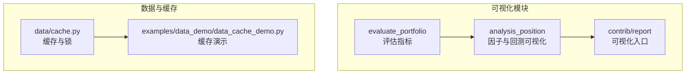
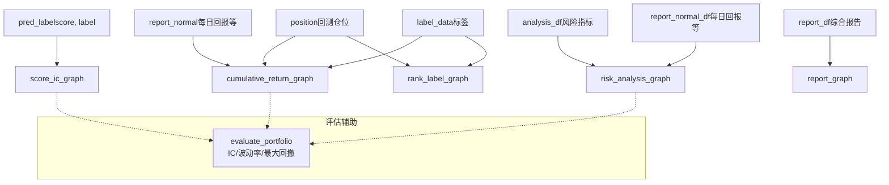
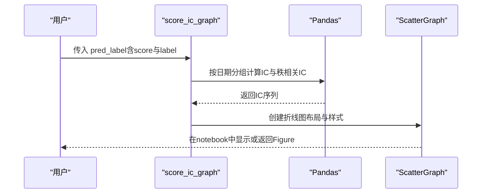
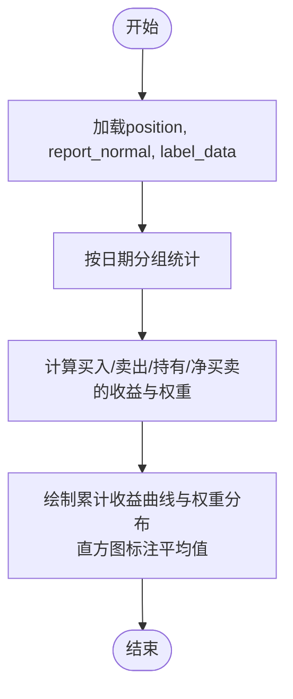
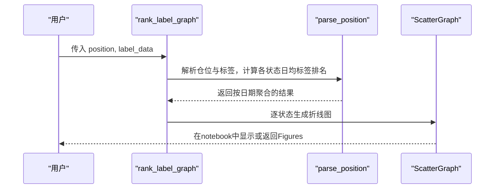
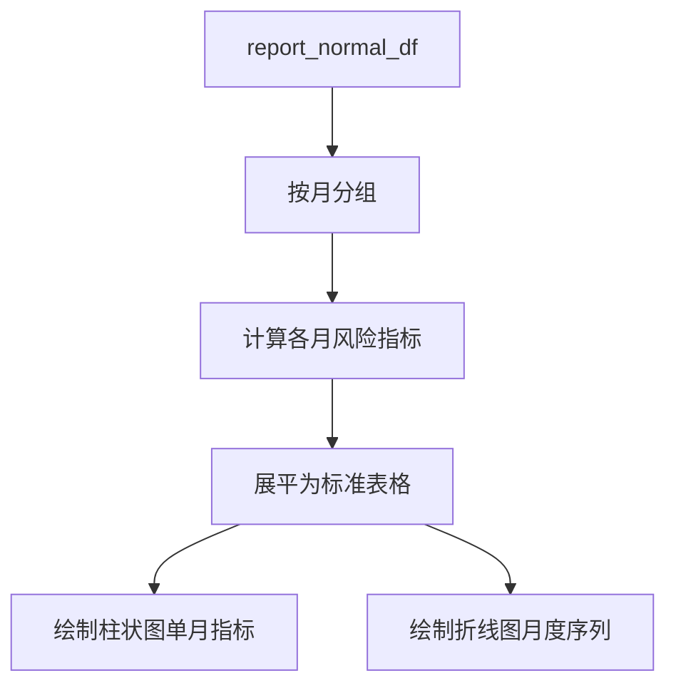
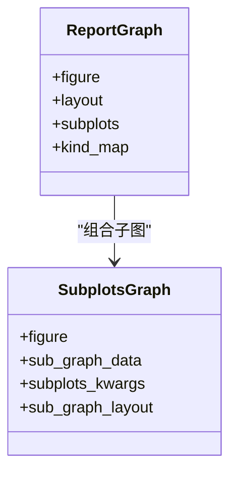
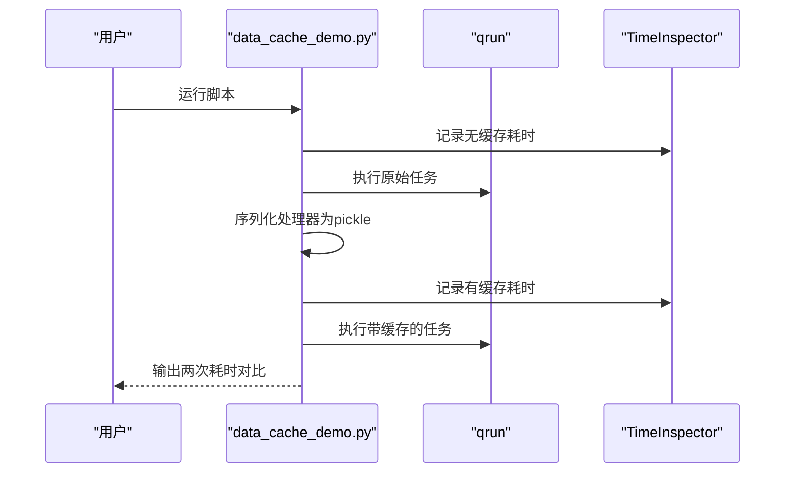
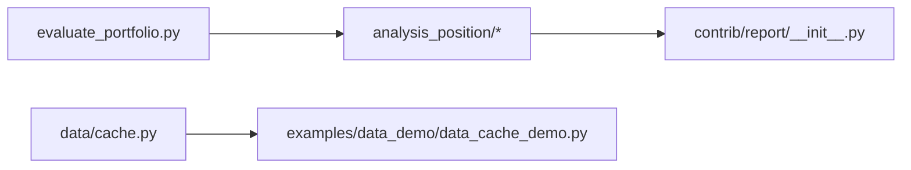
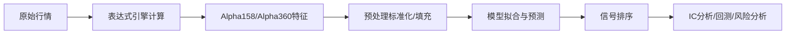

# 可视化工具

<cite>
**本文引用的文件**
- [score_ic.py](file://qlib/contrib/report/analysis_position/score_ic.py)
- [cumulative_return.py](file://qlib/contrib/report/analysis_position/cumulative_return.py)
- [rank_label.py](file://qlib/contrib/report/analysis_position/rank_label.py)
- [risk_analysis.py](file://qlib/contrib/report/analysis_position/risk_analysis.py)
- [report.py](file://qlib/contrib/report/analysis_position/report.py)
- [__init__.py（analysis_position）](file://qlib/contrib/report/analysis_position/__init__.py)
- [__init__.py（contrib/report）](file://qlib/contrib/report/__init__.py)
- [evaluate_portfolio.py](file://qlib/contrib/evaluate_portfolio.py)
- [cache.py](file://qlib/data/cache.py)
- [data_cache_demo.py](file://examples/data_demo/data_cache_demo.py)
- [alpha158_factor_guide.md](file://alpha158_factor_guide.md)
</cite>

## 目录
1. [简介](#简介)
2. [项目结构](#项目结构)
3. [核心组件](#核心组件)
4. [架构总览](#架构总览)
5. [详细组件分析](#详细组件分析)
6. [依赖关系分析](#依赖关系分析)
7. [性能考虑](#性能考虑)
8. [故障排查指南](#故障排查指南)
9. [结论](#结论)
10. [附录](#附录)

## 简介
本文件面向Qlib的可视化工具，聚焦于因子分析与模型解释的可视化能力，包括特征重要性分析、模型性能可视化、回测结果展示等。同时覆盖Alpha因子评估工具的使用指南，如IC分析、分层收益分析、因子稳定性评估；并提供数据缓存演示工具的使用示例，帮助理解数据缓存机制与性能优化效果。文档通过丰富的图表生成示例与自定义可视化方法，满足不同用户的展示需求。

## 项目结构
Qlib的可视化能力主要集中在以下模块：
- 因子与回测报告可视化：位于 contrib/report/analysis_position 下，提供 IC、累计收益、标签排名、风险分析等图表函数
- 报告聚合入口：位于 contrib/report/__init__.py，统一导出可用的可视化图列表
- 评估辅助函数：位于 contrib/evaluate_portfolio.py，提供IC、波动率、最大回撤等指标计算
- 数据缓存与性能优化：位于 data/cache.py，以及 examples/data_demo/data_cache_demo.py 的演示脚本

**图表来源**
- [__init__.py（analysis_position）:1-10](file://qlib/contrib/report/analysis_position/__init__.py#L1-L10)
- [__init__.py（contrib/report）:1-11](file://qlib/contrib/report/__init__.py#L1-L11)
- [evaluate_portfolio.py:192-244](file://qlib/contrib/evaluate_portfolio.py#L192-L244)
- [cache.py:256-292](file://qlib/data/cache.py#L256-L292)
- [data_cache_demo.py:1-55](file://examples/data_demo/data_cache_demo.py#L1-L55)

**章节来源**
- [__init__.py（analysis_position）:1-10](file://qlib/contrib/report/analysis_position/__init__.py#L1-L10)
- [__init__.py（contrib/report）:1-11](file://qlib/contrib/report/__init__.py#L1-L11)

## 核心组件
- IC与分层收益分析：通过 score_ic_graph 与 cumulative_return_graph 提供时序IC与分层收益的可视化
- 标签排名分析：通过 rank_label_graph 展示买入/卖出/持有状态下的日度标签排名均值
- 风险分析：通过 risk_analysis_graph 展示月度风险指标（年化收益、最大回撤、信息比率、波动率）
- 报告汇总：通过 report_graph 生成多子图的综合回测报告
- 评估指标：通过 evaluate_portfolio 提供IC、波动率、最大回撤等指标计算

**章节来源**
- [score_ic.py:25-72](file://qlib/contrib/report/analysis_position/score_ic.py#L25-L72)
- [cumulative_return.py:182-274](file://qlib/contrib/report/analysis_position/cumulative_return.py#L182-L274)
- [rank_label.py:62-129](file://qlib/contrib/report/analysis_position/rank_label.py#L62-L129)
- [risk_analysis.py:162-298](file://qlib/contrib/report/analysis_position/risk_analysis.py#L162-L298)
- [report.py:89-167](file://qlib/contrib/report/analysis_position/report.py#L89-L167)
- [evaluate_portfolio.py:192-244](file://qlib/contrib/evaluate_portfolio.py#L192-L244)

## 架构总览
下图展示了可视化模块的调用关系与数据流：

**图表来源**
- [score_ic.py:25-72](file://qlib/contrib/report/analysis_position/score_ic.py#L25-L72)
- [cumulative_return.py:182-274](file://qlib/contrib/report/analysis_position/cumulative_return.py#L182-L274)
- [rank_label.py:62-129](file://qlib/contrib/report/analysis_position/rank_label.py#L62-L129)
- [risk_analysis.py:162-298](file://qlib/contrib/report/analysis_position/risk_analysis.py#L162-L298)
- [report.py:89-167](file://qlib/contrib/report/analysis_position/report.py#L89-L167)
- [evaluate_portfolio.py:192-244](file://qlib/contrib/evaluate_portfolio.py#L192-L244)

## 详细组件分析

### IC与分层收益分析
- IC分析（score_ic_graph）
  - 输入：包含 score 与 label 的多索引DataFrame（时间维），按日期分组计算皮尔逊IC与秩相关IC
  - 输出：Plotly折线图，支持在notebook中直接显示或返回Figure对象
  - 典型用途：评估模型预测分数与未来收益的线性与单调关系
- 分层收益（cumulative_return_graph）
  - 输入：position、report_normal、label_data
  - 输出：买入/卖出/持有/净买卖的累计收益、权重分布与日度收益直方图，并在直方图中以红线标出平均值
  - 典型用途：展示不同交易行为下的收益路径与稳定性

**图表来源**
- [score_ic.py:25-72](file://qlib/contrib/report/analysis_position/score_ic.py#L25-L72)

**章节来源**
- [score_ic.py:10-22](file://qlib/contrib/report/analysis_position/score_ic.py#L10-L22)
- [score_ic.py:25-72](file://qlib/contrib/report/analysis_position/score_ic.py#L25-L72)

**图表来源**
- [cumulative_return.py:15-86](file://qlib/contrib/report/analysis_position/cumulative_return.py#L15-L86)

**章节来源**
- [cumulative_return.py:15-86](file://qlib/contrib/report/analysis_position/cumulative_return.py#L15-L86)
- [cumulative_return.py:89-179](file://qlib/contrib/report/analysis_position/cumulative_return.py#L89-L179)
- [cumulative_return.py:182-274](file://qlib/contrib/report/analysis_position/cumulative_return.py#L182-L274)

### 标签排名分析
- rank_label_graph
  - 输入：position（回测结果）、label_data（标签序列）
  - 输出：按状态（买入/卖出/持有）划分的日度标签排名均值折线图
  - 典型用途：观察不同交易状态下的标签分布趋势，辅助判断信号质量

**图表来源**
- [rank_label.py:14-59](file://qlib/contrib/report/analysis_position/rank_label.py#L14-L59)

**章节来源**
- [rank_label.py:62-129](file://qlib/contrib/report/analysis_position/rank_label.py#L62-L129)

### 风险分析
- risk_analysis_graph
  - 输入：analysis_df（风险指标多索引表）、report_normal_df（每日回报等）
  - 输出：单图展示各类风险指标柱状图，以及按年月维度的月度时序折线图
  - 典型用途：评估策略的年化收益、最大回撤、信息比率、波动率等

**图表来源**
- [risk_analysis.py:57-92](file://qlib/contrib/report/analysis_position/risk_analysis.py#L57-L92)
- [risk_analysis.py:129-159](file://qlib/contrib/report/analysis_position/risk_analysis.py#L129-L159)

**章节来源**
- [risk_analysis.py:162-298](file://qlib/contrib/report/analysis_position/risk_analysis.py#L162-L298)

### 综合回测报告
- report_graph
  - 输入：report_df（综合报告）
  - 输出：多子图布局的综合报告图，包含基准累计收益、超额收益、换手率、最大回撤等
  - 典型用途：一次性展示回测全流程的关键指标

**图表来源**
- [report.py:89-163](file://qlib/contrib/report/analysis_position/report.py#L89-L163)

**章节来源**
- [report.py:89-167](file://qlib/contrib/report/analysis_position/report.py#L89-L167)

### Alpha因子评估工具使用指南
- IC分析
  - 使用 score_ic_graph 计算并可视化IC与秩相关IC序列，用于评估预测分数与未来收益的线性与单调关系
- 分层收益分析
  - 使用 cumulative_return_graph 对买入/卖出/持有/净买卖四类行为进行收益分解与可视化
- 因子稳定性评估
  - 结合 evaluate_portfolio 中的IC计算函数，对滚动窗口的IC序列稳定性进行分析
- 因子与标签的关系
  - 使用 rank_label_graph 观察不同交易状态下的标签排名分布，辅助判断因子的稳定性与有效性

**章节来源**
- [score_ic.py:25-72](file://qlib/contrib/report/analysis_position/score_ic.py#L25-L72)
- [cumulative_return.py:182-274](file://qlib/contrib/report/analysis_position/cumulative_return.py#L182-L274)
- [rank_label.py:62-129](file://qlib/contrib/report/analysis_position/rank_label.py#L62-L129)
- [evaluate_portfolio.py:229-244](file://qlib/contrib/evaluate_portfolio.py#L229-L244)
- [alpha158_factor_guide.md:802-862](file://alpha158_factor_guide.md#L802-L862)

### 数据缓存演示工具
- 目标：演示如何将已构建的数据处理器持久化到磁盘，避免重复预处理，提升训练/回测效率
- 关键步骤：
  - 加载原始任务配置，运行一次以记录耗时
  - 将数据处理器序列化保存为pickle文件
  - 修改任务配置，指向该pickle文件作为处理器
  - 再次运行，对比耗时差异
- 性能优化要点：通过缓存处理器，减少重复的特征工程与数据加载开销

**图表来源**
- [data_cache_demo.py:23-54](file://examples/data_demo/data_cache_demo.py#L23-L54)

**章节来源**
- [data_cache_demo.py:1-55](file://examples/data_demo/data_cache_demo.py#L1-L55)
- [cache.py:256-292](file://qlib/data/cache.py#L256-L292)

## 依赖关系分析
- 可视化模块依赖关系
  - analysis_position 子模块各自独立，通过 contrib/report/__init__.py 聚合导出
  - 各图函数依赖 Pandas 进行分组与聚合，依赖 Plotly 图形对象进行渲染
  - 风险分析依赖 evaluate_portfolio 提供的风险指标计算
- 缓存与锁
  - data/cache.py 提供读写锁与Redis锁封装，保障并发安全与一致性

**图表来源**
- [__init__.py（contrib/report）:1-11](file://qlib/contrib/report/__init__.py#L1-L11)
- [evaluate_portfolio.py:192-244](file://qlib/contrib/evaluate_portfolio.py#L192-L244)
- [cache.py:256-292](file://qlib/data/cache.py#L256-L292)
- [data_cache_demo.py:1-55](file://examples/data_demo/data_cache_demo.py#L1-L55)

**章节来源**
- [__init__.py（contrib/report）:1-11](file://qlib/contrib/report/__init__.py#L1-L11)
- [evaluate_portfolio.py:192-244](file://qlib/contrib/evaluate_portfolio.py#L192-L244)
- [cache.py:256-292](file://qlib/data/cache.py#L256-L292)

## 性能考虑
- 可视化性能
  - 大量子图与复杂布局会增加渲染时间，建议按需生成子图或分批输出
  - 使用Notebook模式可直接显示，非Notebook模式返回Figure便于批量保存
- 数据缓存
  - 通过持久化数据处理器，避免重复特征工程与数据加载
  - 在高频率重跑实验时，缓存可显著降低整体耗时

[本节为通用指导，无需特定文件引用]

## 故障排查指南
- 图表未显示
  - 确认是否在Notebook环境中调用，或在非Notebook环境中正确接收并保存Figure对象
- 数据格式不匹配
  - IC分析要求输入包含 score 与 label 的多索引DataFrame；分层收益分析需要 position、report_normal、label_data 三者对齐
  - 风险分析要求 report_normal_df 的索引为日期，且包含 return、cost、bench、turnover 等列
- 并发与缓存问题
  - 若使用Redis缓存，注意读写锁的获取与释放，避免死锁
  - 确保pickle文件路径正确，且任务配置中指向 file:// 协议

**章节来源**
- [score_ic.py:42-56](file://qlib/contrib/report/analysis_position/score_ic.py#L42-L56)
- [cumulative_return.py:230-247](file://qlib/contrib/report/analysis_position/cumulative_return.py#L230-L247)
- [risk_analysis.py:237-255](file://qlib/contrib/report/analysis_position/risk_analysis.py#L237-L255)
- [cache.py:256-292](file://qlib/data/cache.py#L256-L292)

## 结论
Qlib的可视化工具围绕因子分析与回测报告提供了完整的图表体系：从IC与分层收益到标签排名与风险分析，再到综合报告图，能够全面支撑模型解释与评估。配合数据缓存演示，用户可以快速掌握性能优化技巧，在保证结果准确性的前提下显著缩短实验周期。

[本节为总结性内容，无需特定文件引用]

## 附录
- 快速上手建议
  - 先用 score_ic_graph 与 cumulative_return_graph 完成基础评估
  - 再用 risk_analysis_graph 与 report_graph 深入分析风险与整体表现
  - 最后结合 evaluate_portfolio 的指标函数进行量化分析
- 参考流程图（Alpha158流水线概览）

**图表来源**
- [alpha158_factor_guide.md:802-862](file://alpha158_factor_guide.md#L802-L862)