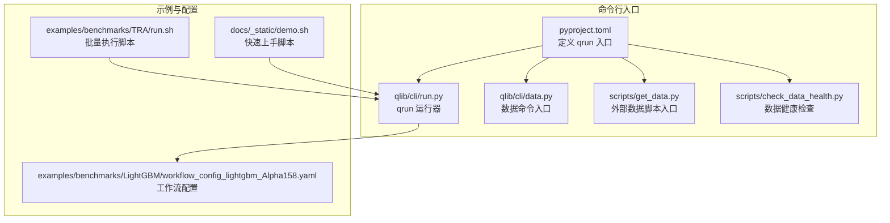
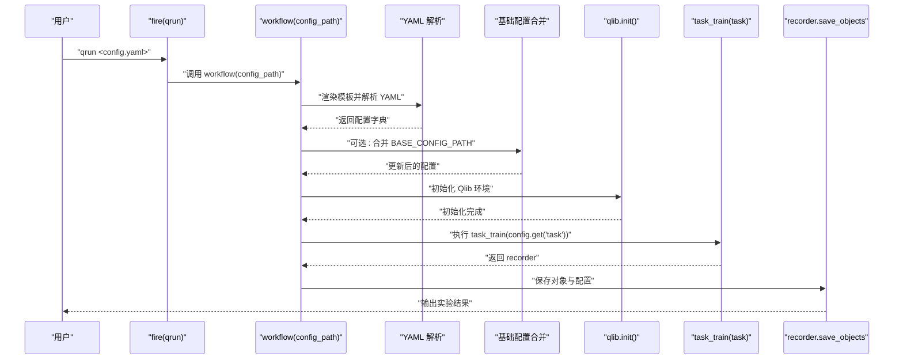
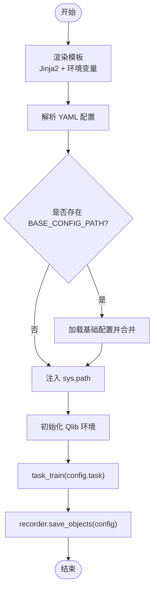
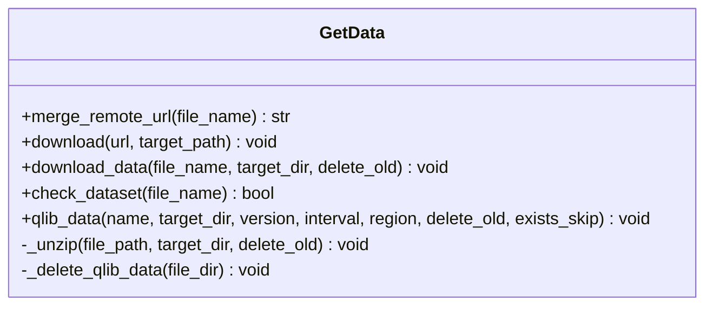
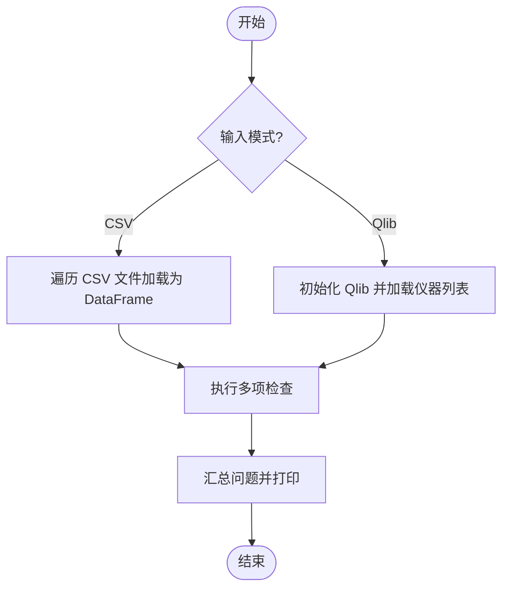
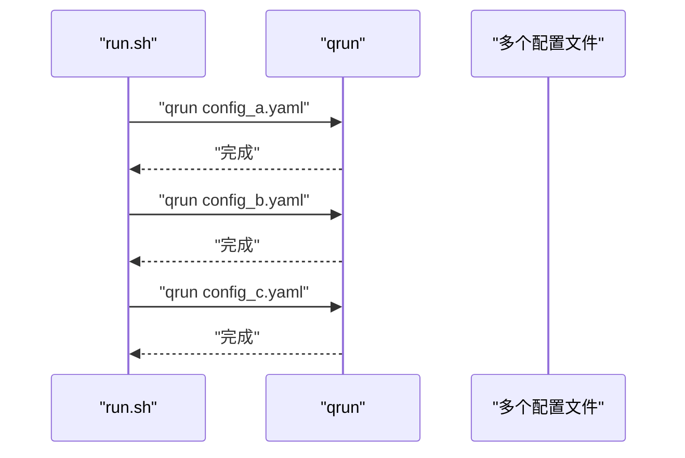
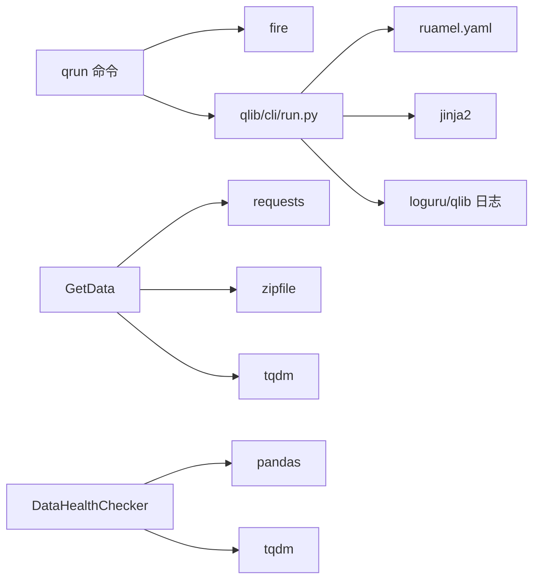

# 命令行工具

<cite>
**本文引用的文件**
- [qlib/cli/run.py](file://qlib/cli/run.py)
- [qlib/cli/data.py](file://qlib/cli/data.py)
- [scripts/get_data.py](file://scripts/get_data.py)
- [scripts/check_data_health.py](file://scripts/check_data_health.py)
- [examples/benchmarks/LightGBM/workflow_config_lightgbm_Alpha158.yaml](file://examples/benchmarks/LightGBM/workflow_config_lightgbm_Alpha158.yaml)
- [examples/benchmarks/TRA/run.sh](file://examples/benchmarks/TRA/run.sh)
- [docs/_static/demo.sh](file://docs/_static/demo.sh)
- [pyproject.toml](file://pyproject.toml)
- [qlib/tests/data.py](file://qlib/tests/data.py)
</cite>

## 目录
1. [简介](#简介)
2. [项目结构](#项目结构)
3. [核心组件](#核心组件)
4. [架构总览](#架构总览)
5. [详细组件分析](#详细组件分析)
6. [依赖关系分析](#依赖关系分析)
7. [性能与可扩展性](#性能与可扩展性)
8. [故障排查指南](#故障排查指南)
9. [结论](#结论)
10. [附录：命令速查与示例](#附录命令速查与示例)

## 简介
本文件系统化梳理 Qlib 的命令行工具体系，覆盖以下方面：
- 实验执行与工作流（qrun）：通过 YAML 配置驱动完整量化研究流程，包括初始化、训练、记录与保存。
- 数据命令行工具：提供一键下载、解压、校验与健康检查的数据获取与验证能力。
- 参数说明与使用示例：涵盖常用参数组合、批量执行、自动化脚本集成。
- 高级用法与工作流集成：帮助用户构建从数据准备到回测分析的完整数据科学流水线。

## 项目结构
与命令行工具直接相关的目录与文件如下：
- CLI 入口与运行器：qlib/cli/run.py（qrun 命令）、qlib/cli/data.py（数据子命令入口）
- 数据脚本：scripts/get_data.py（外部脚本入口）、scripts/check_data_health.py（数据健康检查）
- 示例配置：examples/benchmarks/LightGBM/workflow_config_lightgbm_Alpha158.yaml（工作流配置示例）
- 示例脚本：examples/benchmarks/TRA/run.sh（批量执行示例）、docs/_static/demo.sh（快速上手示例）
- 安装与入口点：pyproject.toml（定义命令入口 qrun）

**图示来源**
- [pyproject.toml:119-121](file://pyproject.toml#L119-L121)
- [qlib/cli/run.py:152-158](file://qlib/cli/run.py#L152-L158)
- [qlib/cli/data.py:1-9](file://qlib/cli/data.py#L1-L9)
- [scripts/get_data.py:1-9](file://scripts/get_data.py#L1-L9)
- [scripts/check_data_health.py:1-249](file://scripts/check_data_health.py#L1-L249)
- [examples/benchmarks/LightGBM/workflow_config_lightgbm_Alpha158.yaml:1-72](file://examples/benchmarks/LightGBM/workflow_config_lightgbm_Alpha158.yaml#L1-L72)
- [examples/benchmarks/TRA/run.sh:1-30](file://examples/benchmarks/TRA/run.sh#L1-L30)
- [docs/_static/demo.sh:1-12](file://docs/_static/demo.sh#L1-L12)

**章节来源**
- [pyproject.toml:119-121](file://pyproject.toml#L119-L121)
- [qlib/cli/run.py:152-158](file://qlib/cli/run.py#L152-L158)
- [qlib/cli/data.py:1-9](file://qlib/cli/data.py#L1-L9)
- [scripts/get_data.py:1-9](file://scripts/get_data.py#L1-L9)
- [scripts/check_data_health.py:1-249](file://scripts/check_data_health.py#L1-L249)
- [examples/benchmarks/LightGBM/workflow_config_lightgbm_Alpha158.yaml:1-72](file://examples/benchmarks/LightGBM/workflow_config_lightgbm_Alpha158.yaml#L1-L72)
- [examples/benchmarks/TRA/run.sh:1-30](file://examples/benchmarks/TRA/run.sh#L1-L30)
- [docs/_static/demo.sh:1-12](file://docs/_static/demo.sh#L1-L12)

## 核心组件
- qrun 工作流运行器：解析 YAML 配置、渲染模板、加载基础配置、初始化 Qlib、执行任务并保存结果。
- 数据命令入口：封装 GetData 类，支持下载指定数据集、按版本选择、解压与清理旧数据。
- 数据健康检查：对 CSV 或 Qlib 目录进行完整性与一致性检查，输出问题汇总。
- 批量执行脚本：演示多配置并行或串行执行工作流。

关键职责与交互：
- qrun 负责“编排”：加载配置、初始化环境、触发训练与记录。
- 数据命令负责“数据供应”：下载、解压、校验。
- 健康检查负责“质量把关”：发现缺失列、异常跳变、大小写问题等。

**章节来源**
- [qlib/cli/run.py:86-149](file://qlib/cli/run.py#L86-L149)
- [qlib/tests/data.py:18-212](file://qlib/tests/data.py#L18-L212)
- [scripts/check_data_health.py:13-249](file://scripts/check_data_health.py#L13-L249)

## 架构总览
下图展示 qrun 从启动到完成一次实验的关键调用链路，包括配置渲染、基础配置合并、环境初始化、任务执行与结果保存。

**图示来源**
- [qlib/cli/run.py:86-149](file://qlib/cli/run.py#L86-L149)

## 详细组件分析

### 组件一：qrun 工作流运行器
职责与流程要点：
- 模板渲染：基于 Jinja2 渲染 YAML，自动从环境变量注入未声明变量。
- 基础配置合并：支持通过 BASE_CONFIG_PATH 引入基础配置，优先使用绝对路径，否则相对当前配置文件路径查找。
- 系统路径注入：支持在配置中声明额外 Python 路径，便于扩展模块导入。
- 初始化与实验：根据配置初始化 Qlib；若未显式设置实验管理器，则默认使用本地文件存储。
- 任务执行：调用任务训练入口，产出记录器并保存对象与配置。

**图示来源**
- [qlib/cli/run.py:52-149](file://qlib/cli/run.py#L52-L149)

**章节来源**
- [qlib/cli/run.py:30-149](file://qlib/cli/run.py#L30-L149)

### 组件二：数据命令行工具（GetData）
功能与参数概览：
- 下载数据集：支持指定压缩包名称与目标目录，自动拼接远程地址并下载。
- 版本与命名：根据 Qlib 版本与区域频率生成文件名，若指定版本不存在则回退到 latest。
- 解压与清理：可删除旧数据目录（features、instruments、calendars、features_cache、dataset_cache），避免冲突。
- 存在性跳过：当目标目录已存在且启用 exists_skip 时，跳过下载。
- 健康检查：提供独立脚本对 CSV 或 Qlib 目录进行完整性与一致性检查。

**图示来源**
- [qlib/tests/data.py:18-212](file://qlib/tests/data.py#L18-L212)

**章节来源**
- [qlib/cli/data.py:1-9](file://qlib/cli/data.py#L1-L9)
- [scripts/get_data.py:1-9](file://scripts/get_data.py#L1-L9)
- [qlib/tests/data.py:18-212](file://qlib/tests/data.py#L18-L212)

### 组件三：数据健康检查（DataHealthChecker）
能力与检查项：
- CSV 加载或 Qlib 目录加载两种模式。
- 缺失数据检查、OHLCV 大步长变化检查、必需列检查、因子列缺失检查。
- 特征目录大小写检查（Linux 等区分大小写文件系统）。
- 输出汇总报告，定位问题并给出修复建议。

**图示来源**
- [scripts/check_data_health.py:13-249](file://scripts/check_data_health.py#L13-L249)

**章节来源**
- [scripts/check_data_health.py:13-249](file://scripts/check_data_health.py#L13-L249)

### 组件四：批量执行与示例脚本
- run.sh：演示多次调用 qrun 执行不同配置，或通过 Python 脚本传参执行。
- demo.sh：演示克隆仓库、安装、进入 examples 并执行一个基准配置的工作流。

**图示来源**
- [examples/benchmarks/TRA/run.sh:1-30](file://examples/benchmarks/TRA/run.sh#L1-L30)

**章节来源**
- [examples/benchmarks/TRA/run.sh:1-30](file://examples/benchmarks/TRA/run.sh#L1-L30)
- [docs/_static/demo.sh:1-12](file://docs/_static/demo.sh#L1-L12)

## 依赖关系分析
- 入口点与分发：pyproject.toml 中定义 qrun 命令指向 qlib.cli.run:run，确保用户可通过命令行直接调用。
- 运行时依赖：fire 提供命令行解析，ruamel.yaml 用于安全解析 YAML，Jinja2 用于模板渲染，loguru/qlib 日志用于输出。
- 数据依赖：requests 用于下载，tqdm 用于进度条，zipfile 用于解压，loguru 与 tqdm 提升用户体验。

**图示来源**
- [pyproject.toml:119-121](file://pyproject.toml#L119-L121)
- [qlib/cli/run.py:8-19](file://qlib/cli/run.py#L8-L19)
- [qlib/tests/data.py:9-15](file://qlib/tests/data.py#L9-L15)
- [scripts/check_data_health.py:4-11](file://scripts/check_data_health.py#L4-L11)

**章节来源**
- [pyproject.toml:27-57](file://pyproject.toml#L27-L57)
- [qlib/cli/run.py:8-19](file://qlib/cli/run.py#L8-L19)
- [qlib/tests/data.py:9-15](file://qlib/tests/data.py#L9-L15)
- [scripts/check_data_health.py:4-11](file://scripts/check_data_health.py#L4-L11)

## 性能与可扩展性
- 模板渲染：Jinja2 渲染仅在启动阶段进行，开销较小；建议在 CI 中预设必要环境变量以减少运行时判断。
- 数据下载：requests 流式下载配合 tqdm 显示进度，超时控制保障稳定性；建议在网络不稳定场景下增加重试策略。
- 健康检查：对大规模数据集检查耗时较长，建议分批执行或并行化；注意日志输出与内存占用。
- 可扩展性：通过 sys.path 注入与模块路径配置，可在不修改核心代码的情况下扩展自定义模型、处理器与记录器。

[本节为通用建议，无需特定文件来源]

## 故障排查指南
常见问题与解决思路：
- 配置文件找不到或路径错误
  - 确认 BASE_CONFIG_PATH 是否存在；若相对路径无效，检查相对于当前配置文件的路径是否正确。
  - 参考：[qlib/cli/run.py:110-127](file://qlib/cli/run.py#L110-L127)
- 环境变量未注入导致模板渲染失败
  - 确保模板中使用的变量已在环境变量中设置；查看日志中渲染上下文。
  - 参考：[qlib/cli/run.py:76-82](file://qlib/cli/run.py#L76-L82)
- 数据下载失败或网络超时
  - 检查网络连通性与代理设置；适当增大超时时间或重试。
  - 参考：[qlib/tests/data.py:56-71](file://qlib/tests/data.py#L56-L71)
- 数据目录存在但被误删
  - 使用 delete_old=False 或调整 target_dir；确认旧数据目录结构。
  - 参考：[qlib/tests/data.py:123-151](file://qlib/tests/data.py#L123-L151)
- 特征目录大小写导致加载失败（Linux）
  - 将 features 下的子目录统一改为小写。
  - 参考：[scripts/check_data_health.py:79-107](file://scripts/check_data_health.py#L79-L107)
- 因子列缺失或为空
  - 补充因子列或检查上游数据生成逻辑。
  - 参考：[scripts/check_data_health.py:185-211](file://scripts/check_data_health.py#L185-L211)

**章节来源**
- [qlib/cli/run.py:110-127](file://qlib/cli/run.py#L110-L127)
- [qlib/cli/run.py:76-82](file://qlib/cli/run.py#L76-L82)
- [qlib/tests/data.py:56-71](file://qlib/tests/data.py#L56-L71)
- [qlib/tests/data.py:123-151](file://qlib/tests/data.py#L123-L151)
- [scripts/check_data_health.py:79-107](file://scripts/check_data_health.py#L79-L107)
- [scripts/check_data_health.py:185-211](file://scripts/check_data_health.py#L185-L211)

## 结论
Qlib 的命令行工具以 qrun 为核心，结合数据命令与健康检查脚本，形成从“配置驱动实验”到“数据质量保障”的完整闭环。通过合理的参数组合与脚本化执行，用户可以高效地搭建端到端的数据科学工作流程，并在 CI/CD 中稳定复用。

[本节为总结，无需特定文件来源]

## 附录：命令速查与示例

- qrun 命令
  - 作用：根据 YAML 配置执行完整实验流程。
  - 典型用法：qrun <配置文件路径>
  - 关键行为：模板渲染、基础配置合并、环境初始化、任务训练、结果保存。
  - 参考：[pyproject.toml:119-121](file://pyproject.toml#L119-L121), [qlib/cli/run.py:86-149](file://qlib/cli/run.py#L86-L149)

- 数据命令（GetData）
  - 作用：下载并解压指定数据集，支持版本与区域选择。
  - 常用参数：name、target_dir、version、interval、region、delete_old、exists_skip。
  - 示例：python scripts/get_data.py qlib_data --name qlib_data --target_dir ~/.qlib/qlib_data/cn_data --interval 1d --region cn
  - 参考：[scripts/get_data.py:1-9](file://scripts/get_data.py#L1-L9), [qlib/tests/data.py:153-212](file://qlib/tests/data.py#L153-L212)

- 数据健康检查
  - 作用：检查 CSV 或 Qlib 目录的完整性与一致性。
  - 常用参数：csv_path、qlib_dir、freq、large_step_threshold_price、large_step_threshold_volume、missing_data_num。
  - 示例：python scripts/check_data_health.py --qlib_dir ~/.qlib/qlib_data/cn_data
  - 参考：[scripts/check_data_health.py:21-49](file://scripts/check_data_health.py#L21-L49)

- 批量执行与示例脚本
  - run.sh：多配置批量执行 qrun。
  - demo.sh：快速上手，安装后直接运行基准配置。
  - 参考：[examples/benchmarks/TRA/run.sh:1-30](file://examples/benchmarks/TRA/run.sh#L1-L30), [docs/_static/demo.sh:1-12](file://docs/_static/demo.sh#L1-L12)

- 工作流配置示例
  - 包含 qlib_init、task、record 等关键段落，演示模型、数据集与记录器的组合。
  - 参考：[examples/benchmarks/LightGBM/workflow_config_lightgbm_Alpha158.yaml:1-72](file://examples/benchmarks/LightGBM/workflow_config_lightgbm_Alpha158.yaml#L1-L72)