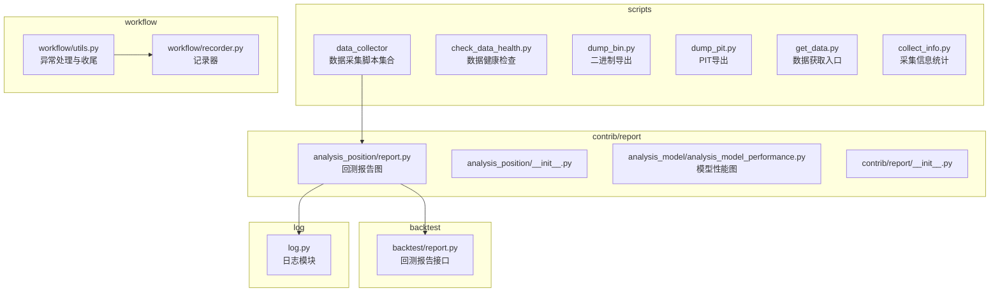
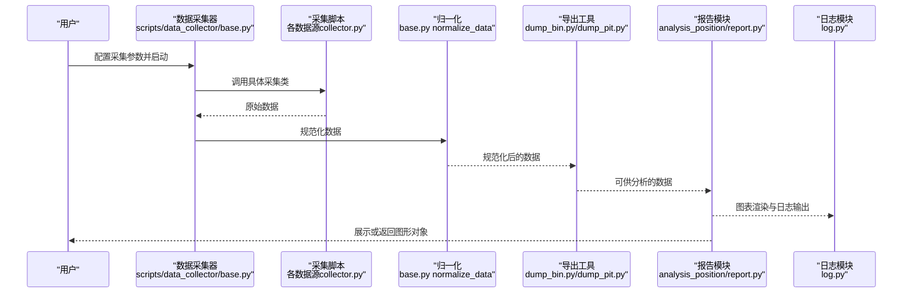
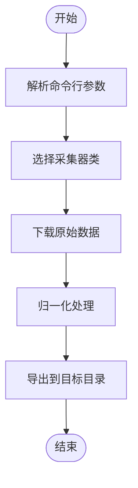
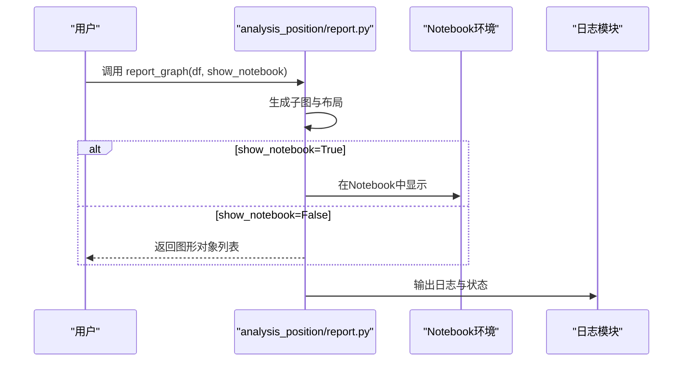
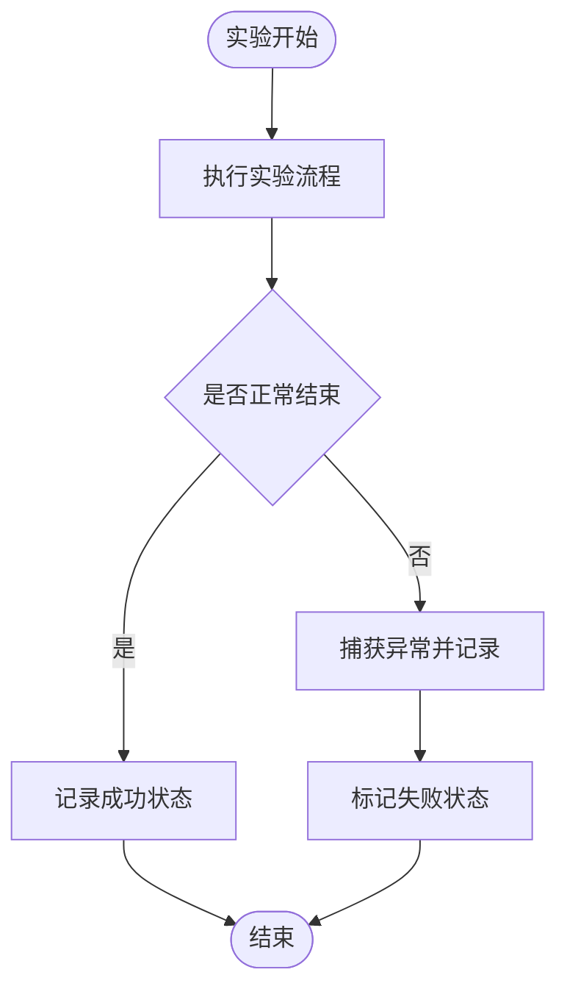
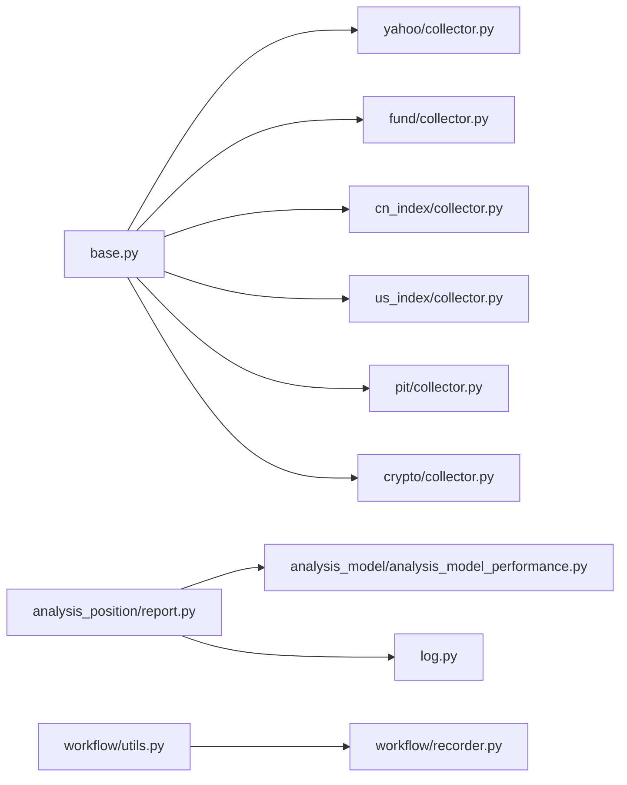

# 工具与实用程序

<cite>
**本文引用的文件**
- [scripts/data_collector/README.md](file://scripts/data_collector/README.md)
- [scripts/data_collector/base.py](file://scripts/data_collector/base.py)
- [scripts/data_collector/yahoo/collector.py](file://scripts/data_collector/yahoo/collector.py)
- [scripts/data_collector/fund/collector.py](file://scripts/data_collector/fund/collector.py)
- [scripts/data_collector/cn_index/collector.py](file://scripts/data_collector/cn_index/collector.py)
- [scripts/data_collector/us_index/collector.py](file://scripts/data_collector/us_index/collector.py)
- [scripts/data_collector/pit/collector.py](file://scripts/data_collector/pit/collector.py)
- [scripts/data_collector/crypto/collector.py](file://scripts/data_collector/crypto/collector.py)
- [scripts/check_data_health.py](file://scripts/check_data_health.py)
- [scripts/dump_bin.py](file://scripts/dump_bin.py)
- [scripts/dump_pit.py](file://scripts/dump_pit.py)
- [scripts/get_data.py](file://scripts/get_data.py)
- [scripts/collect_info.py](file://scripts/collect_info.py)
- [qlib/contrib/report/analysis_position/report.py](file://qlib/contrib/report/analysis_position/report.py)
- [qlib/contrib/report/analysis_position/__init__.py](file://qlib/contrib/report/analysis_position/__init__.py)
- [qlib/contrib/report/analysis_model/analysis_model_performance.py](file://qlib/contrib/report/analysis_model/analysis_model_performance.py)
- [qlib/contrib/report/__init__.py](file://qlib/contrib/report/__init__.py)
- [qlib/workflow/utils.py](file://qlib/workflow/utils.py)
- [qlib/log.py](file://qlib/log.py)
- [qlib/workflow/recorder.py](file://qlib/workflow/recorder.py)
- [qlib/backtest/report.py](file://qlib/backtest/report.py)
</cite>

## 目录
1. [简介](#简介)
2. [项目结构](#项目结构)
3. [核心组件](#核心组件)
4. [架构总览](#架构总览)
5. [详细组件分析](#详细组件分析)
6. [依赖关系分析](#依赖关系分析)
7. [性能考虑](#性能考虑)
8. [故障排查指南](#故障排查指南)
9. [结论](#结论)
10. [附录](#附录)

## 简介
本文件系统性梳理 Qlib 的工具与实用程序，覆盖数据采集、数据转换与质量检查、可视化报告、性能分析与调试诊断等模块。内容以仓库现有实现为准，提供使用路径、流程图与最佳实践建议，帮助开发者快速上手并高效使用各类工具。

## 项目结构
围绕“工具与实用程序”的相关目录与文件主要分布在以下位置：
- scripts：数据采集脚本、数据导出与健康检查工具
- qlib/contrib/report：回测与模型分析的可视化报告模块
- qlib/workflow：实验生命周期管理与异常处理钩子
- qlib/backtest：回测报告相关接口
- qlib/log：日志基础设施

**图表来源**
- [scripts/data_collector/README.md:1-43](file://scripts/data_collector/README.md#L1-L43)
- [scripts/check_data_health.py](file://scripts/check_data_health.py)
- [scripts/dump_bin.py](file://scripts/dump_bin.py)
- [scripts/dump_pit.py](file://scripts/dump_pit.py)
- [scripts/get_data.py](file://scripts/get_data.py)
- [scripts/collect_info.py](file://scripts/collect_info.py)
- [qlib/contrib/report/analysis_position/report.py:166-248](file://qlib/contrib/report/analysis_position/report.py#L166-L248)
- [qlib/contrib/report/analysis_position/__init__.py:1-10](file://qlib/contrib/report/analysis_position/__init__.py#L1-L10)
- [qlib/contrib/report/analysis_model/analysis_model_performance.py](file://qlib/contrib/report/analysis_model/analysis_model_performance.py)
- [qlib/contrib/report/__init__.py:1-11](file://qlib/contrib/report/__init__.py#L1-L11)
- [qlib/workflow/utils.py:16-47](file://qlib/workflow/utils.py#L16-L47)
- [qlib/workflow/recorder.py](file://qlib/workflow/recorder.py)
- [qlib/backtest/report.py:66-71](file://qlib/backtest/report.py#L66-L71)
- [qlib/log.py](file://qlib/log.py)

**章节来源**
- [scripts/data_collector/README.md:1-43](file://scripts/data_collector/README.md#L1-L43)

## 核心组件
- 数据采集工具链：提供多数据源采集（股票、指数、基金、加密货币、PIT 等），支持自定义扩展。
- 数据转换与导出：提供二进制与 PIT 导出工具，便于后续加载与分析。
- 数据健康检查：对已采集数据进行完整性与一致性校验。
- 可视化报告：基于回测与模型分析生成图表，支持在 Notebook 或返回图形对象。
- 性能分析与调试：通过工作流异常钩子、日志与记录器实现实验状态管理与问题定位。

**章节来源**
- [scripts/data_collector/base.py:379-452](file://scripts/data_collector/base.py#L379-L452)
- [scripts/check_data_health.py](file://scripts/check_data_health.py)
- [scripts/dump_bin.py](file://scripts/dump_bin.py)
- [scripts/dump_pit.py](file://scripts/dump_pit.py)
- [qlib/contrib/report/analysis_position/report.py:166-248](file://qlib/contrib/report/analysis_position/report.py#L166-L248)
- [qlib/workflow/utils.py:16-47](file://qlib/workflow/utils.py#L16-L47)

## 架构总览
下图展示了从数据采集到可视化报告的整体流程，以及关键工具之间的交互关系。

**图表来源**
- [scripts/data_collector/base.py:379-452](file://scripts/data_collector/base.py#L379-L452)
- [scripts/data_collector/yahoo/collector.py](file://scripts/data_collector/yahoo/collector.py)
- [scripts/data_collector/fund/collector.py](file://scripts/data_collector/fund/collector.py)
- [scripts/data_collector/cn_index/collector.py](file://scripts/data_collector/cn_index/collector.py)
- [scripts/data_collector/us_index/collector.py](file://scripts/data_collector/us_index/collector.py)
- [scripts/data_collector/pit/collector.py](file://scripts/data_collector/pit/collector.py)
- [scripts/data_collector/crypto/collector.py](file://scripts/data_collector/crypto/collector.py)
- [scripts/dump_bin.py](file://scripts/dump_bin.py)
- [scripts/dump_pit.py](file://scripts/dump_pit.py)
- [qlib/contrib/report/analysis_position/report.py:166-248](file://qlib/contrib/report/analysis_position/report.py#L166-L248)
- [qlib/log.py](file://qlib/log.py)

## 详细组件分析

### 数据采集工具链
- 组件职责
  - 提供统一的采集基类与 CLI 入口，支持并发、重试、时间窗口控制与数据长度校验。
  - 每个数据源提供独立的采集器与归一化器，并通过基类暴露标准化接口。
- 关键流程
  - 下载原始数据：调用具体采集器执行下载任务。
  - 归一化：将原始数据转换为统一格式，便于后续处理与存储。
- 使用要点
  - 自定义采集：参考 README 中的步骤创建新数据集目录与采集/归一化类，并添加 CLI 包装。
  - 参数配置：合理设置并发数、延迟、起止时间与数据长度阈值，避免触发目标站点限流或数据不完整。

**图表来源**
- [scripts/data_collector/base.py:379-452](file://scripts/data_collector/base.py#L379-L452)
- [scripts/data_collector/README.md:14-43](file://scripts/data_collector/README.md#L14-L43)

**章节来源**
- [scripts/data_collector/base.py:379-452](file://scripts/data_collector/base.py#L379-L452)
- [scripts/data_collector/README.md:1-43](file://scripts/data_collector/README.md#L1-L43)

### 数据转换与导出
- dump_bin.py
  - 将规范化后的数据以二进制形式导出，便于快速加载与跨平台复用。
- dump_pit.py
  - 导出 PIT（Price Investment Table）数据，用于特定场景的数据分析。
- get_data.py
  - 提供统一的数据获取入口，可结合采集与导出流程使用。

**章节来源**
- [scripts/dump_bin.py](file://scripts/dump_bin.py)
- [scripts/dump_pit.py](file://scripts/dump_pit.py)
- [scripts/get_data.py](file://scripts/get_data.py)

### 数据健康检查
- check_data_health.py
  - 对已采集数据进行完整性与一致性检查，识别缺失字段、重复记录、异常值等问题，辅助后续清洗与修复。

**章节来源**
- [scripts/check_data_health.py](file://scripts/check_data_health.py)

### 可视化报告工具
- 回测报告
  - analysis_position/report.py 提供回测报告的图形化展示，支持在 Notebook 中直接显示或返回图形对象，便于进一步定制。
  - 支持多个子图布局与标注，如区间标注、风险分析、IC 分布等。
- 模型性能图
  - analysis_model_performance.py 提供模型性能分析图，辅助评估模型训练与预测效果。
- 报告模块聚合
  - contrib/report/__init__.py 汇总了可用的报告图模块名称，便于统一调用。

**图表来源**
- [qlib/contrib/report/analysis_position/report.py:166-248](file://qlib/contrib/report/analysis_position/report.py#L166-L248)
- [qlib/contrib/report/analysis_position/__init__.py:1-10](file://qlib/contrib/report/analysis_position/__init__.py#L1-L10)
- [qlib/contrib/report/analysis_model/analysis_model_performance.py](file://qlib/contrib/report/analysis_model/analysis_model_performance.py)
- [qlib/contrib/report/__init__.py:1-11](file://qlib/contrib/report/__init__.py#L1-L11)

**章节来源**
- [qlib/contrib/report/analysis_position/report.py:166-248](file://qlib/contrib/report/analysis_position/report.py#L166-L248)
- [qlib/contrib/report/analysis_position/__init__.py:1-10](file://qlib/contrib/report/analysis_position/__init__.py#L1-L10)
- [qlib/contrib/report/analysis_model/analysis_model_performance.py](file://qlib/contrib/report/analysis_model/analysis_model_performance.py)
- [qlib/contrib/report/__init__.py:1-11](file://qlib/contrib/report/__init__.py#L1-L11)

### 性能分析与调试
- 异常处理与实验收尾
  - workflow/utils.py 提供实验退出钩子，捕获未处理异常并自动标记实验状态为失败；同时注册 atexit，确保异常或中断时也能正确收尾。
- 日志模块
  - qlib/log.py 提供统一的日志获取接口，便于在工具链中输出调试信息与运行状态。
- 记录器
  - workflow/recorder.py 提供实验记录能力，配合异常钩子实现状态持久化与可观测性。

**图表来源**
- [qlib/workflow/utils.py:16-47](file://qlib/workflow/utils.py#L16-L47)
- [qlib/workflow/recorder.py](file://qlib/workflow/recorder.py)
- [qlib/log.py](file://qlib/log.py)

**章节来源**
- [qlib/workflow/utils.py:16-47](file://qlib/workflow/utils.py#L16-L47)
- [qlib/workflow/recorder.py](file://qlib/workflow/recorder.py)
- [qlib/log.py](file://qlib/log.py)

## 依赖关系分析
- 数据采集模块
  - base.py 作为统一入口，按需导入具体采集器类并调用其采集方法；同时提供归一化入口，将原始数据转换为规范格式。
- 可视化模块
  - analysis_position/report.py 依赖于子图与布局配置，最终生成图形对象；analysis_model_performance.py 提供模型性能图。
- 工作流与日志
  - workflow/utils.py 与 log.py 协同，保证实验生命周期内的可观测性与稳定性。

**图表来源**
- [scripts/data_collector/base.py:379-452](file://scripts/data_collector/base.py#L379-L452)
- [scripts/data_collector/yahoo/collector.py](file://scripts/data_collector/yahoo/collector.py)
- [scripts/data_collector/fund/collector.py](file://scripts/data_collector/fund/collector.py)
- [scripts/data_collector/cn_index/collector.py](file://scripts/data_collector/cn_index/collector.py)
- [scripts/data_collector/us_index/collector.py](file://scripts/data_collector/us_index/collector.py)
- [scripts/data_collector/pit/collector.py](file://scripts/data_collector/pit/collector.py)
- [scripts/data_collector/crypto/collector.py](file://scripts/data_collector/crypto/collector.py)
- [qlib/contrib/report/analysis_position/report.py:166-248](file://qlib/contrib/report/analysis_position/report.py#L166-L248)
- [qlib/contrib/report/analysis_model/analysis_model_performance.py](file://qlib/contrib/report/analysis_model/analysis_model_performance.py)
- [qlib/workflow/utils.py:16-47](file://qlib/workflow/utils.py#L16-L47)
- [qlib/workflow/recorder.py](file://qlib/workflow/recorder.py)
- [qlib/log.py](file://qlib/log.py)

**章节来源**
- [scripts/data_collector/base.py:379-452](file://scripts/data_collector/base.py#L379-L452)
- [qlib/contrib/report/analysis_position/report.py:166-248](file://qlib/contrib/report/analysis_position/report.py#L166-L248)
- [qlib/contrib/report/analysis_model/analysis_model_performance.py](file://qlib/contrib/report/analysis_model/analysis_model_performance.py)
- [qlib/workflow/utils.py:16-47](file://qlib/workflow/utils.py#L16-L47)

## 性能考虑
- 并发与限速
  - 合理设置采集并发数与请求延迟，避免触发目标站点限流或本地资源耗尽。
- 数据长度校验
  - 在采集阶段启用数据长度校验，减少无效数据进入后续流程。
- 导出与缓存
  - 使用 dump_bin.py 快速导出二进制数据，缩短加载时间；结合缓存策略降低重复计算成本。
- 可视化渲染
  - 在 Notebook 环境中按需渲染图形，避免一次性渲染过多子图导致内存压力。

[本节为通用指导，无需列出章节来源]

## 故障排查指南
- 实验异常自动收尾
  - 若实验过程中出现未捕获异常，workflow/utils.py 会自动记录并标记失败状态，确保实验状态一致。
- 日志定位
  - 使用 qlib/log.py 获取模块日志，结合异常堆栈定位问题根因。
- 数据健康检查
  - 使用 scripts/check_data_health.py 定位缺失字段、重复记录与异常值，优先修复后再继续分析。
- 回测报告问题
  - 若报告无法显示或图形异常，检查输入 DataFrame 的列名与索引类型，确保符合 analysis_position/report.py 的预期。

**章节来源**
- [qlib/workflow/utils.py:16-47](file://qlib/workflow/utils.py#L16-L47)
- [qlib/log.py](file://qlib/log.py)
- [scripts/check_data_health.py](file://scripts/check_data_health.py)
- [qlib/contrib/report/analysis_position/report.py:166-248](file://qlib/contrib/report/analysis_position/report.py#L166-L248)

## 结论
Qlib 的工具与实用程序围绕“采集—转换—可视化—调试”形成闭环：采集器提供多数据源接入与扩展能力，导出与健康检查保障数据质量，可视化报告提升洞察效率，工作流异常钩子与日志体系确保可观测性。遵循本文的最佳实践，可显著提升数据处理与分析效率。

[本节为总结性内容，无需列出章节来源]

## 附录
- 使用示例与最佳实践
  - 数据采集
    - 参考 scripts/data_collector/README.md 中的自定义采集步骤，创建新的数据源采集器与归一化器。
    - 使用 base.py 的 download_data 与 normalize_data 接口，配置并发与时间范围。
  - 数据导出
    - 使用 dump_bin.py 导出二进制数据，dump_pit.py 导出 PIT 数据，便于后续快速加载。
  - 数据健康检查
    - 运行 check_data_health.py，根据输出修复缺失字段与异常值。
  - 可视化报告
    - 调用 analysis_position/report.py 的 report_graph，传入回测结果 DataFrame，选择 Notebook 显示或返回图形对象。
  - 调试与监控
    - 在实验入口注册异常钩子，确保异常时自动收尾；通过日志模块输出关键信息。

**章节来源**
- [scripts/data_collector/README.md:14-43](file://scripts/data_collector/README.md#L14-L43)
- [scripts/data_collector/base.py:379-452](file://scripts/data_collector/base.py#L379-L452)
- [scripts/dump_bin.py](file://scripts/dump_bin.py)
- [scripts/dump_pit.py](file://scripts/dump_pit.py)
- [scripts/check_data_health.py](file://scripts/check_data_health.py)
- [qlib/contrib/report/analysis_position/report.py:166-248](file://qlib/contrib/report/analysis_position/report.py#L166-L248)
- [qlib/workflow/utils.py:16-47](file://qlib/workflow/utils.py#L16-L47)
- [qlib/log.py](file://qlib/log.py)