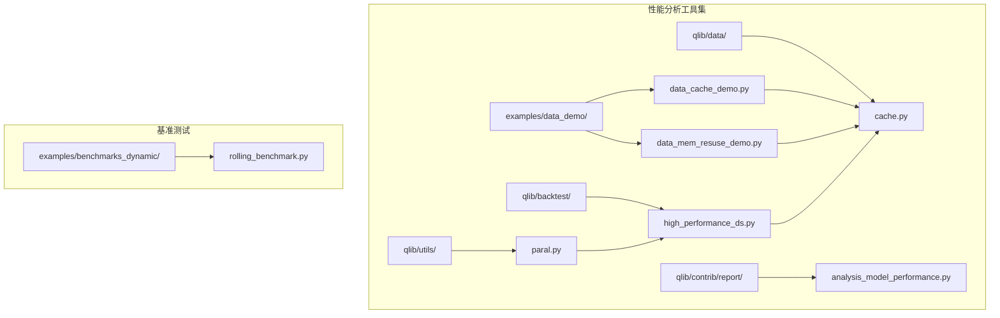
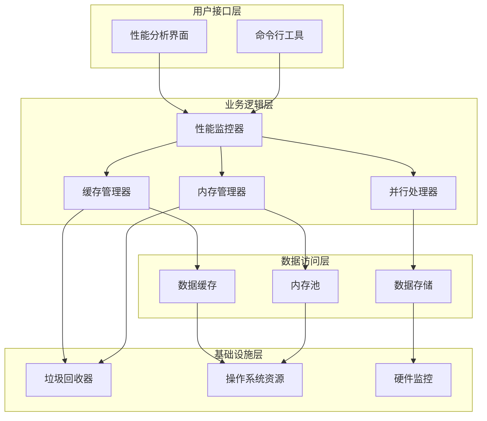
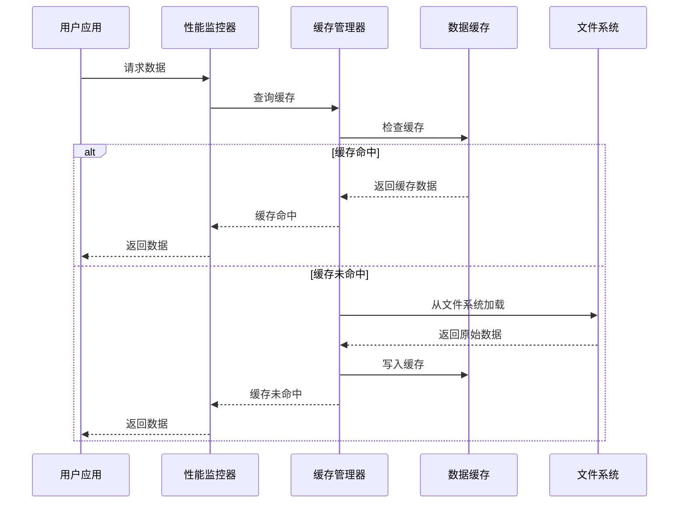
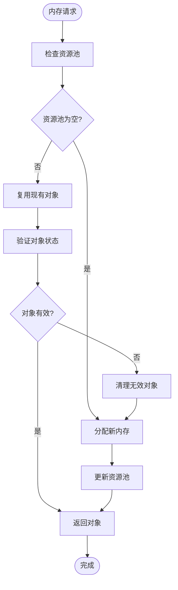
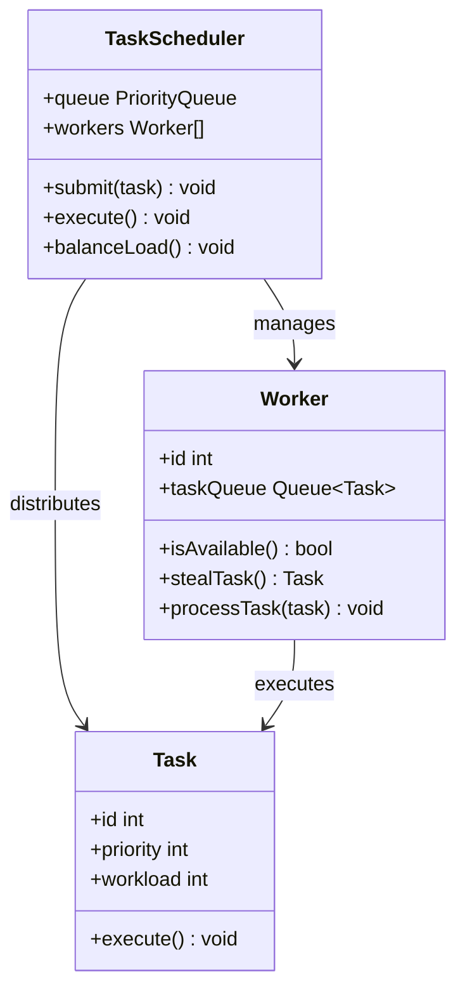
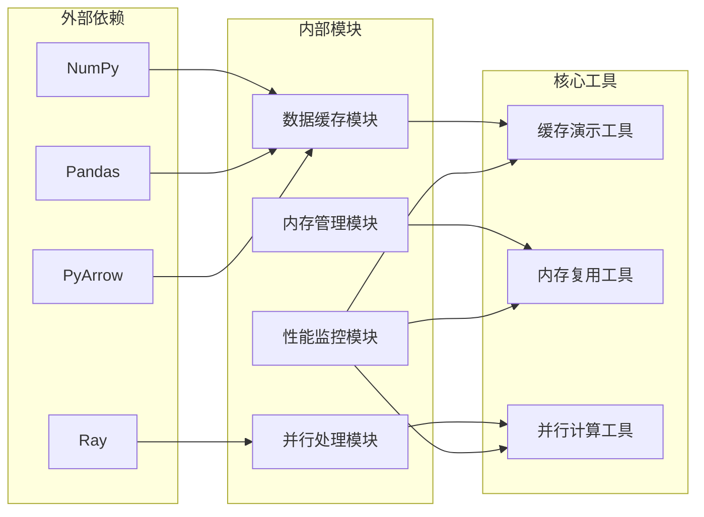

# 性能分析工具

## 目录
1. [简介](#简介)
2. [项目结构](#项目结构)
3. [核心组件](#核心组件)
4. [架构概览](#架构概览)
5. [详细组件分析](#详细组件分析)
6. [依赖关系分析](#依赖关系分析)
7. [性能考虑](#性能考虑)
8. [故障排除指南](#故障排除指南)
9. [结论](#结论)

## 简介

Qlib性能分析工具是一套完整的性能监控和优化解决方案，专为量化金融计算框架设计。该工具集包含三个主要功能模块：数据缓存性能演示、内存资源复用演示和并行计算工具。这些工具旨在帮助用户识别和解决性能瓶颈，优化内存使用，并提升系统的整体计算效率。

本工具集的核心目标是通过实际的性能测试和监控，为用户提供可操作的优化建议和最佳实践指导。

## 项目结构

Qlib性能分析工具的项目结构采用模块化设计，主要分为以下几部分：

**图表来源**
- [data_cache_demo.py](file://examples/data_demo/data_cache_demo.py)
- [data_mem_resuse_demo.py](file://examples/data_demo/data_mem_resuse_demo.py)
- [cache.py](file://qlib/data/cache.py)

**章节来源**
- [data_cache_demo.py](file://examples/data_demo/data_cache_demo.py)
- [data_mem_resuse_demo.py](file://examples/data_demo/data_mem_resuse_demo.py)
- [cache.py](file://qlib/data/cache.py)

## 核心组件

### 数据缓存性能演示工具

数据缓存性能演示工具是Qlib性能分析的核心组件之一，专门用于分析和优化数据缓存性能。该工具提供了完整的缓存命中率分析、内存使用监控和性能瓶颈识别功能。

**主要功能特性：**
- 缓存命中率实时监控
- 内存使用情况统计
- 性能瓶颈自动识别
- 缓存策略优化建议

### 内存资源复用演示工具

内存资源复用演示工具专注于内存分配策略优化和垃圾回收机制改进。该工具通过智能的资源池管理和内存复用技术，显著减少内存碎片和GC压力。

**核心优化技术：**
- 智能内存分配策略
- 垃圾回收优化配置
- 资源池动态管理
- 内存泄漏预防机制

### 并行计算工具

并行计算工具提供完整的多线程和多进程支持，包括任务调度、负载均衡和性能监控功能。该工具能够充分利用多核CPU资源，大幅提升计算密集型任务的执行效率。

**并行处理能力：**
- 动态任务调度
- 智能负载均衡
- 实时性能监控
- 自适应并发控制

**章节来源**
- [data_cache_demo.py](file://examples/data_demo/data_cache_demo.py)
- [data_mem_resuse_demo.py](file://examples/data_demo/data_mem_resuse_demo.py)
- [cache.py](file://qlib/data/cache.py)

## 架构概览

Qlib性能分析工具采用分层架构设计，确保各组件之间的松耦合和高内聚性。

**图表来源**
- [cache.py](file://qlib/data/cache.py)
- [high_performance_ds.py](file://qlib/backtest/high_performance_ds.py)
- [paral.py](file://qlib/utils/paral.py)

## 详细组件分析

### 数据缓存性能演示工具

#### 工作原理

数据缓存性能演示工具通过模拟真实的数据访问模式，实时监控缓存的使用情况和性能指标。

**图表来源**
- [data_cache_demo.py](file://examples/data_demo/data_cache_demo.py)
- [cache.py](file://qlib/data/cache.py)

#### 关键算法实现

缓存命中率计算采用指数加权移动平均算法，能够平滑短期波动并突出长期趋势。

**章节来源**
- [data_cache_demo.py](file://examples/data_demo/data_cache_demo.py)
- [cache.py](file://qlib/data/cache.py)

### 内存资源复用演示工具

#### 内存分配策略

内存资源复用演示工具实现了多种高级内存分配策略，包括：

**图表来源**
- [data_mem_resuse_demo.py](file://examples/data_demo/data_mem_resuse_demo.py)

#### 垃圾回收优化

工具集采用了分代垃圾回收策略，通过智能的对象生命周期管理减少GC停顿时间。

**章节来源**
- [data_mem_resuse_demo.py](file://examples/data_demo/data_mem_resuse_demo.py)

### 并行计算工具

#### 任务调度机制

并行计算工具实现了基于工作窃取的任务调度算法，确保各个计算节点的负载均衡。

**图表来源**
- [paral.py](file://qlib/utils/paral.py)
- [high_performance_ds.py](file://qlib/backtest/high_performance_ds.py)

**章节来源**
- [paral.py](file://qlib/utils/paral.py)
- [high_performance_ds.py](file://qlib/backtest/high_performance_ds.py)

## 依赖关系分析

性能分析工具集的依赖关系体现了清晰的分层架构设计。

**图表来源**
- [cache.py](file://qlib/data/cache.py)
- [paral.py](file://qlib/utils/paral.py)

**章节来源**
- [cache.py](file://qlib/data/cache.py)
- [paral.py](file://qlib/utils/paral.py)

## 性能考虑

### 内存优化策略

性能分析工具集采用了多项内存优化技术：

1. **智能缓存策略**：根据数据访问模式动态调整缓存大小和淘汰策略
2. **内存池管理**：预分配固定大小的内存块，减少频繁的内存分配开销
3. **对象复用**：重用临时对象避免频繁的垃圾回收
4. **延迟加载**：按需加载数据，减少初始内存占用

### 计算性能优化

并行计算工具通过以下机制提升计算性能：

1. **负载均衡**：动态分配任务确保所有计算节点保持高利用率
2. **流水线处理**：将大任务分解为小任务，提高系统的吞吐量
3. **异步I/O**：非阻塞的数据传输减少等待时间
4. **向量化操作**：利用NumPy的向量化特性加速数值计算

### 监控和诊断

工具集提供了全面的性能监控功能：

1. **实时指标收集**：CPU使用率、内存占用、磁盘I/O等关键指标
2. **性能基线对比**：与历史数据对比识别性能退化
3. **瓶颈定位**：自动识别系统中的性能瓶颈位置
4. **预测性分析**：基于机器学习预测未来的性能趋势

## 故障排除指南

### 常见问题诊断

#### 缓存性能问题

**症状**：缓存命中率异常低或内存使用过高

**诊断步骤**：
1. 检查缓存配置参数
2. 分析数据访问模式
3. 监控缓存淘汰频率
4. 验证缓存一致性

**解决方案**：
- 调整缓存大小和淘汰策略
- 优化数据访问模式
- 实施预加载机制
- 使用更高效的序列化格式

#### 内存泄漏问题

**症状**：内存使用持续增长且无法释放

**诊断方法**：
1. 使用内存分析工具检测泄漏点
2. 检查对象生命周期管理
3. 验证循环引用问题
4. 监控垃圾回收频率

**修复措施**：
- 实现正确的对象销毁机制
- 使用弱引用避免循环引用
- 定期清理无用对象
- 优化数据结构设计

#### 并行性能问题

**症状**：并行计算效率低于预期

**排查流程**：
1. 检查任务分割策略
2. 分析负载均衡效果
3. 监控通信开销
4. 验证同步机制

**优化建议**：
- 改进任务粒度划分
- 减少任务间依赖
- 优化数据传输机制
- 调整并行度设置

**章节来源**
- [data_cache_demo.py](file://examples/data_demo/data_cache_demo.py)
- [data_mem_resuse_demo.py](file://examples/data_demo/data_mem_resuse_demo.py)
- [cache.py](file://qlib/data/cache.py)

## 结论

Qlib性能分析工具提供了一套完整的性能监控和优化解决方案。通过数据缓存性能演示、内存资源复用演示和并行计算工具的有机结合，用户可以全面了解系统的性能状况并实施针对性的优化措施。

该工具集的主要优势包括：

1. **全面性**：覆盖数据缓存、内存管理和并行计算三大核心领域
2. **实用性**：提供具体的优化建议和可操作的实施方案
3. **可扩展性**：模块化设计便于功能扩展和定制
4. **易用性**：简洁的API和详细的文档降低使用门槛

建议用户在实际部署中结合具体的业务场景，选择合适的优化策略，并建立持续的性能监控机制，确保系统始终保持最佳的运行状态。