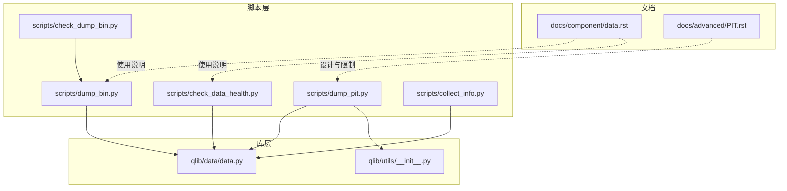
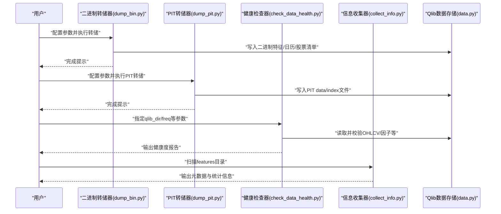
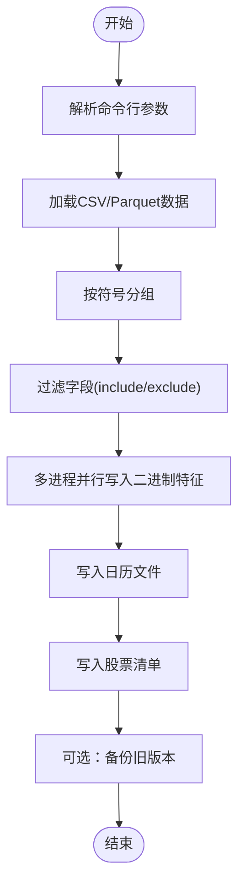
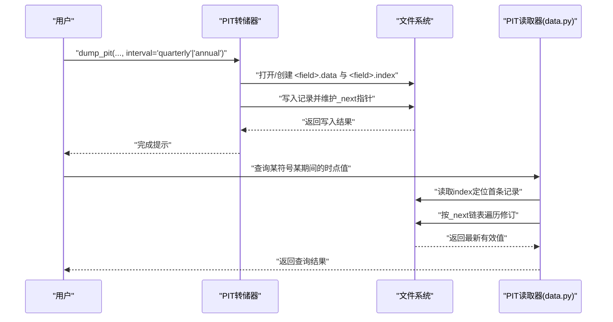
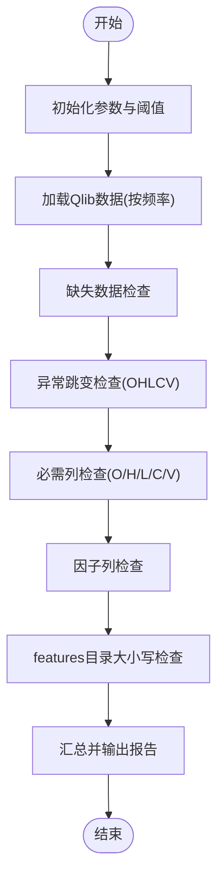
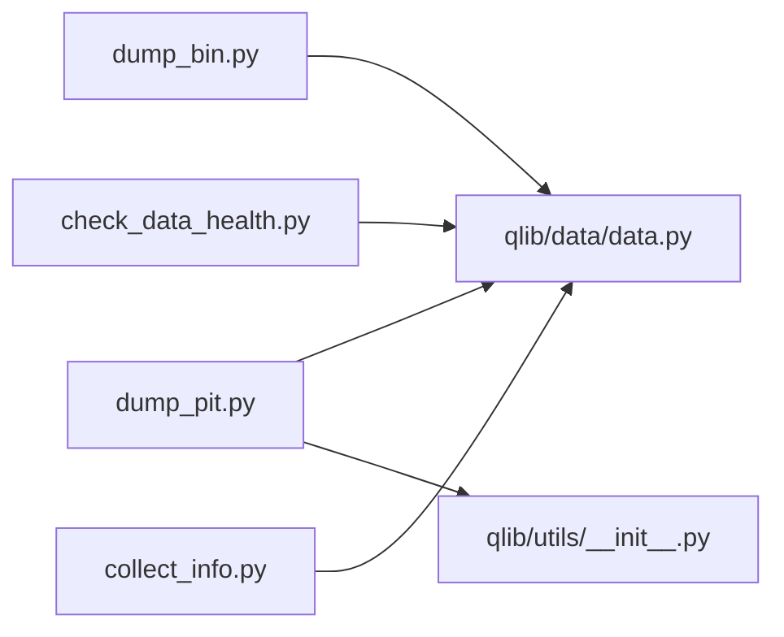

# 数据处理工具

<cite>
**本文引用的文件**
- [scripts/dump_bin.py](file://scripts/dump_bin.py)
- [scripts/dump_pit.py](file://scripts/dump_pit.py)
- [scripts/check_data_health.py](file://scripts/check_data_health.py)
- [scripts/collect_info.py](file://scripts/collect_info.py)
- [scripts/check_dump_bin.py](file://scripts/check_dump_bin.py)
- [qlib/data/data.py](file://qlib/data/data.py)
- [qlib/utils/__init__.py](file://qlib/utils/__init__.py)
- [docs/component/data.rst](file://docs/component/data.rst)
- [docs/advanced/PIT.rst](file://docs/advanced/PIT.rst)
</cite>

## 目录
1. [简介](#简介)
2. [项目结构](#项目结构)
3. [核心组件](#核心组件)
4. [架构总览](#架构总览)
5. [详细组件分析](#详细组件分析)
6. [依赖关系分析](#依赖关系分析)
7. [性能考虑](#性能考虑)
8. [故障排查指南](#故障排查指南)
9. [结论](#结论)
10. [附录](#附录)

## 简介
本文件面向使用者与开发者，系统性介绍 Qlib 的数据处理工具链，覆盖以下能力：
- 二进制数据转储工具：将 CSV/Parquet 等原始数据转换为 Qlib 高效二进制格式，支持多进程并行、字段过滤、日期与符号字段配置、更新模式与全量模式等。
- PIT 数据处理工具：将财务报表类“时点”数据（按季度/年度）落盘为二进制索引+数据文件，支持查询与链接修订。
- 数据完整性检查工具：对日线/分钟线数据进行缺失值、异常跳变、必需列、因子列等健康度检查。
- 数据信息收集工具：采集特征目录元数据与统计信息，辅助运维与容量规划。
- 实际使用场景与性能优化建议：从数据准备到上线运行的全流程实践。

## 项目结构
围绕数据处理的脚本与实现主要位于 scripts/ 与 qlib/data/、qlib/utils/ 下，文档在 docs/ 中提供了使用说明与限制说明。

**图示来源**
- [scripts/dump_bin.py](file://scripts/dump_bin.py)
- [scripts/dump_pit.py](file://scripts/dump_pit.py)
- [scripts/check_data_health.py](file://scripts/check_data_health.py)
- [scripts/collect_info.py](file://scripts/collect_info.py)
- [scripts/check_dump_bin.py](file://scripts/check_dump_bin.py)
- [qlib/data/data.py](file://qlib/data/data.py)
- [qlib/utils/__init__.py](file://qlib/utils/__init__.py)
- [docs/component/data.rst](file://docs/component/data.rst)
- [docs/advanced/PIT.rst](file://docs/advanced/PIT.rst)

**章节来源**
- [scripts/dump_bin.py](file://scripts/dump_bin.py)
- [scripts/dump_pit.py](file://scripts/dump_pit.py)
- [scripts/check_data_health.py](file://scripts/check_data_health.py)
- [scripts/collect_info.py](file://scripts/collect_info.py)
- [scripts/check_dump_bin.py](file://scripts/check_dump_bin.py)
- [qlib/data/data.py](file://qlib/data/data.py)
- [qlib/utils/__init__.py](file://qlib/utils/__init__.py)
- [docs/component/data.rst](file://docs/component/data.rst)
- [docs/advanced/PIT.rst](file://docs/advanced/PIT.rst)

## 核心组件
- 二进制数据转储器：负责将 CSV/Parquet 原始数据批量转换为 Qlib 二进制格式，支持多进程并行、字段选择、日期与符号字段名配置、更新/全量模式切换。
- PIT 数据转储器：负责将财务“时点”数据（季度/年度）落盘为 data/index 文件，支持并发写入与覆盖策略。
- 数据健康检查器：对日线/分钟线数据进行缺失、异常跳变、必需列、因子列等检查，输出汇总报告。
- 数据信息收集器：扫描 features 目录，输出元数据与统计信息，便于运维与容量评估。
- 检查二进制转储一致性工具：校验转储结果与输入数据的一致性，辅助回归测试。

**章节来源**
- [scripts/dump_bin.py](file://scripts/dump_bin.py)
- [scripts/dump_pit.py](file://scripts/dump_pit.py)
- [scripts/check_data_health.py](file://scripts/check_data_health.py)
- [scripts/collect_info.py](file://scripts/collect_info.py)
- [scripts/check_dump_bin.py](file://scripts/check_dump_bin.py)

## 架构总览
下图展示数据从 CSV/Parquet 到二进制落盘的整体流程，以及各工具之间的调用关系。

**图示来源**
- [scripts/dump_bin.py](file://scripts/dump_bin.py)
- [scripts/dump_pit.py](file://scripts/dump_pit.py)
- [scripts/check_data_health.py](file://scripts/check_data_health.py)
- [scripts/collect_info.py](file://scripts/collect_info.py)
- [qlib/data/data.py](file://qlib/data/data.py)

## 详细组件分析

### 二进制数据转储工具（dump_bin.py）
- 功能概述
  - 将 CSV/Parquet 原始数据批量转换为 Qlib 二进制格式，生成 features、calendars、instruments 等目录与文件。
  - 支持多进程并行加速；可按需过滤字段、指定日期与符号字段名；支持更新模式与全量模式。
- 关键参数
  - 输入路径、Qlib 目录、备份目录、频率、最大工作进程数、日期字段名、文件后缀、符号字段名、包含/排除字段列表、限制条数等。
- 处理逻辑
  - 解析输入文件，按符号分组，逐个写入二进制特征文件；同时维护日历与股票清单。
  - 并行写入通过多进程池实现，提升吞吐。
- 使用要点
  - CSV/Parquet 必须包含日期与符号字段；若文件未以股票命名，需通过参数指定字段名。
  - 更新模式适合增量补丁，全量模式适合重建。
- 性能建议
  - 合理设置 max_workers；在磁盘 IO 充分的环境下可提升至较高并发。
  - 控制 include_fields 与 exclude_fields，减少冗余字段写入。

**图示来源**
- [scripts/dump_bin.py](file://scripts/dump_bin.py)

**章节来源**
- [scripts/dump_bin.py](file://scripts/dump_bin.py)
- [docs/component/data.rst](file://docs/component/data.rst)

### PIT 数据处理工具（dump_pit.py）
- 功能概述
  - 将财务“时点”数据（季度/年度）转换为二进制 data/index 文件，支持并发写入与覆盖策略。
  - data 文件按“发布日期+期间+数值+下一个修订指针”的顺序存储；index 文件记录每期首条记录的字节偏移。
- 关键参数
  - 输入 CSV 路径、PIT 存储根目录、频率（quarterly/annual）、是否覆盖已有数据等。
- 写入格式
  - data 文件：固定长度记录，包含日期、期间、数值、修订指针。
  - index 文件：首年字段 + 每期首条记录的字节偏移数组。
- 查询与链接修订
  - 通过 index 定位某期间首条记录，再沿_next 指针遍历修订序列，实现“时点”查询。
- 使用要点
  - 文件命名约定：季度文件以 q 结尾，年度文件以 a 结尾。
  - 当前设计更适用于季度/年度财务指标，对其他周期支持有限。
- 性能建议
  - 并发写入时注意避免竞争写同一符号；可按符号分片并行。
  - 读取时复用 index 缓存，减少重复 IO。

**图示来源**
- [scripts/dump_pit.py](file://scripts/dump_pit.py)
- [qlib/data/data.py](file://qlib/data/data.py)
- [qlib/utils/__init__.py](file://qlib/utils/__init__.py)
- [docs/advanced/PIT.rst](file://docs/advanced/PIT.rst)

**章节来源**
- [scripts/dump_pit.py](file://scripts/dump_pit.py)
- [qlib/data/data.py](file://qlib/data/data.py)
- [qlib/utils/__init__.py](file://qlib/utils/__init__.py)
- [docs/advanced/PIT.rst](file://docs/advanced/PIT.rst)

### 数据完整性检查工具（check_data_health.py）
- 功能概述
  - 对 Qlib 数据进行健康度检查，检测缺失数据、OHLCV 异常跳变、必需列缺失、因子列缺失、features 目录大小写等问题。
- 检查维度
  - 缺失数据数量阈值控制、价格/成交量异常跳变阈值、必需列（O/H/L/C/V）校验、因子列存在性校验、features 子目录大小写规范。
- 输出
  - 统一汇总报告，列出各类问题及涉及的文件清单，便于快速定位与修复。
- 使用建议
  - 在数据入库前后均执行，结合阈值参数适配不同市场与频率。

**图示来源**
- [scripts/check_data_health.py](file://scripts/check_data_health.py)

**章节来源**
- [scripts/check_data_health.py](file://scripts/check_data_health.py)
- [docs/component/data.rst](file://docs/component/data.rst)

### 数据信息收集工具（collect_info.py）
- 功能概述
  - 扫描 features 目录，收集文件数量、大小、符号分布、时间跨度等元数据与统计信息，辅助运维与容量规划。
- 输出内容
  - 汇总统计（文件总数、总大小、平均大小、符号数等）与按符号/日期维度的明细。
- 使用建议
  - 定期运行以监控数据规模变化趋势，识别异常增长或异常分布。

**章节来源**
- [scripts/collect_info.py](file://scripts/collect_info.py)

### 检查二进制转储一致性（check_dump_bin.py）
- 功能概述
  - 校验转储后的二进制数据与原始 CSV/Parquet 的一致性，确保字段、范围、排序等关键属性一致。
- 使用场景
  - 回归测试、自动化流水线中作为质量门禁。
- 建议
  - 在大规模转储后执行，优先检查关键字段与时间范围。

**章节来源**
- [scripts/check_dump_bin.py](file://scripts/check_dump_bin.py)

## 依赖关系分析
- 组件耦合
  - dump_bin.py 依赖 Qlib 数据存储接口，负责落盘与索引维护。
  - dump_pit.py 依赖 Qlib 的 PIT 记录类型与查询工具，负责 data/index 文件的生成与读取。
  - check_data_health.py 依赖 D 接口读取数据，进行多维校验。
  - collect_info.py 依赖文件系统扫描与统计。
- 外部依赖
  - pandas、fire、loguru、tqdm、struct 等第三方库。
- 潜在循环依赖
  - 工具脚本之间无直接循环依赖，通过 Qlib 接口间接交互。

**图示来源**
- [scripts/dump_bin.py](file://scripts/dump_bin.py)
- [scripts/dump_pit.py](file://scripts/dump_pit.py)
- [scripts/check_data_health.py](file://scripts/check_data_health.py)
- [scripts/collect_info.py](file://scripts/collect_info.py)
- [qlib/data/data.py](file://qlib/data/data.py)
- [qlib/utils/__init__.py](file://qlib/utils/__init__.py)

**章节来源**
- [scripts/dump_bin.py](file://scripts/dump_bin.py)
- [scripts/dump_pit.py](file://scripts/dump_pit.py)
- [scripts/check_data_health.py](file://scripts/check_data_health.py)
- [scripts/collect_info.py](file://scripts/collect_info.py)
- [qlib/data/data.py](file://qlib/data/data.py)
- [qlib/utils/__init__.py](file://qlib/utils/__init__.py)

## 性能考虑
- 并行与并发
  - dump_bin.py 与 dump_pit.py 均支持多进程并行，合理设置 max_workers 可显著提升吞吐。
- 字段裁剪
  - 通过 include_fields/exclude_fields 减少写入字段数量，降低 IO 与存储压力。
- 索引与缓存
  - PIT 查询时复用 index 缓存，避免重复读取 index 文件。
- 存储布局
  - 将热数据置于高性能存储；冷数据归档；按符号分片并行写入，减少锁竞争。
- 频率与粒度
  - 日线与分钟线数据体量差异巨大，应分别制定阈值与检查策略。

[本节为通用指导，无需特定文件引用]

## 故障排查指南
- 健康检查常见问题
  - 缺失数据过多：调整 missing_data_num 阈值或补充缺失数据。
  - OHLCV 异常跳变：检查是否存在异常事件（除权、停牌）或数据源错误。
  - 必需列缺失：确认 CSV/Parquet 是否包含 O/H/L/C/V。
  - 因子列缺失：确认因子计算是否正确生成 factor 列。
  - features 目录大小写：统一改为小写，避免跨平台兼容问题。
- 转储失败排查
  - 权限不足：检查目标目录写权限。
  - 字段不匹配：核对 date_field_name、symbol_field_name 与文件实际列名。
  - 内存不足：降低 max_workers 或分批处理。
- PIT 查询异常
  - 确认 data/index 文件完整且命名符合约定（q/a 后缀）。
  - 检查 _next 指针是否指向有效位置，避免环形或断链。

**章节来源**
- [scripts/check_data_health.py](file://scripts/check_data_health.py)
- [docs/component/data.rst](file://docs/component/data.rst)
- [docs/advanced/PIT.rst](file://docs/advanced/PIT.rst)

## 结论
Qlib 的数据处理工具链覆盖了从原始数据到高效二进制存储、从健康度检查到信息收集的完整闭环。通过并行化、字段裁剪、索引与缓存优化，可在保证数据质量的前提下显著提升处理效率。建议在生产环境中结合阈值与检查策略，形成自动化流水线，持续保障数据健康与性能。

[本节为总结，无需特定文件引用]

## 附录
- 实际使用场景示例
  - 新建市场数据入库：先用 dump_bin.py 转储日线/分钟线，再用 check_data_health.py 进行健康检查，最后用 collect_info.py 输出统计。
  - 财务数据上线：用 dump_pit.py 转储季度/年度财务指标，结合 PIT 文档中的限制说明进行合规性检查。
- 最佳实践
  - 分批并行：根据机器资源设置合理的 max_workers。
  - 字段治理：统一字段命名与类型，减少转储阶段的清洗成本。
  - 监控告警：将健康检查与信息收集纳入定时任务，及时发现异常。

[本节为概念性内容，无需特定文件引用]