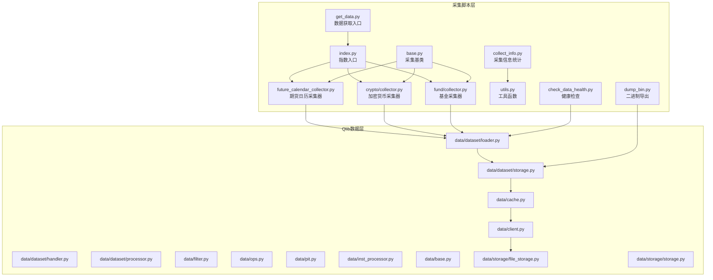
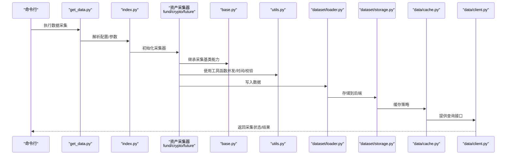
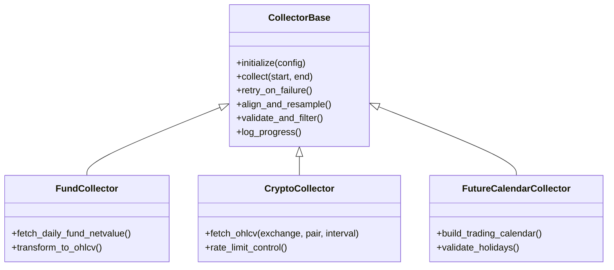
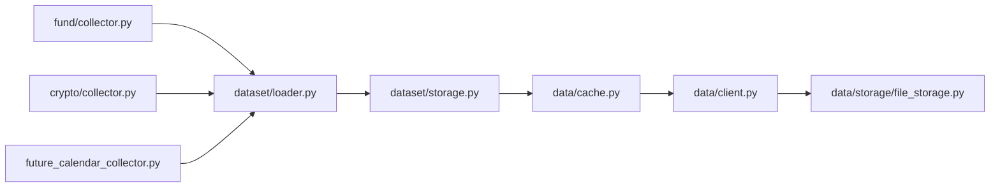

# 商品与基金数据收集器

<cite>
**本文引用的文件**
- [scripts/data_collector/base.py](file://scripts/data_collector/base.py)
- [scripts/data_collector/fund/collector.py](file://scripts/data_collector/fund/collector.py)
- [scripts/data_collector/crypto/collector.py](file://scripts/data_collector/crypto/collector.py)
- [scripts/data_collector/future_calendar_collector.py](file://scripts/data_collector/future_calendar_collector.py)
- [scripts/data_collector/index.py](file://scripts/data_collector/index.py)
- [scripts/data_collector/utils.py](file://scripts/data_collector/utils.py)
- [scripts/get_data.py](file://scripts/get_data.py)
- [scripts/dump_bin.py](file://scripts/dump_bin.py)
- [scripts/check_data_health.py](file://scripts/check_data_health.py)
- [scripts/collect_info.py](file://scripts/collect_info.py)
- [qlib/data/data.py](file://qlib/data/data.py)
- [qlib/data/dataset/loader.py](file://qlib/data/dataset/loader.py)
- [qlib/data/dataset/storage.py](file://qlib/data/dataset/storage.py)
- [qlib/data/dataset/handler.py](file://qlib/data/dataset/handler.py)
- [qlib/data/dataset/processor.py](file://qlib/data/dataset/processor.py)
- [qlib/data/cache.py](file://qlib/data/cache.py)
- [qlib/data/client.py](file://qlib/data/client.py)
- [qlib/data/filter.py](file://qlib/data/filter.py)
- [qlib/data/ops.py](file://qlib/data/ops.py)
- [qlib/data/pit.py](file://qlib/data/pit.py)
- [qlib/data/inst_processor.py](file://qlib/data/inst_processor.py)
- [qlib/data/base.py](file://qlib/data/base.py)
- [qlib/data/storage/file_storage.py](file://qlib/data/storage/file_storage.py)
- [qlib/data/storage/storage.py](file://qlib/data/storage/storage.py)
- [qlib/utils/time.py](file://qlib/utils/time.py)
- [qlib/utils/resam.py](file://qlib/utils/resam.py)
- [qlib/utils/data.py](file://qlib/utils/data.py)
- [qlib/utils/exceptions.py](file://qlib/utils/exceptions.py)
- [qlib/utils/mod.py](file://qlib/utils/mod.py)
- [qlib/utils/paral.py](file://qlib/utils/paral.py)
- [qlib/utils/serial.py](file://qlib/utils/serial.py)
- [qlib/utils/file.py](file://qlib/utils/file.py)
- [qlib/workflow/task/collect.py](file://qlib/workflow/task/collect.py)
- [qlib/workflow/exp.py](file://qlib/workflow/exp.py)
- [qlib/workflow/recorder.py](file://qlib/workflow/recorder.py)
- [qlib/workflow/utils.py](file://qlib/workflow/utils.py)
- [qlib/config.py](file://qlib/config.py)
- [qlib/log.py](file://qlib/log.py)
- [qlib/constant.py](file://qlib/constant.py)
</cite>

## 目录
1. [简介](#简介)
2. [项目结构](#项目结构)
3. [核心组件](#核心组件)
4. [架构总览](#架构总览)
5. [详细组件分析](#详细组件分析)
6. [依赖关系分析](#依赖关系分析)
7. [性能考虑](#性能考虑)
8. [故障排查指南](#故障排查指南)
9. [结论](#结论)
10. [附录](#附录)

## 简介
本文件面向Qlib的商品与基金数据收集器，系统性梳理并解释以下内容：
- 基金净值数据、加密货币价格数据、期货价格数据等另类资产的数据采集技术要点
- 各类资产数据源差异、采集频率设置策略
- 完整使用示例：如何配置不同类型的资产数据源、处理高频数据、管理API配额限制
- 数据质量控制、异常检测、批量下载等关键技术
- 各资产类别的特殊注意事项与数据验证方法

## 项目结构
数据采集子系统主要位于scripts/data_collector目录，围绕“基类 + 资产类型收集器 + 工具函数 + 入口脚本”的分层组织：
- 基类与通用工具：提供统一的采集接口、并发控制、重试与错误处理、时间序列对齐与重采样等能力
- 资产类型收集器：分别针对基金、加密货币、期货日历等场景实现具体采集逻辑
- 入口与辅助脚本：提供命令行入口、数据健康检查、二进制导出、采集信息统计等功能
- Qlib数据层：与Qlib的数据加载、存储、缓存、处理器等模块协同工作

图表来源
- [scripts/data_collector/base.py](file://scripts/data_collector/base.py)
- [scripts/data_collector/fund/collector.py](file://scripts/data_collector/fund/collector.py)
- [scripts/data_collector/crypto/collector.py](file://scripts/data_collector/crypto/collector.py)
- [scripts/data_collector/future_calendar_collector.py](file://scripts/data_collector/future_calendar_collector.py)
- [scripts/data_collector/index.py](file://scripts/data_collector/index.py)
- [scripts/data_collector/utils.py](file://scripts/data_collector/utils.py)
- [scripts/get_data.py](file://scripts/get_data.py)
- [scripts/dump_bin.py](file://scripts/dump_bin.py)
- [scripts/check_data_health.py](file://scripts/check_data_health.py)
- [scripts/collect_info.py](file://scripts/collect_info.py)
- [qlib/data/dataset/loader.py](file://qlib/data/dataset/loader.py)
- [qlib/data/dataset/storage.py](file://qlib/data/dataset/storage.py)
- [qlib/data/dataset/handler.py](file://qlib/data/dataset/handler.py)
- [qlib/data/dataset/processor.py](file://qlib/data/dataset/processor.py)
- [qlib/data/cache.py](file://qlib/data/cache.py)
- [qlib/data/client.py](file://qlib/data/client.py)
- [qlib/data/storage/file_storage.py](file://qlib/data/storage/file_storage.py)
- [qlib/data/storage/storage.py](file://qlib/data/storage/storage.py)

章节来源
- [scripts/data_collector/base.py](file://scripts/data_collector/base.py)
- [scripts/data_collector/index.py](file://scripts/data_collector/index.py)

## 核心组件
- 采集基类（base.py）：定义统一的采集接口、并发与重试机制、时间窗口与频率控制、数据对齐与重采样、错误处理与日志记录
- 资产类型采集器：
  - 基金采集器（fund/collector.py）：处理场内ETF/LOF等净值或交易数据，支持按日期范围批量拉取
  - 加密货币采集器（crypto/collector.py）：对接主流交易所API，处理K线、交易量等高频数据
  - 期货日历采集器（future_calendar_collector.py）：生成与维护期货交易日历，用于高频与日频数据对齐
- 工具函数（utils.py）：提供时间解析、频率映射、并发调度、数据校验等通用能力
- 入口与辅助脚本：get_data.py作为统一入口；dump_bin.py负责将采集结果转储为二进制格式；check_data_health.py进行数据完整性与一致性检查；collect_info.py统计采集任务信息

章节来源
- [scripts/data_collector/base.py](file://scripts/data_collector/base.py)
- [scripts/data_collector/fund/collector.py](file://scripts/data_collector/fund/collector.py)
- [scripts/data_collector/crypto/collector.py](file://scripts/data_collector/crypto/collector.py)
- [scripts/data_collector/future_calendar_collector.py](file://scripts/data_collector/future_calendar_collector.py)
- [scripts/data_collector/utils.py](file://scripts/data_collector/utils.py)
- [scripts/get_data.py](file://scripts/get_data.py)
- [scripts/dump_bin.py](file://scripts/dump_bin.py)
- [scripts/check_data_health.py](file://scripts/check_data_health.py)
- [scripts/collect_info.py](file://scripts/collect_info.py)

## 架构总览
下图展示从命令行到数据入库的整体流程，以及与Qlib数据层的交互：

图表来源
- [scripts/get_data.py](file://scripts/get_data.py)
- [scripts/data_collector/index.py](file://scripts/data_collector/index.py)
- [scripts/data_collector/base.py](file://scripts/data_collector/base.py)
- [scripts/data_collector/utils.py](file://scripts/data_collector/utils.py)
- [scripts/data_collector/fund/collector.py](file://scripts/data_collector/fund/collector.py)
- [scripts/data_collector/crypto/collector.py](file://scripts/data_collector/crypto/collector.py)
- [scripts/data_collector/future_calendar_collector.py](file://scripts/data_collector/future_calendar_collector.py)
- [qlib/data/dataset/loader.py](file://qlib/data/dataset/loader.py)
- [qlib/data/dataset/storage.py](file://qlib/data/dataset/storage.py)
- [qlib/data/cache.py](file://qlib/data/cache.py)
- [qlib/data/client.py](file://qlib/data/client.py)

## 详细组件分析

### 采集基类（base.py）
- 角色与职责
  - 统一采集接口：定义采集生命周期（初始化、执行、收尾）、失败重试、并发控制
  - 时间与频率：支持日频、分钟级、秒级等多粒度，提供对齐与重采样能力
  - 错误处理：捕获网络异常、API限流、数据缺失等，记录并决定是否重试
  - 日志与监控：输出采集进度、耗时、错误统计
- 关键设计模式
  - 模板方法：子类仅需实现数据源适配与数据转换
  - 策略模式：通过配置切换不同的数据源与频率策略
- 性能特性
  - 并发调度：基于线程池/进程池的批量请求
  - 断点续传：按日期/批次切分，避免重复采集
  - 缓存与去重：在写入前进行去重与增量更新

图表来源
- [scripts/data_collector/base.py](file://scripts/data_collector/base.py)
- [scripts/data_collector/fund/collector.py](file://scripts/data_collector/fund/collector.py)
- [scripts/data_collector/crypto/collector.py](file://scripts/data_collector/crypto/collector.py)
- [scripts/data_collector/future_calendar_collector.py](file://scripts/data_collector/future_calendar_collector.py)

章节来源
- [scripts/data_collector/base.py](file://scripts/data_collector/base.py)

### 基金采集器（fund/collector.py）
- 技术特点
  - 数据源：对接场内ETF/LOF净值或交易行情，支持按日批量拉取
  - 数据结构：OHLCV（开盘/最高/最低/收盘/成交量），净值序列可转换为日频价格序列
  - 频率设置：默认日频，支持按需扩展至分钟级（若数据源支持）
- 数据源差异
  - 不同数据源的字段命名、缺失值处理、休市规则存在差异，采集器内置映射与清洗逻辑
- 采集频率设置
  - 默认按日采集，可通过配置调整起止日期与批量大小
- 使用示例（路径参考）
  - 初始化与运行：[scripts/data_collector/fund/collector.py](file://scripts/data_collector/fund/collector.py)
  - 入口调用：[scripts/data_collector/index.py](file://scripts/data_collector/index.py)
- 数据质量控制
  - 缺失值检测与回填策略
  - 重复数据去重与排序校验
  - 与Qlib处理器链路的兼容性校验

章节来源
- [scripts/data_collector/fund/collector.py](file://scripts/data_collector/fund/collector.py)
- [scripts/data_collector/index.py](file://scripts/data_collector/index.py)

### 加密货币采集器（crypto/collector.py）
- 技术特点
  - 数据源：对接主流交易所REST/WSS，支持K线、交易量、买卖盘等
  - 高频数据：支持1m/5m/15m/1h等分钟级K线，具备严格的API限流控制
  - 数据结构：OHLCV，部分市场提供成交额与未平仓量
- 数据源差异
  - 各交易所的K线粒度、最大返回条数、限流阈值不同，采集器内置限流与退避策略
- 采集频率设置
  - 支持分钟级批量采集，自动分片与断点续传
- 处理高频数据与API配额限制
  - 令牌桶/漏桶限流、指数退避、并发上限控制
  - 分批请求与合并写入，减少IO压力
- 使用示例（路径参考）
  - 初始化与运行：[scripts/data_collector/crypto/collector.py](file://scripts/data_collector/crypto/collector.py)
  - 并发与限流：[scripts/data_collector/utils.py](file://scripts/data_collector/utils.py)
  - 入口调用：[scripts/data_collector/index.py](file://scripts/data_collector/index.py)
- 数据质量控制
  - 时间戳连续性校验、缺失区间补录
  - 异常波动检测与异常K线剔除

章节来源
- [scripts/data_collector/crypto/collector.py](file://scripts/data_collector/crypto/collector.py)
- [scripts/data_collector/utils.py](file://scripts/data_collector/utils.py)
- [scripts/data_collector/index.py](file://scripts/data_collector/index.py)

### 期货日历采集器（future_calendar_collector.py）
- 技术特点
  - 生成与维护期货交易日历，覆盖夜盘、节假日与调休
  - 与高频/日频数据对齐，确保采集中不越界
- 使用示例（路径参考）
  - 初始化与运行：[scripts/data_collector/future_calendar_collector.py](file://scripts/data_collector/future_calendar_collector.py)
  - 入口调用：[scripts/data_collector/index.py](file://scripts/data_collector/index.py)
- 数据质量控制
  - 与公开日历源比对，校验节假日与交易时段一致性

章节来源
- [scripts/data_collector/future_calendar_collector.py](file://scripts/data_collector/future_calendar_collector.py)
- [scripts/data_collector/index.py](file://scripts/data_collector/index.py)

### 工具函数（utils.py）
- 时间与频率处理：解析字符串日期、生成日期序列、频率映射与重采样
- 并发与调度：线程/进程池封装、任务分片、超时与重试
- 数据校验：缺失值检测、异常值识别、重复项过滤
- API限流：通用限流器与退避策略

章节来源
- [scripts/data_collector/utils.py](file://scripts/data_collector/utils.py)

### 入口与辅助脚本
- get_data.py：统一命令行入口，解析参数并调度对应采集器
- dump_bin.py：将采集结果转储为二进制格式，便于快速加载
- check_data_health.py：检查数据完整性、缺失区间、重复项、时间连续性
- collect_info.py：统计采集任务的覆盖率、缺失率、错误分布

章节来源
- [scripts/get_data.py](file://scripts/get_data.py)
- [scripts/dump_bin.py](file://scripts/dump_bin.py)
- [scripts/check_data_health.py](file://scripts/check_data_health.py)
- [scripts/collect_info.py](file://scripts/collect_info.py)

## 依赖关系分析
- 采集器与Qlib数据层的耦合
  - 采集器通过loader将数据写入storage，再由cache与client提供查询
  - 处理器链（processor）与过滤器（filter）在入库后参与数据标准化与清洗
- 外部依赖
  - 第三方API（交易所、金融数据服务）的稳定性与限流策略
  - 文件系统与网络带宽对批量下载的影响
- 潜在循环依赖
  - 采集器与工具函数之间为单向依赖，避免循环导入
  - 与Qlib数据层通过接口解耦，降低耦合度

图表来源
- [scripts/data_collector/fund/collector.py](file://scripts/data_collector/fund/collector.py)
- [scripts/data_collector/crypto/collector.py](file://scripts/data_collector/crypto/collector.py)
- [scripts/data_collector/future_calendar_collector.py](file://scripts/data_collector/future_calendar_collector.py)
- [qlib/data/dataset/loader.py](file://qlib/data/dataset/loader.py)
- [qlib/data/dataset/storage.py](file://qlib/data/dataset/storage.py)
- [qlib/data/cache.py](file://qlib/data/cache.py)
- [qlib/data/client.py](file://qlib/data/client.py)
- [qlib/data/storage/file_storage.py](file://qlib/data/storage/file_storage.py)

章节来源
- [scripts/data_collector/fund/collector.py](file://scripts/data_collector/fund/collector.py)
- [scripts/data_collector/crypto/collector.py](file://scripts/data_collector/crypto/collector.py)
- [scripts/data_collector/future_calendar_collector.py](file://scripts/data_collector/future_calendar_collector.py)
- [qlib/data/dataset/loader.py](file://qlib/data/dataset/loader.py)
- [qlib/data/dataset/storage.py](file://qlib/data/dataset/storage.py)
- [qlib/data/cache.py](file://qlib/data/cache.py)
- [qlib/data/client.py](file://qlib/data/client.py)
- [qlib/data/storage/file_storage.py](file://qlib/data/storage/file_storage.py)

## 性能考虑
- 并发与限流
  - 对高频数据采集，采用令牌桶限流与指数退避，避免触发API限流
  - 合理设置并发度，平衡吞吐与稳定性
- 批量与分片
  - 将大时间窗口拆分为小批次，支持断点续传与失败重试
  - 合并写入减少IO开销
- 缓存与去重
  - 入库前进行去重与排序，利用缓存提升后续查询效率
- 时间对齐与重采样
  - 对齐交易日历与频率，避免空洞与重复

## 故障排查指南
- 常见问题
  - API限流：出现429/5xx错误时，启用指数退避与重试
  - 数据缺失：检查时间窗口与交易日历，补录缺失区间
  - 重复数据：入库前去重，入库后检查重复项
  - 时间不连续：检查K线时间戳与交易日历
- 排查工具
  - 健康检查：使用check_data_health.py定位缺失与异常
  - 采集统计：使用collect_info.py查看覆盖率与错误分布
  - 导出验证：使用dump_bin.py导出二进制数据，验证结构与完整性

章节来源
- [scripts/check_data_health.py](file://scripts/check_data_health.py)
- [scripts/collect_info.py](file://scripts/collect_info.py)
- [scripts/dump_bin.py](file://scripts/dump_bin.py)

## 结论
Qlib商品与基金数据收集器以采集基类为核心，结合资产类型采集器与工具函数，形成一套可扩展、可配置、可监控的数据采集体系。通过统一的频率控制、限流策略、质量控制与健康检查机制，能够稳定地支撑另类资产（基金、加密货币、期货）的高频与日频数据采集，并与Qlib数据层无缝衔接。

## 附录
- 使用示例（路径参考）
  - 基金采集：[scripts/data_collector/fund/collector.py](file://scripts/data_collector/fund/collector.py)
  - 加密货币采集：[scripts/data_collector/crypto/collector.py](file://scripts/data_collector/crypto/collector.py)
  - 期货日历采集：[scripts/data_collector/future_calendar_collector.py](file://scripts/data_collector/future_calendar_collector.py)
  - 统一入口：[scripts/get_data.py](file://scripts/get_data.py)
  - 数据导出：[scripts/dump_bin.py](file://scripts/dump_bin.py)
  - 健康检查：[scripts/check_data_health.py](file://scripts/check_data_health.py)
  - 采集统计：[scripts/collect_info.py](file://scripts/collect_info.py)
- 与Qlib数据层集成
  - 数据加载与存储：[qlib/data/dataset/loader.py](file://qlib/data/dataset/loader.py), [qlib/data/dataset/storage.py](file://qlib/data/dataset/storage.py)
  - 缓存与客户端：[qlib/data/cache.py](file://qlib/data/cache.py), [qlib/data/client.py](file://qlib/data/client.py)
  - 处理器与过滤器：[qlib/data/dataset/processor.py](file://qlib/data/dataset/processor.py), [qlib/data/filter.py](file://qlib/data/filter.py)