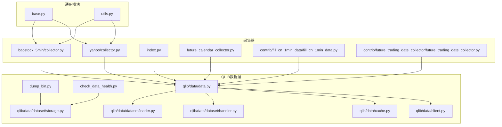
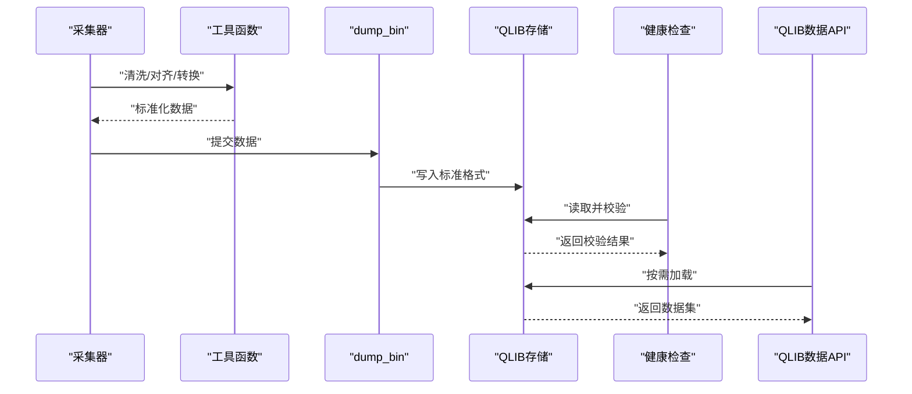
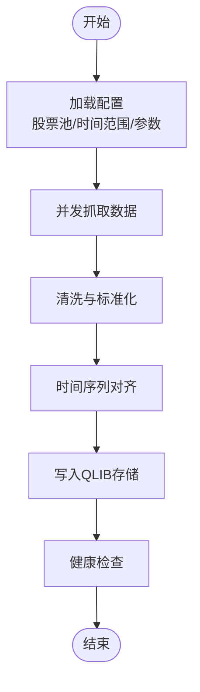
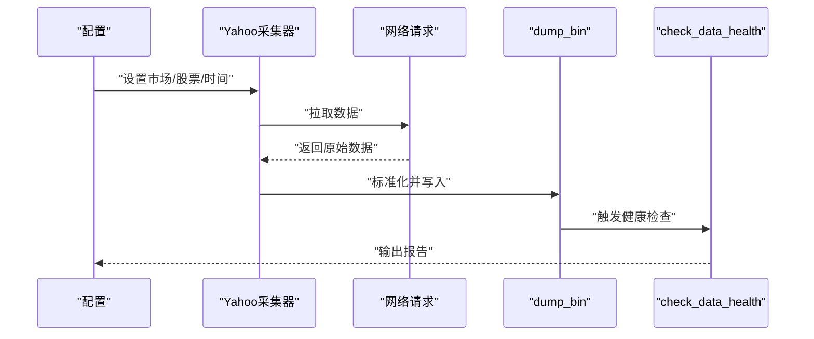
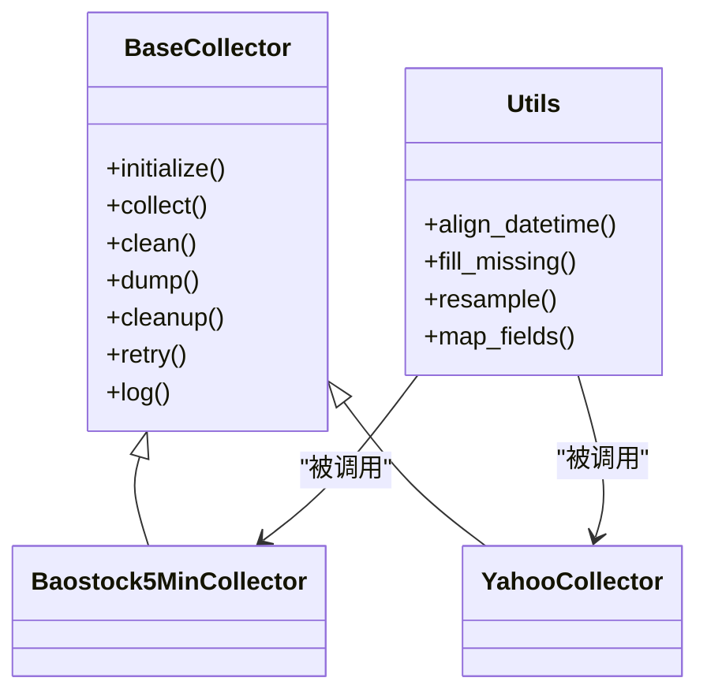
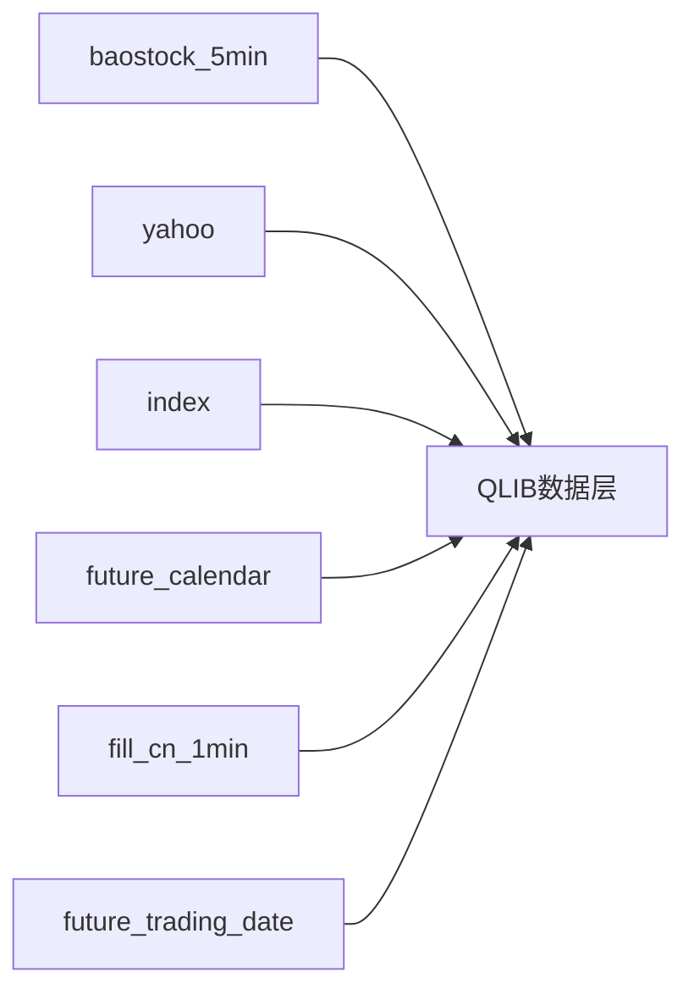
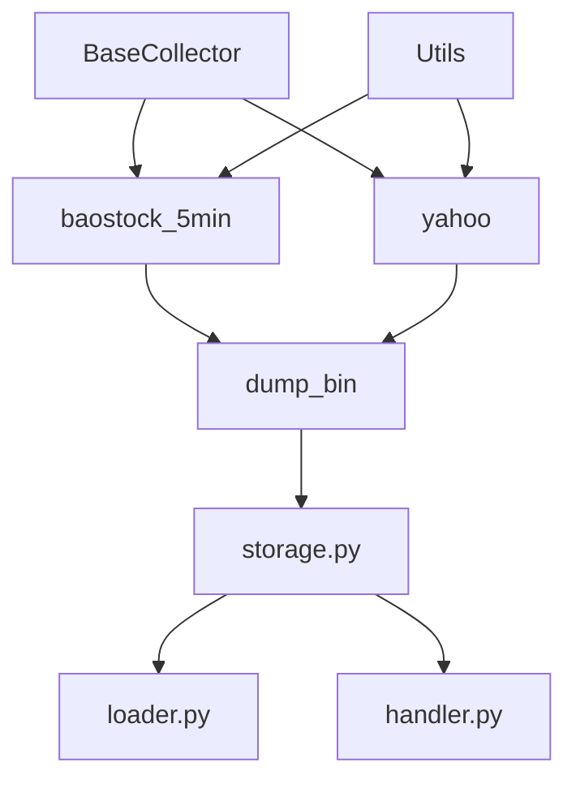

# 市场数据收集器

<cite>
**本文引用的文件**
- [scripts/data_collector/baostock_5min/collector.py](file://scripts/data_collector/baostock_5min/collector.py)
- [scripts/data_collector/yahoo/collector.py](file://scripts/data_collector/yahoo/collector.py)
- [scripts/data_collector/baostock_5min/README.md](file://scripts/data_collector/baostock_5min/README.md)
- [scripts/data_collector/yahoo/README.md](file://scripts/data_collector/yahoo/README.md)
- [scripts/data_collector/base.py](file://scripts/data_collector/base.py)
- [scripts/data_collector/utils.py](file://scripts/data_collector/utils.py)
- [scripts/data_collector/index.py](file://scripts/data_collector/index.py)
- [scripts/data_collector/future_calendar_collector.py](file://scripts/data_collector/future_calendar_collector.py)
- [scripts/data_collector/contrib/fill_cn_1min_data/fill_cn_1min_data.py](file://scripts/data_collector/contrib/fill_cn_1min_data/fill_cn_1min_data.py)
- [scripts/data_collector/contrib/future_trading_date_collector/future_trading_date_collector.py](file://scripts/data_collector/contrib/future_trading_date_collector/future_trading_date_collector.py)
- [scripts/get_data.py](file://scripts/get_data.py)
- [scripts/dump_bin.py](file://scripts/dump_bin.py)
- [scripts/check_data_health.py](file://scripts/check_data_health.py)
- [docs/start/getdata.rst](file://docs/start/getdata.rst)
- [docs/component/data.rst](file://docs/component/data.rst)
- [qlib/data/data.py](file://qlib/data/data.py)
- [qlib/data/dataset/loader.py](file://qlib/data/dataset/loader.py)
- [qlib/data/dataset/storage.py](file://qlib/data/dataset/storage.py)
- [qlib/data/dataset/handler.py](file://qlib/data/dataset/handler.py)
- [qlib/data/cache.py](file://qlib/data/cache.py)
- [qlib/data/client.py](file://qlib/data/client.py)
- [qlib/config.py](file://qlib/config.py)
- [qlib/log.py](file://qlib/log.py)
</cite>

## 目录
1. [简介](#简介)
2. [项目结构](#项目结构)
3. [核心组件](#核心组件)
4. [架构总览](#架构总览)
5. [详细组件分析](#详细组件分析)
6. [依赖关系分析](#依赖关系分析)
7. [性能考虑](#性能考虑)
8. [故障排除指南](#故障排除指南)
9. [结论](#结论)
10. [附录](#附录)

## 简介
本文件面向Qlib的市场数据收集器，系统性梳理分钟级股票数据、实时行情与市场基础信息的采集工具，重点覆盖baostock 5分钟数据收集器与Yahoo Finance数据获取器，并给出完整配置示例、数据格式转换与时间序列处理要点、数据完整性检查、数据源选择建议、性能优化技巧与故障排除指南。读者可据此在本地或生产环境中高效构建高质量的市场数据库。

## 项目结构
Qlib的数据采集体系主要位于scripts/data_collector目录下，包含多个具体数据源的采集器（如baostock_5min、yahoo等）、通用基类与工具函数，以及与QLIB数据层对接的脚本（如dump_bin、check_data_health）。同时，官方文档docs/start/getdata.rst与docs/component/data.rst提供了安装、配置与使用指南。

**图示来源**
- [scripts/data_collector/baostock_5min/collector.py](file://scripts/data_collector/baostock_5min/collector.py)
- [scripts/data_collector/yahoo/collector.py](file://scripts/data_collector/yahoo/collector.py)
- [scripts/data_collector/index.py](file://scripts/data_collector/index.py)
- [scripts/data_collector/future_calendar_collector.py](file://scripts/data_collector/future_calendar_collector.py)
- [scripts/data_collector/contrib/fill_cn_1min_data/fill_cn_1min_data.py](file://scripts/data_collector/contrib/fill_cn_1min_data/fill_cn_1min_data.py)
- [scripts/data_collector/contrib/future_trading_date_collector/future_trading_date_collector.py](file://scripts/data_collector/contrib/future_trading_date_collector/future_trading_date_collector.py)
- [scripts/data_collector/base.py](file://scripts/data_collector/base.py)
- [scripts/data_collector/utils.py](file://scripts/data_collector/utils.py)
- [scripts/dump_bin.py](file://scripts/dump_bin.py)
- [scripts/check_data_health.py](file://scripts/check_data_health.py)
- [qlib/data/data.py](file://qlib/data/data.py)
- [qlib/data/dataset/loader.py](file://qlib/data/dataset/loader.py)
- [qlib/data/dataset/storage.py](file://qlib/data/dataset/storage.py)
- [qlib/data/dataset/handler.py](file://qlib/data/dataset/handler.py)
- [qlib/data/cache.py](file://qlib/data/cache.py)
- [qlib/data/client.py](file://qlib/data/client.py)

**章节来源**
- [scripts/data_collector/baostock_5min/collector.py](file://scripts/data_collector/baostock_5min/collector.py)
- [scripts/data_collector/yahoo/collector.py](file://scripts/data_collector/yahoo/collector.py)
- [scripts/data_collector/base.py](file://scripts/data_collector/base.py)
- [scripts/data_collector/utils.py](file://scripts/data_collector/utils.py)
- [scripts/data_collector/index.py](file://scripts/data_collector/index.py)
- [scripts/data_collector/future_calendar_collector.py](file://scripts/data_collector/future_calendar_collector.py)
- [scripts/data_collector/contrib/fill_cn_1min_data/fill_cn_1min_data.py](file://scripts/data_collector/contrib/fill_cn_1min_data/fill_cn_1min_data.py)
- [scripts/data_collector/contrib/future_trading_date_collector/future_trading_date_collector.py](file://scripts/data_collector/contrib/future_trading_date_collector/future_trading_date_collector.py)
- [scripts/dump_bin.py](file://scripts/dump_bin.py)
- [scripts/check_data_health.py](file://scripts/check_data_health.py)
- [qlib/data/data.py](file://qlib/data/data.py)
- [qlib/data/dataset/loader.py](file://qlib/data/dataset/loader.py)
- [qlib/data/dataset/storage.py](file://qlib/data/dataset/storage.py)
- [qlib/data/dataset/handler.py](file://qlib/data/dataset/handler.py)
- [qlib/data/cache.py](file://qlib/data/cache.py)
- [qlib/data/client.py](file://qlib/data/client.py)

## 核心组件
- 通用采集基类：提供统一的采集接口、日志、重试与并发控制能力，便于扩展新的数据源。
- 采集器实现：针对不同数据源（如baostock 5分钟、Yahoo Finance）封装具体的请求、解析与落库逻辑。
- 工具函数：提供时间序列对齐、缺失值填充、周期转换等辅助能力。
- 数据导出与健康检查：将采集结果以QLIB标准格式持久化，并进行完整性校验。

**章节来源**
- [scripts/data_collector/base.py](file://scripts/data_collector/base.py)
- [scripts/data_collector/utils.py](file://scripts/data_collector/utils.py)
- [scripts/dump_bin.py](file://scripts/dump_bin.py)
- [scripts/check_data_health.py](file://scripts/check_data_health.py)

## 架构总览
下图展示了从采集器到QLIB数据层的整体流程：采集器负责拉取原始数据并进行清洗与标准化；随后通过dump_bin将数据写入QLIB存储；最后由check_data_health执行完整性检查；Loader/Handler/Storage等模块为上层训练与回测提供数据访问。

**图示来源**
- [scripts/data_collector/baostock_5min/collector.py](file://scripts/data_collector/baostock_5min/collector.py)
- [scripts/data_collector/yahoo/collector.py](file://scripts/data_collector/yahoo/collector.py)
- [scripts/data_collector/utils.py](file://scripts/data_collector/utils.py)
- [scripts/dump_bin.py](file://scripts/dump_bin.py)
- [scripts/check_data_health.py](file://scripts/check_data_health.py)
- [qlib/data/dataset/storage.py](file://qlib/data/dataset/storage.py)
- [qlib/data/dataset/loader.py](file://qlib/data/dataset/loader.py)
- [qlib/data/data.py](file://qlib/data/data.py)

## 详细组件分析

### Baostock 5分钟数据收集器
- 功能概述：从baostock源抓取A股分钟级（5分钟）K线数据，支持批量股票池与时间窗口配置，输出标准化格式供后续处理。
- 关键特性：
  - 股票池选择：支持全市场、行业、指数成分等多种筛选方式。
  - 时间范围：可指定起止日期与交易日过滤策略。
  - 数据清洗：去除异常值、补全缺失时段、统一字段命名。
  - 并发与重试：内置并发拉取与失败重试机制，提升稳定性。
- 使用步骤（基于仓库示例）：
  - 配置数据源与股票池：参考baostock_5min/README.md中的配置项说明。
  - 运行采集器：执行baostock_5min/collector.py完成数据抓取。
  - 导出与校验：运行dump_bin.py生成QLIB标准数据，再用check_data_health.py进行完整性检查。
- 数据格式要点：
  - 字段：包含日期时间、开盘价、最高价、最低价、收盘价、成交量、成交额等。
  - 对齐：按交易分钟对齐，剔除非交易时段。
  - 缺失处理：对缺失时段进行插值或标记，确保时间序列连续性。

**图示来源**
- [scripts/data_collector/baostock_5min/collector.py](file://scripts/data_collector/baostock_5min/collector.py)
- [scripts/data_collector/utils.py](file://scripts/data_collector/utils.py)
- [scripts/dump_bin.py](file://scripts/dump_bin.py)
- [scripts/check_data_health.py](file://scripts/check_data_health.py)

**章节来源**
- [scripts/data_collector/baostock_5min/collector.py](file://scripts/data_collector/baostock_5min/collector.py)
- [scripts/data_collector/baostock_5min/README.md](file://scripts/data_collector/baostock_5min/README.md)

### Yahoo Finance数据获取器
- 功能概述：从Yahoo Finance抓取全球市场（美股、港股、ETF等）的分钟级/日线数据，支持多市场、多周期与多字段。
- 关键特性：
  - 多市场适配：自动识别市场时区与交易日历。
  - 字段映射：将源字段映射为QLIB统一字段集合。
  - 错误恢复：网络波动与限流下的自适应重试。
- 使用步骤（基于仓库示例）：
  - 在Yahoo采集器中配置目标市场、股票列表与时间范围。
  - 执行collector.py完成数据采集。
  - 通过dump_bin与check_data_health完成入库与校验。

**图示来源**
- [scripts/data_collector/yahoo/collector.py](file://scripts/data_collector/yahoo/collector.py)
- [scripts/dump_bin.py](file://scripts/dump_bin.py)
- [scripts/check_data_health.py](file://scripts/check_data_health.py)

**章节来源**
- [scripts/data_collector/yahoo/collector.py](file://scripts/data_collector/yahoo/collector.py)
- [scripts/data_collector/yahoo/README.md](file://scripts/data_collector/yahoo/README.md)

### 通用采集基类与工具
- 采集基类：定义统一的生命周期（初始化、采集、清洗、落库、清理），并提供日志、并发与重试策略。
- 工具函数：提供时间序列对齐、缺失值填充、周期转换、字段映射等通用能力，降低各采集器重复实现成本。

**图示来源**
- [scripts/data_collector/base.py](file://scripts/data_collector/base.py)
- [scripts/data_collector/utils.py](file://scripts/data_collector/utils.py)
- [scripts/data_collector/baostock_5min/collector.py](file://scripts/data_collector/baostock_5min/collector.py)
- [scripts/data_collector/yahoo/collector.py](file://scripts/data_collector/yahoo/collector.py)

**章节来源**
- [scripts/data_collector/base.py](file://scripts/data_collector/base.py)
- [scripts/data_collector/utils.py](file://scripts/data_collector/utils.py)

### 其他采集器与补充工具
- 指数采集器：支持国内/海外指数的分钟级与日线数据采集。
- 期货日历采集器：维护交易日历，辅助时间序列对齐与回测。
- 中国1分钟数据补全：针对特定市场的高频缺失时段进行补全。
- 期货交易日采集器：维护外盘商品期货交易日历。

**图示来源**
- [scripts/data_collector/index.py](file://scripts/data_collector/index.py)
- [scripts/data_collector/future_calendar_collector.py](file://scripts/data_collector/future_calendar_collector.py)
- [scripts/data_collector/contrib/fill_cn_1min_data/fill_cn_1min_data.py](file://scripts/data_collector/contrib/fill_cn_1min_data/fill_cn_1min_data.py)
- [scripts/data_collector/contrib/future_trading_date_collector/future_trading_date_collector.py](file://scripts/data_collector/contrib/future_trading_date_collector/future_trading_date_collector.py)

**章节来源**
- [scripts/data_collector/index.py](file://scripts/data_collector/index.py)
- [scripts/data_collector/future_calendar_collector.py](file://scripts/data_collector/future_calendar_collector.py)
- [scripts/data_collector/contrib/fill_cn_1min_data/fill_cn_1min_data.py](file://scripts/data_collector/contrib/fill_cn_1min_data/fill_cn_1min_data.py)
- [scripts/data_collector/contrib/future_trading_date_collector/future_trading_date_collector.py](file://scripts/data_collector/contrib/future_trading_date_collector/future_trading_date_collector.py)

## 依赖关系分析
- 采集器对QLIB数据层的依赖：采集完成后通过dump_bin写入QLIB存储，Loader/Handler/Storage负责数据访问与缓存。
- 采集器之间的耦合度低：每个采集器独立实现，复用BaseCollector与Utils，便于扩展与维护。
- 外部依赖：baostock与Yahoo Finance的API限制与网络稳定性是关键外部约束。

**图示来源**
- [scripts/data_collector/base.py](file://scripts/data_collector/base.py)
- [scripts/data_collector/utils.py](file://scripts/data_collector/utils.py)
- [scripts/data_collector/baostock_5min/collector.py](file://scripts/data_collector/baostock_5min/collector.py)
- [scripts/data_collector/yahoo/collector.py](file://scripts/data_collector/yahoo/collector.py)
- [scripts/dump_bin.py](file://scripts/dump_bin.py)
- [qlib/data/dataset/storage.py](file://qlib/data/dataset/storage.py)
- [qlib/data/dataset/loader.py](file://qlib/data/dataset/loader.py)
- [qlib/data/dataset/handler.py](file://qlib/data/dataset/handler.py)

**章节来源**
- [scripts/data_collector/base.py](file://scripts/data_collector/base.py)
- [scripts/data_collector/utils.py](file://scripts/data_collector/utils.py)
- [scripts/dump_bin.py](file://scripts/dump_bin.py)
- [qlib/data/dataset/storage.py](file://qlib/data/dataset/storage.py)
- [qlib/data/dataset/loader.py](file://qlib/data/dataset/loader.py)
- [qlib/data/dataset/handler.py](file://qlib/data/dataset/handler.py)

## 性能考虑
- 并发与限速：合理设置并发度与请求间隔，避免触发数据源限流。
- 分批处理：按时间窗口与股票池分批采集，降低内存峰值与失败重试成本。
- 存储优化：优先使用QLIB二进制存储，减少I/O开销；启用缓存以加速重复查询。
- 数据预处理：在采集阶段完成字段映射与缺失值处理，降低训练阶段负担。
- 网络与超时：设置合理的连接与读取超时，结合指数退避重试策略提升成功率。

## 故障排除指南
- 采集失败：
  - 检查网络连通性与代理设置。
  - 查看采集器日志，定位具体失败的股票或时间段。
  - 调整并发度与重试次数，避开高峰时段。
- 数据不一致：
  - 使用check_data_health.py核对缺失、重复与异常值。
  - 对比不同数据源同一标的的历史数据，确认差异来源。
- 存储问题：
  - 确认QLIB存储路径权限与磁盘空间。
  - 清理过期缓存，释放磁盘空间。
- 时间序列异常：
  - 使用utils中的对齐与补全功能修复缺失时段。
  - 校验交易日历与节假日设置，避免跨夜与非交易时段干扰。

**章节来源**
- [scripts/check_data_health.py](file://scripts/check_data_health.py)
- [scripts/data_collector/utils.py](file://scripts/data_collector/utils.py)
- [qlib/log.py](file://qlib/log.py)

## 结论
Qlib的市场数据收集器通过模块化的采集器、通用基类与工具函数，实现了对多数据源、多市场的高效数据采集与标准化。配合QLIB数据层的存储与访问能力，用户可以快速构建高质量、可复现的市场数据库，支撑后续的模型训练与回测任务。建议在实际部署中结合业务需求选择合适的数据源与配置，并持续关注数据质量与性能优化。

## 附录

### 完整配置示例（基于仓库示例）
- 数据源选择：
  - baostock_5min：参考baostock_5min/README.md中的配置项，设置股票池、时间范围与输出路径。
  - yahoo：参考yahoo/README.md中的配置项，设置市场、字段与时间范围。
- 股票池配置：
  - 支持全市场、行业、指数成分等多种方式；可结合指数采集器与期货日历采集器完善覆盖。
- 时间范围配置：
  - 指定起止日期与交易日过滤策略；注意避开节假日与非交易时段。
- 输出与校验：
  - 采集完成后运行dump_bin.py生成QLIB标准数据，再执行check_data_health.py进行完整性检查。

**章节来源**
- [scripts/data_collector/baostock_5min/README.md](file://scripts/data_collector/baostock_5min/README.md)
- [scripts/data_collector/yahoo/README.md](file://scripts/data_collector/yahoo/README.md)
- [scripts/dump_bin.py](file://scripts/dump_bin.py)
- [scripts/check_data_health.py](file://scripts/check_data_health.py)

### 技术要点清单
- 数据格式转换：统一字段命名与单位，确保跨数据源一致性。
- 时间序列处理：对齐交易分钟、补全缺失时段、剔除非交易时段。
- 数据完整性检查：缺失值、重复值、异常值与跨日连续性校验。
- 性能优化：并发与限速、分批处理、缓存与存储优化。
- 故障排除：日志分析、重试策略、网络与超时设置。

**章节来源**
- [scripts/data_collector/utils.py](file://scripts/data_collector/utils.py)
- [scripts/check_data_health.py](file://scripts/check_data_health.py)
- [qlib/data/cache.py](file://qlib/data/cache.py)
- [qlib/data/client.py](file://qlib/data/client.py)