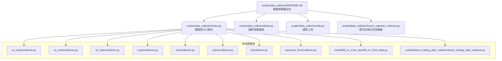
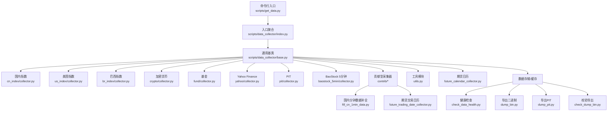
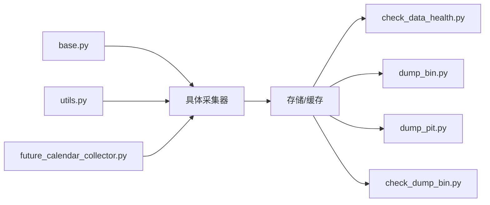

# 数据收集工具

<cite>
**本文引用的文件**
- [scripts/data_collector/README.md](file://scripts/data_collector/README.md)
- [scripts/data_collector/base.py](file://scripts/data_collector/base.py)
- [scripts/data_collector/index.py](file://scripts/data_collector/index.py)
- [scripts/data_collector/utils.py](file://scripts/data_collector/utils.py)
- [scripts/data_collector/future_calendar_collector.py](file://scripts/data_collector/future_calendar_collector.py)
- [scripts/data_collector/cn_index/collector.py](file://scripts/data_collector/cn_index/collector.py)
- [scripts/data_collector/us_index/collector.py](file://scripts/data_collector/us_index/collector.py)
- [scripts/data_collector/br_index/collector.py](file://scripts/data_collector/br_index/collector.py)
- [scripts/data_collector/crypto/collector.py](file://scripts/data_collector/crypto/collector.py)
- [scripts/data_collector/fund/collector.py](file://scripts/data_collector/fund/collector.py)
- [scripts/data_collector/yahoo/collector.py](file://scripts/data_collector/yahoo/collector.py)
- [scripts/data_collector/pit/collector.py](file://scripts/data_collector/pit/collector.py)
- [scripts/data_collector/baostock_5min/collector.py](file://scripts/data_collector/baostock_5min/collector.py)
- [scripts/data_collector/contrib/fill_cn_1min_data/fill_cn_1min_data.py](file://scripts/data_collector/contrib/fill_cn_1min_data/fill_cn_1min_data.py)
- [scripts/data_collector/contrib/future_trading_date_collector/future_trading_date_collector.py](file://scripts/data_collector/contrib/future_trading_date_collector/future_trading_date_collector.py)
- [scripts/check_data_health.py](file://scripts/check_data_health.py)
- [scripts/get_data.py](file://scripts/get_data.py)
- [scripts/dump_bin.py](file://scripts/dump_bin.py)
- [scripts/dump_pit.py](file://scripts/dump_pit.py)
- [scripts/collect_info.py](file://scripts/collect_info.py)
- [scripts/dump_pit.py](file://scripts/dump_pit.py)
- [scripts/dump_bin.py](file://scripts/dump_bin.py)
- [scripts/check_dump_bin.py](file://scripts/check_dump_bin.py)
- [scripts/README.md](file://scripts/README.md)
</cite>

## 目录
1. [简介](#简介)
2. [项目结构](#项目结构)
3. [核心组件](#核心组件)
4. [架构总览](#架构总览)
5. [详细组件分析](#详细组件分析)
6. [依赖关系分析](#依赖关系分析)
7. [性能考虑](#性能考虑)
8. [故障排查指南](#故障排查指南)
9. [结论](#结论)
10. [附录](#附录)

## 简介
本文件系统性梳理 Qlib 的数据收集工具体系，覆盖国内外股票指数、期货、基金、加密货币等多类资产的数据采集流程与最佳实践。内容包括：
- 各数据收集器的使用方法与配置项
- 参数设置与数据格式转换逻辑
- 完整使用示例（配置数据源、执行采集、异常处理）
- 数据质量检查工具的使用方法与建议
- 常见问题与优化策略

## 项目结构
Qlib 的数据收集能力主要集中在 scripts/data_collector 目录中，围绕“通用基类 + 具体数据源实现 + 工具脚本”的分层组织方式展开。顶层 README 提供了整体概览；index.py 聚合了各数据源入口；utils.py 提供通用工具；future_calendar_collector.py 提供特定业务（如期货交易日历）的采集器。

图示来源
- [scripts/data_collector/README.md](file://scripts/data_collector/README.md)
- [scripts/data_collector/index.py](file://scripts/data_collector/index.py)
- [scripts/data_collector/base.py](file://scripts/data_collector/base.py)
- [scripts/data_collector/utils.py](file://scripts/data_collector/utils.py)
- [scripts/data_collector/future_calendar_collector.py](file://scripts/data_collector/future_calendar_collector.py)
- [scripts/data_collector/cn_index/collector.py](file://scripts/data_collector/cn_index/collector.py)
- [scripts/data_collector/us_index/collector.py](file://scripts/data_collector/us_index/collector.py)
- [scripts/data_collector/br_index/collector.py](file://scripts/data_collector/br_index/collector.py)
- [scripts/data_collector/crypto/collector.py](file://scripts/data_collector/crypto/collector.py)
- [scripts/data_collector/fund/collector.py](file://scripts/data_collector/fund/collector.py)
- [scripts/data_collector/yahoo/collector.py](file://scripts/data_collector/yahoo/collector.py)
- [scripts/data_collector/pit/collector.py](file://scripts/data_collector/pit/collector.py)
- [scripts/data_collector/baostock_5min/collector.py](file://scripts/data_collector/baostock_5min/collector.py)
- [scripts/data_collector/contrib/fill_cn_1min_data/fill_cn_1min_data.py](file://scripts/data_collector/contrib/fill_cn_1min_data/fill_cn_1min_data.py)
- [scripts/data_collector/contrib/future_trading_date_collector/future_trading_date_collector.py](file://scripts/data_collector/contrib/future_trading_date_collector/future_trading_date_collector.py)

章节来源
- [scripts/data_collector/README.md](file://scripts/data_collector/README.md)
- [scripts/data_collector/index.py](file://scripts/data_collector/index.py)

## 核心组件
- 通用采集基类：提供统一的初始化、参数解析、数据拉取与落库流程骨架，便于扩展新的数据源。
- 具体数据源采集器：针对不同市场/资产类型实现各自的适配逻辑（如指数、期货、基金、加密货币等）。
- 工具模块：提供日期范围处理、时间序列对齐、缺失值填充等辅助能力。
- 期货交易日历采集器：面向特定业务需求（如国内商品期货）提供交易日历的生成与更新。
- 质量检查与导出工具：check_data_health.py、dump_bin.py、dump_pit.py、check_dump_bin.py 等，用于校验与导出数据。

章节来源
- [scripts/data_collector/base.py](file://scripts/data_collector/base.py)
- [scripts/data_collector/utils.py](file://scripts/data_collector/utils.py)
- [scripts/data_collector/future_calendar_collector.py](file://scripts/data_collector/future_calendar_collector.py)
- [scripts/check_data_health.py](file://scripts/check_data_health.py)
- [scripts/dump_bin.py](file://scripts/dump_bin.py)
- [scripts/dump_pit.py](file://scripts/dump_pit.py)
- [scripts/check_dump_bin.py](file://scripts/check_dump_bin.py)

## 架构总览
下图展示了从命令行到具体采集器再到数据存储的整体流程，以及质量检查与导出环节：

图示来源
- [scripts/get_data.py](file://scripts/get_data.py)
- [scripts/data_collector/index.py](file://scripts/data_collector/index.py)
- [scripts/data_collector/base.py](file://scripts/data_collector/base.py)
- [scripts/data_collector/utils.py](file://scripts/data_collector/utils.py)
- [scripts/data_collector/future_calendar_collector.py](file://scripts/data_collector/future_calendar_collector.py)
- [scripts/data_collector/cn_index/collector.py](file://scripts/data_collector/cn_index/collector.py)
- [scripts/data_collector/us_index/collector.py](file://scripts/data_collector/us_index/collector.py)
- [scripts/data_collector/br_index/collector.py](file://scripts/data_collector/br_index/collector.py)
- [scripts/data_collector/crypto/collector.py](file://scripts/data_collector/crypto/collector.py)
- [scripts/data_collector/fund/collector.py](file://scripts/data_collector/fund/collector.py)
- [scripts/data_collector/yahoo/collector.py](file://scripts/data_collector/yahoo/collector.py)
- [scripts/data_collector/pit/collector.py](file://scripts/data_collector/pit/collector.py)
- [scripts/data_collector/baostock_5min/collector.py](file://scripts/data_collector/baostock_5min/collector.py)
- [scripts/data_collector/contrib/fill_cn_1min_data/fill_cn_1min_data.py](file://scripts/data_collector/contrib/fill_cn_1min_data/fill_cn_1min_data.py)
- [scripts/data_collector/contrib/future_trading_date_collector/future_trading_date_collector.py](file://scripts/data_collector/contrib/future_trading_date_collector/future_trading_date_collector.py)
- [scripts/check_data_health.py](file://scripts/check_data_health.py)
- [scripts/dump_bin.py](file://scripts/dump_bin.py)
- [scripts/dump_pit.py](file://scripts/dump_pit.py)
- [scripts/check_dump_bin.py](file://scripts/check_dump_bin.py)

## 详细组件分析

### 通用采集基类（base.py）
- 职责：封装采集流程骨架，包括参数解析、时间范围处理、数据抓取、格式转换、写入存储等。
- 关键点：
  - 统一的初始化接口，支持传入数据源标识、起止日期、周期、字段过滤等。
  - 对外暴露抽象方法（如 fetch_raw_data、convert_format），由子类实现具体细节。
  - 错误重试与失败回退策略，保证在部分失败时仍可继续其他标的或日期段。
  - 输出标准化的数据格式，确保后续处理一致性。

章节来源
- [scripts/data_collector/base.py](file://scripts/data_collector/base.py)

### 指数类采集器
- 国内指数（cn_index/collector.py）
  - 支持上证、深证、中证、政策性指数等。
  - 配置项：指数列表、周期（日/分钟）、基准日期范围。
  - 数据格式：OHLCV 及成分股权重等。
- 美国指数（us_index/collector.py）
  - 支持标普、道琼斯、纳指等。
  - 配置项：指数代码集合、周期、日期范围。
  - 数据格式：OHLCV。
- 巴西指数（br_index/collector.py）
  - 支持伊索罗指数等。
  - 配置项：指数代码、周期、日期范围。
  - 数据格式：OHLCV。

章节来源
- [scripts/data_collector/cn_index/collector.py](file://scripts/data_collector/cn_index/collector.py)
- [scripts/data_collector/us_index/collector.py](file://scripts/data_collector/us_index/collector.py)
- [scripts/data_collector/br_index/collector.py](file://scripts/data_collector/br_index/collector.py)

### 商品与金融衍生品类
- 加密货币（crypto/collector.py）
  - 支持主流币种（BTC/ETH 等）。
  - 配置项：币种列表、周期（日/小时/分钟）、交易所标识。
  - 数据格式：OHLCV，含成交量。
- 基金（fund/collector.py）
  - 支持场内ETF、LOF、指数基金等。
  - 配置项：基金代码、周期、日期范围。
  - 数据格式：净值、累计净值、份额、规模等。

章节来源
- [scripts/data_collector/crypto/collector.py](file://scripts/data_collector/crypto/collector.py)
- [scripts/data_collector/fund/collector.py](file://scripts/data_collector/fund/collector.py)

### 外部数据源
- Yahoo Finance（yahoo/collector.py）
  - 使用公开 API 获取历史行情。
  - 配置项：股票/ETF 列表、周期、日期范围。
  - 数据格式：OHLCV。
- PIT（pit/collector.py）
  - 面向机构内部或合规场景的数据源。
  - 配置项：数据路径、字段映射、日期范围。
  - 数据格式：结构化明细表。

章节来源
- [scripts/data_collector/yahoo/collector.py](file://scripts/data_collector/yahoo/collector.py)
- [scripts/data_collector/pit/collector.py](file://scripts/data_collector/pit/collector.py)

### 分钟级与高频数据
- BaoStock 5分钟（baostock_5min/collector.py）
  - 采集国内市场的5分钟K线。
  - 配置项：股票池、日期范围、是否补全。
  - 数据格式：OHLCV。
- 贡献型：国内分钟数据补全（contrib/fill_cn_1min_data/fill_cn_1min_data.py）
  - 用于补齐缺失的分钟级交易时段数据。
  - 配置项：目标日期范围、补全规则。
  - 数据格式：分钟级OHLCV。

章节来源
- [scripts/data_collector/baostock_5min/collector.py](file://scripts/data_collector/baostock_5min/collector.py)
- [scripts/data_collector/contrib/fill_cn_1min_data/fill_cn_1min_data.py](file://scripts/data_collector/contrib/fill_cn_1min_data/fill_cn_1min_data.py)

### 期货相关采集器
- 期货交易日历（contrib/future_trading_date_collector/future_trading_date_collector.py）
  - 生成/更新国内商品期货交易日历。
  - 配置项：交易所列表、年份范围。
  - 数据格式：日期列表。
- 期货日历采集器（future_calendar_collector.py）
  - 通用期货日历采集流程，支持多交易所合并。
  - 配置项：交易所、周期、日期范围。
  - 数据格式：日期列表。

章节来源
- [scripts/data_collector/contrib/future_trading_date_collector/future_trading_date_collector.py](file://scripts/data_collector/contrib/future_trading_date_collector/future_trading_date_collector.py)
- [scripts/data_collector/future_calendar_collector.py](file://scripts/data_collector/future_calendar_collector.py)

### 工具模块（utils.py）
- 功能：日期范围计算、时间序列对齐、缺失值处理、周期转换等。
- 适用场景：统一不同数据源的时间粒度与对齐策略，减少下游处理复杂度。

章节来源
- [scripts/data_collector/utils.py](file://scripts/data_collector/utils.py)

### 入口聚合（index.py）
- 功能：将所有数据源的采集器注册并提供统一调用入口，便于通过命令行或配置文件选择目标数据源。
- 适用场景：批量采集、按需启用特定数据源。

章节来源
- [scripts/data_collector/index.py](file://scripts/data_collector/index.py)

### 质量检查与导出工具
- check_data_health.py：检查数据完整性、缺失率、异常值等。
- dump_bin.py：将采集结果导出为二进制格式，便于快速加载。
- dump_pit.py：导出PIT结构化数据。
- check_dump_bin.py：校验导出文件的正确性与一致性。

章节来源
- [scripts/check_data_health.py](file://scripts/check_data_health.py)
- [scripts/dump_bin.py](file://scripts/dump_bin.py)
- [scripts/dump_pit.py](file://scripts/dump_pit.py)
- [scripts/check_dump_bin.py](file://scripts/check_dump_bin.py)

## 依赖关系分析
- 组件耦合：
  - 所有具体采集器均继承自 base.py，确保一致的生命周期与错误处理。
  - index.py 作为门面，集中管理各采集器的注册与调用。
  - utils.py 为通用工具层，被多个采集器复用。
  - 质量检查与导出工具独立于采集器，形成解耦的后处理链路。
- 外部依赖：
  - 第三方数据源（如 Yahoo Finance、加密货币交易所 API）可能受网络与限流影响。
  - 存储层（文件系统/数据库）的可用性与权限会影响写入阶段。

图示来源
- [scripts/data_collector/base.py](file://scripts/data_collector/base.py)
- [scripts/data_collector/utils.py](file://scripts/data_collector/utils.py)
- [scripts/data_collector/future_calendar_collector.py](file://scripts/data_collector/future_calendar_collector.py)
- [scripts/check_data_health.py](file://scripts/check_data_health.py)
- [scripts/dump_bin.py](file://scripts/dump_bin.py)
- [scripts/dump_pit.py](file://scripts/dump_pit.py)
- [scripts/check_dump_bin.py](file://scripts/check_dump_bin.py)

## 性能考虑
- 并发与限速：对第三方 API 进行并发控制与速率限制，避免触发风控或被封禁。
- 分批处理：按日期区间或标的分组进行批处理，降低内存峰值与单次失败影响。
- 缓存策略：优先利用本地缓存与增量更新，减少重复下载。
- 数据压缩与格式：导出阶段采用高效格式（如二进制）以提升加载速度。
- 存储布局：合理组织文件目录与命名规范，便于快速检索与版本管理。

## 故障排查指南
- 常见问题
  - 网络超时/限流：调整并发度与重试间隔，必要时切换代理或镜像源。
  - 数据缺失：启用补全工具（如分钟数据补全），核对交易日历。
  - 时间对齐不一致：统一使用工具模块进行周期转换与对齐。
  - 导出失败：先运行 check_dump_bin.py 校验导出文件，再定位存储权限或磁盘空间问题。
- 排查步骤
  1) 使用 check_data_health.py 检查缺失率与异常值。
  2) 对比不同数据源的覆盖范围与时间跨度。
  3) 查看采集器日志与重试记录，定位失败节点。
  4) 使用 dump_bin.py 或 dump_pit.py 导出样本数据进行人工核验。

章节来源
- [scripts/check_data_health.py](file://scripts/check_data_health.py)
- [scripts/check_dump_bin.py](file://scripts/check_dump_bin.py)
- [scripts/dump_bin.py](file://scripts/dump_bin.py)
- [scripts/dump_pit.py](file://scripts/dump_pit.py)

## 结论
Qlib 的数据收集工具以“通用基类 + 具体数据源 + 工具链”为核心架构，既保证了扩展性，又提供了完善的质量保障与导出能力。通过合理的配置与流程编排，可以高效地完成多市场、多周期、多类型的资产数据采集，并为后续建模与回测提供高质量的数据基础。

## 附录

### 使用示例（流程概述）
- 配置数据源
  - 在 index.py 中确认目标采集器已注册。
  - 在对应 collector.py 中设置标的列表、周期、日期范围等参数。
- 执行采集
  - 通过命令行入口（如 get_data.py）启动采集任务。
  - 若需要，先运行期货交易日历采集器生成日历。
- 数据质量检查
  - 使用 check_data_health.py 检查完整性与异常。
  - 使用 dump_bin.py/dump_pit.py 导出样本数据进行人工核验。
- 异常处理
  - 对失败的日期段或标的进行重试，必要时启用补全工具。
  - 校验导出文件的正确性，修复存储或权限问题。

章节来源
- [scripts/get_data.py](file://scripts/get_data.py)
- [scripts/data_collector/index.py](file://scripts/data_collector/index.py)
- [scripts/data_collector/contrib/future_trading_date_collector/future_trading_date_collector.py](file://scripts/data_collector/contrib/future_trading_date_collector/future_trading_date_collector.py)
- [scripts/check_data_health.py](file://scripts/check_data_health.py)
- [scripts/dump_bin.py](file://scripts/dump_bin.py)
- [scripts/dump_pit.py](file://scripts/dump_pit.py)
- [scripts/check_dump_bin.py](file://scripts/check_dump_bin.py)