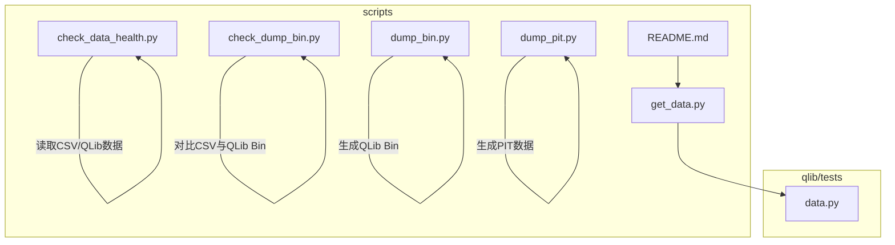
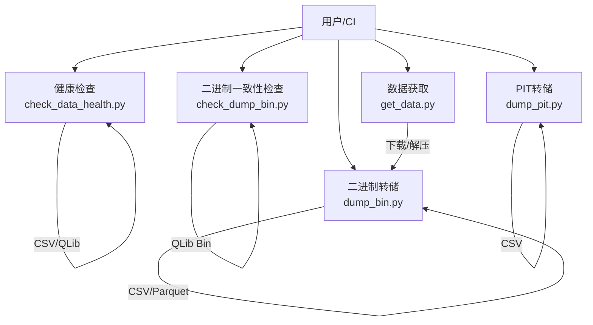
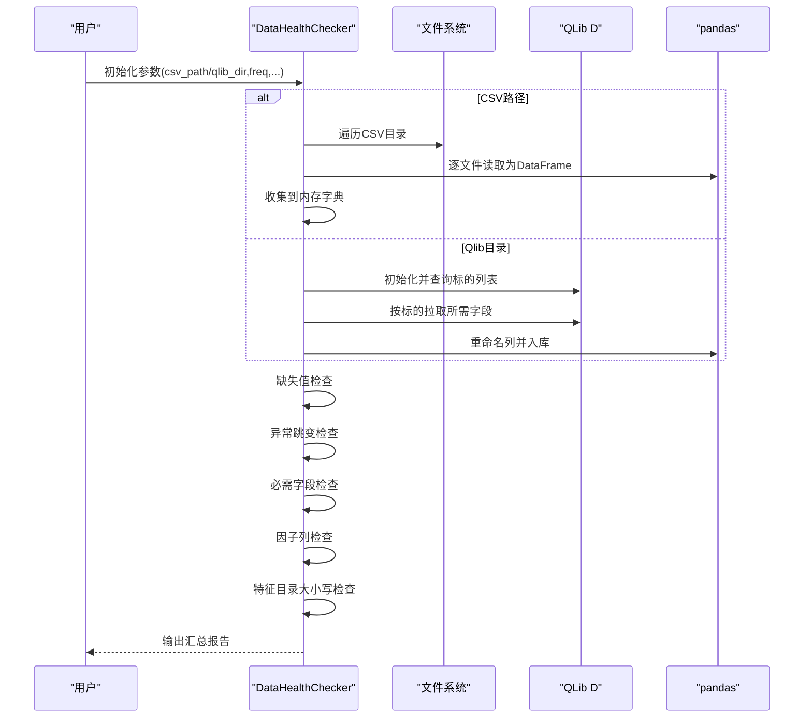
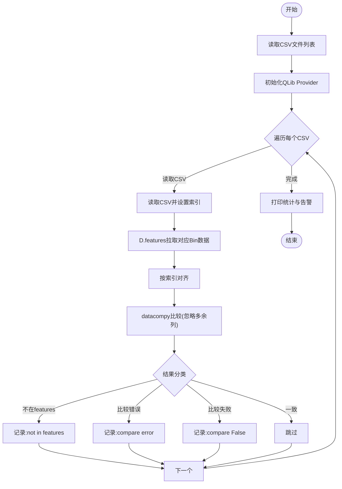
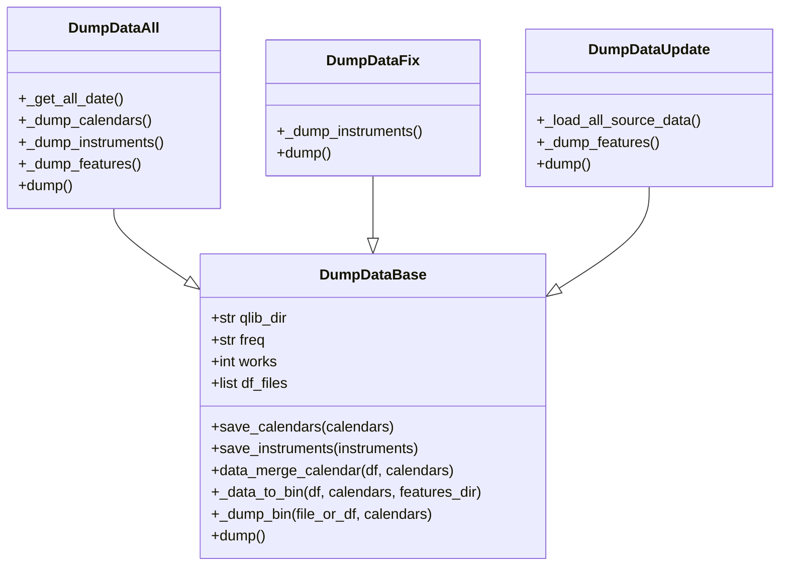
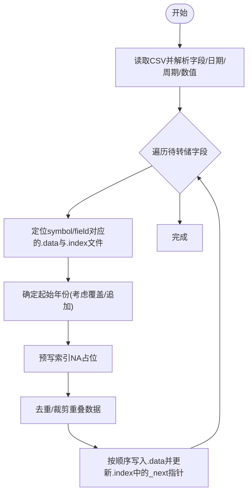
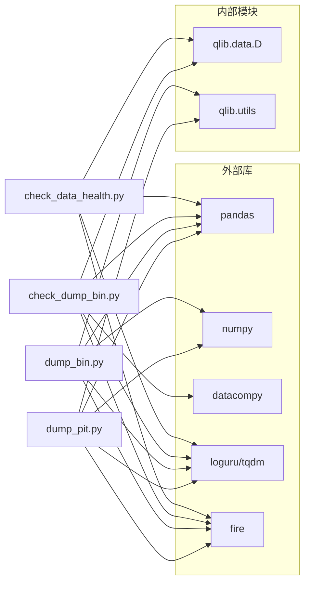

# 数据质量检查工具

<cite>
**本文引用的文件**
- [scripts/check_data_health.py](file://scripts/check_data_health.py)
- [scripts/check_dump_bin.py](file://scripts/check_dump_bin.py)
- [scripts/dump_bin.py](file://scripts/dump_bin.py)
- [scripts/dump_pit.py](file://scripts/dump_pit.py)
- [scripts/get_data.py](file://scripts/get_data.py)
- [qlib/tests/data.py](file://qlib/tests/data.py)
- [scripts/README.md](file://scripts/README.md)
</cite>

## 目录
1. [简介](#简介)
2. [项目结构](#项目结构)
3. [核心组件](#核心组件)
4. [架构总览](#架构总览)
5. [详细组件分析](#详细组件分析)
6. [依赖关系分析](#依赖关系分析)
7. [性能考量](#性能考量)
8. [故障排查指南](#故障排查指南)
9. [结论](#结论)
10. [附录：使用示例与最佳实践](#附录使用示例与最佳实践)

## 简介
本文件面向使用者与维护者，系统化介绍 Qlib 的数据质量检查工具链，涵盖以下能力：
- 数据健康检查：缺失值、异常跳变、必需字段缺失、因子列缺失、特征目录大小写问题等
- 二进制数据转储与一致性校验：将 CSV/Parquet 转换为 Qlib 二进制格式，并与原始 CSV 进行逐列比对
- PIT（时点）财务数据转储：按季度/年度写入有序、可链接的历史修订数据
- 数据获取与环境准备：一键下载示例数据集，便于快速验证工具链

目标是帮助用户在本地或 CI 环境中自动化地检测与修复数据质量问题，保障训练与回测的稳定性。

## 项目结构
与数据质量相关的核心脚本位于 scripts 目录，配套测试与数据下载工具位于 qlib/tests/data.py 与 scripts/README.md 中。

图表来源
- [scripts/check_data_health.py:1-249](file://scripts/check_data_health.py#L1-L249)
- [scripts/check_dump_bin.py:1-143](file://scripts/check_dump_bin.py#L1-L143)
- [scripts/dump_bin.py:1-543](file://scripts/dump_bin.py#L1-L543)
- [scripts/dump_pit.py:1-281](file://scripts/dump_pit.py#L1-L281)
- [scripts/get_data.py:1-9](file://scripts/get_data.py#L1-L9)
- [qlib/tests/data.py:1-212](file://qlib/tests/data.py#L1-L212)
- [scripts/README.md:1-77](file://scripts/README.md#L1-L77)

章节来源
- [scripts/check_data_health.py:1-249](file://scripts/check_data_health.py#L1-L249)
- [scripts/check_dump_bin.py:1-143](file://scripts/check_dump_bin.py#L1-L143)
- [scripts/dump_bin.py:1-543](file://scripts/dump_bin.py#L1-L543)
- [scripts/dump_pit.py:1-281](file://scripts/dump_pit.py#L1-L281)
- [scripts/get_data.py:1-9](file://scripts/get_data.py#L1-L9)
- [qlib/tests/data.py:1-212](file://qlib/tests/data.py#L1-L212)
- [scripts/README.md:1-77](file://scripts/README.md#L1-L77)

## 核心组件
- 数据健康检查器：支持从 CSV 目录或 Qlib 目录加载数据，执行缺失值、异常跳变、必需字段、因子列、特征目录大小写等检查，并输出汇总报告
- 二进制一致性检查器：并行对比 CSV 与 Qlib Bin，基于 datacompy 做索引对齐后的逐列比较，统计“不在features”“比较失败”“比较错误”等
- 二进制转储器：支持全量转储、增量更新、修复模式；自动构建日历、仪器清单，按字段生成二进制文件
- PIT 转储器：按季度/年度写入有序修订数据，维护索引文件，支持覆盖或追加更新
- 数据获取器：封装远程数据下载与解压流程，便于快速搭建测试环境

章节来源
- [scripts/check_data_health.py:13-249](file://scripts/check_data_health.py#L13-L249)
- [scripts/check_dump_bin.py:17-143](file://scripts/check_dump_bin.py#L17-L143)
- [scripts/dump_bin.py:53-543](file://scripts/dump_bin.py#L53-L543)
- [scripts/dump_pit.py:24-281](file://scripts/dump_pit.py#L24-L281)
- [scripts/get_data.py:4-9](file://scripts/get_data.py#L4-L9)
- [qlib/tests/data.py:18-212](file://qlib/tests/data.py#L18-L212)

## 架构总览
下图展示数据质量工具链的整体调用关系与数据流：

图表来源
- [scripts/check_data_health.py:13-249](file://scripts/check_data_health.py#L13-L249)
- [scripts/dump_bin.py:53-543](file://scripts/dump_bin.py#L53-L543)
- [scripts/check_dump_bin.py:17-143](file://scripts/check_dump_bin.py#L17-L143)
- [scripts/dump_pit.py:24-281](file://scripts/dump_pit.py#L24-L281)
- [scripts/get_data.py:4-9](file://scripts/get_data.py#L4-L9)
- [qlib/tests/data.py:18-212](file://qlib/tests/data.py#L18-L212)

## 详细组件分析

### 组件一：数据健康检查器（check_data_health.py）
职责与能力
- 支持从 CSV 目录或 Qlib 目录加载数据
- 缺失值检查：统计各标的每列缺失数量
- 异常跳变检查：计算相邻时间点百分比变化，超过阈值视为异常
- 必需字段检查：OHLCV 字段是否齐全
- 因子列检查：是否存在 factor 列且非空
- 特征目录大小写检查：Linux 等大小写敏感文件系统下，features 子目录名必须小写

关键流程（序列图）

图表来源
- [scripts/check_data_health.py:21-70](file://scripts/check_data_health.py#L21-L70)
- [scripts/check_data_health.py:109-211](file://scripts/check_data_health.py#L109-L211)

章节来源
- [scripts/check_data_health.py:13-249](file://scripts/check_data_health.py#L13-L249)

### 组件二：二进制一致性检查器（check_dump_bin.py）
职责与能力
- 并行对比 CSV 文件与 Qlib Bin
- 自动对齐索引（symbol,date），忽略多余列
- 统计“不在features”“比较失败”“比较错误”三类结果

关键流程（流程图）

图表来源
- [scripts/check_dump_bin.py:55-139](file://scripts/check_dump_bin.py#L55-L139)

章节来源
- [scripts/check_dump_bin.py:17-143](file://scripts/check_dump_bin.py#L17-L143)

### 组件三：二进制转储器（dump_bin.py）
职责与能力
- 全量转储：收集所有日期、生成日历与仪器清单，逐字段生成二进制文件
- 增量更新：仅追加新日期，更新仪器时间范围
- 修复模式：针对新增标的补充仪器区间，保留旧区间不变
- 支持 CSV/Parquet 输入，自动处理重复行、日期类型转换

类关系图

图表来源
- [scripts/dump_bin.py:53-543](file://scripts/dump_bin.py#L53-L543)

章节来源
- [scripts/dump_bin.py:53-543](file://scripts/dump_bin.py#L53-L543)

### 组件四：PIT 转储器（dump_pit.py）
职责与能力
- 将 CSV 形式的时点财务数据按字段与周期（季度/年度）写入二进制文件
- 维护索引文件，支持覆盖或追加更新，自动处理链接指针与空值占位
- 支持字段过滤与并发转储

关键流程（流程图）

图表来源
- [scripts/dump_pit.py:150-276](file://scripts/dump_pit.py#L150-L276)

章节来源
- [scripts/dump_pit.py:24-281](file://scripts/dump_pit.py#L24-L281)

### 组件五：数据获取器（get_data.py + qlib/tests/data.py）
职责与能力
- 提供一键下载示例数据集（含版本与区域选择）
- 下载后自动解压并清理旧目录（可选）
- 支持检查远端资源可用性

章节来源
- [scripts/get_data.py:4-9](file://scripts/get_data.py#L4-L9)
- [qlib/tests/data.py:18-212](file://qlib/tests/data.py#L18-L212)
- [scripts/README.md:12-77](file://scripts/README.md#L12-L77)

## 依赖关系分析
- 外部库
  - pandas：数据读取与对齐
  - datacompy：跨源数据一致性比较
  - numpy：二进制写入与索引
  - loguru/tqdm：日志与进度条
  - fire：命令行入口
- 内部依赖
  - qlib.data.D：统一数据访问接口
  - qlib.utils：符号编码/解码、周期偏移等工具

图表来源
- [scripts/check_data_health.py:1-10](file://scripts/check_data_health.py#L1-L10)
- [scripts/check_dump_bin.py:1-14](file://scripts/check_dump_bin.py#L1-L14)
- [scripts/dump_bin.py:1-17](file://scripts/dump_bin.py#L1-L17)
- [scripts/dump_pit.py:1-21](file://scripts/dump_pit.py#L1-L21)

## 性能考量
- 并发策略
  - 多进程池用于 CSV 扫描、Bin 对比与 PIT 转储，显著提升吞吐
  - 全量转储阶段使用多进程扫描日期范围，再串行写入以避免竞争
- 内存与磁盘
  - 增量更新模式会加载全部源数据以计算新日期集合，内存占用较高
  - 建议在高并发场景下合理设置 max_workers，避免 IO 抖动
- 索引与对齐
  - 对齐前先去重，减少无效重采样开销
  - datacompy 比较忽略多余列，降低比较成本

## 故障排查指南
常见问题与解决建议
- 特征目录大小写导致加载失败
  - 现象：Linux 等大小写敏感系统下，features 子目录名为大写导致找不到数据
  - 解决：将 features 下所有子目录名改为小写
  - 参考：[check_data_health.py:79-107](file://scripts/check_data_health.py#L79-L107)
- 缺少必需字段（OHLCV）
  - 现象：某些 CSV 缺失 open/high/low/close/volume
  - 解决：补齐字段或调整 include_fields/exclude_fields
  - 参考：[check_data_health.py:165-183](file://scripts/check_data_health.py#L165-L183)
- 因子列缺失或为空
  - 现象：部分指数或特殊标的无 factor 列
  - 解决：根据业务规则生成/填充因子列，或在下游逻辑中兼容
  - 参考：[check_data_health.py:185-211](file://scripts/check_data_health.py#L185-L211)
- 二进制一致性检查失败
  - 现象：compare False 或 compare error
  - 排查：确认 CSV 与 Bin 的字段名、索引、精度是否一致；检查日期格式与 symbol 映射
  - 参考：[check_dump_bin.py:110-139](file://scripts/check_dump_bin.py#L110-L139)
- 增量更新后日历不连续
  - 现象：新日期未被纳入日历
  - 解决：重新执行全量转储以重建日历，或手动合并日历
  - 参考：[dump_bin.py:456-485](file://scripts/dump_bin.py#L456-L485)
- PIT 数据链接断裂
  - 现象：按周期索引无法正确指向最新修订
  - 解决：确认 index 文件首年与数据文件写入顺序；必要时覆盖重建
  - 参考：[dump_pit.py:200-264](file://scripts/dump_pit.py#L200-L264)

章节来源
- [scripts/check_data_health.py:79-211](file://scripts/check_data_health.py#L79-L211)
- [scripts/check_dump_bin.py:110-139](file://scripts/check_dump_bin.py#L110-L139)
- [scripts/dump_bin.py:456-485](file://scripts/dump_bin.py#L456-L485)
- [scripts/dump_pit.py:200-264](file://scripts/dump_pit.py#L200-L264)

## 结论
通过上述工具链，用户可以系统化地完成数据质量检查、二进制转储与一致性验证、PIT 数据维护等工作。建议在数据上线前执行健康检查与二进制一致性检查，并结合增量更新模式持续维护日历与仪器信息，确保训练与回测数据稳定可靠。

## 附录：使用示例与最佳实践

- 使用步骤总览
  - 准备数据：可直接使用 CSV/Parquet，或通过数据获取器下载示例数据
  - 转储二进制：选择全量/增量/修复模式，生成 Bin 文件
  - 一致性检查：对比 CSV 与 Bin，定位差异
  - 健康检查：扫描缺失值、异常跳变、必需字段与因子列
  - PIT 转储：按季度/年度生成有序修订数据

- 示例命令（基于脚本入口）
  - 健康检查（CSV 目录）
    - python scripts/check_data_health.py --csv_path=/path/to/csv --freq=day
  - 健康检查（QLib 目录）
    - python scripts/check_data_health.py --qlib_dir=/path/to/qlib --freq=day
  - 二进制一致性检查
    - python scripts/check_dump_bin.py --csv_path=/path/to/csv --qlib_dir=/path/to/qlib --freq=day
  - 二进制转储（全量）
    - python scripts/dump_bin.py dump_all --data_path=/path/to/csv --qlib_dir=/path/to/qlib --freq=day
  - 二进制转储（增量）
    - python scripts/dump_bin.py dump_update --data_path=/path/to/csv --qlib_dir=/path/to/qlib --freq=day
  - PIT 转储（季度）
    - python scripts/dump_pit.py --csv_path=/path/to/pit_csv --qlib_dir=/path/to/qlib --freq=quarterly
  - 获取示例数据
    - python scripts/get_data.py qlib_data --target_dir=~/.qlib/qlib_data/cn_data --region=cn --interval=1d

- 最佳实践
  - 在 CI 中集成健康检查与一致性检查，阻断低质数据进入训练流水线
  - 对高频数据，优先使用 Parquet 作为中间格式，减少 CSV 解析开销
  - 增量更新前先备份 qlib_dir，便于回滚
  - 对 PIT 数据，严格控制字段与周期命名，避免后续解析歧义
  - 合理设置 max_workers，平衡 CPU 与磁盘 IO；在共享环境中避免过度并发

章节来源
- [scripts/check_data_health.py:247-249](file://scripts/check_data_health.py#L247-L249)
- [scripts/check_dump_bin.py:141-143](file://scripts/check_dump_bin.py#L141-L143)
- [scripts/dump_bin.py:541-543](file://scripts/dump_bin.py#L541-L543)
- [scripts/dump_pit.py:279-281](file://scripts/dump_pit.py#L279-L281)
- [scripts/get_data.py:7-9](file://scripts/get_data.py#L7-L9)
- [scripts/README.md:12-77](file://scripts/README.md#L12-L77)