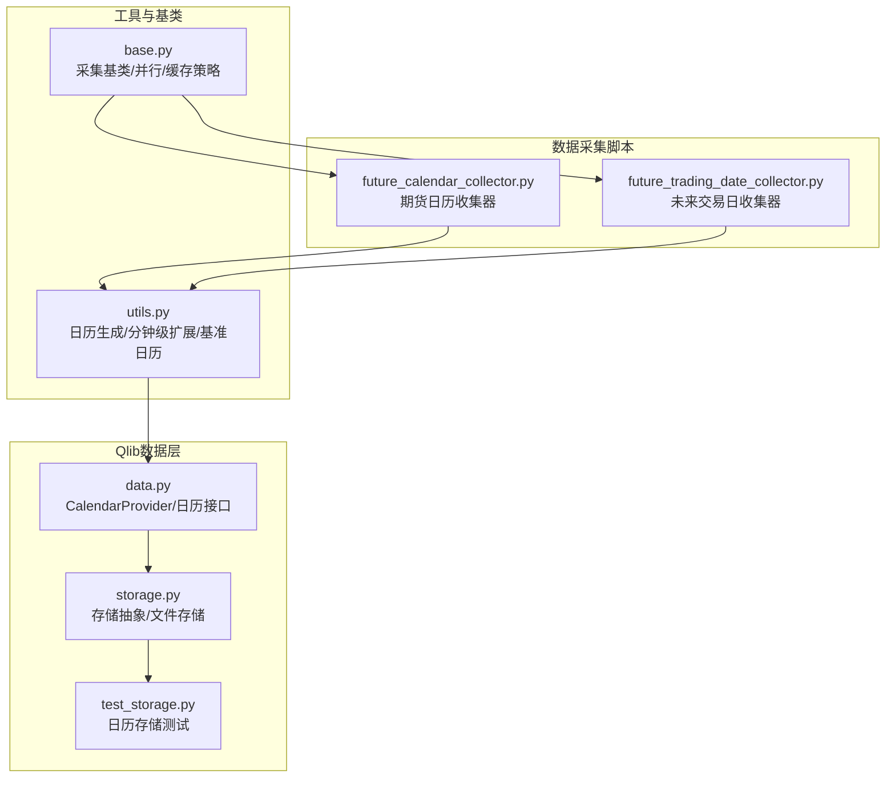
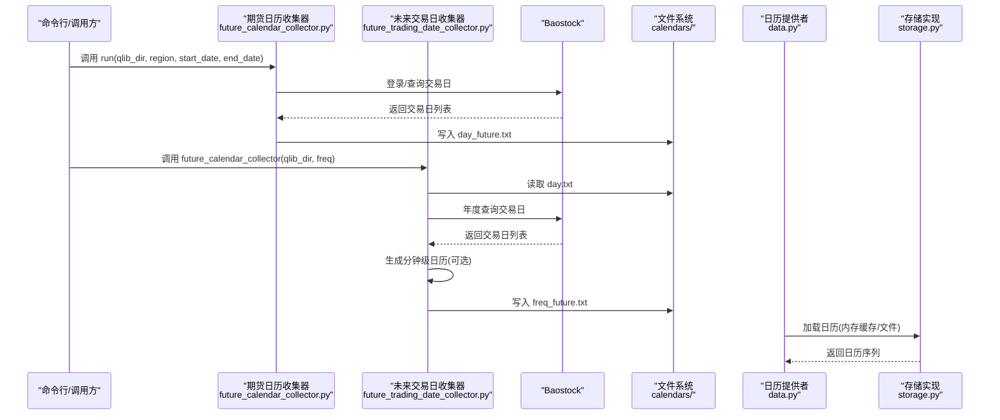
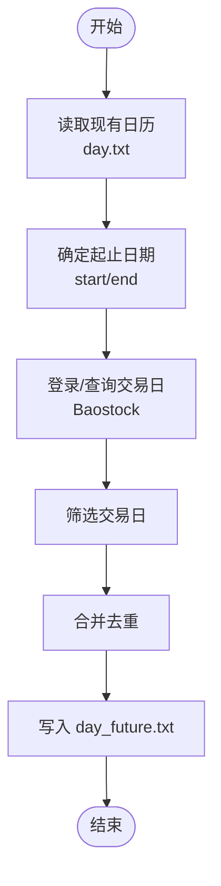
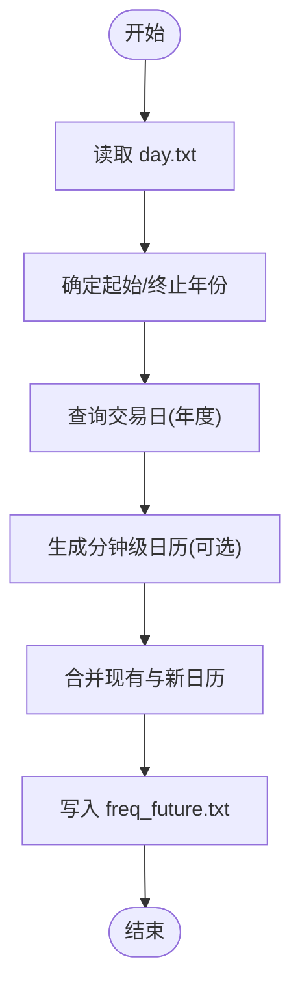
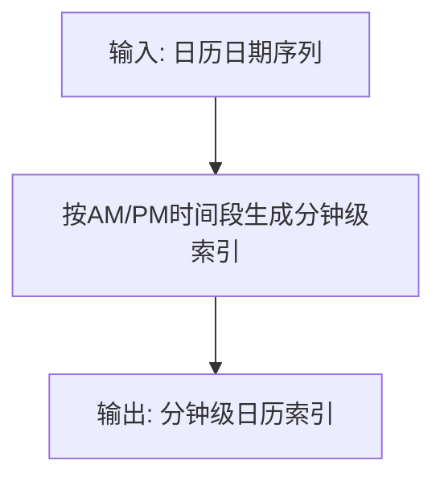
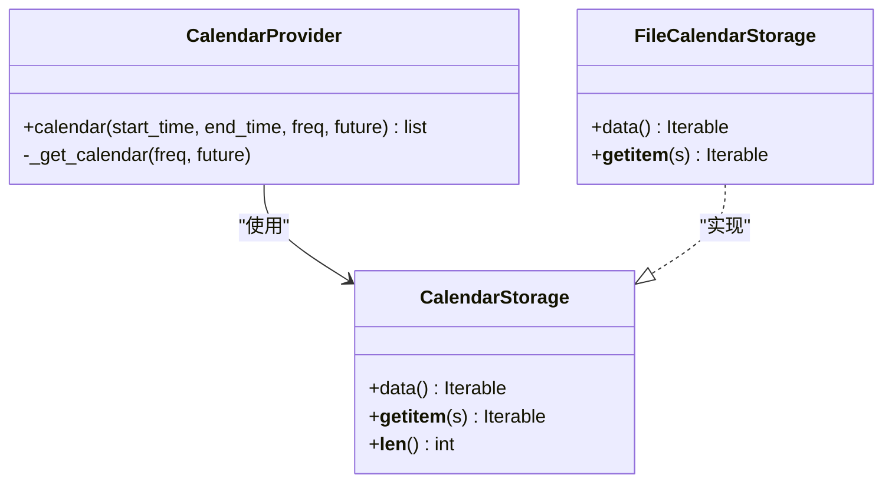
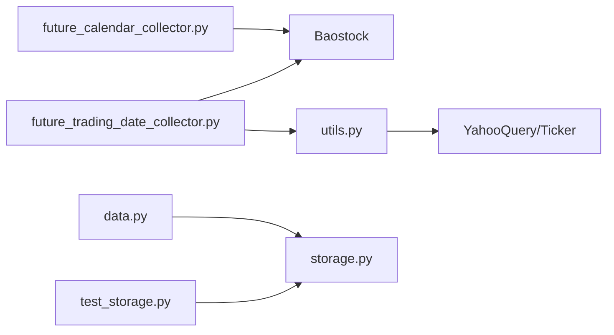

# 日历与交易日收集器

<cite>
**本文引用的文件**
- [future_calendar_collector.py](file://scripts/data_collector/future_calendar_collector.py)
- [future_trading_date_collector.py](file://scripts/data_collector/contrib/future_trading_date_collector/future_trading_date_collector.py)
- [utils.py](file://scripts/data_collector/utils.py)
- [base.py](file://scripts/data_collector/base.py)
- [storage.py](file://qlib/data/storage/storage.py)
- [data.py](file://qlib/data/data.py)
- [test_storage.py](file://tests/storage_tests/test_storage.py)
</cite>

## 目录
1. [引言](#引言)
2. [项目结构](#项目结构)
3. [核心组件](#核心组件)
4. [架构总览](#架构总览)
5. [详细组件分析](#详细组件分析)
6. [依赖关系分析](#依赖关系分析)
7. [性能考量](#性能考量)
8. [故障排查指南](#故障排查指南)
9. [结论](#结论)
10. [附录](#附录)

## 引言
本文件面向需要构建与维护金融日历（含期货交易日历、节假日、市场开闭市时间）的用户与开发者，系统性介绍 Qlib 中“日历与交易日收集器”的设计与使用方法。内容覆盖：
- 如何采集与更新交易日历（含日线与分钟级）
- 如何配置日历数据源、处理跨时区与多市场差异
- 日历数据的存储格式、查询接口与缓存策略
- 在量化回测中的应用与注意事项

## 项目结构
围绕日历与交易日收集的相关模块主要分布在以下位置：
- 收集器脚本：scripts/data_collector 下的两类日历收集器
- 工具函数：scripts/data_collector/utils.py（日历生成、分钟级日历扩展等）
- 基类与通用流程：scripts/data_collector/base.py（采集基类、归一化流程等）
- Qlib 数据层日历提供者与存储：qlib/data/data.py、qlib/data/storage/storage.py
- 测试用例：tests/storage_tests/test_storage.py（验证日历存储行为）

图表来源
- [future_calendar_collector.py:18-122](file://scripts/data_collector/future_calendar_collector.py#L18-L122)
- [future_trading_date_collector.py:23-89](file://scripts/data_collector/contrib/future_trading_date_collector/future_trading_date_collector.py#L23-L89)
- [utils.py:57-105](file://scripts/data_collector/utils.py#L57-L105)
- [base.py:20-453](file://scripts/data_collector/base.py#L20-L453)
- [data.py:65-162](file://qlib/data/data.py#L65-L162)
- [storage.py:21-55](file://qlib/data/storage/storage.py#L21-L55)
- [test_storage.py:23-41](file://tests/storage_tests/test_storage.py#L23-L41)

章节来源
- [future_calendar_collector.py:18-122](file://scripts/data_collector/future_calendar_collector.py#L18-L122)
- [future_trading_date_collector.py:23-89](file://scripts/data_collector/contrib/future_trading_date_collector/future_trading_date_collector.py#L23-L89)
- [utils.py:57-105](file://scripts/data_collector/utils.py#L57-L105)
- [base.py:20-453](file://scripts/data_collector/base.py#L20-L453)
- [data.py:65-162](file://qlib/data/data.py#L65-L162)
- [storage.py:21-55](file://qlib/data/storage/storage.py#L21-L55)
- [test_storage.py:23-41](file://tests/storage_tests/test_storage.py#L23-L41)

## 核心组件
- 期货日历收集器（CN/US）
  - 提供按区域收集交易日的能力，并将结果写入 Qlib 数据目录的“未来日历”文件
  - 支持从 Baostock 获取中国市场的交易日历；美国市场预留占位
- 未来交易日收集器
  - 基于已有日历与 Baostock 的年度查询，生成未来交易日列表，并支持分钟级扩展
- 日历工具函数
  - 生成分钟级日历（AM/PM 上下半天）、基于 CSV 汇总生成日历、基准日历获取等
- 采集基类
  - 统一的采集流程、并行执行、小量数据缓存与重试机制
- Qlib 日历提供者与存储
  - 定义日历接口、内存缓存加载、文件存储实现与测试

章节来源
- [future_calendar_collector.py:18-122](file://scripts/data_collector/future_calendar_collector.py#L18-L122)
- [future_trading_date_collector.py:23-89](file://scripts/data_collector/contrib/future_trading_date_collector/future_trading_date_collector.py#L23-L89)
- [utils.py:57-105](file://scripts/data_collector/utils.py#L57-L105)
- [utils.py:585-618](file://scripts/data_collector/utils.py#L585-L618)
- [base.py:20-453](file://scripts/data_collector/base.py#L20-L453)
- [data.py:65-162](file://qlib/data/data.py#L65-L162)
- [storage.py:21-55](file://qlib/data/storage/storage.py#L21-L55)

## 架构总览
下图展示从“日历收集器”到“Qlib 日历提供者”的端到端流程，以及“分钟级日历生成”的扩展路径。

图表来源
- [future_calendar_collector.py:94-122](file://scripts/data_collector/future_calendar_collector.py#L94-L122)
- [future_trading_date_collector.py:48-84](file://scripts/data_collector/contrib/future_trading_date_collector/future_trading_date_collector.py#L48-L84)
- [utils.py:585-618](file://scripts/data_collector/utils.py#L585-L618)
- [data.py:154-162](file://qlib/data/data.py#L154-L162)
- [storage.py:21-55](file://qlib/data/storage/storage.py#L21-L55)

## 详细组件分析

### 组件A：期货日历收集器（CollectorFutureCalendar）
- 功能要点
  - 读取现有日历文件，确定起止范围
  - 通过 Baostock 查询指定时间窗口内的交易日
  - 合并去重后写入“未来日历”文件
  - 支持按区域选择（CN/US），其中 US 为占位未实现
- 关键流程

图表来源
- [future_calendar_collector.py:21-86](file://scripts/data_collector/future_calendar_collector.py#L21-L86)
- [future_calendar_collector.py:55-57](file://scripts/data_collector/future_calendar_collector.py#L55-L57)

章节来源
- [future_calendar_collector.py:18-122](file://scripts/data_collector/future_calendar_collector.py#L18-L122)

### 组件B：未来交易日收集器（分钟级扩展）
- 功能要点
  - 读取现有日历，基于当前年份或后续年份查询 Baostock
  - 将日历转换为分钟级（AM/PM 两段）或保持日线
  - 合并现有与新日历，写入对应频率的“未来日历”文件
- 关键流程

图表来源
- [future_trading_date_collector.py:48-84](file://scripts/data_collector/contrib/future_trading_date_collector/future_trading_date_collector.py#L48-L84)
- [utils.py:585-618](file://scripts/data_collector/utils.py#L585-L618)

章节来源
- [future_trading_date_collector.py:23-89](file://scripts/data_collector/contrib/future_trading_date_collector/future_trading_date_collector.py#L23-L89)
- [utils.py:585-618](file://scripts/data_collector/utils.py#L585-L618)

### 组件C：日历工具函数（分钟级/基准日历/阈值法）
- 分钟级日历生成
  - 输入日历日期序列，按 AM/PM 时间段生成分钟级索引
- 基准日历获取
  - 支持 A 股基准（如 CSI300/CSI500/ALL）与海外基准（US_ALL/IN_ALL/BR_ALL）
  - 对中国日历使用 Baostock，对海外使用 YahooQuery
- 阈值法生成日历
  - 基于基金/股票交易活跃度统计，过滤低交易日

图表来源
- [utils.py:585-618](file://scripts/data_collector/utils.py#L585-L618)
- [utils.py:57-105](file://scripts/data_collector/utils.py#L57-L105)
- [utils.py:113-175](file://scripts/data_collector/utils.py#L113-L175)

章节来源
- [utils.py:57-105](file://scripts/data_collector/utils.py#L57-L105)
- [utils.py:113-175](file://scripts/data_collector/utils.py#L113-L175)
- [utils.py:585-618](file://scripts/data_collector/utils.py#L585-L618)

### 组件D：采集基类与并行策略
- 统一采集流程
  - 规范化起止时间、符号列表、保存路径
  - 并行执行、失败重试、小样本缓存
- 缓存与重试
  - 小于阈值的数据先缓存，多次尝试后仍不足则标记为错误符号

章节来源
- [base.py:20-453](file://scripts/data_collector/base.py#L20-L453)

### 组件E：Qlib 日历提供者与存储
- 日历提供者接口
  - 支持按起止时间、频率、是否包含未来日历返回日历序列
  - 内部通过内存缓存与文件存储加载日历
- 存储抽象
  - 文件存储实现，支持切片访问与异常提示
- 测试验证
  - 验证切片访问、异常抛出与数据可迭代性

图表来源
- [data.py:65-162](file://qlib/data/data.py#L65-L162)
- [storage.py:21-55](file://qlib/data/storage/storage.py#L21-L55)

章节来源
- [data.py:65-162](file://qlib/data/data.py#L65-L162)
- [storage.py:21-55](file://qlib/data/storage/storage.py#L21-L55)
- [test_storage.py:23-41](file://tests/storage_tests/test_storage.py#L23-L41)

## 依赖关系分析
- 外部依赖
  - Baostock：用于获取中国市场的交易日历
  - YahooQuery/Ticker：用于获取海外基准指数的历史日历
  - Numpy/Pandas：数据处理与索引生成
- 内部依赖
  - 收集器依赖工具函数（分钟级扩展、基准日历）
  - 日历提供者依赖存储实现（文件存储）
  - 测试依赖存储实现以验证行为

图表来源
- [future_calendar_collector.py:70-86](file://scripts/data_collector/future_calendar_collector.py#L70-L86)
- [future_trading_date_collector.py:62-84](file://scripts/data_collector/contrib/future_trading_date_collector/future_trading_date_collector.py#L62-L84)
- [utils.py:85-89](file://scripts/data_collector/utils.py#L85-L89)
- [data.py:65-162](file://qlib/data/data.py#L65-L162)
- [storage.py:21-55](file://qlib/data/storage/storage.py#L21-L55)
- [test_storage.py:23-41](file://tests/storage_tests/test_storage.py#L23-L41)

章节来源
- [future_calendar_collector.py:70-91](file://scripts/data_collector/future_calendar_collector.py#L70-L91)
- [future_trading_date_collector.py:62-84](file://scripts/data_collector/contrib/future_trading_date_collector/future_trading_date_collector.py#L62-L84)
- [utils.py:85-89](file://scripts/data_collector/utils.py#L85-L89)
- [data.py:65-162](file://qlib/data/data.py#L65-L162)
- [storage.py:21-55](file://qlib/data/storage/storage.py#L21-L55)
- [test_storage.py:23-41](file://tests/storage_tests/test_storage.py#L23-L41)

## 性能考量
- 并行与缓存
  - 采集基类支持多进程并行与小样本数据缓存，减少重复抓取
- 日历生成复杂度
  - 分钟级日历生成为 O(N_days × N_minutes)，建议仅在必要时启用
- 网络请求
  - Baostock/YahooQuery 请求需注意限速与失败重试，避免触发风控
- 存储与缓存
  - 日历提供者内部有内存缓存，频繁查询可显著降低 IO

## 故障排查指南
- 无法找到日历文件
  - 现有日历文件不存在会抛出异常；请先运行收集器生成 day.txt 或 day_future.txt
- Baostock 登录/查询失败
  - 检查网络连通性与服务状态；确认返回码与错误信息
- 未来日历为空
  - 确认起止日期范围与当前年份设置；检查合并逻辑是否正确
- 日历提供者报错
  - 存储实现找不到数据会抛出异常；检查 provider_uri 与文件路径

章节来源
- [future_calendar_collector.py:44-45](file://scripts/data_collector/future_calendar_collector.py#L44-L45)
- [future_trading_date_collector.py:59-60](file://scripts/data_collector/contrib/future_trading_date_collector/future_trading_date_collector.py#L59-L60)
- [test_storage.py:33-41](file://tests/storage_tests/test_storage.py#L33-L41)

## 结论
Qlib 的日历与交易日收集器提供了从数据采集、日历生成、分钟级扩展到存储与查询的完整链路。通过合理配置数据源、处理跨时区与多市场差异，并结合缓存与并行策略，可在量化回测中稳定地获取准确的交易日与时序数据。

## 附录

### 使用示例（步骤说明）
- 生成/更新日历
  - 运行期货日历收集器，生成 day_future.txt
  - 运行未来交易日收集器，生成 day/1min 的未来日历
- 配置日历数据源
  - 中国日历：Baostock
  - 海外日历：YahooQuery（通过基准指数）
- 处理跨时区与多市场差异
  - 使用分钟级日历生成函数，按 AM/PM 时间段定制
- 查询与缓存
  - 通过日历提供者接口获取日历；内部已做内存缓存
- 回测中的应用
  - 在回测前确保日历文件存在且覆盖目标时间区间
  - 注意未来日历开关（future 参数）以控制是否包含未来交易日

章节来源
- [future_calendar_collector.py:94-122](file://scripts/data_collector/future_calendar_collector.py#L94-L122)
- [future_trading_date_collector.py:48-84](file://scripts/data_collector/contrib/future_trading_date_collector/future_trading_date_collector.py#L48-L84)
- [utils.py:585-618](file://scripts/data_collector/utils.py#L585-L618)
- [data.py:154-162](file://qlib/data/data.py#L154-L162)