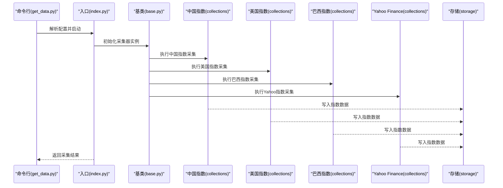
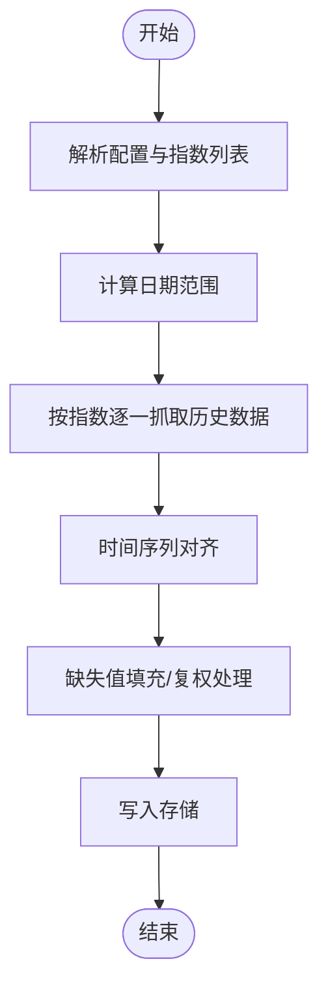
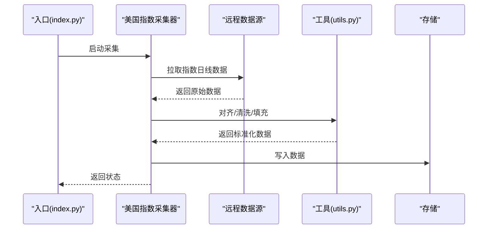
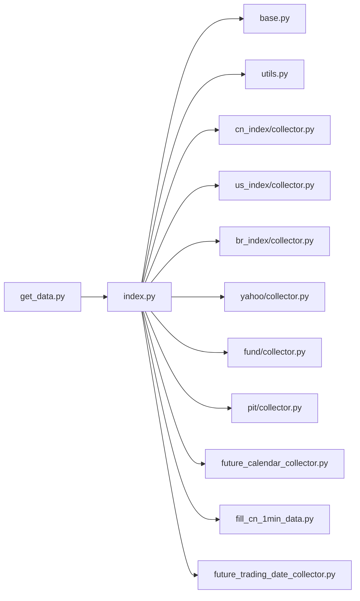

# 股票指数数据收集器

<cite>
**本文引用的文件**
- [scripts/data_collector/index.py](file://scripts/data_collector/index.py)
- [scripts/data_collector/base.py](file://scripts/data_collector/base.py)
- [scripts/data_collector/utils.py](file://scripts/data_collector/utils.py)
- [scripts/data_collector/cn_index/collector.py](file://scripts/data_collector/cn_index/collector.py)
- [scripts/data_collector/us_index/collector.py](file://scripts/data_collector/us_index/collector.py)
- [scripts/data_collector/br_index/collector.py](file://scripts/data_collector/br_index/collector.py)
- [scripts/data_collector/yahoo/collector.py](file://scripts/data_collector/yahoo/collector.py)
- [scripts/data_collector/fund/collector.py](file://scripts/data_collector/fund/collector.py)
- [scripts/data_collector/pit/collector.py](file://scripts/data_collector/pit/collector.py)
- [scripts/data_collector/future_calendar_collector.py](file://scripts/data_collector/future_calendar_collector.py)
- [scripts/data_collector/contrib/fill_cn_1min_data/fill_cn_1min_data.py](file://scripts/data_collector/contrib/fill_cn_1min_data/fill_cn_1min_data.py)
- [scripts/data_collector/contrib/future_trading_date_collector/future_trading_date_collector.py](file://scripts/data_collector/contrib/future_trading_date_collector/future_trading_date_collector.py)
- [scripts/get_data.py](file://scripts/get_data.py)
- [docs/start/getdata.rst](file://docs/start/getdata.rst)
- [examples/benchmarks/LightGBM/workflow_config_lightgbm_multi_freq.yaml](file://examples/benchmarks/LightGBM/workflow_config_lightgbm_multi_freq.yaml)
</cite>

## 目录
1. [简介](#简介)
2. [项目结构](#项目结构)
3. [核心组件](#核心组件)
4. [架构总览](#架构总览)
5. [详细组件分析](#详细组件分析)
6. [依赖关系分析](#依赖关系分析)
7. [性能考量](#性能考量)
8. [故障排查指南](#故障排查指南)
9. [结论](#结论)
10. [附录](#附录)

## 简介
本文件面向Qlib的股票指数数据收集器，系统性梳理中国A股指数、美国股指、巴西股指等不同地区指数的数据采集工具，覆盖配置参数、数据源连接方式、历史数据获取流程、数据格式规范、时间序列对齐与缺失值处理等技术细节，并提供可操作的使用示例与最佳实践建议。读者无需深入代码即可理解如何在不同市场进行指数数据采集与集成。

## 项目结构
Qlib的指数数据采集模块位于scripts/data_collector目录下，采用按市场/主题分目录的组织方式，核心入口为index.py，基础能力由base.py与utils.py提供，各地区指数收集器分别位于独立子目录中（如cn_index、us_index、br_index），另有通用工具与辅助采集器（如fund、pit、future_calendar_collector）以及Yahoo Finance采集器作为补充来源。

```mermaid
graph TB
A["scripts/data_collector/index.py<br/>采集器入口与统一调度"] --> B["scripts/data_collector/base.py<br/>采集基类与通用逻辑"]
A --> C["scripts/data_collector/utils.py<br/>工具函数与公共能力"]
A --> D["scripts/data_collector/cn_index/collector.py<br/>中国A股指数采集器"]
A --> E["scripts/data_collector/us_index/collector.py<br/>美国股指采集器"]
A --> F["scripts/data_collector/br_index/collector.py<br/>巴西股指采集器"]
A --> G["scripts/data_collector/yahoo/collector.py<br/>Yahoo Finance采集器"]
A --> H["scripts/data_collector/fund/collector.py<br/>场内基金采集器"]
A --> I["scripts/data_collector/pit/collector.py<br/>PIT数据采集器"]
A --> J["scripts/data_collector/future_calendar_collector.py<br/>期货交易日历采集器"]
A --> K["scripts/data_collector/contrib/fill_cn_1min_data/fill_cn_1min_data.py<br/>中国1分钟数据补全"]
A --> L["scripts/data_collector/contrib/future_trading_date_collector/future_trading_date_collector.py<br/>期货交易日采集器"]
M["scripts/get_data.py<br/>命令行入口"] --> A
```

图表来源
- [scripts/data_collector/index.py](file://scripts/data_collector/index.py)
- [scripts/data_collector/base.py](file://scripts/data_collector/base.py)
- [scripts/data_collector/utils.py](file://scripts/data_collector/utils.py)
- [scripts/data_collector/cn_index/collector.py](file://scripts/data_collector/cn_index/collector.py)
- [scripts/data_collector/us_index/collector.py](file://scripts/data_collector/us_index/collector.py)
- [scripts/data_collector/br_index/collector.py](file://scripts/data_collector/br_index/collector.py)
- [scripts/data_collector/yahoo/collector.py](file://scripts/data_collector/yahoo/collector.py)
- [scripts/data_collector/fund/collector.py](file://scripts/data_collector/fund/collector.py)
- [scripts/data_collector/pit/collector.py](file://scripts/data_collector/pit/collector.py)
- [scripts/data_collector/future_calendar_collector.py](file://scripts/data_collector/future_calendar_collector.py)
- [scripts/data_collector/contrib/fill_cn_1min_data/fill_cn_1min_data.py](file://scripts/data_collector/contrib/fill_cn_1min_data/fill_cn_1min_data.py)
- [scripts/data_collector/contrib/future_trading_date_collector/future_trading_date_collector.py](file://scripts/data_collector/contrib/future_trading_date_collector/future_trading_date_collector.py)
- [scripts/get_data.py](file://scripts/get_data.py)

章节来源
- [scripts/data_collector/index.py](file://scripts/data_collector/index.py)
- [scripts/data_collector/base.py](file://scripts/data_collector/base.py)
- [scripts/data_collector/utils.py](file://scripts/data_collector/utils.py)
- [scripts/get_data.py](file://scripts/get_data.py)

## 核心组件
- 统一入口与调度：index.py负责解析配置、选择具体采集器并执行采集任务，支持多市场并发或串行策略。
- 采集基类：base.py定义采集器的通用接口、生命周期管理、错误处理与重试机制。
- 工具函数：utils.py提供日期范围生成、时间序列对齐、缺失值处理、缓存与存储路径管理等通用能力。
- 命令行入口：get_data.py提供命令行调用入口，便于在CI/CD或脚本环境中自动化运行。

章节来源
- [scripts/data_collector/index.py](file://scripts/data_collector/index.py)
- [scripts/data_collector/base.py](file://scripts/data_collector/base.py)
- [scripts/data_collector/utils.py](file://scripts/data_collector/utils.py)
- [scripts/get_data.py](file://scripts/get_data.py)

## 架构总览
下图展示了从命令行到具体采集器的调用链路，以及各采集器与数据存储之间的交互：

图表来源
- [scripts/get_data.py](file://scripts/get_data.py)
- [scripts/data_collector/index.py](file://scripts/data_collector/index.py)
- [scripts/data_collector/base.py](file://scripts/data_collector/base.py)
- [scripts/data_collector/cn_index/collector.py](file://scripts/data_collector/cn_index/collector.py)
- [scripts/data_collector/us_index/collector.py](file://scripts/data_collector/us_index/collector.py)
- [scripts/data_collector/br_index/collector.py](file://scripts/data_collector/br_index/collector.py)
- [scripts/data_collector/yahoo/collector.py](file://scripts/data_collector/yahoo/collector.py)

## 详细组件分析

### 中国A股指数采集器（cn_index）
- 数据源与范围：面向中国A股主要指数，支持指定起止日期的历史回填；通过本地或第三方数据源获取日线级别数据。
- 配置参数要点：
  - 指数列表：支持传入指数代码集合（如上证综指、深证成指、创业板指等）。
  - 日期范围：开始/结束日期，支持单次或多次批量回测。
  - 存储路径：输出目录与命名规则，确保与Qlib数据层兼容。
- 处理流程：
  - 参数校验与索引构建
  - 逐个指数拉取历史行情
  - 时间序列对齐与缺失值填充
  - 写入标准化存储
- 特殊考虑：
  - 节假日与停牌日的处理策略
  - 指数成分变更时的复权与调整
  - 与Qlib内置指数库的映射关系

图表来源
- [scripts/data_collector/cn_index/collector.py](file://scripts/data_collector/cn_index/collector.py)
- [scripts/data_collector/utils.py](file://scripts/data_collector/utils.py)

章节来源
- [scripts/data_collector/cn_index/collector.py](file://scripts/data_collector/cn_index/collector.py)
- [scripts/data_collector/utils.py](file://scripts/data_collector/utils.py)

### 美国股指采集器（us_index）
- 数据源与范围：面向美国主要股指（如标普500、道琼斯工业平均、纳斯达克综合指数等），支持日线级别历史数据回填。
- 配置参数要点：
  - 指数标识符：支持标准Ticker或自定义指数代码。
  - 日期范围：起止日期与回测粒度控制。
  - 输出格式：与Qlib数据层一致的时间序列格式。
- 处理流程：
  - 指数清单校验
  - 远程数据拉取与缓存
  - 对齐与清洗
  - 存储落盘

图表来源
- [scripts/data_collector/us_index/collector.py](file://scripts/data_collector/us_index/collector.py)
- [scripts/data_collector/utils.py](file://scripts/data_collector/utils.py)

章节来源
- [scripts/data_collector/us_index/collector.py](file://scripts/data_collector/us_index/collector.py)
- [scripts/data_collector/utils.py](file://scripts/data_collector/utils.py)

### 巴西股指采集器（br_index）
- 数据源与范围：面向巴西主要股指（如IBOVESPA、IPCA等），支持日线级别历史数据回填。
- 配置参数要点：
  - 指数代码集合与命名规范
  - 日期范围与回测粒度
  - 存储路径与文件命名
- 处理流程：
  - 指数清单与日期范围验证
  - 数据抓取与清洗
  - 时间序列对齐与缺失值处理
  - 标准化存储

章节来源
- [scripts/data_collector/br_index/collector.py](file://scripts/data_collector/br_index/collector.py)
- [scripts/data_collector/utils.py](file://scripts/data_collector/utils.py)

### Yahoo Finance采集器（yahoo）
- 数据源与范围：基于Yahoo Finance公开接口，支持全球主要股指与宽基ETF的日线数据。
- 配置参数要点：
  - 指数/ETF代码集合
  - 日期范围与频率
  - 并发与重试策略
- 处理流程：
  - 代码清单校验
  - 并发抓取与缓存
  - 对齐与清洗
  - 存储

章节来源
- [scripts/data_collector/yahoo/collector.py](file://scripts/data_collector/yahoo/collector.py)
- [scripts/data_collector/utils.py](file://scripts/data_collector/utils.py)

### 场内基金采集器（fund）
- 数据源与范围：针对场内交易基金（ETF/FOF等）的日线数据，适配多市场指数ETF。
- 配置参数要点：
  - 基金代码集合
  - 日期范围与频率
  - 输出格式与命名
- 处理流程：
  - 代码校验与去重
  - 数据抓取与清洗
  - 对齐与存储

章节来源
- [scripts/data_collector/fund/collector.py](file://scripts/data_collector/fund/collector.py)
- [scripts/data_collector/utils.py](file://scripts/data_collector/utils.py)

### PIT数据采集器（pit）
- 数据源与范围：面向PIT（Price Information Terminal）数据的采集与转换，支持指数与成分股层面的数据。
- 配置参数要点：
  - 数据类型与字段映射
  - 日期范围与粒度
  - 输出格式与字段清洗
- 处理流程：
  - 字段映射与清洗
  - 时间序列对齐
  - 存储

章节来源
- [scripts/data_collector/pit/collector.py](file://scripts/data_collector/pit/collector.py)
- [scripts/data_collector/utils.py](file://scripts/data_collector/utils.py)

### 期货交易日历采集器（future_calendar_collector）
- 功能：采集期货市场的交易日历，用于指数与衍生品数据的日期对齐。
- 配置参数要点：
  - 交易所代码与品种
  - 日期范围
  - 日历输出格式
- 处理流程：
  - 交易所日历抓取
  - 合并与去重
  - 存储

章节来源
- [scripts/data_collector/future_calendar_collector.py](file://scripts/data_collector/future_calendar_collector.py)

### 中国1分钟数据补全（contrib/fill_cn_1min_data）
- 功能：针对中国A股分钟级数据的补全与修复，保证高频指数数据的连续性。
- 配置参数要点：
  - 补全策略（向前/向后填充、插值等）
  - 交易时段与节假日过滤
  - 输出粒度与存储路径
- 处理流程：
  - 分钟级数据读取
  - 缺失片段识别与补全
  - 存储

章节来源
- [scripts/data_collector/contrib/fill_cn_1min_data/fill_cn_1min_data.py](file://scripts/data_collector/contrib/fill_cn_1min_data/fill_cn_1min_data.py)

### 期货交易日采集器（contrib/future_trading_date_collector）
- 功能：采集特定期货品种的交易日，辅助指数与衍生品数据的日期对齐。
- 配置参数要点：
  - 品种列表与交易所
  - 日期范围
  - 输出格式
- 处理流程：
  - 交易日抓取
  - 合并与存储

章节来源
- [scripts/data_collector/contrib/future_trading_date_collector/future_trading_date_collector.py](file://scripts/data_collector/contrib/future_trading_date_collector/future_trading_date_collector.py)

## 依赖关系分析
- 入口依赖：index.py依赖base.py提供的采集器基类与utils.py中的通用工具函数。
- 市场采集器：各地区采集器（cn_index、us_index、br_index、yahoo、fund、pit）均遵循统一的基类接口，具备相似的生命周期与错误处理模式。
- 存储与缓存：采集器通过utils.py中的工具函数完成时间序列对齐、缺失值处理与存储路径管理，确保输出格式与Qlib数据层兼容。
- 命令行入口：get_data.py作为统一入口，负责解析用户配置并调用index.py执行采集任务。

图表来源
- [scripts/data_collector/index.py](file://scripts/data_collector/index.py)
- [scripts/data_collector/base.py](file://scripts/data_collector/base.py)
- [scripts/data_collector/utils.py](file://scripts/data_collector/utils.py)
- [scripts/data_collector/cn_index/collector.py](file://scripts/data_collector/cn_index/collector.py)
- [scripts/data_collector/us_index/collector.py](file://scripts/data_collector/us_index/collector.py)
- [scripts/data_collector/br_index/collector.py](file://scripts/data_collector/br_index/collector.py)
- [scripts/data_collector/yahoo/collector.py](file://scripts/data_collector/yahoo/collector.py)
- [scripts/data_collector/fund/collector.py](file://scripts/data_collector/fund/collector.py)
- [scripts/data_collector/pit/collector.py](file://scripts/data_collector/pit/collector.py)
- [scripts/data_collector/future_calendar_collector.py](file://scripts/data_collector/future_calendar_collector.py)
- [scripts/data_collector/contrib/fill_cn_1min_data/fill_cn_1min_data.py](file://scripts/data_collector/contrib/fill_cn_1min_data/fill_cn_1min_data.py)
- [scripts/data_collector/contrib/future_trading_date_collector/future_trading_date_collector.py](file://scripts/data_collector/contrib/future_trading_date_collector/future_trading_date_collector.py)
- [scripts/get_data.py](file://scripts/get_data.py)

章节来源
- [scripts/data_collector/index.py](file://scripts/data_collector/index.py)
- [scripts/data_collector/base.py](file://scripts/data_collector/base.py)
- [scripts/data_collector/utils.py](file://scripts/data_collector/utils.py)
- [scripts/get_data.py](file://scripts/get_data.py)

## 性能考量
- 并发与限速：在访问远程数据源时，应合理设置并发度与请求间隔，避免触发限流或被封禁。
- 缓存策略：利用utils.py中的缓存与增量更新机制，减少重复抓取与网络开销。
- 存储优化：按日期分区与压缩存储，提升读写效率；对齐与缺失值处理尽量批量化，降低I/O压力。
- 错误恢复：在采集过程中加入断点续采与失败重试，保障大规模回测数据的完整性。

## 故障排查指南
- 网络异常与超时：
  - 检查代理与DNS配置，必要时启用本地缓存。
  - 在采集器中增加重试次数与退避策略。
- 数据不一致与缺失：
  - 使用utils.py中的对齐与填充工具，核对日期范围与交易日历。
  - 对比多个数据源，确认缺失值是否为数据源问题。
- 权息与复权：
  - 确认指数成分变更与分红派息的复权处理策略，避免基准漂移。
- 存储路径与权限：
  - 确保输出目录存在且具备写权限；检查磁盘空间与文件句柄限制。

章节来源
- [scripts/data_collector/utils.py](file://scripts/data_collector/utils.py)
- [scripts/data_collector/base.py](file://scripts/data_collector/base.py)

## 结论
Qlib的指数数据收集器通过统一入口与基类抽象，实现了多市场、多数据源的指数数据采集与标准化输出。结合utils.py提供的对齐、填充与存储工具，用户可以高效地在不同市场（中国A股、美国、巴西等）构建高质量的指数数据集，支撑后续研究与建模工作。建议在生产环境中配合缓存、并发与重试策略，确保稳定性与性能。

## 附录

### 使用示例与最佳实践
- 命令行使用：
  - 通过命令行入口启动采集，传入目标市场与日期范围，参考入口脚本的参数说明。
- 配置文件示例：
  - 可参考示例工作流中的多频数据配置，了解如何在更高层整合指数数据。
- 数据格式规范：
  - 统一采用时间序列格式，包含日期、开盘价、最高价、最低价、收盘价、成交量等字段；缺失值需明确填充策略。
- 时间序列对齐：
  - 以交易日历为准进行对齐，剔除非交易日；对缺失区间采用前向/后向填充或插值。
- 最佳实践：
  - 优先使用官方或权威数据源，辅以备用源进行交叉验证；
  - 在回测前进行数据质量检查，关注复权与成分变更；
  - 将采集过程纳入CI/CD，定期更新指数数据，保持时效性。

章节来源
- [scripts/get_data.py](file://scripts/get_data.py)
- [examples/benchmarks/LightGBM/workflow_config_lightgbm_multi_freq.yaml](file://examples/benchmarks/LightGBM/workflow_config_lightgbm_multi_freq.yaml)
- [docs/start/getdata.rst](file://docs/start/getdata.rst)