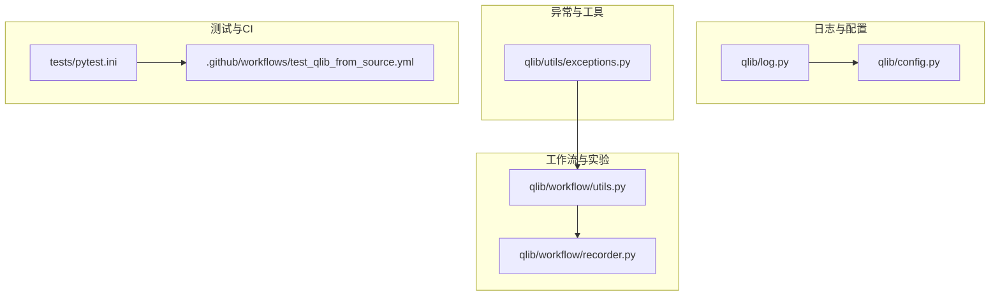
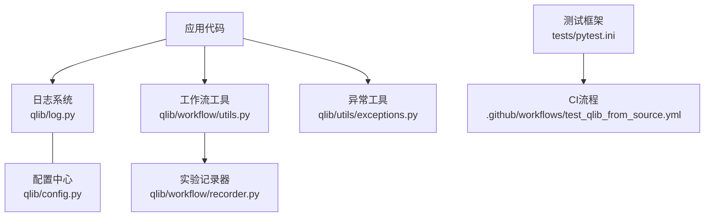
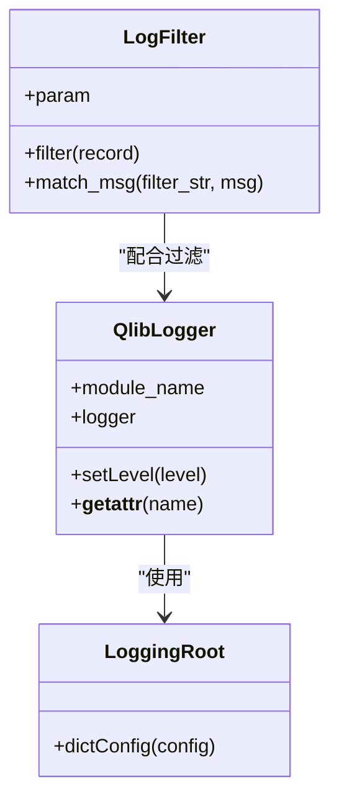
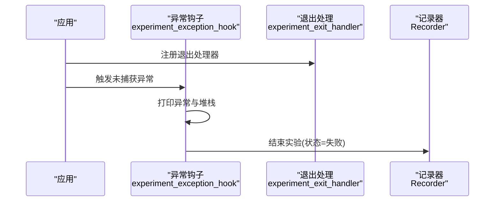
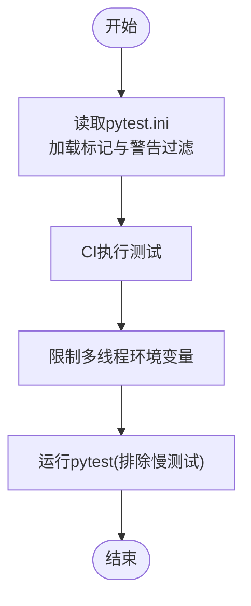
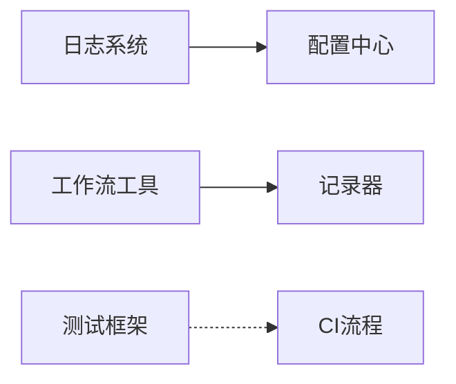
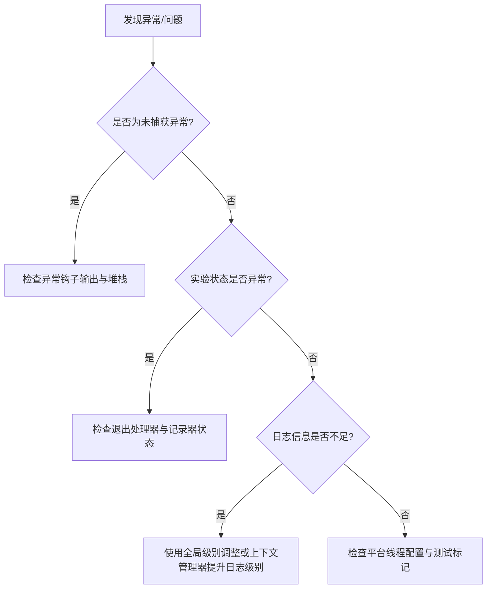

# 调试与监控工具

<cite>
**本文引用的文件**
- [qlib/log.py](file://qlib/log.py)
- [qlib/workflow/utils.py](file://qlib/workflow/utils.py)
- [tests/pytest.ini](file://tests/pytest.ini)
- [.github/workflows/test_qlib_from_source.yml](file://.github/workflows/test_qlib_from_source.yml)
- [qlib/utils/exceptions.py](file://qlib/utils/exceptions.py)
- [qlib/workflow/recorder.py](file://qlib/workflow/recorder.py)
- [qlib/config.py](file://qlib/config.py)
</cite>

## 目录
1. [简介](#简介)
2. [项目结构](#项目结构)
3. [核心组件](#核心组件)
4. [架构总览](#架构总览)
5. [详细组件分析](#详细组件分析)
6. [依赖关系分析](#依赖关系分析)
7. [性能考量](#性能考量)
8. [故障排查指南](#故障排查指南)
9. [结论](#结论)
10. [附录](#附录)

## 简介
本文件面向Qlib的调试与监控工具，系统性介绍以下能力：
- 日志系统：日志级别配置、日志格式定制、日志输出管理、全局日志级别控制与上下文管理
- 异常处理工具：未捕获异常钩子、实验状态收尾、调试信息打印与记录
- 测试工具：单元测试、集成测试、性能测试（含标记与过滤）、CI测试流程
- 调试技巧与故障诊断：常见问题定位、日志与异常联动、实验状态追踪
- 监控指标与告警最佳实践：基于实验记录器的状态与状态码

## 项目结构
围绕调试与监控的关键模块分布如下：
- 日志与配置：qlib/log.py、qlib/config.py
- 工作流与实验收尾：qlib/workflow/utils.py、qlib/workflow/recorder.py
- 异常与工具：qlib/utils/exceptions.py
- 测试与CI：tests/pytest.ini、.github/workflows/test_qlib_from_source.yml

**图表来源**
- [qlib/log.py:1-262](file://qlib/log.py#L1-L262)
- [qlib/config.py:1-200](file://qlib/config.py#L1-L200)
- [qlib/workflow/utils.py:1-47](file://qlib/workflow/utils.py#L1-L47)
- [qlib/workflow/recorder.py:1-200](file://qlib/workflow/recorder.py#L1-L200)
- [qlib/utils/exceptions.py:1-200](file://qlib/utils/exceptions.py#L1-L200)
- [tests/pytest.ini:1-6](file://tests/pytest.ini#L1-L6)
- [.github/workflows/test_qlib_from_source.yml:111-135](file://.github/workflows/test_qlib_from_source.yml#L111-L135)

**章节来源**
- [qlib/log.py:1-262](file://qlib/log.py#L1-L262)
- [qlib/workflow/utils.py:1-47](file://qlib/workflow/utils.py#L1-L47)
- [tests/pytest.ini:1-6](file://tests/pytest.ini#L1-L6)
- [.github/workflows/test_qlib_from_source.yml:111-135](file://.github/workflows/test_qlib_from_source.yml#L111-L135)

## 核心组件
- 自定义日志器与日志过滤：提供模块化日志器、日志级别设置、正则过滤、全局处理器级别调整与上下文管理
- 实验异常钩子与收尾：在异常或退出时自动结束实验并记录状态
- 测试标记与CI流程：通过pytest标记区分慢测试，CI中按平台执行测试并限制线程数避免冲突
- 异常工具：提供异常相关工具与辅助方法，便于统一处理与扩展

**章节来源**
- [qlib/log.py:15-262](file://qlib/log.py#L15-L262)
- [qlib/workflow/utils.py:16-47](file://qlib/workflow/utils.py#L16-L47)
- [tests/pytest.ini:1-6](file://tests/pytest.ini#L1-6)
- [.github/workflows/test_qlib_from_source.yml:111-135](file://.github/workflows/test_qlib_from_source.yml#L111-L135)
- [qlib/utils/exceptions.py:1-200](file://qlib/utils/exceptions.py#L1-L200)

## 架构总览
下图展示调试与监控工具在Qlib中的交互关系：日志系统贯穿各模块；工作流在异常时通过钩子与记录器收尾；测试框架与CI流程保障质量。

**图表来源**
- [qlib/log.py:15-262](file://qlib/log.py#L15-L262)
- [qlib/workflow/utils.py:16-47](file://qlib/workflow/utils.py#L16-L47)
- [qlib/workflow/recorder.py:1-200](file://qlib/workflow/recorder.py#L1-L200)
- [qlib/utils/exceptions.py:1-200](file://qlib/utils/exceptions.py#L1-L200)
- [tests/pytest.ini:1-6](file://tests/pytest.ini#L1-L6)
- [.github/workflows/test_qlib_from_source.yml:111-135](file://.github/workflows/test_qlib_from_source.yml#L111-L135)
- [qlib/config.py:1-200](file://qlib/config.py#L1-L200)

## 详细组件分析

### 日志系统
- 模块化日志器：通过元类继承标准Logger，确保接口一致性与可扩展性
- 日志级别与过滤：支持按模块设置级别、全局处理器级别调整、基于正则的消息过滤
- 全局级别控制：提供一次性设置与上下文管理两种方式，便于临时提升/降低日志级别
- 配置集成：可通过字典配置初始化日志系统，结合配置中心实现灵活部署

**图表来源**
- [qlib/log.py:24-183](file://qlib/log.py#L24-L183)
- [qlib/log.py:152-183](file://qlib/log.py#L152-L183)

**章节来源**
- [qlib/log.py:15-183](file://qlib/log.py#L15-L183)
- [qlib/log.py:185-262](file://qlib/log.py#L185-L262)

### 异常处理与实验收尾
- 异常钩子：捕获未处理异常，打印堆栈与异常信息，并将实验状态标记为失败
- 退出处理：注册atexit处理器，在程序异常结束时确保实验被正确收尾
- 记录器状态：通过记录器状态码控制实验最终状态（如完成、失败）

**图表来源**
- [qlib/workflow/utils.py:16-47](file://qlib/workflow/utils.py#L16-L47)
- [qlib/workflow/recorder.py:1-200](file://qlib/workflow/recorder.py#L1-L200)

**章节来源**
- [qlib/workflow/utils.py:16-47](file://qlib/workflow/utils.py#L16-L47)
- [qlib/workflow/recorder.py:1-200](file://qlib/workflow/recorder.py#L1-L200)

### 测试工具与CI
- 测试标记：通过pytest.ini定义标记（如slow），便于选择性运行
- 过滤警告：忽略特定警告以减少噪音
- CI执行：按平台执行pytest，限制多线程库的并发线程数，避免macOS下的多线程冲突

**图表来源**
- [tests/pytest.ini:1-6](file://tests/pytest.ini#L1-L6)
- [.github/workflows/test_qlib_from_source.yml:111-135](file://.github/workflows/test_qlib_from_source.yml#L111-L135)

**章节来源**
- [tests/pytest.ini:1-6](file://tests/pytest.ini#L1-L6)
- [.github/workflows/test_qlib_from_source.yml:111-135](file://.github/workflows/test_qlib_from_source.yml#L111-L135)

### 异常工具
- 异常工具模块：提供异常相关工具与辅助方法，便于统一处理与扩展
- 建议用法：在业务层捕获并转换异常，结合日志与记录器进行上报与归档

**章节来源**
- [qlib/utils/exceptions.py:1-200](file://qlib/utils/exceptions.py#L1-L200)

## 依赖关系分析
- 日志系统依赖配置中心，用于加载日志字典配置
- 工作流工具依赖记录器，用于在异常或退出时更新实验状态
- 测试框架与CI流程相互独立，但共同保障测试稳定性与可重复性

**图表来源**
- [qlib/log.py:152-183](file://qlib/log.py#L152-L183)
- [qlib/config.py:1-200](file://qlib/config.py#L1-L200)
- [qlib/workflow/utils.py:16-47](file://qlib/workflow/utils.py#L16-L47)
- [qlib/workflow/recorder.py:1-200](file://qlib/workflow/recorder.py#L1-L200)
- [tests/pytest.ini:1-6](file://tests/pytest.ini#L1-L6)
- [.github/workflows/test_qlib_from_source.yml:111-135](file://.github/workflows/test_qlib_from_source.yml#L111-L135)

**章节来源**
- [qlib/log.py:152-183](file://qlib/log.py#L152-L183)
- [qlib/workflow/utils.py:16-47](file://qlib/workflow/utils.py#L16-L47)
- [tests/pytest.ini:1-6](file://tests/pytest.ini#L1-L6)
- [.github/workflows/test_qlib_from_source.yml:111-135](file://.github/workflows/test_qlib_from_source.yml#L111-L135)

## 性能考量
- 多线程限制：CI中对OpenMP、MKL、NumExpr、OpenBLAS、vecLib等线程数进行限制，避免macOS环境下的多线程冲突导致段错误
- 测试选择：通过标记排除慢测试，缩短本地与CI的测试时间
- 日志级别：在高负载场景下适当提高日志级别，减少IO开销

**章节来源**
- [.github/workflows/test_qlib_from_source.yml:111-135](file://.github/workflows/test_qlib_from_source.yml#L111-L135)
- [tests/pytest.ini:1-6](file://tests/pytest.ini#L1-L6)
- [qlib/log.py:185-262](file://qlib/log.py#L185-L262)

## 故障排查指南
- 未捕获异常：启用异常钩子后，异常会被打印并记录为失败状态，检查日志与堆栈定位问题
- 实验状态异常：若实验未正常结束，确认是否触发了退出处理器，检查记录器状态码
- 日志级别过低：当需要更详细信息时，使用全局级别调整或上下文管理器临时提升日志级别
- 平台差异：在macOS上遇到多线程冲突，参考CI流程中的线程限制策略

**图表来源**
- [qlib/workflow/utils.py:31-47](file://qlib/workflow/utils.py#L31-L47)
- [qlib/workflow/recorder.py:1-200](file://qlib/workflow/recorder.py#L1-L200)
- [qlib/log.py:185-262](file://qlib/log.py#L185-L262)
- [.github/workflows/test_qlib_from_source.yml:111-135](file://.github/workflows/test_qlib_from_source.yml#L111-L135)

**章节来源**
- [qlib/workflow/utils.py:31-47](file://qlib/workflow/utils.py#L31-L47)
- [qlib/workflow/recorder.py:1-200](file://qlib/workflow/recorder.py#L1-L200)
- [qlib/log.py:185-262](file://qlib/log.py#L185-L262)
- [.github/workflows/test_qlib_from_source.yml:111-135](file://.github/workflows/test_qlib_from_source.yml#L111-L135)

## 结论
Qlib的调试与监控工具通过“日志+异常钩子+记录器+测试与CI”的组合，提供了从开发到生产的全链路可观测性与可维护性。建议在日常开发中：
- 合理设置日志级别与过滤规则，聚焦关键信息
- 在异常场景下依赖钩子与记录器自动收尾
- 使用测试标记与CI限制策略保证稳定性
- 在平台差异环境下遵循线程限制建议

## 附录
- 日志级别与过滤：参考日志模块的级别设置与过滤器实现
- 实验状态码：参考记录器的状态定义与使用
- 测试标记：参考pytest.ini中的标记与警告过滤配置

**章节来源**
- [qlib/log.py:15-183](file://qlib/log.py#L15-L183)
- [qlib/workflow/recorder.py:1-200](file://qlib/workflow/recorder.py#L1-L200)
- [tests/pytest.ini:1-6](file://tests/pytest.ini#L1-L6)