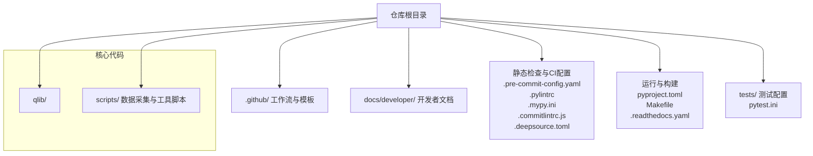
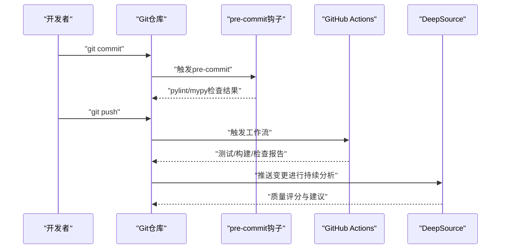
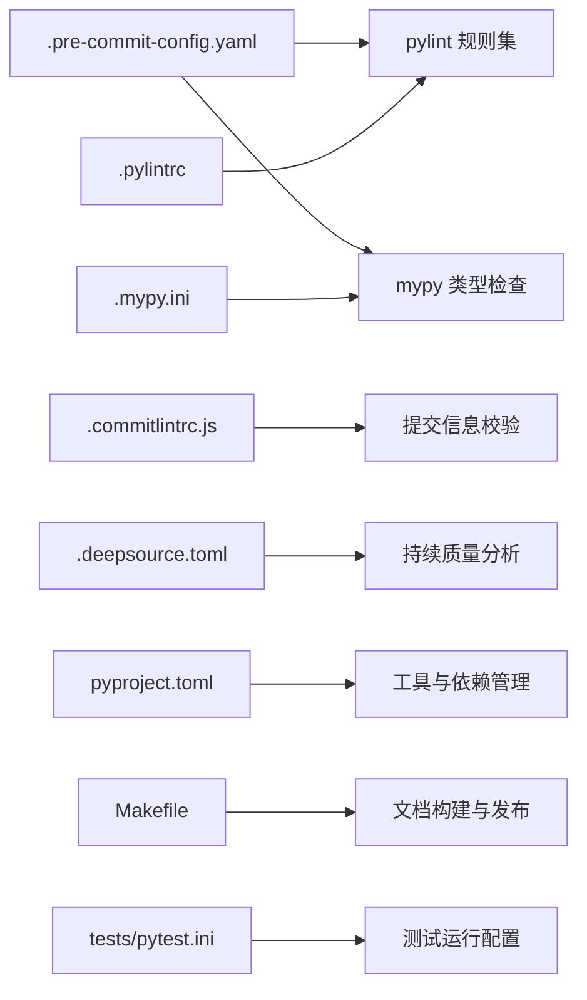

# 代码规范与开发指南

<cite>
**本文档引用的文件**
- [CODE_OF_CONDUCT.md](file://CODE_OF_CONDUCT.md)
- [SECURITY.md](file://SECURITY.md)
- [README.md](file://README.md)
- [.pre-commit-config.yaml](file://.pre-commit-config.yaml)
- [.pylintrc](file://.pylintrc)
- [.mypy.ini](file://.mypy.ini)
- [.commitlintrc.js](file://.commitlintrc.js)
- [.deepsource.toml](file://.deepsource.toml)
- [.readthedocs.yaml](file://.readthedocs.yaml)
- [pyproject.toml](file://pyproject.toml)
- [Makefile](file://Makefile)
- [docs/developer/code_standard_and_dev_guide.rst](file://docs/developer/code_standard_and_dev_guide.rst)
- [.github/workflows](file://.github/workflows)
- [.github/PULL_REQUEST_TEMPLATE.md](file://.github/PULL_REQUEST_TEMPLATE.md)
- [tests/pytest.ini](file://tests/pytest.ini)
</cite>

## 目录
1. [简介](#简介)
2. [项目结构](#项目结构)
3. [核心组件](#核心组件)
4. [架构总览](#架构总览)
5. [详细组件分析](#详细组件分析)
6. [依赖关系分析](#依赖关系分析)
7. [性能考虑](#性能考虑)
8. [故障排查指南](#故障排查指南)
9. [结论](#结论)
10. [附录](#附录)

## 简介
本指南面向Qlib项目的贡献者与维护者，系统化阐述代码规范、提交规范、代码审查流程以及静态检查工具配置，帮助团队统一开发质量标准，提升协作效率与代码可维护性。

## 项目结构
Qlib采用模块化分层组织，核心代码位于qlib/目录，测试位于tests/，开发者文档位于docs/developer/，CI/CD与工具配置位于仓库根目录及.github/。关键规范文件集中在根目录，用于约束提交、静态检查与持续集成。

图示来源
- [README.md](file://README.md)
- [.pre-commit-config.yaml](file://.pre-commit-config.yaml)
- [.pylintrc](file://.pylintrc)
- [.mypy.ini](file://.mypy.ini)
- [.commitlintrc.js](file://.commitlintrc.js)
- [.deepsource.toml](file://.deepsource.toml)
- [.readthedocs.yaml](file://.readthedocs.yaml)
- [pyproject.toml](file://pyproject.toml)
- [Makefile](file://Makefile)
- [tests/pytest.ini](file://tests/pytest.ini)

章节来源
- [README.md](file://README.md)
- [.pre-commit-config.yaml](file://.pre-commit-config.yaml)
- [.pylintrc](file://.pylintrc)
- [.mypy.ini](file://.mypy.ini)
- [.commitlintrc.js](file://.commitlintrc.js)
- [.deepsource.toml](file://.deepsource.toml)
- [.readthedocs.yaml](file://.readthedocs.yaml)
- [pyproject.toml](file://pyproject.toml)
- [Makefile](file://Makefile)
- [tests/pytest.ini](file://tests/pytest.ini)

## 核心组件
- 提交规范与Git工作流：通过commitlint约束提交信息格式，结合GitHub Actions实现自动化校验与PR模板。
- 静态检查与类型检查：pre-commit钩子在本地触发pylint与mypy；DeepSource提供持续分析；pyproject.toml集中管理工具配置。
- 文档与构建：Read the Docs配置与Makefile提供文档构建与发布支持。
- 测试：pytest.ini集中配置测试运行参数，确保一致性。

章节来源
- [.commitlintrc.js](file://.commitlintrc.js)
- [.github/workflows](file://.github/workflows)
- [.github/PULL_REQUEST_TEMPLATE.md](file://.github/PULL_REQUEST_TEMPLATE.md)
- [.pre-commit-config.yaml](file://.pre-commit-config.yaml)
- [.pylintrc](file://.pylintrc)
- [.mypy.ini](file://.mypy.ini)
- [.deepsource.toml](file://.deepsource.toml)
- [.readthedocs.yaml](file://.readthedocs.yaml)
- [pyproject.toml](file://pyproject.toml)
- [tests/pytest.ini](file://tests/pytest.ini)

## 架构总览
下图展示从开发者提交到CI验证的关键路径，体现本地静态检查与远程CI/CD的协同。

图示来源
- [.pre-commit-config.yaml](file://.pre-commit-config.yaml)
- [.pylintrc](file://.pylintrc)
- [.mypy.ini](file://.mypy.ini)
- [.github/workflows](file://.github/workflows)
- [.deepsource.toml](file://.deepsource.toml)

## 详细组件分析

### Python代码风格与命名规范
- 风格与格式：遵循统一的导入顺序、缩进与行宽限制；函数/类/模块命名清晰且语义明确；避免魔法数字与字符串，优先使用常量或枚举。
- 注释与文档字符串：为公共接口提供完整文档字符串；复杂逻辑添加必要注释；TODO/FIXME需明确责任人与截止日期。
- 错误处理：使用异常而非返回错误码；捕获具体异常类型；记录上下文信息以便定位问题。
- 性能与可读性：优先选择高效但易读的实现；避免过深嵌套；合理拆分长函数；减少全局状态。

章节来源
- [docs/developer/code_standard_and_dev_guide.rst](file://docs/developer/code_standard_and_dev_guide.rst)

### 提交规范与Git工作流程
- 提交信息格式：使用约定式提交（如feat/fix/docs/chore），首行简洁描述，必要时在正文说明动机与影响。
- 分支管理：主分支受保护，功能开发在特性分支完成；修复紧急问题使用hotfix分支；版本发布使用release分支。
- 合并与清理：合并前需通过CI与审查；合并后及时删除已合并分支以保持整洁。
- PR模板：PR需包含变更摘要、影响范围、测试方法与风险评估，便于审查与回溯。

章节来源
- [.commitlintrc.js](file://.commitlintrc.js)
- [.github/PULL_REQUEST_TEMPLATE.md](file://.github/PULL_REQUEST_TEMPLATE.md)

### 代码审查流程与标准
- PR规范：标题与描述清晰；变更粒度适中；新增功能配套单元测试；修改需覆盖边界与异常路径。
- 审查清单：是否满足需求与设计；代码风格与命名是否一致；是否存在重复逻辑；性能与内存占用是否合理；安全与权限是否合规。
- 反馈处理：对审查意见逐条响应；必要时提供解释或补充测试；修改后重新请求审查直至通过。

章节来源
- [.github/PULL_REQUEST_TEMPLATE.md](file://.github/PULL_REQUEST_TEMPLATE.md)

### 静态检查工具配置
- pre-commit钩子：在提交前自动执行pylint与mypy，确保基础质量门槛；可配置跳过规则与特定文件排除。
- pylint规则：统一规则集，禁止使用不安全的内置函数；强制类型注解与未使用变量检查；控制行宽与最大复杂度。
- mypy类型检查：启用严格模式，确保类型推断与注解一致性；定期更新类型提示以匹配重构。
- DeepSource：持续分析代码质量，提供覆盖率、复杂度与潜在缺陷建议；与CI联动输出报告。

章节来源
- [.pre-commit-config.yaml](file://.pre-commit-config.yaml)
- [.pylintrc](file://.pylintrc)
- [.mypy.ini](file://.mypy.ini)
- [.deepsource.toml](file://.deepsource.toml)

### 文档与构建
- 文档构建：.readthedocs.yaml定义构建环境与依赖；Makefile提供文档生成与预览命令；确保API与教程文档同步更新。
- 版本与发布：变更日志按模块维护；发布前核对兼容性与迁移说明；使用标签标记正式版本。

章节来源
- [.readthedocs.yaml](file://.readthedocs.yaml)
- [Makefile](file://Makefile)

### 测试与质量门禁
- 测试框架：pytest.ini集中配置测试发现、覆盖率与并发策略；为每个模块提供最小可运行用例。
- 质量门禁：CI中集成测试、静态检查与覆盖率阈值；失败即阻塞合并；关键模块需达到指定覆盖率。

章节来源
- [tests/pytest.ini](file://tests/pytest.ini)

## 依赖关系分析
下图展示规范相关工具之间的依赖与交互关系。

图示来源
- [.pre-commit-config.yaml](file://.pre-commit-config.yaml)
- [.pylintrc](file://.pylintrc)
- [.mypy.ini](file://.mypy.ini)
- [.commitlintrc.js](file://.commitlintrc.js)
- [.deepsource.toml](file://.deepsource.toml)
- [pyproject.toml](file://pyproject.toml)
- [Makefile](file://Makefile)
- [tests/pytest.ini](file://tests/pytest.ini)

章节来源
- [.pre-commit-config.yaml](file://.pre-commit-config.yaml)
- [.pylintrc](file://.pylintrc)
- [.mypy.ini](file://.mypy.ini)
- [.commitlintrc.js](file://.commitlintrc.js)
- [.deepsource.toml](file://.deepsource.toml)
- [pyproject.toml](file://pyproject.toml)
- [Makefile](file://Makefile)
- [tests/pytest.ini](file://tests/pytest.ini)

## 性能考虑
- 静态检查性能：在大型仓库中，合理配置pre-commit的文件过滤器与并发度；将昂贵检查（如mypy）限制在变更文件上。
- CI并行化：将测试与检查任务拆分为多个并行作业，缩短整体流水线时间。
- 文档构建：缓存依赖与中间产物，避免重复安装；仅在需要时重建API参考。

## 故障排查指南
- 提交被拒绝：检查提交信息是否符合约定式提交格式；确认pre-commit未报pylint/mypy错误；必要时在本地先运行对应检查工具定位问题。
- CI失败：查看工作流日志中的测试与检查输出；根据失败点补充用例或修复类型注解；关注覆盖率阈值与平台差异。
- 类型检查报错：对照mypy配置修正缺失注解或不兼容类型；逐步缩小问题范围至具体函数或模块。
- 文档构建失败：核对.readthedocs.yaml与Makefile中的依赖版本；清理缓存后重试；检查API文档自动生成脚本。

章节来源
- [.commitlintrc.js](file://.commitlintrc.js)
- [.pre-commit-config.yaml](file://.pre-commit-config.yaml)
- [.mypy.ini](file://.mypy.ini)
- [.github/workflows](file://.github/workflows)
- [.readthedocs.yaml](file://.readthedocs.yaml)
- [Makefile](file://Makefile)

## 结论
通过统一的代码规范、严格的提交与审查流程以及完善的静态检查与CI配置，Qlib能够持续产出高质量、可维护的金融量化代码。建议所有贡献者在提交前先在本地运行pre-commit与测试，确保变更满足质量门禁后再发起PR。

## 附录
- 行为准则与安全策略：请遵守项目行为准则与安全披露流程，维护社区健康与项目安全。
  
章节来源
- [CODE_OF_CONDUCT.md](file://CODE_OF_CONDUCT.md)
- [SECURITY.md](file://SECURITY.md)