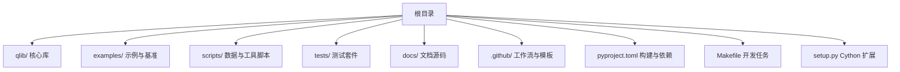
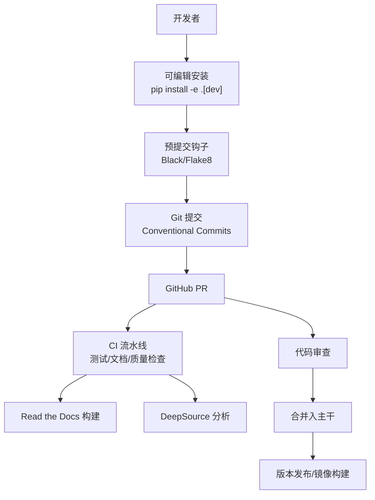
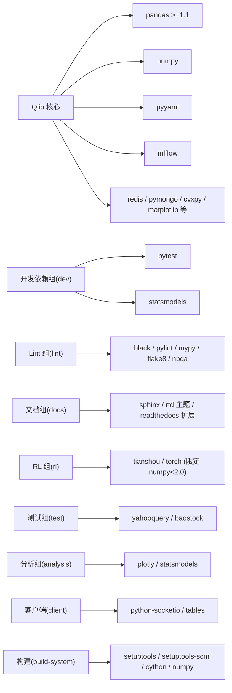

# 开发者指南

<cite>
**本文引用的文件**
- [.github/PULL_REQUEST_TEMPLATE.md](file://.github/PULL_REQUEST_TEMPLATE.md)
- [CODE_OF_CONDUCT.md](file://CODE_OF_CONDUCT.md)
- [SECURITY.md](file://SECURITY.md)
- [docs/developer/code_standard_and_dev_guide.rst](file://docs/developer/code_standard_and_dev_guide.rst)
- [docs/developer/how_to_build_image.rst](file://docs/developer/how_to_build_image.rst)
- [.readthedocs.yaml](file://.readthedocs.yaml)
- [.deepsource.toml](file://.deepsource.toml)
- [.mypy.ini](file://.mypy.ini)
- [setup.py](file://setup.py)
- [pyproject.toml](file://pyproject.toml)
- [.pre-commit-config.yaml](file://.pre-commit-config.yaml)
- [.commitlintrc.js](file://.commitlintrc.js)
- [Makefile](file://Makefile)
- [scripts/README.md](file://scripts/README.md)
- [tests/conftest.py](file://tests/conftest.py)
- [tests/pytest.ini](file://tests/pytest.ini)
</cite>

## 目录
1. [简介](#简介)
2. [项目结构](#项目结构)
3. [核心组件](#核心组件)
4. [架构总览](#架构总览)
5. [详细组件分析](#详细组件分析)
6. [依赖关系分析](#依赖关系分析)
7. [性能考量](#性能考量)
8. [故障排查指南](#故障排查指南)
9. [结论](#结论)
10. [附录](#附录)

## 简介
本指南面向希望为 Qlib 贡献代码与改进的开发者，系统性地阐述代码贡献规范（编码标准、提交规范、代码审查流程）、测试策略与最佳实践（单元测试、集成测试、性能测试）、架构设计原则与扩展开发指南（插件开发、组件扩展、API 设计）、开发环境搭建与调试方法（IDE 配置、调试技巧、性能分析），以及社区参与与安全合规要求。内容均基于仓库现有配置与文档提炼，确保可操作与可落地。

## 项目结构
Qlib 采用模块化与分层组织方式：核心库位于 qlib/，示例与基准模型位于 examples/，脚本与数据采集位于 scripts/，测试位于 tests/，开发者文档位于 docs/。CI/CD 通过 GitHub Actions、DeepSource、Read the Docs 等工具链协同工作；构建与打包通过 setuptools、Cython、pyproject.toml 与 Makefile 协调完成。

## 核心组件
- 编码与格式化：Black、Flake8、Pylint、MyPy、NbQA、Pre-commit
- 提交与审查：Conventional Commits、PR 模板、CI 检查
- 文档与发布：Sphinx、Read the Docs、构建与上传
- 测试与质量：Pytest、深度分析器 DeepSource、忽略规则与标记
- 安全与合规：微软开源行为准则、安全报告渠道

章节来源
- [docs/developer/code_standard_and_dev_guide.rst:1-63](file://docs/developer/code_standard_and_dev_guide.rst#L1-L63)
- [.pre-commit-config.yaml:1-13](file://.pre-commit-config.yaml#L1-L13)
- [.commitlintrc.js:1-22](file://.commitlintrc.js#L1-L22)
- [.deepsource.toml:1-13](file://.deepsource.toml#L1-L13)
- [.mypy.ini:1-18](file://.mypy.ini#L1-L18)
- [tests/pytest.ini:1-7](file://tests/pytest.ini#L1-L7)
- [tests/conftest.py:1-11](file://tests/conftest.py#L1-L11)

## 架构总览
下图展示从本地开发到 CI/CD 的整体流程：开发者在本地安装可编辑模式并启用 pre-commit；提交时触发 Black/Flake8/Pylint/MyPy/NbQA 检查；推送后由 GitHub Actions 运行测试与文档生成；DeepSource 进行持续静态分析；Read the Docs 自动构建文档；Dockerfile 支持镜像构建与使用。

图表来源
- [docs/developer/code_standard_and_dev_guide.rst:54-63](file://docs/developer/code_standard_and_dev_guide.rst#L54-L63)
- [.pre-commit-config.yaml:1-13](file://.pre-commit-config.yaml#L1-L13)
- [.commitlintrc.js:1-22](file://.commitlintrc.js#L1-L22)
- [.readthedocs.yaml:1-27](file://.readthedocs.yaml#L1-L27)
- [.deepsource.toml:1-13](file://.deepsource.toml#L1-L13)
- [Makefile:117-194](file://Makefile#L117-L194)

## 详细组件分析

### 代码贡献规范与提交规范
- 提交信息规范：采用 Conventional Commits，支持类型前缀与可选 Breaking Change 标记，并限制标题长度。
- PR 模板：要求提供变更摘要、动机与背景、测试验证清单、类型选择等，确保审查效率与质量。
- 代码风格与静态检查：Black 统一格式、Flake8 规则过滤、Pylint 自定义禁用项、MyPy 类型检查、NbQA Notebook 格式与检查。
- 可编辑安装与开发依赖：通过可选组安装测试、文档、lint、分析等工具，便于本地快速迭代。

章节来源
- [.commitlintrc.js:1-22](file://.commitlintrc.js#L1-L22)
- [.github/PULL_REQUEST_TEMPLATE.md:1-39](file://.github/PULL_REQUEST_TEMPLATE.md#L1-L39)
- [docs/developer/code_standard_and_dev_guide.rst:11-63](file://docs/developer/code_standard_and_dev_guide.rst#L11-L63)
- [.pre-commit-config.yaml:1-13](file://.pre-commit-config.yaml#L1-L13)
- [pyproject.toml:59-109](file://pyproject.toml#L59-L109)
- [Makefile:117-194](file://Makefile#L117-L194)

### 测试策略与最佳实践
- 测试框架：Pytest，支持标记（如 slow）与警告过滤。
- 平台兼容：非 Linux 平台忽略 RL 子目录测试，避免平台差异导致失败。
- 测试范围：单元测试、集成测试、Notebook 执行验证（nbconvert）。
- 覆盖与质量：DeepSource 指定测试模式与排除路径，MyPy 作为类型检查补充。
- 建议实践：为新增功能编写最小可复现用例；对复杂逻辑增加边界与异常场景；对 Notebook 示例添加执行校验。

章节来源
- [tests/pytest.ini:1-7](file://tests/pytest.ini#L1-L7)
- [tests/conftest.py:1-11](file://tests/conftest.py#L1-L11)
- [.deepsource.toml:1-13](file://.deepsource.toml#L1-L13)
- [.mypy.ini:1-18](file://.mypy.ini#L1-L18)
- [Makefile:183-191](file://Makefile#L183-L191)

### 架构设计原则与扩展开发指南
- 插件与扩展：通过可选依赖组（如 rl、docs、test、analysis、client）隔离功能域，按需安装，降低主包体积与安装成本。
- 组件扩展：建议以模块化方式拆分新能力，遵循现有命名与目录约定；对外 API 应清晰、稳定且具备向后兼容性。
- API 设计：保持简洁一致的接口命名与参数传递；对高阶功能（如 RL）提供独立可选安装路径。
- Cython 扩展：通过 setup.py 定义扩展模块并在 Makefile 中统一构建，确保跨平台一致性。

章节来源
- [pyproject.toml:59-109](file://pyproject.toml#L59-L109)
- [setup.py:1-25](file://setup.py#L1-L25)
- [Makefile:54-74](file://Makefile#L54-L74)

### 开发环境搭建与调试方法
- 可编辑安装：一键安装开发依赖与可编辑模式，便于本地直接修改核心库并即时生效。
- 预提交钩子：安装后自动在提交时运行 Black 与 Flake8，减少 CI 失败概率。
- 本地检查：使用 Makefile 提供的 lint 目标（black、pylint、flake8、mypy、nbqa）进行本地自检。
- 文档构建：通过 Sphinx 与 Makefile 的 docs-gen 目标生成文档，配合 Read the Docs 配置实现自动化构建。
- Docker 环境：提供 Dockerfile 与自动化脚本，支持稳定版与夜间版镜像构建与容器使用。

章节来源
- [docs/developer/code_standard_and_dev_guide.rst:54-63](file://docs/developer/code_standard_and_dev_guide.rst#L54-L63)
- [.pre-commit-config.yaml:1-13](file://.pre-commit-config.yaml#L1-L13)
- [Makefile:88-92](file://Makefile#L88-L92)
- [Makefile:117-194](file://Makefile#L117-L194)
- [.readthedocs.yaml:1-27](file://.readthedocs.yaml#L1-L27)
- [docs/developer/how_to_build_image.rst:1-82](file://docs/developer/how_to_build_image.rst#L1-L82)

### 社区参与指南
- 行为准则：遵循微软开源行为准则，尊重与包容的交流环境。
- 问题反馈与功能请求：通过 GitHub Issues 提交，描述背景、复现步骤与期望结果。
- 文档改进：欢迎修正错别字、补充示例与完善说明，PR 中请附带测试或运行截图。
- 安全问题：严禁在公开渠道披露漏洞，应通过微软 MSRC 渠道私下报告。

章节来源
- [CODE_OF_CONDUCT.md:1-10](file://CODE_OF_CONDUCT.md#L1-L10)
- [SECURITY.md:1-41](file://SECURITY.md#L1-L41)

### 安全考虑与合规要求
- 安全披露：严格遵守 Coordinated Vulnerability Disclosure 原则，优先使用私有渠道报告。
- 合规声明：项目采用 MIT 许可，遵循 Read the Docs 与 PyPI 发布流程中的许可元数据规范。
- 第三方依赖：通过 pyproject.toml 明确依赖版本范围与可选组，降低供应链风险。

章节来源
- [SECURITY.md:1-41](file://SECURITY.md#L1-L41)
- [pyproject.toml:27-57](file://pyproject.toml#L27-L57)
- [pyproject.toml:113-117](file://pyproject.toml#L113-L117)

## 依赖关系分析
下图展示关键依赖与可选组之间的关系，以及构建与检查工具的集成点。

图表来源
- [pyproject.toml:27-109](file://pyproject.toml#L27-L109)
- [setup.py:1-25](file://setup.py#L1-L25)

章节来源
- [pyproject.toml:27-109](file://pyproject.toml#L27-L109)
- [setup.py:1-25](file://setup.py#L1-L25)

## 性能考量
- 本地检查优先：在提交前使用 Makefile 的 lint 目标与 pre-commit 钩子，减少 CI 时间消耗。
- 选择性测试：利用 Pytest 标记（如 slow）跳过耗时用例，加速迭代周期。
- 文档与缓存清理：Makefile 提供 clean/deepclean 目标，定期清理中间产物与缓存，避免磁盘膨胀与缓存污染。
- 平台差异：非 Linux 平台跳过 RL 测试，避免无效失败与资源浪费。

章节来源
- [Makefile:25-52](file://Makefile#L25-L52)
- [tests/pytest.ini:1-7](file://tests/pytest.ini#L1-L7)
- [tests/conftest.py:1-11](file://tests/conftest.py#L1-L11)

## 故障排查指南
- CI 失败常见原因
  - 格式不一致：使用 Black 统一格式，必要时参考文档中的命令修复。
  - 代码风格问题：根据 Flake8 忽略规则与 Pylint 自定义禁用项逐项修正。
  - 类型错误：运行 MyPy 获取详细报错，结合 .mypy.ini 排除策略定位问题。
  - Notebook 格式：使用 NbQA 检查并修复格式问题。
- 预提交失败
  - 安装并启用预提交钩子，确保每次提交自动执行格式化与检查。
- 文档构建失败
  - 使用 Makefile 的 docs-gen 目标与 Read the Docs 配置进行本地验证。
- Docker 环境问题
  - 使用提供的 Dockerfile 与脚本构建镜像，确认 IS_STABLE 参数与上传选项配置正确。

章节来源
- [docs/developer/code_standard_and_dev_guide.rst:17-52](file://docs/developer/code_standard_and_dev_guide.rst#L17-L52)
- [.pre-commit-config.yaml:1-13](file://.pre-commit-config.yaml#L1-L13)
- [.mypy.ini:1-18](file://.mypy.ini#L1-L18)
- [Makefile:117-194](file://Makefile#L117-L194)
- [.readthedocs.yaml:1-27](file://.readthedocs.yaml#L1-L27)
- [docs/developer/how_to_build_image.rst:1-82](file://docs/developer/how_to_build_image.rst#L1-L82)

## 结论
本指南将 Qlib 的贡献流程、测试策略、扩展设计与开发运维实践整合为一套可执行的操作手册。建议开发者在提交前完成本地 lint 与测试，在 PR 中完整填写模板信息，并遵循行为准则与安全披露流程。通过合理使用可选依赖组与 Docker 环境，可在保证质量的同时提升协作效率。

## 附录
- 数据下载与初始化示例：参见 scripts/README.md，包含中/美数据下载与初始化用法。
- Docker 使用：参见 docs/developer/how_to_build_image.rst，包含镜像构建、容器启动与常用命令。

章节来源
- [scripts/README.md:1-77](file://scripts/README.md#L1-L77)
- [docs/developer/how_to_build_image.rst:1-82](file://docs/developer/how_to_build_image.rst#L1-L82)