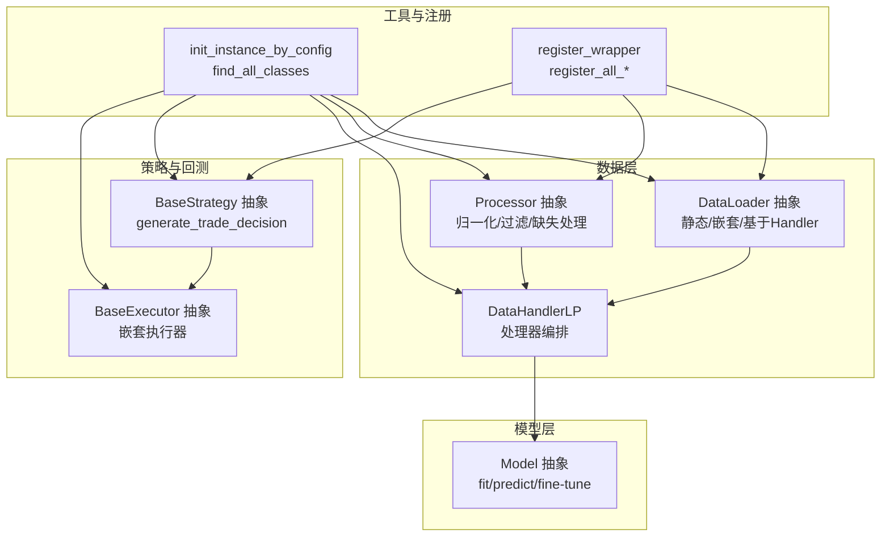
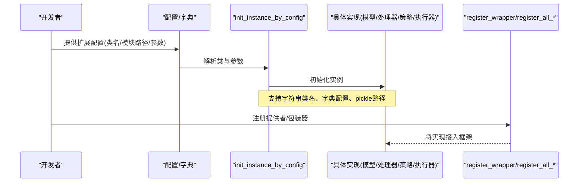
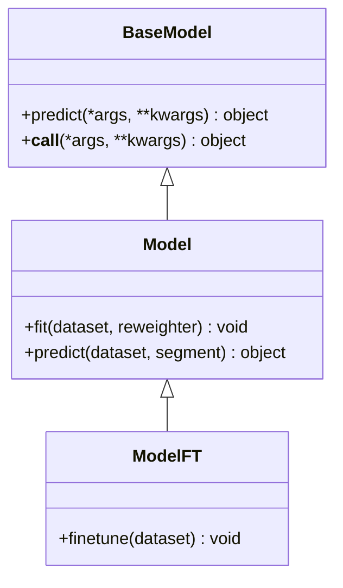
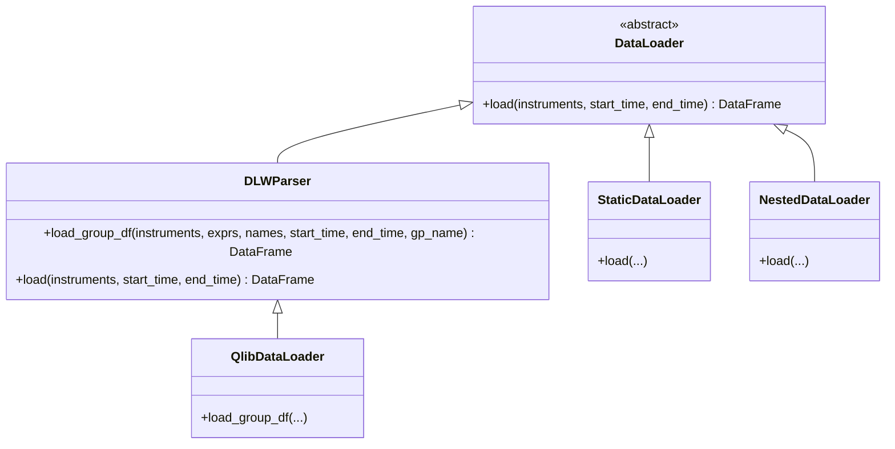
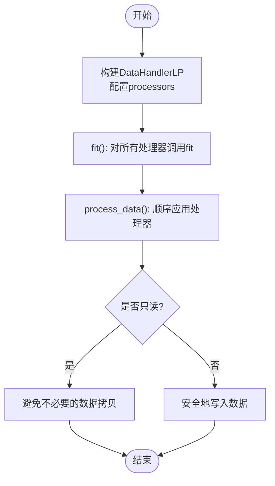
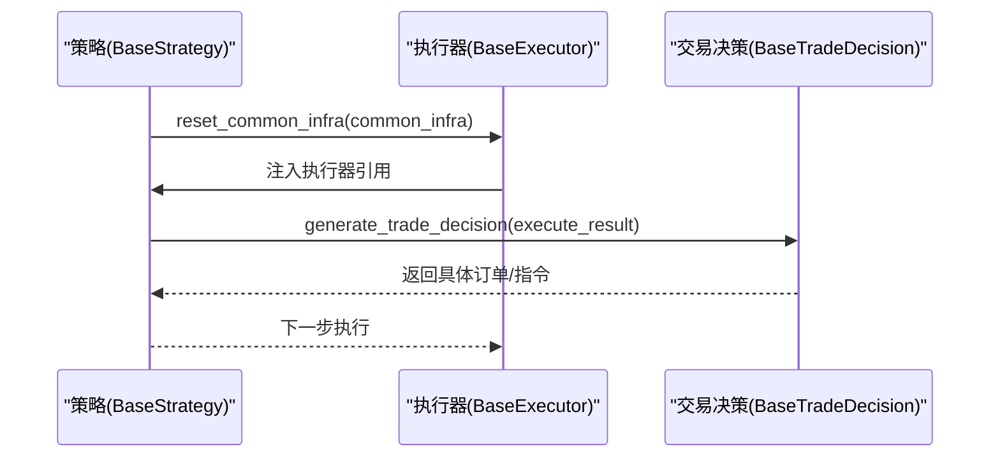

# 扩展开发指南

<cite>
**本文引用的文件**   
- [qlib/utils/mod.py](file://qlib/utils/mod.py)
- [qlib/model/base.py](file://qlib/model/base.py)
- [qlib/data/dataset/loader.py](file://qlib/data/dataset/loader.py)
- [qlib/data/dataset/processor.py](file://qlib/data/dataset/processor.py)
- [qlib/data/dataset/handler.py](file://qlib/data/dataset/handler.py)
- [qlib/strategy/base.py](file://qlib/strategy/base.py)
- [qlib/backtest/executor.py](file://qlib/backtest/executor.py)
- [qlib/backtest/__init__.py](file://qlib/backtest/__init__.py)
- [qlib/data/data.py](file://qlib/data/data.py)
- [qlib/data/ops.py](file://qlib/data/ops.py)
- [qlib/config.py](file://qlib/config.py)
- [qlib/rl/interpreter.py](file://qlib/rl/interpreter.py)
- [examples/rolling_process_data/README.md](file://examples/rolling_process_data/README.md)
</cite>

## 目录
1. [引言](#引言)
2. [项目结构](#项目结构)
3. [核心组件](#核心组件)
4. [架构总览](#架构总览)
5. [详细组件分析](#详细组件分析)
6. [依赖关系分析](#依赖关系分析)
7. [性能考量](#性能考量)
8. [故障排查指南](#故障排查指南)
9. [结论](#结论)
10. [附录](#附录)

## 引言
本指南面向希望在Qlib中进行扩展开发的工程师与研究者，系统讲解插件架构与扩展点设计、抽象基类与接口规范、配置驱动的实例化与注册机制，并给出自定义模型、数据处理器、策略与回测器的完整开发流程与最佳实践。通过本指南，您将能够：
- 理解Qlib的扩展点与插件化架构
- 基于抽象基类与接口规范实现可复用扩展
- 使用配置驱动的方式完成扩展的注册与实例化
- 设计可插拔的数据加载器、特征工程器与数据转换器
- 构建可组合的策略与回测执行器
- 完成扩展组件的测试与集成

## 项目结构
Qlib采用“分层+可插拔”的组织方式：数据层（Data）负责原始数据与特征表达；模型层（Model）提供学习与预测能力；策略与回测层（Strategy/Backtest）提供交易决策与执行；工具与注册层（Utils/Config）提供统一的实例化与注册机制。

**图示来源**
- [qlib/data/dataset/loader.py:18-60](file://qlib/data/dataset/loader.py#L18-L60)
- [qlib/data/dataset/processor.py:53-92](file://qlib/data/dataset/processor.py#L53-L92)
- [qlib/data/dataset/handler.py:429-550](file://qlib/data/dataset/handler.py#L429-L550)
- [qlib/model/base.py:10-111](file://qlib/model/base.py#L10-L111)
- [qlib/strategy/base.py:23-146](file://qlib/strategy/base.py#L23-L146)
- [qlib/backtest/executor.py:95-120](file://qlib/backtest/executor.py#L95-L120)
- [qlib/utils/mod.py:122-185](file://qlib/utils/mod.py#L122-L185)
- [qlib/data/data.py:1297-1332](file://qlib/data/data.py#L1297-L1332)
- [qlib/data/ops.py:1619-1642](file://qlib/data/ops.py#L1619-L1642)

**章节来源**
- [qlib/data/dataset/loader.py:18-60](file://qlib/data/dataset/loader.py#L18-L60)
- [qlib/data/dataset/processor.py:53-92](file://qlib/data/dataset/processor.py#L53-L92)
- [qlib/data/dataset/handler.py:429-550](file://qlib/data/dataset/handler.py#L429-L550)
- [qlib/model/base.py:10-111](file://qlib/model/base.py#L10-L111)
- [qlib/strategy/base.py:23-146](file://qlib/strategy/base.py#L23-L146)
- [qlib/backtest/executor.py:95-120](file://qlib/backtest/executor.py#L95-L120)
- [qlib/utils/mod.py:122-185](file://qlib/utils/mod.py#L122-L185)
- [qlib/data/data.py:1297-1332](file://qlib/data/data.py#L1297-L1332)
- [qlib/data/ops.py:1619-1642](file://qlib/data/ops.py#L1619-L1642)

## 核心组件
本节聚焦扩展开发的关键抽象与接口，帮助开发者快速把握扩展点与职责边界。

- 模型抽象与接口
  - BaseModel：定义预测接口，作为所有模型的最小契约。
  - Model：在BaseModel基础上增加可学习模型的fit/predict/fine-tune接口，约定数据集与权重的使用方式。
- 数据加载与处理
  - DataLoader：抽象数据加载器，支持静态文件、嵌套合并、基于DataHandler等多种加载模式。
  - Processor：抽象数据处理器，提供只读/推理可用性标记、配置注入等能力。
  - DataHandlerLP：编排多阶段处理器（共享/推理/学习），支持独立/追加两种处理类型。
- 策略与回测
  - BaseStrategy：抽象交易策略，定义生成交易决策的接口与基础设施注入。
  - BaseExecutor：抽象回测执行器，支持嵌套执行器以实现多时间尺度或分层决策。
- 实例化与注册
  - init_instance_by_config：从字符串/字典/路径配置中解析类与参数，支持pickle对象加载。
  - register_wrapper/register_all_*：注册各类提供者与包装器，形成可插拔的数据/算子生态。

**章节来源**
- [qlib/model/base.py:10-111](file://qlib/model/base.py#L10-L111)
- [qlib/data/dataset/loader.py:18-60](file://qlib/data/dataset/loader.py#L18-L60)
- [qlib/data/dataset/processor.py:53-92](file://qlib/data/dataset/processor.py#L53-L92)
- [qlib/data/dataset/handler.py:429-550](file://qlib/data/dataset/handler.py#L429-L550)
- [qlib/strategy/base.py:23-146](file://qlib/strategy/base.py#L23-L146)
- [qlib/backtest/executor.py:95-120](file://qlib/backtest/executor.py#L95-L120)
- [qlib/utils/mod.py:122-185](file://qlib/utils/mod.py#L122-L185)
- [qlib/data/data.py:1297-1332](file://qlib/data/data.py#L1297-L1332)
- [qlib/data/ops.py:1619-1642](file://qlib/data/ops.py#L1619-L1642)

## 架构总览
下图展示扩展开发中的关键交互：配置驱动的实例化如何连接到具体实现，以及数据流与策略-执行器链路。

**图示来源**
- [qlib/utils/mod.py:122-185](file://qlib/utils/mod.py#L122-L185)
- [qlib/data/data.py:1297-1332](file://qlib/data/data.py#L1297-L1332)
- [qlib/data/ops.py:1619-1642](file://qlib/data/ops.py#L1619-L1642)

## 详细组件分析

### 自定义模型开发流程
- 继承与实现
  - 继承Model并实现fit/dataset.prepare与predict等接口，遵循数据集列集合与权重的约定。
  - 如需支持微调，实现fine-tune接口以适配工作流实验记录与复用。
- 训练与预测
  - 在fit中完成模型训练与状态保存；在predict中按segment准备数据并返回预测结果。
- 配置与注册
  - 使用init_instance_by_config按配置实例化你的模型；通过register_wrapper将模型提供者注册到框架。

**图示来源**
- [qlib/model/base.py:10-111](file://qlib/model/base.py#L10-L111)

**章节来源**
- [qlib/model/base.py:22-111](file://qlib/model/base.py#L22-L111)
- [qlib/utils/mod.py:122-185](file://qlib/utils/mod.py#L122-L185)

### 自定义数据加载器开发
- 抽象与实现
  - 继承DataLoader并实现load接口；如需字段组解析，可继承DLWParser并实现load_group_df。
  - 提供静态数据加载器StaticDataLoader与嵌套加载器NestedDataLoader以满足复杂场景。
- 配置与实例化
  - 通过init_instance_by_config加载配置化的DataLoader，支持字符串类名与字典配置。
- 示例参考
  - 参考滚动数据处理示例，了解如何在不同滚动窗口中复用原始特征并动态生成处理后特征。

**图示来源**
- [qlib/data/dataset/loader.py:18-60](file://qlib/data/dataset/loader.py#L18-L60)
- [qlib/data/dataset/loader.py:62-151](file://qlib/data/dataset/loader.py#L62-L151)
- [qlib/data/dataset/loader.py:153-228](file://qlib/data/dataset/loader.py#L153-L228)
- [qlib/data/dataset/loader.py:230-290](file://qlib/data/dataset/loader.py#L230-L290)
- [qlib/data/dataset/loader.py:291-415](file://qlib/data/dataset/loader.py#L291-L415)

**章节来源**
- [qlib/data/dataset/loader.py:18-60](file://qlib/data/dataset/loader.py#L18-L60)
- [qlib/data/dataset/loader.py:62-151](file://qlib/data/dataset/loader.py#L62-L151)
- [qlib/data/dataset/loader.py:153-228](file://qlib/data/dataset/loader.py#L153-L228)
- [qlib/data/dataset/loader.py:230-290](file://qlib/data/dataset/loader.py#L230-L290)
- [qlib/data/dataset/loader.py:291-415](file://qlib/data/dataset/loader.py#L291-L415)
- [examples/rolling_process_data/README.md:1-17](file://examples/rolling_process_data/README.md#L1-L17)

### 自定义数据处理器开发
- 抽象与特性
  - 继承Processor并实现__call__；利用readonly与is_for_infer标记提升处理效率与安全性。
  - 提供Dropna、FilterCol、TanhProcess等常用处理器作为参考实现。
- 编排与生命周期
  - 在DataHandlerLP中配置shared/infer/learn处理器列表，支持独立/追加两类处理流程；fit与fit_process_data分别用于仅拟合与拟合并处理。
- 配置与实例化
  - 通过init_instance_by_config加载处理器配置，支持自动注入fit_start_time/fit_end_time等参数。

**图示来源**
- [qlib/data/dataset/processor.py:53-92](file://qlib/data/dataset/processor.py#L53-L92)
- [qlib/data/dataset/processor.py:94-147](file://qlib/data/dataset/processor.py#L94-L147)
- [qlib/data/dataset/handler.py:429-550](file://qlib/data/dataset/handler.py#L429-L550)

**章节来源**
- [qlib/data/dataset/processor.py:53-92](file://qlib/data/dataset/processor.py#L53-L92)
- [qlib/data/dataset/processor.py:94-147](file://qlib/data/dataset/processor.py#L94-L147)
- [qlib/data/dataset/handler.py:429-550](file://qlib/data/dataset/handler.py#L429-L550)
- [qlib/contrib/data/handler.py:12-34](file://qlib/contrib/data/handler.py#L12-L34)

### 自定义策略与回测器开发
- 策略接口
  - 继承BaseStrategy并实现generate_trade_decision；可选实现跨层级通信钩子（更新外层决策、步骤后钩子等）。
  - RL策略可通过RLStrategy/RLIntStrategy接入策略解释器与动作解释器。
- 回测执行器
  - 继承BaseExecutor并实现每步执行逻辑；支持嵌套执行器以实现多时间尺度或分层决策。
- 配置与初始化
  - 使用init_instance_by_config初始化策略与执行器；backtest入口函数负责装配公共基础设施与执行回测。

**图示来源**
- [qlib/strategy/base.py:23-146](file://qlib/strategy/base.py#L23-L146)
- [qlib/backtest/executor.py:95-120](file://qlib/backtest/executor.py#L95-L120)
- [qlib/backtest/__init__.py:208-228](file://qlib/backtest/__init__.py#L208-L228)

**章节来源**
- [qlib/strategy/base.py:23-146](file://qlib/strategy/base.py#L23-L146)
- [qlib/backtest/executor.py:95-120](file://qlib/backtest/executor.py#L95-L120)
- [qlib/backtest/__init__.py:208-228](file://qlib/backtest/__init__.py#L208-L228)
- [qlib/rl/interpreter.py:80-103](file://qlib/rl/interpreter.py#L80-L103)

### 扩展组件的测试与集成
- 测试建议
  - 为自定义模型提供最小数据集与断言；对数据处理器编写缺失值/列过滤等边界测试；对策略与执行器编写单步执行与序列执行的回归测试。
  - 参考仓库中的contrib模型与RL相关测试，确保扩展在真实工作流中可运行。
- 集成要点
  - 使用init_instance_by_config与register_wrapper完成配置化与注册；确保类名、模块路径与参数键一致。
  - 在工作流中通过YAML配置启用新扩展，验证端到端流水线。

**章节来源**
- [qlib/utils/mod.py:122-185](file://qlib/utils/mod.py#L122-L185)
- [qlib/data/data.py:1297-1332](file://qlib/data/data.py#L1297-L1332)
- [qlib/data/ops.py:1619-1642](file://qlib/data/ops.py#L1619-L1642)

## 依赖关系分析
下图展示扩展开发中各模块之间的依赖与耦合关系，强调配置驱动与注册机制对降低耦合的作用。

**图示来源**
- [qlib/utils/mod.py:122-185](file://qlib/utils/mod.py#L122-L185)
- [qlib/data/data.py:1297-1332](file://qlib/data/data.py#L1297-L1332)
- [qlib/data/ops.py:1619-1642](file://qlib/data/ops.py#L1619-L1642)

**章节来源**
- [qlib/utils/mod.py:122-185](file://qlib/utils/mod.py#L122-L185)
- [qlib/data/data.py:1297-1332](file://qlib/data/data.py#L1297-L1332)
- [qlib/data/ops.py:1619-1642](file://qlib/data/ops.py#L1619-L1642)

## 性能考量
- 处理器只读优化：通过readonly标记避免不必要的数据拷贝，提升流水线吞吐。
- 滚动窗口处理：在滚动训练场景中，优先缓存不随窗口变化的原始特征，仅对相关特征做动态处理，减少重复计算。
- 嵌套执行器：合理选择内层/外层执行器的时间粒度，避免高频执行带来的开销。
- 配置解析与注册：尽量在启动阶段完成注册与解析，运行时减少反射与IO开销。

## 故障排查指南
- 配置解析失败
  - 确认类名与模块路径正确；检查kwargs键名与默认参数；必要时使用try_kwargs回退。
- 处理器不可用于推理
  - 若处理器标记为非推理可用，将其放入learn_processors而非infer_processors。
- 注册未生效
  - 确认register_wrapper与register_all_*已调用；检查模块导入顺序与包装器注册位置。
- 回测执行异常
  - 检查策略与执行器的公共基础设施注入；核对交易日历与决策范围限制。

**章节来源**
- [qlib/utils/mod.py:122-185](file://qlib/utils/mod.py#L122-L185)
- [qlib/data/dataset/processor.py:62-80](file://qlib/data/dataset/processor.py#L62-L80)
- [qlib/data/data.py:1297-1332](file://qlib/data/data.py#L1297-L1332)
- [qlib/config.py:483-488](file://qlib/config.py#L483-L488)

## 结论
通过本指南，您可以在Qlib中高效地设计与实现扩展：以抽象基类与接口规范为约束，以配置驱动与注册机制为桥梁，围绕数据加载、特征工程、模型训练、策略决策与回测执行构建可插拔、可测试、可复用的扩展模块。建议在开发过程中遵循只读优化、滚动窗口复用与嵌套执行器的性能策略，并在工作流中通过YAML配置与单元测试完成集成验证。

## 附录
- 关键API速查
  - 模型：Model.fit / Model.predict / ModelFT.finetune
  - 数据：DataLoader.load / Processor.__call__ / DataHandlerLP.fit/process_data
  - 策略：BaseStrategy.generate_trade_decision / BaseStrategy.update_trade_decision
  - 执行：BaseExecutor.reset / BaseExecutor.__init__（嵌套执行器）
  - 工具：init_instance_by_config / register_wrapper / find_all_classes
- 参考示例
  - 滚动数据处理：examples/rolling_process_data/README.md