# 测试策略与实践

<cite>
**本文引用的文件**
- [tests/pytest.ini](file://tests/pytest.ini)
- [tests/conftest.py](file://tests/conftest.py)
- [.github/workflows/test_qlib_from_source.yml](file://.github/workflows/test_qlib_from_source.yml)
- [qlib/tests/__init__.py](file://qlib/tests/__init__.py)
- [qlib/tests/config.py](file://qlib/tests/config.py)
- [qlib/tests/data.py](file://qlib/tests/data.py)
- [tests/dependency_tests/README.md](file://tests/dependency_tests/README.md)
- [.deepsource.toml](file://.deepsource.toml)
- [tests/test_all_pipeline.py](file://tests/test_all_pipeline.py)
- [tests/test_workflow.py](file://tests/test_workflow.py)
- [tests/test_contrib_model.py](file://tests/test_contrib_model.py)
- [tests/test_contrib_workflow.py](file://tests/test_contrib_workflow.py)
- [tests/test_get_data.py](file://tests/test_get_data.py)
- [tests/test_dump_data.py](file://tests/test_dump_data.py)
- [tests/test_pit.py](file://tests/test_pit.py)
- [tests/test_register_ops.py](file://tests/test_register_ops.py)
- [tests/test_structured_cov_estimator.py](file://tests/test_structured_cov_estimator.py)
- [tests/backtest/test_file_strategy.py](file://tests/backtest/test_file_strategy.py)
- [tests/backtest/test_high_freq_trading.py](file://tests/backtest/test_high_freq_trading.py)
- [tests/backtest/test_soft_topk_strategy.py](file://tests/backtest/test_soft_topk_strategy.py)
- [tests/backtest/test_soft_topk_strategy_cold_start.py](file://tests/backtest/test_soft_topk_strategy_cold_start.py)
- [tests/data_mid_layer_tests/test_dataloader.py](file://tests/data_mid_layer_tests/test_dataloader.py)
- [tests/data_mid_layer_tests/test_dataset.py](file://tests/data_mid_layer_tests/test_dataset.py)
- [tests/data_mid_layer_tests/test_handler.py](file://tests/data_mid_layer_tests/test_handler.py)
- [tests/data_mid_layer_tests/test_handler_storage.py](file://tests/data_mid_layer_tests/test_handler_storage.py)
- [tests/data_mid_layer_tests/test_processor.py](file://tests/data_mid_layer_tests/test_processor.py)
- [tests/dataset_tests/test_datalayer.py](file://tests/dataset_tests/test_datalayer.py)
- [tests/storage_tests/test_storage.py](file://tests/storage_tests/test_storage.py)
- [tests/rl/test_trainer.py](file://tests/rl/test_trainer.py)
- [tests/rl/test_qlib_simulator.py](file://tests/rl/test_qlib_simulator.py)
- [tests/rl/test_saoe_simple.py](file://tests/rl/test_saoe_simple.py)
- [tests/ops/test_elem_operator.py](file://tests/ops/test_elem_operator.py)
- [tests/ops/test_special_ops.py](file://tests/ops/test_special_ops.py)
- [tests/model/test_general_nn.py](file://tests/model/test_general_nn.py)
- [tests/rolling_tests/test_update_pred.py](file://tests/rolling_tests/test_update_pred.py)
- [tests/misc/test_get_multi_proc.py](file://tests/misc/test_get_multi_proc.py)
- [tests/misc/test_index_data.py](file://tests/misc/test_index_data.py)
- [tests/misc/test_sepdf.py](file://tests/misc/test_sepdf.py)
- [tests/misc/test_utils.py](file://tests/misc/test_utils.py)
</cite>

## 目录
1. [引言](#引言)
2. [项目结构](#项目结构)
3. [核心组件](#核心组件)
4. [架构总览](#架构总览)
5. [详细组件分析](#详细组件分析)
6. [依赖分析](#依赖分析)
7. [性能考虑](#性能考虑)
8. [故障排查指南](#故障排查指南)
9. [结论](#结论)
10. [附录](#附录)

## 引言
本文件面向Qlib开发者与贡献者，系统性梳理测试金字塔与测试层次结构，明确单元测试、集成测试、端到端测试的设计原则；总结测试框架与工具链（pytest配置、测试夹具、参数化测试）；阐述测试数据管理与Mock策略；给出性能测试与基准测试方法（内存使用、执行时间、并发测试）；并提出测试覆盖率与质量门禁建议，帮助建立完善的测试体系。

## 项目结构
Qlib仓库中测试相关的主要位置如下：
- tests/：顶层测试目录，包含各类功能模块的测试用例、pytest配置与夹具
- qlib/tests/：框架内测试支持模块，提供测试配置、Mock数据与数据下载工具
- .github/workflows/：CI工作流定义，包含测试运行与多平台兼容性处理
- .deepsource.toml：静态分析配置，限定测试文件匹配范围

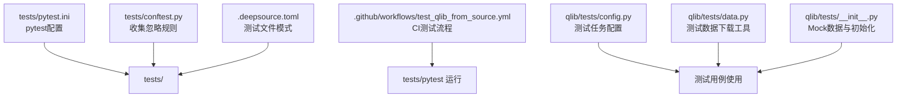

**图表来源**
- [tests/pytest.ini:1-7](file://tests/pytest.ini#L1-L7)
- [tests/conftest.py:1-11](file://tests/conftest.py#L1-L11)
- [.github/workflows/test_qlib_from_source.yml:111-135](file://.github/workflows/test_qlib_from_source.yml#L111-L135)
- [qlib/tests/config.py:1-168](file://qlib/tests/config.py#L1-L168)
- [qlib/tests/data.py:1-212](file://qlib/tests/data.py#L1-L212)
- [qlib/tests/__init__.py:85-289](file://qlib/tests/__init__.py#L85-L289)
- [.deepsource.toml:1-12](file://.deepsource.toml#L1-L12)

**章节来源**
- [tests/pytest.ini:1-7](file://tests/pytest.ini#L1-L7)
- [tests/conftest.py:1-11](file://tests/conftest.py#L1-L11)
- [.github/workflows/test_qlib_from_source.yml:111-135](file://.github/workflows/test_qlib_from_source.yml#L111-L135)
- [qlib/tests/config.py:1-168](file://qlib/tests/config.py#L1-L168)
- [qlib/tests/data.py:1-212](file://qlib/tests/data.py#L1-L212)
- [qlib/tests/__init__.py:85-289](file://qlib/tests/__init__.py#L85-L289)
- [.deepsource.toml:1-12](file://.deepsource.toml#L1-L12)

## 核心组件
- 测试框架与工具链
  - pytest配置：标记过滤器、警告过滤、持续时长输出
  - 夹具与收集规则：跨平台忽略RL测试、统一入口
- 测试数据与Mock
  - Mock数据构造与初始化
  - 数据下载工具与存在性检查
  - 测试任务配置模板（数据集、模型、记录）
- CI与质量门禁
  - 多平台测试矩阵与线程限制
  - 静态分析测试文件模式

**章节来源**
- [tests/pytest.ini:1-7](file://tests/pytest.ini#L1-L7)
- [tests/conftest.py:1-11](file://tests/conftest.py#L1-L11)
- [qlib/tests/__init__.py:85-289](file://qlib/tests/__init__.py#L85-L289)
- [qlib/tests/data.py:153-212](file://qlib/tests/data.py#L153-L212)
- [qlib/tests/config.py:17-168](file://qlib/tests/config.py#L17-L168)
- [.github/workflows/test_qlib_from_source.yml:111-135](file://.github/workflows/test_qlib_from_source.yml#L111-L135)
- [.deepsource.toml:1-12](file://.deepsource.toml#L1-L12)

## 架构总览
下图展示测试金字塔在Qlib中的落地：自底向上为单元测试（函数/类）、集成测试（模块/子系统）、端到端测试（完整工作流），并通过CI进行质量门禁。

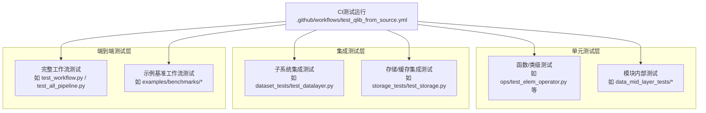

**图表来源**
- [.github/workflows/test_qlib_from_source.yml:111-135](file://.github/workflows/test_qlib_from_source.yml#L111-L135)
- [tests/data_mid_layer_tests/test_dataloader.py](file://tests/data_mid_layer_tests/test_dataloader.py)
- [tests/data_mid_layer_tests/test_dataset.py](file://tests/data_mid_layer_tests/test_dataset.py)
- [tests/data_mid_layer_tests/test_handler.py](file://tests/data_mid_layer_tests/test_handler.py)
- [tests/data_mid_layer_tests/test_handler_storage.py](file://tests/data_mid_layer_tests/test_handler_storage.py)
- [tests/data_mid_layer_tests/test_processor.py](file://tests/data_mid_layer_tests/test_processor.py)
- [tests/dataset_tests/test_datalayer.py](file://tests/dataset_tests/test_datalayer.py)
- [tests/storage_tests/test_storage.py](file://tests/storage_tests/test_storage.py)
- [tests/test_workflow.py](file://tests/test_workflow.py)
- [tests/test_all_pipeline.py](file://tests/test_all_pipeline.py)

## 详细组件分析

### 测试框架与工具链
- pytest配置
  - 标记过滤：slow标记用于排除耗时测试
  - 警告过滤：忽略特定numpy与随机数相关警告
  - 持续时长：输出所有测试的耗时信息
- 夹具与收集规则
  - 非Linux平台忽略RL相关测试文件
  - 统一入口控制测试收集范围
- CI运行
  - macOS限制OpenMP/MKL/NumExpr/OpenBLAS/vecLib线程数，避免多线程冲突导致段错误
  - 使用pytest运行tests目录，排除slow标记

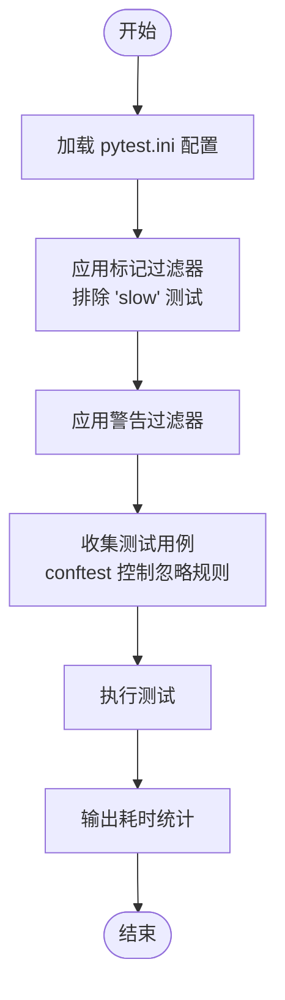

**图表来源**
- [tests/pytest.ini:1-7](file://tests/pytest.ini#L1-L7)
- [tests/conftest.py:1-11](file://tests/conftest.py#L1-L11)
- [.github/workflows/test_qlib_from_source.yml:111-135](file://.github/workflows/test_qlib_from_source.yml#L111-L135)

**章节来源**
- [tests/pytest.ini:1-7](file://tests/pytest.ini#L1-L7)
- [tests/conftest.py:1-11](file://tests/conftest.py#L1-L11)
- [.github/workflows/test_qlib_from_source.yml:111-135](file://.github/workflows/test_qlib_from_source.yml#L111-L135)

### 测试数据管理与Mock策略
- Mock数据与初始化
  - 提供CSV格式Mock数据，覆盖日频行情字段
  - 初始化数据提供方（日历、合约、特征）为本地Mock后端，确保测试隔离
- 测试数据下载工具
  - 支持从远程URL下载压缩包，自动解压并清理旧数据目录
  - 存在性检查与版本选择逻辑，支持跳过已存在数据
- 测试任务配置模板
  - 定义数据处理器、数据集分段、模型与记录配置模板
  - 便于在不同场景（如滚动在线/在线仿真）复用

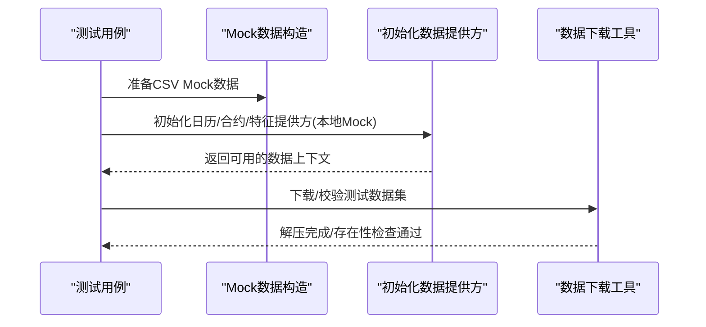

**图表来源**
- [qlib/tests/__init__.py:85-289](file://qlib/tests/__init__.py#L85-L289)
- [qlib/tests/data.py:18-212](file://qlib/tests/data.py#L18-L212)
- [qlib/tests/config.py:53-168](file://qlib/tests/config.py#L53-L168)

**章节来源**
- [qlib/tests/__init__.py:85-289](file://qlib/tests/__init__.py#L85-L289)
- [qlib/tests/data.py:18-212](file://qlib/tests/data.py#L18-L212)
- [qlib/tests/config.py:53-168](file://qlib/tests/config.py#L53-L168)

### 单元测试设计原则与实践
- 设计原则
  - 快速、独立、可重复；关注函数/类的边界行为与异常路径
  - 使用夹具注入最小依赖，避免外部状态耦合
- 实践要点
  - 参数化测试：对不同输入组合进行批量验证
  - 断言清晰：针对返回值、副作用、异常类型进行断言
  - Mock第三方依赖：网络请求、文件系统、外部服务
- 典型用例
  - 算子测试：元素算子与特殊算子的正确性
  - 模型通用性：通用神经网络训练/推理流程
  - 滚动预测更新：滚动预测的增量更新逻辑

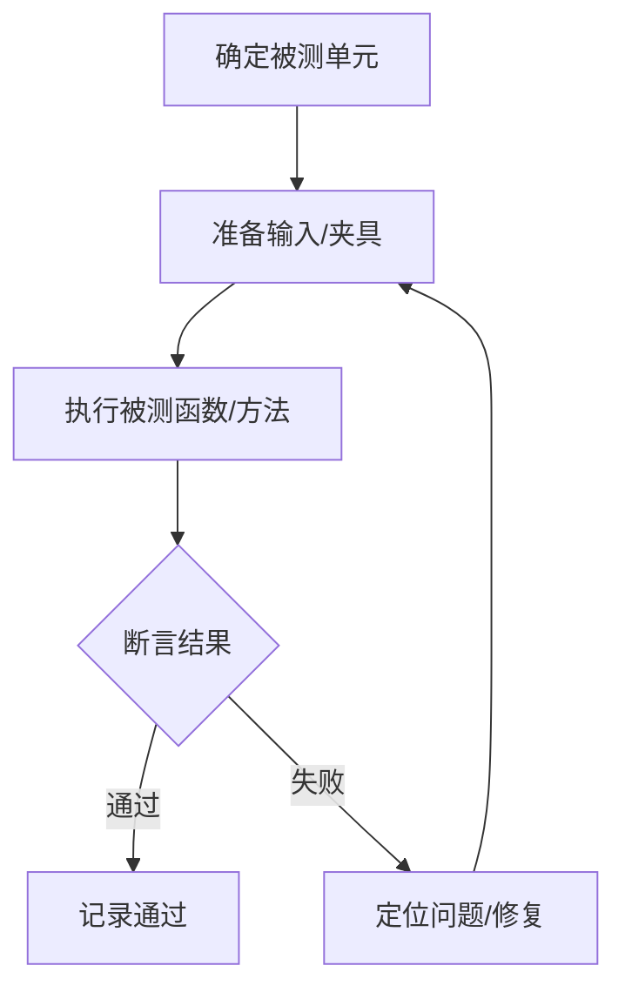

**图表来源**
- [tests/ops/test_elem_operator.py](file://tests/ops/test_elem_operator.py)
- [tests/ops/test_special_ops.py](file://tests/ops/test_special_ops.py)
- [tests/model/test_general_nn.py](file://tests/model/test_general_nn.py)
- [tests/rolling_tests/test_update_pred.py](file://tests/rolling_tests/test_update_pred.py)

**章节来源**
- [tests/ops/test_elem_operator.py](file://tests/ops/test_elem_operator.py)
- [tests/ops/test_special_ops.py](file://tests/ops/test_special_ops.py)
- [tests/model/test_general_nn.py](file://tests/model/test_general_nn.py)
- [tests/rolling_tests/test_update_pred.py](file://tests/rolling_tests/test_update_pred.py)

### 集成测试设计原则与实践
- 设计原则
  - 关注模块间接口契约与数据流转；验证数据加载、处理器、存储等子系统协同
  - 使用Mock或轻量数据源，保证测试稳定与可重复
- 实践要点
  - 数据中间层：数据加载器、数据集、处理器、存储适配器
  - 数据集层：数据层接口一致性与分段配置
  - 存储层：缓存、序列化、持久化一致性
- 典型用例
  - 数据中间层测试：加载器、数据集、处理器、存储适配器
  - 数据集层测试：数据层接口一致性
  - 存储层测试：缓存与存储一致性

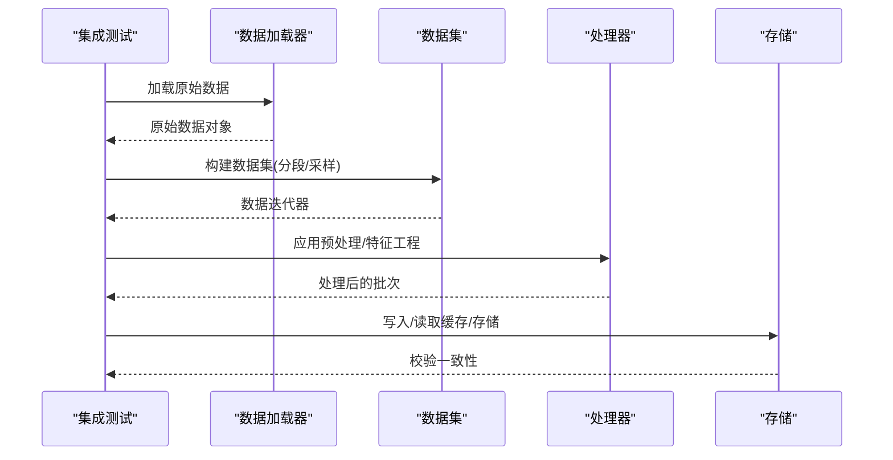

**图表来源**
- [tests/data_mid_layer_tests/test_dataloader.py](file://tests/data_mid_layer_tests/test_dataloader.py)
- [tests/data_mid_layer_tests/test_dataset.py](file://tests/data_mid_layer_tests/test_dataset.py)
- [tests/data_mid_layer_tests/test_handler.py](file://tests/data_mid_layer_tests/test_handler.py)
- [tests/data_mid_layer_tests/test_handler_storage.py](file://tests/data_mid_layer_tests/test_handler_storage.py)
- [tests/data_mid_layer_tests/test_processor.py](file://tests/data_mid_layer_tests/test_processor.py)
- [tests/dataset_tests/test_datalayer.py](file://tests/dataset_tests/test_datalayer.py)
- [tests/storage_tests/test_storage.py](file://tests/storage_tests/test_storage.py)

**章节来源**
- [tests/data_mid_layer_tests/test_dataloader.py](file://tests/data_mid_layer_tests/test_dataloader.py)
- [tests/data_mid_layer_tests/test_dataset.py](file://tests/data_mid_layer_tests/test_dataset.py)
- [tests/data_mid_layer_tests/test_handler.py](file://tests/data_mid_layer_tests/test_handler.py)
- [tests/data_mid_layer_tests/test_handler_storage.py](file://tests/data_mid_layer_tests/test_handler_storage.py)
- [tests/data_mid_layer_tests/test_processor.py](file://tests/data_mid_layer_tests/test_processor.py)
- [tests/dataset_tests/test_datalayer.py](file://tests/dataset_tests/test_datalayer.py)
- [tests/storage_tests/test_storage.py](file://tests/storage_tests/test_storage.py)

### 端到端测试设计原则与实践
- 设计原则
  - 覆盖完整工作流：从数据准备、模型训练、回测、报告生成到记录落盘
  - 可配置性：通过模板化配置快速切换数据集、模型与记录策略
  - 可重复性：使用Mock或固定种子，避免外部波动影响结果
- 实践要点
  - 工作流测试：验证exp/expm/recorder等核心组件协作
  - 示例基准：参考examples/benchmarks下的工作流配置，作为回归与性能基线
- 典型用例
  - 工作流全链路：信号记录、分析记录、回测与报告
  - 贡献模块测试：contrib模型与工作流的集成验证

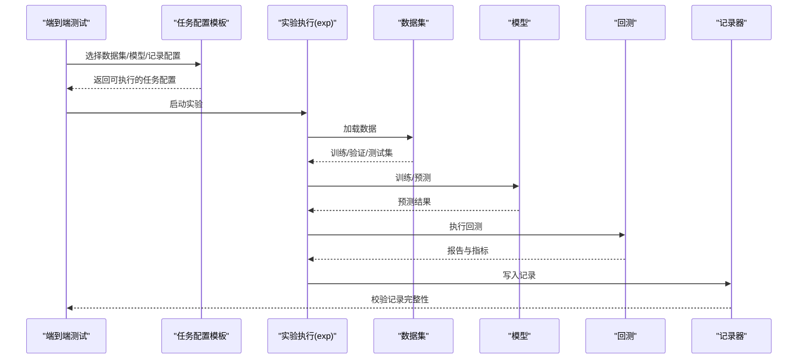

**图表来源**
- [tests/test_workflow.py](file://tests/test_workflow.py)
- [tests/test_all_pipeline.py](file://tests/test_all_pipeline.py)
- [tests/test_contrib_model.py](file://tests/test_contrib_model.py)
- [tests/test_contrib_workflow.py](file://tests/test_contrib_workflow.py)
- [qlib/tests/config.py:53-168](file://qlib/tests/config.py#L53-L168)

**章节来源**
- [tests/test_workflow.py](file://tests/test_workflow.py)
- [tests/test_all_pipeline.py](file://tests/test_all_pipeline.py)
- [tests/test_contrib_model.py](file://tests/test_contrib_model.py)
- [tests/test_contrib_workflow.py](file://tests/test_contrib_workflow.py)
- [qlib/tests/config.py:53-168](file://qlib/tests/config.py#L53-L168)

### 性能测试与基准测试方法
- 内存使用分析
  - 利用内存缓存单元（按长度或字节大小限制）评估缓存占用与增长趋势
  - 在测试中对缓存上限与回收策略进行压力测试
- 执行时间测量
  - 使用pytest的持续时长输出，识别慢测试与热点路径
  - 结合CI的slow标记，将长耗时测试排除在常规流水线之外
- 并发测试
  - 在非macOS平台限制OpenMP/MKL/NumExpr/OpenBLAS/vecLib线程数，避免多线程冲突
  - 对高并发场景（如数据加载、模型训练）进行稳定性与一致性验证

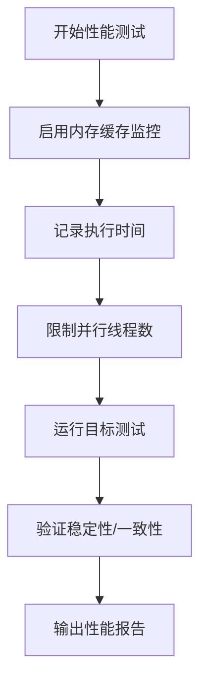

**图表来源**
- [qlib/data/cache.py:137-159](file://qlib/data/cache.py#L137-L159)
- [tests/pytest.ini:1-7](file://tests/pytest.ini#L1-L7)
- [.github/workflows/test_qlib_from_source.yml:111-135](file://.github/workflows/test_qlib_from_source.yml#L111-L135)

**章节来源**
- [qlib/data/cache.py:137-159](file://qlib/data/cache.py#L137-L159)
- [tests/pytest.ini:1-7](file://tests/pytest.ini#L1-L7)
- [.github/workflows/test_qlib_from_source.yml:111-135](file://.github/workflows/test_qlib_from_source.yml#L111-L135)

### 回测与交易策略测试
- 设计原则
  - 验证策略在不同市场环境与数据频率下的鲁棒性
  - 关注冷启动、软top-k等边界条件
- 实践要点
  - 文件策略、高频交易、软top-k策略等多场景覆盖
  - 与Mock数据配合，确保测试可重复与可控

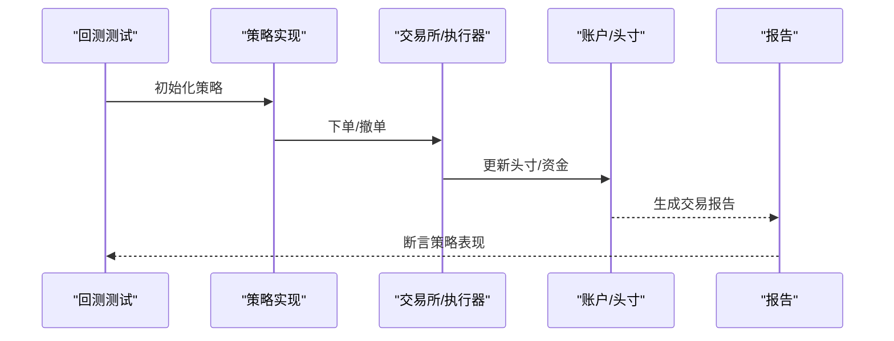

**图表来源**
- [tests/backtest/test_file_strategy.py](file://tests/backtest/test_file_strategy.py)
- [tests/backtest/test_high_freq_trading.py](file://tests/backtest/test_high_freq_trading.py)
- [tests/backtest/test_soft_topk_strategy.py](file://tests/backtest/test_soft_topk_strategy.py)
- [tests/backtest/test_soft_topk_strategy_cold_start.py](file://tests/backtest/test_soft_topk_strategy_cold_start.py)

**章节来源**
- [tests/backtest/test_file_strategy.py](file://tests/backtest/test_file_strategy.py)
- [tests/backtest/test_high_freq_trading.py](file://tests/backtest/test_high_freq_trading.py)
- [tests/backtest/test_soft_topk_strategy.py](file://tests/backtest/test_soft_topk_strategy.py)
- [tests/backtest/test_soft_topk_strategy_cold_start.py](file://tests/backtest/test_soft_topk_strategy_cold_start.py)

### 依赖假设验证与质量门禁
- 依赖假设验证
  - 部分实现依赖于特定依赖项的假设，需通过专门测试确保这些假设有效
- 质量门禁
  - CI中运行pytest（排除slow）、静态检查（pylint/flake8/mypy）、文档构建（sphinx）与notebook格式检查
  - 测试文件模式由DeepSource限定，仅分析tests/test_*.py

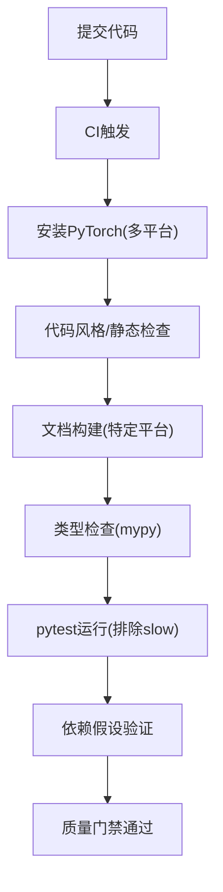

**图表来源**
- [.github/workflows/test_qlib_from_source.yml:47-88](file://.github/workflows/test_qlib_from_source.yml#L47-L88)
- [.github/workflows/test_qlib_from_source.yml:111-135](file://.github/workflows/test_qlib_from_source.yml#L111-L135)
- [tests/dependency_tests/README.md:1-4](file://tests/dependency_tests/README.md#L1-L4)
- [.deepsource.toml:1-12](file://.deepsource.toml#L1-L12)

**章节来源**
- [.github/workflows/test_qlib_from_source.yml:47-88](file://.github/workflows/test_qlib_from_source.yml#L47-L88)
- [.github/workflows/test_qlib_from_source.yml:111-135](file://.github/workflows/test_qlib_from_source.yml#L111-L135)
- [tests/dependency_tests/README.md:1-4](file://tests/dependency_tests/README.md#L1-L4)
- [.deepsource.toml:1-12](file://.deepsource.toml#L1-L12)

## 依赖分析
- 组件耦合与内聚
  - 测试用例与配置模板解耦，通过模板化配置驱动不同场景
  - Mock数据与初始化逻辑集中管理，降低测试间耦合
- 外部依赖与集成点
  - CI多平台差异处理（macOS线程限制）
  - 数据下载工具与远程资源可用性检查
- 循环依赖与风险
  - 测试配置模板不直接依赖具体实现，避免循环依赖
  - 通过conftest统一忽略规则，减少平台差异带来的循环导入风险

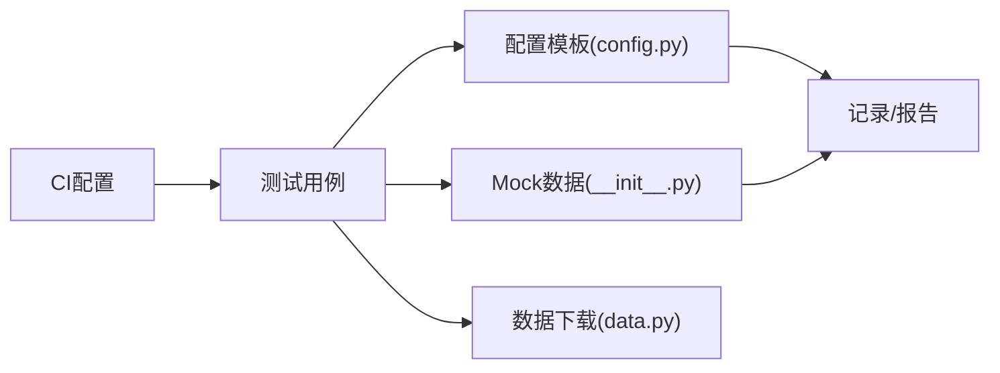

**图表来源**
- [qlib/tests/config.py:53-168](file://qlib/tests/config.py#L53-L168)
- [qlib/tests/__init__.py:85-289](file://qlib/tests/__init__.py#L85-L289)
- [qlib/tests/data.py:153-212](file://qlib/tests/data.py#L153-L212)
- [.github/workflows/test_qlib_from_source.yml:111-135](file://.github/workflows/test_qlib_from_source.yml#L111-L135)

**章节来源**
- [qlib/tests/config.py:53-168](file://qlib/tests/config.py#L53-L168)
- [qlib/tests/__init__.py:85-289](file://qlib/tests/__init__.py#L85-L289)
- [qlib/tests/data.py:153-212](file://qlib/tests/data.py#L153-L212)
- [.github/workflows/test_qlib_from_source.yml:111-135](file://.github/workflows/test_qlib_from_source.yml#L111-L135)

## 性能考虑
- 测试执行效率
  - 使用slow标记区分长耗时测试，常规流水线默认排除
  - 在macOS上限制多线程库线程数，避免并行冲突
- 内存与缓存
  - 采用按长度或字节大小的内存缓存限制策略，结合测试场景评估缓存命中与回收
- 数据准备与隔离
  - 使用Mock数据与本地存储后端，减少外部依赖与I/O抖动

**章节来源**
- [tests/pytest.ini:1-7](file://tests/pytest.ini#L1-L7)
- [.github/workflows/test_qlib_from_source.yml:111-135](file://.github/workflows/test_qlib_from_source.yml#L111-L135)
- [qlib/data/cache.py:137-159](file://qlib/data/cache.py#L137-L159)

## 故障排查指南
- 常见问题
  - macOS多线程冲突：设置OMP_NUM_THREADS/MKL_NUM_THREADS等变量
  - 依赖假设失效：运行依赖假设验证测试，确认第三方库版本与行为
  - 数据下载失败：检查远程URL可达性与网络代理设置
- 排查步骤
  - 逐步缩小范围：先运行单元测试，再扩展到集成与端到端
  - 使用参数化与标记过滤快速定位问题
  - 对比CI与本地环境差异（平台、依赖版本）

**章节来源**
- [.github/workflows/test_qlib_from_source.yml:111-135](file://.github/workflows/test_qlib_from_source.yml#L111-L135)
- [tests/dependency_tests/README.md:1-4](file://tests/dependency_tests/README.md#L1-L4)
- [qlib/tests/data.py:18-212](file://qlib/tests/data.py#L18-L212)

## 结论
Qlib的测试体系以pytest为核心，结合Mock数据、配置模板与CI门禁，形成从单元到端到端的完整测试金字塔。通过明确的标记与过滤机制、严格的平台兼容性处理以及可复用的测试配置，开发者可以高效地构建稳定、可维护且可扩展的测试套件。建议在新增功能时同步补充相应层级的测试，并遵循参数化、隔离与可重复的原则，持续完善测试覆盖率与质量门禁。

## 附录
- 测试用例清单（按类别）
  - 单元测试：ops、model、misc等
  - 集成测试：data_mid_layer_tests、dataset_tests、storage_tests
  - 端到端测试：test_workflow、test_all_pipeline、contrib相关
  - 回测测试：backtest相关
- 质量门禁与静态分析
  - 测试文件模式：tests/test_*.py
  - CI阶段：pytest、静态检查、文档构建、类型检查

**章节来源**
- [tests/ops/test_elem_operator.py](file://tests/ops/test_elem_operator.py)
- [tests/ops/test_special_ops.py](file://tests/ops/test_special_ops.py)
- [tests/model/test_general_nn.py](file://tests/model/test_general_nn.py)
- [tests/misc/test_get_multi_proc.py](file://tests/misc/test_get_multi_proc.py)
- [tests/misc/test_index_data.py](file://tests/misc/test_index_data.py)
- [tests/misc/test_sepdf.py](file://tests/misc/test_sepdf.py)
- [tests/misc/test_utils.py](file://tests/misc/test_utils.py)
- [tests/data_mid_layer_tests/test_dataloader.py](file://tests/data_mid_layer_tests/test_dataloader.py)
- [tests/data_mid_layer_tests/test_dataset.py](file://tests/data_mid_layer_tests/test_dataset.py)
- [tests/data_mid_layer_tests/test_handler.py](file://tests/data_mid_layer_tests/test_handler.py)
- [tests/data_mid_layer_tests/test_handler_storage.py](file://tests/data_mid_layer_tests/test_handler_storage.py)
- [tests/data_mid_layer_tests/test_processor.py](file://tests/data_mid_layer_tests/test_processor.py)
- [tests/dataset_tests/test_datalayer.py](file://tests/dataset_tests/test_datalayer.py)
- [tests/storage_tests/test_storage.py](file://tests/storage_tests/test_storage.py)
- [tests/test_workflow.py](file://tests/test_workflow.py)
- [tests/test_all_pipeline.py](file://tests/test_all_pipeline.py)
- [tests/test_contrib_model.py](file://tests/test_contrib_model.py)
- [tests/test_contrib_workflow.py](file://tests/test_contrib_workflow.py)
- [tests/backtest/test_file_strategy.py](file://tests/backtest/test_file_strategy.py)
- [tests/backtest/test_high_freq_trading.py](file://tests/backtest/test_high_freq_trading.py)
- [tests/backtest/test_soft_topk_strategy.py](file://tests/backtest/test_soft_topk_strategy.py)
- [tests/backtest/test_soft_topk_strategy_cold_start.py](file://tests/backtest/test_soft_topk_strategy_cold_start.py)
- [.deepsource.toml:1-12](file://.deepsource.toml#L1-L12)