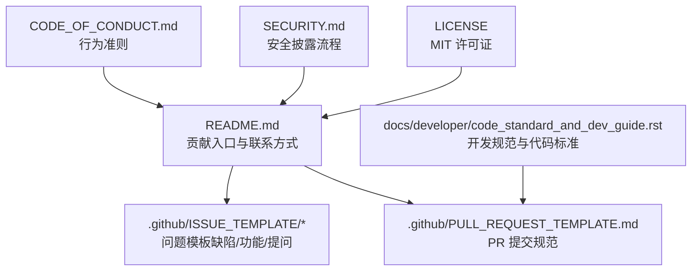
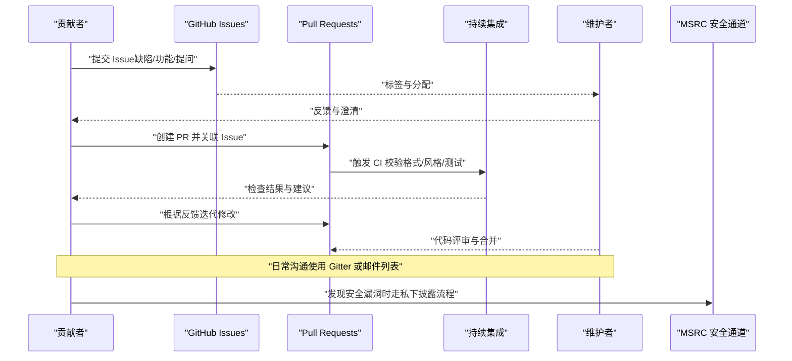
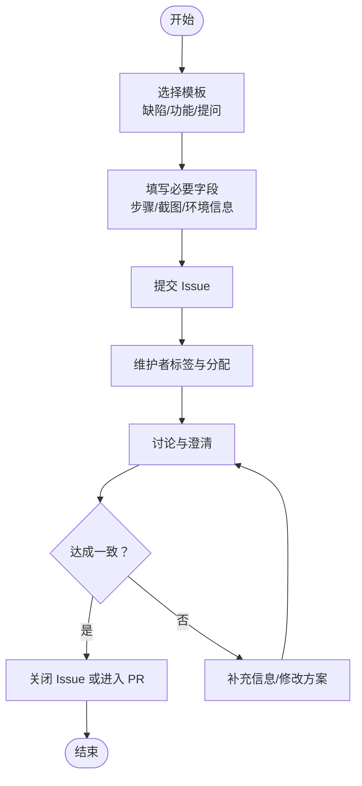
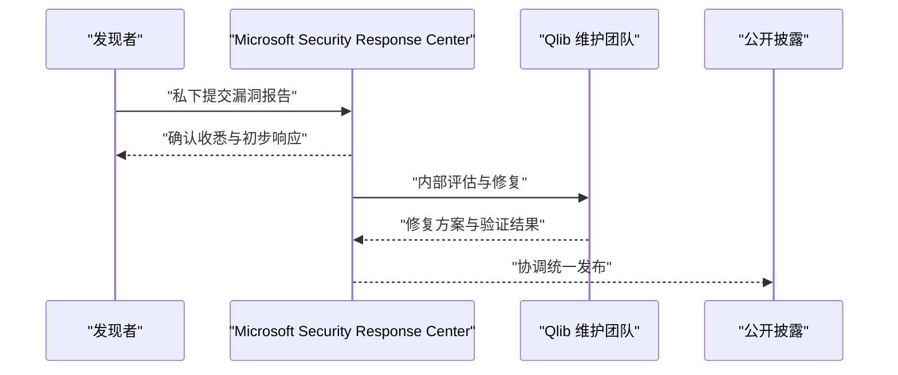
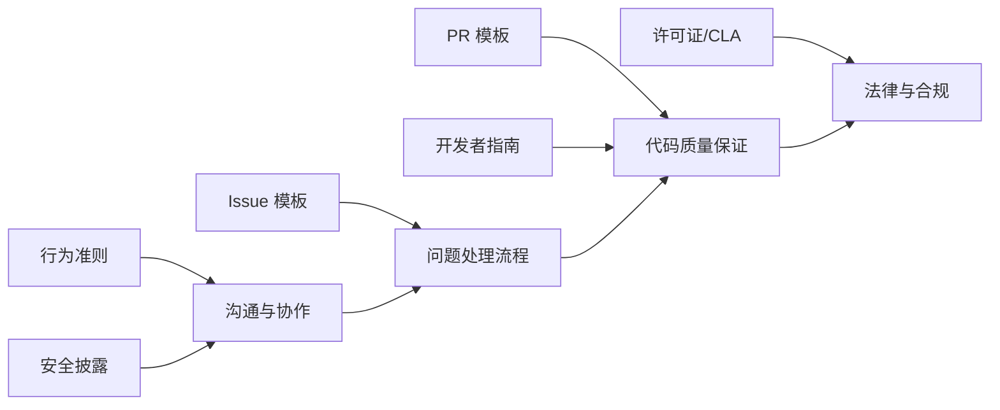

# 社区参与与贡献

<cite>
**本文引用的文件**
- [CODE_OF_CONDUCT.md](file://CODE_OF_CONDUCT.md)
- [SECURITY.md](file://SECURITY.md)
- [README.md](file://README.md)
- [LICENSE](file://LICENSE)
- [.github/ISSUE_TEMPLATE/bug-report.md](file://.github/ISSUE_TEMPLATE/bug-report.md)
- [.github/ISSUE_TEMPLATE/feature-request.md](file://.github/ISSUE_TEMPLATE/feature-request.md)
- [.github/ISSUE_TEMPLATE/question.md](file://.github/ISSUE_TEMPLATE/question.md)
- [.github/PULL_REQUEST_TEMPLATE.md](file://.github/PULL_REQUEST_TEMPLATE.md)
- [docs/developer/code_standard_and_dev_guide.rst](file://docs/developer/code_standard_and_dev_guide.rst)
</cite>

## 目录
1. [引言](#引言)
2. [项目结构](#项目结构)
3. [核心组件](#核心组件)
4. [架构总览](#架构总览)
5. [详细组件分析](#详细组件分析)
6. [依赖关系分析](#依赖关系分析)
7. [性能考虑](#性能考虑)
8. [故障排查指南](#故障排查指南)
9. [结论](#结论)
10. [附录](#附录)

## 引言
本指南面向所有希望参与 Qlib 社区建设与贡献的成员，系统性地介绍社区行为准则与沟通规范、问题反馈与功能请求流程、文档贡献方法、安全漏洞报告与响应流程、社区活动与交流渠道，以及许可证与知识产权政策。目标是帮助贡献者在尊重包容、高效协作的前提下，高质量地推进项目演进。

## 项目结构
Qlib 的社区协作主要依托于 GitHub 仓库内的 Issue 模板、Pull Request 模板、行为准则、安全披露文档与开发者指南，配合 README 中的贡献入口与联系方式，形成完整的协作闭环。

图表来源
- [README.md](file://README.md)
- [CODE_OF_CONDUCT.md](file://CODE_OF_CONDUCT.md)
- [SECURITY.md](file://SECURITY.md)
- [.github/ISSUE_TEMPLATE/bug-report.md](file://.github/ISSUE_TEMPLATE/bug-report.md)
- [.github/ISSUE_TEMPLATE/feature-request.md](file://.github/ISSUE_TEMPLATE/feature-request.md)
- [.github/ISSUE_TEMPLATE/question.md](file://.github/ISSUE_TEMPLATE/question.md)
- [.github/PULL_REQUEST_TEMPLATE.md](file://.github/PULL_REQUEST_TEMPLATE.md)
- [docs/developer/code_standard_and_dev_guide.rst](file://docs/developer/code_standard_and_dev_guide.rst)
- [LICENSE](file://LICENSE)

章节来源
- [README.md](file://README.md)
- [CODE_OF_CONDUCT.md](file://CODE_OF_CONDUCT.md)
- [SECURITY.md](file://SECURITY.md)
- [.github/ISSUE_TEMPLATE/bug-report.md](file://.github/ISSUE_TEMPLATE/bug-report.md)
- [.github/ISSUE_TEMPLATE/feature-request.md](file://.github/ISSUE_TEMPLATE/feature-request.md)
- [.github/ISSUE_TEMPLATE/question.md](file://.github/ISSUE_TEMPLATE/question.md)
- [.github/PULL_REQUEST_TEMPLATE.md](file://.github/PULL_REQUEST_TEMPLATE.md)
- [docs/developer/code_standard_and_dev_guide.rst](file://docs/developer/code_standard_and_dev_guide.rst)
- [LICENSE](file://LICENSE)

## 核心组件
- 行为准则与沟通规范：采用 Microsoft 开源行为准则，倡导尊重、包容、专业的沟通方式，并提供 FAQ 与联系邮箱。
- 问题反馈与功能请求：通过 GitHub Issue 模板标准化缺陷报告、功能请求与提问，提升 triage 效率。
- 文档贡献：遵循开发者指南中的代码风格与 CI 要求，确保提交质量与一致性。
- 安全漏洞报告：通过 MSRC 渠道私下披露，提供所需信息清单与响应时效承诺。
- 社区活动与交流：提供 GitHub Issues、Gitter 等渠道；邮件列表与招聘信息在 README 中明确。
- 许可证与知识产权：采用 MIT 许可证；贡献需签署 CLA。

章节来源
- [CODE_OF_CONDUCT.md](file://CODE_OF_CONDUCT.md)
- [README.md](file://README.md)
- [.github/ISSUE_TEMPLATE/bug-report.md](file://.github/ISSUE_TEMPLATE/bug-report.md)
- [.github/ISSUE_TEMPLATE/feature-request.md](file://.github/ISSUE_TEMPLATE/feature-request.md)
- [.github/ISSUE_TEMPLATE/question.md](file://.github/ISSUE_TEMPLATE/question.md)
- [.github/PULL_REQUEST_TEMPLATE.md](file://.github/PULL_REQUEST_TEMPLATE.md)
- [docs/developer/code_standard_and_dev_guide.rst](file://docs/developer/code_standard_and_dev_guide.rst)
- [SECURITY.md](file://SECURITY.md)
- [LICENSE](file://LICENSE)

## 架构总览
下图展示从“问题发现”到“修复/评审/合并”的端到端协作流程，以及安全问题的独立通道。

图表来源
- [README.md](file://README.md)
- [.github/ISSUE_TEMPLATE/bug-report.md](file://.github/ISSUE_TEMPLATE/bug-report.md)
- [.github/ISSUE_TEMPLATE/feature-request.md](file://.github/ISSUE_TEMPLATE/feature-request.md)
- [.github/ISSUE_TEMPLATE/question.md](file://.github/ISSUE_TEMPLATE/question.md)
- [.github/PULL_REQUEST_TEMPLATE.md](file://.github/PULL_REQUEST_TEMPLATE.md)
- [docs/developer/code_standard_and_dev_guide.rst](file://docs/developer/code_standard_and_dev_guide.rst)
- [SECURITY.md](file://SECURITY.md)

## 详细组件分析

### 行为准则与沟通规范
- 适用范围：项目采用 Microsoft 开源行为准则，鼓励尊重、包容与专业的互动。
- 资源与联系：提供行为准则全文、FAQ 与联系邮箱，便于快速答疑与申诉。
- 建议实践：
  - 使用清晰、简洁的语言描述问题或建议。
  - 遇到分歧时保持理性讨论，聚焦事实与解决方案。
  - 遵循“先搜索、后提问”的原则，减少重复劳动。

章节来源
- [CODE_OF_CONDUCT.md](file://CODE_OF_CONDUCT.md)
- [README.md](file://README.md)

### 问题反馈与功能请求流程
- 模板类型：
  - 缺陷报告：包含复现步骤、期望行为、截图、环境信息等字段。
  - 功能请求：描述功能、动机、相关工作、替代方案等。
  - 提问求助：建议先阅读文档与论文，再提出具体问题。
- 流程要点：
  - 在创建 Issue 前，优先检索是否已有类似问题。
  - 使用清晰标题与分类标签，便于维护者归类与跟踪。
  - 提供最小可复现步骤与环境信息，有助于快速定位问题。

图表来源
- [.github/ISSUE_TEMPLATE/bug-report.md](file://.github/ISSUE_TEMPLATE/bug-report.md)
- [.github/ISSUE_TEMPLATE/feature-request.md](file://.github/ISSUE_TEMPLATE/feature-request.md)
- [.github/ISSUE_TEMPLATE/question.md](file://.github/ISSUE_TEMPLATE/question.md)

章节来源
- [.github/ISSUE_TEMPLATE/bug-report.md](file://.github/ISSUE_TEMPLATE/bug-report.md)
- [.github/ISSUE_TEMPLATE/feature-request.md](file://.github/ISSUE_TEMPLATE/feature-request.md)
- [.github/ISSUE_TEMPLATE/question.md](file://.github/ISSUE_TEMPLATE/question.md)
- [README.md](file://README.md)

### 文档贡献方法
- 开发者指南要点：
  - 文档字符串风格：采用 Numpydoc 规范。
  - CI 校验：Black 代码格式、Pylint 代码风格、Flake8 风格检查。
  - 预提交钩子：安装后可在提交时自动格式化。
  - 可编辑安装：便于本地开发即时生效。
- 提交建议：
  - 先在本地运行相关检查工具，确保通过 CI。
  - 对于新增模块或接口，配套完善文档与示例。
  - 修改示例脚本时，同步更新对应文档说明。

章节来源
- [docs/developer/code_standard_and_dev_guide.rst](file://docs/developer/code_standard_and_dev_guide.rst)
- [README.md](file://README.md)

### 安全漏洞报告与响应流程
- 披露渠道：严禁通过公开 Issue 披露漏洞；应通过 MSRC 私下报告。
- 报告内容：缺陷类型、涉及文件路径、位置信息、复现配置、分步步骤、PoC/利用代码、影响评估等。
- 响应承诺：通常在 24 小时内回复；偏好英文沟通；遵循协调漏洞披露原则。
- 后续处理：维护者将评估风险等级并制定修复计划，按需发布补丁与公告。

图表来源
- [SECURITY.md](file://SECURITY.md)

章节来源
- [SECURITY.md](file://SECURITY.md)

### 社区活动与交流渠道
- 主要渠道：
  - GitHub Issues：缺陷、功能与提问。
  - Gitter：实时聊天与讨论。
  - 邮件列表：通用联系邮箱与招聘信息。
- 使用建议：
  - 日常咨询与讨论优先使用 Gitter。
  - 复杂问题或需要记录沉淀时使用 Issues。
  - 求职与加入团队可通过邮件联系。

章节来源
- [README.md](file://README.md)

### 许可证要求与知识产权政策
- 许可证：项目采用 MIT 许可证，允许自由使用、复制、修改与再发布，需保留版权与许可声明。
- 贡献授权：提交 PR 前需完成 CLA（贡献者许可协议），机器人会在 PR 中提示并校验。
- 知识产权：贡献即表示具备相应权利并同意授予许可；第三方材料需注明来源与原许可。

章节来源
- [LICENSE](file://LICENSE)
- [README.md](file://README.md)

## 依赖关系分析
- 贡献者与 Issue 模板：贡献者依据模板生成结构化 Issue，提高维护者 triage 效率。
- PR 模板与开发者指南：PR 模板约束变更类别与测试要求，开发者指南提供代码风格与 CI 要求，二者共同保障代码质量。
- 行为准则与安全披露：行为准则统一沟通文化，安全披露提供独立且受保护的漏洞处理通道。
- 许可证与 CLA：为贡献的合法性与再分发提供基础保障。

图表来源
- [CODE_OF_CONDUCT.md](file://CODE_OF_CONDUCT.md)
- [SECURITY.md](file://SECURITY.md)
- [.github/ISSUE_TEMPLATE/bug-report.md](file://.github/ISSUE_TEMPLATE/bug-report.md)
- [.github/ISSUE_TEMPLATE/feature-request.md](file://.github/ISSUE_TEMPLATE/feature-request.md)
- [.github/ISSUE_TEMPLATE/question.md](file://.github/ISSUE_TEMPLATE/question.md)
- [.github/PULL_REQUEST_TEMPLATE.md](file://.github/PULL_REQUEST_TEMPLATE.md)
- [docs/developer/code_standard_and_dev_guide.rst](file://docs/developer/code_standard_and_dev_guide.rst)
- [LICENSE](file://LICENSE)

章节来源
- [README.md](file://README.md)
- [CODE_OF_CONDUCT.md](file://CODE_OF_CONDUCT.md)
- [SECURITY.md](file://SECURITY.md)
- [.github/ISSUE_TEMPLATE/bug-report.md](file://.github/ISSUE_TEMPLATE/bug-report.md)
- [.github/ISSUE_TEMPLATE/feature-request.md](file://.github/ISSUE_TEMPLATE/feature-request.md)
- [.github/ISSUE_TEMPLATE/question.md](file://.github/ISSUE_TEMPLATE/question.md)
- [.github/PULL_REQUEST_TEMPLATE.md](file://.github/PULL_REQUEST_TEMPLATE.md)
- [docs/developer/code_standard_and_dev_guide.rst](file://docs/developer/code_standard_and_dev_guide.rst)
- [LICENSE](file://LICENSE)

## 性能考虑
- 为避免重复劳动，提交前请先搜索现有 Issue/PR，尽量复用已有讨论。
- 在 Issue 中提供最小可复现步骤与环境信息，有助于快速定位问题，缩短修复周期。
- 对于文档贡献，遵循开发者指南中的格式与风格要求，减少反复修改与评审往返。
- 安全问题严格走私下披露流程，避免公开讨论导致风险扩大。

## 故障排查指南
- PR 未通过 CI：
  - 检查是否已安装并启用预提交钩子，确保代码格式符合 Black 与 Flake8 要求。
  - 查看 CI 报告中的具体错误，逐项修正后再推送。
- CLA 未通过：
  - 按照 PR 页面提示完成 CLA 签署流程。
- 沟通不畅：
  - 使用 Gitter 进行快速沟通，或在 Issue 中 @ 相关维护者。
- 安全问题无法确定是否应私下披露：
  - 参考安全披露文档，若涉及可能被恶意利用的缺陷，请直接通过 MSRC 私下报告。

章节来源
- [docs/developer/code_standard_and_dev_guide.rst](file://docs/developer/code_standard_and_dev_guide.rst)
- [.github/PULL_REQUEST_TEMPLATE.md](file://.github/PULL_REQUEST_TEMPLATE.md)
- [SECURITY.md](file://SECURITY.md)
- [README.md](file://README.md)

## 结论
Qlib 社区以行为准则为底线、以 Issue/PR 模板为工具、以开发者指南为标准、以安全披露为例外、以许可证为保障，构建了开放、高效、安全的协作体系。贡献者只需遵循上述流程与规范，即可在尊重与包容的环境中高质量地推动项目发展。

## 附录
- 快速参考
  - 提交 Issue：选择合适模板，填写必要字段，等待维护者反馈。
  - 提交 PR：遵循 PR 模板与开发者指南，确保 CI 通过，及时响应评审意见。
  - 安全问题：勿通过公开渠道披露，直接走 MSRC 私下流程。
  - 行为准则：遵守尊重、包容、专业的沟通原则。