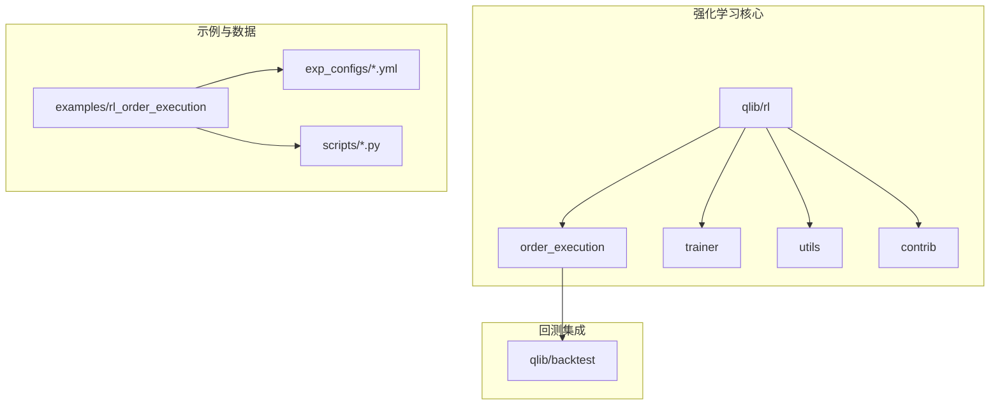
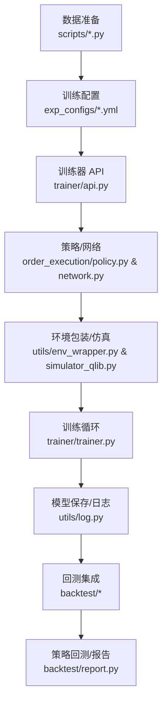
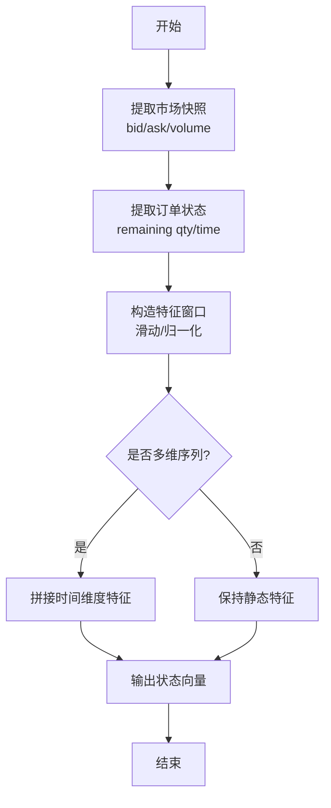
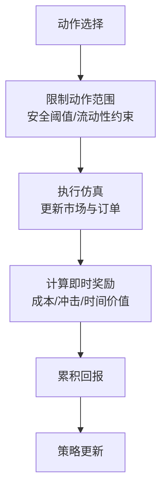
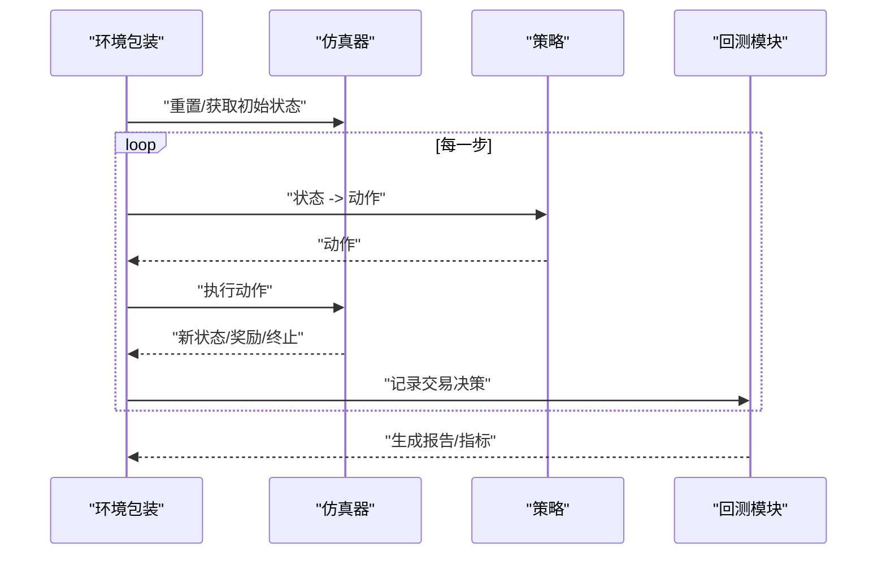
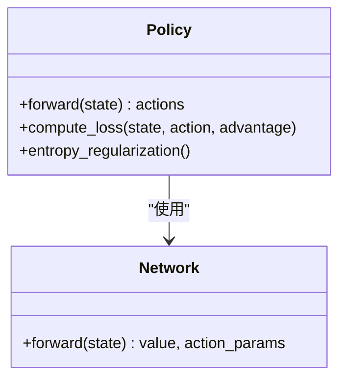
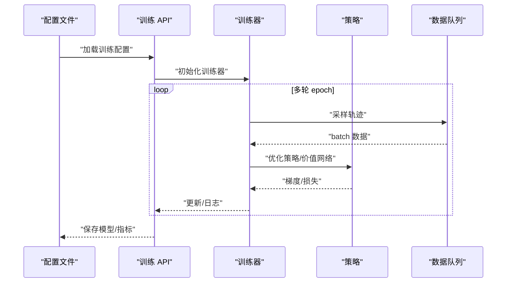
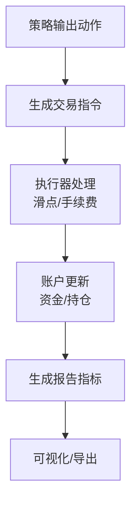
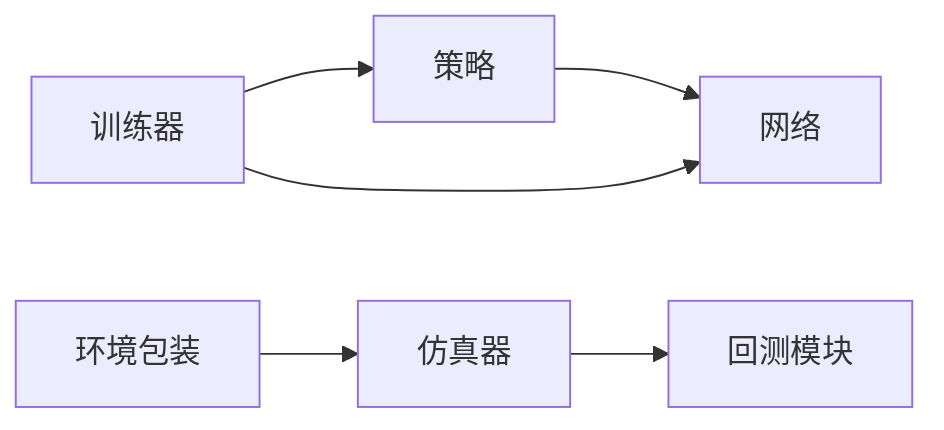

# 强化学习框架

<cite>
**本文引用的文件**
- [qlib/rl/__init__.py](file://qlib/rl/__init__.py)
- [qlib/rl/trainer/trainer.py](file://qlib/rl/trainer/trainer.py)
- [qlib/rl/trainer/api.py](file://qlib/rl/trainer/api.py)
- [qlib/rl/trainer/callbacks.py](file://qlib/rl/trainer/callbacks.py)
- [qlib/rl/order_execution/state.py](file://qlib/rl/order_execution/state.py)
- [qlib/rl/order_execution/reward.py](file://qlib/rl/order_execution/reward.py)
- [qlib/rl/order_execution/simulator_qlib.py](file://qlib/rl/order_execution/simulator_qlib.py)
- [qlib/rl/order_execution/simulator_simple.py](file://qlib/rl/order_execution/simulator_simple.py)
- [qlib/rl/order_execution/policy.py](file://qlib/rl/order_execution/policy.py)
- [qlib/rl/order_execution/network.py](file://qlib/rl/order_execution/network.py)
- [qlib/rl/order_execution/strategy.py](file://qlib/rl/order_execution/strategy.py)
- [qlib/rl/order_execution/interpreter.py](file://qlib/rl/order_execution/interpreter.py)
- [qlib/rl/contrib/train_onpolicy.py](file://qlib/rl/contrib/train_onpolicy.py)
- [examples/rl_order_execution/exp_configs/train_ppo.yml](file://examples/rl_order_execution/exp_configs/train_ppo.yml)
- [examples/rl_order_execution/exp_configs/backtest_ppo.yml](file://examples/rl_order_execution/exp_configs/backtest_ppo.yml)
- [examples/rl_order_execution/exp_configs/train_opds.yml](file://examples/rl_order_execution/exp_configs/train_opds.yml)
- [examples/rl_order_execution/exp_configs/backtest_opds.yml](file://examples/rl_order_execution/exp_configs/backtest_opds.yml)
- [examples/rl_order_execution/scripts/gen_training_orders.py](file://examples/rl_order_execution/scripts/gen_training_orders.py)
- [examples/rl_order_execution/scripts/gen_pickle_data.py](file://examples/rl_order_execution/scripts/gen_pickle_data.py)
- [examples/rl_order_execution/scripts/merge_orders.py](file://examples/rl_order_execution/scripts/merge_orders.py)
- [qlib/rl/utils/env_wrapper.py](file://qlib/rl/utils/env_wrapper.py)
- [qlib/rl/utils/finite_env.py](file://qlib/rl/utils/finite_env.py)
- [qlib/rl/utils/data_queue.py](file://qlib/rl/utils/data_queue.py)
- [qlib/rl/utils/log.py](file://qlib/rl/utils/log.py)
- [qlib/rl/aux_info.py](file://qlib/rl/aux_info.py)
- [qlib/rl/interpreter.py](file://qlib/rl/interpreter.py)
- [qlib/rl/simulator.py](file://qlib/rl/simulator.py)
- [qlib/backtest/exchange.py](file://qlib/backtest/exchange.py)
- [qlib/backtest/executor.py](file://qlib/backtest/executor.py)
- [qlib/backtest/position.py](file://qlib/backtest/position.py)
- [qlib/backtest/report.py](file://qlib/backtest/report.py)
- [qlib/backtest/account.py](file://qlib/backtest/account.py)
- [qlib/backtest/decision.py](file://qlib/backtest/decision.py)
- [qlib/backtest/utils.py](file://qlib/backtest/utils.py)
</cite>

## 目录
1. [引言](#引言)
2. [项目结构](#项目结构)
3. [核心组件](#核心组件)
4. [架构总览](#架构总览)
5. [详细组件分析](#详细组件分析)
6. [依赖关系分析](#依赖关系分析)
7. [性能考虑](#性能考虑)
8. [故障排查指南](#故障排查指南)
9. [结论](#结论)
10. [附录](#附录)

## 引言
本文件系统性梳理 Qlib 强化学习框架在量化投资中的应用，重点覆盖订单执行策略的强化学习实现：从交易环境建模、状态空间与动作空间设计，到策略优化算法（如 PPO、OPDS）的使用与训练流程，并结合回测与评估模块，给出可操作的实践步骤与最佳实践。同时对比强化学习与传统机器学习方法的差异与优势，帮助读者快速上手并高效迭代。

## 项目结构
Qlib 的强化学习子系统位于 qlib/rl 下，围绕“环境仿真—策略—训练—回测”闭环组织，核心目录如下：
- qlib/rl/order_execution：订单执行专用模块，包含状态、奖励、仿真器、策略、网络等
- qlib/rl/trainer：训练器与 API，封装 on-policy 训练流程与回调
- qlib/rl/utils：环境包装、有限状态环境、数据队列、日志等通用工具
- qlib/rl/contrib：面向特定算法（如 OPDS）的训练辅助脚本
- examples/rl_order_execution：端到端实验配置与数据生成脚本
- qlib/backtest：与策略回测对接的交易执行、账户、报告等模块

**图表来源**
- [qlib/rl/__init__.py](file://qlib/rl/__init__.py)
- [qlib/rl/order_execution/__init__.py](file://qlib/rl/order_execution/__init__.py)
- [qlib/rl/trainer/__init__.py](file://qlib/rl/trainer/__init__.py)
- [examples/rl_order_execution/README.md](file://examples/rl_order_execution/README.md)

**章节来源**
- [qlib/rl/__init__.py](file://qlib/rl/__init__.py)
- [examples/rl_order_execution/README.md](file://examples/rl_order_execution/README.md)

## 核心组件
- 环境与仿真
  - 订单执行状态建模：状态向量、市场特征、剩余订单信息等
  - 奖励设计：基于成本、价格影响、时间价值等的量化指标
  - 仿真器：支持简单仿真与基于 Qlib 的真实市场仿真
- 策略与网络
  - 策略模块：封装动作采样、概率分布、损失计算
  - 网络模块：前馈/卷积/注意力等网络结构适配强化学习任务
- 训练器
  - on-policy 训练 API 与回调机制，支持断点续训、日志与可视化
- 工具与辅助
  - 环境包装、有限状态环境、数据队列、日志记录
- 回测与评估
  - 与 Qlib 回测模块对接，输出收益曲线、换手率、最大回撤等指标

**章节来源**
- [qlib/rl/order_execution/state.py](file://qlib/rl/order_execution/state.py)
- [qlib/rl/order_execution/reward.py](file://qlib/rl/order_execution/reward.py)
- [qlib/rl/order_execution/simulator_qlib.py](file://qlib/rl/order_execution/simulator_qlib.py)
- [qlib/rl/order_execution/policy.py](file://qlib/rl/order_execution/policy.py)
- [qlib/rl/order_execution/network.py](file://qlib/rl/order_execution/network.py)
- [qlib/rl/trainer/trainer.py](file://qlib/rl/trainer/trainer.py)
- [qlib/rl/trainer/api.py](file://qlib/rl/trainer/api.py)
- [qlib/rl/utils/env_wrapper.py](file://qlib/rl/utils/env_wrapper.py)
- [qlib/rl/utils/finite_env.py](file://qlib/rl/utils/finite_env.py)
- [qlib/rl/utils/data_queue.py](file://qlib/rl/utils/data_queue.py)
- [qlib/rl/utils/log.py](file://qlib/rl/utils/log.py)

## 架构总览
下图展示了从数据准备到策略训练再到回测评估的完整流程，以及各模块间的交互关系。

**图表来源**
- [examples/rl_order_execution/scripts/gen_training_orders.py](file://examples/rl_order_execution/scripts/gen_training_orders.py)
- [examples/rl_order_execution/exp_configs/train_ppo.yml](file://examples/rl_order_execution/exp_configs/train_ppo.yml)
- [qlib/rl/trainer/api.py](file://qlib/rl/trainer/api.py)
- [qlib/rl/order_execution/policy.py](file://qlib/rl/order_execution/policy.py)
- [qlib/rl/order_execution/network.py](file://qlib/rl/order_execution/network.py)
- [qlib/rl/utils/env_wrapper.py](file://qlib/rl/utils/env_wrapper.py)
- [qlib/rl/order_execution/simulator_qlib.py](file://qlib/rl/order_execution/simulator_qlib.py)
- [qlib/rl/trainer/trainer.py](file://qlib/rl/trainer/trainer.py)
- [qlib/rl/utils/log.py](file://qlib/rl/utils/log.py)
- [qlib/backtest/report.py](file://qlib/backtest/report.py)

## 详细组件分析

### 交易环境建模与状态空间
- 状态空间设计要点
  - 市场层面：买卖价差、成交量、滑点、流动性指标
  - 订单层面：剩余数量、剩余时间、目标均价、已成交比例
  - 时间与宏观：交易时段、历史统计特征
- 状态向量归一化与窗口化：通过状态模块进行标准化与滑动窗口拼接，提升模型泛化能力
- 环境包装：对原始仿真器进行包装，统一接口、处理边界条件与终止信号

**图表来源**
- [qlib/rl/order_execution/state.py](file://qlib/rl/order_execution/state.py)
- [qlib/rl/utils/env_wrapper.py](file://qlib/rl/utils/env_wrapper.py)

**章节来源**
- [qlib/rl/order_execution/state.py](file://qlib/rl/order_execution/state.py)
- [qlib/rl/utils/env_wrapper.py](file://qlib/rl/utils/env_wrapper.py)

### 奖励设计与动作空间
- 奖励函数
  - 成本最小化：直接惩罚交易成本与价格滑点
  - 时间价值：引入时间衰减项，鼓励尽快完成
  - 市场影响：惩罚对市场的异常冲击，避免大额订单一次性撮合
- 动作空间
  - 连续动作：以“当前时刻可执行份额占比”为动作，范围受限于安全阈值
  - 离散动作：将动作离散化为若干档位，降低搜索空间
- 奖励与动作的耦合：通过仿真器在每步返回即时奖励，驱动策略学习

**图表来源**
- [qlib/rl/order_execution/reward.py](file://qlib/rl/order_execution/reward.py)
- [qlib/rl/order_execution/simulator_qlib.py](file://qlib/rl/order_execution/simulator_qlib.py)

**章节来源**
- [qlib/rl/order_execution/reward.py](file://qlib/rl/order_execution/reward.py)
- [qlib/rl/order_execution/simulator_qlib.py](file://qlib/rl/order_execution/simulator_qlib.py)

### 仿真器与回测对接
- 简单仿真器：用于快速验证策略逻辑与奖励设计
- Qlib 仿真器：与真实市场仿真一致，支持滑点、手续费、流动性等现实因素
- 回测模块：与 Qlib 回测管线对接，输出净值曲线、换手率、最大回撤等指标

**图表来源**
- [qlib/rl/utils/env_wrapper.py](file://qlib/rl/utils/env_wrapper.py)
- [qlib/rl/order_execution/simulator_qlib.py](file://qlib/rl/order_execution/simulator_qlib.py)
- [qlib/backtest/report.py](file://qlib/backtest/report.py)

**章节来源**
- [qlib/rl/order_execution/simulator_simple.py](file://qlib/rl/order_execution/simulator_simple.py)
- [qlib/rl/order_execution/simulator_qlib.py](file://qlib/rl/order_execution/simulator_qlib.py)
- [qlib/backtest/report.py](file://qlib/backtest/report.py)

### 策略与网络实现
- 策略模块
  - 动作采样：支持高斯动作（连续）与分类动作（离散）
  - 概率密度与 KL 散度：用于 PPO 等算法的稳定性控制
  - 损失函数：包含价值损失、策略梯度损失与熵正则项
- 网络模块
  - 结构适配：前馈网络、卷积网络、注意力网络等
  - 输出头：分别输出动作分布参数与状态价值

**图表来源**
- [qlib/rl/order_execution/policy.py](file://qlib/rl/order_execution/policy.py)
- [qlib/rl/order_execution/network.py](file://qlib/rl/order_execution/network.py)

**章节来源**
- [qlib/rl/order_execution/policy.py](file://qlib/rl/order_execution/policy.py)
- [qlib/rl/order_execution/network.py](file://qlib/rl/order_execution/network.py)

### 训练流程与算法
- PPO（Proximal Policy Optimization）
  - 使用 on-policy 训练 API，设置裁剪参数、KL 稳定项与学习率调度
  - 配置文件示例：训练与回测配置分别位于训练与回测配置文件中
- OPDS（Orderbook-based Policy Decision Strategy）
  - 提供专用训练脚本与配置，强调订单簿特征与决策策略的结合
  - 示例脚本：生成训练订单、pickle 数据与合并数据集

**图表来源**
- [qlib/rl/trainer/api.py](file://qlib/rl/trainer/api.py)
- [qlib/rl/trainer/trainer.py](file://qlib/rl/trainer/trainer.py)
- [qlib/rl/utils/data_queue.py](file://qlib/rl/utils/data_queue.py)
- [examples/rl_order_execution/exp_configs/train_ppo.yml](file://examples/rl_order_execution/exp_configs/train_ppo.yml)
- [examples/rl_order_execution/exp_configs/train_opds.yml](file://examples/rl_order_execution/exp_configs/train_opds.yml)

**章节来源**
- [qlib/rl/contrib/train_onpolicy.py](file://qlib/rl/contrib/train_onpolicy.py)
- [qlib/rl/trainer/api.py](file://qlib/rl/trainer/api.py)
- [qlib/rl/trainer/trainer.py](file://qlib/rl/trainer/trainer.py)
- [examples/rl_order_execution/exp_configs/train_ppo.yml](file://examples/rl_order_execution/exp_configs/train_ppo.yml)
- [examples/rl_order_execution/exp_configs/train_opds.yml](file://examples/rl_order_execution/exp_configs/train_opds.yml)
- [examples/rl_order_execution/scripts/gen_training_orders.py](file://examples/rl_order_execution/scripts/gen_training_orders.py)
- [examples/rl_order_execution/scripts/gen_pickle_data.py](file://examples/rl_order_execution/scripts/gen_pickle_data.py)
- [examples/rl_order_execution/scripts/merge_orders.py](file://examples/rl_order_execution/scripts/merge_orders.py)

### 回测与评估
- 回测模块
  - 交易执行：支持限价/市价委托、滑点与手续费
  - 账户管理：资金、持仓、费用与收益追踪
  - 报告生成：净值曲线、年化收益、最大回撤、夏普比率等
- 与策略的集成
  - 将策略输出的动作映射为交易决策，驱动回测流水线

**图表来源**
- [qlib/backtest/executor.py](file://qlib/backtest/executor.py)
- [qlib/backtest/account.py](file://qlib/backtest/account.py)
- [qlib/backtest/report.py](file://qlib/backtest/report.py)
- [qlib/backtest/decision.py](file://qlib/backtest/decision.py)

**章节来源**
- [qlib/backtest/exchange.py](file://qlib/backtest/exchange.py)
- [qlib/backtest/executor.py](file://qlib/backtest/executor.py)
- [qlib/backtest/position.py](file://qlib/backtest/position.py)
- [qlib/backtest/report.py](file://qlib/backtest/report.py)
- [qlib/backtest/account.py](file://qlib/backtest/account.py)
- [qlib/backtest/decision.py](file://qlib/backtest/decision.py)

## 依赖关系分析
- 组件内聚与耦合
  - 策略与网络高度内聚，通过 forward 接口解耦
  - 训练器与 API 通过配置驱动，降低硬编码耦合
  - 仿真器与回测模块通过统一接口对接，便于替换
- 外部依赖
  - 训练与推理依赖深度学习框架（由具体网络实现决定）
  - 回测依赖 Qlib 的数据与执行基础设施

**图表来源**
- [qlib/rl/order_execution/policy.py](file://qlib/rl/order_execution/policy.py)
- [qlib/rl/order_execution/network.py](file://qlib/rl/order_execution/network.py)
- [qlib/rl/trainer/trainer.py](file://qlib/rl/trainer/trainer.py)
- [qlib/rl/utils/env_wrapper.py](file://qlib/rl/utils/env_wrapper.py)
- [qlib/rl/order_execution/simulator_qlib.py](file://qlib/rl/order_execution/simulator_qlib.py)
- [qlib/backtest/report.py](file://qlib/backtest/report.py)

**章节来源**
- [qlib/rl/order_execution/policy.py](file://qlib/rl/order_execution/policy.py)
- [qlib/rl/order_execution/network.py](file://qlib/rl/order_execution/network.py)
- [qlib/rl/trainer/trainer.py](file://qlib/rl/trainer/trainer.py)
- [qlib/rl/utils/env_wrapper.py](file://qlib/rl/utils/env_wrapper.py)
- [qlib/rl/order_execution/simulator_qlib.py](file://qlib/rl/order_execution/simulator_qlib.py)
- [qlib/backtest/report.py](file://qlib/backtest/report.py)

## 性能考虑
- 状态与动作空间降维：通过特征工程与动作离散化减少计算复杂度
- 仿真加速：在开发阶段优先使用简单仿真器，回归阶段再切换至真实仿真器
- 批量与并行：利用数据队列与并行采样提升样本效率
- 学习率与批量大小：根据问题规模调整，避免过拟合与收敛不稳定
- 日志与可视化：及时监控损失、回报与交易行为，快速定位问题

## 故障排查指南
- 训练不收敛或回报震荡
  - 检查奖励函数是否合理，是否存在过度惩罚或奖励不足
  - 调整动作范围与裁剪参数，确保策略探索充分
- 回测与仿真偏差较大
  - 对比简单仿真器与真实仿真器的差异，逐步加入滑点、手续费等现实因素
- 数据质量与样本偏差
  - 检查数据生成脚本与配置，确保训练/验证/测试划分合理
- 内存与显存溢出
  - 减小批量大小、缩短轨迹长度或降低网络复杂度

**章节来源**
- [qlib/rl/utils/log.py](file://qlib/rl/utils/log.py)
- [qlib/rl/order_execution/simulator_qlib.py](file://qlib/rl/order_execution/simulator_qlib.py)
- [examples/rl_order_execution/scripts/gen_training_orders.py](file://examples/rl_order_execution/scripts/gen_training_orders.py)

## 结论
Qlib 强化学习框架提供了从环境建模、策略设计、训练优化到回测评估的一体化能力。通过清晰的状态与奖励设计、灵活的策略与网络结构、稳定的 on-policy 训练流程，以及与 Qlib 回测体系的无缝对接，用户可以高效地构建与优化订单执行策略。建议在实践中先以简单仿真器验证想法，再逐步引入真实市场仿真与更复杂的奖励设计，最终通过回测报告与可视化指标持续迭代。

## 附录
- 实用路径索引
  - 训练配置：[train_ppo.yml](file://examples/rl_order_execution/exp_configs/train_ppo.yml)，[train_opds.yml](file://examples/rl_order_execution/exp_configs/train_opds.yml)
  - 回测配置：[backtest_ppo.yml](file://examples/rl_order_execution/exp_configs/backtest_ppo.yml)，[backtest_opds.yml](file://examples/rl_order_execution/exp_configs/backtest_opds.yml)
  - 数据生成脚本：[gen_training_orders.py](file://examples/rl_order_execution/scripts/gen_training_orders.py)，[gen_pickle_data.py](file://examples/rl_order_execution/scripts/gen_pickle_data.py)，[merge_orders.py](file://examples/rl_order_execution/scripts/merge_orders.py)
  - 训练 API：[trainer/api.py](file://qlib/rl/trainer/api.py)
  - 训练器：[trainer/trainer.py](file://qlib/rl/trainer/trainer.py)
  - 策略与网络：[order_execution/policy.py](file://qlib/rl/order_execution/policy.py)，[order_execution/network.py](file://qlib/rl/order_execution/network.py)
  - 环境与仿真：[utils/env_wrapper.py](file://qlib/rl/utils/env_wrapper.py)，[order_execution/simulator_qlib.py](file://qlib/rl/order_execution/simulator_qlib.py)
  - 回测模块：[backtest/report.py](file://qlib/backtest/report.py)