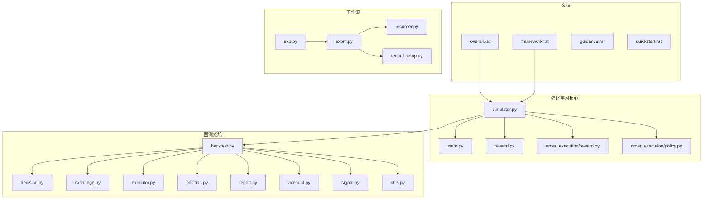
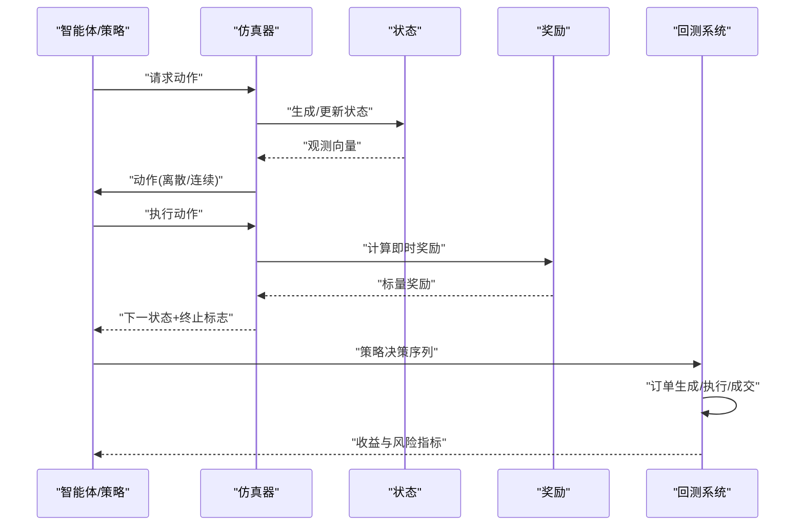
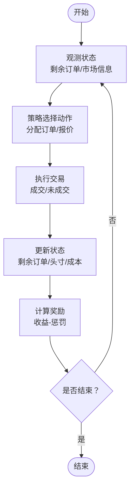
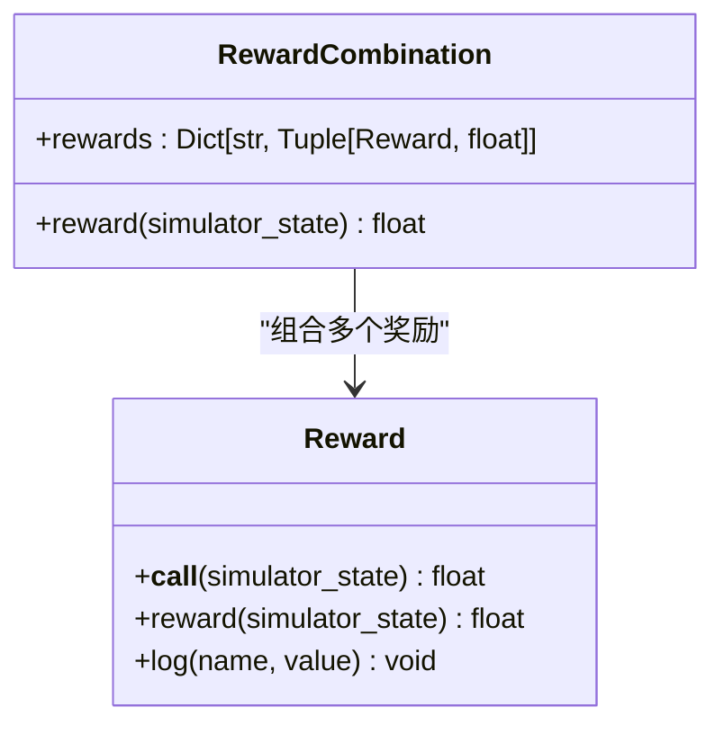
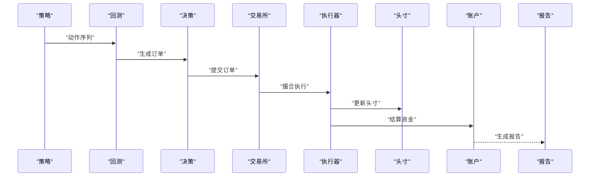
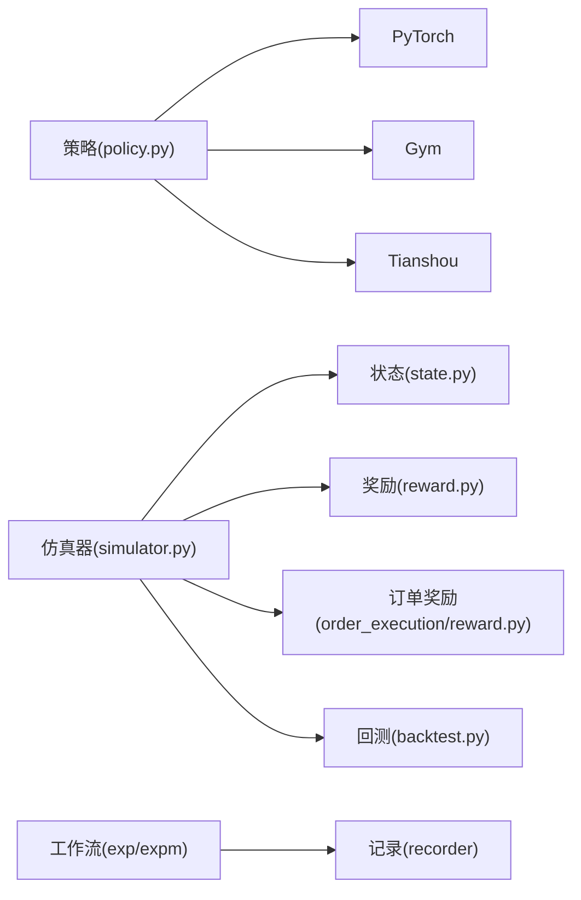

# 强化学习理论基础

<cite>
**本文引用的文件**
- [overall.rst](file://docs/component/rl/overall.rst)
- [framework.rst](file://docs/component/rl/framework.rst)
- [guidance.rst](file://docs/component/rl/guidance.rst)
- [quickstart.rst](file://docs/component/rl/quickstart.rst)
- [simulator.py](file://qlib/rl/simulator.py)
- [state.py](file://qlib/rl/order_execution/state.py)
- [simulator_qlib.py](file://qlib/rl/order_execution/simulator_qlib.py)
- [reward.py](file://qlib/rl/reward.py)
- [order_execution/reward.py](file://qlib/rl/order_execution/reward.py)
- [policy.py](file://qlib/rl/order_execution/policy.py)
- [backtest.py](file://qlib/backtest/backtest.py)
- [decision.py](file://qlib/backtest/decision.py)
- [exchange.py](file://qlib/backtest/exchange.py)
- [executor.py](file://qlib/backtest/executor.py)
- [position.py](file://qlib/backtest/position.py)
- [report.py](file://qlib/backtest/report.py)
- [account.py](file://qlib/backtest/account.py)
- [signal.py](file://qlib/backtest/signal.py)
- [utils.py](file://qlib/backtest/utils.py)
- [exp.py](file://qlib/workflow/exp.py)
- [expm.py](file://qlib/workflow/expm.py)
- [recorder.py](file://qlib/workflow/recorder.py)
- [record_temp.py](file://qlib/workflow/record_temp.py)
- [test_qlib_simulator.py](file://tests/rl/test_qlib_simulator.py)
- [test_saoe_simple.py](file://tests/rl/test_saoe_simple.py)
- [test_trainer.py](file://tests/rl/test_trainer.py)
</cite>

## 目录
1. [引言](#引言)
2. [项目结构](#项目结构)
3. [核心组件](#核心组件)
4. [架构总览](#架构总览)
5. [详细组件分析](#详细组件分析)
6. [依赖关系分析](#依赖关系分析)
7. [性能考量](#性能考量)
8. [故障排查指南](#故障排查指南)
9. [结论](#结论)
10. [附录](#附录)

## 引言
本文件系统性梳理强化学习（Reinforcement Learning, RL）的理论基础，并结合 Qlib 代码库中与量化交易相关的强化学习实现，给出从 MDP、贝尔曼方程、价值函数到策略优化的完整知识图谱。同时，针对量化交易中的订单执行、市场仿真、奖励设计与回测评估等关键环节，提供可落地的建模思路与实践建议。

## 项目结构
Qlib 的强化学习相关模块主要分布在以下位置：
- 文档：docs/component/rl/*.rst，涵盖总体介绍、框架、指导与快速入门
- 核心 RL 组件：qlib/rl/*，包括通用仿真器、状态/奖励/策略封装
- 订单执行专用模块：qlib/rl/order_execution/*，覆盖 SAOE（Sequential Agent-Order Execution）场景
- 回测子系统：qlib/backtest/*，用于将策略决策映射为真实交易执行与收益评估
- 工作流：qlib/workflow/*，实验编排与记录
- 测试：tests/rl/*，验证仿真器、策略与训练流程

**图表来源**
- [overall.rst:1-31](file://docs/component/rl/overall.rst#L1-L31)
- [framework.rst](file://docs/component/rl/framework.rst)
- [simulator.py](file://qlib/rl/simulator.py)
- [state.py](file://qlib/rl/order_execution/state.py)
- [reward.py:1-85](file://qlib/rl/reward.py#L1-L85)
- [order_execution/reward.py:43-69](file://qlib/rl/order_execution/reward.py#L43-L69)
- [policy.py:1-208](file://qlib/rl/order_execution/policy.py#L1-L208)
- [backtest.py](file://qlib/backtest/backtest.py)
- [decision.py](file://qlib/backtest/decision.py)
- [exchange.py](file://qlib/backtest/exchange.py)
- [executor.py](file://qlib/backtest/executor.py)
- [position.py](file://qlib/backtest/position.py)
- [report.py](file://qlib/backtest/report.py)
- [account.py](file://qlib/backtest/account.py)
- [signal.py](file://qlib/backtest/signal.py)
- [utils.py](file://qlib/backtest/utils.py)
- [exp.py](file://qlib/workflow/exp.py)
- [expm.py](file://qlib/workflow/expm.py)
- [recorder.py](file://qlib/workflow/recorder.py)
- [record_temp.py](file://qlib/workflow/record_temp.py)

**章节来源**
- [overall.rst:1-31](file://docs/component/rl/overall.rst#L1-L31)
- [framework.rst](file://docs/component/rl/framework.rst)
- [quickstart.rst](file://docs/component/rl/quickstart.rst)

## 核心组件
- 仿真器（Simulator）：抽象环境交互接口，定义状态转移、奖励计算与终止条件，支持通用与订单执行场景
- 状态（State）：封装观测空间，提供时序状态表示与特征工程能力
- 奖励（Reward）：定义回报函数，支持组合与日志记录
- 策略（Policy）：封装 PPO、DQN 等算法，提供训练与推理接口
- 回测（Backtest）：将策略输出映射为订单、成交、头寸与报告，形成闭环评估

**章节来源**
- [simulator.py](file://qlib/rl/simulator.py)
- [state.py](file://qlib/rl/order_execution/state.py)
- [reward.py:1-85](file://qlib/rl/reward.py#L1-L85)
- [order_execution/reward.py:43-69](file://qlib/rl/order_execution/reward.py#L43-L69)
- [policy.py:1-208](file://qlib/rl/order_execution/policy.py#L1-L208)
- [backtest.py](file://qlib/backtest/backtest.py)

## 架构总览
下图展示了从“策略—仿真—回测”的端到端流程，以及与工作流系统的集成点。

**图表来源**
- [simulator.py](file://qlib/rl/simulator.py)
- [state.py](file://qlib/rl/order_execution/state.py)
- [reward.py:1-85](file://qlib/rl/reward.py#L1-L85)
- [order_execution/reward.py:43-69](file://qlib/rl/order_execution/reward.py#L43-L69)
- [backtest.py](file://qlib/backtest/backtest.py)

## 详细组件分析

### 马尔可夫决策过程（MDP）
- 定义：由状态集合 S、动作集合 A、转移概率 P(s'|s,a)、即时奖励 R(s,a)、折扣因子 γ 和初始分布构成
- 在量化交易中的映射：
  - 状态 S：包含价格、成交量、技术指标、账户信息、市场情绪等多源特征
  - 动作 A：买入/卖出/持有（离散），或下单量与价格（连续）
  - 奖励 R：基于收益、风险调整后的回报、冲击成本与机会成本
  - 转移：由市场动态与交易执行共同决定
- 关键假设：状态需满足马尔可夫性质，即当前状态包含历史信息的充分统计量

**章节来源**
- [overall.rst:7-8](file://docs/component/rl/overall.rst#L7-L8)

### 贝尔曼方程与价值函数
- 最优值函数与策略价值函数的递归定义，体现“即时回报+折扣未来回报”的思想
- 在线性/深度方法中，通过函数逼近（如线性回归、神经网络）估计 V 或 Q
- 在量化交易中，价值函数可解释为“在给定状态下采取最优动作序列的期望折现回报”

**章节来源**
- [overall.rst:7-8](file://docs/component/rl/overall.rst#L7-L8)

### 策略与价值函数估计
- 策略 π(a|s)：将状态映射为动作分布；在量化交易中常采用 ε-贪心、Softmax 或基于 Actor-Critic 的参数化策略
- 价值函数 V^π(s)、Q^π(s,a)：衡量策略下的状态或状态-动作价值
- 在 Qlib 中，策略以 PPO/DQN 等算法封装，具备经验回放、裁剪、目标网络等工程化改进

**章节来源**
- [policy.py:114-158](file://qlib/rl/order_execution/policy.py#L114-L158)
- [policy.py:164-208](file://qlib/rl/order_execution/policy.py#L164-L208)

### 订单执行与 SAOE 仿真
- SAOE（Sequential Agent-Order Execution）将交易过程建模为序列化决策，强调时间维度上的动态交互
- 状态空间：包含剩余订单量、市场流动性、价格驱动、时间窗口等
- 动作空间：按步分配剩余订单，或直接报价
- 奖励函数：综合价格收益与惩罚项（延迟、冲击、滑点）

**图表来源**
- [state.py](file://qlib/rl/order_execution/state.py)
- [order_execution/reward.py:43-69](file://qlib/rl/order_execution/reward.py#L43-L69)
- [simulator_qlib.py](file://qlib/rl/order_execution/simulator_qlib.py)

**章节来源**
- [state.py](file://qlib/rl/order_execution/state.py)
- [order_execution/reward.py:43-69](file://qlib/rl/order_execution/reward.py#L43-L69)
- [simulator_qlib.py](file://qlib/rl/order_execution/simulator_qlib.py)

### 奖励设计原则
- 可解释性：奖励应能反映策略的真实收益与风险
- 平衡性：在收益最大化与成本控制之间取得平衡
- 稳健性：对噪声与异常波动不敏感
- 可扩展性：支持多目标组合（如收益、换手率、最大回撤等）

**图表来源**
- [reward.py:16-51](file://qlib/rl/reward.py#L16-L51)

**章节来源**
- [reward.py:1-85](file://qlib/rl/reward.py#L1-L85)
- [order_execution/reward.py:43-69](file://qlib/rl/order_execution/reward.py#L43-L69)

### 策略算法对比与适用场景
- PPO（近端策略优化）：适合连续/离散动作空间，具有稳定的梯度更新与裁剪机制，适用于复杂状态空间的策略网络
- DQN（深度 Q 网络）：适合离散动作空间，利用经验回放与目标网络提升稳定性，适用于订单拆分等离散决策
- 其他：根据动作空间与状态复杂度选择合适算法；在量化交易中常结合市场微观结构约束与成本模型

**章节来源**
- [policy.py:114-158](file://qlib/rl/order_execution/policy.py#L114-L158)
- [policy.py:164-208](file://qlib/rl/order_execution/policy.py#L164-L208)

### 从策略到回测的闭环
- 策略输出的动作经回测系统转换为订单，再由交易所模拟器执行，最终汇总为收益与风险指标
- 回测模块提供账户、头寸、信号、报告等能力，支撑策略评估与可视化

**图表来源**
- [backtest.py](file://qlib/backtest/backtest.py)
- [decision.py](file://qlib/backtest/decision.py)
- [exchange.py](file://qlib/backtest/exchange.py)
- [executor.py](file://qlib/backtest/executor.py)
- [position.py](file://qlib/backtest/position.py)
- [account.py](file://qlib/backtest/account.py)
- [report.py](file://qlib/backtest/report.py)
- [signal.py](file://qlib/backtest/signal.py)
- [utils.py](file://qlib/backtest/utils.py)

**章节来源**
- [backtest.py](file://qlib/backtest/backtest.py)
- [decision.py](file://qlib/backtest/decision.py)
- [exchange.py](file://qlib/backtest/exchange.py)
- [executor.py](file://qlib/backtest/executor.py)
- [position.py](file://qlib/backtest/position.py)
- [account.py](file://qlib/backtest/account.py)
- [report.py](file://qlib/backtest/report.py)
- [signal.py](file://qlib/backtest/signal.py)
- [utils.py](file://qlib/backtest/utils.py)

## 依赖关系分析
- 模块内聚：仿真器与状态/奖励/策略解耦，便于替换与扩展
- 外部依赖：策略封装依赖 tianshou（PPO/DQN）、PyTorch（网络）、gym（空间定义）
- 工作流集成：通过实验编排与记录器统一管理训练/评估流程

**图表来源**
- [policy.py:1-208](file://qlib/rl/order_execution/policy.py#L1-L208)
- [simulator.py](file://qlib/rl/simulator.py)
- [state.py](file://qlib/rl/order_execution/state.py)
- [reward.py:1-85](file://qlib/rl/reward.py#L1-L85)
- [order_execution/reward.py:43-69](file://qlib/rl/order_execution/reward.py#L43-L69)
- [backtest.py](file://qlib/backtest/backtest.py)
- [exp.py](file://qlib/workflow/exp.py)
- [expm.py](file://qlib/workflow/expm.py)
- [recorder.py](file://qlib/workflow/recorder.py)

**章节来源**
- [policy.py:1-208](file://qlib/rl/order_execution/policy.py#L1-L208)
- [simulator.py](file://qlib/rl/simulator.py)
- [state.py](file://qlib/rl/order_execution/state.py)
- [reward.py:1-85](file://qlib/rl/reward.py#L1-L85)
- [order_execution/reward.py:43-69](file://qlib/rl/order_execution/reward.py#L43-L69)
- [backtest.py](file://qlib/backtest/backtest.py)
- [exp.py](file://qlib/workflow/exp.py)
- [expm.py](file://qlib/workflow/expm.py)
- [recorder.py](file://qlib/workflow/recorder.py)

## 性能考量
- 状态维度与稀疏性：高维状态可能引发维度灾难，建议采用降维或注意力机制
- 奖励缩放与归一化：合理缩放可加速收敛并提升稳定性
- 经验回放与目标网络：DQN 类算法需注意过拟合与漂移
- 训练与回测一致性：避免数据泄露，确保交易成本与流动性模型一致
- 并行化与缓存：在数据加载与仿真阶段引入缓存与并行策略

[本节为通用指导，无需特定文件来源]

## 故障排查指南
- 奖励非法：若出现 NaN/Inf 奖励，检查状态边界与惩罚项设置
- 训练不收敛：检查学习率、折扣因子、裁剪阈值与网络结构
- 回测偏差：核对订单生成逻辑、执行器参数与市场冲击模型
- 测试用例：参考仿真器与策略测试，定位问题范围

**章节来源**
- [order_execution/reward.py:43-69](file://qlib/rl/order_execution/reward.py#L43-L69)
- [test_qlib_simulator.py](file://tests/rl/test_qlib_simulator.py)
- [test_saoe_simple.py](file://tests/rl/test_saoe_simple.py)
- [test_trainer.py](file://tests/rl/test_trainer.py)

## 结论
Qlib 的强化学习模块提供了从仿真、策略到回测的一体化框架，能够有效支持量化交易中的序列化决策问题。通过清晰的状态/动作/奖励建模与稳健的算法封装，可在保证理论严谨性的同时实现工程化落地。

[本节为总结，无需特定文件来源]

## 附录
- 快速上手：参考文档中的快速入门与框架说明，了解模块职责与调用方式
- 实践建议：优先从 SAOE 场景入手，逐步扩展至更复杂的市场仿真与多资产策略

**章节来源**
- [quickstart.rst](file://docs/component/rl/quickstart.rst)
- [framework.rst](file://docs/component/rl/framework.rst)