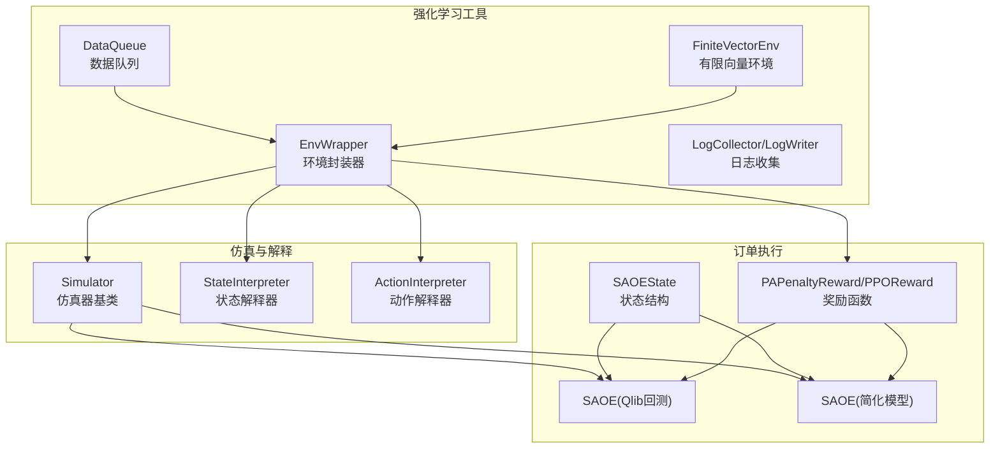
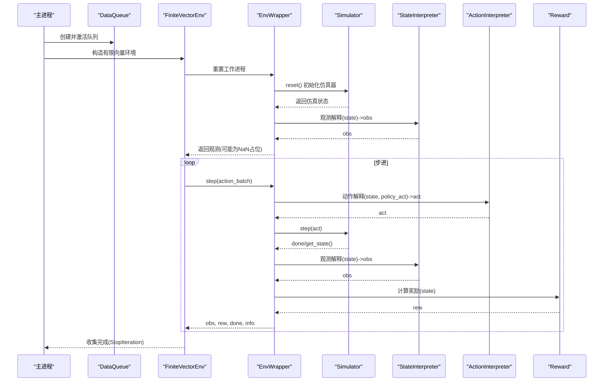
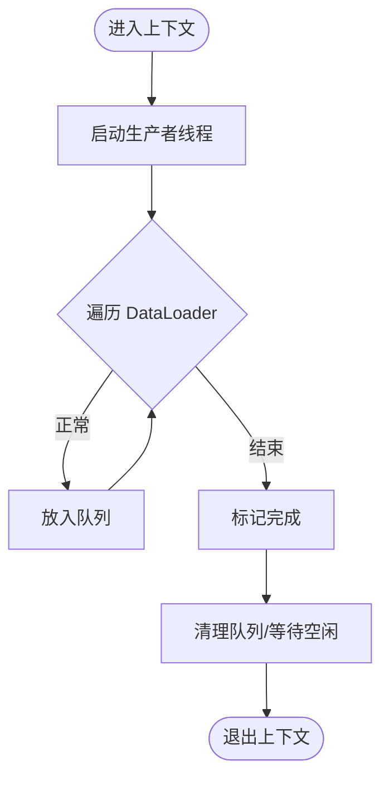
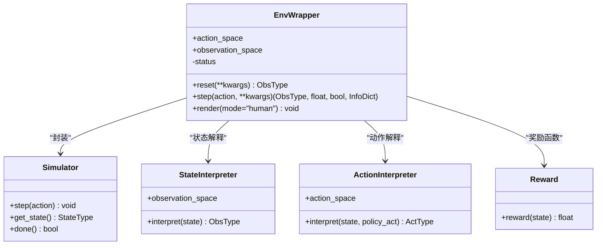
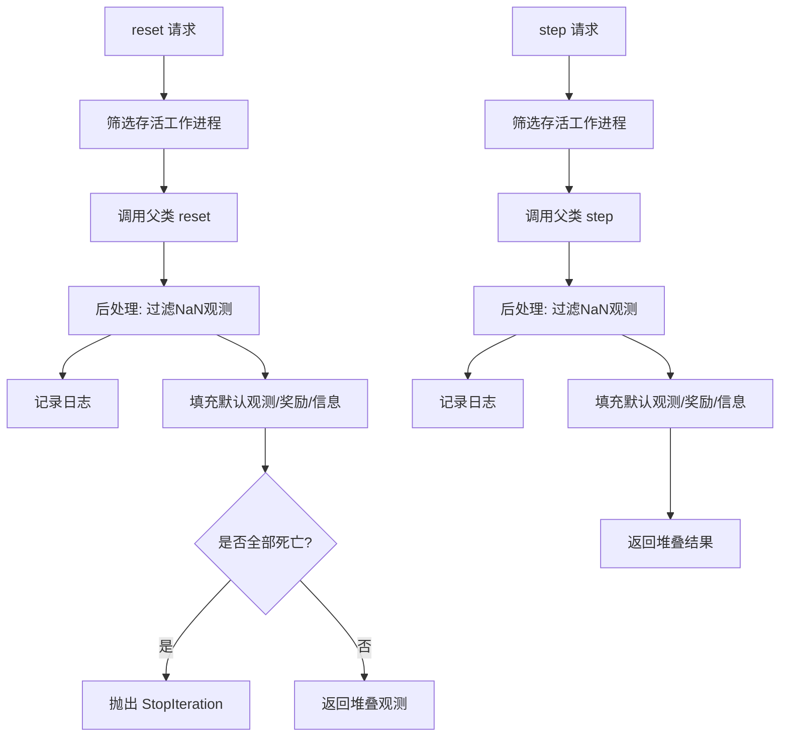
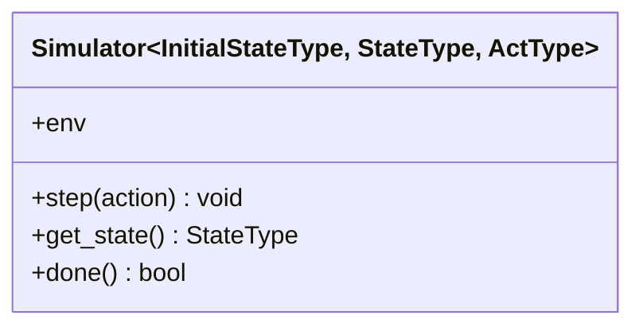
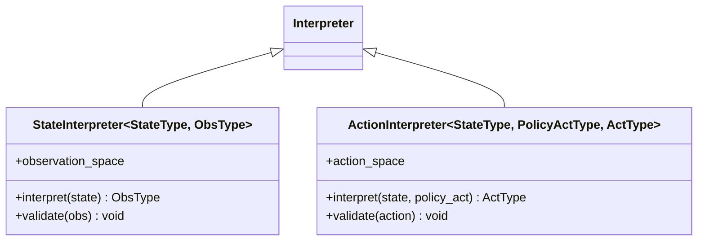
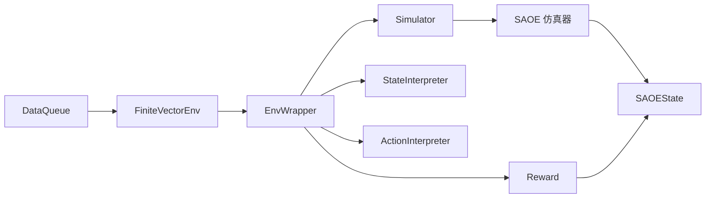

# 数据系统与环境建模

<cite>
**本文引用的文件**
- [data_queue.py](file://qlib/rl/utils/data_queue.py)
- [env_wrapper.py](file://qlib/rl/utils/env_wrapper.py)
- [finite_env.py](file://qlib/rl/utils/finite_env.py)
- [simulator.py](file://qlib/rl/simulator.py)
- [interpreter.py](file://qlib/rl/interpreter.py)
- [state.py](file://qlib/rl/order_execution/state.py)
- [reward.py](file://qlib/rl/order_execution/reward.py)
- [simulator_qlib.py](file://qlib/rl/order_execution/simulator_qlib.py)
- [simulator_simple.py](file://qlib/rl/order_execution/simulator_simple.py)
</cite>

## 目录
1. [引言](#引言)
2. [项目结构](#项目结构)
3. [核心组件](#核心组件)
4. [架构总览](#架构总览)
5. [详细组件分析](#详细组件分析)
6. [依赖分析](#依赖分析)
7. [性能考虑](#性能考虑)
8. [故障排查指南](#故障排查指南)
9. [结论](#结论)
10. [附录](#附录)

## 引言
本文件面向强化学习数据系统与交易环境建模，系统性梳理 Qlib 中 RL 子系统的数据加载与预处理、环境封装与向量化、状态/动作/奖励建模以及接口标准化实现。重点覆盖以下方面：
- 数据队列管理：主进程生产、子进程消费、可复用的有限/无限数据流
- 环境封装器：将仿真器、解释器、奖励函数、辅助信息收集器整合为标准 Gym 环境
- 向量环境适配：在有限种子场景下保证“每个种子恰好被一个工作进程消费”
- 交易环境建模：单资产订单执行（SAOE）的状态空间、动作空间、奖励函数
- 接口标准化：reset、step、render 等核心方法的职责边界与返回约定
- 配置与调优：数据队列参数、向量并发策略、奖励函数超参
- 实战示例与性能优化：从数据到训练的端到端建议

## 项目结构
本节聚焦强化学习相关模块的组织方式与职责划分：
- utils：数据队列、环境封装器、有限向量环境、日志收集
- rl：仿真器基类、解释器基类、订单执行相关仿真器与奖励
- order_execution：SAOE 的状态结构、奖励函数、仿真器（基于 Qlib 回测或简化模型）

**图表来源**
- [data_queue.py:24-189](file://qlib/rl/utils/data_queue.py#L24-L189)
- [env_wrapper.py:51-251](file://qlib/rl/utils/env_wrapper.py#L51-L251)
- [finite_env.py:89-370](file://qlib/rl/utils/finite_env.py#L89-L370)
- [simulator.py:21-76](file://qlib/rl/simulator.py#L21-L76)
- [interpreter.py:19-142](file://qlib/rl/interpreter.py#L19-L142)
- [state.py:70-102](file://qlib/rl/order_execution/state.py#L70-L102)
- [reward.py:17-100](file://qlib/rl/order_execution/reward.py#L17-L100)
- [simulator_qlib.py:19-142](file://qlib/rl/order_execution/simulator_qlib.py#L19-L142)
- [simulator_simple.py:24-363](file://qlib/rl/order_execution/simulator_simple.py#L24-L363)

**章节来源**
- [data_queue.py:24-189](file://qlib/rl/utils/data_queue.py#L24-L189)
- [env_wrapper.py:51-251](file://qlib/rl/utils/env_wrapper.py#L51-L251)
- [finite_env.py:89-370](file://qlib/rl/utils/finite_env.py#L89-L370)
- [simulator.py:21-76](file://qlib/rl/simulator.py#L21-L76)
- [interpreter.py:19-142](file://qlib/rl/interpreter.py#L19-L142)
- [state.py:70-102](file://qlib/rl/order_execution/state.py#L70-L102)
- [reward.py:17-100](file://qlib/rl/order_execution/reward.py#L17-L100)
- [simulator_qlib.py:19-142](file://qlib/rl/order_execution/simulator_qlib.py#L19-L142)
- [simulator_simple.py:24-363](file://qlib/rl/order_execution/simulator_simple.py#L24-L363)

## 核心组件
- 数据队列 DataQueue：以多进程队列承载数据点，支持重复次数、打乱、工作线程数与队列上限；提供迭代器接口与守护清理逻辑
- 环境封装器 EnvWrapper：将仿真器、状态/动作解释器、奖励函数、辅助信息收集器与日志聚合器组合为标准 Gym 环境
- 有限向量环境 FiniteVectorEnv：在向量化场景中确保“每个种子仅被一个工作进程消费”，并提供日志聚合
- 仿真器基类 Simulator：约束状态读写与步进接口，明确生命周期与类型参数
- 解释器 Interpreter：双向往解释器，负责状态到观测与策略动作到仿真动作的转换
- 订单执行仿真器：基于 Qlib 回测或简化模型的 SAOE 仿真器，提供状态结构与步进逻辑
- 奖励函数：针对 SAOE 的价格优势惩罚型奖励与论文版奖励

**章节来源**
- [data_queue.py:24-189](file://qlib/rl/utils/data_queue.py#L24-L189)
- [env_wrapper.py:51-251](file://qlib/rl/utils/env_wrapper.py#L51-L251)
- [finite_env.py:89-370](file://qlib/rl/utils/finite_env.py#L89-L370)
- [simulator.py:21-76](file://qlib/rl/simulator.py#L21-L76)
- [interpreter.py:19-142](file://qlib/rl/interpreter.py#L19-L142)
- [state.py:70-102](file://qlib/rl/order_execution/state.py#L70-L102)
- [reward.py:17-100](file://qlib/rl/order_execution/reward.py#L17-L100)
- [simulator_qlib.py:19-142](file://qlib/rl/order_execution/simulator_qlib.py#L19-L142)
- [simulator_simple.py:24-363](file://qlib/rl/order_execution/simulator_simple.py#L24-L363)

## 架构总览
下面的序列图展示从数据队列到环境封装器再到仿真器的完整调用链路，以及有限向量环境如何在收集阶段进行“死亡工作进程”剔除与日志聚合。

**图表来源**
- [data_queue.py:167-189](file://qlib/rl/utils/data_queue.py#L167-L189)
- [env_wrapper.py:146-247](file://qlib/rl/utils/env_wrapper.py#L146-L247)
- [finite_env.py:210-298](file://qlib/rl/utils/finite_env.py#L210-L298)
- [interpreter.py:35-99](file://qlib/rl/interpreter.py#L35-L99)
- [simulator.py:54-76](file://qlib/rl/simulator.py#L54-L76)
- [reward.py:33-50](file://qlib/rl/order_execution/reward.py#L33-L50)

**章节来源**
- [env_wrapper.py:146-247](file://qlib/rl/utils/env_wrapper.py#L146-L247)
- [finite_env.py:210-298](file://qlib/rl/utils/finite_env.py#L210-L298)
- [interpreter.py:35-99](file://qlib/rl/interpreter.py#L35-L99)
- [simulator.py:54-76](file://qlib/rl/simulator.py#L54-L76)
- [reward.py:33-50](file://qlib/rl/order_execution/reward.py#L33-L50)

## 详细组件分析

### 数据队列 DataQueue
- 职责：主进程使用 DataLoader 将数据集按批次产出至多进程队列；子进程通过迭代器安全拉取
- 关键点：
  - 自动设置队列上限，避免阻塞
  - 可配置重复次数（-1 表示无限）
  - 多工作线程并行加载
  - 提供 get/put/mark_as_done/cleanup 等生命周期管理
- 使用建议：
  - 在训练时设置 repeat=-1 并合理配置 producer_num_workers
  - 在推理时设置有限 repeat，确保轨迹完整结束

**图表来源**
- [data_queue.py:167-189](file://qlib/rl/utils/data_queue.py#L167-L189)

**章节来源**
- [data_queue.py:24-189](file://qlib/rl/utils/data_queue.py#L24-L189)

### 环境封装器 EnvWrapper
- 职责：将仿真器、状态/动作解释器、奖励函数、辅助信息收集器与日志聚合器统一为 Gym 环境
- 核心方法：
  - reset：从种子迭代器取初始状态，初始化仿真器，生成观测
  - step：动作解释 -> 仿真步进 -> 状态观测 -> 奖励计算 -> 日志记录 -> 返回
  - render：未实现（抛出异常）
- 状态结构：记录当前步数、是否结束、历史观测/动作/奖励等
- 注意事项：
  - 种子耗尽时返回 NaN 占位观测，由有限向量环境识别并剔除
  - 解释器与奖励函数通过弱引用访问环境，避免循环引用

**图表来源**
- [env_wrapper.py:51-251](file://qlib/rl/utils/env_wrapper.py#L51-L251)
- [simulator.py:21-76](file://qlib/rl/simulator.py#L21-L76)
- [interpreter.py:35-99](file://qlib/rl/interpreter.py#L35-L99)
- [reward.py:17-50](file://qlib/rl/order_execution/reward.py#L17-L50)

**章节来源**
- [env_wrapper.py:51-251](file://qlib/rl/utils/env_wrapper.py#L51-L251)
- [interpreter.py:35-99](file://qlib/rl/interpreter.py#L35-L99)
- [simulator.py:21-76](file://qlib/rl/simulator.py#L21-L76)
- [reward.py:17-50](file://qlib/rl/order_execution/reward.py#L17-L50)

### 有限向量环境 FiniteVectorEnv
- 背景：为解决向量化收集器对“每个种子仅被一个工作进程消费”的约束缺失，提供有限种子场景下的正确行为
- 关键机制：
  - 识别 NaN 占位观测并剔除对应工作进程
  - 维护存活工作进程集合，全部结束后抛出 StopIteration
  - 提供 collector_guard 上下文，统一触发日志生命周期事件
- 类型：支持 dummy/subproc/shmem 三种并行模式

**图表来源**
- [finite_env.py:210-298](file://qlib/rl/utils/finite_env.py#L210-L298)

**章节来源**
- [finite_env.py:89-370](file://qlib/rl/utils/finite_env.py#L89-L370)

### 仿真器基类 Simulator
- 约束与契约：
  - 仅能通过 step 修改内部状态
  - 外部通过 get_state 读取状态，done 判断终止
  - 生命周期：从初始状态开始，轨迹结束后回收
- 类型参数：
  - InitialStateType：初始种子类型
  - StateType：仿真状态类型
  - ActType：仿真动作类型

**图表来源**
- [simulator.py:21-76](file://qlib/rl/simulator.py#L21-L76)

**章节来源**
- [simulator.py:21-76](file://qlib/rl/simulator.py#L21-L76)

### 解释器 Interpreter
- 状态解释器 StateInterpreter：将仿真状态映射到策略观测，需提供观测空间并校验输出
- 动作解释器 ActionInterpreter：将策略动作映射到仿真动作，需提供动作空间并校验输入
- 校验机制：增强版 gym 空间包含检查，失败时抛出带诊断信息的异常

**图表来源**
- [interpreter.py:19-142](file://qlib/rl/interpreter.py#L19-L142)

**章节来源**
- [interpreter.py:19-142](file://qlib/rl/interpreter.py#L19-L142)

### 订单执行状态与仿真器

#### 状态结构 SAOEState
- 包含订单、当前时间/步、剩余头寸、历史成交与步骤指标、回测数据索引、每步刻度等
- 用于解释器生成观测与奖励函数计算

**章节来源**
- [state.py:70-102](file://qlib/rl/order_execution/state.py#L70-L102)

#### 奖励函数
- PAPenaltyReward：鼓励价格优势但惩罚短期内集中执行，包含惩罚系数与缩放因子
- PPOReward：论文版奖励，基于 VWAP/TWAP 比率分档

**章节来源**
- [reward.py:17-100](file://qlib/rl/order_execution/reward.py#L17-L100)

#### 仿真器（基于 Qlib 回测）
- SingleAssetOrderExecution：基于 Qlib 回测工具链，通过策略执行器与数据采集循环推进
- 特点：可注入 Qlib 配置、支持现金限制、自动迭代策略对象

**章节来源**
- [simulator_qlib.py:19-142](file://qlib/rl/order_execution/simulator_qlib.py#L19-L142)

#### 仿真器（简化模型）
- SingleAssetOrderExecutionSimple：基于本地 pickle 数据，按刻度拆分执行量，考虑市场成交量上限与最后时刻补全
- 特点：支持特征列选择、数据粒度与每步刻度、TWAP 基准价计算、历史记录与指标汇总

**章节来源**
- [simulator_simple.py:24-363](file://qlib/rl/order_execution/simulator_simple.py#L24-L363)

## 依赖分析
- 组件耦合：
  - EnvWrapper 弱引用持有解释器、奖励函数、辅助信息收集器，降低耦合与循环引用风险
  - Simulator 与 EnvWrapper 通过弱引用反向关联，便于日志与调试
- 外部依赖：
  - 向量化环境依赖 tianshou 的 VectorEnv 家族
  - 数据加载依赖 PyTorch DataLoader（用于采样与多进程）
- 潜在环路：
  - 通过弱引用避免强依赖导致的环路
- 风险点：
  - 种子迭代器耗尽时必须返回 NaN 占位观测，否则向量环境无法正确剔除工作进程

**图表来源**
- [data_queue.py:167-189](file://qlib/rl/utils/data_queue.py#L167-L189)
- [env_wrapper.py:106-136](file://qlib/rl/utils/env_wrapper.py#L106-L136)
- [finite_env.py:313-369](file://qlib/rl/utils/finite_env.py#L313-L369)
- [simulator.py:52-52](file://qlib/rl/simulator.py#L52-L52)
- [interpreter.py:101-142](file://qlib/rl/interpreter.py#L101-L142)
- [state.py:70-102](file://qlib/rl/order_execution/state.py#L70-L102)
- [reward.py:17-50](file://qlib/rl/order_execution/reward.py#L17-L50)
- [simulator_qlib.py:19-142](file://qlib/rl/order_execution/simulator_qlib.py#L19-L142)
- [simulator_simple.py:24-363](file://qlib/rl/order_execution/simulator_simple.py#L24-L363)

**章节来源**
- [env_wrapper.py:106-136](file://qlib/rl/utils/env_wrapper.py#L106-L136)
- [finite_env.py:313-369](file://qlib/rl/utils/finite_env.py#L313-L369)
- [interpreter.py:101-142](file://qlib/rl/interpreter.py#L101-L142)
- [simulator.py:52-52](file://qlib/rl/simulator.py#L52-L52)
- [state.py:70-102](file://qlib/rl/order_execution/state.py#L70-L102)
- [reward.py:17-50](file://qlib/rl/order_execution/reward.py#L17-L50)
- [simulator_qlib.py:19-142](file://qlib/rl/order_execution/simulator_qlib.py#L19-L142)
- [simulator_simple.py:24-363](file://qlib/rl/order_execution/simulator_simple.py#L24-L363)

## 性能考虑
- 数据加载
  - 合理设置 producer_num_workers，避免 CPU 密集型数据处理成为瓶颈
  - queue_maxsize 建议与 CPU 核数匹配，防止过载
  - repeat=-1 适合训练，推理时应设为有限值以避免无限等待
- 向量环境
  - 在有限种子场景下优先使用 FiniteVectorEnv，确保“恰好一次消费”
  - 使用 collector_guard 包裹收集流程，减少异常与日志遗漏
- 仿真器
  - 简化模型适合快速原型与离线评估；真实回测模型更贴近市场细节但开销更大
  - 执行量拆分与成交量上限计算应尽量向量化，减少循环
- 奖励函数
  - 奖励缩放与惩罚系数需结合任务规模与数值稳定性调整
  - 避免在奖励中引入未来信息泄漏

[本节为通用指导，不直接分析具体文件]

## 故障排查指南
- “种子已耗尽但仍接收动作”
  - 现象：reset 成功但 step 抛错或返回 NaN 占位观测
  - 排查：确认种子迭代器是否正确传入；检查 EnvWrapper 是否正确捕获 StopIteration 并返回 NaN 占位
- “向量环境卡死或收集不到足够样本”
  - 现象：部分工作进程停滞或收集提前结束
  - 排查：确保使用 FiniteVectorEnv；在收集前包裹 collector_guard；检查是否存在未过滤的 NaN 占位观测
- “动作/观测越界或类型错误”
  - 现象：解释器校验失败抛出异常
  - 排查：核对 action_space 与 observation_space 定义；确保策略输出符合 gym 空间
- “奖励 NaN/无穷大”
  - 现象：奖励计算出现非法值
  - 排查：检查 PA 计算分母与数据完整性；确保最后一步补全逻辑正确

**章节来源**
- [env_wrapper.py:190-194](file://qlib/rl/utils/env_wrapper.py#L190-L194)
- [env_wrapper.py:201-203](file://qlib/rl/utils/env_wrapper.py#L201-L203)
- [interpreter.py:101-142](file://qlib/rl/interpreter.py#L101-L142)
- [reward.py:45-50](file://qlib/rl/order_execution/reward.py#L45-L50)
- [finite_env.py:210-258](file://qlib/rl/utils/finite_env.py#L210-L258)

## 结论
Qlib 的强化学习数据系统通过“数据队列 + 环境封装器 + 有限向量环境”的组合，实现了高效、可控且可扩展的数据驱动仿真流程。在交易环境建模方面，SAOE 的状态/动作/奖励体系清晰地将策略决策与市场微观结构相结合。遵循本文的配置与调优建议，可在保证正确性的前提下显著提升训练与评估效率。

[本节为总结性内容，不直接分析具体文件]

## 附录

### 环境接口标准化实现要点
- reset
  - 从种子迭代器取初始状态，初始化仿真器
  - 生成观测并记录历史
- step
  - 动作解释 -> 仿真步进 -> 状态观测 -> 奖励计算 -> 日志记录
  - 返回观测、奖励、终止标志与信息字典
- render
  - 当前未实现，如需可视化可扩展为记录中间状态

**章节来源**
- [env_wrapper.py:146-247](file://qlib/rl/utils/env_wrapper.py#L146-L247)

### 环境配置与参数调优最佳实践
- 数据队列
  - repeat：训练=-1，推理=有限值
  - shuffle：训练=True，推理可按需关闭
  - producer_num_workers：根据数据 IO 与 CPU 负载调整
  - queue_maxsize：CPU 数量级，避免阻塞
- 向量环境
  - 并发模式：dummy（调试）、subproc（多进程）、shmem（共享内存）
  - 使用 FiniteVectorEnv 与 collector_guard
- 仿真器
  - 简化模型：优先用于快速迭代
  - Qlib 回测模型：需要更严格的数据一致性与配置
- 奖励函数
  - 先固定 scale，再调节 penalty
  - 逐步引入复杂度，观察数值稳定性

**章节来源**
- [data_queue.py:59-84](file://qlib/rl/utils/data_queue.py#L59-L84)
- [finite_env.py:313-369](file://qlib/rl/utils/finite_env.py#L313-L369)
- [simulator_simple.py:78-98](file://qlib/rl/order_execution/simulator_simple.py#L78-L98)
- [reward.py:29-32](file://qlib/rl/order_execution/reward.py#L29-L32)

### 实际环境构建示例（步骤指引）
- 准备数据
  - 使用 DataQueue 包裹数据集，设置 repeat、shuffle、num_workers、maxsize
- 构建环境
  - 定义 StateInterpreter 与 ActionInterpreter 的观测/动作空间
  - 选择 SAOE 仿真器（简化模型或 Qlib 回测模型）
  - 组装 EnvWrapper，注入种子迭代器、奖励函数与日志收集器
- 向量化
  - 使用 vectorize_env 创建 FiniteVectorEnv，设置并发与日志
- 收集与训练
  - 使用 collector_guard 包裹收集流程，控制 episode/step 数量

**章节来源**
- [data_queue.py:59-84](file://qlib/rl/utils/data_queue.py#L59-L84)
- [env_wrapper.py:96-136](file://qlib/rl/utils/env_wrapper.py#L96-L136)
- [finite_env.py:313-369](file://qlib/rl/utils/finite_env.py#L313-L369)
- [simulator_qlib.py:36-59](file://qlib/rl/order_execution/simulator_qlib.py#L36-L59)
- [simulator_simple.py:78-98](file://qlib/rl/order_execution/simulator_simple.py#L78-L98)
- [reward.py:17-50](file://qlib/rl/order_execution/reward.py#L17-L50)