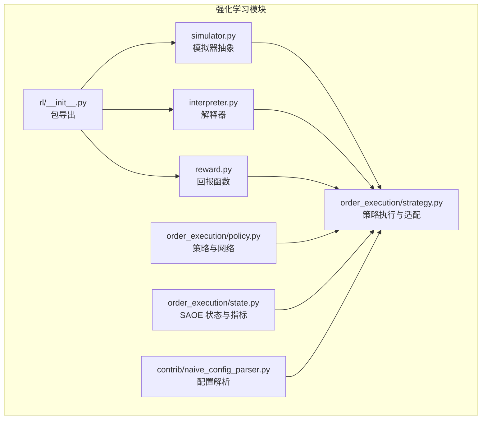
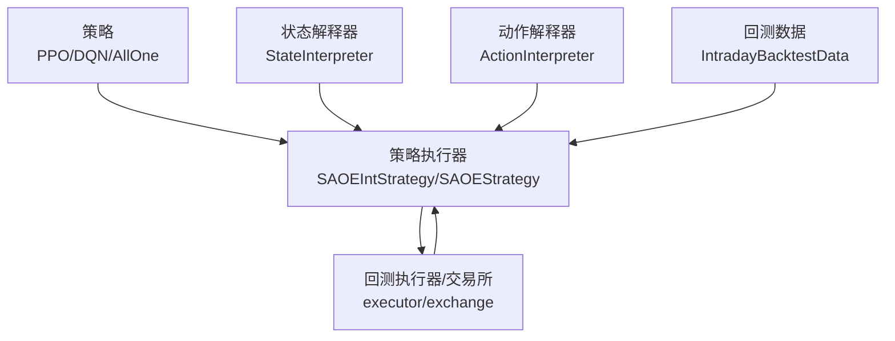
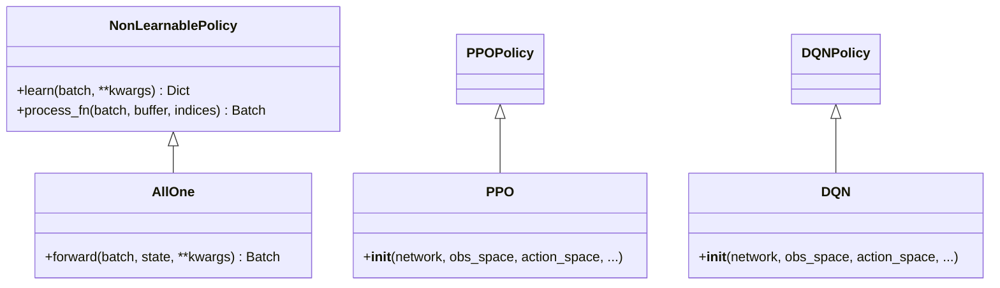
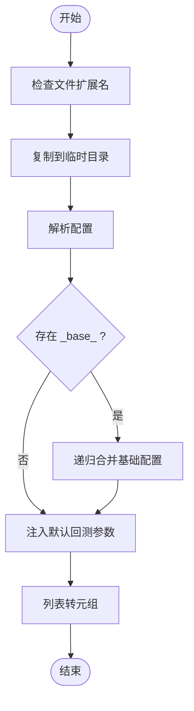
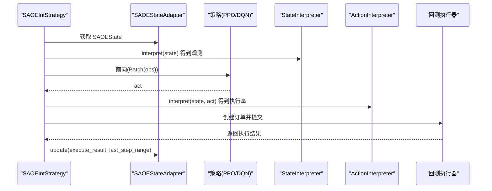
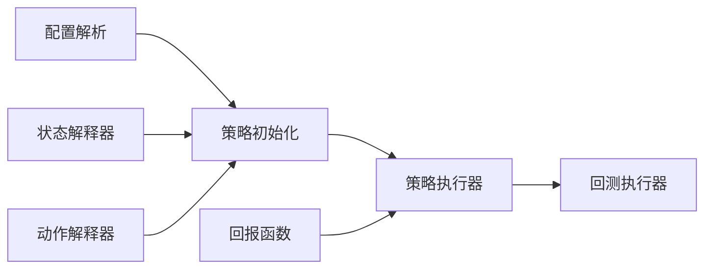

# 策略框架与接口

<cite>
**本文引用的文件**
- [policy.py](file://qlib/rl/order_execution/policy.py)
- [strategy.py](file://qlib/rl/order_execution/strategy.py)
- [naive_config_parser.py](file://qlib/rl/contrib/naive_config_parser.py)
- [interpreter.py](file://qlib/rl/interpreter.py)
- [reward.py](file://qlib/rl/reward.py)
- [simulator.py](file://qlib/rl/simulator.py)
- [state.py](file://qlib/rl/order_execution/state.py)
- [__init__.py](file://qlib/rl/__init__.py)
</cite>

## 目录
1. [引言](#引言)
2. [项目结构](#项目结构)
3. [核心组件](#核心组件)
4. [架构总览](#架构总览)
5. [详细组件分析](#详细组件分析)
6. [依赖分析](#依赖分析)
7. [性能考虑](#性能考虑)
8. [故障排查指南](#故障排查指南)
9. [结论](#结论)
10. [附录](#附录)

## 引言
本文件系统性梳理 Qlib 强化学习策略框架的设计与实现，重点覆盖以下方面：
- 策略接口设计：策略基类、可学习策略（PPO、DQN）与不可学习基线策略（AllOne）的职责与差异
- 策略注册与实例化：通过配置驱动的策略与网络构建流程
- 策略与环境交互：状态适配器、解释器（状态/动作）、策略调用、状态传递与回报计算
- 自定义策略开发：策略模板、最佳实践与常见陷阱
- 策略评估与比较：指标体系与实验方法论
- 策略版本管理与部署：权重加载、配置合并与回测参数默认值

## 项目结构
Qlib 的强化学习模块位于 qlib/rl 下，围绕“模拟器-解释器-策略-策略执行器”闭环组织代码。关键目录与文件如下：
- 策略与网络：order_execution/policy.py
- 策略执行与适配：order_execution/strategy.py
- 配置解析：contrib/naive_config_parser.py
- 解释器：rl/interpreter.py
- 回报函数：rl/reward.py
- 模拟器抽象：rl/simulator.py
- SAOE 状态与指标：order_execution/state.py
- 包导出：rl/__init__.py

图表来源
- [simulator.py:21-76](file://qlib/rl/simulator.py#L21-L76)
- [interpreter.py:19-142](file://qlib/rl/interpreter.py#L19-L142)
- [reward.py:16-86](file://qlib/rl/reward.py#L16-L86)
- [policy.py:25-238](file://qlib/rl/order_execution/policy.py#L25-L238)
- [strategy.py:301-552](file://qlib/rl/order_execution/strategy.py#L301-L552)
- [state.py:18-102](file://qlib/rl/order_execution/state.py#L18-L102)
- [naive_config_parser.py:31-107](file://qlib/rl/contrib/naive_config_parser.py#L31-L107)
- [__init__.py:4-9](file://qlib/rl/__init__.py#L4-L9)

章节来源
- [__init__.py:4-9](file://qlib/rl/__init__.py#L4-L9)

## 核心组件
- 策略基类与具体策略
  - NonLearnablePolicy：继承自 tianshou 的 BasePolicy，空实现 learn/process_fn，作为不可学习策略的基类
  - AllOne：返回固定动作批次的不可学习策略，用于基线（如 TWAP）
  - PPO：封装 tianshou 的 PPOPolicy，自动构建 Actor/Critic，支持离线权重加载
  - DQN：封装 tianshou 的 DQNPolicy，自动构建模型，支持离线权重加载
- 策略执行与适配
  - SAOEStateAdapter：维护单笔订单在仿真步进中的内部状态，聚合历史成交、市场数据与指标
  - SAOEStrategy：基于 SAOEState 的 RL 策略基类，负责重置、更新与生成交易决策
  - ProxySAOEStrategy：代理型策略，不自行决策，而是将自身作为环境信息让外部策略决定
  - SAOEIntStrategy：带解释器的策略，将 SAOEState 通过 StateInterpreter 映射为观测，再由策略输出动作，经 ActionInterpreter 转换为订单
- 解释器
  - StateInterpreter：将模拟器状态映射到策略观测空间
  - ActionInterpreter：将策略动作映射到仿真可接受的动作
- 回报函数
  - Reward：抽象回报计算；RewardCombination：多回报加权组合
- 模拟器
  - Simulator：抽象模拟器，约束状态读写与步进接口
- SAOE 状态与指标
  - SAOEMetrics：记录单步或累计的市场、成交与绩效指标
  - SAOEState：封装 SAOE 任务的状态数据结构

章节来源
- [policy.py:25-238](file://qlib/rl/order_execution/policy.py#L25-L238)
- [strategy.py:71-552](file://qlib/rl/order_execution/strategy.py#L71-L552)
- [interpreter.py:19-142](file://qlib/rl/interpreter.py#L19-L142)
- [reward.py:16-86](file://qlib/rl/reward.py#L16-L86)
- [simulator.py:21-76](file://qlib/rl/simulator.py#L21-L76)
- [state.py:18-102](file://qlib/rl/order_execution/state.py#L18-L102)

## 架构总览
策略框架以“策略 + 解释器 + 模拟器”的方式解耦，策略仅关注动作选择，状态与动作的转换由解释器完成；回报由回报函数计算；策略执行通过策略适配器与回测基础设施协作。

图表来源
- [strategy.py:301-552](file://qlib/rl/order_execution/strategy.py#L301-L552)
- [interpreter.py:35-99](file://qlib/rl/interpreter.py#L35-L99)
- [policy.py:102-209](file://qlib/rl/order_execution/policy.py#L102-L209)

## 详细组件分析

### 策略接口与实现
- 设计要点
  - 可学习策略（PPO/DQN）：封装 tianshou 的策略实现，自动构建网络、优化器与超参，默认 eval 模式
  - 不可学习策略（AllOne）：用于基线对比，避免训练开销
  - 权重加载：支持从训练产物中加载策略权重，兼容不同命名前缀
- 关键流程
  - 初始化：根据网络与空间构造策略，必要时加载权重
  - 前向：输入 Batch(obs)，输出 Batch(act)
  - 学习：空实现（不可学习策略），或调用父类学习流程（可学习策略）

图表来源
- [policy.py:25-238](file://qlib/rl/order_execution/policy.py#L25-L238)

章节来源
- [policy.py:25-238](file://qlib/rl/order_execution/policy.py#L25-L238)

### 策略配置解析器
- 功能概述
  - 支持 py/yml/yaml/json 配置文件，复制到临时目录后解析
  - 支持 _base_ 继承与键覆盖合并
  - 将列表转换为元组，确保配置稳定
  - 为回测配置注入默认项（如交易成本、并发、输出目录、数据粒度等）
- 使用建议
  - 将通用配置放入 _base_ 文件，按需覆盖
  - 使用 _delete_ 键删除不需要的默认项
  - 保持配置键名与初始化参数一致

图表来源
- [naive_config_parser.py:31-107](file://qlib/rl/contrib/naive_config_parser.py#L31-L107)

章节来源
- [naive_config_parser.py:31-107](file://qlib/rl/contrib/naive_config_parser.py#L31-L107)

### 策略与环境交互接口
- 状态适配器（SAOEStateAdapter）
  - 职责：聚合执行结果、市场行情、历史步骤与累计指标，维护当前时间步与剩余头寸
  - 更新逻辑：按步长切片市场数据，汇总成交，填充缺失值，更新历史与指标
- 策略执行器（SAOEStrategy/SAOEIntStrategy）
  - 重置：根据外层交易决策创建适配器字典
  - 决策生成：在每一步获取可用数据范围，调用子类 _generate_trade_decision
  - 执行后处理：汇总上一步执行结果，更新适配器状态
- 解释器（StateInterpreter/ActionInterpreter）
  - 观察空间与动作空间：由解释器定义，策略据此初始化
  - 输入校验：解释器对观测与动作进行空间校验，失败抛出异常

图表来源
- [strategy.py:301-552](file://qlib/rl/order_execution/strategy.py#L301-L552)
- [interpreter.py:35-99](file://qlib/rl/interpreter.py#L35-L99)
- [state.py:70-102](file://qlib/rl/order_execution/state.py#L70-L102)

章节来源
- [strategy.py:71-552](file://qlib/rl/order_execution/strategy.py#L71-L552)
- [interpreter.py:35-99](file://qlib/rl/interpreter.py#L35-L99)
- [state.py:18-102](file://qlib/rl/order_execution/state.py#L18-L102)

### 自定义策略开发指南
- 开发步骤
  - 定义状态解释器：实现 observation_space 与 interpret，确保输出符合策略观测空间
  - 定义动作解释器：实现 action_space 与 interpret，将策略动作映射为订单量
  - 实现策略：选择 PPO 或 DQN，或自定义不可学习策略（如 AllOne）
  - 实现策略类：继承 SAOEStrategy 并实现 _generate_trade_decision
  - 配置与实例化：通过配置字典传入 state_interpreter/action_interpreter/policy/network
- 最佳实践
  - 解释器无状态：避免在解释器中保存临时状态，便于复用与测试
  - 空间一致性：确保解释器的 observation_space 与 action_space 与策略初始化一致
  - 权重加载：训练完成后使用 Trainer.get_policy_state_dict 加载权重
  - 数据泄漏防护：解释器不应泄露未来数据
- 常见陷阱
  - 动作/观测越界：未通过解释器 validate 导致运行时异常
  - 步长不匹配：ticks_per_step 与 data_granularity 不整除导致索引错位
  - 成交量溢出：累计成交量超过剩余头寸时应缩放

章节来源
- [strategy.py:445-552](file://qlib/rl/order_execution/strategy.py#L445-L552)
- [interpreter.py:101-142](file://qlib/rl/interpreter.py#L101-L142)
- [policy.py:157-159](file://qlib/rl/order_execution/policy.py#L157-L159)

### 策略评估与比较
- 指标体系
  - SAOEMetrics：包含市场成交量、成交均价、成交价值、剩余头寸、完成比例（FFR）、相对价格优势（PA）等
  - 可结合回报函数对策略收益进行量化评估
- 方法论
  - 多折线/多日回测：比较不同策略在同一市场条件下的表现
  - 分层评估：按股票池、时段、方向分层统计指标
  - 统计显著性：对策略收益分布进行稳健估计与假设检验
- 报告与可视化
  - 利用回测报告模块输出策略对比结果

章节来源
- [state.py:18-102](file://qlib/rl/order_execution/state.py#L18-L102)
- [reward.py:16-86](file://qlib/rl/reward.py#L16-L86)

### 策略版本管理与部署
- 版本管理
  - 权重文件：通过 Trainer.get_policy_state_dict 加载，支持命名前缀兼容
  - 配置继承：_base_ 机制实现配置版本化与增量覆盖
- 部署方案
  - 在线回测：通过配置注入默认参数，统一输出目录与并发设置
  - 环境隔离：临时目录解析配置，避免污染本地环境

章节来源
- [policy.py:220-229](file://qlib/rl/order_execution/policy.py#L220-L229)
- [naive_config_parser.py:61-107](file://qlib/rl/contrib/naive_config_parser.py#L61-L107)

## 依赖分析
- 组件耦合
  - 策略与解释器：通过空间接口耦合，策略不直接依赖解释器实现细节
  - 策略与执行器：通过 Batch 接口与订单创建接口耦合
  - 配置解析：与策略/网络初始化参数耦合
- 外部依赖
  - tianshou：策略算法实现
  - gym：观测/动作空间定义
  - pandas/numpy：数据结构与数值计算

图表来源
- [strategy.py:445-552](file://qlib/rl/order_execution/strategy.py#L445-L552)
- [naive_config_parser.py:31-107](file://qlib/rl/contrib/naive_config_parser.py#L31-L107)
- [interpreter.py:35-99](file://qlib/rl/interpreter.py#L35-L99)
- [reward.py:16-86](file://qlib/rl/reward.py#L16-L86)

## 性能考虑
- 计算图与设备
  - 自动设备选择：优先参数所在设备，避免不必要的 CPU/GPU 迁移
  - 参数去重：共享网络参数时进行去重，减少冗余
- 批处理与内存
  - 批量观测：将多个订单状态打包为 Batch，提升推理效率
  - 历史数据管理：合理裁剪历史窗口，避免内存膨胀
- 数值稳定性
  - 缺失值填充：使用稳健统计量填充 NaN，避免传播错误
  - 成交量缩放：累计成交量超过剩余头寸时进行线性缩放

章节来源
- [policy.py:214-238](file://qlib/rl/order_execution/policy.py#L214-L238)
- [strategy.py:149-170](file://qlib/rl/order_execution/strategy.py#L149-L170)

## 故障排查指南
- 空间校验失败
  - 现象：解释器 validate 抛出 GymSpaceValidationError
  - 排查：确认观测/动作维度与类型与空间定义一致
- 权重加载失败
  - 现象：load_state_dict 抛出 RuntimeError
  - 排查：尝试添加 _actor_critic. 前缀，或检查权重文件是否来自兼容版本
- 步长与索引问题
  - 现象：时间索引越界或步长不整除
  - 排查：确保 ticks_per_step 能被 data_granularity 整除，修正时间索引计算
- 成交量异常
  - 现象：累计成交量大于剩余头寸
  - 排查：启用线性缩放，保证累计成交量不超过剩余头寸

章节来源
- [interpreter.py:101-142](file://qlib/rl/interpreter.py#L101-L142)
- [policy.py:220-229](file://qlib/rl/order_execution/policy.py#L220-L229)
- [strategy.py:114-125](file://qlib/rl/order_execution/strategy.py#L114-L125)
- [strategy.py:140-148](file://qlib/rl/order_execution/strategy.py#L140-L148)

## 结论
Qlib 的强化学习策略框架通过清晰的抽象与严格的接口约束，实现了策略、解释器与执行器的解耦。借助配置解析、权重加载与回测指标，开发者可以快速搭建、评估与部署 RL 策略。遵循本文的最佳实践与排错建议，可在保证正确性的前提下提升开发与部署效率。

## 附录
- 快速参考
  - 策略初始化：传入 network、obs_space、action_space、policy 配置
  - 解释器校验：解释器会强制校验观测与动作的空间合法性
  - 回测配置：通过 _base_ 与默认注入简化配置管理