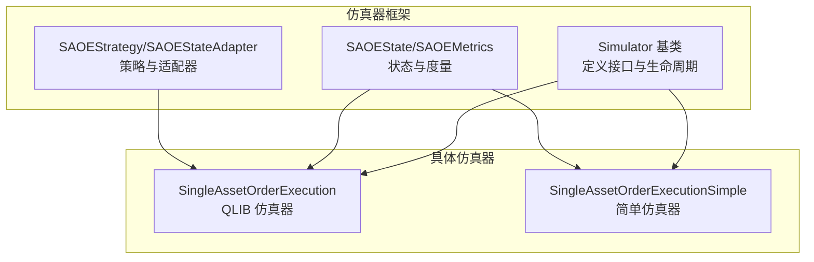
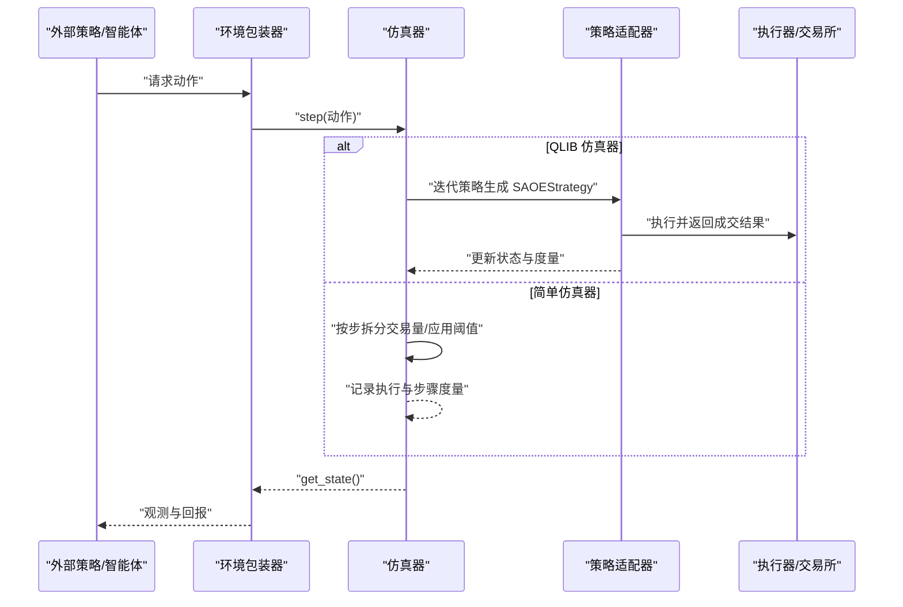
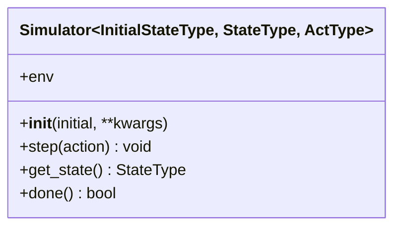
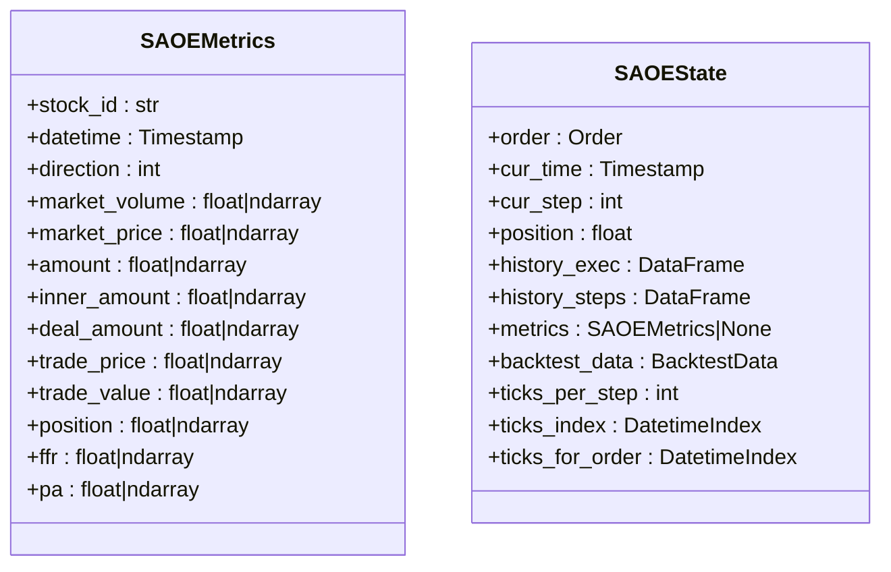
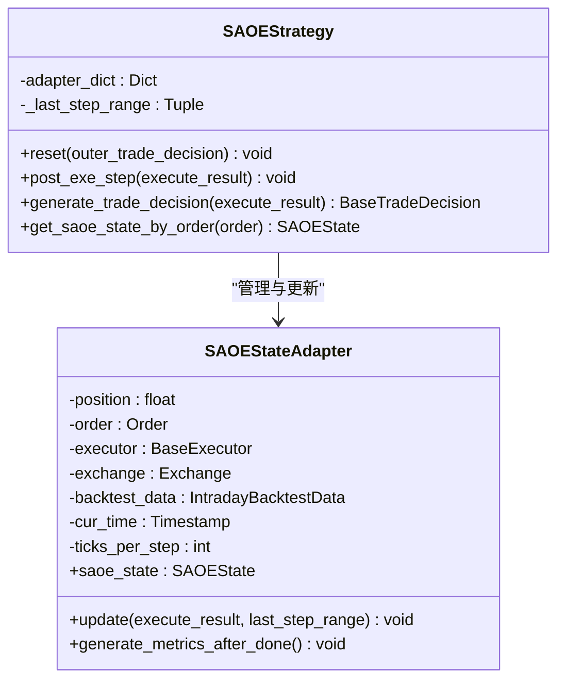
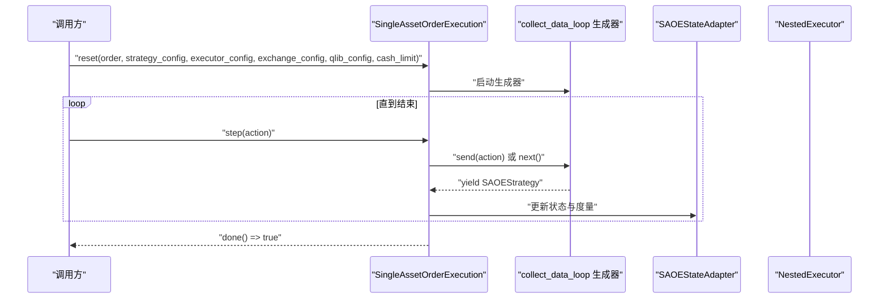
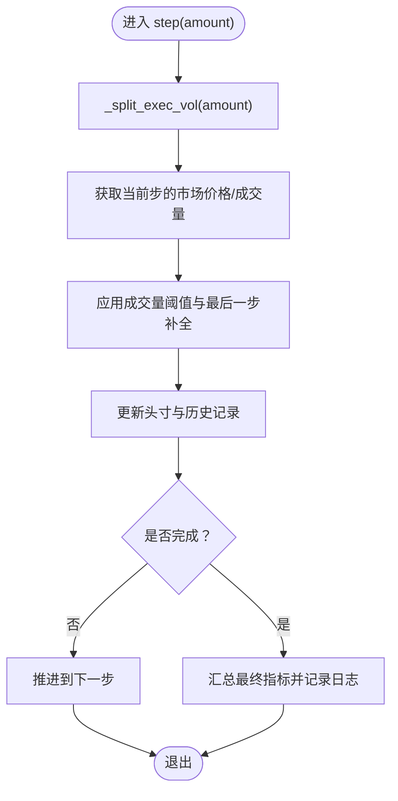
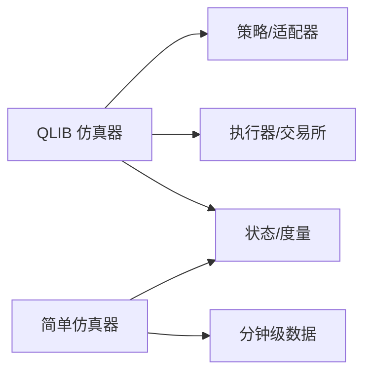

# 仿真器系统

<cite>
**本文引用的文件**
- [simulator_qlib.py](file://qlib/rl/order_execution/simulator_qlib.py)
- [simulator_simple.py](file://qlib/rl/order_execution/simulator_simple.py)
- [simulator.py](file://qlib/rl/simulator.py)
- [state.py](file://qlib/rl/order_execution/state.py)
- [strategy.py](file://qlib/rl/order_execution/strategy.py)
- [test_qlib_simulator.py](file://tests/rl/test_qlib_simulator.py)
</cite>

## 目录
1. [引言](#引言)
2. [项目结构](#项目结构)
3. [核心组件](#核心组件)
4. [架构总览](#架构总览)
5. [详细组件分析](#详细组件分析)
6. [依赖分析](#依赖分析)
7. [性能考量](#性能考量)
8. [故障排查指南](#故障排查指南)
9. [结论](#结论)
10. [附录](#附录)

## 引言
本文件面向订单执行仿真器系统的技术文档，聚焦于两类单资产订单执行（SAOE）仿真器：基于 Qlib 回测工具链的“QLIB 仿真器”与“简单仿真器”。我们将从系统架构、核心功能、数据流、处理逻辑、配置参数与使用方法、扩展接口与自定义方法等方面进行深入解析，并提供流程图与类图帮助理解。同时，针对市场模拟精度、性能考虑与适用场景进行对比分析，给出最佳实践与常见问题排查建议。

## 项目结构
本仿真器系统位于 Qlib 的强化学习模块中，围绕订单执行任务构建了通用仿真框架与两种具体实现：
- 通用仿真基类：提供统一的生命周期与接口约束
- 状态与指标：定义仿真过程中的状态与度量
- 策略适配器：将回测执行结果映射为可解释的状态
- 两类仿真器：
  - 基于 Qlib 回测的 SAOE 仿真器
  - 简化版基于分钟级数据的 SAOE 仿真器

图表来源
- [simulator.py:21-75](file://qlib/rl/simulator.py#L21-L75)
- [state.py:70-102](file://qlib/rl/order_execution/state.py#L70-L102)
- [strategy.py:71-299](file://qlib/rl/order_execution/strategy.py#L71-L299)
- [simulator_qlib.py:19-142](file://qlib/rl/order_execution/simulator_qlib.py#L19-L142)
- [simulator_simple.py:24-363](file://qlib/rl/order_execution/simulator_simple.py#L24-L363)

章节来源
- [simulator.py:21-75](file://qlib/rl/simulator.py#L21-L75)
- [state.py:18-102](file://qlib/rl/order_execution/state.py#L18-L102)
- [strategy.py:71-299](file://qlib/rl/order_execution/strategy.py#L71-L299)
- [simulator_qlib.py:19-142](file://qlib/rl/order_execution/simulator_qlib.py#L19-L142)
- [simulator_simple.py:24-363](file://qlib/rl/order_execution/simulator_simple.py#L24-L363)

## 核心组件
- 通用仿真基类
  - 提供统一的初始化、步进、状态读取与终止判断接口；强调“仅通过 step 修改内部状态，外部只读”
- 状态与度量
  - SAOEState：封装当前时间、步数、剩余头寸、历史执行与步骤记录、指标、回测数据索引等
  - SAOEMetrics：封装市场信息、策略意图与成交结果、累计指标（如完成比例、价格优势）
- 策略适配器
  - SAOEStateAdapter：将执行结果与市场数据整合，生成每步与每日度量，并维护位置与时间推进
  - SAOEStrategy：基于策略的决策生成与适配器更新流程
- 两类仿真器
  - QLIB 仿真器：基于 Qlib 回测工具链，通过策略-执行器-交易所流水线推进仿真
  - 简单仿真器：直接使用分钟级数据，按步切分交易量并应用阈值约束

章节来源
- [simulator.py:21-75](file://qlib/rl/simulator.py#L21-L75)
- [state.py:18-102](file://qlib/rl/order_execution/state.py#L18-L102)
- [strategy.py:71-299](file://qlib/rl/order_execution/strategy.py#L71-L299)
- [simulator_qlib.py:19-142](file://qlib/rl/order_execution/simulator_qlib.py#L19-L142)
- [simulator_simple.py:24-363](file://qlib/rl/order_execution/simulator_simple.py#L24-L363)

## 架构总览
下图展示两类仿真器在整体回测/仿真流程中的位置与交互：

图表来源
- [simulator_qlib.py:107-141](file://qlib/rl/order_execution/simulator_qlib.py#L107-L141)
- [strategy.py:301-398](file://qlib/rl/order_execution/strategy.py#L301-L398)
- [simulator_simple.py:147-247](file://qlib/rl/order_execution/simulator_simple.py#L147-L247)

## 详细组件分析

### 通用仿真基类（Simulator）
- 角色定位：定义仿真器的生命周期与接口契约，禁止外部直接修改内部状态，仅允许通过 step 推进
- 关键点
  - 类型参数：初始状态类型、状态类型、动作类型
  - 属性 env：可选的环境包装器引用，便于日志与上下文访问
  - 方法：step、get_state、done 必须由子类实现

图表来源
- [simulator.py:21-75](file://qlib/rl/simulator.py#L21-L75)

章节来源
- [simulator.py:21-75](file://qlib/rl/simulator.py#L21-L75)

### 状态与度量（SAOEState/SAOEMetrics）
- SAOEMetrics：描述单步或单日的市场与交易指标，支持向量化存储
- SAOEState：封装一次 SAOE 仿真的完整状态，便于解释器/策略读取

图表来源
- [state.py:18-102](file://qlib/rl/order_execution/state.py#L18-L102)

章节来源
- [state.py:18-102](file://qlib/rl/order_execution/state.py#L18-L102)

### 策略与适配器（SAOEStrategy/SAOEStateAdapter）
- SAOEStateAdapter
  - 维护位置、时间推进、TWAP 基线价、历史记录与指标
  - 将执行结果与市场数据对齐，生成每步与每日度量
- SAOEStrategy
  - 负责生成交易决策（可带细节），并在每步后更新适配器
  - 支持代理策略（将自身作为决策源供外部策略驱动）

图表来源
- [strategy.py:71-299](file://qlib/rl/order_execution/strategy.py#L71-L299)

章节来源
- [strategy.py:71-299](file://qlib/rl/order_execution/strategy.py#L71-L299)

### QLIB 仿真器（SingleAssetOrderExecution）
- 设计要点
  - 基于 Qlib 回测工具链，通过策略-执行器-交易所流水线推进
  - 使用生成器循环收集策略与执行结果，逐步产出 SAOEStrategy 以驱动状态更新
  - 支持初始化 Qlib 配置、资金限制、交易范围等
- 关键流程
  - 初始化：校验起止日期一致，构造策略配置与执行器
  - 运行：通过生成器推进，捕获 SAOEStrategy 并更新适配器
  - 终止：执行器完成即 done

图表来源
- [simulator_qlib.py:60-141](file://qlib/rl/order_execution/simulator_qlib.py#L60-L141)
- [strategy.py:301-398](file://qlib/rl/order_execution/strategy.py#L301-L398)

章节来源
- [simulator_qlib.py:19-142](file://qlib/rl/order_execution/simulator_qlib.py#L19-L142)
- [strategy.py:301-398](file://qlib/rl/order_execution/strategy.py#L301-L398)

### 简单仿真器（SingleAssetOrderExecutionSimple）
- 设计要点
  - 不依赖回测日历，以“tick”为交易机会（通常对应分钟级数据）
  - 按步拆分交易量，应用成交量阈值约束；最后一步确保全部成交
  - 记录每步与每 tick 的执行与度量，支持价格优势计算
- 关键流程
  - 初始化：加载回测数据、确定可用交易时间索引、计算 TWAP 基线价
  - 步进：拆分交易量、获取市场价格/成交量、累积执行与步骤度量
  - 终止：头寸耗尽或到达结束时间

图表来源
- [simulator_simple.py:147-247](file://qlib/rl/order_execution/simulator_simple.py#L147-L247)
- [simulator_simple.py:269-294](file://qlib/rl/order_execution/simulator_simple.py#L269-L294)

章节来源
- [simulator_simple.py:24-363](file://qlib/rl/order_execution/simulator_simple.py#L24-L363)

## 依赖分析
- 组件耦合
  - 两类仿真器均继承自通用仿真基类，共享状态与度量结构
  - QLIB 仿真器依赖策略-执行器-交易所流水线与适配器；简单仿真器依赖回测数据与度量计算
- 外部依赖
  - 回测数据加载、交易成本与市场簿模型由 Qlib 后台提供
  - 简单仿真器直接使用分钟级数据与阈值控制

图表来源
- [simulator_qlib.py:10-16](file://qlib/rl/order_execution/simulator_qlib.py#L10-L16)
- [simulator_simple.py:14-19](file://qlib/rl/order_execution/simulator_simple.py#L14-L19)
- [state.py:70-102](file://qlib/rl/order_execution/state.py#L70-L102)

章节来源
- [simulator_qlib.py:10-16](file://qlib/rl/order_execution/simulator_qlib.py#L10-L16)
- [simulator_simple.py:14-19](file://qlib/rl/order_execution/simulator_simple.py#L14-L19)
- [state.py:70-102](file://qlib/rl/order_execution/state.py#L70-L102)

## 性能考量
- QLIB 仿真器
  - 优点：与真实回测工具链一致，可复用交易成本、市场簿与流动性模型
  - 成本：生成器与策略-执行器流水线开销较大，适合中小规模仿真与离线评估
- 简单仿真器
  - 优点：直接基于分钟数据，逻辑清晰、易于扩展与定制
  - 成本：忽略市场簿细节，仅以成交量阈值近似流动性；适合快速原型与大规模批量仿真
- 优化建议
  - 批量运行时合并日志写入，减少 I/O 开销
  - 对简单仿真器，合理设置 ticks_per_step 与 vol_threshold，避免过度细粒度导致的重复计算
  - 在 QLIB 仿真器中，尽量复用已初始化的 Qlib 上下文，避免频繁重置

## 故障排查指南
- 常见问题
  - 仿真器已结束仍调用 step：检查 done 返回值，避免继续推进
  - 头寸或成交量异常：核对拆分逻辑与阈值设置，确保累计头寸非负
  - 数据不连续或缺失：简单仿真器会尝试兼容旧格式数据，但建议统一数据格式
- 定位方法
  - 利用环境日志记录中间状态（如 history_steps/history_exec），在完成时输出最终指标
  - 对 QLIB 仿真器，检查策略-执行器-交易所的返回结果与适配器更新路径

章节来源
- [simulator_simple.py:156-227](file://qlib/rl/order_execution/simulator_simple.py#L156-L227)
- [simulator_qlib.py:128-134](file://qlib/rl/order_execution/simulator_qlib.py#L128-L134)

## 结论
QLIB 仿真器与简单仿真器分别代表了“高保真回测”与“高效原型”的两条路径。前者通过真实回测工具链提供更贴近市场的执行与度量，后者通过分钟级数据与阈值控制实现快速迭代与大规模仿真。选择哪一类取决于任务目标：若需严格验证策略在真实市场条件下的表现，优先 QLIB 仿真器；若追求速度与灵活性，可采用简单仿真器并结合自定义阈值与度量。

## 附录

### 配置参数与使用方法
- QLIB 仿真器
  - 输入：订单、执行器配置、交易所配置、Qlib 配置（可选）、资金限制
  - 关键行为：按步推进，通过生成器产出策略并更新适配器
  - 适用：需要与真实回测一致性的研究与评估
- 简单仿真器
  - 输入：订单、数据目录、特征列（当日/昨日）、数据粒度、每步 tick 数、成交量阈值
  - 关键行为：按步拆分交易量、应用阈值、最后一步补全
  - 适用：快速验证策略思路、大规模批量仿真

章节来源
- [simulator_qlib.py:36-98](file://qlib/rl/order_execution/simulator_qlib.py#L36-L98)
- [simulator_simple.py:78-122](file://qlib/rl/order_execution/simulator_simple.py#L78-L122)

### 交易成本与随机性控制
- 交易成本
  - QLIB 仿真器：由执行器/交易所配置决定，可接入滑点、手续费等
  - 简单仿真器：可通过度量字段扩展成本项（如额外交易价值），但默认未内置
- 随机性
  - 可通过外部策略引入噪声或随机动作；简单仿真器未内置随机价格波动

章节来源
- [strategy.py:301-398](file://qlib/rl/order_execution/strategy.py#L301-L398)
- [state.py:18-68](file://qlib/rl/order_execution/state.py#L18-L68)

### 扩展接口与自定义方法
- 自定义策略
  - 继承 SAOEStrategy 并实现 _generate_trade_decision，或使用代理策略在生成决策时注入外部动作
- 自定义解释器
  - 通过状态解释器与动作解释器对接观测空间与动作空间，便于集成不同算法
- 自定义度量
  - 在适配器或简单仿真器中扩展 SAOEMetrics 字段，记录额外指标（如冲击成本、时间加权平均价格等）

章节来源
- [strategy.py:407-551](file://qlib/rl/order_execution/strategy.py#L407-L551)
- [state.py:18-68](file://qlib/rl/order_execution/state.py#L18-L68)

### 使用示例与最佳实践
- 示例参考
  - 测试用例展示了如何使用仿真器与环境包装器进行批量采集与日志输出
- 最佳实践
  - 明确仿真目标：若需真实市场簿与流动性，优先 QLIB 仿真器
  - 控制步长与阈值：在简单仿真器中平衡精度与性能
  - 规范日志与指标：在完成时集中输出最终指标，便于后续分析

章节来源
- [test_qlib_simulator.py](file://tests/rl/test_qlib_simulator.py)