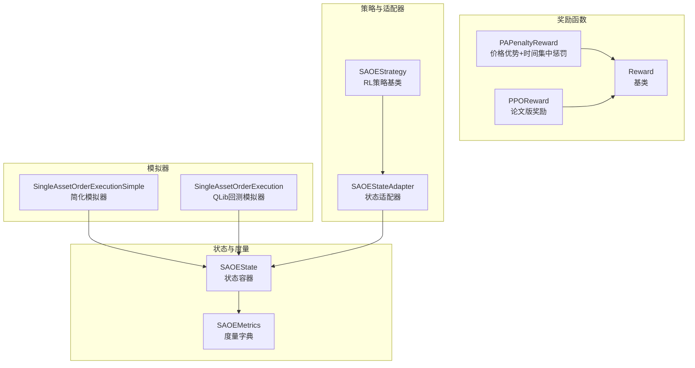
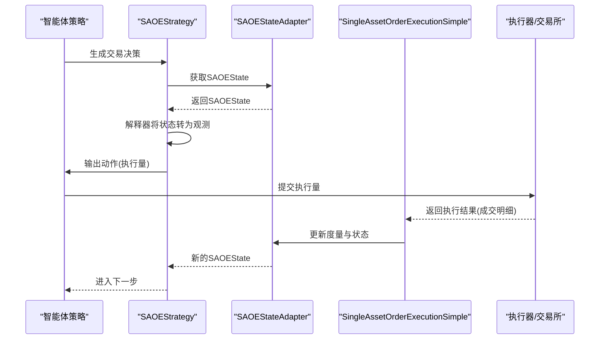
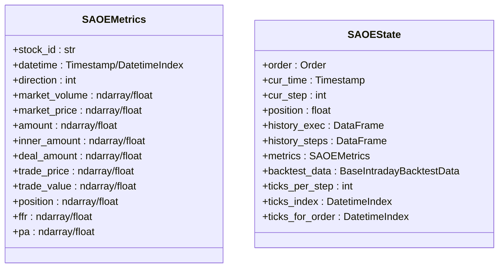
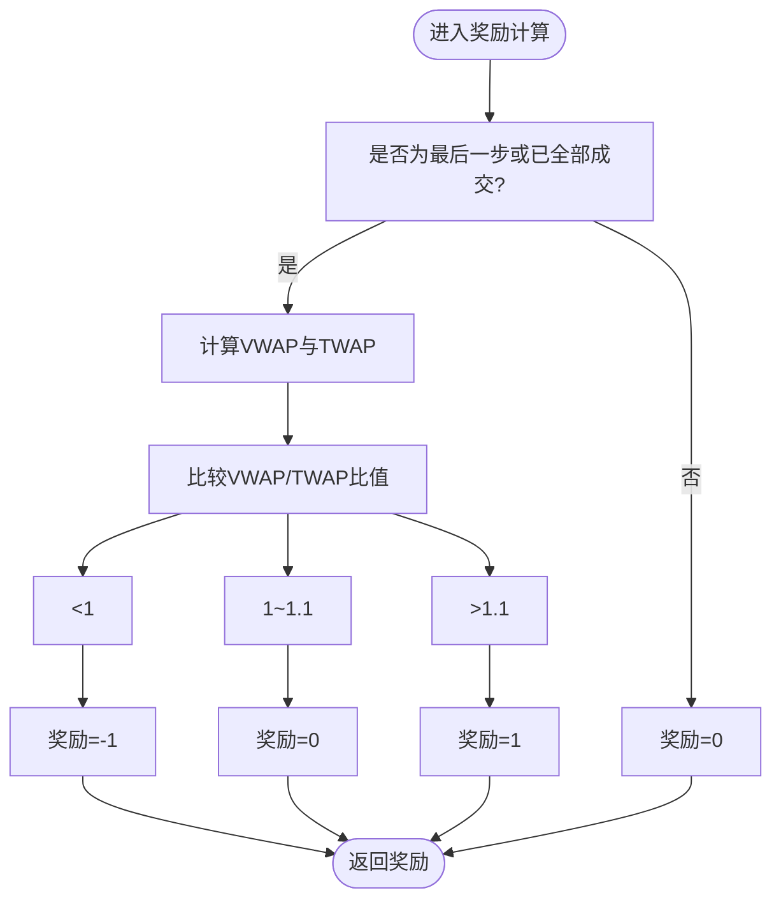
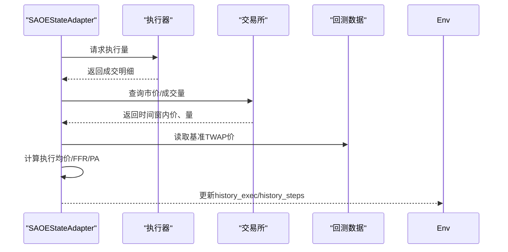
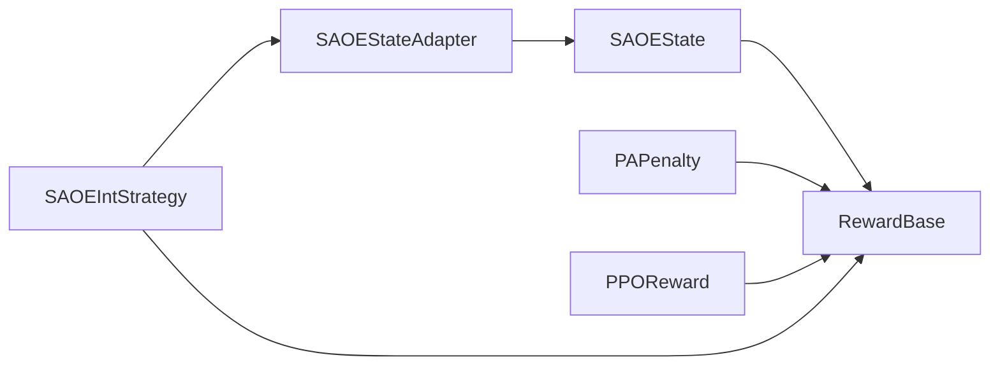

# 状态表示与奖励函数

<cite>
**本文引用的文件**
- [state.py](file://qlib/rl/order_execution/state.py)
- [reward.py](file://qlib/rl/order_execution/reward.py)
- [simulator_qlib.py](file://qlib/rl/order_execution/simulator_qlib.py)
- [simulator_simple.py](file://qlib/rl/order_execution/simulator_simple.py)
- [strategy.py](file://qlib/rl/order_execution/strategy.py)
- [utils.py](file://qlib/rl/order_execution/utils.py)
- [reward_base.py](file://qlib/rl/reward.py)
</cite>

## 目录
1. [引言](#引言)
2. [项目结构](#项目结构)
3. [核心组件](#核心组件)
4. [架构总览](#架构总览)
5. [详细组件分析](#详细组件分析)
6. [依赖分析](#依赖分析)
7. [性能考虑](#性能考虑)
8. [故障排查指南](#故障排查指南)
9. [结论](#结论)
10. [附录](#附录)

## 引言
本文件聚焦于QLib中“单资产订单执行（SAOE）”场景下的状态表示与奖励函数设计，系统性阐述状态空间的设计原理、特征工程与归一化策略、时序数据融合方式，并给出奖励函数的数学表达与实现要点。同时提供状态表示的扩展方法与奖励函数的定制指南，辅以流程图与类图帮助读者快速理解与落地。

## 项目结构
围绕订单执行状态与奖励函数的关键代码位于以下模块：
- 状态定义与度量：state.py
- 奖励基类与具体奖励：reward.py、reward_base.py
- 执行模拟器（基于QLib回测工具与简化数据）：simulator_qlib.py、simulator_simple.py
- 策略与状态适配器：strategy.py
- 工具函数：utils.py

图表来源
- [state.py:70-102](file://qlib/rl/order_execution/state.py#L70-L102)
- [reward.py:17-100](file://qlib/rl/order_execution/reward.py#L17-L100)
- [simulator_simple.py:24-363](file://qlib/rl/order_execution/simulator_simple.py#L24-L363)
- [simulator_qlib.py:19-142](file://qlib/rl/order_execution/simulator_qlib.py#L19-L142)
- [strategy.py:71-552](file://qlib/rl/order_execution/strategy.py#L71-L552)
- [reward_base.py:16-86](file://qlib/rl/reward.py#L16-L86)

章节来源
- [state.py:1-102](file://qlib/rl/order_execution/state.py#L1-L102)
- [reward.py:1-100](file://qlib/rl/order_execution/reward.py#L1-L100)
- [simulator_simple.py:1-363](file://qlib/rl/order_execution/simulator_simple.py#L1-L363)
- [simulator_qlib.py:1-142](file://qlib/rl/order_execution/simulator_qlib.py#L1-L142)
- [strategy.py:1-552](file://qlib/rl/order_execution/strategy.py#L1-L552)
- [utils.py:1-53](file://qlib/rl/order_execution/utils.py#L1-L53)
- [reward_base.py:1-86](file://qlib/rl/reward.py#L1-L86)

## 核心组件
- SAOEMetrics：封装单步或累计的市场与交易度量，包括方向、市价、成交量、成交均价、累计执行比例、价格优势等，支持向量化与标量两种形态。
- SAOEState：环境状态容器，包含当前订单、时间步、剩余未执行量、历史执行与步骤记录、可选日度指标、回测数据索引、每步刻度数等。
- PAPenaltyReward：鼓励更高价格优势（PA），同时对短期内集中下单施加惩罚项，奖励为“价格优势收益 - 集中惩罚”。
- PPOReward：参考论文的分段奖励，仅在最后一步或已全部成交时根据VWAP/TWAP比值给定离散奖励。
- SingleAssetOrderExecutionSimple：基于预处理数据的简化模拟器，支持按步切分交易量、阈值约束、最后时刻补全等。
- SingleAssetOrderExecution：基于QLib回测工具链的模拟器，通过策略适配器收集多粒度度量并生成SAOEState。
- SAOEStateAdapter：将执行结果映射到SAOEMetrics与SAOEState，负责填充市场价/量、计算执行均价、累积度量与位置变化。
- SAOEStrategy：RL策略基类，负责解释状态、选择动作并生成交易决策；提供代理策略与带解释器的策略实现。

章节来源
- [state.py:18-102](file://qlib/rl/order_execution/state.py#L18-L102)
- [reward.py:17-100](file://qlib/rl/order_execution/reward.py#L17-L100)
- [simulator_simple.py:24-363](file://qlib/rl/order_execution/simulator_simple.py#L24-L363)
- [simulator_qlib.py:19-142](file://qlib/rl/order_execution/simulator_qlib.py#L19-L142)
- [strategy.py:71-552](file://qlib/rl/order_execution/strategy.py#L71-L552)
- [utils.py:25-45](file://qlib/rl/order_execution/utils.py#L25-L45)
- [reward_base.py:16-86](file://qlib/rl/reward.py#L16-L86)

## 架构总览
SAOE的执行流程由策略驱动，策略从适配器获取SAOEState，经解释器得到观测，再由策略网络输出动作，动作被解释为执行量，最终由模拟器推进一步并更新度量。

图表来源
- [strategy.py:525-552](file://qlib/rl/order_execution/strategy.py#L525-L552)
- [strategy.py:363-380](file://qlib/rl/order_execution/strategy.py#L363-L380)
- [simulator_simple.py:147-230](file://qlib/rl/order_execution/simulator_simple.py#L147-L230)
- [strategy.py:126-202](file://qlib/rl/order_execution/strategy.py#L126-L202)

## 详细组件分析

### 状态表示与度量（SAOEMetrics 与 SAOEState）
- SAOEMetrics字段覆盖：
  - 基本标识：股票ID、时间戳、方向（买卖）
  - 市场信息：总成交量、平均市价
  - 策略意图：计划交易总量、内生意图量（可能超过计划量以满足执行率）
  - 成交结果：成功成交总量、成交均价、成交总价值、剩余头寸
  - 累计指标：日完成比例FFR、与基准（TWAP）相比的价格优势PA（单位BP）
- SAOEState字段覆盖：
  - 订单、当前时间与步数、剩余未执行量
  - 历史执行与步骤记录（DataFrame）
  - 可选的日度指标
  - 回测数据索引（全天与订单可用刻度）、每步刻度数、可用交易刻度

图表来源
- [state.py:18-102](file://qlib/rl/order_execution/state.py#L18-L102)

章节来源
- [state.py:18-102](file://qlib/rl/order_execution/state.py#L18-L102)

### 状态向量构造与特征工程
- 特征来源：
  - 市场层面：每步市价序列、成交量序列、市场波动（可由价量序列派生）
  - 执行层面：每步计划量、实际成交、成交均价、累计执行比例FFR
  - 基准对比：与TWAP的PA（BP），用于衡量执行质量
- 归一化与标准化：
  - 使用均值/标准差对价、量、时间窗口内的统计量进行归一化
  - 对缺失值采用中位数/均值填充，避免NaN影响
- 时序融合：
  - 将每步的tick级价、量、成交序列聚合为步级指标
  - 通过滑动窗口提取趋势特征（如价差、换手率、成交量比率）
- 向量化与批处理：
  - 大量指标支持向量化，便于批量计算与高效存储

章节来源
- [simulator_simple.py:296-327](file://qlib/rl/order_execution/simulator_simple.py#L296-L327)
- [strategy.py:219-282](file://qlib/rl/order_execution/strategy.py#L219-L282)
- [utils.py:51-68](file://qlib/rl/order_execution/utils.py#L51-L68)

### 奖励函数设计与数学表达
- PAPenaltyReward（价格优势+集中惩罚）
  - 数学形式：R = PA_t * (v_t / V_total) − k * Σ(v_t^{tick})^2 / V_total^2
  - 目标：最大化相对价格优势，抑制短期内过度集中执行导致的冲击
  - 超参：惩罚系数k、奖励缩放scale
- PPOReward（论文版分段奖励）
  - 在最后一步或已全部成交时，依据VWAP/TWAP比值给离散奖励
  - 比例阈值：小于1给予负奖励，1~1.1给零奖励，大于1.1给正奖励
  - 目标：鼓励优于基准的执行效果

图表来源
- [reward.py:71-99](file://qlib/rl/order_execution/reward.py#L71-L99)

章节来源
- [reward.py:17-100](file://qlib/rl/order_execution/reward.py#L17-L100)
- [reward_base.py:16-86](file://qlib/rl/reward.py#L16-L86)

### 模拟器与状态更新
- SingleAssetOrderExecutionSimple：
  - 步长由ticks_per_step决定，每步将执行量均匀分配至tick，受市场成交量上限约束
  - 最后时刻确保剩余未执行量补齐
  - 维护history_exec（tick级）与history_steps（步级）两条记录流
- SingleAssetOrderExecution（QLib回测）：
  - 通过策略适配器从执行器与交易所采集数据，填充SAOEMetrics并生成SAOEState
  - 支持TWAP基准价与PA计算

图表来源
- [strategy.py:126-202](file://qlib/rl/order_execution/strategy.py#L126-L202)
- [strategy.py:284-298](file://qlib/rl/order_execution/strategy.py#L284-L298)

章节来源
- [simulator_simple.py:147-230](file://qlib/rl/order_execution/simulator_simple.py#L147-L230)
- [simulator_qlib.py:19-142](file://qlib/rl/order_execution/simulator_qlib.py#L19-L142)
- [strategy.py:71-552](file://qlib/rl/order_execution/strategy.py#L71-L552)

### 策略与解释器集成
- SAOEStrategy：
  - 维护每个订单的适配器字典，按步范围更新度量
  - 生成交易决策时自动维护步长范围，屏蔽上层细节
- SAOEIntStrategy：
  - 带状态/动作解释器的策略，将SAOEState解释为观测，策略网络输出动作，再由动作解释器转为执行量
- ProxySAOEStrategy：
  - 代理策略，直接将自身作为决策产出，由外部策略接管执行

章节来源
- [strategy.py:301-552](file://qlib/rl/order_execution/strategy.py#L301-L552)

## 依赖分析
- 模块耦合：
  - 状态与度量：SAOEState依赖SAOEMetrics；SAOEStateAdapter负责将执行结果映射为度量
  - 奖励函数：PAPenaltyReward与PPOReward均继承自Reward基类，统一奖励接口
  - 策略与模拟器：SAOEStrategy通过适配器与模拟器交互；SAOEIntStrategy引入解释器解耦
- 外部依赖：
  - 回测数据接口：从回测数据源加载市价、成交量、时间索引
  - 执行器/交易所：提供成交明细与市场价、量查询
  - 日志系统：奖励函数通过env.logger记录中间指标

图表来源
- [strategy.py:284-298](file://qlib/rl/order_execution/strategy.py#L284-L298)
- [reward.py:17-100](file://qlib/rl/order_execution/reward.py#L17-L100)
- [reward_base.py:16-86](file://qlib/rl/reward.py#L16-L86)

章节来源
- [strategy.py:71-552](file://qlib/rl/order_execution/strategy.py#L71-L552)
- [reward.py:1-100](file://qlib/rl/order_execution/reward.py#L1-L100)
- [reward_base.py:1-86](file://qlib/rl/reward.py#L1-L86)

## 性能考虑
- 向量化优先：价、量、执行序列尽量使用向量化操作，减少循环开销
- 缺失值处理：采用稳健统计量（中位数）填充缺失，避免异常值影响
- 步长与粒度：合理设置ticks_per_step与data_granularity，平衡计算复杂度与精度
- 内存管理：历史记录使用DataFrame增量拼接，注意索引命名一致性与类型对齐

## 故障排查指南
- 奖励异常：
  - 若出现NaN/无穷大奖励，检查PA计算与惩罚项权重设置，确保输入非零且数值稳定
- 执行量越界：
  - 当累计执行量超过剩余未执行量时，适配器会进行线性缩放；若仍异常，检查执行器返回与边界条件
- 数据泄漏：
  - PA计算依赖TWAP基准，需确保不使用未来数据；回测数据加载应严格按时间窗口切片
- 日志与可观测性：
  - 奖励函数通过env.logger记录子项（如PA、惩罚），便于调试与可视化

章节来源
- [reward.py:33-50](file://qlib/rl/order_execution/reward.py#L33-L50)
- [strategy.py:140-148](file://qlib/rl/order_execution/strategy.py#L140-L148)
- [utils.py:25-45](file://qlib/rl/order_execution/utils.py#L25-L45)

## 结论
SAOE的状态表示以SAOEMetrics为核心，结合SAOEState形成完整的时序执行视图；奖励函数则在保证基准对比公平性的前提下，兼顾执行质量与时序分布的合理性。通过解释器与策略的解耦设计，系统既支持端到端训练，也便于定制与扩展。

## 附录

### 状态表示扩展指南
- 新增特征维度建议：
  - 技术指标：基于价、量序列的滚动均值/标准差、RSI/KDJ等
  - 市场微观结构：买卖价差、挂单深度、换手率等
  - 时间特征：开盘后分钟数、是否午休、是否最后N分钟等
- 归一化策略：
  - 对每维特征分别做Z-score或Min-Max归一化
  - 对缺失值采用中位数/均值填充，必要时引入掩码
- 时序融合：
  - 使用滑动窗口聚合（均值/方差/最大/最小）与滞后特征
  - 对高频tick序列进行重采样，降低计算复杂度

### 奖励函数定制指南
- 设计原则：
  - 明确目标：最小化交易成本、优化执行价格、控制冲击与延迟
  - 平衡短期与长期：短期奖励鼓励即时收益，长期奖励关注整体表现
  - 避免过拟合：限制对特定数据集的敏感性，保持泛化能力
- 实现步骤：
  - 定义奖励项（如价格优势、冲击、流动性成本、尾差）
  - 为各奖励项设定权重并组合（可参考RewardCombination）
  - 通过env.logger记录子项，便于监控与调参
- 调优策略：
  - 先固定其他超参，单独调节惩罚系数k与缩放scale
  - 使用学习曲线与回报分布评估稳定性
  - 对极端情况（空头/多头、低流动性）进行专项测试