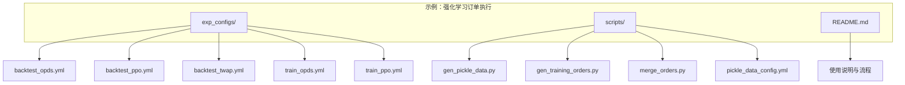
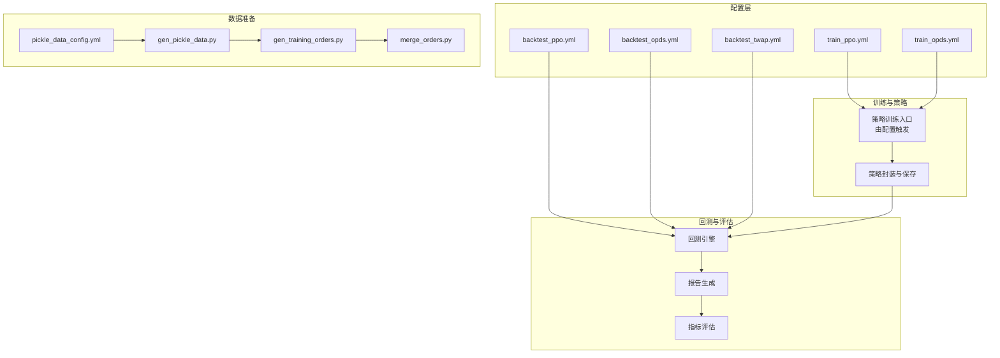
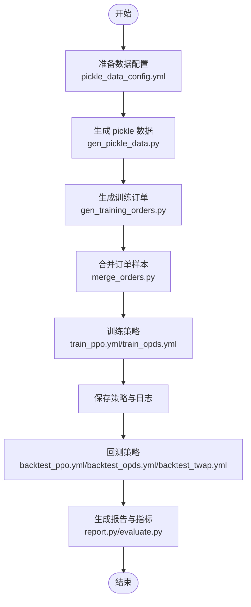
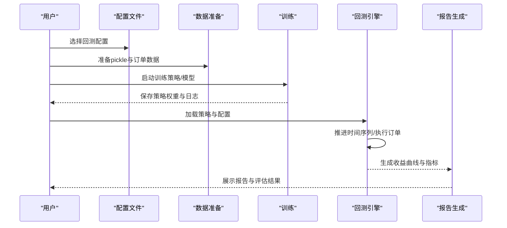
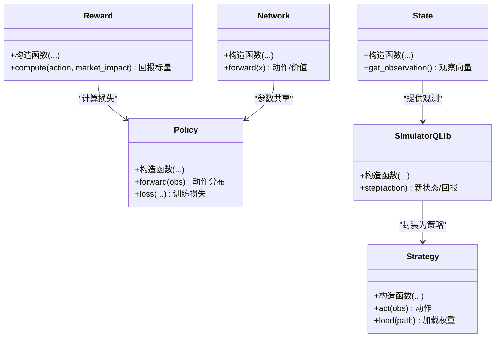
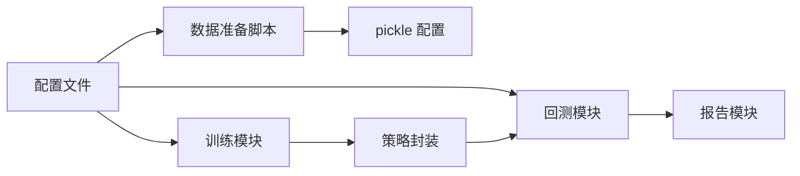

# 示例与配置

<cite>
**本文引用的文件**
- [README.md](file://examples/rl_order_execution/README.md)
- [backtest_opds.yml](file://examples/rl_order_execution/exp_configs/backtest_opds.yml)
- [backtest_ppo.yml](file://examples/rl_order_execution/exp_configs/backtest_ppo.yml)
- [backtest_twap.yml](file://examples/rl_order_execution/exp_configs/backtest_twap.yml)
- [train_opds.yml](file://examples/rl_order_execution/exp_configs/train_opds.yml)
- [train_ppo.yml](file://examples/rl_order_execution/exp_configs/train_ppo.yml)
- [gen_pickle_data.py](file://examples/rl_order_execution/scripts/gen_pickle_data.py)
- [gen_training_orders.py](file://examples/rl_order_execution/scripts/gen_training_orders.py)
- [merge_orders.py](file://examples/rl_order_execution/scripts/merge_orders.py)
- [pickle_data_config.yml](file://examples/rl_order_execution/scripts/pickle_data_config.yml)
- [order_execution.py](file://qlib/rl/order_execution/__init__.py)
- [simulator_qlib.py](file://qlib/rl/order_execution/simulator_qlib.py)
- [simulator_simple.py](file://qlib/rl/order_execution/simulator_simple.py)
- [state.py](file://qlib/rl/order_execution/state.py)
- [reward.py](file://qlib/rl/order_execution/reward.py)
- [strategy.py](file://qlib/rl/order_execution/strategy.py)
- [network.py](file://qlib/rl/order_execution/network.py)
- [policy.py](file://qlib/rl/order_execution/policy.py)
- [utils.py](file://qlib/rl/order_execution/utils.py)
- [backtest.py](file://qlib/backtest/backtest.py)
- [executor.py](file://qlib/backtest/executor.py)
- [report.py](file://qlib/backtest/report.py)
- [evaluate.py](file://qlib/evaluate.py)
- [evaluate_portfolio.py](file://qlib/evaluate_portfolio.py)
- [workflow.py](file://qlib/workflow/exp.py)
- [record_temp.py](file://qlib/workflow/recorder.py)
</cite>

## 目录
1. [简介](#简介)
2. [项目结构](#项目结构)
3. [核心组件](#核心组件)
4. [架构总览](#架构总览)
5. [详细组件分析](#详细组件分析)
6. [依赖关系分析](#依赖关系分析)
7. [性能考虑](#性能考虑)
8. [故障排除指南](#故障排除指南)
9. [结论](#结论)
10. [附录](#附录)

## 简介
本文件面向希望在 Qlib 中实现并运行强化学习（RL）订单执行策略的用户，提供从数据准备到训练、回测与评估的完整示例与配置说明。重点覆盖以下内容：
- 训练与回测配置文件的结构与参数说明（backtest_opds.yml、backtest_ppo.yml、backtest_twap.yml、train_opds.yml、train_ppo.yml）
- 数据准备脚本的使用方法（gen_pickle_data.py、gen_training_orders.py、merge_orders.py）及其参数
- 完整训练流程示例（数据预处理、模型训练、结果评估）
- 配置文件的定制方法与参数调优策略，并给出实际使用案例与故障排除建议

## 项目结构
强化学习订单执行示例位于 examples/rl_order_execution 目录，包含实验配置与数据准备脚本两大类文件。

**图表来源**
- [README.md](file://examples/rl_order_execution/README.md)
- [backtest_opds.yml](file://examples/rl_order_execution/exp_configs/backtest_opds.yml)
- [backtest_ppo.yml](file://examples/rl_order_execution/exp_configs/backtest_ppo.yml)
- [backtest_twap.yml](file://examples/rl_order_execution/exp_configs/backtest_twap.yml)
- [train_opds.yml](file://examples/rl_order_execution/exp_configs/train_opds.yml)
- [train_ppo.yml](file://examples/rl_order_execution/exp_configs/train_ppo.yml)
- [gen_pickle_data.py](file://examples/rl_order_execution/scripts/gen_pickle_data.py)
- [gen_training_orders.py](file://examples/rl_order_execution/scripts/gen_training_orders.py)
- [merge_orders.py](file://examples/rl_order_execution/scripts/merge_orders.py)
- [pickle_data_config.yml](file://examples/rl_order_execution/scripts/pickle_data_config.yml)

**章节来源**
- [README.md](file://examples/rl_order_execution/README.md)

## 核心组件
- 订单执行 RL 模块：提供状态定义、奖励函数、策略网络、仿真器与策略封装等核心能力，用于构建可复用的 RL 执行框架。
- 回测模块：提供统一的回测接口与报告生成，支持对策略进行收益、风险与执行质量的评估。
- 工作流模块：提供实验记录与执行容器，便于将训练与回测流程标准化。

关键实现文件与职责概览：
- 订单执行子模块：state.py、reward.py、policy.py、network.py、strategy.py、simulator_qlib.py、simulator_simple.py、utils.py
- 回测与评估：backtest.py、executor.py、report.py、evaluate.py、evaluate_portfolio.py
- 实验工作流：workflow.py、record_temp.py

**章节来源**
- [order_execution.py](file://qlib/rl/order_execution/__init__.py)
- [state.py](file://qlib/rl/order_execution/state.py)
- [reward.py](file://qlib/rl/order_execution/reward.py)
- [policy.py](file://qlib/rl/order_execution/policy.py)
- [network.py](file://qlib/rl/order_execution/network.py)
- [strategy.py](file://qlib/rl/order_execution/strategy.py)
- [simulator_qlib.py](file://qlib/rl/order_execution/simulator_qlib.py)
- [simulator_simple.py](file://qlib/rl/order_execution/simulator_simple.py)
- [utils.py](file://qlib/rl/order_execution/utils.py)
- [backtest.py](file://qlib/backtest/backtest.py)
- [executor.py](file://qlib/backtest/executor.py)
- [report.py](file://qlib/backtest/report.py)
- [evaluate.py](file://qlib/evaluate.py)
- [evaluate_portfolio.py](file://qlib/evaluate_portfolio.py)
- [workflow.py](file://qlib/workflow/exp.py)
- [record_temp.py](file://qlib/workflow/recorder.py)

## 架构总览
下图展示了从配置到回测的整体流程：配置文件驱动实验，数据准备脚本产出训练/回测数据，训练得到策略，最终通过回测模块进行评估与报告生成。

**图表来源**
- [train_ppo.yml](file://examples/rl_order_execution/exp_configs/train_ppo.yml)
- [train_opds.yml](file://examples/rl_order_execution/exp_configs/train_opds.yml)
- [backtest_ppo.yml](file://examples/rl_order_execution/exp_configs/backtest_ppo.yml)
- [backtest_opds.yml](file://examples/rl_order_execution/exp_configs/backtest_opds.yml)
- [backtest_twap.yml](file://examples/rl_order_execution/exp_configs/backtest_twap.yml)
- [gen_pickle_data.py](file://examples/rl_order_execution/scripts/gen_pickle_data.py)
- [gen_training_orders.py](file://examples/rl_order_execution/scripts/gen_training_orders.py)
- [merge_orders.py](file://examples/rl_order_execution/scripts/merge_orders.py)
- [pickle_data_config.yml](file://examples/rl_order_execution/scripts/pickle_data_config.yml)
- [backtest.py](file://qlib/backtest/backtest.py)
- [report.py](file://qlib/backtest/report.py)
- [evaluate.py](file://qlib/evaluate.py)
- [evaluate_portfolio.py](file://qlib/evaluate_portfolio.py)

## 详细组件分析

### 配置文件：训练与回测
本节对训练与回测配置文件进行逐项解析，帮助读者理解参数含义与调优方向。

- backtest_opds.yml
  - 用途：以 OPDS 基线策略为对照进行回测，验证 RL 策略的相对收益与执行质量。
  - 关键参数（示例性说明）：
    - strategy：指定回测使用的策略类型（如 OPDS 对照策略）。
    - backtest：包含交易成本、滑点、时间范围等回测设置。
    - data：指定回测所需的数据集与字段映射。
    - metrics：选择评估指标（如收益、最大回撤、换手率等）。
  - 使用建议：先以 OPDS 作为基线，再对比 RL 策略的改进幅度；若收益提升不显著，优先检查数据质量与成本假设。

- backtest_ppo.yml
  - 用途：以 PPO 策略进行回测，评估强化学习策略在目标市场的表现。
  - 关键参数（示例性说明）：
    - strategy：PPO 策略配置（如网络结构、动作分布、折扣因子等）。
    - backtest：交易成本、滑点、时间窗口等。
    - data：输入特征与标签的映射。
    - metrics：收益、夏普比率、最大回撤等。
  - 使用建议：关注策略稳定性与过拟合迹象；必要时降低学习率或增加探索噪声。

- backtest_twap.yml
  - 用途：以 TWAP（时间加权平均价格）策略为基准进行回测，衡量 RL 策略的执行效率。
  - 关键参数（示例性说明）：
    - strategy：TWAP 策略参数（如执行时长、下单频率）。
    - backtest：成本与滑点设定。
    - data：数据源与字段。
    - metrics：执行质量指标（如完成率、市场冲击）。
  - 使用建议：当市场波动较大时，TWAP 可能产生较高市场冲击，需结合 RL 策略动态调整执行节奏。

- train_opds.yml
  - 用途：训练 OPDS 基线策略（若需要），或作为数据准备阶段的参考。
  - 关键参数（示例性说明）：
    - training：训练轮数、批次大小、优化器设置。
    - data：训练数据集与预处理。
    - model：OPDS 模型结构与超参数。
  - 使用建议：保持简单稳定，确保作为对照组的可靠性。

- train_ppo.yml
  - 用途：训练 PPO 强化学习策略。
  - 关键参数（示例性说明）：
    - training：采样步数、更新轮次、学习率、裁剪阈值、折扣因子等。
    - model：策略网络结构（如隐藏层维度、激活函数）、动作分布类型。
    - data：特征维度、归一化方式、序列长度等。
  - 使用建议：逐步增加样本量与探索强度；若回报不稳定，检查奖励设计与状态空间。

**章节来源**
- [backtest_opds.yml](file://examples/rl_order_execution/exp_configs/backtest_opds.yml)
- [backtest_ppo.yml](file://examples/rl_order_execution/exp_configs/backtest_ppo.yml)
- [backtest_twap.yml](file://examples/rl_order_execution/exp_configs/backtest_twap.yml)
- [train_opds.yml](file://examples/rl_order_execution/exp_configs/train_opds.yml)
- [train_ppo.yml](file://examples/rl_order_execution/exp_configs/train_ppo.yml)

### 数据准备脚本
数据准备是 RL 策略训练与回测成功的关键环节。以下脚本负责从原始数据生成可用于训练与回测的 pickle 数据与订单集合。

- gen_pickle_data.py
  - 功能概述：将原始市场数据转换为 pickle 格式，便于快速加载与批量化处理。
  - 主要步骤（示例性说明）：
    - 读取配置文件（pickle_data_config.yml）中的数据源与字段映射。
    - 对 OHLCV、买卖盘、成交量等进行清洗与特征工程。
    - 输出标准化的 pickle 文件，供训练/回测使用。
  - 参数与配置要点：
    - 输入路径、输出路径、时间范围、特征列名、缺失值处理策略。
    - 建议：确保特征列与模型配置一致，避免维度不匹配。

- gen_training_orders.py
  - 功能概述：基于 pickle 数据生成训练所需的“订单”样本，包含初始状态、动作、回报与终止标志。
  - 主要步骤（示例性说明）：
    - 读取 pickle 数据与策略参数。
    - 为每个订单生成轨迹（状态序列、动作序列、回报序列）。
    - 输出训练样本（可直接喂入 RL 训练循环）。
  - 参数与配置要点：
    - 订单规模、执行时间窗、状态维度、动作离散化粒度。
    - 建议：根据市场流动性调整订单规模，避免过大导致市场冲击过高。

- merge_orders.py
  - 功能概述：合并多个 pickle 文件或订单样本，形成大规模训练数据集。
  - 主要步骤（示例性说明）：
    - 读取多个输入文件。
    - 过滤无效样本、去重、拼接。
    - 写出合并后的订单数据集。
  - 参数与配置要点：
    - 输入文件列表、输出文件路径、过滤条件（如最小回报阈值）。
    - 建议：合并前先做抽样均衡，避免类别不平衡影响训练。

- pickle_data_config.yml
  - 功能概述：为 gen_pickle_data.py 提供统一的数据源与字段映射配置。
  - 关键条目（示例性说明）：
    - data_path：原始数据路径。
    - fields：特征字段清单（如 price、volume、imbalances 等）。
    - instruments：股票池或合约列表。
    - time_range：训练/回测的时间窗口。
  - 使用建议：与模型输入维度保持一致，避免遗漏关键特征。

**章节来源**
- [gen_pickle_data.py](file://examples/rl_order_execution/scripts/gen_pickle_data.py)
- [gen_training_orders.py](file://examples/rl_order_execution/scripts/gen_training_orders.py)
- [merge_orders.py](file://examples/rl_order_execution/scripts/merge_orders.py)
- [pickle_data_config.yml](file://examples/rl_order_execution/scripts/pickle_data_config.yml)

### 训练流程示例（端到端）
以下流程展示如何从数据准备到策略训练再到回测评估的完整过程。

**图表来源**
- [pickle_data_config.yml](file://examples/rl_order_execution/scripts/pickle_data_config.yml)
- [gen_pickle_data.py](file://examples/rl_order_execution/scripts/gen_pickle_data.py)
- [gen_training_orders.py](file://examples/rl_order_execution/scripts/gen_training_orders.py)
- [merge_orders.py](file://examples/rl_order_execution/scripts/merge_orders.py)
- [train_ppo.yml](file://examples/rl_order_execution/exp_configs/train_ppo.yml)
- [train_opds.yml](file://examples/rl_order_execution/exp_configs/train_opds.yml)
- [backtest_ppo.yml](file://examples/rl_order_execution/exp_configs/backtest_ppo.yml)
- [backtest_opds.yml](file://examples/rl_order_execution/exp_configs/backtest_opds.yml)
- [backtest_twap.yml](file://examples/rl_order_execution/exp_configs/backtest_twap.yml)
- [report.py](file://qlib/backtest/report.py)
- [evaluate.py](file://qlib/evaluate.py)

**章节来源**
- [pickle_data_config.yml](file://examples/rl_order_execution/scripts/pickle_data_config.yml)
- [gen_pickle_data.py](file://examples/rl_order_execution/scripts/gen_pickle_data.py)
- [gen_training_orders.py](file://examples/rl_order_execution/scripts/gen_training_orders.py)
- [merge_orders.py](file://examples/rl_order_execution/scripts/merge_orders.py)
- [train_ppo.yml](file://examples/rl_order_execution/exp_configs/train_ppo.yml)
- [train_opds.yml](file://examples/rl_order_execution/exp_configs/train_opds.yml)
- [backtest_ppo.yml](file://examples/rl_order_execution/exp_configs/backtest_ppo.yml)
- [backtest_opds.yml](file://examples/rl_order_execution/exp_configs/backtest_opds.yml)
- [backtest_twap.yml](file://examples/rl_order_execution/exp_configs/backtest_twap.yml)
- [report.py](file://qlib/backtest/report.py)
- [evaluate.py](file://qlib/evaluate.py)

### 回测与评估
- 回测引擎：提供统一的回测接口，支持按时间序列推进、订单执行、成交回报与账户更新。
- 报告生成：汇总收益曲线、最大回撤、夏普比率、换手率等指标，辅助策略对比。
- 指标评估：支持单资产与组合层面的收益与风险评估，便于策略筛选与排序。

**图表来源**
- [backtest.py](file://qlib/backtest/backtest.py)
- [executor.py](file://qlib/backtest/executor.py)
- [report.py](file://qlib/backtest/report.py)
- [evaluate.py](file://qlib/evaluate.py)
- [evaluate_portfolio.py](file://qlib/evaluate_portfolio.py)

**章节来源**
- [backtest.py](file://qlib/backtest/backtest.py)
- [executor.py](file://qlib/backtest/executor.py)
- [report.py](file://qlib/backtest/report.py)
- [evaluate.py](file://qlib/evaluate.py)
- [evaluate_portfolio.py](file://qlib/evaluate_portfolio.py)

### 订单执行 RL 组件
- 状态空间：定义 RL 的观察维度（如价格、成交量、买卖盘深度、时间进度等）。
- 奖励函数：设计执行质量相关的回报信号（如延迟乘数、市场冲击惩罚、完成率奖励）。
- 策略网络：封装动作分布与价值估计，支持 PPO 等 on-policy 方法。
- 仿真器：提供与真实市场一致的执行模拟（QLib 仿真器与简化仿真器）。
- 策略封装：将网络与仿真器整合为可部署的策略对象。

**图表来源**
- [state.py](file://qlib/rl/order_execution/state.py)
- [reward.py](file://qlib/rl/order_execution/reward.py)
- [policy.py](file://qlib/rl/order_execution/policy.py)
- [network.py](file://qlib/rl/order_execution/network.py)
- [simulator_qlib.py](file://qlib/rl/order_execution/simulator_qlib.py)
- [strategy.py](file://qlib/rl/order_execution/strategy.py)

**章节来源**
- [state.py](file://qlib/rl/order_execution/state.py)
- [reward.py](file://qlib/rl/order_execution/reward.py)
- [policy.py](file://qlib/rl/order_execution/policy.py)
- [network.py](file://qlib/rl/order_execution/network.py)
- [simulator_qlib.py](file://qlib/rl/order_execution/simulator_qlib.py)
- [strategy.py](file://qlib/rl/order_execution/strategy.py)

## 依赖关系分析
- 配置文件依赖于数据准备脚本与训练/回测模块；数据准备脚本依赖于 pickle 配置文件。
- 回测模块依赖于策略封装与仿真器；报告模块依赖于回测输出。
- 实验工作流模块负责组织实验生命周期，串联数据、训练与回测。

**图表来源**
- [backtest_ppo.yml](file://examples/rl_order_execution/exp_configs/backtest_ppo.yml)
- [train_ppo.yml](file://examples/rl_order_execution/exp_configs/train_ppo.yml)
- [gen_pickle_data.py](file://examples/rl_order_execution/scripts/gen_pickle_data.py)
- [gen_training_orders.py](file://examples/rl_order_execution/scripts/gen_training_orders.py)
- [merge_orders.py](file://examples/rl_order_execution/scripts/merge_orders.py)
- [pickle_data_config.yml](file://examples/rl_order_execution/scripts/pickle_data_config.yml)
- [strategy.py](file://qlib/rl/order_execution/strategy.py)
- [backtest.py](file://qlib/backtest/backtest.py)
- [report.py](file://qlib/backtest/report.py)

**章节来源**
- [backtest_ppo.yml](file://examples/rl_order_execution/exp_configs/backtest_ppo.yml)
- [train_ppo.yml](file://examples/rl_order_execution/exp_configs/train_ppo.yml)
- [gen_pickle_data.py](file://examples/rl_order_execution/scripts/gen_pickle_data.py)
- [gen_training_orders.py](file://examples/rl_order_execution/scripts/gen_training_orders.py)
- [merge_orders.py](file://examples/rl_order_execution/scripts/merge_orders.py)
- [pickle_data_config.yml](file://examples/rl_order_execution/scripts/pickle_data_config.yml)
- [strategy.py](file://qlib/rl/order_execution/strategy.py)
- [backtest.py](file://qlib/backtest/backtest.py)
- [report.py](file://qlib/backtest/report.py)

## 性能考虑
- 数据准备阶段：
  - 特征工程尽量在内存中完成，减少 IO；对大文件采用分块读取与并行处理。
  - 合并订单样本时注意内存占用，必要时分批写入磁盘。
- 训练阶段：
  - 控制批次大小与序列长度，避免显存溢出；合理设置学习率与梯度裁剪。
  - 使用早停与学习率调度，防止过拟合。
- 回测阶段：
  - 尽量使用高效的数据结构存储订单与回报；按时间窗口增量推进，避免重复计算。
  - 报告生成可异步进行，不影响主流程。

## 故障排除指南
- 数据维度不匹配
  - 现象：训练时报错提示张量维度不一致。
  - 排查：核对 pickle 配置中的特征列与模型输入维度是否一致；检查订单生成时的状态构造逻辑。
  - 处理：统一特征列名与顺序，确保与配置一致。
  - 参考文件：[pickle_data_config.yml](file://examples/rl_order_execution/scripts/pickle_data_config.yml)，[state.py](file://qlib/rl/order_execution/state.py)

- 训练不收敛或回报震荡
  - 现象：回报曲线波动大或长期无提升。
  - 排查：检查奖励函数是否合理；确认状态空间是否包含足够信息；核对动作空间离散化粒度。
  - 处理：适当降低学习率、增大探索噪声、增加正则化；调整奖励权重。
  - 参考文件：[reward.py](file://qlib/rl/order_execution/reward.py)，[policy.py](file://qlib/rl/order_execution/policy.py)，[train_ppo.yml](file://examples/rl_order_execution/exp_configs/train_ppo.yml)

- 回测结果异常
  - 现象：收益曲线异常、最大回撤过大或换手率偏高。
  - 排查：核对交易成本与滑点设置；检查订单规模与执行时间窗；确认仿真器参数与市场数据匹配。
  - 处理：降低订单规模或延长执行时间；调整成本假设；使用更保守的动作策略。
  - 参考文件：[backtest_ppo.yml](file://examples/rl_order_execution/exp_configs/backtest_ppo.yml)，[simulator_qlib.py](file://qlib/rl/order_execution/simulator_qlib.py)

- 内存不足或速度慢
  - 现象：训练/回测过程中内存占用过高或运行缓慢。
  - 排查：检查批次大小、序列长度与特征维度；确认是否启用并行与缓存。
  - 处理：减小批次与序列长度；分批处理数据；清理中间产物。
  - 参考文件：[gen_pickle_data.py](file://examples/rl_order_execution/scripts/gen_pickle_data.py)，[merge_orders.py](file://examples/rl_order_execution/scripts/merge_orders.py)

## 结论
通过本示例与配置文档，用户可以系统地完成强化学习订单执行策略的全流程实践：从数据准备、模型训练到回测评估与报告生成。建议在实际应用中：
- 先以 OPDS/TWAP 等基线策略建立基准，再引入 RL 策略进行对比；
- 注重数据质量与特征工程，确保状态空间与奖励函数与业务目标一致；
- 在训练与回测中持续迭代参数，结合报告指标进行策略筛选与优化。

## 附录
- 快速上手清单
  - 准备 pickle 配置与数据源：[pickle_data_config.yml](file://examples/rl_order_execution/scripts/pickle_data_config.yml)
  - 生成 pickle 数据：[gen_pickle_data.py](file://examples/rl_order_execution/scripts/gen_pickle_data.py)
  - 生成训练订单：[gen_training_orders.py](file://examples/rl_order_execution/scripts/gen_training_orders.py)
  - 合并订单样本：[merge_orders.py](file://examples/rl_order_execution/scripts/merge_orders.py)
  - 训练策略（PPO/OPDS）：[train_ppo.yml](file://examples/rl_order_execution/exp_configs/train_ppo.yml)，[train_opds.yml](file://examples/rl_order_execution/exp_configs/train_opds.yml)
  - 回测策略（PPO/OPDS/TWAP）：[backtest_ppo.yml](file://examples/rl_order_execution/exp_configs/backtest_ppo.yml)，[backtest_opds.yml](file://examples/rl_order_execution/exp_configs/backtest_opds.yml)，[backtest_twap.yml](file://examples/rl_order_execution/exp_configs/backtest_twap.yml)
  - 查看报告与指标：[report.py](file://qlib/backtest/report.py)，[evaluate.py](file://qlib/evaluate.py)，[evaluate_portfolio.py](file://qlib/evaluate_portfolio.py)