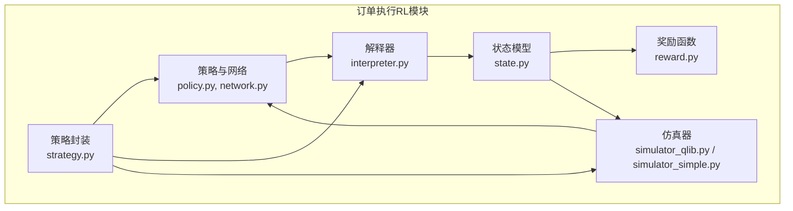
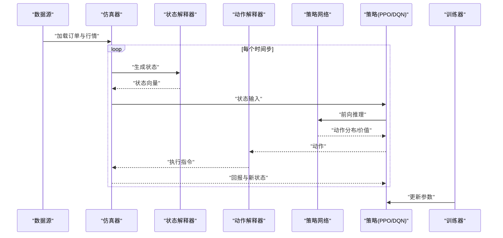
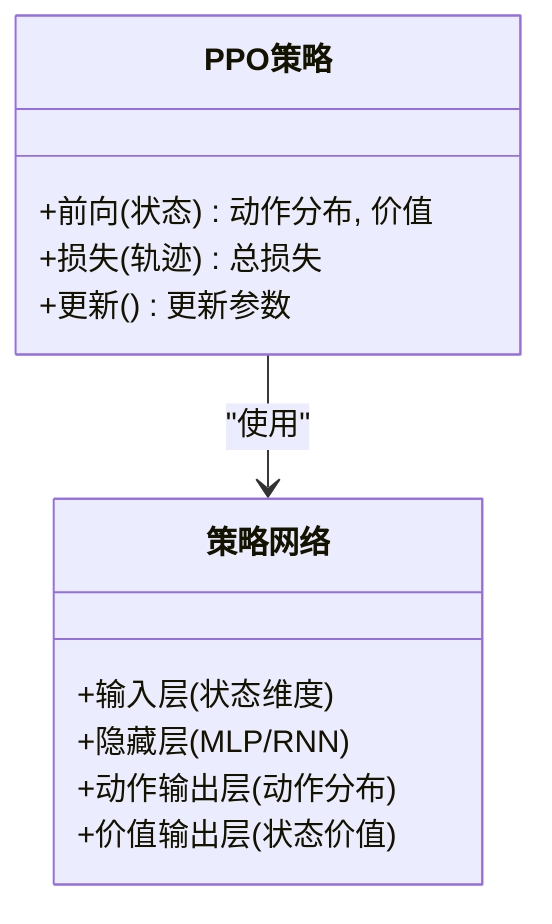
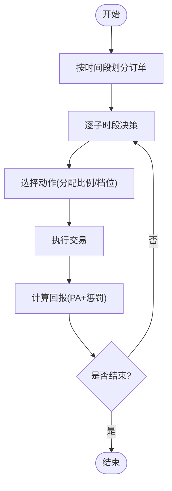
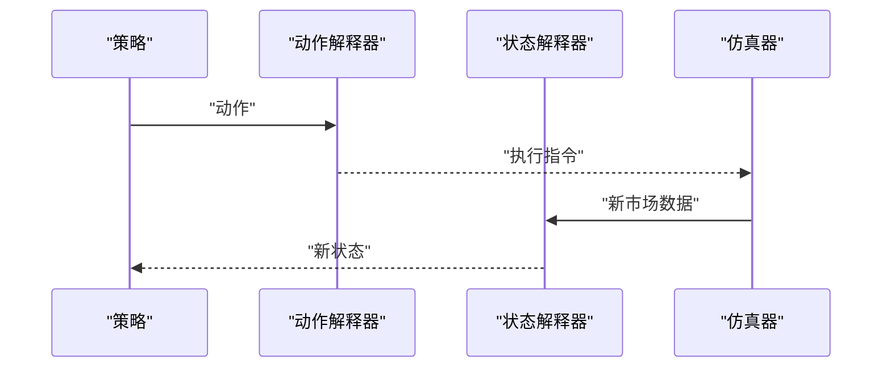
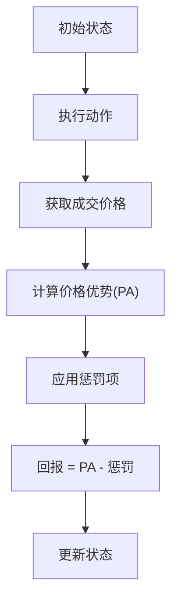
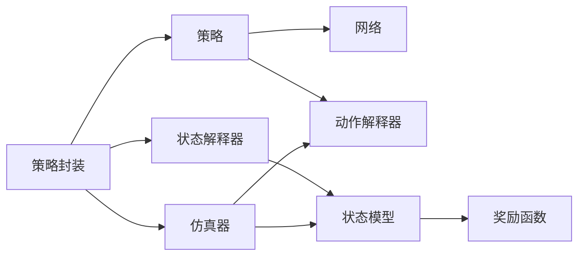

# 策略算法实现

<cite>
**本文引用的文件**
- [policy.py](file://qlib/rl/order_execution/policy.py)
- [network.py](file://qlib/rl/order_execution/network.py)
- [interpreter.py](file://qlib/rl/order_execution/interpreter.py)
- [state.py](file://qlib/rl/order_execution/state.py)
- [reward.py](file://qlib/rl/order_execution/reward.py)
- [simulator_qlib.py](file://qlib/rl/order_execution/simulator_qlib.py)
- [simulator_simple.py](file://qlib/rl/order_execution/simulator_simple.py)
- [strategy.py](file://qlib/rl/order_execution/strategy.py)
- [train_opds.yml](file://examples/rl_order_execution/exp_configs/train_opds.yml)
- [backtest_ppo.yml](file://examples/rl_order_execution/exp_configs/backtest_ppo.yml)
- [backtest_opds.yml](file://examples/rl_order_execution/exp_configs/backtest_opds.yml)
- [test_saoe_simple.py](file://tests/rl/test_saoe_simple.py)
- [README.md](file://examples/rl_order_execution/README.md)
</cite>

## 目录
1. [引言](#引言)
2. [项目结构](#项目结构)
3. [核心组件](#核心组件)
4. [架构总览](#架构总览)
5. [详细组件分析](#详细组件分析)
6. [依赖关系分析](#依赖关系分析)
7. [性能考量](#性能考量)
8. [故障排查指南](#故障排查指南)
9. [结论](#结论)
10. [附录](#附录)

## 引言
本文件面向强化学习在订单执行场景中的策略算法实现，聚焦于PPO与OPDS两类策略。我们将系统梳理策略网络结构、动作空间建模、状态表示与奖励设计，并给出策略解释器（动作解码与状态转换）的工作机制说明。同时提供配置参数说明与调优建议，结合示例配置与测试用例，帮助读者快速上手训练与回测。

## 项目结构
强化学习订单执行模块位于 qlib/rl/order_execution 下，围绕“环境仿真—状态解释—动作解释—策略—训练/回测”闭环组织。关键文件包括：
- 策略与网络：policy.py、network.py
- 解释器：interpreter.py（状态与动作）
- 状态与奖励：state.py、reward.py
- 仿真器：simulator_qlib.py、simulator_simple.py
- 策略封装与运行：strategy.py
- 示例配置：examples/rl_order_execution/exp_configs/*.yml
- 测试用例：tests/rl/test_saoe_simple.py

图示来源
- [policy.py](file://qlib/rl/order_execution/policy.py)
- [network.py](file://qlib/rl/order_execution/network.py)
- [interpreter.py](file://qlib/rl/order_execution/interpreter.py)
- [state.py](file://qlib/rl/order_execution/state.py)
- [reward.py](file://qlib/rl/order_execution/reward.py)
- [simulator_qlib.py](file://qlib/rl/order_execution/simulator_qlib.py)
- [simulator_simple.py](file://qlib/rl/order_execution/simulator_simple.py)
- [strategy.py](file://qlib/rl/order_execution/strategy.py)

章节来源
- [policy.py](file://qlib/rl/order_execution/policy.py)
- [network.py](file://qlib/rl/order_execution/network.py)
- [interpreter.py](file://qlib/rl/order_execution/interpreter.py)
- [state.py](file://qlib/rl/order_execution/state.py)
- [reward.py](file://qlib/rl/order_execution/reward.py)
- [simulator_qlib.py](file://qlib/rl/order_execution/simulator_qlib.py)
- [simulator_simple.py](file://qlib/rl/order_execution/simulator_simple.py)
- [strategy.py](file://qlib/rl/order_execution/strategy.py)

## 核心组件
- 策略与网络
  - PPO策略类：封装策略网络、动作分布、价值网络与优化流程，支持连续/离散动作空间。
  - 网络模块：提供基础MLP与RNN（循环）网络作为策略头，用于从状态特征映射到动作分布与价值。
- 解释器
  - 动作解释器：将策略输出的动作映射为可执行的交易指令（如按档位或比例下单）。
  - 状态解释器：将原始市场数据与订单信息整合为策略可观测的状态向量。
- 状态与奖励
  - 状态模型：定义单资产订单执行的状态结构（剩余数量、时间步、价格/成交量等）。
  - 奖励函数：以价格优势（PA）为核心指标，结合惩罚项引导策略收敛。
- 仿真器
  - Qlib仿真器：基于真实市场数据进行高保真回测。
  - 简化仿真器：用于快速验证逻辑与调试。
- 策略封装
  - 将解释器、仿真器与策略组合，形成可训练/可回测的完整流程。

章节来源
- [policy.py](file://qlib/rl/order_execution/policy.py)
- [network.py](file://qlib/rl/order_execution/network.py)
- [interpreter.py](file://qlib/rl/order_execution/interpreter.py)
- [state.py](file://qlib/rl/order_execution/state.py)
- [reward.py](file://qlib/rl/order_execution/reward.py)
- [simulator_qlib.py](file://qlib/rl/order_execution/simulator_qlib.py)
- [simulator_simple.py](file://qlib/rl/order_execution/simulator_simple.py)
- [strategy.py](file://qlib/rl/order_execution/strategy.py)

## 架构总览
下图展示从“订单与市场数据”到“策略决策与执行”的端到端流程，以及训练与回测阶段的关键交互。

图示来源
- [policy.py](file://qlib/rl/order_execution/policy.py)
- [network.py](file://qlib/rl/order_execution/network.py)
- [interpreter.py](file://qlib/rl/order_execution/interpreter.py)
- [state.py](file://qlib/rl/order_execution/state.py)
- [reward.py](file://qlib/rl/order_execution/reward.py)
- [simulator_qlib.py](file://qlib/rl/order_execution/simulator_qlib.py)
- [simulator_simple.py](file://qlib/rl/order_execution/simulator_simple.py)
- [strategy.py](file://qlib/rl/order_execution/strategy.py)

## 详细组件分析

### PPO策略实现
- 策略网络结构
  - 输入层：接收状态向量维度，通常由历史价格、成交量、订单剩余量、时间步等组成。
  - 隐藏层：多层感知机（MLP），用于非线性特征提取；可选循环层（RNN/GRU/LSTM）以捕捉时序依赖。
  - 输出层：分别输出动作分布参数（如均值/方差或分类概率）与价值估计。
- 策略函数定义
  - 动作分布：根据动作类型选择连续正态分布或离散分类分布。
  - 价值网络：独立的输出分支，用于计算状态价值，辅助优势估计。
  - 损失函数：包含策略损失（PPO目标）、价值损失与熵正则项。
- 训练流程
  - 收集轨迹（状态、动作、回报、截断标志）。
  - 多轮更新（重复采样、批内优化），控制KL散度与裁剪阈值以稳定训练。
- 回测流程
  - 使用已训练权重进行推理，动作解释器将策略输出映射为实际交易指令。

图示来源
- [policy.py](file://qlib/rl/order_execution/policy.py)
- [network.py](file://qlib/rl/order_execution/network.py)

章节来源
- [policy.py](file://qlib/rl/order_execution/policy.py)
- [network.py](file://qlib/rl/order_execution/network.py)

### OPDS策略实现
- 策略思想
  - OPDS（Optimal Portfolio Decision Strategy）在订单执行中采用分阶段决策：先按时间段分配，再在每个子时段内做微调。
  - 结合规则基线（如TWAP）与强化学习策略（如PPO），提升稳定性与收益。
- 实现要点
  - 动作空间：离散动作（如将剩余量按档位分配）。
  - 状态空间：包含剩余未成交数量、当前时间步、价格/成交量统计等。
  - 奖励：以价格优势（PA）为主，辅以惩罚项抑制滑点与延迟。
- 训练与回测
  - 训练配置示例见 train_opds.yml；回测配置见 backtest_opds.yml。

图示来源
- [train_opds.yml](file://examples/rl_order_execution/exp_configs/train_opds.yml)
- [backtest_opds.yml](file://examples/rl_order_execution/exp_configs/backtest_opds.yml)
- [reward.py](file://qlib/rl/order_execution/reward.py)
- [interpreter.py](file://qlib/rl/order_execution/interpreter.py)

章节来源
- [train_opds.yml](file://examples/rl_order_execution/exp_configs/train_opds.yml)
- [backtest_opds.yml](file://examples/rl_order_execution/exp_configs/backtest_opds.yml)
- [reward.py](file://qlib/rl/order_execution/reward.py)
- [interpreter.py](file://qlib/rl/order_execution/interpreter.py)

### 策略解释器
- 动作解释器
  - 职责：将策略输出的动作映射为可执行的交易指令（如按档位下单、按比例拆单）。
  - 关键接口：接收策略动作与当前状态，返回具体下单指令（方向、数量、价格）。
- 状态解释器
  - 职责：将原始市场数据（OHLCV、挂单簿）与订单信息整合为统一状态向量。
  - 关键接口：输入订单与市场快照，输出标准化状态张量，供策略网络消费。

图示来源
- [interpreter.py](file://qlib/rl/order_execution/interpreter.py)
- [state.py](file://qlib/rl/order_execution/state.py)
- [simulator_qlib.py](file://qlib/rl/order_execution/simulator_qlib.py)

章节来源
- [interpreter.py](file://qlib/rl/order_execution/interpreter.py)
- [state.py](file://qlib/rl/order_execution/state.py)
- [simulator_qlib.py](file://qlib/rl/order_execution/simulator_qlib.py)

### 状态与奖励
- 状态模型
  - 定义单资产订单执行的状态要素：剩余未成交数量、当前时间步、价格/成交量统计、订单生命周期等。
  - 提供状态转换逻辑：根据执行结果推进时间步、更新剩余量与市场条件。
- 奖励函数
  - 以价格优势（PA）为核心指标，衡量执行价格相对于市场价的优劣。
  - 可加入惩罚项（如滑点、延迟、冲击成本），引导策略在收益与风险间平衡。

图示来源
- [state.py](file://qlib/rl/order_execution/state.py)
- [reward.py](file://qlib/rl/order_execution/reward.py)

章节来源
- [state.py](file://qlib/rl/order_execution/state.py)
- [reward.py](file://qlib/rl/order_execution/reward.py)

### 仿真器
- Qlib仿真器
  - 基于真实市场数据进行高保真回测，支持多并发与并行模式，便于大规模实验。
- 简化仿真器
  - 用于快速验证逻辑与调试，减少外部依赖。

章节来源
- [simulator_qlib.py](file://qlib/rl/order_execution/simulator_qlib.py)
- [simulator_simple.py](file://qlib/rl/order_execution/simulator_simple.py)

### 训练与回测配置
- 训练配置（OPDS/PPO）
  - 环境参数：并发度、并行模式、时间粒度、每步时间、成交量限制等。
  - 解释器参数：动作解释器（离散动作数、最大步数）、状态解释器（历史维度、时间步长、特征列）。
  - 奖励函数：价格优势（PA）与惩罚系数。
  - 数据源：订单目录、特征根目录、特征列、处理维度等。
  - 网络与策略：网络类型（如RNN）、策略类型（PPO/DQN）、学习率等。
  - 训练超参：最大轮次、每收集回合的步数、批量大小、早停耐心、检查点路径等。
- 回测配置
  - 与训练配置类似，但关注评估指标与输出路径。

章节来源
- [train_opds.yml](file://examples/rl_order_execution/exp_configs/train_opds.yml)
- [backtest_ppo.yml](file://examples/rl_order_execution/exp_configs/backtest_ppo.yml)
- [backtest_opds.yml](file://examples/rl_order_execution/exp_configs/backtest_opds.yml)

### 使用示例与测试
- 单元测试展示了如何加载预训练权重、构建解释器与策略、运行回测并校验指标（如完成率、价格优势、市场价与成交价）。
- 示例脚本与配置文件提供了从训练到回测的完整流程参考。

章节来源
- [test_saoe_simple.py](file://tests/rl/test_saoe_simple.py)
- [README.md](file://examples/rl_order_execution/README.md)

## 依赖关系分析
- 组件耦合
  - 策略依赖网络与解释器；解释器依赖状态模型；仿真器依赖解释器与状态模型；策略封装协调各模块。
- 外部依赖
  - 训练与回测依赖配置文件与数据目录；测试用例依赖预训练权重与示例数据。

图示来源
- [policy.py](file://qlib/rl/order_execution/policy.py)
- [network.py](file://qlib/rl/order_execution/network.py)
- [interpreter.py](file://qlib/rl/order_execution/interpreter.py)
- [state.py](file://qlib/rl/order_execution/state.py)
- [reward.py](file://qlib/rl/order_execution/reward.py)
- [simulator_qlib.py](file://qlib/rl/order_execution/simulator_qlib.py)
- [strategy.py](file://qlib/rl/order_execution/strategy.py)

章节来源
- [policy.py](file://qlib/rl/order_execution/policy.py)
- [network.py](file://qlib/rl/order_execution/network.py)
- [interpreter.py](file://qlib/rl/order_execution/interpreter.py)
- [state.py](file://qlib/rl/order_execution/state.py)
- [reward.py](file://qlib/rl/order_execution/reward.py)
- [simulator_qlib.py](file://qlib/rl/order_execution/simulator_qlib.py)
- [strategy.py](file://qlib/rl/order_execution/strategy.py)

## 性能考量
- 网络深度与宽度
  - 在保证表达能力的前提下，避免过深导致梯度不稳定；对RNN需注意梯度消失/爆炸问题。
- 批量与并行
  - 合理设置episode_per_collect与batch_size，平衡内存占用与收敛速度；并发度受硬件与数据IO限制。
- 学习率与优化
  - 初始学习率不宜过大；可结合学习率调度与梯度裁剪稳定训练。
- 奖励设计
  - PA为主、惩罚为辅，确保奖励信号平滑且可区分；必要时引入归一化或自适应惩罚系数。
- 数据质量
  - 特征工程与缺失处理对策略鲁棒性影响显著；仿真器应尽量贴近真实市场微观结构。

## 故障排查指南
- 训练不收敛
  - 检查学习率、批量大小与奖励缩放；确认动作/状态解释器输出范围合理。
- 回测指标异常
  - 对比PA、完成率与成交价偏差；核对仿真器参数与数据切片范围。
- 内存不足
  - 减少并发度、降低episode_per_collect或batch_size；清理中间缓存。
- 权重加载失败
  - 确认网络结构与权重文件一致；检查设备映射（CPU/GPU）设置。

## 结论
本文系统梳理了Qlib中强化学习订单执行策略的实现，重点覆盖PPO与OPDS两类策略的网络结构、动作空间建模、状态与奖励设计，以及解释器与仿真器的协作机制。通过示例配置与测试用例，读者可快速搭建训练与回测流程，并依据性能表现进行参数调优。

## 附录
- 示例配置文件
  - 训练OPDS：[train_opds.yml](file://examples/rl_order_execution/exp_configs/train_opds.yml)
  - 回测PPO：[backtest_ppo.yml](file://examples/rl_order_execution/exp_configs/backtest_ppo.yml)
  - 回测OPDS：[backtest_opds.yml](file://examples/rl_order_execution/exp_configs/backtest_opds.yml)
- 基准结果参考
  - 示例文档中的PA均值与标准差可用于对比评估：[README.md](file://examples/rl_order_execution/README.md)
- 测试用例参考
  - 单资产订单执行回测与训练流程示例：[test_saoe_simple.py](file://tests/rl/test_saoe_simple.py)