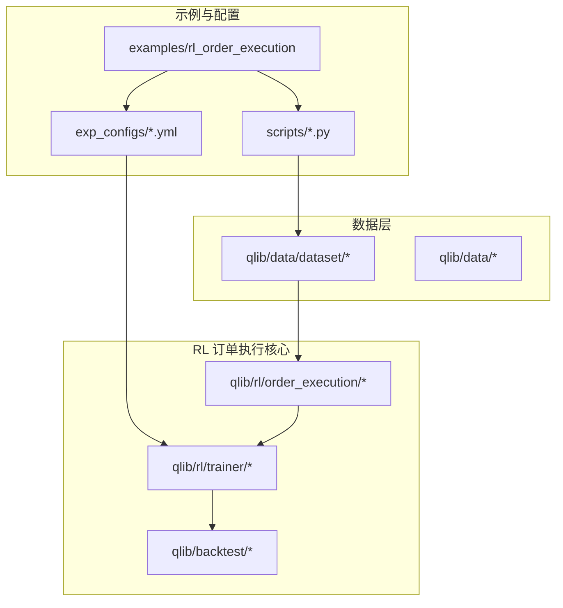
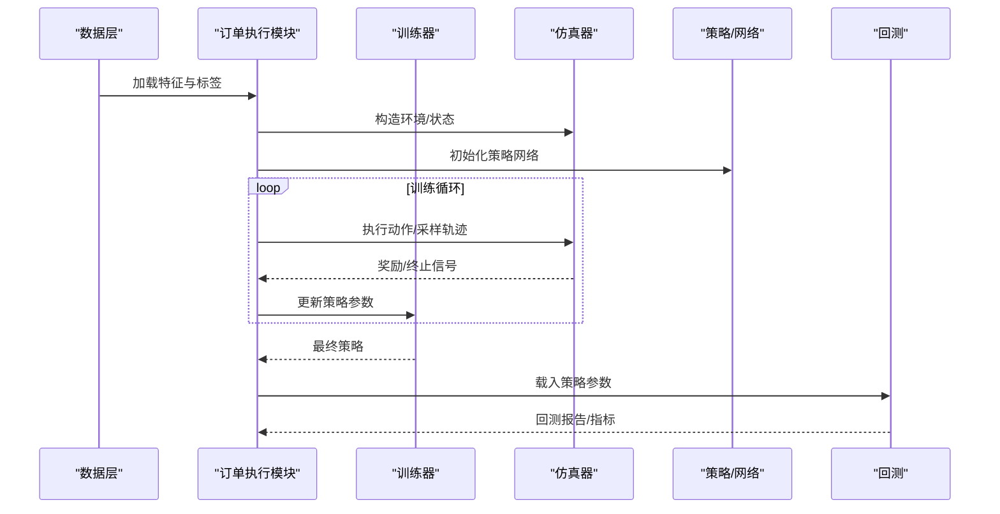
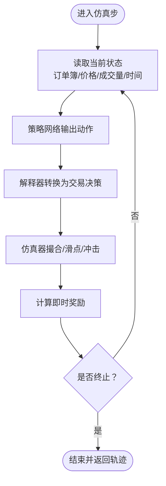
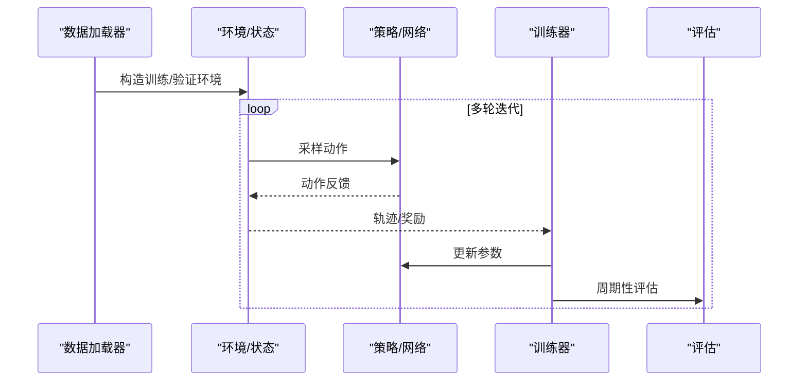
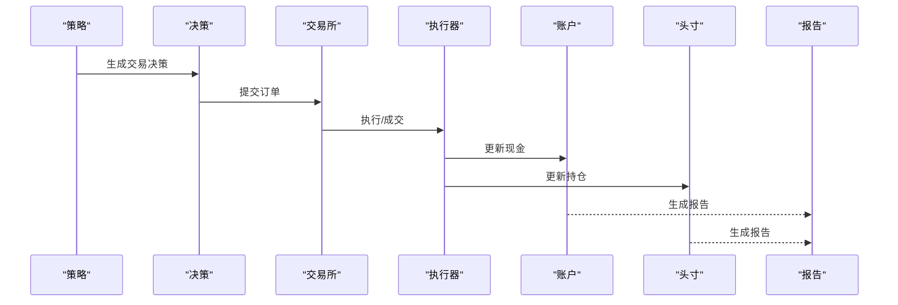
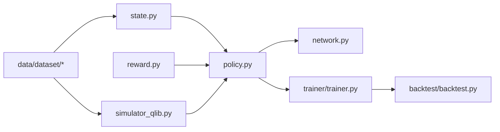

# 订单执行策略

<cite>
**本文引用的文件**
- [examples/rl_order_execution/README.md](file://examples/rl_order_execution/README.md)
- [examples/rl_order_execution/exp_configs/train_ppo.yml](file://examples/rl_order_execution/exp_configs/train_ppo.yml)
- [examples/rl_order_execution/exp_configs/backtest_ppo.yml](file://examples/rl_order_execution/exp_configs/backtest_ppo.yml)
- [examples/rl_order_execution/exp_configs/train_opds.yml](file://examples/rl_order_execution/exp_configs/train_opds.yml)
- [examples/rl_order_execution/exp_configs/backtest_opds.yml](file://examples/rl_order_execution/exp_configs/backtest_opds.yml)
- [examples/rl_order_execution/exp_configs/backtest_twap.yml](file://examples/rl_order_execution/exp_configs/backtest_twap.yml)
- [examples/rl_order_execution/scripts/gen_pickle_data.py](file://examples/rl_order_execution/scripts/gen_pickle_data.py)
- [examples/rl_order_execution/scripts/gen_training_orders.py](file://examples/rl_order_execution/scripts/gen_training_orders.py)
- [examples/rl_order_execution/scripts/merge_orders.py](file://examples/rl_order_execution/scripts/merge_orders.py)
- [examples/rl_order_execution/scripts/pickle_data_config.yml](file://examples/rl_order_execution/scripts/pickle_data_config.yml)
- [qlib/rl/order_execution/__init__.py](file://qlib/rl/order_execution/__init__.py)
- [qlib/rl/order_execution/state.py](file://qlib/rl/order_execution/state.py)
- [qlib/rl/order_execution/reward.py](file://qlib/rl/order_execution/reward.py)
- [qlib/rl/order_execution/policy.py](file://qlib/rl/order_execution/policy.py)
- [qlib/rl/order_execution/network.py](file://qlib/rl/order_execution/network.py)
- [qlib/rl/order_execution/simulator_qlib.py](file://qlib/rl/order_execution/simulator_qlib.py)
- [qlib/rl/order_execution/simulator_simple.py](file://qlib/rl/order_execution/simulator_simple.py)
- [qlib/rl/order_execution/strategy.py](file://qlib/rl/order_execution/strategy.py)
- [qlib/rl/order_execution/interpreter.py](file://qlib/rl/order_execution/interpreter.py)
- [qlib/rl/order_execution/utils.py](file://qlib/rl/order_execution/utils.py)
- [qlib/rl/trainer/trainer.py](file://qlib/rl/trainer/trainer.py)
- [qlib/rl/trainer/api.py](file://qlib/rl/trainer/api.py)
- [qlib/rl/contrib/train_onpolicy.py](file://qlib/rl/contrib/train_onpolicy.py)
- [qlib/rl/contrib/backtest.py](file://qlib/rl/contrib/backtest.py)
- [qlib/backtest/backtest.py](file://qlib/backtest/backtest.py)
- [qlib/backtest/exchange.py](file://qlib/backtest/exchange.py)
- [qlib/backtest/executor.py](file://qlib/backtest/executor.py)
- [qlib/backtest/position.py](file://qlib/backtest/position.py)
- [qlib/backtest/account.py](file://qlib/backtest/account.py)
- [qlib/backtest/decision.py](file://qlib/backtest/decision.py)
- [qlib/backtest/report.py](file://qlib/backtest/report.py)
- [qlib/backtest/profit_attribution.py](file://qlib/backtest/profit_attribution.py)
- [qlib/data/dataset/handler.py](file://qlib/data/dataset/handler.py)
- [qlib/data/dataset/loader.py](file://qlib/data/dataset/loader.py)
- [qlib/data/dataset/processor.py](file://qlib/data/dataset/processor.py)
- [qlib/data/dataset/storage.py](file://qlib/data/dataset/storage.py)
- [qlib/data/base.py](file://qlib/data/base.py)
- [qlib/data/data.py](file://qlib/data/data.py)
- [qlib/data/filter.py](file://qlib/data/filter.py)
- [qlib/data/ops.py](file://qlib/data/ops.py)
- [qlib/data/inst_processor.py](file://qlib/data/inst_processor.py)
- [qlib/data/storage/file_storage.py](file://qlib/data/storage/file_storage.py)
- [qlib/data/storage/storage.py](file://qlib/data/storage/storage.py)
</cite>

## 目录
1. [引言](#引言)
2. [项目结构](#项目结构)
3. [核心组件](#核心组件)
4. [架构总览](#架构总览)
5. [详细组件分析](#详细组件分析)
6. [依赖关系分析](#依赖关系分析)
7. [性能考量](#性能考量)
8. [故障排查指南](#故障排查指南)
9. [结论](#结论)
10. [附录](#附录)

## 引言
本文件面向量化交易与强化学习研究者，系统梳理 QLib 中“订单执行策略”的技术实现，重点覆盖：
- 传统执行策略（TWAP、VWAP）在强化学习框架下的统一建模与实现路径
- 订单执行环境设计：市场微观结构、流动性建模、价格冲击等关键要素
- 状态表示方法：订单簿数据、历史价格序列、成交量等特征工程
- 算法实现与配置：PPO、OPDS 在订单执行中的具体用法与训练/回测流程
- 完整的训练与测试流程示例，帮助快速落地

## 项目结构
该功能主要分布在以下两个区域：
- 示例与配置：examples/rl_order_execution 提供训练与回测的 YAML 配置、数据生成脚本
- 核心实现：qlib/rl/order_execution 提供状态、奖励、策略、仿真器、网络、解释器等模块；配合 qlib/rl/trainer 与 qlib/backtest 实现训练与回测闭环

**图表来源**
- [examples/rl_order_execution/README.md](file://examples/rl_order_execution/README.md)
- [examples/rl_order_execution/exp_configs/train_ppo.yml](file://examples/rl_order_execution/exp_configs/train_ppo.yml)
- [examples/rl_order_execution/scripts/gen_pickle_data.py](file://examples/rl_order_execution/scripts/gen_pickle_data.py)
- [qlib/rl/order_execution/state.py](file://qlib/rl/order_execution/state.py)
- [qlib/rl/order_execution/reward.py](file://qlib/rl/order_execution/reward.py)
- [qlib/rl/order_execution/simulator_qlib.py](file://qlib/rl/order_execution/simulator_qlib.py)
- [qlib/rl/trainer/trainer.py](file://qlib/rl/trainer/trainer.py)
- [qlib/backtest/backtest.py](file://qlib/backtest/backtest.py)

**章节来源**
- [examples/rl_order_execution/README.md](file://examples/rl_order_execution/README.md)
- [examples/rl_order_execution/exp_configs/train_ppo.yml](file://examples/rl_order_execution/exp_configs/train_ppo.yml)
- [examples/rl_order_execution/scripts/gen_pickle_data.py](file://examples/rl_order_execution/scripts/gen_pickle_data.py)

## 核心组件
- 状态表示（state）：定义订单执行过程中的观测空间，包含订单簿、历史价格、成交量、时间进度等
- 奖励函数（reward）：刻画执行收益与成本，如时间加权平均价格（TWAP）偏离、成交量加权平均价格（VWAP）偏离、价格冲击与滑点
- 策略与网络（policy/network）：策略网络输出动作（如剩余时间内的下单比例或价格档位），价值/优势网络用于评估状态价值
- 仿真器（simulator_qlib/simulator_simple）：模拟市场微观结构，支持订单簿驱动与简化的随机游走模型
- 解释器（interpreter）：将策略动作映射为实际交易决策（限价单/市价单、挂单量、档位）
- 训练器（trainer）：封装 RL 训练循环，支持回调、日志、检查点等
- 回测（backtest）：将策略在历史数据上进行回测，计算收益、风险与归因指标

**章节来源**
- [qlib/rl/order_execution/state.py](file://qlib/rl/order_execution/state.py)
- [qlib/rl/order_execution/reward.py](file://qlib/rl/order_execution/reward.py)
- [qlib/rl/order_execution/policy.py](file://qlib/rl/order_execution/policy.py)
- [qlib/rl/order_execution/network.py](file://qlib/rl/order_execution/network.py)
- [qlib/rl/order_execution/simulator_qlib.py](file://qlib/rl/order_execution/simulator_qlib.py)
- [qlib/rl/order_execution/simulator_simple.py](file://qlib/rl/order_execution/simulator_simple.py)
- [qlib/rl/order_execution/interpreter.py](file://qlib/rl/order_execution/interpreter.py)
- [qlib/rl/trainer/trainer.py](file://qlib/rl/trainer/trainer.py)
- [qlib/backtest/backtest.py](file://qlib/backtest/backtest.py)

## 架构总览
下图展示从数据到训练再到回测的整体流程，以及 RL 模块与回测模块的交互。

**图表来源**
- [qlib/rl/order_execution/state.py](file://qlib/rl/order_execution/state.py)
- [qlib/rl/order_execution/reward.py](file://qlib/rl/order_execution/reward.py)
- [qlib/rl/order_execution/simulator_qlib.py](file://qlib/rl/order_execution/simulator_qlib.py)
- [qlib/rl/order_execution/policy.py](file://qlib/rl/order_execution/policy.py)
- [qlib/rl/trainer/trainer.py](file://qlib/rl/trainer/trainer.py)
- [qlib/backtest/backtest.py](file://qlib/backtest/backtest.py)

## 详细组件分析

### 状态表示（State）
- 输入特征维度：订单簿买卖价档与量、历史价格序列（如 OHLCV）、成交量、时间进度（已耗时/剩余时间）、未成交剩余量、对手方流动性指标（如买卖价差、深度）
- 特征工程要点：
  - 归一化/标准化：对价格、量、时间等进行归一化，避免量纲差异影响收敛
  - 时间窗口：滑动窗口聚合订单簿与价格序列，形成时序特征
  - 流动性指标：买卖价差、深度、成交量加权平均撤单价等
  - 动态特征：剩余未成交比例、当前时刻相对时间位置、是否处于流动性高峰/低谷
- 输出观测向量：作为策略网络输入，决定下一步动作

**章节来源**
- [qlib/rl/order_execution/state.py](file://qlib/rl/order_execution/state.py)

### 奖励函数（Reward）
- 目标函数：最小化执行成本，最大化收益，同时考虑价格冲击与滑点
- 经典目标：
  - TWAP 偏离：比较实际均价与时间段内时间加权平均价格的偏差
  - VWAP 偏离：比较实际均价与成交量加权平均价格的偏差
- 成本项：
  - 价格冲击：订单对市场的影响导致的额外成本
  - 滑点：限价单未成交或部分成交造成的损失
  - 市场噪声：随机波动带来的不确定性
- 奖励设计建议：
  - 使用折扣累积奖励，鼓励长期收益
  - 对极端动作（过大单、频繁调整）施加惩罚

**章节来源**
- [qlib/rl/order_execution/reward.py](file://qlib/rl/order_execution/reward.py)

### 策略与网络（Policy/Network）
- 策略网络：输出动作分布（如连续动作的均值/方差或离散动作的概率），可采用 Actor-Critic 或 PPO 的策略网络
- 价值/优势网络：评估状态价值，辅助策略优化
- 关键配置：
  - 动作空间：下单比例、价格档位、限价/市价选择
  - 网络结构：MLP/CNN/Transformer 等，依据状态维度与时间序列特性选择
  - 学习率、批量大小、裁剪阈值、熵正则等超参数

**章节来源**
- [qlib/rl/order_execution/policy.py](file://qlib/rl/order_execution/policy.py)
- [qlib/rl/order_execution/network.py](file://qlib/rl/order_execution/network.py)

### 仿真器（Simulator）
- 订单簿驱动仿真（simulator_qlib）：基于真实订单簿数据，模拟限价单簿、撮合规则、价格跳动与流动性变化
- 简化仿真（simulator_simple）：使用随机游走或简单动态模型，便于快速验证算法思路
- 关键要素：
  - 撮合机制：按价格优先、时间优先原则匹配
  - 价格冲击：大单可能触发滑点与价格跳变
  - 流动性建模：买卖价差、深度随订单簿变化

**图表来源**
- [qlib/rl/order_execution/simulator_qlib.py](file://qlib/rl/order_execution/simulator_qlib.py)
- [qlib/rl/order_execution/interpreter.py](file://qlib/rl/order_execution/interpreter.py)
- [qlib/rl/order_execution/reward.py](file://qlib/rl/order_execution/reward.py)

**章节来源**
- [qlib/rl/order_execution/simulator_qlib.py](file://qlib/rl/order_execution/simulator_qlib.py)
- [qlib/rl/order_execution/simulator_simple.py](file://qlib/rl/order_execution/simulator_simple.py)
- [qlib/rl/order_execution/interpreter.py](file://qlib/rl/order_execution/interpreter.py)

### 训练器与训练流程（Trainer）
- 训练器封装了 RL 的训练循环、回调、日志与检查点管理
- 典型流程：
  - 数据准备：通过数据集处理器加载特征与标签
  - 环境构建：将数据映射为状态/动作/奖励
  - 训练循环：多进程/多线程采样轨迹，更新策略网络
  - 评估：周期性评估策略在验证集上的表现
- 支持的算法：
  - PPO：稳定的策略梯度方法，适合连续/离散动作空间
  - OPDS：基于优化的订单执行策略，可作为基线或与 RL 结合

**图表来源**
- [qlib/rl/order_execution/state.py](file://qlib/rl/order_execution/state.py)
- [qlib/rl/order_execution/policy.py](file://qlib/rl/order_execution/policy.py)
- [qlib/rl/trainer/trainer.py](file://qlib/rl/trainer/trainer.py)
- [qlib/rl/contrib/train_onpolicy.py](file://qlib/rl/contrib/train_onpolicy.py)

**章节来源**
- [qlib/rl/trainer/trainer.py](file://qlib/rl/trainer/trainer.py)
- [qlib/rl/contrib/train_onpolicy.py](file://qlib/rl/contrib/train_onpolicy.py)

### 回测（Backtest）
- 将训练好的策略应用于历史数据，生成交易决策并执行
- 关键模块：
  - 交易所（exchange）：模拟交易执行与费用
  - 执行器（executor）：根据决策执行订单
  - 账户（account）/头寸（position）：记录资金与持仓
  - 报告（report）：汇总收益、最大回撤、夏普比率等指标
- 可视化与归因：支持收益分解、换手率、冲击成本等分析

**图表来源**
- [qlib/backtest/backtest.py](file://qlib/backtest/backtest.py)
- [qlib/backtest/exchange.py](file://qlib/backtest/exchange.py)
- [qlib/backtest/executor.py](file://qlib/backtest/executor.py)
- [qlib/backtest/account.py](file://qlib/backtest/account.py)
- [qlib/backtest/position.py](file://qlib/backtest/position.py)
- [qlib/backtest/report.py](file://qlib/backtest/report.py)
- [qlib/backtest/profit_attribution.py](file://qlib/backtest/profit_attribution.py)

**章节来源**
- [qlib/backtest/backtest.py](file://qlib/backtest/backtest.py)
- [qlib/backtest/exchange.py](file://qlib/backtest/exchange.py)
- [qlib/backtest/executor.py](file://qlib/backtest/executor.py)
- [qlib/backtest/position.py](file://qlib/backtest/position.py)
- [qlib/backtest/account.py](file://qlib/backtest/account.py)
- [qlib/backtest/report.py](file://qlib/backtest/report.py)
- [qlib/backtest/profit_attribution.py](file://qlib/backtest/profit_attribution.py)

### 传统策略的强化学习实现路径（TWAP/VWAP）
- TWAP/VWAP 可视为“先验”或“基线”，RL 的目标是在其基础上进一步降低滑点与冲击成本
- 实现步骤：
  - 将 TWAP/VWAP 的执行比例作为监督信号，训练策略网络（行为克隆）
  - 或将其作为奖励函数的一部分，引导策略向更优的执行路径收敛
  - 使用仿真器评估不同策略在相同市场条件下的表现

**章节来源**
- [examples/rl_order_execution/exp_configs/backtest_twap.yml](file://examples/rl_order_execution/exp_configs/backtest_twap.yml)
- [examples/rl_order_execution/exp_configs/backtest_ppo.yml](file://examples/rl_order_execution/exp_configs/backtest_ppo.yml)
- [examples/rl_order_execution/exp_configs/backtest_opds.yml](file://examples/rl_order_execution/exp_configs/backtest_opds.yml)

### 数据与特征工程
- 数据来源：高频行情（OHLCV）、订单簿快照、成交量、时间戳
- 数据处理：
  - 数据清洗与缺失填充
  - 特征构造：价格序列、成交量序列、时间窗口统计、流动性指标
  - 标签生成：以目标（TWAP/VWAP）为基准，计算执行成本作为监督信号
- 数据管道：通过数据集处理器与存储模块组织训练/回测数据

**章节来源**
- [examples/rl_order_execution/scripts/gen_pickle_data.py](file://examples/rl_order_execution/scripts/gen_pickle_data.py)
- [examples/rl_order_execution/scripts/gen_training_orders.py](file://examples/rl_order_execution/scripts/gen_training_orders.py)
- [examples/rl_order_execution/scripts/merge_orders.py](file://examples/rl_order_execution/scripts/merge_orders.py)
- [examples/rl_order_execution/scripts/pickle_data_config.yml](file://examples/rl_order_execution/scripts/pickle_data_config.yml)
- [qlib/data/dataset/handler.py](file://qlib/data/dataset/handler.py)
- [qlib/data/dataset/loader.py](file://qlib/data/dataset/loader.py)
- [qlib/data/dataset/processor.py](file://qlib/data/dataset/processor.py)
- [qlib/data/dataset/storage.py](file://qlib/data/dataset/storage.py)
- [qlib/data/base.py](file://qlib/data/base.py)
- [qlib/data/data.py](file://qlib/data/data.py)
- [qlib/data/filter.py](file://qlib/data/filter.py)
- [qlib/data/ops.py](file://qlib/data/ops.py)
- [qlib/data/inst_processor.py](file://qlib/data/inst_processor.py)
- [qlib/data/storage/file_storage.py](file://qlib/data/storage/file_storage.py)
- [qlib/data/storage/storage.py](file://qlib/data/storage/storage.py)

## 依赖关系分析
- 模块耦合：
  - state/reward/simulator 与 policy/network 紧密耦合，共同构成 RL 训练闭环
  - trainer 与 contrib 的 on-policy 训练工具协同工作
  - backtest 依赖 exchange/executor/account/position/report 等模块完成回测
- 外部依赖：
  - 数据层提供特征与标签，支撑状态构造与监督信号
  - 高频数据与订单簿数据是仿真器与状态表示的关键输入

**图表来源**
- [qlib/rl/order_execution/state.py](file://qlib/rl/order_execution/state.py)
- [qlib/rl/order_execution/reward.py](file://qlib/rl/order_execution/reward.py)
- [qlib/rl/order_execution/policy.py](file://qlib/rl/order_execution/policy.py)
- [qlib/rl/order_execution/network.py](file://qlib/rl/order_execution/network.py)
- [qlib/rl/order_execution/simulator_qlib.py](file://qlib/rl/order_execution/simulator_qlib.py)
- [qlib/rl/trainer/trainer.py](file://qlib/rl/trainer/trainer.py)
- [qlib/backtest/backtest.py](file://qlib/backtest/backtest.py)
- [qlib/data/dataset/handler.py](file://qlib/data/dataset/handler.py)

**章节来源**
- [qlib/rl/order_execution/state.py](file://qlib/rl/order_execution/state.py)
- [qlib/rl/order_execution/reward.py](file://qlib/rl/order_execution/reward.py)
- [qlib/rl/order_execution/policy.py](file://qlib/rl/order_execution/policy.py)
- [qlib/rl/order_execution/network.py](file://qlib/rl/order_execution/network.py)
- [qlib/rl/order_execution/simulator_qlib.py](file://qlib/rl/order_execution/simulator_qlib.py)
- [qlib/rl/trainer/trainer.py](file://qlib/rl/trainer/trainer.py)
- [qlib/backtest/backtest.py](file://qlib/backtest/backtest.py)

## 性能考量
- 计算效率：
  - 使用批量化与向量化操作，减少 Python 循环开销
  - 合理设置仿真器步长与时间窗口，平衡精度与速度
- 收敛稳定性：
  - 使用合适的奖励缩放与裁剪阈值，避免梯度爆炸
  - 采用价值函数约束与熵正则，提升策略探索能力
- 数据质量：
  - 订单簿数据需去噪与对齐，避免虚假流动性
  - 时间戳与频率保持一致，避免跨市场/跨品种混频

## 故障排查指南
- 训练不收敛或震荡：
  - 检查奖励尺度与归一化是否合理
  - 调整学习率、批量大小与裁剪阈值
- 回测与仿真结果不一致：
  - 对比仿真器与回测中交易执行细节（滑点、冲击、手续费）
  - 确认解释器动作映射逻辑与回测执行器一致
- 数据问题：
  - 检查订单簿缺失、时间戳错位、异常值
  - 使用数据层的过滤与处理工具进行预处理

**章节来源**
- [qlib/rl/order_execution/utils.py](file://qlib/rl/order_execution/utils.py)
- [qlib/rl/contrib/backtest.py](file://qlib/rl/contrib/backtest.py)
- [qlib/backtest/exchange.py](file://qlib/backtest/exchange.py)
- [qlib/backtest/executor.py](file://qlib/backtest/executor.py)

## 结论
QLib 的订单执行策略模块提供了从数据到训练再到回测的完整闭环，支持将传统策略（TWAP/VWAP）与强化学习方法（PPO/OPDS）统一建模。通过合理的状态表示、奖励设计与仿真器配置，可在保证稳定性的前提下持续优化执行效果。建议结合业务场景与数据特性，逐步迭代特征工程与网络结构，并在仿真与回测双轨验证后上线实盘。

## 附录

### 训练与回测流程示例（步骤级）
- 准备数据
  - 使用数据生成脚本构造 pickle 数据与训练订单
  - 配置 pickle 数据源与特征列
- 训练
  - 选择算法（PPO/OPDS），配置训练 YAML
  - 运行训练器，监控指标与日志
- 回测
  - 载入训练产物，运行回测模块
  - 生成报告与归因分析

**章节来源**
- [examples/rl_order_execution/scripts/gen_pickle_data.py](file://examples/rl_order_execution/scripts/gen_pickle_data.py)
- [examples/rl_order_execution/scripts/gen_training_orders.py](file://examples/rl_order_execution/scripts/gen_training_orders.py)
- [examples/rl_order_execution/scripts/merge_orders.py](file://examples/rl_order_execution/scripts/merge_orders.py)
- [examples/rl_order_execution/scripts/pickle_data_config.yml](file://examples/rl_order_execution/scripts/pickle_data_config.yml)
- [examples/rl_order_execution/exp_configs/train_ppo.yml](file://examples/rl_order_execution/exp_configs/train_ppo.yml)
- [examples/rl_order_execution/exp_configs/backtest_ppo.yml](file://examples/rl_order_execution/exp_configs/backtest_ppo.yml)
- [examples/rl_order_execution/exp_configs/train_opds.yml](file://examples/rl_order_execution/exp_configs/train_opds.yml)
- [examples/rl_order_execution/exp_configs/backtest_opds.yml](file://examples/rl_order_execution/exp_configs/backtest_opds.yml)
- [qlib/rl/trainer/trainer.py](file://qlib/rl/trainer/trainer.py)
- [qlib/backtest/backtest.py](file://qlib/backtest/backtest.py)