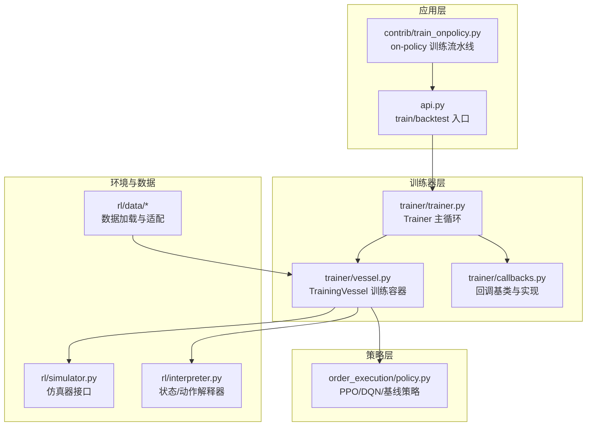
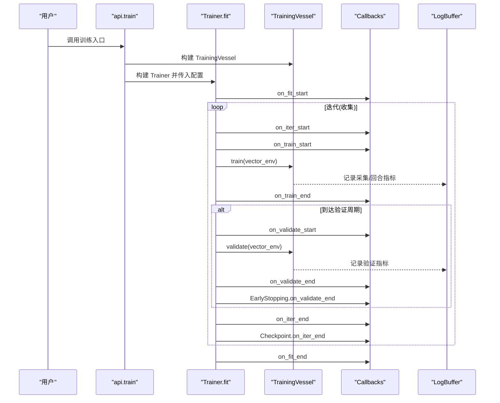
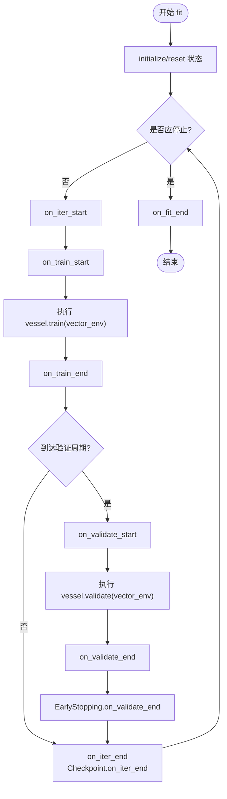
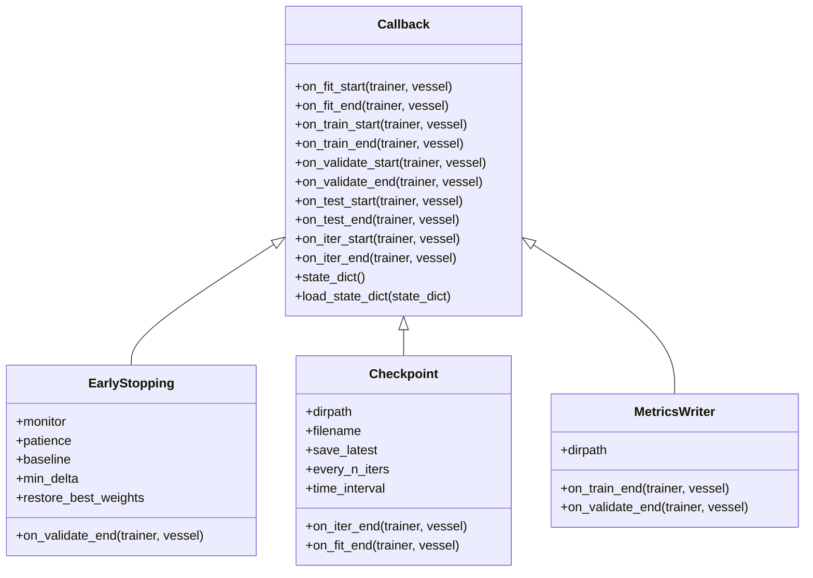
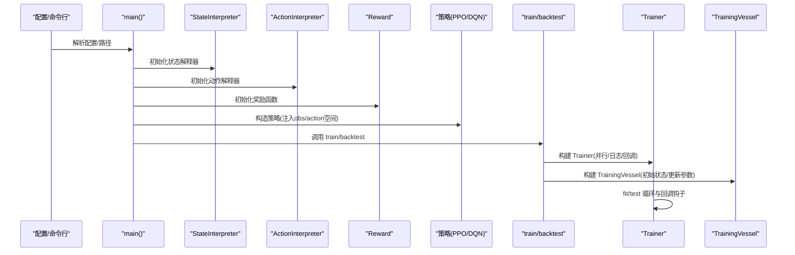
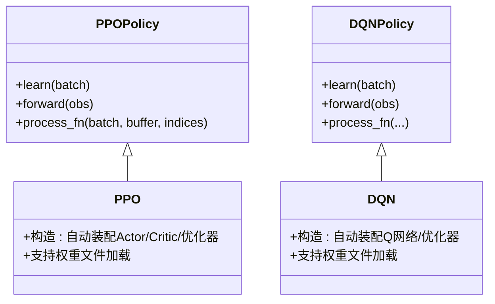
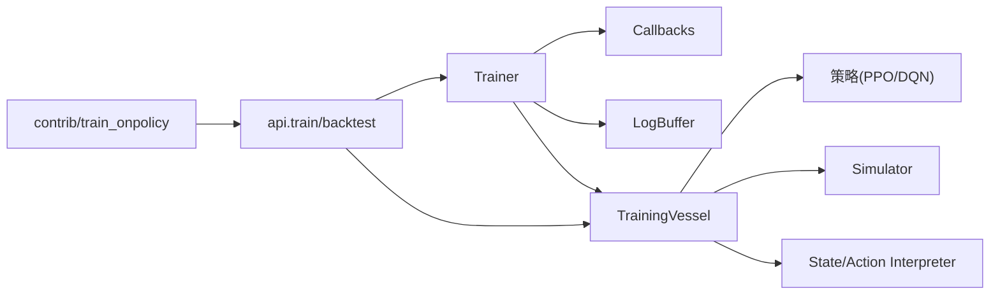

# 训练系统与优化

<cite>
**本文引用的文件**
- [trainer.py](file://qlib/rl/trainer/trainer.py)
- [callbacks.py](file://qlib/rl/trainer/callbacks.py)
- [api.py](file://qlib/rl/trainer/api.py)
- [train_onpolicy.py](file://qlib/rl/contrib/train_onpolicy.py)
- [policy.py](file://qlib/rl/order_execution/policy.py)
</cite>

## 目录
1. [引言](#引言)
2. [项目结构](#项目结构)
3. [核心组件](#核心组件)
4. [架构总览](#架构总览)
5. [详细组件分析](#详细组件分析)
6. [依赖关系分析](#依赖关系分析)
7. [性能考量](#性能考量)
8. [故障排查指南](#故障排查指南)
9. [结论](#结论)
10. [附录：训练配置与评估范式](#附录训练配置与评估范式)

## 引言
本文件面向强化学习训练系统，围绕 QLib 的 RL 模块，系统化梳理训练器架构、训练循环、回调机制、模型保存与恢复、on-policy 与 off-policy 策略差异、超参数调优、训练监控与调试、以及分布式/并行化实践。文档以代码为依据，辅以图示帮助读者快速理解从“环境-策略-训练器”的端到端流程。

## 项目结构
RL 训练体系主要由三层组成：
- 训练器层：负责迭代调度、验证周期、日志与回调钩子管理（Trainer）。
- 回调层：提供检查点、早停、指标落盘等可插拔能力（Callback 及其子类）。
- 应用层：封装训练/回测 API，组织策略、解释器、仿真器与数据集（api.py、contrib 中的 on-policy 示例）。

图表来源
- [api.py:19-64](file://qlib/rl/trainer/api.py#L19-L64)
- [train_onpolicy.py:159-181](file://qlib/rl/contrib/train_onpolicy.py#L159-L181)
- [trainer.py:188-250](file://qlib/rl/trainer/trainer.py#L188-L250)
- [callbacks.py:32-76](file://qlib/rl/trainer/callbacks.py#L32-L76)
- [policy.py:102-209](file://qlib/rl/order_execution/policy.py#L102-L209)

章节来源
- [api.py:19-119](file://qlib/rl/trainer/api.py#L19-L119)
- [train_onpolicy.py:100-252](file://qlib/rl/contrib/train_onpolicy.py#L100-L252)
- [trainer.py:30-356](file://qlib/rl/trainer/trainer.py#L30-L356)
- [callbacks.py:32-292](file://qlib/rl/trainer/callbacks.py#L32-L292)
- [policy.py:25-238](file://qlib/rl/order_execution/policy.py#L25-L238)

## 核心组件
- 训练器 Trainer
  - 迭代单位为“收集”（collect），非传统 DL 的 epoch/mini-batch；每次收集后进行若干次更新。
  - 支持验证周期、日志缓冲、回调钩子、状态字典持久化与恢复。
  - 提供 fit/test 生命周期管理，贯穿 on_fit_start/on_iter_*/*_end 等钩子。
- 回调 Callback 及其实现
  - EarlyStopping：基于监控指标（默认 reward）与耐心值/阈值决定早停，并可选恢复最佳权重。
  - Checkpoint：按迭代步数或时间间隔保存检查点，支持 latest 链接/复制。
  - MetricsWriter：将训练/验证指标写入 CSV 文件。
- 训练入口 API
  - train：构建 TrainingVessel + Trainer 并执行训练。
  - backtest：构建测试用 TrainingVessel + Trainer 并执行回测。
- on-policy 训练示例
  - 将订单数据包装为 Dataset，驱动训练与验证；集成 Checkpoint、EarlyStopping、MetricsWriter。
- 策略实现
  - PPO/DQN：对 tianshou 策略的轻量封装，自动装配网络、优化器与默认超参；支持从检查点加载权重。

章节来源
- [trainer.py:30-120](file://qlib/rl/trainer/trainer.py#L30-L120)
- [trainer.py:188-273](file://qlib/rl/trainer/trainer.py#L188-L273)
- [callbacks.py:78-183](file://qlib/rl/trainer/callbacks.py#L78-L183)
- [callbacks.py:203-292](file://qlib/rl/trainer/callbacks.py#L203-L292)
- [api.py:19-119](file://qlib/rl/trainer/api.py#L19-L119)
- [train_onpolicy.py:100-202](file://qlib/rl/contrib/train_onpolicy.py#L100-L202)
- [policy.py:102-209](file://qlib/rl/order_execution/policy.py#L102-L209)

## 架构总览
下图展示一次完整训练的时序：训练器初始化、每轮收集、训练阶段、可选验证阶段、回调钩子触发、日志与指标更新、以及最终的检查点保存与早停判断。

图表来源
- [api.py:53-63](file://qlib/rl/trainer/api.py#L53-L63)
- [trainer.py:188-249](file://qlib/rl/trainer/trainer.py#L188-L249)
- [callbacks.py:78-183](file://qlib/rl/trainer/callbacks.py#L78-L183)
- [callbacks.py:203-292](file://qlib/rl/trainer/callbacks.py#L203-L292)

## 详细组件分析

### 训练器 Trainer：训练循环与生命周期
- 初始化与状态
  - initialize/reset 当前迭代、回合计数、阶段标记；state_dict/load_state_dict 支持断点续训。
- 迭代与阶段
  - 每次迭代包含 train/validate 两个阶段，validate 可按 val_every_n_iters 触发。
  - initialize_iter 清空 metrics，确保每轮聚合正确。
- 环境并行化
  - venv_from_iterator 基于有限环境类型与并发度创建向量化环境，支持 dummy/subproc/threading 等模式。
- 日志与指标
  - _metrics_callback 将 episode/collect 指标写入 trainer.metrics，并在验证阶段加前缀 val/。
- 回调钩子
  - _call_callback_hooks 统一调度各回调的生命周期钩子，便于扩展自定义逻辑。

图表来源
- [trainer.py:188-249](file://qlib/rl/trainer/trainer.py#L188-L249)
- [trainer.py:274-320](file://qlib/rl/trainer/trainer.py#L274-L320)
- [callbacks.py:78-183](file://qlib/rl/trainer/callbacks.py#L78-L183)
- [callbacks.py:203-292](file://qlib/rl/trainer/callbacks.py#L203-L292)

章节来源
- [trainer.py:123-175](file://qlib/rl/trainer/trainer.py#L123-L175)
- [trainer.py:188-273](file://qlib/rl/trainer/trainer.py#L188-L273)
- [trainer.py:274-332](file://qlib/rl/trainer/trainer.py#L274-L332)

### 回调机制：早停、检查点与指标落盘
- EarlyStopping
  - 在验证结束时读取监控指标（默认 reward），比较是否改善（受 min_delta、mode 影响），超过耐心则置 should_stop 并可恢复最佳权重。
- Checkpoint
  - 支持按迭代步数或时间间隔保存；同时维护 latest.pth 的软链接或拷贝，便于快速定位最新权重。
- MetricsWriter
  - 将训练/验证指标分别写入 CSV，便于离线分析与可视化。

图表来源
- [callbacks.py:32-76](file://qlib/rl/trainer/callbacks.py#L32-L76)
- [callbacks.py:78-183](file://qlib/rl/trainer/callbacks.py#L78-L183)
- [callbacks.py:203-292](file://qlib/rl/trainer/callbacks.py#L203-L292)

章节来源
- [callbacks.py:78-183](file://qlib/rl/trainer/callbacks.py#L78-L183)
- [callbacks.py:203-292](file://qlib/rl/trainer/callbacks.py#L203-L292)

### on-policy 训练流水线：数据集、策略与训练入口
- 数据加载
  - LazyLoadDataset 按订单生成初始状态，延迟加载特征索引与数据，支持训练/验证/测试三集划分。
- 策略与解释器
  - 通过配置构造 StateInterpreter/ActionInterpreter/Reward 与策略（如 PPO/DQN），并注入观测/动作空间。
- 训练与回测
  - 训练阶段：启用 MetricsWriter、Checkpoint、EarlyStopping；设置 episode_per_iter/update_kwargs 控制每轮采样与更新强度。
  - 回测阶段：使用 CsvWriter 记录结果，支持并行环境与并发度配置。

图表来源
- [train_onpolicy.py:204-252](file://qlib/rl/contrib/train_onpolicy.py#L204-L252)
- [train_onpolicy.py:130-202](file://qlib/rl/contrib/train_onpolicy.py#L130-L202)
- [api.py:19-119](file://qlib/rl/trainer/api.py#L19-L119)

章节来源
- [train_onpolicy.py:51-98](file://qlib/rl/contrib/train_onpolicy.py#L51-L98)
- [train_onpolicy.py:100-202](file://qlib/rl/contrib/train_onpolicy.py#L100-L202)
- [api.py:19-119](file://qlib/rl/trainer/api.py#L19-L119)

### 策略封装：PPO 与 DQN
- PPO
  - 自动装配 Actor/Critic，使用离散动作空间 Softmax 输出；支持权重文件加载、归一化、裁剪等超参。
- DQN
  - 自动装配 Q 网络，支持双 Q、目标网络更新频率等；同样支持权重文件加载。
- 权重加载工具
  - set_weight 支持兼容性处理，必要时进行键名转换后再加载。

图表来源
- [policy.py:102-209](file://qlib/rl/order_execution/policy.py#L102-L209)

章节来源
- [policy.py:102-209](file://qlib/rl/order_execution/policy.py#L102-L209)

## 依赖关系分析
- 训练器依赖
  - 回调：Trainer 在关键生命周期调用回调钩子，实现解耦的监控与控制。
  - 日志：LogBuffer 作为内置日志写入器，统一指标采集与导出。
  - 环境：通过 venv_from_iterator 创建向量化环境，支持多并行模式。
- on-policy 流水线依赖
  - 训练入口依赖 TrainingVessel 与 Trainer；策略依赖 State/Action 解释器与 Reward。
- 策略依赖
  - PPO/DQN 依赖 tianshou 的 BasePolicy/PPOPolicy/DQNPolicy，并在其基础上增加自动装配与权重加载。

图表来源
- [trainer.py:188-273](file://qlib/rl/trainer/trainer.py#L188-L273)
- [callbacks.py:32-76](file://qlib/rl/trainer/callbacks.py#L32-L76)
- [api.py:19-119](file://qlib/rl/trainer/api.py#L19-L119)
- [train_onpolicy.py:159-202](file://qlib/rl/contrib/train_onpolicy.py#L159-L202)
- [policy.py:102-209](file://qlib/rl/order_execution/policy.py#L102-L209)

章节来源
- [trainer.py:188-273](file://qlib/rl/trainer/trainer.py#L188-L273)
- [callbacks.py:32-76](file://qlib/rl/trainer/callbacks.py#L32-L76)
- [api.py:19-119](file://qlib/rl/trainer/api.py#L19-L119)
- [train_onpolicy.py:159-202](file://qlib/rl/contrib/train_onpolicy.py#L159-L202)
- [policy.py:102-209](file://qlib/rl/order_execution/policy.py#L102-L209)

## 性能考量
- 并发与向量化
  - 通过 venv_from_iterator 的 finite_env_type 与 concurrency 参数控制并行度；合理设置可显著提升吞吐。
- 内存与资源
  - 训练循环中显式删除向量化环境实例，避免内存泄漏；注意回调与日志写入的开销。
- 更新强度与批大小
  - on-policy 示例通过 update_kwargs 的 batch_size/repeat 控制每轮更新强度；需结合样本效率与收敛稳定性权衡。
- 学习率与折扣因子
  - 策略构造时可调整 lr、discount_factor 等超参；建议先固定其他参数，再扫描学习率与折扣因子。
- 早停与检查点
  - 合理设置早停耐心与监控指标，避免过拟合；定期检查点有助于快速恢复与对比实验。

[本节为通用指导，不直接分析具体文件]

## 故障排查指南
- 指标缺失导致早停不生效
  - EarlyStopping 在监控指标不存在时会发出警告；请确认指标名称与前缀（验证阶段带 val/）一致。
- 检查点未更新
  - 检查 every_n_iters 与 time_interval 是否满足；确认 on_iter_end 钩子被触发。
- 权重加载失败
  - set_weight 对键名不匹配的情况有兼容处理；若仍失败，请确认权重来源与策略版本一致性。
- 并行环境异常
  - 若使用 dummy 模式，注意解释器对象的线程安全性问题；必要时使用深拷贝或切换到 subproc/threading。

章节来源
- [callbacks.py:171-179](file://qlib/rl/trainer/callbacks.py#L171-L179)
- [callbacks.py:203-292](file://qlib/rl/trainer/callbacks.py#L203-L292)
- [policy.py:220-229](file://qlib/rl/order_execution/policy.py#L220-L229)
- [trainer.py:274-307](file://qlib/rl/trainer/trainer.py#L274-L307)

## 结论
QLib 的 RL 训练系统以 Trainer 为核心，通过回调机制实现监控、早停与持久化，结合 on-policy 示例展示了从数据到策略的完整闭环。策略封装简化了网络与优化器装配，并支持权重加载。通过合理配置并行度、更新强度与超参数，可在保证稳定性的同时提升训练效率。建议在实际工程中结合指标落盘与可视化工具，持续跟踪训练动态，及时调整策略与配置。

[本节为总结性内容，不直接分析具体文件]

## 附录：训练配置与评估范式
- 训练配置要点
  - 训练轮数与验证周期：max_iters、val_every_n_iters。
  - 并行与环境类型：finite_env_type、concurrency。
  - 每轮采样与更新：episode_per_iter、update_kwargs（batch_size、repeat）。
  - 回调：Checkpoint（路径、命名模板、保存策略）、EarlyStopping（监控指标、耐心、阈值）、MetricsWriter（CSV 路径）。
- 回测与评估
  - 使用 backtest 接口对测试集进行回测，记录指标并输出 CSV；可叠加不同策略与超参组合进行对比。
- 分布式与并行化
  - 通过并发参数与有限环境类型选择合适的并行模式；在多机场景下，建议结合外部任务调度系统管理多个进程或节点的任务分配与资源抢占。

[本节为通用范式说明，不直接分析具体文件]