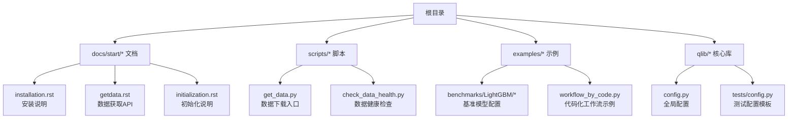
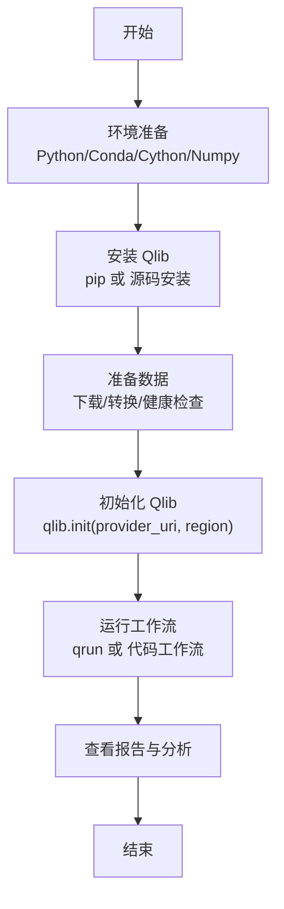
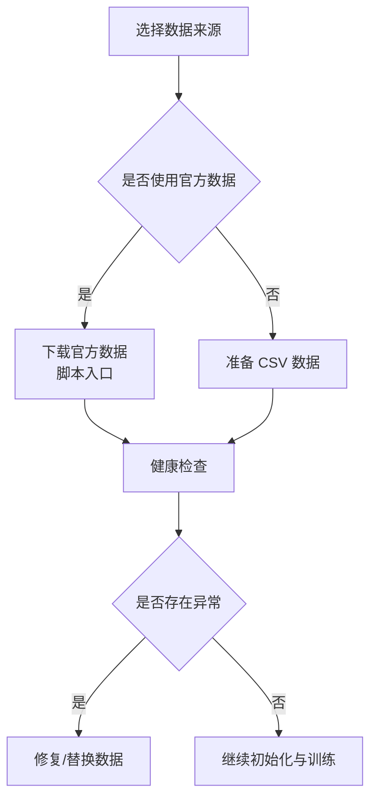
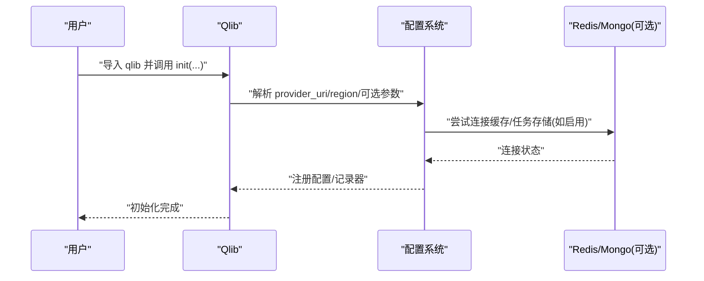
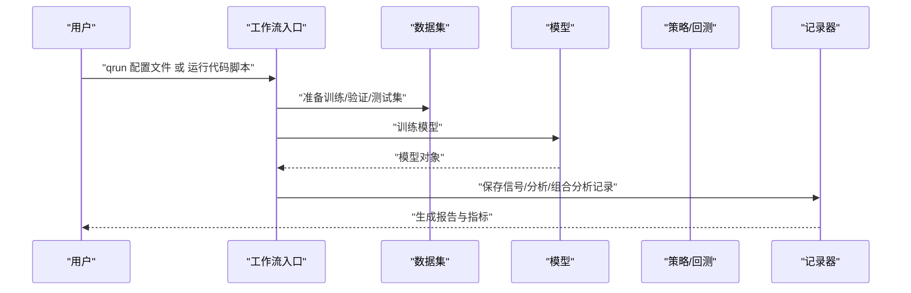
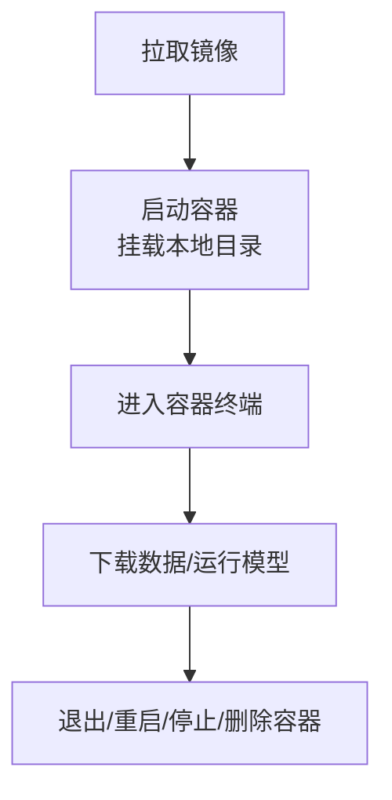
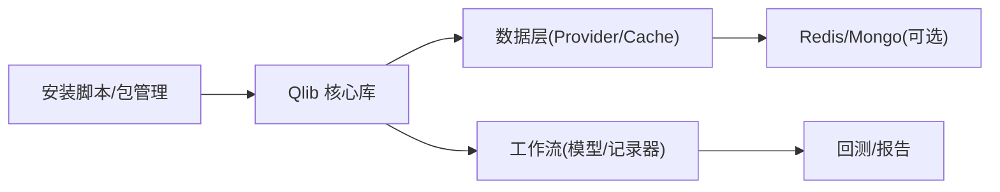

# 快速开始

<cite>
**本文引用的文件**
- [README.md](file://README.md)
- [setup.py](file://setup.py)
- [Dockerfile](file://Dockerfile)
- [docs/start/installation.rst](file://docs/start/installation.rst)
- [docs/start/getdata.rst](file://docs/start/getdata.rst)
- [docs/start/initialization.rst](file://docs/start/initialization.rst)
- [docs/FAQ/FAQ.rst](file://docs/FAQ/FAQ.rst)
- [scripts/get_data.py](file://scripts/get_data.py)
- [scripts/check_data_health.py](file://scripts/check_data_health.py)
- [examples/benchmarks/LightGBM/workflow_config_lightgbm_Alpha158.yaml](file://examples/benchmarks/LightGBM/workflow_config_lightgbm_Alpha158.yaml)
- [examples/workflow_by_code.py](file://examples/workflow_by_code.py)
- [qlib/config.py](file://qlib/config.py)
- [qlib/tests/config.py](file://qlib/tests/config.py)
</cite>

## 目录
1. [简介](#简介)
2. [项目结构](#项目结构)
3. [核心组件](#核心组件)
4. [架构总览](#架构总览)
5. [详细组件解析](#详细组件解析)
6. [依赖关系分析](#依赖关系分析)
7. [性能与资源建议](#性能与资源建议)
8. [故障排查指南](#故障排查指南)
9. [结论](#结论)
10. [附录](#附录)

## 简介
本指南面向量化研究初学者，帮助你在最短时间内完成 Qlib 的环境搭建、数据准备、第一个项目运行与结果解读，并提供常见问题与 Docker 部署建议。你将学会：
- 安装与环境准备（Python 版本、依赖、源码安装）
- 数据准备（官方数据源、自定义数据格式转换、数据健康检查）
- 第一个量化项目：从初始化到运行简单模型
- 常见问题与故障排除
- Docker 部署与集成方案

## 项目结构
为便于快速上手，以下图示展示与“快速开始”直接相关的目录与文件：

图表来源
- [docs/start/installation.rst:1-47](file://docs/start/installation.rst#L1-L47)
- [docs/start/getdata.rst:1-150](file://docs/start/getdata.rst#L1-L150)
- [docs/start/initialization.rst:1-98](file://docs/start/initialization.rst#L1-L98)
- [scripts/get_data.py:1-9](file://scripts/get_data.py#L1-L9)
- [scripts/check_data_health.py:1-249](file://scripts/check_data_health.py#L1-L249)
- [examples/benchmarks/LightGBM/workflow_config_lightgbm_Alpha158.yaml:1-72](file://examples/benchmarks/LightGBM/workflow_config_lightgbm_Alpha158.yaml#L1-L72)
- [examples/workflow_by_code.py:1-86](file://examples/workflow_by_code.py#L1-L86)
- [qlib/config.py:1-528](file://qlib/config.py#L1-L528)
- [qlib/tests/config.py:1-168](file://qlib/tests/config.py#L1-L168)

章节来源
- [README.md:158-486](file://README.md#L158-L486)
- [docs/start/installation.rst:1-47](file://docs/start/installation.rst#L1-L47)
- [docs/start/getdata.rst:1-150](file://docs/start/getdata.rst#L1-L150)
- [docs/start/initialization.rst:1-98](file://docs/start/initialization.rst#L1-L98)

## 核心组件
- 安装与环境
  - 支持 Python 3.8–3.12；推荐使用 Conda 管理环境；从源码安装需先安装 numpy 与 cython。
  - 可通过 pip 安装稳定版，或克隆仓库后执行源码安装。
- 数据准备
  - 使用脚本下载官方数据，或参考文档将 CSV 转换为 Qlib 格式。
  - 提供数据健康检查脚本，验证缺失值、异常跳变、字段完整性与大小写问题。
- 初始化与配置
  - 使用 qlib.init 指定 provider_uri 与区域（中国/美国），可选设置 Redis、MongoDB、实验管理器等。
- 工作流与运行
  - 通过 qrun 一键运行基准模型配置；也可用代码方式构建工作流，实现更灵活的定制。

章节来源
- [README.md:167-210](file://README.md#L167-L210)
- [docs/start/installation.rst:10-47](file://docs/start/installation.rst#L10-L47)
- [docs/start/getdata.rst:1-150](file://docs/start/getdata.rst#L1-L150)
- [docs/start/initialization.rst:13-98](file://docs/start/initialization.rst#L13-L98)
- [scripts/check_data_health.py:13-249](file://scripts/check_data_health.py#L13-L249)

## 架构总览
下图展示了从“安装—数据—初始化—运行”的端到端流程：

图表来源
- [README.md:167-210](file://README.md#L167-L210)
- [docs/start/installation.rst:10-47](file://docs/start/installation.rst#L10-L47)
- [docs/start/getdata.rst:1-150](file://docs/start/getdata.rst#L1-L150)
- [docs/start/initialization.rst:13-98](file://docs/start/initialization.rst#L13-L98)
- [examples/benchmarks/LightGBM/workflow_config_lightgbm_Alpha158.yaml:1-72](file://examples/benchmarks/LightGBM/workflow_config_lightgbm_Alpha158.yaml#L1-L72)
- [examples/workflow_by_code.py:1-86](file://examples/workflow_by_code.py#L1-L86)

## 详细组件解析

### 组件一：环境搭建与安装
- Python 版本与依赖
  - 支持 Python 3.8–3.12；建议使用 Conda；从源码安装前需安装 numpy 与 cython。
- 安装方式
  - pip 安装稳定版；或克隆仓库后执行源码安装。
- 源码安装注意事项
  - 若在仓库根目录直接运行 Python 导入 qlib，可能因未编译 Cython 扩展导致模块导入失败；请在项目外目录运行或先编译扩展。

章节来源
- [README.md:167-210](file://README.md#L167-L210)
- [docs/start/installation.rst:10-47](file://docs/start/installation.rst#L10-L47)
- [setup.py:1-25](file://setup.py#L1-L25)

### 组件二：数据准备与健康检查
- 官方数据下载
  - 提供命令行入口脚本，支持按日频与 1 分钟频下载；可指定目标目录与区域。
- 自定义数据格式转换
  - 将 CSV 数据转换为 Qlib 格式，以便后续特征表达式与回测使用。
- 数据健康检查
  - 检查缺失值、OHLCV 异常跳变、必需字段缺失、因子字段缺失、features 目录大小写问题等。
  - 可通过命令行参数调整阈值与检测范围。

图表来源
- [scripts/get_data.py:1-9](file://scripts/get_data.py#L1-L9)
- [scripts/check_data_health.py:13-249](file://scripts/check_data_health.py#L13-L249)
- [docs/start/getdata.rst:1-150](file://docs/start/getdata.rst#L1-L150)

章节来源
- [README.md:211-291](file://README.md#L211-L291)
- [docs/start/getdata.rst:1-150](file://docs/start/getdata.rst#L1-L150)
- [scripts/get_data.py:1-9](file://scripts/get_data.py#L1-L9)
- [scripts/check_data_health.py:13-249](file://scripts/check_data_health.py#L13-L249)

### 组件三：初始化与配置
- 初始化要点
  - 在调用其他 API 前必须先初始化；provider_uri 指向数据目录；region 切换市场模式（中国/美国）。
  - 可选参数包括 Redis 主机/端口、MongoDB 连接、实验管理器、日志级别、核数等。
- 全局配置
  - Qlib 内部维护默认配置与模式（client/server），可通过 set_mode/set_region 等接口切换。

图表来源
- [docs/start/initialization.rst:13-98](file://docs/start/initialization.rst#L13-L98)
- [qlib/config.py:424-528](file://qlib/config.py#L424-L528)

章节来源
- [docs/start/initialization.rst:13-98](file://docs/start/initialization.rst#L13-L98)
- [qlib/config.py:135-287](file://qlib/config.py#L135-L287)

### 组件四：第一个量化项目（从零到一）
- 方案一：使用 qrun 一键运行
  - 进入 examples 目录，使用基准模型配置文件启动完整工作流（数据集构建、模型训练、回测与评估）。
  - 可在调试模式下运行以定位问题。
- 方案二：代码化工作流
  - 通过脚本示例，手动构建模型、数据集、策略与记录器，实现与 qrun 等价的工作流。

图表来源
- [README.md:351-413](file://README.md#L351-L413)
- [examples/benchmarks/LightGBM/workflow_config_lightgbm_Alpha158.yaml:1-72](file://examples/benchmarks/LightGBM/workflow_config_lightgbm_Alpha158.yaml#L1-L72)
- [examples/workflow_by_code.py:1-86](file://examples/workflow_by_code.py#L1-L86)

章节来源
- [README.md:351-413](file://README.md#L351-L413)
- [examples/benchmarks/LightGBM/workflow_config_lightgbm_Alpha158.yaml:1-72](file://examples/benchmarks/LightGBM/workflow_config_lightgbm_Alpha158.yaml#L1-L72)
- [examples/workflow_by_code.py:1-86](file://examples/workflow_by_code.py#L1-L86)

### 组件五：Docker 部署与集成
- Docker 镜像
  - 提供基于 Miniconda 的 Dockerfile，预装必要依赖；支持稳定版 pip 安装或源码安装两种构建路径。
- 使用步骤
  - 拉取镜像、启动容器、挂载本地目录、在容器内执行数据下载与模型运行命令。
  - 支持容器的启动/停止/删除与重启操作。

图表来源
- [README.md:319-350](file://README.md#L319-L350)
- [Dockerfile:1-32](file://Dockerfile#L1-L32)

章节来源
- [README.md:319-350](file://README.md#L319-L350)
- [Dockerfile:1-32](file://Dockerfile#L1-L32)

## 依赖关系分析
- 外部依赖
  - NumPy、Cython（源码安装）、LightGBM、PyTorch（按需）、Redis（缓存）、MongoDB（任务管理，可选）。
- 内部模块耦合
  - 初始化配置影响数据访问、缓存策略与记录器行为；工作流通过配置驱动模型与数据集装配。
- 可能的循环依赖
  - 代码中采用延迟导入与注册机制，避免显式循环依赖；注意不要在仓库根目录直接运行导入 qlib。

图表来源
- [setup.py:1-25](file://setup.py#L1-L25)
- [qlib/config.py:135-287](file://qlib/config.py#L135-L287)

章节来源
- [setup.py:1-25](file://setup.py#L1-L25)
- [qlib/config.py:135-287](file://qlib/config.py#L135-L287)

## 性能与资源建议
- CPU 与核数
  - 默认使用可用 CPU 数减 2，作为特征计算的并发核数；高并发场景建议根据机器核数调整。
- 缓存策略
  - 启用 Redis 可显著提升重复查询命中率；若 Redis 不可用，缓存功能会自动降级。
- 数据频率
  - 日频与分钟频对内存与磁盘占用差异较大，建议优先从日频起步，再逐步引入高频数据。

章节来源
- [qlib/config.py:127-128](file://qlib/config.py#L127-L128)
- [qlib/config.py:465-482](file://qlib/config.py#L465-L482)

## 故障排查指南
- Windows 多进程限制
  - 在 Windows 上使用多进程时，需在主模块使用 if __name__ == '__main__' 包裹入口逻辑。
- Redis 锁键冲突
  - 若出现锁键已存在错误，可通过 Redis 清理相关数据库后重试。
- Cython 扩展未编译
  - 在仓库根目录直接运行导入会报找不到扩展模块；可在项目外目录运行，或先编译扩展。
- 在线模式版本不兼容
  - 在线客户端与服务端的 python-socketio 与 python-engineio 版本需保持一致。
- 数据目录大小写问题
  - features 目录下的子目录名需全小写，否则会导致加载失败。

章节来源
- [docs/FAQ/FAQ.rst:15-154](file://docs/FAQ/FAQ.rst#L15-L154)
- [scripts/check_data_health.py:72-108](file://scripts/check_data_health.py#L72-L108)

## 结论
通过本指南，你可以：
- 在本地或容器环境中快速搭建 Qlib 环境
- 准备并验证数据质量
- 成功运行第一个量化工作流
- 掌握常见问题的排查方法
- 了解 Docker 部署与集成思路

建议在完成本指南后，进一步阅读官方文档与示例，逐步深入到自定义数据集、模型与策略开发。

## 附录

### A. 一键运行基准模型（qrun）
- 进入 examples 目录，执行 qrun 指令，传入基准配置文件路径。
- 如需调试，可使用 Python 调试器运行对应 CLI 入口。

章节来源
- [README.md:351-383](file://README.md#L351-L383)

### B. 代码化工作流示例
- 使用示例脚本，手动装配模型、数据集、策略与记录器，适合需要精细控制的场景。

章节来源
- [examples/workflow_by_code.py:1-86](file://examples/workflow_by_code.py#L1-L86)

### C. 测试配置模板
- 提供常用市场、基准、数据集与任务的配置模板，便于复制与修改。

章节来源
- [qlib/tests/config.py:1-168](file://qlib/tests/config.py#L1-L168)