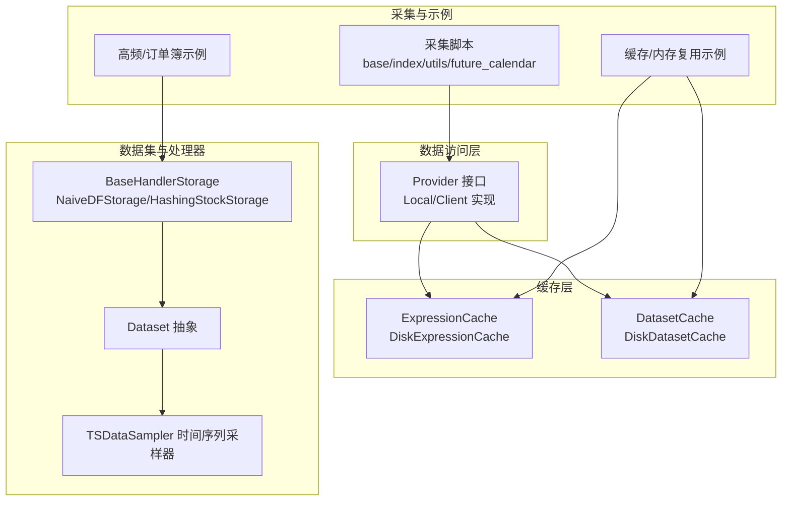
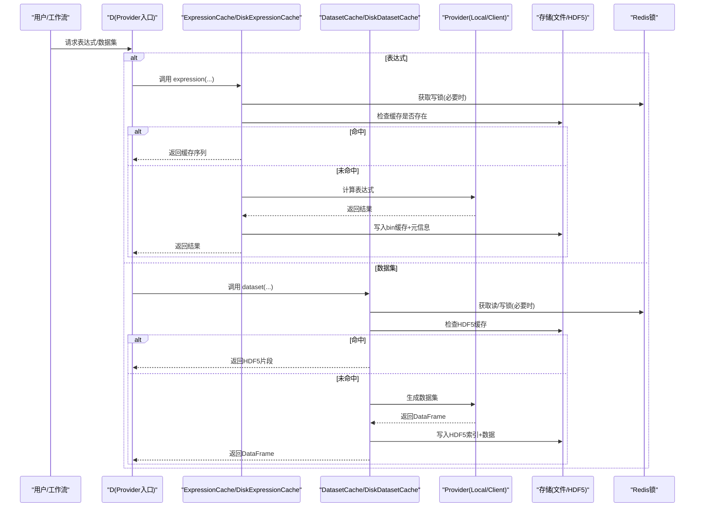
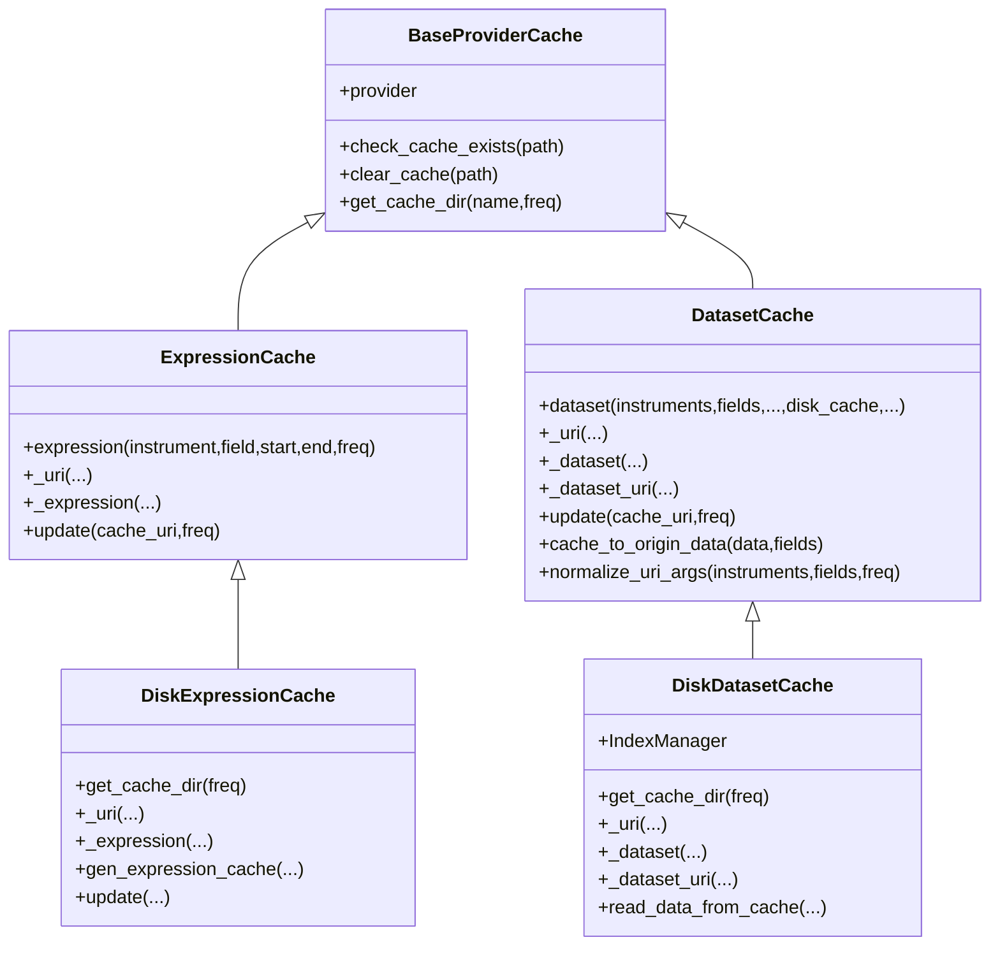
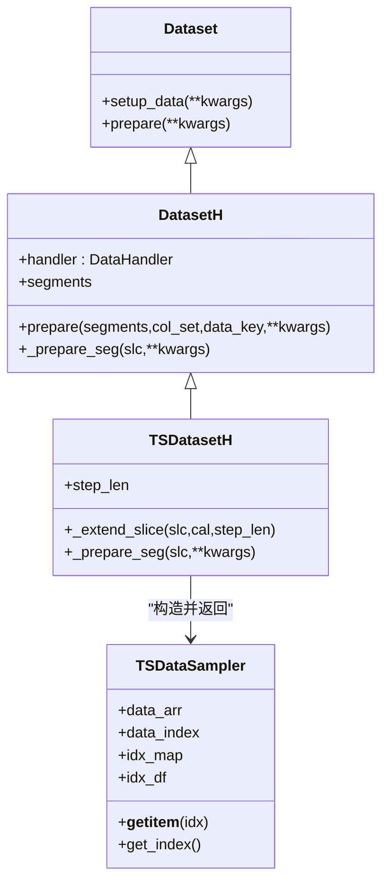
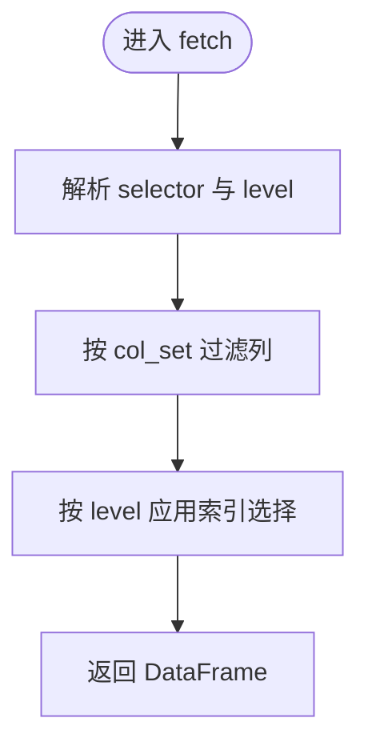
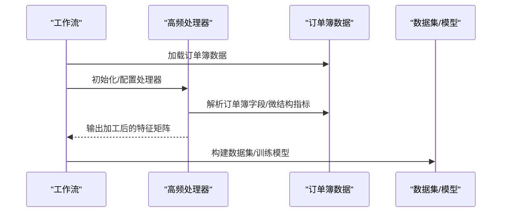
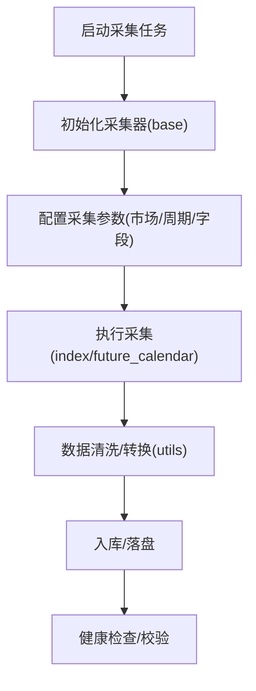
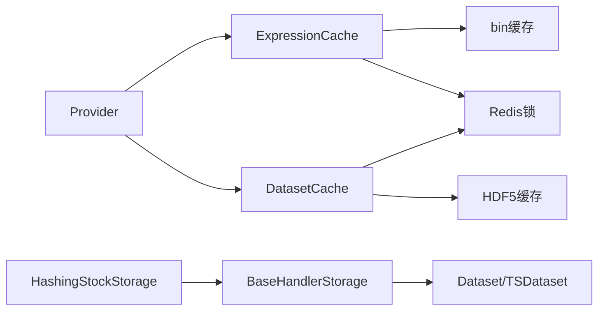

# 数据处理系统

<cite>
**本文引用的文件**
- [qlib/data/__init__.py](file://qlib/data/__init__.py)
- [qlib/data/cache.py](file://qlib/data/cache.py)
- [qlib/data/dataset/__init__.py](file://qlib/data/dataset/__init__.py)
- [qlib/data/dataset/storage.py](file://qlib/data/dataset/storage.py)
- [scripts/data_collector/base.py](file://scripts/data_collector/base.py)
- [scripts/data_collector/index.py](file://scripts/data_collector/index.py)
- [scripts/data_collector/utils.py](file://scripts/data_collector/utils.py)
- [scripts/data_collector/future_calendar_collector.py](file://scripts/data_collector/future_calendar_collector.py)
- [examples/data_demo/data_cache_demo.py](file://examples/data_demo/data_cache_demo.py)
- [examples/data_demo/data_mem_resuse_demo.py](file://examples/data_demo/data_mem_resuse_demo.py)
- [examples/orderbook_data/example.py](file://examples/orderbook_data/example.py)
- [examples/orderbook_data/create_dataset.py](file://examples/orderbook_data/create_dataset.py)
- [examples/highfreq/highfreq_handler.py](file://examples/highfreq/highfreq_handler.py)
- [examples/highfreq/highfreq_processor.py](file://examples/highfreq/highfreq_processor.py)
- [examples/highfreq/workflow.py](file://examples/highfreq/workflow.py)
</cite>

## 目录
1. [简介](#简介)
2. [项目结构](#项目结构)
3. [核心组件](#核心组件)
4. [架构总览](#架构总览)
5. [详细组件分析](#详细组件分析)
6. [依赖关系分析](#依赖关系分析)
7. [性能考量](#性能考量)
8. [故障排查指南](#故障排查指南)
9. [结论](#结论)
10. [附录](#附录)

## 简介
本文件面向Qlib数据处理系统，系统性梳理数据获取与存储机制（多市场、多频度）、数据格式转换、缓存策略（ExpressionCache/DatasetCache）、特征工程与表达式系统、高频率数据处理（订单簿、微观结构）以及数据采集工具的使用方法。文档通过分层讲解与图示化方式，帮助读者快速理解并高效使用Qlib的数据管线。

## 项目结构
Qlib的数据处理主要分布在以下模块：
- 数据访问与提供层：提供者接口与本地/客户端实现
- 缓存层：表达式缓存与数据集缓存
- 数据集与处理器：数据集抽象、时间序列采样器、存储适配器
- 数据采集脚本：指数、期货日历、基础采集框架等
- 示例：缓存演示、高频/订单簿数据处理示例

**图表来源**
- [qlib/data/__init__.py:8-65](file://qlib/data/__init__.py#L8-L65)
- [qlib/data/cache.py:330-488](file://qlib/data/cache.py#L330-L488)
- [qlib/data/dataset/__init__.py:15-722](file://qlib/data/dataset/__init__.py#L15-L722)
- [qlib/data/dataset/storage.py:12-192](file://qlib/data/dataset/storage.py#L12-L192)
- [scripts/data_collector/base.py](file://scripts/data_collector/base.py)
- [examples/data_demo/data_cache_demo.py](file://examples/data_demo/data_cache_demo.py)
- [examples/orderbook_data/example.py](file://examples/orderbook_data/example.py)

**章节来源**
- [qlib/data/__init__.py:8-65](file://qlib/data/__init__.py#L8-L65)

## 核心组件
- Provider体系：统一暴露日历、标的、特征、表达式、数据集等接口，支持本地与客户端两种模式
- 缓存体系：ExpressionCache/DatasetCache及其磁盘实现，支持Redis锁协调并发
- 数据集与采样：DatasetH/TSDatasetH与TSDataSampler，支持按时间切片与时间序列窗口抽取
- 存储适配：BaseHandlerStorage及NaiveDFStorage/HashingStockStorage，提升单股票随机访问效率
- 采集工具：采集器基类、指数采集、期货交易日历采集等

**章节来源**
- [qlib/data/__init__.py:8-65](file://qlib/data/__init__.py#L8-L65)
- [qlib/data/cache.py:330-488](file://qlib/data/cache.py#L330-L488)
- [qlib/data/dataset/__init__.py:15-722](file://qlib/data/dataset/__init__.py#L15-L722)
- [qlib/data/dataset/storage.py:12-192](file://qlib/data/dataset/storage.py#L12-L192)

## 架构总览
下图展示从调用方到Provider、缓存与存储的完整链路，以及高频/订单簿数据的接入点。

**图表来源**
- [qlib/data/cache.py:330-488](file://qlib/data/cache.py#L330-L488)
- [qlib/data/cache.py:490-644](file://qlib/data/cache.py#L490-L644)
- [qlib/data/cache.py:647-793](file://qlib/data/cache.py#L647-L793)

## 详细组件分析

### 缓存子系统：ExpressionCache 与 DatasetCache
- 设计目标
  - 高效复用表达式与数据集计算结果，减少重复IO与计算
  - 支持多进程/多机并发，通过Redis锁避免竞态
- 关键机制
  - URI生成：基于参数规范化与哈希，确保一致的缓存键
  - 表达式缓存：bin文件存储，带元信息；按日历扩展窗口后追加更新
  - 数据集缓存：HDF5存储，带索引管理；支持直接返回缓存URI供客户端加载
- 并发控制
  - 读写锁：区分读锁与写锁，读者计数，避免写阻塞长读
  - 元信息访问计数：记录最近访问时间与访问次数，便于维护

**图表来源**
- [qlib/data/cache.py:295-488](file://qlib/data/cache.py#L295-L488)
- [qlib/data/cache.py:490-644](file://qlib/data/cache.py#L490-L644)
- [qlib/data/cache.py:647-793](file://qlib/data/cache.py#L647-L793)

**章节来源**
- [qlib/data/cache.py:295-488](file://qlib/data/cache.py#L295-L488)
- [qlib/data/cache.py:490-644](file://qlib/data/cache.py#L490-L644)
- [qlib/data/cache.py:647-793](file://qlib/data/cache.py#L647-L793)

### 数据集与时间序列采样器
- DatasetH：封装DataHandler，按segments准备训练/验证/测试等切片
- TSDatasetH：在DatasetH基础上，自动扩展时间窗以满足时间序列窗口需求，并输出TSDataSampler
- TSDataSampler：将DataFrame重排为数组+索引映射，支持按样本索引或(datetime, instrument)索引快速取样，内置前向/双向填充策略

**图表来源**
- [qlib/data/dataset/__init__.py:15-722](file://qlib/data/dataset/__init__.py#L15-L722)

**章节来源**
- [qlib/data/dataset/__init__.py:15-722](file://qlib/data/dataset/__init__.py#L15-L722)

### 存储适配器：BaseHandlerStorage 及其变体
- NaiveDFStorage：直接基于DataFrame的fetch实现
- HashingStockStorage：按股票分组建立字典，显著降低随机访问单只股票的时间成本
- 通用fetch流程：根据selector与level解析选择范围，再按col_set筛选列

**图表来源**
- [qlib/data/dataset/storage.py:12-192](file://qlib/data/dataset/storage.py#L12-L192)

**章节来源**
- [qlib/data/dataset/storage.py:12-192](file://qlib/data/dataset/storage.py#L12-L192)

### 高频与订单簿数据处理
- 高频处理器与流程示例：提供高频数据的加载、处理与工作流集成
- 订单簿示例：展示如何基于订单簿数据构建特征与数据集

**图表来源**
- [examples/highfreq/highfreq_handler.py](file://examples/highfreq/highfreq_handler.py)
- [examples/highfreq/highfreq_processor.py](file://examples/highfreq/highfreq_processor.py)
- [examples/highfreq/workflow.py](file://examples/highfreq/workflow.py)
- [examples/orderbook_data/example.py](file://examples/orderbook_data/example.py)
- [examples/orderbook_data/create_dataset.py](file://examples/orderbook_data/create_dataset.py)

**章节来源**
- [examples/highfreq/highfreq_handler.py](file://examples/highfreq/highfreq_handler.py)
- [examples/highfreq/highfreq_processor.py](file://examples/highfreq/highfreq_processor.py)
- [examples/highfreq/workflow.py](file://examples/highfreq/workflow.py)
- [examples/orderbook_data/example.py](file://examples/orderbook_data/example.py)
- [examples/orderbook_data/create_dataset.py](file://examples/orderbook_data/create_dataset.py)

### 数据采集工具使用指南
- 采集器基类：定义统一的采集接口与生命周期
- 指数采集：支持多市场指数数据抓取
- 期货交易日历采集：生成与校验交易日历
- 工具函数：提供采集过程中的通用辅助能力

**图表来源**
- [scripts/data_collector/base.py](file://scripts/data_collector/base.py)
- [scripts/data_collector/index.py](file://scripts/data_collector/index.py)
- [scripts/data_collector/future_calendar_collector.py](file://scripts/data_collector/future_calendar_collector.py)
- [scripts/data_collector/utils.py](file://scripts/data_collector/utils.py)

**章节来源**
- [scripts/data_collector/base.py](file://scripts/data_collector/base.py)
- [scripts/data_collector/index.py](file://scripts/data_collector/index.py)
- [scripts/data_collector/future_calendar_collector.py](file://scripts/data_collector/future_calendar_collector.py)
- [scripts/data_collector/utils.py](file://scripts/data_collector/utils.py)

## 依赖关系分析
- Provider与缓存：ExpressionCache/DatasetCache通过装饰器模式包装Provider，透明地插入缓存逻辑
- 缓存与存储：表达式缓存采用bin文件+元信息，数据集缓存采用HDF5+索引管理
- 并发与一致性：通过Redis锁协调读写冲突，结合元信息访问计数进行缓存维护
- 数据集与存储：TSDataSampler依赖于底层存储的高效索引映射，HashingStockStorage显著提升随机访问性能

**图表来源**
- [qlib/data/cache.py:330-488](file://qlib/data/cache.py#L330-L488)
- [qlib/data/dataset/__init__.py:15-722](file://qlib/data/dataset/__init__.py#L15-L722)
- [qlib/data/dataset/storage.py:12-192](file://qlib/data/dataset/storage.py#L12-L192)

**章节来源**
- [qlib/data/cache.py:330-488](file://qlib/data/cache.py#L330-L488)
- [qlib/data/dataset/__init__.py:15-722](file://qlib/data/dataset/__init__.py#L15-L722)
- [qlib/data/dataset/storage.py:12-192](file://qlib/data/dataset/storage.py#L12-L192)

## 性能考量
- 缓存粒度与命中率
  - 表达式缓存：按(instrument, field, freq)生成稳定URI，bin文件顺序存储，适合范围查询
  - 数据集缓存：HDF5索引+分片读取，避免全量加载
- 并发与锁开销
  - 读多写少场景下，读锁可并发；写锁仅在生成/更新时持有
  - 元信息访问计数用于缓存健康度评估与清理策略
- 存储访问优化
  - HashingStockStorage按股票分桶，显著降低随机访问成本
  - TSDataSampler将DataFrame转为数组+索引映射，加速时间序列窗口取样
- 内存与磁盘平衡
  - 内存缓存支持长度与大小两种限制类型，结合LRU剔除策略
  - 大数据集建议优先使用磁盘缓存与HDF5分片读取

[本节为通用性能指导，不直接分析具体文件]

## 故障排查指南
- 缓存异常
  - 缓存文件损坏：检查.meta/.index是否存在，必要时清理后重建
  - Redis锁残留：可通过工具重置锁，或手动清理对应键
- 并发冲突
  - 写锁超时/死锁：确认Redis连接与任务数据库配置，避免多实例同时写同一缓存
- 数据集缓存不生效
  - 检查disk_cache参数与inst_processors是否被支持组合
  - 确认HDF5缓存目录权限与可用空间
- 高频/订单簿数据缺失
  - 核对采集器配置与数据源可用性，确认时间窗扩展是否正确

**章节来源**
- [qlib/data/cache.py:210-293](file://qlib/data/cache.py#L210-L293)
- [qlib/data/cache.py:647-793](file://qlib/data/cache.py#L647-L793)

## 结论
Qlib数据处理系统通过Provider抽象、ExpressionCache/DatasetCache、Dataset/TSDataset与存储适配器形成完整的数据流水线。配合Redis锁与元信息管理，系统在多进程/多机环境下仍能保持高吞吐与一致性。高频与订单簿示例展示了从原始数据到特征矩阵的端到端处理路径。建议在生产环境中启用磁盘缓存、合理设置并发锁与内存缓存策略，并结合HashingStockStorage与TSDataSampler获得更佳性能。

## 附录
- 快速参考
  - 表达式缓存：使用DiskExpressionCache.wrap(provider)，按(instrument, field, freq)生成URI
  - 数据集缓存：使用DiskDatasetCache.wrap(provider)，支持HDF5缓存与URI直返
  - 数据集准备：DatasetH/TSDatasetH按segments切片，TSDatasetH自动扩展时间窗
  - 存储适配：优先使用HashingStockStorage提升随机访问性能
  - 采集工具：基于base.py扩展自定义采集器，遵循index/future_calendar模板

[本节为概览性内容，不直接分析具体文件]