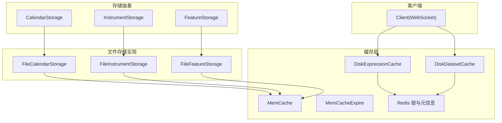
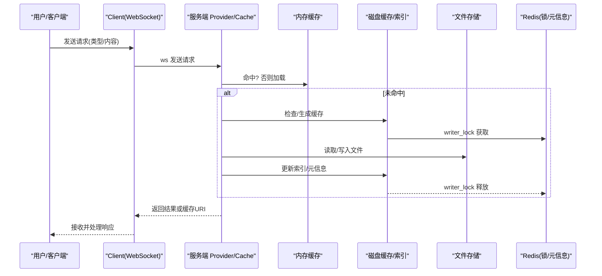
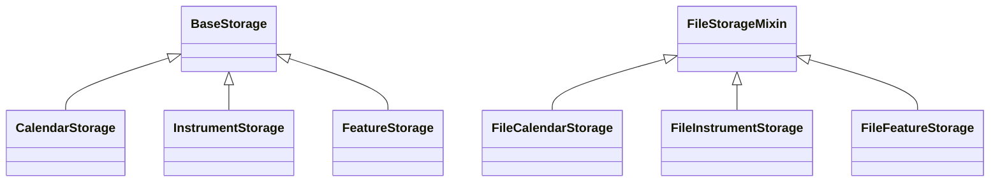
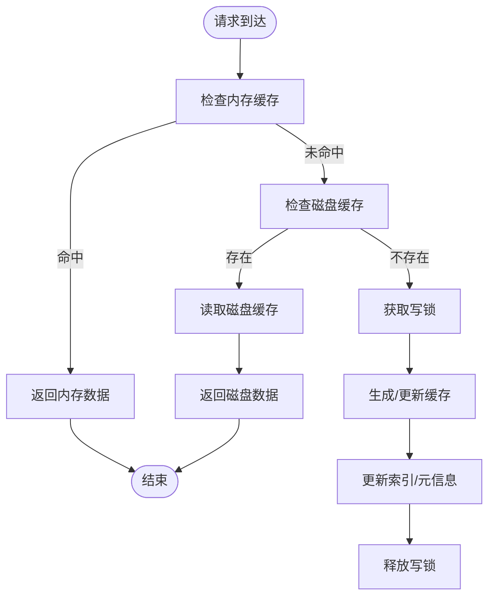
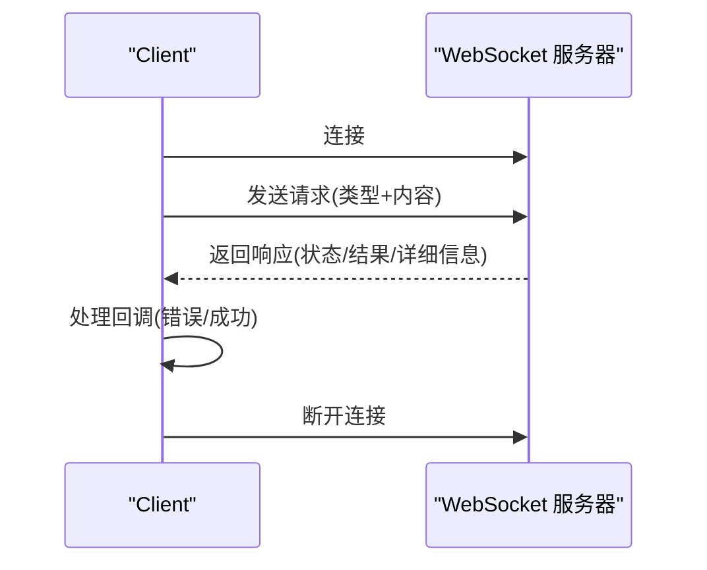
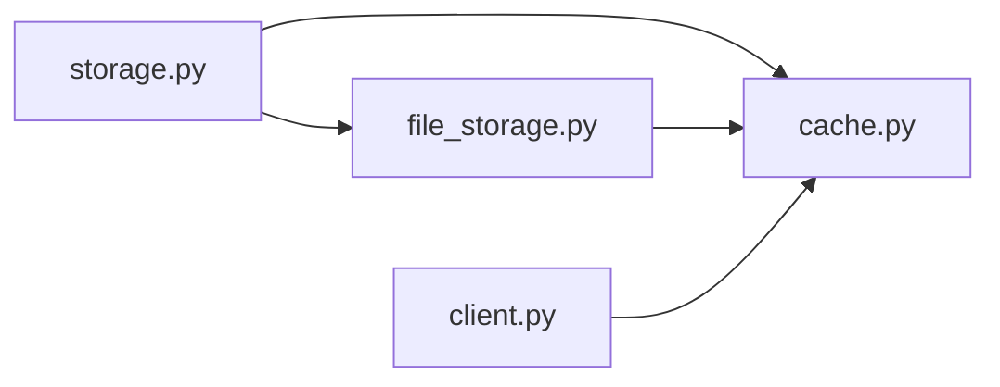
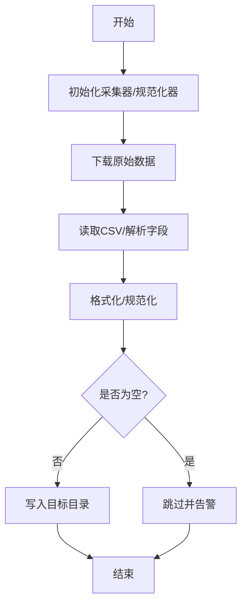

# 数据获取与存储

<cite>
**本文引用的文件**   
- [client.py](file://qlib/data/client.py)
- [storage.py](file://qlib/data/storage/storage.py)
- [file_storage.py](file://qlib/data/storage/file_storage.py)
- [cache.py](file://qlib/data/cache.py)
- [base.py](file://scripts/data_collector/base.py)
- [README.md](file://scripts/data_collector/README.md)
</cite>

## 目录
1. [简介](#简介)
2. [项目结构](#项目结构)
3. [核心组件](#核心组件)
4. [架构总览](#架构总览)
5. [组件详解](#组件详解)
6. [依赖关系分析](#依赖关系分析)
7. [性能考量与优化建议](#性能考量与优化建议)
8. [故障排除指南](#故障排除指南)
9. [结论](#结论)
10. [附录：数据格式与采集工具使用](#附录数据格式与采集工具使用)

## 简介
本文件系统性梳理 Qlib 的数据获取与存储体系，覆盖以下主题：
- 存储架构：文件存储、内存缓存、分布式（Redis）缓存协同工作方式
- 客户端接口：统一入口如何访问不同来源的数据
- 格式转换：对 CSV、HDF5、Parquet 等格式的支持现状与适配路径
- 数据采集：内置采集器脚本与自定义数据源集成流程
- 性能优化：缓存策略、并发控制、索引与二进制存储优化
- 故障排除：常见问题定位与修复建议

## 项目结构
围绕“数据获取与存储”的关键模块分布如下：
- 存储抽象层：定义日历、标的、特征三类存储的统一接口
- 文件存储实现：基于文本/二进制/索引文件的本地持久化
- 缓存层：内存缓存 + 分布式缓存（Redis）协同
- 客户端：通过 WebSocket 与服务端交互，发起请求并接收结果
- 采集器：内置多数据源采集脚本与规范化流程

**图表来源**
- [storage.py:84-495](file://qlib/data/storage/storage.py#L84-L495)
- [file_storage.py:76-380](file://qlib/data/storage/file_storage.py#L76-L380)
- [cache.py:137-293](file://qlib/data/cache.py#L137-L293)
- [client.py:16-104](file://qlib/data/client.py#L16-L104)

**章节来源**
- [storage.py:1-495](file://qlib/data/storage/storage.py#L1-L495)
- [file_storage.py:1-380](file://qlib/data/storage/file_storage.py#L1-L380)
- [cache.py:1-293](file://qlib/data/cache.py#L1-L293)
- [client.py:1-104](file://qlib/data/client.py#L1-L104)

## 核心组件
- 存储抽象接口：定义日历、标的、特征三类存储的统一行为，便于替换实现
- 文件存储实现：以文件为载体，支持文本日历、TSV 标的、二进制特征序列
- 内存缓存：按单位（日历/标的/特征）LRU 驱逐，可配置大小限制
- 分布式缓存：基于 Redis 的读写锁与访问元信息，保障并发安全
- 客户端：通过 WebSocket 向服务端发送请求，接收响应并处理错误

**章节来源**
- [storage.py:84-495](file://qlib/data/storage/storage.py#L84-L495)
- [file_storage.py:76-380](file://qlib/data/storage/file_storage.py#L76-L380)
- [cache.py:137-293](file://qlib/data/cache.py#L137-L293)
- [client.py:16-104](file://qlib/data/client.py#L16-L104)

## 架构总览
下图展示从客户端到服务端、再到存储与缓存的整体流程。

**图表来源**
- [client.py:49-104](file://qlib/data/client.py#L49-L104)
- [cache.py:391-464](file://qlib/data/cache.py#L391-L464)
- [cache.py:696-792](file://qlib/data/cache.py#L696-L792)
- [file_storage.py:285-380](file://qlib/data/storage/file_storage.py#L285-L380)

## 组件详解

### 存储抽象与文件存储实现
- 抽象基类
  - 日历存储：提供 data、extend、clear、index、insert、remove、__getitem__/__setitem__/__delitem__/__len__ 等接口
  - 标的存储：提供 data、update、__getitem__/__setitem__/__delitem__/__len__ 等接口
  - 特征存储：提供 data、start_index/end_index、write/rewrite/rebase、__getitem__/__len__ 等接口
- 文件存储实现
  - FileCalendarStorage：文本文件保存日历，支持按频率重采样；可启用内存缓存
  - FileInstrumentStorage：TSV 文件保存标的区间；支持增删改查
  - FileFeatureStorage：二进制文件保存特征序列，首字节记录起始索引，后续每元素4字节float；支持追加/重写

**图表来源**
- [storage.py:78-495](file://qlib/data/storage/storage.py#L78-L495)
- [file_storage.py:21-380](file://qlib/data/storage/file_storage.py#L21-L380)

**章节来源**
- [storage.py:84-495](file://qlib/data/storage/storage.py#L84-L495)
- [file_storage.py:76-380](file://qlib/data/storage/file_storage.py#L76-L380)

### 缓存机制：内存与分布式
- 内存缓存
  - MemCache：按类别维护 LRU 缓存，支持长度或字节大小两种限流策略
  - MemCacheExpire：带过期时间的缓存读取/设置
- 分布式缓存
  - CacheUtils：提供访问计数、锁复位、访问更新等工具
  - 表达式缓存：DiskExpressionCache，基于哈希的缓存文件与元信息(.meta)，支持增量更新
  - 数据集缓存：DiskDatasetCache，HDF5 索引文件配合二进制索引(.index/.meta)，支持并发读写锁

**图表来源**
- [cache.py:137-293](file://qlib/data/cache.py#L137-L293)
- [cache.py:490-644](file://qlib/data/cache.py#L490-L644)
- [cache.py:647-792](file://qlib/data/cache.py#L647-L792)

**章节来源**
- [cache.py:137-293](file://qlib/data/cache.py#L137-L293)
- [cache.py:490-644](file://qlib/data/cache.py#L490-L644)
- [cache.py:647-792](file://qlib/data/cache.py#L647-L792)

### 客户端接口与服务端交互
- Client：封装 WebSocket 连接、请求发送、回调处理与断开逻辑
- 请求类型：日历/标的/特征等，服务端根据类型返回对应结果或缓存 URI

**图表来源**
- [client.py:22-104](file://qlib/data/client.py#L22-L104)

**章节来源**
- [client.py:16-104](file://qlib/data/client.py#L16-L104)

## 依赖关系分析
- 存储抽象与文件实现解耦：通过继承实现替换，便于扩展其他存储后端
- 缓存层与存储层解耦：缓存策略独立于具体存储介质
- 并发控制：分布式缓存通过 Redis 锁避免竞态，内存缓存为进程内缓存
- 客户端与服务端：通过 WebSocket 解耦，便于横向扩展

**图表来源**
- [storage.py:1-495](file://qlib/data/storage/storage.py#L1-L495)
- [file_storage.py:1-380](file://qlib/data/storage/file_storage.py#L1-L380)
- [cache.py:1-293](file://qlib/data/cache.py#L1-L293)
- [client.py:1-104](file://qlib/data/client.py#L1-L104)

**章节来源**
- [storage.py:1-495](file://qlib/data/storage/storage.py#L1-L495)
- [file_storage.py:1-380](file://qlib/data/storage/file_storage.py#L1-L380)
- [cache.py:1-293](file://qlib/data/cache.py#L1-L293)
- [client.py:1-104](file://qlib/data/client.py#L1-L104)

## 性能考量与优化建议
- 内存缓存
  - 合理设置缓存大小上限与驱逐策略，避免 OOM
  - 对热点数据启用内存缓存，减少磁盘 IO
- 磁盘缓存
  - 使用二进制序列存储特征，首字节记录起始索引，支持随机访问
  - 数据集缓存采用 HDF5 + 索引文件，按需读取片段
- 并发与一致性
  - 使用 Redis 写锁保证缓存生成过程的原子性
  - 访问计数与元信息辅助缓存生命周期管理
- I/O 优化
  - 文件存储按频率选择最近可用粒度，必要时进行重采样
  - 批量写入/追加，减少小块写入次数

[本节为通用性能指导，不直接分析特定文件，故无“章节来源”]

## 故障排除指南
- 缓存锁异常
  - 现象：写锁已存在导致异常
  - 处理：清理 Redis 中相关键或重启服务后重试
- 缓存损坏
  - 现象：缓存文件缺失或索引不一致
  - 处理：删除对应缓存文件及索引，触发重新生成
- 访问权限
  - 现象：HDFStore 权限不足
  - 处理：确保索引文件具备可读权限
- 客户端连接失败
  - 现象：无法连接到服务端
  - 处理：检查网络与服务状态，确认 WebSocket 地址正确

**章节来源**
- [cache.py:240-254](file://qlib/data/cache.py#L240-L254)
- [cache.py:313-322](file://qlib/data/cache.py#L313-L322)
- [cache.py:817-819](file://qlib/data/cache.py#L817-L819)
- [client.py:35-47](file://qlib/data/client.py#L35-L47)

## 结论
Qlib 的数据获取与存储体系通过“抽象接口 + 文件实现 + 内存/分布式缓存 + 客户端服务端分离”的设计，在保证易用性的同时兼顾了性能与可扩展性。实践中应结合业务场景合理配置缓存参数、I/O 路径与并发策略，以获得最佳效果。

[本节为总结性内容，不直接分析特定文件，故无“章节来源”]

## 附录：数据格式与采集工具使用

### 数据格式支持现状
- CSV：采集器在规范化阶段读取 CSV 并输出标准化 CSV
- HDF5：数据集缓存使用 HDF5 存储主数据，配合索引文件加速范围查询
- Parquet：当前代码库未直接出现 Parquet 支持；如需使用，可在采集器或数据管线中自行扩展

**章节来源**
- [base.py:297-323](file://scripts/data_collector/base.py#L297-L323)
- [cache.py:663-694](file://qlib/data/cache.py#L663-L694)

### 数据采集工具使用
- 采集器基类
  - 提供下载与规范化流程的统一入口
  - 支持并发、延迟、起止时间、校验长度等参数
- 典型流程
  - 下载原始数据 → 规范化 → 输出到目标目录
- 自定义数据源
  - 在采集器基类基础上实现具体采集器与规范化器
  - 指定默认基础目录、类名等

**图表来源**
- [base.py:379-452](file://scripts/data_collector/base.py#L379-L452)
- [base.py:297-323](file://scripts/data_collector/base.py#L297-L323)

**章节来源**
- [base.py:355-452](file://scripts/data_collector/base.py#L355-L452)
- [README.md](file://scripts/data_collector/README.md)