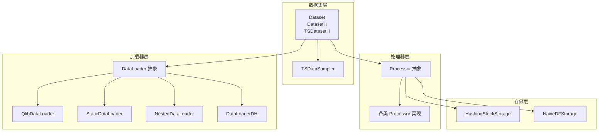
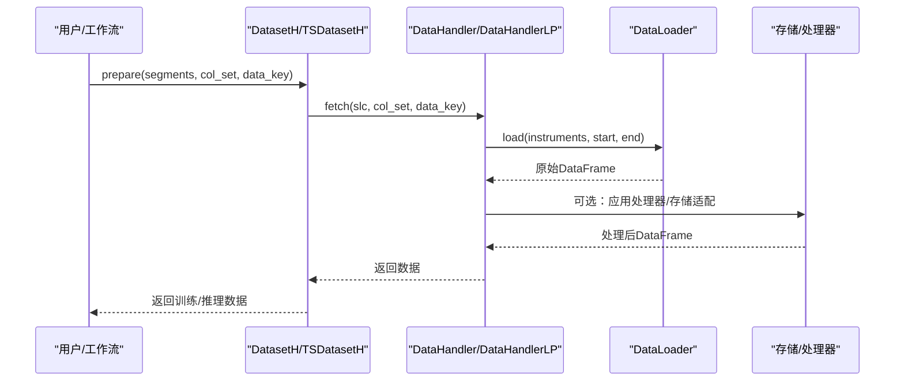
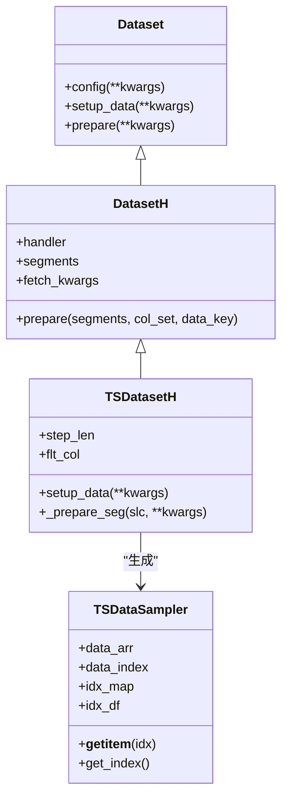
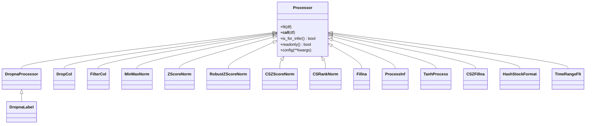
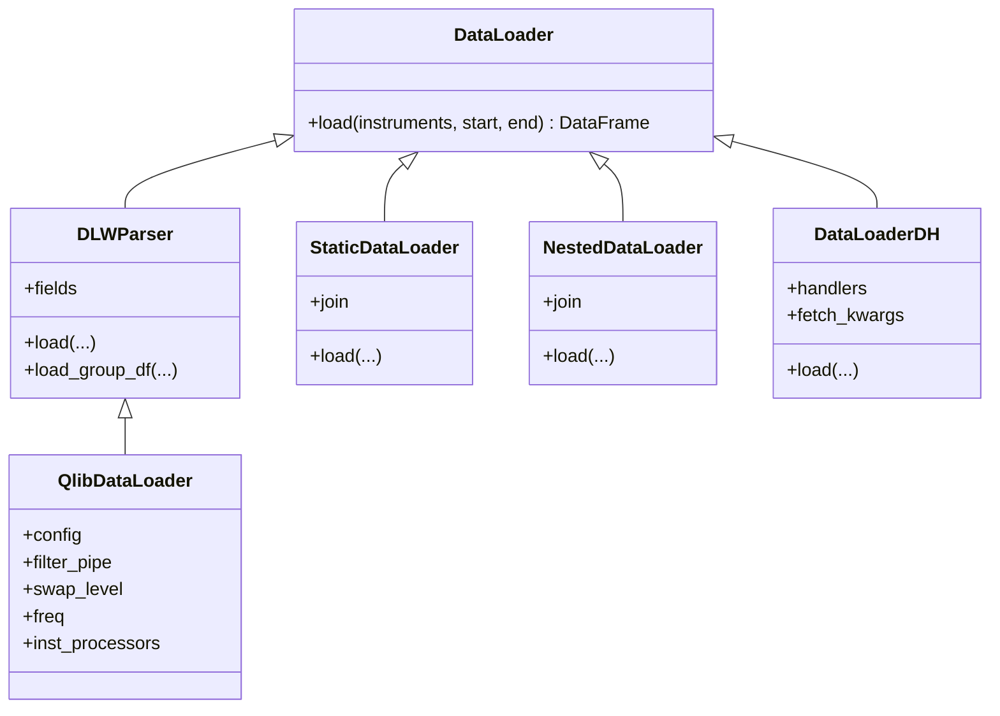
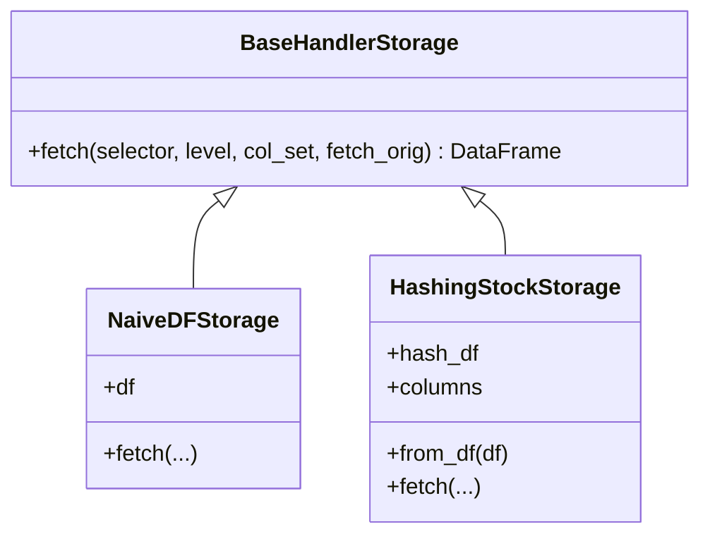
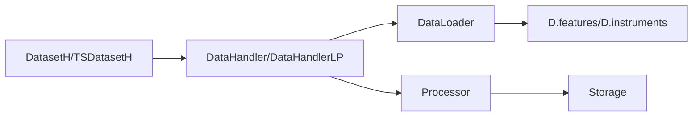

# 数据集与处理器系统

<cite>
**本文引用的文件**
- [dataset/__init__.py](file://qlib/data/dataset/__init__.py)
- [dataset/handler.py](file://qlib/data/dataset/handler.py)
- [dataset/loader.py](file://qlib/data/dataset/loader.py)
- [dataset/processor.py](file://qlib/data/dataset/processor.py)
- [dataset/storage.py](file://qlib/data/dataset/storage.py)
- [dataset/utils.py](file://qlib/data/dataset/utils.py)
- [dataset/weight.py](file://qlib/data/dataset/weight.py)
</cite>

## 目录
1. [引言](#引言)
2. [项目结构](#项目结构)
3. [核心组件](#核心组件)
4. [架构总览](#架构总览)
5. [详细组件分析](#详细组件分析)
6. [依赖分析](#依赖分析)
7. [性能考虑](#性能考虑)
8. [故障排查指南](#故障排查指南)
9. [结论](#结论)
10. [附录：最佳实践与自定义指南](#附录最佳实践与自定义指南)

## 引言
本文件系统性梳理 Qlib 的数据集与处理器体系，围绕 Handler、Loader 和 Processor 的职责与协作展开，解释数据加载、预处理、时间序列采样与权重重估等关键流程，并给出缓存策略、内存管理与性能优化建议。目标是帮助读者在不深入源码细节的前提下，快速掌握数据层的设计思想与使用方法。

## 项目结构
数据集与处理器系统位于 qlib/data/dataset 目录下，核心模块包括：
- 数据集基类与时间序列采样：dataset/__init__.py
- 数据处理器接口与实现：dataset/processor.py
- 数据加载器接口与多种实现：dataset/loader.py
- 数据处理器与存储适配：dataset/handler.py、dataset/storage.py
- 辅助工具：dataset/utils.py
- 样本权重重估接口：dataset/weight.py

图表来源
- [dataset/__init__.py:15-722](file://qlib/data/dataset/__init__.py#L15-L722)
- [dataset/processor.py:35-420](file://qlib/data/dataset/processor.py#L35-L420)
- [dataset/loader.py:18-415](file://qlib/data/dataset/loader.py#L18-L415)
- [dataset/storage.py:12-192](file://qlib/data/dataset/storage.py#L12-L192)

章节来源
- [dataset/__init__.py:15-722](file://qlib/data/dataset/__init__.py#L15-L722)
- [dataset/processor.py:35-420](file://qlib/data/dataset/processor.py#L35-L420)
- [dataset/loader.py:18-415](file://qlib/data/dataset/loader.py#L18-L415)
- [dataset/storage.py:12-192](file://qlib/data/dataset/storage.py#L12-L192)

## 核心组件
- Dataset 与 DatasetH：面向模型训练/推理的数据准备抽象，支持按时间段切片与多分割查询；DatasetH 将底层数据委托给 DataHandler 管理。
- TSDatasetH 与 TSDataSampler：将“表格式”数据转换为“时间序列样本”，提供类似 Dataset 的接口，便于构造时序批数据。
- DataHandler 与 DataHandlerLP：封装底层数据（通常为多索引 DataFrame），提供统一的 fetch 接口；DataHandlerLP 支持学习/推理两套处理器流水线。
- DataLoader 及其实现：负责从外部数据源加载原始数据，支持分组字段、过滤管道、频率与实例级处理器。
- Processor 及其子类：实现特征归一化、缺失值处理、跨截面标准化、时间范围过滤等常见预处理操作。
- Storage：提供可插拔的数据存储后端，支持哈希股票存储以提升随机访问性能。
- 工具与权重：fetch_df_by_index/fetch_df_by_col 等工具函数；Reweighter 权重接口预留。

章节来源
- [dataset/__init__.py:15-722](file://qlib/data/dataset/__init__.py#L15-L722)
- [dataset/handler.py:25-786](file://qlib/data/dataset/handler.py#L25-L786)
- [dataset/loader.py:18-415](file://qlib/data/dataset/loader.py#L18-L415)
- [dataset/processor.py:35-420](file://qlib/data/dataset/processor.py#L35-L420)
- [dataset/storage.py:12-192](file://qlib/data/dataset/storage.py#L12-L192)
- [dataset/utils.py:12-143](file://qlib/data/dataset/utils.py#L12-L143)
- [dataset/weight.py:5-28](file://qlib/data/dataset/weight.py#L5-L28)

## 架构总览
整体数据流从 DataLoader 加载原始数据，DataHandler 进行索引与列集合的统一适配，DataHandlerLP 在需要时运行共享/学习/推理三套处理器流水线，DatasetH/TSDatasetH 负责按时间切片与多分割准备数据，TSDataSampler 将表数据转为时序样本，最终供模型训练/推理使用。

图表来源
- [dataset/__init__.py:185-248](file://qlib/data/dataset/__init__.py#L185-L248)
- [dataset/handler.py:197-327](file://qlib/data/dataset/handler.py#L197-L327)
- [dataset/loader.py:24-60](file://qlib/data/dataset/loader.py#L24-L60)

## 详细组件分析

### 数据集层：Dataset、DatasetH、TSDatasetH、TSDataSampler
- Dataset：可序列化抽象，定义 setup_data/config/prepare 等生命周期方法，用于准备模型输入对象。
- DatasetH：基于 DataHandler 的具体实现，支持 segments 配置与多分割查询；prepare 会优先匹配分割键，否则直接透传切片。
- TSDatasetH：在 DatasetH 基础上扩展时间序列采样能力，自动扩展切片边界以满足步长需求，并通过 TSDataSampler 提供索引映射与批量取样。
- TSDataSampler：将多索引表数据转换为高效的时序样本索引结构，支持按整数索引或 (日期, 股票) 查询，内部维护 data_arr、idx_df、idx_map 等索引以加速取样。

图表来源
- [dataset/__init__.py:15-722](file://qlib/data/dataset/__init__.py#L15-L722)

章节来源
- [dataset/__init__.py:15-722](file://qlib/data/dataset/__init__.py#L15-L722)

### 处理器层：Processor 抽象与常用实现
- Processor：定义 fit/readonly/is_for_infer/config 等接口，支持序列化与配置注入。
- 常用处理器：
  - 缺失值/列过滤：DropnaProcessor、DropnaLabel、DropCol、FilterCol
  - 归一化/标准化：MinMaxNorm、ZScoreNorm、RobustZScoreNorm、CSZScoreNorm、CSRankNorm
  - 填充：Fillna
  - 其他：ProcessInf、TanhProcess、CSZFillna、HashStockFormat、TimeRangeFlt

图表来源
- [dataset/processor.py:35-420](file://qlib/data/dataset/processor.py#L35-L420)

章节来源
- [dataset/processor.py:35-420](file://qlib/data/dataset/processor.py#L35-L420)

### 加载器层：DataLoader 抽象与实现
- DataLoader：抽象接口，load 接收 instruments/start/end 参数，返回 DataFrame。
- DLWParser：解析字段配置，支持分组字段与列名映射。
- QlibDataLoader：基于 D.features 按表达式/名称加载特征，支持频率与实例处理器。
- StaticDataLoader：从文件或对象加载静态数据，支持按仪器/时间过滤与拼接。
- NestedDataLoader：组合多个 DataLoader，按连接方式合并结果。
- DataLoaderDH：基于 DataHandler 组合多数据源，按时间切片合并。

图表来源
- [dataset/loader.py:18-415](file://qlib/data/dataset/loader.py#L18-L415)

章节来源
- [dataset/loader.py:18-415](file://qlib/data/dataset/loader.py#L18-L415)

### 存储层：BaseHandlerStorage 与 HashingStockStorage
- BaseHandlerStorage：定义 fetch(selector, level, col_set, fetch_orig) 接口。
- NaiveDFStorage：直接基于 DataFrame 的存储适配。
- HashingStockStorage：按股票分桶的哈希存储，显著降低随机访问单只股票的成本，适合高频随机取数场景。

图表来源
- [dataset/storage.py:12-192](file://qlib/data/dataset/storage.py#L12-L192)

章节来源
- [dataset/storage.py:12-192](file://qlib/data/dataset/storage.py#L12-L192)

### 工具与权重
- fetch_df_by_index/fetch_df_by_col：根据索引/列集合进行高效筛选。
- Reweighter：样本权重重估接口，便于后续任务中引入样本权重。

章节来源
- [dataset/utils.py:41-90](file://qlib/data/dataset/utils.py#L41-L90)
- [dataset/weight.py:5-28](file://qlib/data/dataset/weight.py#L5-L28)

## 依赖分析
- 组件耦合
  - DatasetH 依赖 DataHandler；TSDatasetH 在 DatasetH 基础上扩展 TSDataSampler。
  - DataHandler 依赖 DataLoader；DataHandlerLP 在 DataHandler 基础上增加处理器流水线。
  - Processor 与 Storage 解耦，可通过不同存储适配器复用同一处理器集合。
- 外部依赖
  - D.features/D.instruments：QlibDataLoader 依赖 D 接口加载特征与股票池。
  - pandas/numpy：广泛用于索引、排序、分组与数值计算。

图表来源
- [dataset/__init__.py:185-248](file://qlib/data/dataset/__init__.py#L185-L248)
- [dataset/handler.py:135-140](file://qlib/data/dataset/handler.py#L135-L140)
- [dataset/loader.py:223-227](file://qlib/data/dataset/loader.py#L223-L227)

章节来源
- [dataset/__init__.py:185-248](file://qlib/data/dataset/__init__.py#L185-L248)
- [dataset/handler.py:135-140](file://qlib/data/dataset/handler.py#L135-L140)
- [dataset/loader.py:223-227](file://qlib/data/dataset/loader.py#L223-L227)

## 性能考虑
- 数据加载
  - 使用 CS_RAW 获取原始数据可避免不必要的拷贝；必要时先按列再按索引筛选以减少中间副本。
  - StaticDataLoader 支持按需拼接与时间过滤，尽量避免全量加载。
- 处理器流水线
  - readonly() 为 True 的处理器可避免不必要的数据复制；DataHandlerLP 在需要时才复制中间结果。
  - 分组/跨截面操作尽量利用 groupby 并行化工具，减少循环开销。
- 时间序列采样
  - TSDataSampler 内部使用 numpy 数组与预构建索引，避免频繁重建索引；合理设置 dtype 与填充策略可降低内存与计算成本。
- 存储适配
  - HashingStockStorage 适合高频随机访问场景；对于大表数据，建议在加载阶段即转换为哈希存储以提升查询效率。
- 缓存与内存
  - DataHandler.setup_data 支持 enable_cache 参数占位；结合外部缓存策略（如磁盘/表达式缓存）可显著减少重复加载。
  - 合理释放中间变量（如删除原始数据）可降低峰值内存占用。

章节来源
- [dataset/handler.py:173-196](file://qlib/data/dataset/handler.py#L173-L196)
- [dataset/handler.py:513-613](file://qlib/data/dataset/handler.py#L513-L613)
- [dataset/__init__.py:337-430](file://qlib/data/dataset/__init__.py#L337-L430)
- [dataset/storage.py:88-192](file://qlib/data/dataset/storage.py#L88-L192)

## 故障排查指南
- 切片冲突
  - 当 selector 为列表且 level 非空时，默认优先解释为切片；若不符合预期，检查传入参数顺序与 level 设置。
- 列集合与多级索引
  - CS_ALL 与 CS_RAW 的行为差异可能导致列选择异常；确认列集合与多级索引层级是否匹配。
- 处理器适用性
  - 某些处理器仅适用于学习阶段（如 DropnaLabel），在推理阶段调用会抛出类型错误；确保推理/学习阶段分别使用对应处理器集合。
- 缺失值与无穷值
  - 处理前先填充/替换 NaN/±∞，避免影响后续归一化与建模。
- 时间范围过滤
  - TimeRangeFlt 可能引入数据泄露风险，谨慎使用；确保过滤区间不包含未来信息。

章节来源
- [dataset/handler.py:294-301](file://qlib/data/dataset/handler.py#L294-L301)
- [dataset/handler.py:534-540](file://qlib/data/dataset/handler.py#L534-L540)
- [dataset/processor.py:105-112](file://qlib/data/dataset/processor.py#L105-L112)
- [dataset/processor.py:161-177](file://qlib/data/dataset/processor.py#L161-L177)
- [dataset/processor.py:383-420](file://qlib/data/dataset/processor.py#L383-L420)

## 结论
Qlib 的数据集与处理器系统通过清晰的分层与接口抽象，实现了从原始数据到模型输入的高效转换。Handler 负责数据适配与统一接口，Loader 负责从外部源加载，Processor 提供可插拔的预处理能力，Dataset/TSDataset 则面向训练/推理场景提供灵活的时间切片与样本组织。配合合理的缓存与存储策略，可在保证正确性的同时显著提升性能。

## 附录：最佳实践与自定义指南

- 自定义数据集
  - 若仅需按时间切片与列集合组织数据，继承 DatasetH 并在 prepare 中处理 segments 映射。
  - 若需要时间序列样本，继承 TSDatasetH 并在 setup_data 中更新日历；通过 flt_col 与 step_len 控制样本有效性与长度。
  - 对于复杂样本组织，可直接使用 TSDataSampler 构造时序样本索引，再按需重写 __getitem__/__len__。

- 自定义处理器
  - 新增处理器时，明确 readonly()/is_for_infer() 行为，避免不必要的复制与推理阶段错误。
  - fit 与 __call__ 的输入输出保持一致，注意对多级列索引的支持。
  - 对于跨截面操作，优先使用 groupby 并结合并行化工具提升性能。

- 自定义加载器
  - 若已有本地数据，使用 StaticDataLoader 以最小改动接入；注意按需拼接与时间过滤。
  - 若需组合多源数据，使用 NestedDataLoader 并指定连接策略，避免列重复覆盖。
  - 对于复杂表达式/频率/实例处理器，使用 QlibDataLoader 并配置相应参数。

- 缓存与内存管理
  - 在 DataHandler.setup_data 中启用缓存（占位参数），结合外部缓存策略减少重复加载。
  - 对大表数据优先采用 HashingStockStorage，减少随机访问开销。
  - 合理释放中间变量，必要时在 DataHandlerLP 中设置 drop_raw=True 以节省内存。

- 性能优化建议
  - 先列后行的筛选顺序（列集合 → 索引切片）可减少中间副本。
  - 使用 CS_RAW 获取原始数据并在上层做列选择，避免多次拷贝。
  - TSDataSampler 的 dtype 与填充策略应与下游模型兼容，避免类型转换损失。
  - 处理器流水线中尽量使用向量化与分组操作，避免 Python 循环。

章节来源
- [dataset/__init__.py:642-722](file://qlib/data/dataset/__init__.py#L642-L722)
- [dataset/processor.py:35-92](file://qlib/data/dataset/processor.py#L35-L92)
- [dataset/loader.py:230-290](file://qlib/data/dataset/loader.py#L230-L290)
- [dataset/storage.py:88-192](file://qlib/data/dataset/storage.py#L88-L192)
- [dataset/handler.py:173-196](file://qlib/data/dataset/handler.py#L173-L196)
- [dataset/handler.py:513-613](file://qlib/data/dataset/handler.py#L513-L613)