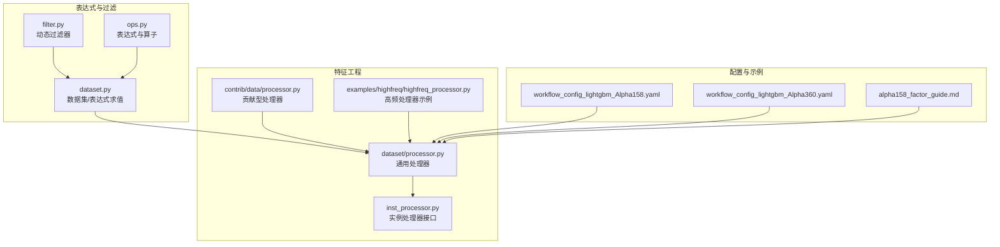
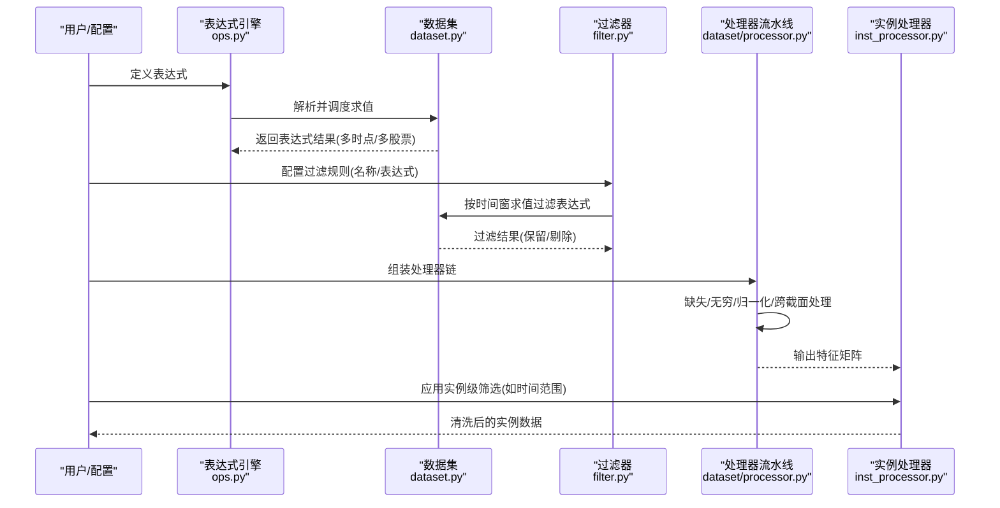
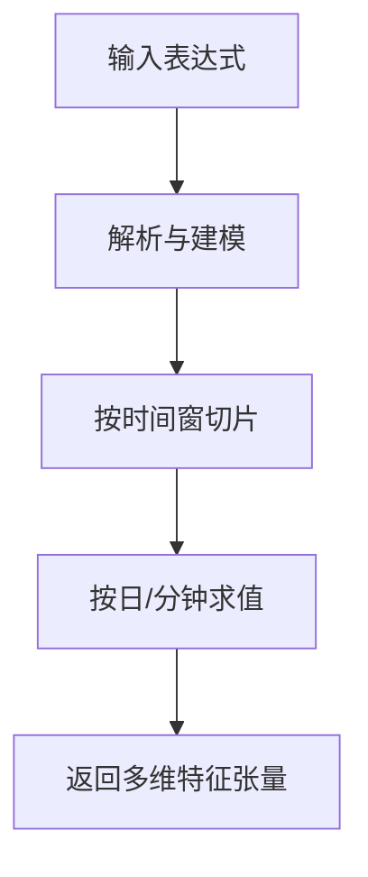
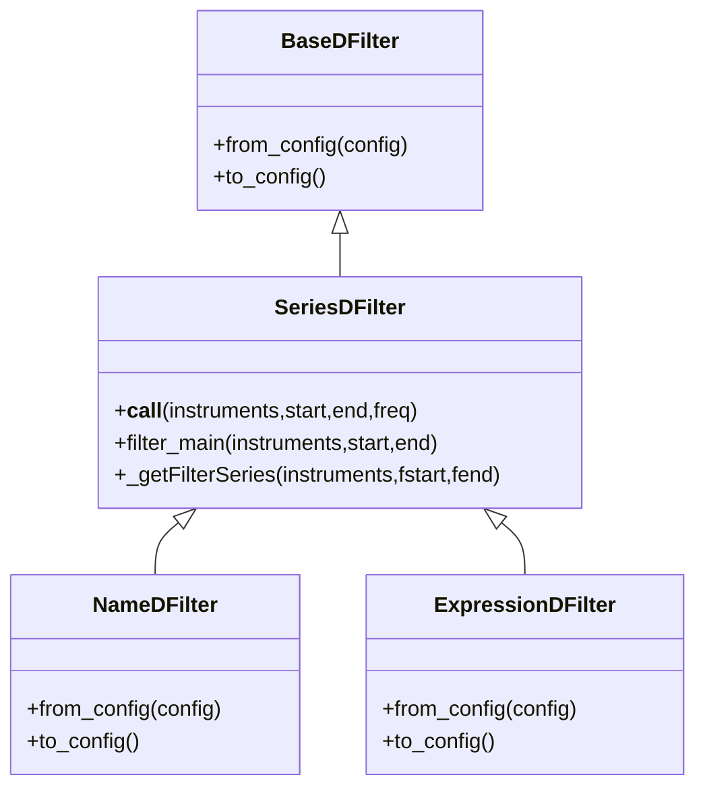
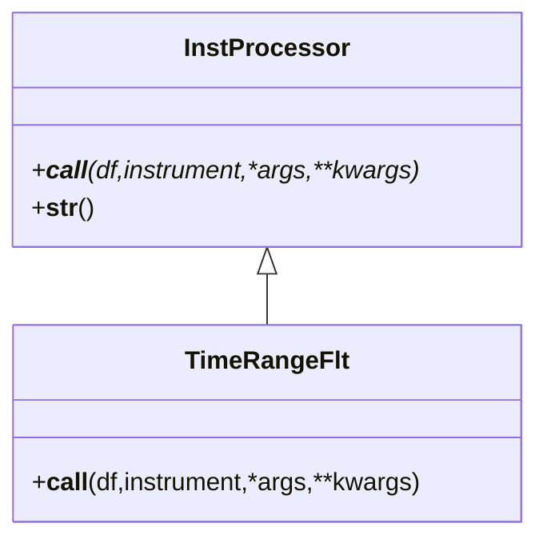
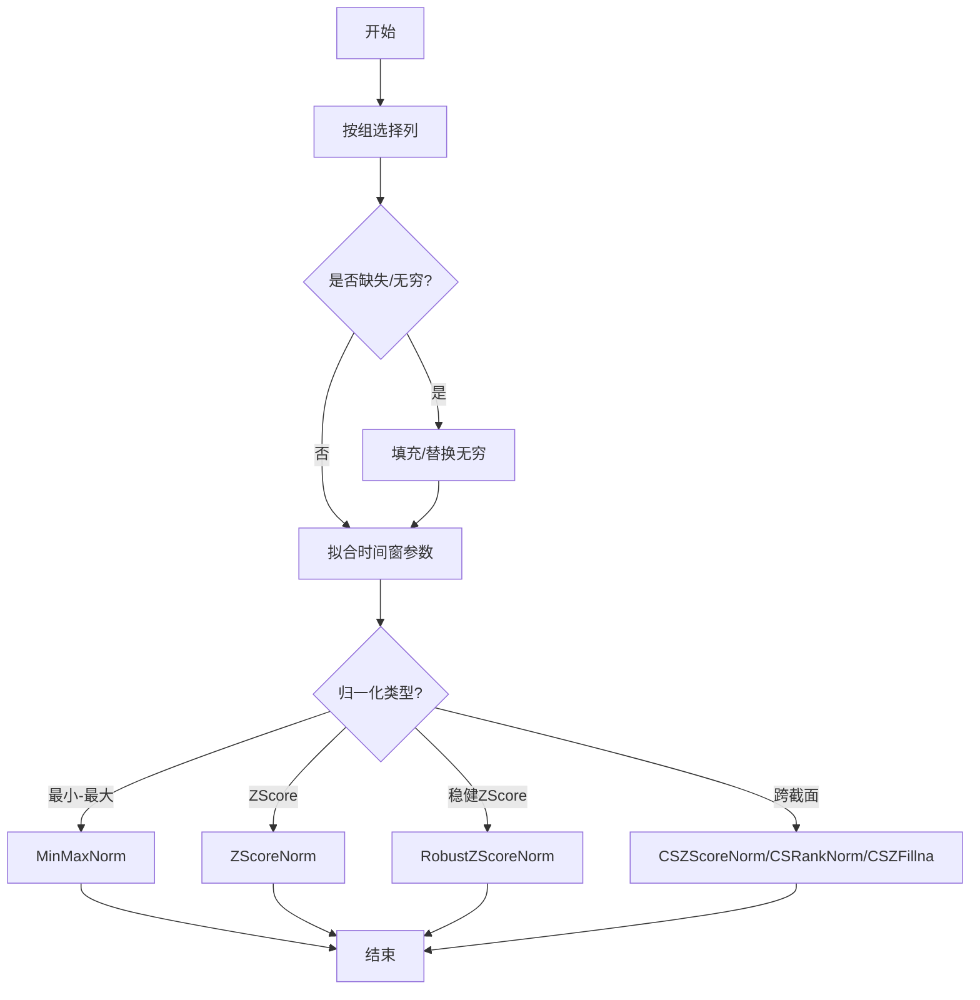
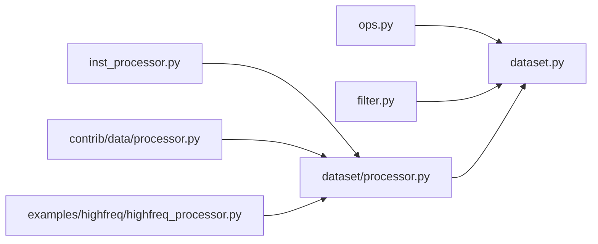

# 特征工程与表达式系统

<cite>
**本文引用的文件**
- [filter.py](file://qlib/data/filter.py)
- [inst_processor.py](file://qlib/data/inst_processor.py)
- [processor.py](file://qlib/data/dataset/processor.py)
- [processor.py（contrib）](file://qlib/contrib/data/processor.py)
- [highfreq_processor.py](file://examples/highfreq/highfreq_processor.py)
- [dataset.py](file://qlib/data/dataset/dataset.py)
- [ops.py](file://qlib/data/ops.py)
- [alpha158_factor_guide.md](file://alpha158_factor_guide.md)
- [workflow_config_lightgbm_Alpha158.yaml](file://examples/benchmarks/LightGBM/workflow_config_lightgbm_Alpha158.yaml)
- [workflow_config_lightgbm_Alpha360.yaml](file://examples/benchmarks/LightGBM/workflow_config_lightgbm_Alpha360.yaml)
</cite>

## 目录
1. [引言](#引言)
2. [项目结构](#项目结构)
3. [核心组件](#核心组件)
4. [架构总览](#架构总览)
5. [组件详解](#组件详解)
6. [依赖关系分析](#依赖关系分析)
7. [性能考量](#性能考量)
8. [故障排查指南](#故障排查指南)
9. [结论](#结论)
10. [附录](#附录)

## 引言
本文件面向金融特征工程与表达式系统，系统性梳理 Qlib 的表达式语法与动态计算机制、技术指标与因子变换、过滤器体系、实例处理器以及数据预处理流水线。文档以“可操作”为目标，既提供架构视图，也给出实践建议、性能优化与调试方法，帮助读者在真实金融场景中高效构建与维护特征工程流水线。

## 项目结构
围绕特征工程与表达式系统的关键模块主要分布在以下路径：
- 表达式与过滤器：qlib/data/filter.py
- 数据集处理器：qlib/data/dataset/processor.py
- 实例级处理器接口：qlib/data/inst_processor.py
- 贡献型处理器（Alpha158风格）：qlib/contrib/data/processor.py
- 高频示例处理器：examples/highfreq/highfreq_processor.py
- 表达式与算子：qlib/data/ops.py
- 数据集加载与表达式求值：qlib/data/dataset/dataset.py
- 示例配置与因子清单：examples/benchmarks/LightGBM/*.yaml, alpha158_factor_guide.md

**图表来源**
- [filter.py:15-376](file://qlib/data/filter.py#L15-L376)
- [processor.py:35-420](file://qlib/data/dataset/processor.py#L35-L420)
- [inst_processor.py:6-23](file://qlib/data/inst_processor.py#L6-L23)
- [processor.py（contrib）:7-130](file://qlib/contrib/data/processor.py#L7-L130)
- [highfreq_processor.py](file://examples/highfreq/highfreq_processor.py)
- [ops.py](file://qlib/data/ops.py)
- [dataset.py](file://qlib/data/dataset/dataset.py)

**章节来源**
- [filter.py:15-376](file://qlib/data/filter.py#L15-L376)
- [processor.py:35-420](file://qlib/data/dataset/processor.py#L35-L420)
- [inst_processor.py:6-23](file://qlib/data/inst_processor.py#L6-L23)
- [processor.py（contrib）:7-130](file://qlib/contrib/data/processor.py#L7-L130)
- [highfreq_processor.py](file://examples/highfreq/highfreq_processor.py)

## 核心组件
- 动态过滤器体系：支持基于名称规则与表达式的动态过滤，覆盖时间窗与保留策略。
- 数据集处理器：提供缺失值、无穷值、归一化、分位归一、跨截面标准化等常用预处理能力。
- 实例处理器接口：统一实例级数据处理协议，便于扩展自定义处理逻辑。
- 表达式与算子：通过表达式语法与算子重载实现动态计算，结合数据集按需求值。
- 示例与配置：提供 Alpha158/Alpha360 等经典因子流水线与 YAML 配置模板。

**章节来源**
- [filter.py:15-376](file://qlib/data/filter.py#L15-L376)
- [processor.py:35-420](file://qlib/data/dataset/processor.py#L35-L420)
- [inst_processor.py:6-23](file://qlib/data/inst_processor.py#L6-L23)
- [processor.py（contrib）:7-130](file://qlib/contrib/data/processor.py#L7-L130)
- [alpha158_factor_guide.md](file://alpha158_factor_guide.md)

## 架构总览
表达式系统与特征工程的运行时流程如下：
- 表达式解析与求值：通过表达式语法与算子重载生成可执行的计算图，结合数据集按时间片动态求值。
- 过滤器阶段：在时间窗内对股票池进行筛选，支持名称匹配与表达式判定。
- 处理器流水线：依次应用缺失值填充、无穷值处理、归一化、跨截面变换等步骤。
- 实例处理器：对单只股票的数据进行更细粒度的清洗与筛选，避免信息泄漏。

**图表来源**
- [ops.py](file://qlib/data/ops.py)
- [dataset.py](file://qlib/data/dataset/dataset.py)
- [filter.py:312-376](file://qlib/data/filter.py#L312-L376)
- [processor.py:94-420](file://qlib/data/dataset/processor.py#L94-L420)
- [inst_processor.py:6-23](file://qlib/data/inst_processor.py#L6-L23)

## 组件详解

### 表达式系统与动态计算
- 表达式语法与算子重载：表达式系统通过算子重载与解析器将字符串表达式转换为可执行的计算节点，支持基础算术、函数调用、引用滞后、排序与排名等操作。表达式在数据集层按需求值，避免全量缓存带来的内存压力。
- 动态计算机制：结合数据集的时间窗与频率参数，表达式在指定时间范围内按日/分钟粒度增量计算，支持跨时序与跨截面操作。

**图表来源**
- [ops.py](file://qlib/data/ops.py)
- [dataset.py](file://qlib/data/dataset/dataset.py)

**章节来源**
- [ops.py](file://qlib/data/ops.py)
- [dataset.py](file://qlib/data/dataset/dataset.py)

### 过滤器系统
- 基础抽象：动态过滤器抽象类定义了从配置构造实例、序列化配置以及主过滤流程的方法。
- 名称过滤器：基于正则表达式筛选股票名称，支持时间窗限定与保留策略。
- 表达式过滤器：在时间窗内对表达式求值，将布尔结果映射到每个交易日，再合并为连续区间；支持保留或剔除缺失区间的股票。

**图表来源**
- [filter.py:15-376](file://qlib/data/filter.py#L15-L376)

**章节来源**
- [filter.py:15-376](file://qlib/data/filter.py#L15-L376)

### 实例处理器
- 接口设计：实例处理器统一签名，接收原始 DataFrame 与股票标识，支持原地修改，注意外部拷贝保护。
- 时间范围过滤：实例级处理器可按起止时间过滤股票数据，避免未来信息泄露。
- 扩展方式：继承接口实现自定义清洗、窗口提取、标签构造等逻辑。

**图表来源**
- [inst_processor.py:6-23](file://qlib/data/inst_processor.py#L6-L23)
- [processor.py:383-420](file://qlib/data/dataset/processor.py#L383-L420)

**章节来源**
- [inst_processor.py:6-23](file://qlib/data/inst_processor.py#L6-L23)
- [processor.py:383-420](file://qlib/data/dataset/processor.py#L383-L420)

### 特征工程工具与数据预处理
- 缺失值处理：支持按组选择列进行填充，避免全表扫描。
- 无穷值处理：按日期分组替换无穷大/负无穷为非无穷值均值，降低极端值影响。
- 归一化与标准化：
  - 最小-最大归一化：按时间窗拟合，避免测试期信息泄漏。
  - ZScore 标准化：按时间窗拟合均值与标准差。
  - 稳健 ZScore：使用中位数与MAD，抗异常值能力强。
- 跨截面变换：
  - CSZScoreNorm：按日对所有股票做标准化。
  - CSRankNorm：按日对所有股票做秩变换并缩放。
  - CSZFillna：按日对缺失值做均值填充。
- 贡献型处理器（Alpha158风格）：针对不同特征类型（价格、波动率、动量等）采用分组变换与分段归一化策略，兼顾稳定性与可解释性。

**图表来源**
- [processor.py:94-420](file://qlib/data/dataset/processor.py#L94-L420)

**章节来源**
- [processor.py:94-420](file://qlib/data/dataset/processor.py#L94-L420)
- [processor.py（contrib）:7-130](file://qlib/contrib/data/processor.py#L7-L130)

### 高频处理器示例
- 高频场景下的特征构造与清洗：示例展示了如何在高频数据上进行窗口统计、变换与缺失处理，适配分钟级特征工程需求。

**章节来源**
- [highfreq_processor.py](file://examples/highfreq/highfreq_processor.py)

### 表达式示例与最佳实践
- 基础表达式：支持四则运算、函数调用、引用滞后、排序与排名等。
- 典型用法：
  - 基础特征过滤：例如 $close/$open>5。
  - 跨截面过滤：例如 $rank($close)<10。
  - 时间序列过滤：例如 $Ref($close, 3)>100。
- 最佳实践：
  - 明确时间窗与频率，避免未来信息泄漏。
  - 在训练期严格限制拟合时间窗，防止数据泄漏。
  - 对表达式结果进行跨截面标准化或分位归一化，提升模型鲁棒性。

**章节来源**
- [filter.py:312-376](file://qlib/data/filter.py#L312-L376)
- [alpha158_factor_guide.md](file://alpha158_factor_guide.md)

### 配置与流水线示例
- 使用 LightGBM 的 Alpha158/Alpha360 工作流配置，展示特征工程与模型训练的端到端集成方式。

**章节来源**
- [workflow_config_lightgbm_Alpha158.yaml](file://examples/benchmarks/LightGBM/workflow_config_lightgbm_Alpha158.yaml)
- [workflow_config_lightgbm_Alpha360.yaml](file://examples/benchmarks/LightGBM/workflow_config_lightgbm_Alpha360.yaml)

## 依赖关系分析
- 表达式系统依赖数据集模块进行按需求值，过滤器在表达式求值基础上进行布尔筛选。
- 特征工程处理器依赖数据集提供的多索引列组织与时间切片能力。
- 实例处理器与处理器流水线解耦，便于按需组合与扩展。

**图表来源**
- [ops.py](file://qlib/data/ops.py)
- [dataset.py](file://qlib/data/dataset/dataset.py)
- [filter.py:312-376](file://qlib/data/filter.py#L312-L376)
- [processor.py:35-420](file://qlib/data/dataset/processor.py#L35-L420)
- [inst_processor.py:6-23](file://qlib/data/inst_processor.py#L6-L23)
- [processor.py（contrib）:7-130](file://qlib/contrib/data/processor.py#L7-L130)
- [highfreq_processor.py](file://examples/highfreq/highfreq_processor.py)

**章节来源**
- [ops.py](file://qlib/data/ops.py)
- [dataset.py](file://qlib/data/dataset/dataset.py)
- [filter.py:312-376](file://qlib/data/filter.py#L312-L376)
- [processor.py:35-420](file://qlib/data/dataset/processor.py#L35-L420)
- [inst_processor.py:6-23](file://qlib/data/inst_processor.py#L6-L23)
- [processor.py（contrib）:7-130](file://qlib/contrib/data/processor.py#L7-L130)
- [highfreq_processor.py](file://examples/highfreq/highfreq_processor.py)

## 性能考量
- 按需求值与缓存控制：表达式在数据集层按时间窗求值，必要时关闭磁盘缓存以减少 IO。
- 分组处理与向量化：优先使用分组 apply 与向量化操作，避免显式循环。
- 归一化与跨截面变换：尽量在训练期拟合参数，推理期仅应用，避免重复计算。
- 缺失/无穷处理：按日期分组处理可显著降低计算复杂度。
- 高频数据：窗口长度与步长需权衡精度与速度，必要时采用采样或降采样。

[本节为通用指导，无需列出具体文件来源]

## 故障排查指南
- 无穷值导致的异常传播：检查无穷值替换逻辑，确保替换为合理统计量。
- 缺失值填充策略：确认填充列范围与填充值设置，避免对标签列误填充。
- 归一化泄漏：严格限定拟合时间窗，确保测试期不引入未来信息。
- 过滤器时间窗不一致：核对过滤器起止时间与数据日历对齐，避免越界。
- 实例处理器泄漏：确认时间范围过滤逻辑，避免返回空数据帧。

**章节来源**
- [processor.py:161-177](file://qlib/data/dataset/processor.py#L161-L177)
- [processor.py:179-194](file://qlib/data/dataset/processor.py#L179-L194)
- [processor.py:196-226](file://qlib/data/dataset/processor.py#L196-L226)
- [processor.py:228-259](file://qlib/data/dataset/processor.py#L228-L259)
- [processor.py:262-298](file://qlib/data/dataset/processor.py#L262-L298)
- [processor.py:383-420](file://qlib/data/dataset/processor.py#L383-L420)
- [filter.py:216-262](file://qlib/data/filter.py#L216-L262)

## 结论
Qlib 的特征工程与表达式系统以“表达式驱动+流水线化处理+可扩展过滤器”为核心，既能满足学术研究的灵活性，也能支撑工业级生产环境的稳定性与性能。通过明确时间窗、严格控制信息泄漏、合理选择归一化与跨截面变换策略，并结合高频与低频场景的差异化处理，可以构建高质量、可复现的因子工程流水线。

[本节为总结性内容，无需列出具体文件来源]

## 附录
- 参考配置与因子清单：Alpha158/Alpha360 的工作流配置与因子清单，便于快速落地与对比实验。
- 高频处理器示例：提供分钟级特征工程的参考实现。

**章节来源**
- [alpha158_factor_guide.md](file://alpha158_factor_guide.md)
- [workflow_config_lightgbm_Alpha158.yaml](file://examples/benchmarks/LightGBM/workflow_config_lightgbm_Alpha158.yaml)
- [workflow_config_lightgbm_Alpha360.yaml](file://examples/benchmarks/LightGBM/workflow_config_lightgbm_Alpha360.yaml)
- [highfreq_processor.py](file://examples/highfreq/highfreq_processor.py)