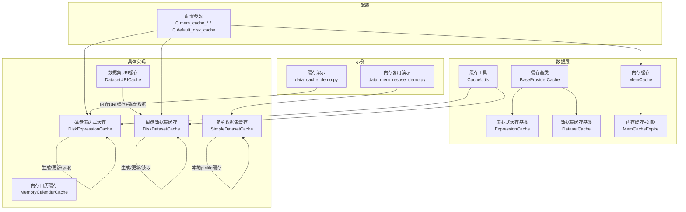
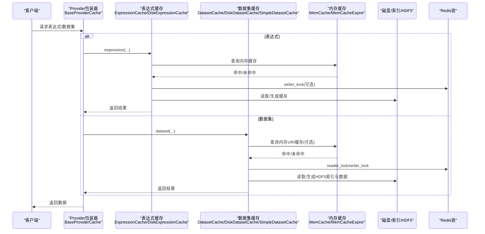
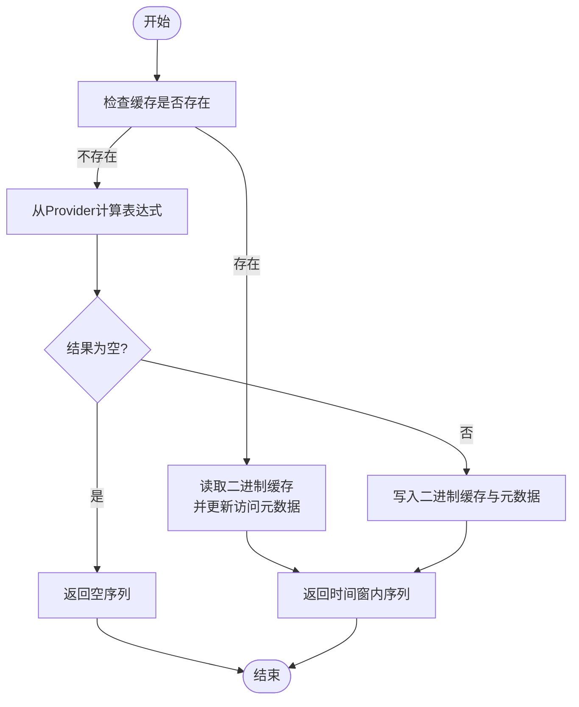
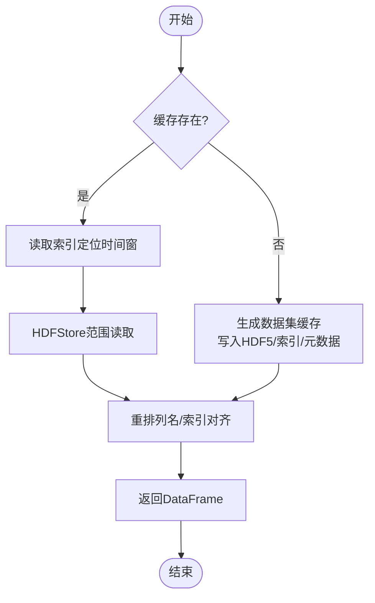
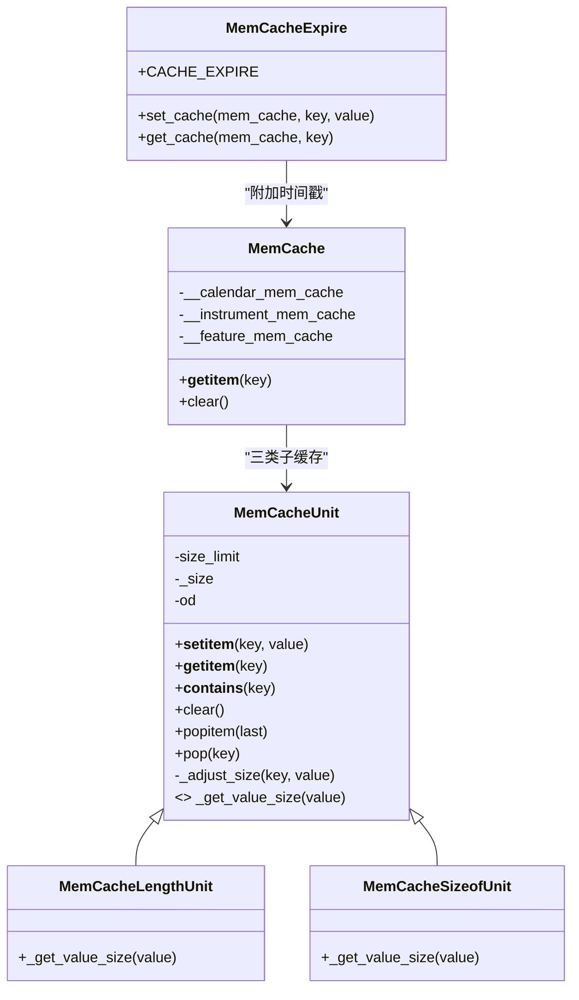
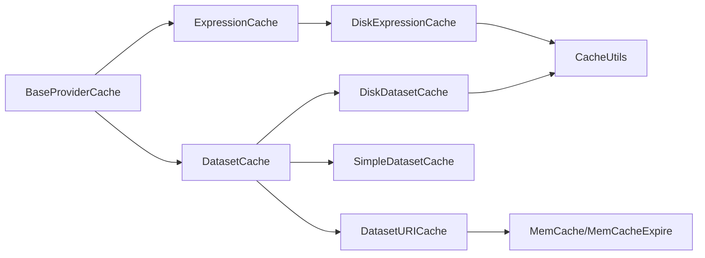

# 缓存优化系统

<cite>
**本文档引用的文件**
- [cache.py](file://qlib/data/cache.py)
- [config.py](file://qlib/config.py)
- [data_cache_demo.py](file://examples/data_demo/data_cache_demo.py)
- [data_mem_resuse_demo.py](file://examples/data_demo/data_mem_resuse_demo.py)
- [data.rst](file://docs/component/data.rst)
</cite>

## 目录
1. [简介](#简介)
2. [项目结构](#项目结构)
3. [核心组件](#核心组件)
4. [架构总览](#架构总览)
5. [详细组件分析](#详细组件分析)
6. [依赖分析](#依赖分析)
7. [性能考虑](#性能考虑)
8. [故障排查指南](#故障排查指南)
9. [结论](#结论)
10. [附录](#附录)

## 简介
本文件系统性梳理 Qlib 的缓存优化体系，重点覆盖表达式缓存（ExpressionCache）与数据集缓存（DatasetCache）两大模块，深入解析其架构设计、内存管理策略、LRU 淘汰与过期控制、失效与更新机制、性能监控与调优方法，并结合实际示例演示缓存使用、性能测试与故障诊断流程。

## 项目结构
缓存相关的核心代码集中在数据层的缓存模块中，配合配置模块提供缓存行为参数；示例目录提供了缓存使用与内存复用的演示脚本。

图表来源
- [cache.py:295-1200](file://qlib/data/cache.py#L295-L1200)
- [config.py:135-200](file://qlib/config.py#L135-L200)

章节来源
- [cache.py:295-1200](file://qlib/data/cache.py#L295-L1200)
- [config.py:135-200](file://qlib/config.py#L135-L200)

## 核心组件
- 表达式缓存（ExpressionCache）
  - 负责单表达式的缓存与读写，支持自定义 URI 生成与缓存逻辑。
  - 提供更新接口以增量更新缓存。
- 数据集缓存（DatasetCache）
  - 负责多样本多字段的数据集缓存，支持磁盘与本地两种实现。
  - 提供数据集 URI 生成、缓存读取、索引管理与增量更新。
- 内存缓存（MemCache）
  - 基于有序字典实现 LRU 淘汰，支持按数量或内存大小限制。
  - 提供三类子缓存：日历、标的、特征。
- 过期控制（MemCacheExpire）
  - 在内存缓存中附加时间戳，按配置的过期时间判断是否失效。
- 缓存工具（CacheUtils）
  - 提供 Redis 锁封装，保证并发安全；提供访问元数据维护与锁清理。
- 具体实现
  - DiskExpressionCache：基于二进制文件与元数据的表达式缓存。
  - DiskDatasetCache：基于 HDF5 的数据集缓存，含索引文件。
  - SimpleDatasetCache：基于本地 pickle 文件的轻量数据集缓存。
  - DatasetURICache：面向服务端的“URI 缓存 + 磁盘数据”组合方案。
  - MemoryCalendarCache：内存化日历缓存。

章节来源
- [cache.py:330-465](file://qlib/data/cache.py#L330-L465)
- [cache.py:137-208](file://qlib/data/cache.py#L137-L208)
- [cache.py:210-293](file://qlib/data/cache.py#L210-L293)
- [cache.py:490-645](file://qlib/data/cache.py#L490-L645)
- [cache.py:647-1062](file://qlib/data/cache.py#L647-L1062)
- [cache.py:1064-1116](file://qlib/data/cache.py#L1064-L1116)
- [cache.py:1118-1178](file://qlib/data/cache.py#L1118-L1178)
- [cache.py:1184-1196](file://qlib/data/cache.py#L1184-L1196)

## 架构总览
下图展示了缓存系统的整体交互：客户端通过 ProviderCache 包装器访问底层 Provider；磁盘缓存负责持久化存储；内存缓存用于热点数据加速；Redis 锁保障并发一致性；配置参数决定缓存策略与行为。

图表来源
- [cache.py:330-465](file://qlib/data/cache.py#L330-L465)
- [cache.py:490-645](file://qlib/data/cache.py#L490-L645)
- [cache.py:647-1062](file://qlib/data/cache.py#L647-L1062)
- [cache.py:1118-1178](file://qlib/data/cache.py#L1118-L1178)

## 详细组件分析

### 表达式缓存（ExpressionCache）
- 设计要点
  - 抽象接口：_uri、_expression、update，便于用户自定义缓存路径与生成策略。
  - 默认实现：DiskExpressionCache 使用二进制文件存储序列数据，配合 .meta 元数据记录访问次数与最后访问时间。
  - 并发控制：通过 Redis 锁避免并发写入冲突。
- 关键流程
  - 读取：若缓存存在且有效，直接读取二进制数据；否则从 Provider 计算并写入缓存。
  - 更新：根据上次更新时间与最新日历，计算需要追加的数据长度，截断旧尾部并追加新数据，同时更新元数据。
- 复杂度与性能
  - 读取为 O(1) 命中时，磁盘顺序读取按时间窗口定位。
  - 更新涉及截断与追加，时间复杂度与新增周期数线性相关。

图表来源
- [cache.py:507-565](file://qlib/data/cache.py#L507-L565)

章节来源
- [cache.py:330-379](file://qlib/data/cache.py#L330-L379)
- [cache.py:490-645](file://qlib/data/cache.py#L490-L645)

### 数据集缓存（DatasetCache）
- 设计要点
  - 支持多种实现：磁盘（HDF5 + 索引 + 元数据）、本地 pickle、服务端 URI 缓存 + 磁盘数据。
  - 索引管理：IndexManager 维护每日期的起止行号，加速范围读取。
  - 并发控制：读写锁确保多进程安全。
- 关键流程
  - 读取：优先检查缓存存在性；命中则按时间窗口读取；未命中则生成缓存。
  - 更新：计算新增周期，去除右侧扩展窗口对应的历史行，追加新数据并更新索引与元数据。
- 复杂度与性能
  - 读取：索引 O(log N) 定位 + HDF5 范围读取。
  - 更新：移除固定行数 + 追加新数据，整体与新增周期数线性相关。

图表来源
- [cache.py:696-748](file://qlib/data/cache.py#L696-L748)
- [cache.py:857-950](file://qlib/data/cache.py#L857-L950)

章节来源
- [cache.py:381-465](file://qlib/data/cache.py#L381-L465)
- [cache.py:647-1062](file://qlib/data/cache.py#L647-L1062)

### 内存缓存与过期控制（MemCache / MemCacheExpire）
- 设计要点
  - MemCache：按“日历/标的/特征”三类子缓存，支持按数量或内存大小限制，内部使用有序字典实现 LRU。
  - MemCacheExpire：在值中附加时间戳，按配置的过期秒数判断是否失效。
- 使用场景
  - DatasetURICache：缓存数据集 URI 到内存，结合磁盘数据实现快速加载。
  - MemoryCalendarCache：缓存日历结果，减少重复查询。
- 性能特性
  - 命中为 O(1)，淘汰触发时弹出最久未使用项。

图表来源
- [cache.py:44-135](file://qlib/data/cache.py#L44-L135)
- [cache.py:137-208](file://qlib/data/cache.py#L137-L208)

章节来源
- [cache.py:44-135](file://qlib/data/cache.py#L44-L135)
- [cache.py:137-208](file://qlib/data/cache.py#L137-L208)

### 缓存工具与并发控制（CacheUtils）
- 设计要点
  - reader_lock/writer_lock：读者互斥进入，首个读者获取写锁；最后一位读者释放写锁。
  - reset_lock：清理残留锁，便于异常恢复。
  - visit：更新缓存访问元数据（访问次数与最近访问时间）。
- 使用场景
  - 所有磁盘缓存读写操作均需在锁保护下进行，确保并发安全。

章节来源
- [cache.py:210-293](file://qlib/data/cache.py#L210-L293)

### 配置参数与默认行为
- 关键参数
  - mem_cache_size_limit：内存缓存条目上限，默认 500。
  - mem_cache_limit_type：内存缓存限制类型，支持 length 或 sizeof。
  - mem_cache_expire：内存缓存过期秒数，默认 1 小时。
  - dataset_cache_dir_name / features_cache_dir_name：缓存目录名。
  - default_disk_cache：默认是否启用磁盘缓存。
- 影响范围
  - MemCache 初始化时读取上述参数，决定缓存容量与限制方式。
  - DatasetURICache 与 MemoryCalendarCache 依赖过期时间控制。

章节来源
- [config.py:135-200](file://qlib/config.py#L135-L200)
- [cache.py:140-174](file://qlib/data/cache.py#L140-L174)
- [cache.py:181-207](file://qlib/data/cache.py#L181-L207)

## 依赖分析
- 组件耦合
  - BaseProviderCache 作为所有缓存实现的父类，统一了缓存生命周期与清理逻辑。
  - DiskExpressionCache/DiskDatasetCache 依赖 Redis 锁与文件系统，实现强一致的并发控制。
  - DatasetURICache 依赖内存缓存与磁盘数据，形成“内存 URI + 磁盘数据”的混合策略。
- 外部依赖
  - Redis：提供分布式锁，保障多进程/多机一致性。
  - HDFStore：数据集缓存的数据容器。
  - pickle：简单数据集缓存与元数据序列化。

图表来源
- [cache.py:295-1200](file://qlib/data/cache.py#L295-L1200)

章节来源
- [cache.py:295-1200](file://qlib/data/cache.py#L295-L1200)

## 性能考虑
- 内存缓存策略
  - 合理设置 mem_cache_size_limit 与 mem_cache_limit_type，避免内存溢出。
  - 对高频访问的日历与数据集 URI 可启用内存缓存，显著降低重复查询成本。
- 磁盘缓存策略
  - 表达式缓存采用二进制文件与元数据，读取效率高；数据集缓存采用 HDF5 + 索引，范围读取高效。
  - 启用 default_disk_cache 可全局开启磁盘缓存，减少重复计算。
- 并发与锁
  - 使用 reader_lock/writer_lock 降低写竞争；避免在高并发场景下频繁重建缓存。
- 更新与淘汰
  - 表达式与数据集缓存均支持增量更新，尽量避免全量重建。
  - LRU 淘汰策略在内存紧张时自动释放冷数据，保持热数据可用性。

## 故障排查指南
- 常见问题
  - 缓存读取失败：检查缓存文件是否存在、权限是否正确、元数据是否损坏。
  - 并发冲突：Redis 锁残留导致无法写入，使用 CacheUtils.reset_lock 清理。
  - 内存泄漏：内存缓存过大或未及时过期，调整 mem_cache_size_limit 与 mem_cache_expire。
- 排查步骤
  - 检查缓存目录与文件后缀（.data/.index/.meta/.bin），确认完整性。
  - 查看日志输出，定位读写锁获取失败或访问元数据更新异常。
  - 使用缓存清理接口删除损坏缓存，重新生成。
- 示例参考
  - 缓存演示脚本展示了如何通过序列化处理器避免重复预处理。
  - 内存复用演示展示了如何在多次训练中复用已处理的数据以节省时间。

章节来源
- [cache.py:305-327](file://qlib/data/cache.py#L305-L327)
- [cache.py:217-254](file://qlib/data/cache.py#L217-L254)
- [data_cache_demo.py:23-54](file://examples/data_demo/data_cache_demo.py#L23-L54)
- [data_mem_resuse_demo.py:24-60](file://examples/data_demo/data_mem_resuse_demo.py#L24-L60)

## 结论
Qlib 的缓存优化系统通过“内存 + 磁盘”的分层设计，结合 Redis 锁与 LRU/过期控制，在保证一致性的同时显著提升了数据访问性能。表达式缓存与数据集缓存分别针对细粒度与粗粒度数据场景提供了高效的持久化与加速方案。通过合理配置与调优，可在不同规模与并发环境下获得稳定、可预测的性能表现。

## 附录
- 使用示例
  - 表达式缓存与数据集缓存的使用方法可参考示例脚本与文档说明。
- 性能测试
  - 可通过示例脚本中的计时器对比启用/禁用缓存前后的执行时间差异。
- 文档参考
  - 数据组件文档对缓存接口与实现细节进行了系统说明。

章节来源
- [data.rst:542-572](file://docs/component/data.rst#L542-L572)
- [data_cache_demo.py:23-54](file://examples/data_demo/data_cache_demo.py#L23-L54)
- [data_mem_resuse_demo.py:24-60](file://examples/data_demo/data_mem_resuse_demo.py#L24-L60)