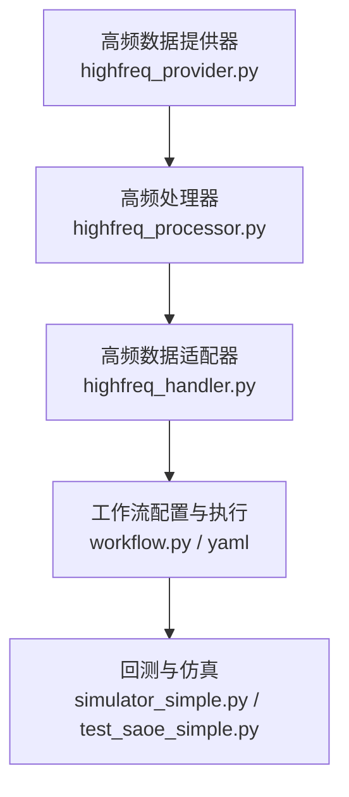
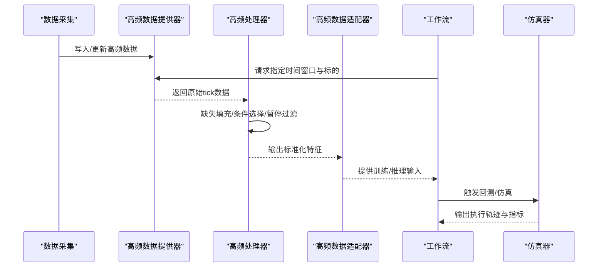
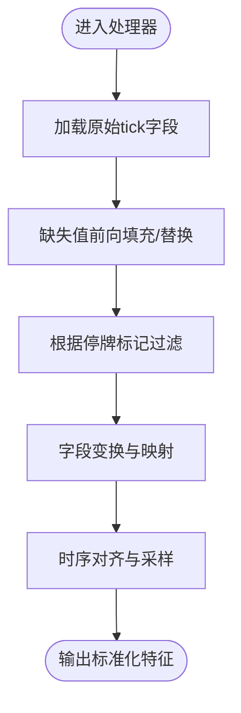
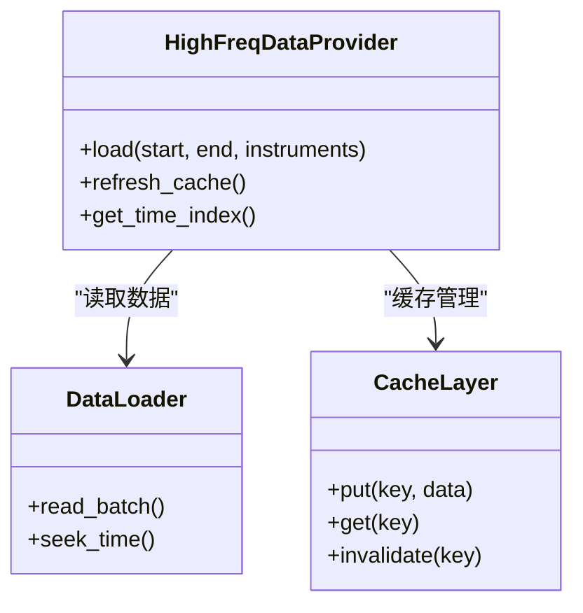
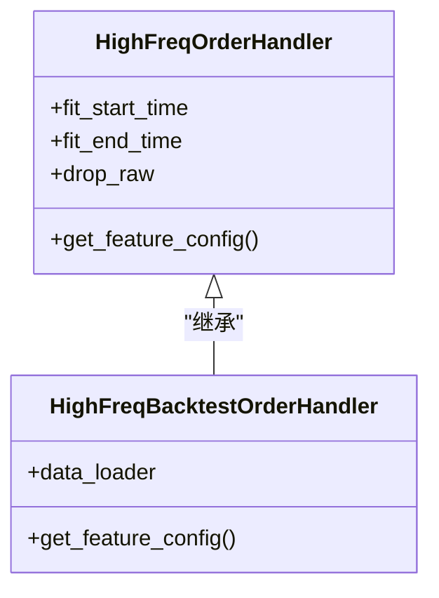
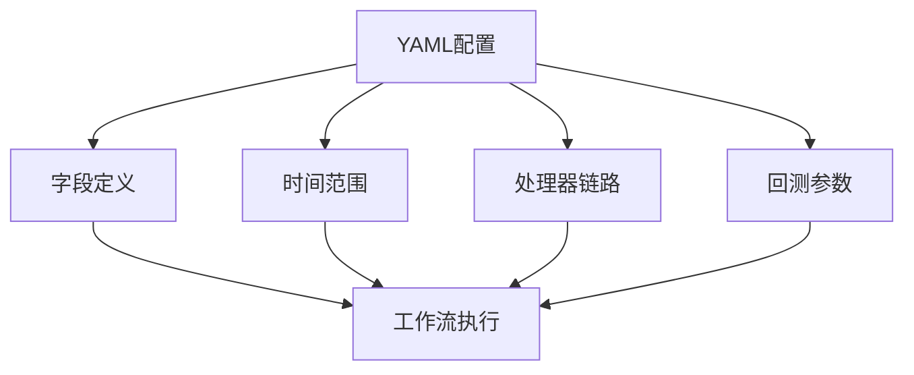
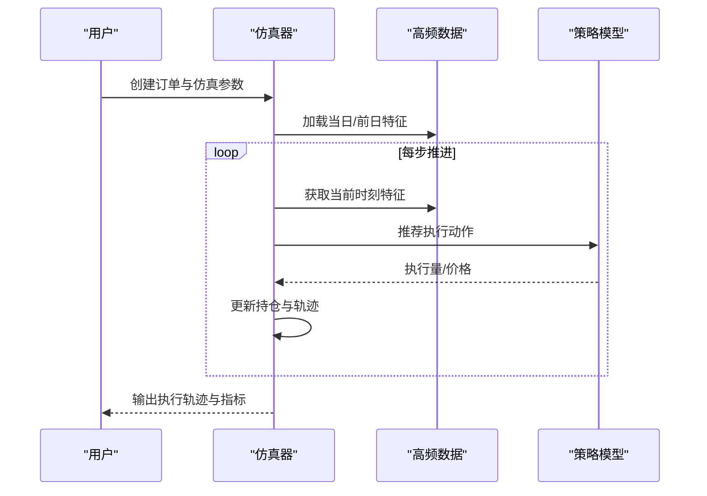

# 高频数据处理

<cite>
**本文引用的文件**
- [highfreq_handler.py](file://qlib/contrib/data/highfreq_handler.py)
- [highfreq_processor.py](file://qlib/contrib/data/highfreq_processor.py)
- [highfreq_provider.py](file://qlib/contrib/data/highfreq_provider.py)
- [highfreq_ops.py](file://examples/highfreq/highfreq_ops.py)
- [highfreq_processor.py](file://examples/highfreq/highfreq_processor.py)
- [workflow.py](file://examples/highfreq/workflow.py)
- [workflow_config_High_Freq_Tree_Alpha158.yaml](file://examples/highfreq/workflow_config_High_Freq_Tree_Alpha158.yaml)
- [README.md](file://examples/highfreq/README.md)
- [README.md](file://examples/orderbook_data/README.md)
- [README.md](file://docs/component/highfreq.rst)
- [test_saoe_simple.py](file://tests/rl/test_saoe_simple.py)
- [simulator_simple.py](file://qlib/rl/order_execution/simulator_simple.py)
</cite>

## 目录
1. [简介](#简介)
2. [项目结构](#项目结构)
3. [核心组件](#核心组件)
4. [架构总览](#架构总览)
5. [详细组件分析](#详细组件分析)
6. [依赖关系分析](#依赖关系分析)
7. [性能考量](#性能考量)
8. [故障排查指南](#故障排查指南)
9. [结论](#结论)
10. [附录](#附录)

## 简介
本文件面向Qlib中的高频数据处理体系，围绕高频数据的特征与挑战（数据体量大、频率高、对延迟敏感）展开，系统梳理高频处理器、高频数据提供器、数据流与实时更新机制、存储与索引策略，并结合示例工作流与回测仿真展示典型应用场景。同时给出数据质量控制与异常检测的实践建议。

## 项目结构
高频数据处理在Qlib中主要由以下模块构成：
- 数据提供层：高频数据提供器负责从底层数据源加载、缓存与分发高频数据，支持按时间窗口与交易tick切片。
- 处理层：高频处理器对原始tick级数据进行清洗、构造特征、填充与对齐，形成可用于建模的时序特征矩阵。
- 适配层：高频数据处理器与数据适配器（如DataHandlerLP）配合，将特征映射到训练/推理流程。
- 工作流层：通过配置化的任务工作流，串联数据准备、模型训练与回测评估。
- 回测与仿真：提供订单执行仿真器，模拟在高频数据驱动下的交易执行过程。

图示来源
- [highfreq_provider.py](file://qlib/contrib/data/highfreq_provider.py)
- [highfreq_processor.py](file://qlib/contrib/data/highfreq_processor.py)
- [highfreq_handler.py](file://qlib/contrib/data/highfreq_handler.py)
- [workflow.py](file://examples/highfreq/workflow.py)
- [workflow_config_High_Freq_Tree_Alpha158.yaml](file://examples/highfreq/workflow_config_High_Freq_Tree_Alpha158.yaml)
- [simulator_simple.py](file://qlib/rl/order_execution/simulator_simple.py)
- [test_saoe_simple.py](file://tests/rl/test_saoe_simple.py)

章节来源
- [highfreq_provider.py](file://qlib/contrib/data/highfreq_provider.py)
- [highfreq_processor.py](file://qlib/contrib/data/highfreq_processor.py)
- [highfreq_handler.py](file://qlib/contrib/data/highfreq_handler.py)
- [workflow.py](file://examples/highfreq/workflow.py)
- [workflow_config_High_Freq_Tree_Alpha158.yaml](file://examples/highfreq/workflow_config_High_Freq_Tree_Alpha158.yaml)
- [README.md](file://examples/highfreq/README.md)

## 核心组件
- 高频数据提供器：封装数据源访问、缓存与分发逻辑，支持按时间窗口与tick粒度的数据切片，为上层处理器与适配器提供稳定的数据接口。
- 高频处理器：对原始tick数据进行清洗、缺失值填充、字段变换与特征构造，确保时序对齐与数值稳定性。
- 高频数据适配器：将处理后的特征映射到训练/推理所需的格式，支持多字段组合与条件填充策略。
- 工作流与配置：通过YAML配置定义数据字段、时间范围、处理器链路与回测参数，实现端到端可复现的实验管线。
- 订单执行仿真器：在高频数据驱动下模拟订单执行路径，验证策略在真实市场微观结构下的表现。

章节来源
- [highfreq_provider.py](file://qlib/contrib/data/highfreq_provider.py)
- [highfreq_processor.py](file://qlib/contrib/data/highfreq_processor.py)
- [highfreq_handler.py](file://qlib/contrib/data/highfreq_handler.py)
- [workflow.py](file://examples/highfreq/workflow.py)
- [workflow_config_High_Freq_Tree_Alpha158.yaml](file://examples/highfreq/workflow_config_High_Freq_Tree_Alpha158.yaml)
- [simulator_simple.py](file://qlib/rl/order_execution/simulator_simple.py)

## 架构总览
高频数据处理的端到端流程如下：
- 数据采集与入库：原始tick数据进入系统，按日/分钟粒度组织与索引。
- 提供器加载：根据请求的时间窗口与标的集合，从缓存或底层存储中加载对应数据。
- 处理器流水线：对字段进行缺失填充、条件选择、暂停标记过滤等处理，生成标准化特征。
- 适配器输出：将特征映射为训练/推理可用的张量或DataFrame格式。
- 工作流编排：通过配置文件定义字段、时间窗、处理器与回测参数，统一调度。
- 回测与仿真：在高频数据驱动下运行订单执行仿真，评估策略效果。

图示来源
- [highfreq_provider.py](file://qlib/contrib/data/highfreq_provider.py)
- [highfreq_processor.py](file://qlib/contrib/data/highfreq_processor.py)
- [highfreq_handler.py](file://qlib/contrib/data/highfreq_handler.py)
- [workflow.py](file://examples/highfreq/workflow.py)
- [simulator_simple.py](file://qlib/rl/order_execution/simulator_simple.py)

## 详细组件分析

### 高频处理器（特征构造与清洗）
- 功能职责：对原始tick字段进行缺失值前向填充、条件选择（如停牌标记）、字段变换与对齐，保证时序连续性与数值稳定性。
- 关键策略：
  - 条件填充：当特定字段为空时，采用前向填充或以另一字段替代，避免空值影响后续计算。
  - 停牌过滤：基于“是否停牌”标记对关键字段进行选择性保留，减少无效数据干扰。
  - 字段映射：将原始字段名映射为统一的内部别名，便于上层适配器与模型消费。
- 性能要点：批量化处理与向量化操作，减少循环开销；对大字段集采用分步处理与内存池化策略。

图示来源
- [highfreq_processor.py](file://qlib/contrib/data/highfreq_processor.py)

章节来源
- [highfreq_processor.py](file://qlib/contrib/data/highfreq_processor.py)

### 高频数据提供器（数据流与实时更新）
- 功能职责：封装数据源访问、缓存与分发，支持按时间窗口与标的集合查询，提供稳定的高频数据接口。
- 关键能力：
  - 时间切片：支持按日/分钟/秒粒度的时间窗口查询，满足不同频率需求。
  - 实时更新：提供增量写入与缓存刷新机制，确保新数据及时可用。
  - 多源聚合：可对接多种数据源，统一抽象为高频提供器接口。
- 性能要点：索引加速查询、批量读取与异步更新；对热点数据进行缓存预热。

图示来源
- [highfreq_provider.py](file://qlib/contrib/data/highfreq_provider.py)

章节来源
- [highfreq_provider.py](file://qlib/contrib/data/highfreq_provider.py)

### 高频数据适配器（特征映射与条件填充）
- 功能职责：将处理器输出的标准化特征映射到训练/推理所需格式，支持多字段组合与条件填充策略。
- 关键策略：
  - 条件表达式：通过条件选择与填充模板，实现对关键字段的条件保留与替换。
  - 字段组合：支持多字段拼接与派生，满足不同模型的输入要求。
  - 停牌过滤：在特征层面保留有效字段，剔除停牌期间的无效信号。
- 性能要点：惰性求值与按需计算，减少不必要的字段转换；对常用字段建立索引以加速查询。

图示来源
- [highfreq_handler.py](file://qlib/contrib/data/highfreq_handler.py)

章节来源
- [highfreq_handler.py](file://qlib/contrib/data/highfreq_handler.py)

### 工作流与配置（端到端实验管线）
- 功能职责：通过YAML配置定义数据字段、时间范围、处理器链路与回测参数，实现可复现的实验流程。
- 关键要素：
  - 字段配置：明确需要的特征字段与映射规则。
  - 时间范围：限定训练/验证/测试的时间区间。
  - 处理器链路：定义特征构造与清洗步骤的顺序。
  - 回测参数：设置仿真步长、成交量阈值等策略参数。
- 示例参考：高频树Alpha158工作流配置与示例脚本。

图示来源
- [workflow.py](file://examples/highfreq/workflow.py)
- [workflow_config_High_Freq_Tree_Alpha158.yaml](file://examples/highfreq/workflow_config_High_Freq_Tree_Alpha158.yaml)
- [README.md](file://examples/highfreq/README.md)

章节来源
- [workflow.py](file://examples/highfreq/workflow.py)
- [workflow_config_High_Freq_Tree_Alpha158.yaml](file://examples/highfreq/workflow_config_High_Freq_Tree_Alpha158.yaml)
- [README.md](file://examples/highfreq/README.md)

### 订单执行仿真（高频回测）
- 功能职责：在高频数据驱动下模拟订单执行路径，评估策略在真实市场微观结构下的表现。
- 关键流程：
  - 初始化：根据订单与数据目录构建仿真环境，确定可用交易时间轴。
  - 步进执行：按设定步长推进，读取当前时刻的市场特征与成交量，计算执行价格与滑点。
  - 轨迹记录：记录历史执行轨迹与累计指标，用于后续分析。
- 示例参考：单资产简单仿真器与测试用例。

图示来源
- [simulator_simple.py](file://qlib/rl/order_execution/simulator_simple.py)
- [test_saoe_simple.py](file://tests/rl/test_saoe_simple.py)

章节来源
- [simulator_simple.py](file://qlib/rl/order_execution/simulator_simple.py)
- [test_saoe_simple.py](file://tests/rl/test_saoe_simple.py)

## 依赖关系分析
- 组件耦合：高频处理器与提供器之间通过标准化接口耦合，适配器作为中间层解耦上层工作流与底层数据细节。
- 外部依赖：数据提供器依赖底层存储与缓存系统；仿真器依赖工作流提供的特征配置与数据加载器。
- 循环依赖：各模块职责清晰，未见循环依赖迹象；适配器仅依赖处理器输出的标准化特征。

图示来源
- [highfreq_provider.py](file://qlib/contrib/data/highfreq_provider.py)
- [highfreq_processor.py](file://qlib/contrib/data/highfreq_processor.py)
- [highfreq_handler.py](file://qlib/contrib/data/highfreq_handler.py)
- [workflow.py](file://examples/highfreq/workflow.py)
- [simulator_simple.py](file://qlib/rl/order_execution/simulator_simple.py)

章节来源
- [highfreq_provider.py](file://qlib/contrib/data/highfreq_provider.py)
- [highfreq_processor.py](file://qlib/contrib/data/highfreq_processor.py)
- [highfreq_handler.py](file://qlib/contrib/data/highfreq_handler.py)
- [workflow.py](file://examples/highfreq/workflow.py)
- [simulator_simple.py](file://qlib/rl/order_execution/simulator_simple.py)

## 性能考量
- 存储与索引
  - 使用时间索引加速查询，按日期与标的建立二级索引，支持快速切片。
  - 对高频字段采用列式存储与压缩，降低I/O与内存占用。
- 处理与计算
  - 批量化处理与向量化操作，减少Python层循环；对缺失填充与条件选择进行向量化实现。
  - 对常用字段建立缓存与预计算，避免重复计算。
- 流水线优化
  - 分阶段处理：先清洗后特征构造，减少中间结果规模。
  - 异步更新：提供器后台刷新缓存，避免阻塞主线程。
- 回测效率
  - 仿真器按步长推进，合理设置步长与数据粒度，平衡精度与速度。
  - 利用历史数据复用与增量更新，减少重复加载。

## 故障排查指南
- 数据缺失与异常
  - 现象：特征字段出现空值或异常波动。
  - 排查：检查缺失填充策略与条件选择模板，确认停牌标记是否正确。
  - 参考：处理器中的条件填充与字段映射逻辑。
- 时间窗口不匹配
  - 现象：回测时间轴与订单时间不一致导致执行失败。
  - 排查：核对工作流配置中的时间范围与仿真器初始化参数。
  - 参考：仿真器初始化与时间索引获取逻辑。
- 回测结果异常
  - 现象：执行轨迹与预期不符，滑点过大或成交量异常。
  - 排查：检查仿真步长、成交量阈值与特征字段有效性。
  - 参考：仿真器步进执行与轨迹记录逻辑。

章节来源
- [highfreq_processor.py](file://qlib/contrib/data/highfreq_processor.py)
- [simulator_simple.py](file://qlib/rl/order_execution/simulator_simple.py)
- [test_saoe_simple.py](file://tests/rl/test_saoe_simple.py)

## 结论
Qlib的高频数据处理体系通过“提供器—处理器—适配器—工作流—仿真器”的分层设计，实现了从原始tick数据到可复现实验管线的完整闭环。其关键优势在于：
- 明确的职责划分与接口抽象，便于扩展与维护；
- 面向高频场景的特征清洗与条件填充策略，提升数据质量；
- 支持实时更新与回测仿真的工作流，贴近真实交易环境；
- 提供性能优化建议与故障排查路径，保障工程落地。

## 附录
- 示例与文档
  - 高频示例工作流与配置：参见高频示例目录与文档。
  - 订单簿数据示例：参见订单簿数据示例README。
  - 官方高频组件文档：参见组件文档中的高频章节。

章节来源
- [README.md](file://examples/highfreq/README.md)
- [README.md](file://examples/orderbook_data/README.md)
- [README.md](file://docs/component/highfreq.rst)