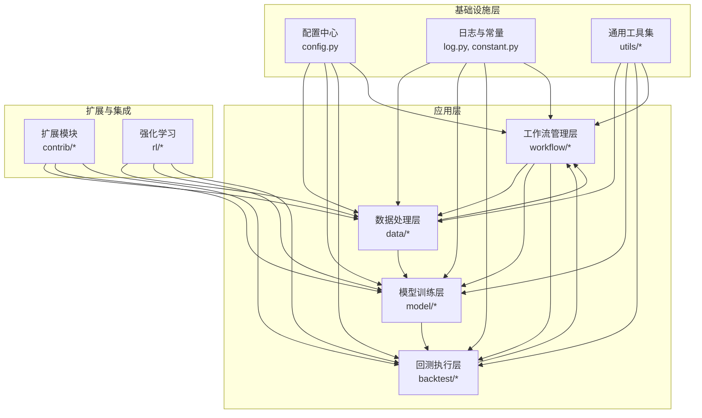
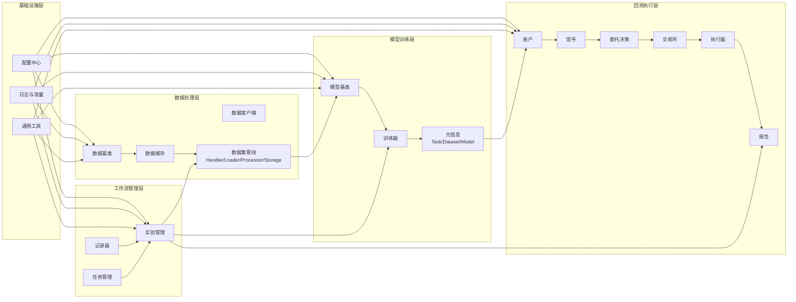
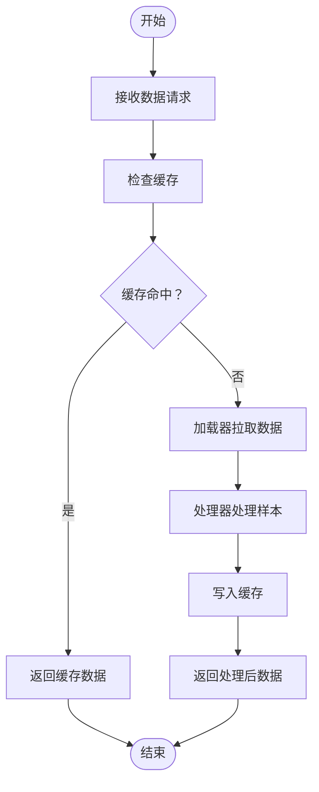
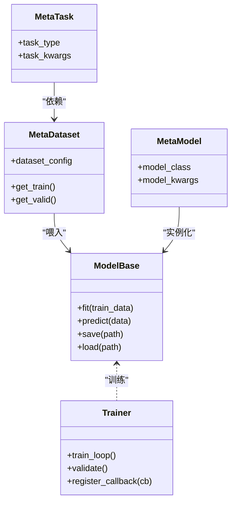
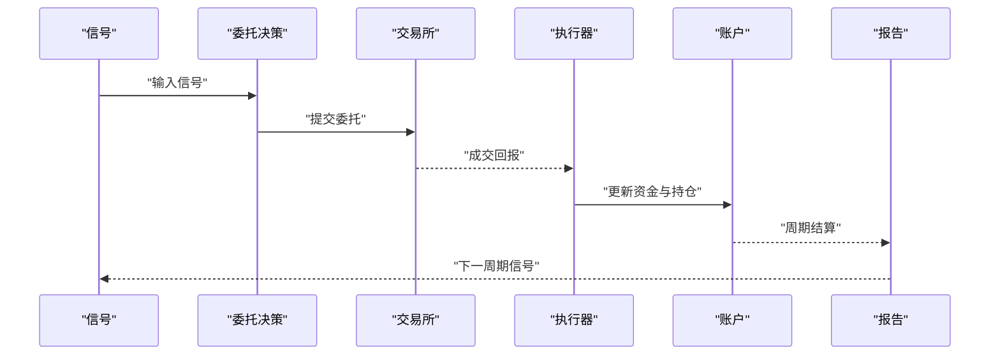
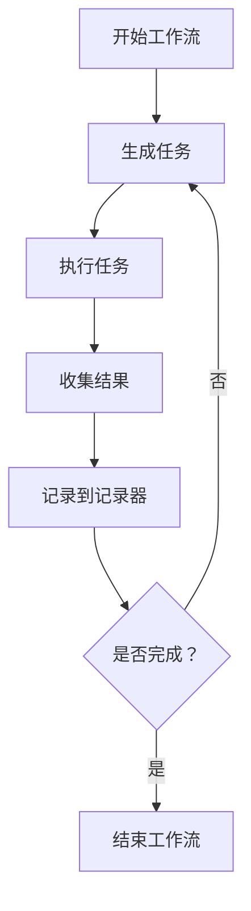
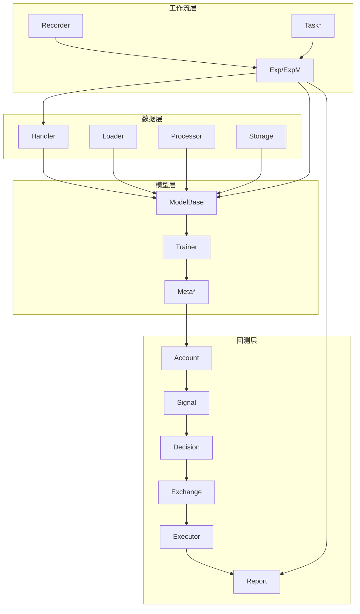

# 分层架构设计

<cite>
**本文引用的文件**
- [qlib/__init__.py](file://qlib/__init__.py)
- [qlib/config.py](file://qlib/config.py)
- [qlib/data/__init__.py](file://qlib/data/__init__.py)
- [qlib/model/__init__.py](file://qlib/model/__init__.py)
- [qlib/workflow/__init__.py](file://qlib/workflow/__init__.py)
- [qlib/backtest/__init__.py](file://qlib/backtest/__init__.py)
- [qlib/data/dataset/__init__.py](file://qlib/data/dataset/__init__.py)
- [qlib/data/dataset/handler.py](file://qlib/data/dataset/handler.py)
- [qlib/data/dataset/loader.py](file://qlib/data/dataset/loader.py)
- [qlib/data/dataset/processor.py](file://qlib/data/dataset/processor.py)
- [qlib/data/dataset/storage.py](file://qlib/data/dataset/storage.py)
- [qlib/data/base.py](file://qlib/data/base.py)
- [qlib/data/cache.py](file://qlib/data/cache.py)
- [qlib/data/client.py](file://qlib/data/client.py)
- [qlib/data/data.py](file://qlib/data/data.py)
- [qlib/model/base.py](file://qlib/model/base.py)
- [qlib/model/trainer.py](file://qlib/model/trainer.py)
- [qlib/model/meta/__init__.py](file://qlib/model/meta/__init__.py)
- [qlib/model/meta/dataset.py](file://qlib/model/meta/dataset.py)
- [qlib/model/meta/model.py](file://qlib/model/meta/model.py)
- [qlib/model/meta/task.py](file://qlib/model/meta/task.py)
- [qlib/backtest/backtest.py](file://qlib/backtest/backtest.py)
- [qlib/backtest/account.py](file://qlib/backtest/account.py)
- [qlib/backtest/decision.py](file://qlib/backtest/decision.py)
- [qlib/backtest/exchange.py](file://qlib/backtest/exchange.py)
- [qlib/backtest/executor.py](file://qlib/backtest/executor.py)
- [qlib/backtest/report.py](file://qlib/backtest/report.py)
- [qlib/backtest/signal.py](file://qlib/backtest/signal.py)
- [qlib/workflow/exp.py](file://qlib/workflow/exp.py)
- [qlib/workflow/expm.py](file://qlib/workflow/expm.py)
- [qlib/workflow/recorder.py](file://qlib/workflow/recorder.py)
- [qlib/workflow/utils.py](file://qlib/workflow/utils.py)
- [qlib/workflow/task/manage.py](file://qlib/workflow/task/manage.py)
- [qlib/workflow/task/gen.py](file://qlib/workflow/task/gen.py)
- [qlib/workflow/task/collect.py](file://qlib/workflow/task/collect.py)
- [qlib/contrib/online/manager.py](file://qlib/contrib/online/manager.py)
- [qlib/contrib/online/operator.py](file://qlib/contrib/online/operator.py)
- [qlib/contrib/online/user.py](file://qlib/contrib/online/user.py)
- [qlib/contrib/online/online_model.py](file://qlib/contrib/online/online_model.py)
- [qlib/contrib/tuner/tuner.py](file://qlib/contrib/tuner/tuner.py)
- [qlib/contrib/tuner/pipeline.py](file://qlib/contrib/tuner/pipeline.py)
- [qlib/contrib/tuner/launcher.py](file://qlib/contrib/tuner/launcher.py)
- [qlib/contrib/tuner/space.py](file://qlib/contrib/tuner/space.py)
- [qlib/contrib/tuner/config.py](file://qlib/contrib/tuner/config.py)
- [qlib/contrib/strategy/order_generator.py](file://qlib/contrib/strategy/order_generator.py)
- [qlib/contrib/strategy/cost_control.py](file://qlib/contrib/strategy/cost_control.py)
- [qlib/contrib/strategy/rule_strategy.py](file://qlib/contrib/strategy/rule_strategy.py)
- [qlib/contrib/strategy/signal_strategy.py](file://qlib/contrib/strategy/signal_strategy.py)
- [qlib/contrib/strategy/optimizer/optimizer.py](file://qlib/contrib/strategy/optimizer/optimizer.py)
- [qlib/contrib/strategy/optimizer/enhanced_indexing.py](file://qlib/contrib/strategy/optimizer/enhanced_indexing.py)
- [qlib/contrib/strategy/optimizer/base.py](file://qlib/contrib/strategy/optimizer/base.py)
- [qlib/contrib/eva/alpha.py](file://qlib/contrib/eva/alpha.py)
- [qlib/contrib/rolling/base.py](file://qlib/contrib/rolling/base.py)
- [qlib/contrib/rolling/ddgda.py](file://qlib/contrib/rolling/ddgda.py)
- [qlib/contrib/rolling/__main__.py](file://qlib/contrib/rolling/__main__.py)
- [qlib/contrib/meta/data_selection/dataset.py](file://qlib/contrib/meta/data_selection/dataset.py)
- [qlib/contrib/meta/data_selection/model.py](file://qlib/contrib/meta/data_selection/model.py)
- [qlib/contrib/meta/data_selection/net.py](file://qlib/contrib/meta/data_selection/net.py)
- [qlib/contrib/meta/data_selection/utils.py](file://qlib/contrib/meta/data_selection/utils.py)
- [qlib/contrib/meta/data_selection/__init__.py](file://qlib/contrib/meta/data_selection/__init__.py)
- [qlib/contrib/ops/high_freq.py](file://qlib/contrib/ops/high_freq.py)
- [qlib/contrib/evaluate.py](file://qlib/contrib/evaluate.py)
- [qlib/contrib/evaluate_portfolio.py](file://qlib/contrib/evaluate_portfolio.py)
- [qlib/contrib/data/data.py](file://qlib/contrib/data/data.py)
- [qlib/contrib/data/handler.py](file://qlib/contrib/data/handler.py)
- [qlib/contrib/data/processor.py](file://qlib/contrib/data/processor.py)
- [qlib/contrib/data/highfreq_handler.py](file://qlib/contrib/data/highfreq_handler.py)
- [qlib/contrib/data/highfreq_processor.py](file://qlib/contrib/data/highfreq_processor.py)
- [qlib/contrib/data/highfreq_provider.py](file://qlib/contrib/data/highfreq_provider.py)
- [qlib/contrib/data/loader.py](file://qlib/contrib/data/loader.py)
- [qlib/contrib/data/dataset.py](file://qlib/contrib/data/dataset.py)
- [qlib/contrib/data/utils/sepdf.py](file://qlib/contrib/data/utils/sepdf.py)
- [qlib/contrib/model/catboost_model.py](file://qlib/contrib/model/catboost_model.py)
- [qlib/contrib/model/gbdt.py](file://qlib/contrib/model/gbdt.py)
- [qlib/contrib/model/linear.py](file://qlib/contrib/model/linear.py)
- [qlib/contrib/model/xgboost.py](file://qlib/contrib/model/xgboost.py)
- [qlib/contrib/model/pytorch_general_nn.py](file://qlib/contrib/model/pytorch_general_nn.py)
- [qlib/contrib/model/pytorch_nn.py](file://qlib/contrib/model/pytorch_nn.py)
- [qlib/contrib/model/pytorch_utils.py](file://qlib/contrib/model/pytorch_utils.py)
- [qlib/contrib/report/analysis_position/report.py](file://qlib/contrib/report/analysis_position/report.py)
- [qlib/contrib/report/analysis_position/rank_label.py](file://qlib/contrib/report/analysis_position/rank_label.py)
- [qlib/contrib/report/analysis_position/risk_analysis.py](file://qlib/contrib/report/analysis_position/risk_analysis.py)
- [qlib/contrib/report/analysis_position/score_ic.py](file://qlib/contrib/report/analysis_position/score_ic.py)
- [qlib/contrib/report/analysis_position/cumulative_return.py](file://qlib/contrib/report/analysis_position/cumulative_return.py)
- [qlib/contrib/report/analysis_position/parse_position.py](file://qlib/contrib/report/analysis_position/parse_position.py)
- [qlib/contrib/report/analysis_model/analysis_model_performance.py](file://qlib/contrib/report/analysis_model/analysis_model_performance.py)
- [qlib/contrib/report/data/base.py](file://qlib/contrib/report/data/base.py)
- [qlib/contrib/report/data/ana.py](file://qlib/contrib/report/data/ana.py)
- [qlib/contrib/report/graph.py](file://qlib/contrib/report/graph.py)
- [qlib/contrib/report/utils.py](file://qlib/contrib/report/utils.py)
- [qlib/rl/trainer/trainer.py](file://qlib/rl/trainer/trainer.py)
- [qlib/rl/trainer/api.py](file://qlib/rl/trainer/api.py)
- [qlib/rl/trainer/callbacks.py](file://qlib/rl/trainer/callbacks.py)
- [qlib/rl/trainer/vessel.py](file://qlib/rl/trainer/vessel.py)
- [qlib/rl/data/base.py](file://qlib/rl/data/base.py)
- [qlib/rl/data/native.py](file://qlib/rl/data/native.py)
- [qlib/rl/data/integration.py](file://qlib/rl/data/integration.py)
- [qlib/rl/data/pickle_styled.py](file://qlib/rl/data/pickle_styled.py)
- [qlib/rl/order_execution/state.py](file://qlib/rl/order_execution/state.py)
- [qlib/rl/order_execution/reward.py](file://qlib/rl/order_execution/reward.py)
- [qlib/rl/order_execution/simulator_qlib.py](file://qlib/rl/order_execution/simulator_qlib.py)
- [qlib/rl/order_execution/simulator_simple.py](file://qlib/rl/order_execution/simulator_simple.py)
- [qlib/rl/order_execution/network.py](file://qlib/rl/order_execution/network.py)
- [qlib/rl/order_execution/policy.py](file://qlib/rl/order_execution/policy.py)
- [qlib/rl/order_execution/strategy.py](file://qlib/rl/order_execution/strategy.py)
- [qlib/rl/order_execution/interpreter.py](file://qlib/rl/order_execution/interpreter.py)
- [qlib/rl/order_execution/utils.py](file://qlib/rl/order_execution/utils.py)
- [qlib/rl/simulator.py](file://qlib/rl/simulator.py)
- [qlib/rl/aux_info.py](file://qlib/rl/aux_info.py)
- [qlib/rl/reward.py](file://qlib/rl/reward.py)
- [qlib/rl/seed.py](file://qlib/rl/seed.py)
- [qlib/rl/utils/data_queue.py](file://qlib/rl/utils/data_queue.py)
- [qlib/rl/utils/env_wrapper.py](file://qlib/rl/utils/env_wrapper.py)
- [qlib/rl/utils/finite_env.py](file://qlib/rl/utils/finite_env.py)
- [qlib/rl/utils/log.py](file://qlib/rl/utils/log.py)
- [qlib/rl/strategy/single_order.py](file://qlib/rl/strategy/single_order.py)
- [qlib/rl/contrib/backtest.py](file://qlib/rl/contrib/backtest.py)
- [qlib/rl/contrib/train_onpolicy.py](file://qlib/rl/contrib/train_onpolicy.py)
- [qlib/rl/contrib/naive_config_parser.py](file://qlib/rl/contrib/naive_config_parser.py)
- [qlib/rl/contrib/utils.py](file://qlib/rl/contrib/utils.py)
- [qlib/utils/mod.py](file://qlib/utils/mod.py)
- [qlib/utils/exceptions.py](file://qlib/utils/exceptions.py)
- [qlib/utils/file.py](file://qlib/utils/file.py)
- [qlib/utils/objm.py](file://qlib/utils/objm.py)
- [qlib/utils/paral.py](file://qlib/utils/paral.py)
- [qlib/utils/pickle_utils.py](file://qlib/utils/pickle_utils.py)
- [qlib/utils/resam.py](file://qlib/utils/resam.py)
- [qlib/utils/serial.py](file://qlib/utils/serial.py)
- [qlib/utils/time.py](file://qlib/utils/time.py)
- [qlib/utils/data.py](file://qlib/utils/data.py)
- [qlib/utils/index_data.py](file://qlib/utils/index_data.py)
- [qlib/utils/__init__.py](file://qlib/utils/__init__.py)
- [qlib/constant.py](file://qlib/constant.py)
- [qlib/log.py](file://qlib/log.py)
- [qlib/typehint.py](file://qlib/typehint.py)
</cite>

## 目录
1. [引言](#引言)
2. [项目结构](#项目结构)
3. [核心组件](#核心组件)
4. [架构总览](#架构总览)
5. [详细组件分析](#详细组件分析)
6. [依赖分析](#依赖分析)
7. [性能考虑](#性能考虑)
8. [故障排查指南](#故障排查指南)
9. [结论](#结论)
10. [附录](#附录)

## 引言
本文件系统化梳理 Qlib 的分层架构设计，明确基础设施层、数据处理层、模型训练层、回测执行层与工作流管理层的职责边界、接口契约与交互方式。通过对各层内部模块、外部依赖与数据流的深入分析，总结分层带来的职责分离、可测试性与可维护性优势，并给出层间解耦技术与接口设计原则，以支撑系统的可扩展性与可演进性。

## 项目结构
Qlib 采用“按功能域分层 + 按子系统聚合”的组织方式：顶层模块（data、model、backtest、workflow）构成主要业务层；底层模块（utils、config、log、constant）提供通用能力；contrib 子目录承载第三方扩展与实验性能力；examples 展示典型流水线配置与用法。

图表来源
- [qlib/__init__.py](file://qlib/__init__.py)
- [qlib/config.py](file://qlib/config.py)
- [qlib/data/__init__.py](file://qlib/data/__init__.py)
- [qlib/model/__init__.py](file://qlib/model/__init__.py)
- [qlib/backtest/__init__.py](file://qlib/backtest/__init__.py)
- [qlib/workflow/__init__.py](file://qlib/workflow/__init__.py)
- [qlib/utils/__init__.py](file://qlib/utils/__init__.py)
- [qlib/log.py](file://qlib/log.py)
- [qlib/constant.py](file://qlib/constant.py)

章节来源
- [qlib/__init__.py](file://qlib/__init__.py)
- [qlib/config.py](file://qlib/config.py)
- [qlib/utils/__init__.py](file://qlib/utils/__init__.py)

## 核心组件
- 基础设施层
  - 配置中心：集中管理运行时参数、路径与默认值，为上层提供统一入口。
  - 日志与常量：提供日志记录与全局常量，确保跨模块一致的行为与标识。
  - 通用工具：封装序列化、并行、索引、时间等通用能力，降低重复实现。
- 数据处理层
  - 数据集抽象：Handler/Loader/Processor/Storage 组成数据管线，支持多源接入与缓存。
  - 数据基类与客户端：统一数据访问接口与缓存策略。
- 模型训练层
  - 训练器与元信息：Trainer 提供训练生命周期管理；Meta 子模块抽象任务、数据集与模型。
  - 贡献模型：CatBoost、LightGBM/XGBoost、PyTorch 系列等实现。
- 回测执行层
  - 账户、信号、委托、交易所、执行器与报告：构建完整的交易仿真闭环。
- 工作流管理层
  - 实验与记录：Exp/Expm 管理实验生命周期；Recorder 记录结果；Task 管理任务生成与收集。
- 扩展与集成
  - Online 在线策略与模型更新；Tuner 超参搜索；RL 强化学习框架与订单执行策略；Contrib 报告与评估工具。

章节来源
- [qlib/config.py](file://qlib/config.py)
- [qlib/log.py](file://qlib/log.py)
- [qlib/constant.py](file://qlib/constant.py)
- [qlib/utils/__init__.py](file://qlib/utils/__init__.py)
- [qlib/data/base.py](file://qlib/data/base.py)
- [qlib/data/cache.py](file://qlib/data/cache.py)
- [qlib/data/client.py](file://qlib/data/client.py)
- [qlib/data/data.py](file://qlib/data/data.py)
- [qlib/data/dataset/handler.py](file://qlib/data/dataset/handler.py)
- [qlib/data/dataset/loader.py](file://qlib/data/dataset/loader.py)
- [qlib/data/dataset/processor.py](file://qlib/data/dataset/processor.py)
- [qlib/data/dataset/storage.py](file://qlib/data/dataset/storage.py)
- [qlib/model/base.py](file://qlib/model/base.py)
- [qlib/model/trainer.py](file://qlib/model/trainer.py)
- [qlib/model/meta/__init__.py](file://qlib/model/meta/__init__.py)
- [qlib/model/meta/dataset.py](file://qlib/model/meta/dataset.py)
- [qlib/model/meta/model.py](file://qlib/model/meta/model.py)
- [qlib/model/meta/task.py](file://qlib/model/meta/task.py)
- [qlib/backtest/backtest.py](file://qlib/backtest/backtest.py)
- [qlib/backtest/account.py](file://qlib/backtest/account.py)
- [qlib/backtest/decision.py](file://qlib/backtest/decision.py)
- [qlib/backtest/exchange.py](file://qlib/backtest/exchange.py)
- [qlib/backtest/executor.py](file://qlib/backtest/executor.py)
- [qlib/backtest/report.py](file://qlib/backtest/report.py)
- [qlib/backtest/signal.py](file://qlib/backtest/signal.py)
- [qlib/workflow/exp.py](file://qlib/workflow/exp.py)
- [qlib/workflow/expm.py](file://qlib/workflow/expm.py)
- [qlib/workflow/recorder.py](file://qlib/workflow/recorder.py)
- [qlib/workflow/utils.py](file://qlib/workflow/utils.py)
- [qlib/workflow/task/manage.py](file://qlib/workflow/task/manage.py)
- [qlib/workflow/task/gen.py](file://qlib/workflow/task/gen.py)
- [qlib/workflow/task/collect.py](file://qlib/workflow/task/collect.py)

## 架构总览
下图展示从数据到回测再到工作流的整体调用链路与分层职责：

图表来源
- [qlib/config.py](file://qlib/config.py)
- [qlib/log.py](file://qlib/log.py)
- [qlib/constant.py](file://qlib/constant.py)
- [qlib/utils/__init__.py](file://qlib/utils/__init__.py)
- [qlib/data/base.py](file://qlib/data/base.py)
- [qlib/data/cache.py](file://qlib/data/cache.py)
- [qlib/data/dataset/handler.py](file://qlib/data/dataset/handler.py)
- [qlib/data/dataset/loader.py](file://qlib/data/dataset/loader.py)
- [qlib/data/dataset/processor.py](file://qlib/data/dataset/processor.py)
- [qlib/data/dataset/storage.py](file://qlib/data/dataset/storage.py)
- [qlib/model/base.py](file://qlib/model/base.py)
- [qlib/model/trainer.py](file://qlib/model/trainer.py)
- [qlib/model/meta/task.py](file://qlib/model/meta/task.py)
- [qlib/backtest/account.py](file://qlib/backtest/account.py)
- [qlib/backtest/signal.py](file://qlib/backtest/signal.py)
- [qlib/backtest/decision.py](file://qlib/backtest/decision.py)
- [qlib/backtest/exchange.py](file://qlib/backtest/exchange.py)
- [qlib/backtest/executor.py](file://qlib/backtest/executor.py)
- [qlib/backtest/report.py](file://qlib/backtest/report.py)
- [qlib/workflow/exp.py](file://qlib/workflow/exp.py)
- [qlib/workflow/recorder.py](file://qlib/workflow/recorder.py)
- [qlib/workflow/task/manage.py](file://qlib/workflow/task/manage.py)

## 详细组件分析

### 基础设施层
- 配置中心
  - 职责：集中管理运行参数、默认路径、环境变量与全局开关。
  - 接口：提供读取与覆盖配置的能力，被数据、模型、回测与工作流模块在初始化阶段消费。
  - 依赖：被所有上层模块间接依赖，形成单点配置入口。
- 日志与常量
  - 职责：统一日志格式与级别；提供全局常量（如市场状态、时间粒度等）。
  - 接口：日志函数、常量枚举；被各模块直接导入使用。
- 通用工具
  - 职责：序列化、并行、索引、时间、对象管理等通用能力。
  - 接口：工具函数与上下文管理器；被数据、模型、回测与工作流复用。

章节来源
- [qlib/config.py](file://qlib/config.py)
- [qlib/log.py](file://qlib/log.py)
- [qlib/constant.py](file://qlib/constant.py)
- [qlib/utils/__init__.py](file://qlib/utils/__init__.py)

### 数据处理层
- 数据集管线
  - Handler：定义数据加载与预处理协议，屏蔽数据源差异。
  - Loader：负责从存储或远端拉取数据，支持增量与缓存。
  - Processor：对样本进行特征工程、标准化、缺失值处理等。
  - Storage：抽象存储接口，支持本地文件、远程对象存储等。
- 数据基类与客户端
  - Base：定义数据访问的统一接口与生命周期。
  - Client：面向用户的数据访问入口，封装缓存与并发。
  - Cache：内存/磁盘缓存策略，提升重复访问性能。
- 关键流程
  - 数据请求 → 客户端 → 缓存命中判定 → 加载器 → 处理器 → 返回样本。
  - 支持多频数据、高阶因子与高频场景的扩展。

图表来源
- [qlib/data/cache.py](file://qlib/data/cache.py)
- [qlib/data/dataset/loader.py](file://qlib/data/dataset/loader.py)
- [qlib/data/dataset/processor.py](file://qlib/data/dataset/processor.py)
- [qlib/data/dataset/storage.py](file://qlib/data/dataset/storage.py)
- [qlib/data/base.py](file://qlib/data/base.py)
- [qlib/data/client.py](file://qlib/data/client.py)

章节来源
- [qlib/data/base.py](file://qlib/data/base.py)
- [qlib/data/cache.py](file://qlib/data/cache.py)
- [qlib/data/client.py](file://qlib/data/client.py)
- [qlib/data/data.py](file://qlib/data/data.py)
- [qlib/data/dataset/__init__.py](file://qlib/data/dataset/__init__.py)
- [qlib/data/dataset/handler.py](file://qlib/data/dataset/handler.py)
- [qlib/data/dataset/loader.py](file://qlib/data/dataset/loader.py)
- [qlib/data/dataset/processor.py](file://qlib/data/dataset/processor.py)
- [qlib/data/dataset/storage.py](file://qlib/data/dataset/storage.py)

### 模型训练层
- 模型基类与训练器
  - Base：定义模型抽象接口（训练、预测、保存/加载）。
  - Trainer：封装训练循环、验证、早停、回调与分布式训练。
  - Meta：Task/Dataset/Model 的元信息抽象，支撑工作流编排。
- 贡献模型
  - CatBoost、LightGBM/XGBoost、PyTorch 系列等，遵循统一接口，便于替换与组合。
- 元信息驱动
  - 通过 Task 描述任务类型与参数；Dataset 描述数据集切分与采样；Model 描述具体算法实现。

图表来源
- [qlib/model/base.py](file://qlib/model/base.py)
- [qlib/model/trainer.py](file://qlib/model/trainer.py)
- [qlib/model/meta/task.py](file://qlib/model/meta/task.py)
- [qlib/model/meta/dataset.py](file://qlib/model/meta/dataset.py)
- [qlib/model/meta/model.py](file://qlib/model/meta/model.py)

章节来源
- [qlib/model/base.py](file://qlib/model/base.py)
- [qlib/model/trainer.py](file://qlib/model/trainer.py)
- [qlib/model/meta/__init__.py](file://qlib/model/meta/__init__.py)
- [qlib/model/meta/dataset.py](file://qlib/model/meta/dataset.py)
- [qlib/model/meta/model.py](file://qlib/model/meta/model.py)
- [qlib/model/meta/task.py](file://qlib/model/meta/task.py)

### 回测执行层
- 回测闭环
  - Account：账户资金、持仓与费用管理。
  - Signal：模型输出的信号（方向与规模）。
  - Decision：基于策略规则生成委托指令。
  - Exchange：模拟撮合与滑点/手续费。
  - Executor：执行委托并更新账户。
  - Report：生成收益曲线、IC、最大回撤等指标。
- 流程时序
  - 信号 → 决策 → 撮合 → 执行 → 报告 → 下一周期。

图表来源
- [qlib/backtest/signal.py](file://qlib/backtest/signal.py)
- [qlib/backtest/decision.py](file://qlib/backtest/decision.py)
- [qlib/backtest/exchange.py](file://qlib/backtest/exchange.py)
- [qlib/backtest/executor.py](file://qlib/backtest/executor.py)
- [qlib/backtest/account.py](file://qlib/backtest/account.py)
- [qlib/backtest/report.py](file://qlib/backtest/report.py)
- [qlib/backtest/backtest.py](file://qlib/backtest/backtest.py)

章节来源
- [qlib/backtest/backtest.py](file://qlib/backtest/backtest.py)
- [qlib/backtest/account.py](file://qlib/backtest/account.py)
- [qlib/backtest/decision.py](file://qlib/backtest/decision.py)
- [qlib/backtest/exchange.py](file://qlib/backtest/exchange.py)
- [qlib/backtest/executor.py](file://qlib/backtest/executor.py)
- [qlib/backtest/report.py](file://qlib/backtest/report.py)
- [qlib/backtest/signal.py](file://qlib/backtest/signal.py)

### 工作流管理层
- 实验与记录
  - Exp/ExpM：实验生命周期管理（准备、执行、清理），支持并行与资源隔离。
  - Recorder：持久化实验结果（指标、模型、中间产物）。
- 任务管理
  - 生成、收集与调度：将复杂实验拆分为可复用的任务单元，支持依赖与并行。
- 与上层协作
  - 数据：通过 Dataset/Loader 获取训练/回测数据。
  - 模型：通过 Trainer/Meta 驱动训练与推理。
  - 回测：通过 Backtest 执行仿真交易并产出报告。

图表来源
- [qlib/workflow/exp.py](file://qlib/workflow/exp.py)
- [qlib/workflow/expm.py](file://qlib/workflow/expm.py)
- [qlib/workflow/recorder.py](file://qlib/workflow/recorder.py)
- [qlib/workflow/task/gen.py](file://qlib/workflow/task/gen.py)
- [qlib/workflow/task/manage.py](file://qlib/workflow/task/manage.py)
- [qlib/workflow/task/collect.py](file://qlib/workflow/task/collect.py)
- [qlib/workflow/utils.py](file://qlib/workflow/utils.py)

章节来源
- [qlib/workflow/exp.py](file://qlib/workflow/exp.py)
- [qlib/workflow/expm.py](file://qlib/workflow/expm.py)
- [qlib/workflow/recorder.py](file://qlib/workflow/recorder.py)
- [qlib/workflow/utils.py](file://qlib/workflow/utils.py)
- [qlib/workflow/task/manage.py](file://qlib/workflow/task/manage.py)
- [qlib/workflow/task/gen.py](file://qlib/workflow/task/gen.py)
- [qlib/workflow/task/collect.py](file://qlib/workflow/task/collect.py)

### 扩展与集成（在线、超参、RL、报告）
- 在线策略与模型
  - Manager/Operator/User/OnlineModel：支持在线数据接入、模型热更新与策略迭代。
- 超参搜索
  - Tuner/Pipeline/Launcher/Space/Config：提供搜索空间、调度与记录。
- 强化学习
  - 训练器、数据适配、订单执行策略与仿真器：支持策略学习与回测。
- 报告与评估
  - Position/Model 性能分析、风险与收益分解、可视化图谱。

章节来源
- [qlib/contrib/online/manager.py](file://qlib/contrib/online/manager.py)
- [qlib/contrib/online/operator.py](file://qlib/contrib/online/operator.py)
- [qlib/contrib/online/user.py](file://qlib/contrib/online/user.py)
- [qlib/contrib/online/online_model.py](file://qlib/contrib/online/online_model.py)
- [qlib/contrib/tuner/tuner.py](file://qlib/contrib/tuner/tuner.py)
- [qlib/contrib/tuner/pipeline.py](file://qlib/contrib/tuner/pipeline.py)
- [qlib/contrib/tuner/launcher.py](file://qlib/contrib/tuner/launcher.py)
- [qlib/contrib/tuner/space.py](file://qlib/contrib/tuner/space.py)
- [qlib/contrib/tuner/config.py](file://qlib/contrib/tuner/config.py)
- [qlib/rl/trainer/trainer.py](file://qlib/rl/trainer/trainer.py)
- [qlib/rl/data/base.py](file://qlib/rl/data/base.py)
- [qlib/rl/order_execution/strategy.py](file://qlib/rl/order_execution/strategy.py)
- [qlib/contrib/report/analysis_position/report.py](file://qlib/contrib/report/analysis_position/report.py)
- [qlib/contrib/report/analysis_model/analysis_model_performance.py](file://qlib/contrib/report/analysis_model/analysis_model_performance.py)

## 依赖分析
- 层内高内聚
  - 数据层内部通过 Handler/Loader/Processor/Storage 形成稳定的数据管道；模型层通过 Trainer 与 Meta 解耦算法实现与任务编排。
- 层间低耦合
  - 上层仅依赖下层暴露的抽象接口，避免直接依赖具体实现；例如回测不关心数据源类型，只依赖统一的数据接口。
- 可替换性
  - 不同存储实现、不同模型算法、不同回测规则均可通过接口替换，保持上层不变。

图表来源
- [qlib/data/dataset/handler.py](file://qlib/data/dataset/handler.py)
- [qlib/data/dataset/loader.py](file://qlib/data/dataset/loader.py)
- [qlib/data/dataset/processor.py](file://qlib/data/dataset/processor.py)
- [qlib/data/dataset/storage.py](file://qlib/data/dataset/storage.py)
- [qlib/model/base.py](file://qlib/model/base.py)
- [qlib/model/trainer.py](file://qlib/model/trainer.py)
- [qlib/model/meta/__init__.py](file://qlib/model/meta/__init__.py)
- [qlib/backtest/account.py](file://qlib/backtest/account.py)
- [qlib/backtest/signal.py](file://qlib/backtest/signal.py)
- [qlib/backtest/decision.py](file://qlib/backtest/decision.py)
- [qlib/backtest/exchange.py](file://qlib/backtest/exchange.py)
- [qlib/backtest/executor.py](file://qlib/backtest/executor.py)
- [qlib/backtest/report.py](file://qlib/backtest/report.py)
- [qlib/workflow/exp.py](file://qlib/workflow/exp.py)
- [qlib/workflow/recorder.py](file://qlib/workflow/recorder.py)
- [qlib/workflow/task/manage.py](file://qlib/workflow/task/manage.py)

章节来源
- [qlib/data/dataset/handler.py](file://qlib/data/dataset/handler.py)
- [qlib/data/dataset/loader.py](file://qlib/data/dataset/loader.py)
- [qlib/data/dataset/processor.py](file://qlib/data/dataset/processor.py)
- [qlib/data/dataset/storage.py](file://qlib/data/dataset/storage.py)
- [qlib/model/base.py](file://qlib/model/base.py)
- [qlib/model/trainer.py](file://qlib/model/trainer.py)
- [qlib/model/meta/__init__.py](file://qlib/model/meta/__init__.py)
- [qlib/backtest/account.py](file://qlib/backtest/account.py)
- [qlib/backtest/signal.py](file://qlib/backtest/signal.py)
- [qlib/backtest/decision.py](file://qlib/backtest/decision.py)
- [qlib/backtest/exchange.py](file://qlib/backtest/exchange.py)
- [qlib/backtest/executor.py](file://qlib/backtest/executor.py)
- [qlib/backtest/report.py](file://qlib/backtest/report.py)
- [qlib/workflow/exp.py](file://qlib/workflow/exp.py)
- [qlib/workflow/recorder.py](file://qlib/workflow/recorder.py)
- [qlib/workflow/task/manage.py](file://qlib/workflow/task/manage.py)

## 性能考虑
- 数据缓存与并行
  - 使用缓存减少重复 IO；利用并行工具提升批处理效率。
- 训练加速
  - Trainer 支持分布式与回调优化；Meta 任务拆分与流水线并行。
- 回测优化
  - 高频数据的高性能数据结构与批量撮合策略；合理设置滑点与手续费以平衡真实感与性能。
- 可观测性
  - 通过 Recorder 与日志体系记录关键指标，辅助性能分析与瓶颈定位。

## 故障排查指南
- 配置问题
  - 检查配置项是否正确加载；确认路径与权限；核对默认值覆盖逻辑。
- 数据异常
  - 核查缓存一致性、Loader 的数据完整性与 Processor 的异常样本过滤。
- 训练失败
  - 查看 Trainer 回调日志与早停条件；确认 Meta 任务参数与数据集划分。
- 回测偏差
  - 对比信号生成、委托决策与执行器设置；检查滑点/手续费参数与报告统计口径。
- 工作流中断
  - 检查任务生成与收集的依赖关系；确认记录器写入权限与磁盘空间。

章节来源
- [qlib/config.py](file://qlib/config.py)
- [qlib/data/cache.py](file://qlib/data/cache.py)
- [qlib/data/dataset/loader.py](file://qlib/data/dataset/loader.py)
- [qlib/data/dataset/processor.py](file://qlib/data/dataset/processor.py)
- [qlib/model/trainer.py](file://qlib/model/trainer.py)
- [qlib/backtest/executor.py](file://qlib/backtest/executor.py)
- [qlib/workflow/recorder.py](file://qlib/workflow/recorder.py)
- [qlib/utils/exceptions.py](file://qlib/utils/exceptions.py)

## 结论
Qlib 的分层架构通过清晰的职责划分与稳定的接口契约，实现了从数据到回测再到工作流的顺畅流转。基础设施层提供统一配置与工具，数据层抽象多源接入与缓存，模型层以元信息驱动训练，回测层构建完整仿真闭环，工作流层编排实验与任务。该设计提升了系统的可测试性、可维护性与可扩展性，便于在不破坏上层的前提下替换底层实现，并支持持续演进。

## 附录
- 接口设计原则
  - 单一职责：每层仅暴露必要接口，避免“上帝对象”。
  - 开闭原则：对扩展开放，对修改关闭；通过接口与工厂模式替换实现。
  - 依赖倒置：上层依赖抽象，下层实现具体细节。
- 层间解耦技术
  - 抽象接口与工厂：通过统一接口屏蔽实现差异。
  - 事件与回调：通过 Trainer/RL 训练器回调与工作流回调解耦流程控制。
  - 中介者与记录器：通过 Recorder 与任务管理器协调多模块协作。