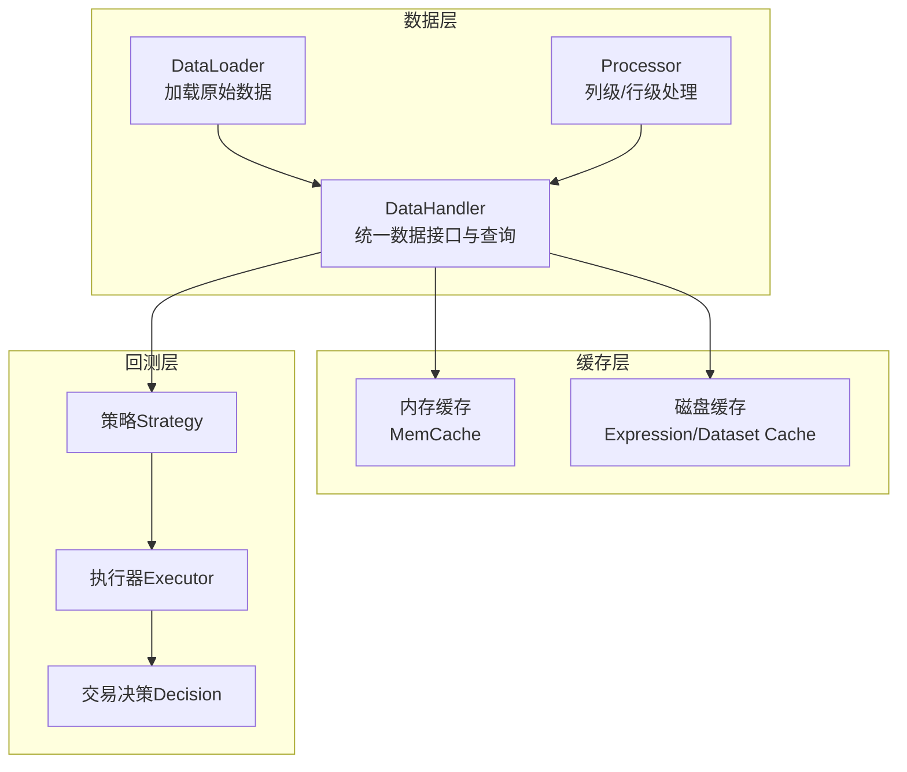
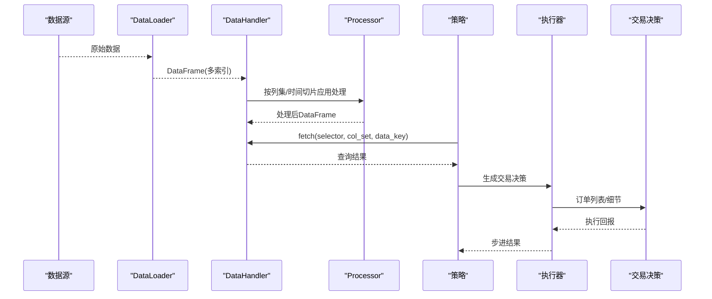
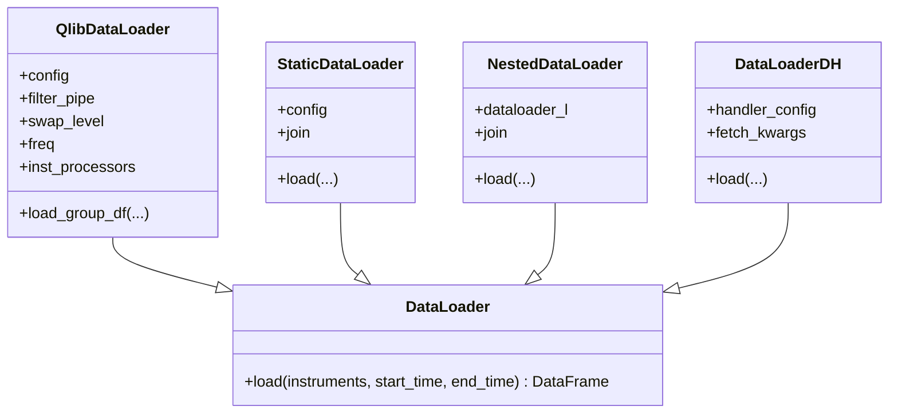
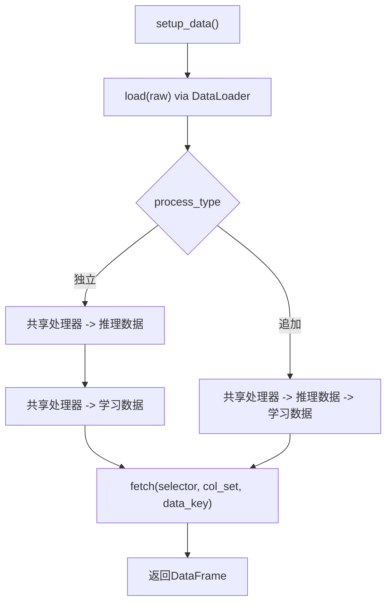
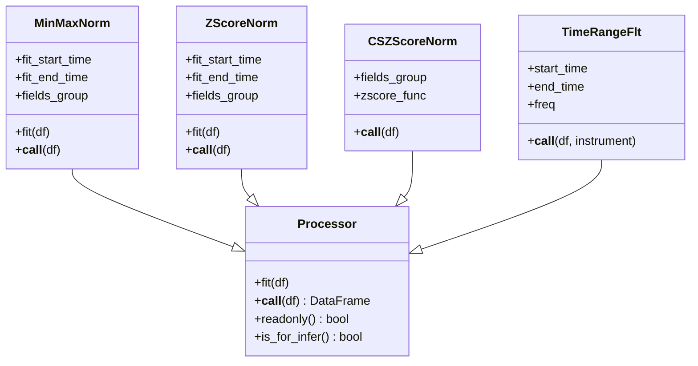
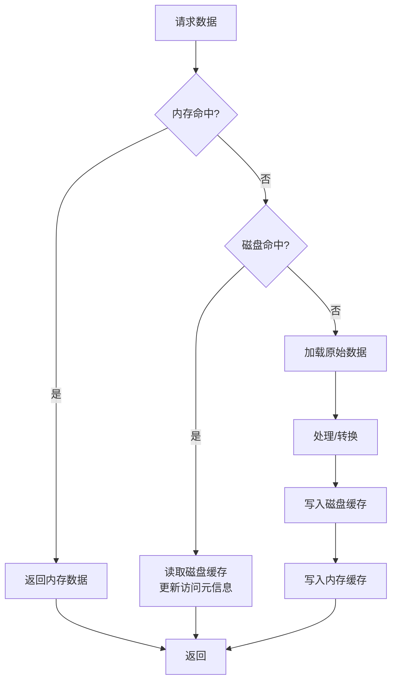
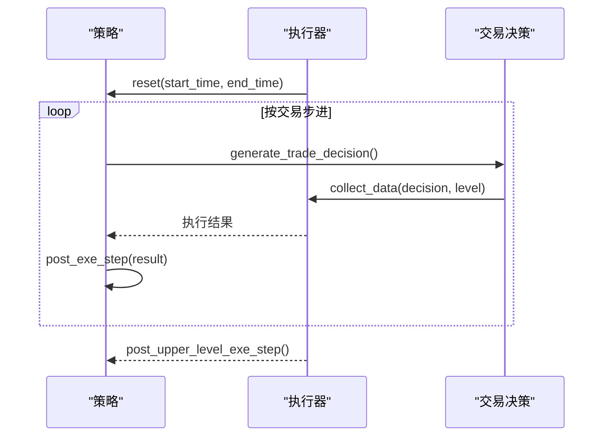
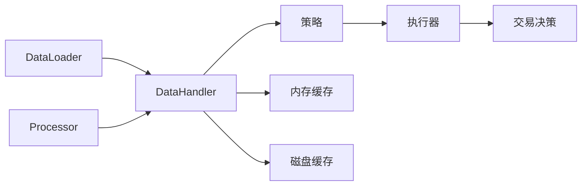

# 数据流分析

<cite>
**本文引用的文件**
- [loader.py](file://qlib/data/dataset/loader.py)
- [handler.py](file://qlib/data/dataset/handler.py)
- [processor.py](file://qlib/data/dataset/processor.py)
- [cache.py](file://qlib/data/cache.py)
- [backtest.py](file://qlib/backtest/backtest.py)
- [decision.py](file://qlib/backtest/decision.py)
- [highfreq_handler.py](file://qlib/contrib/data/highfreq_handler.py)
- [data_cache_demo.py](file://examples/data_demo/data_cache_demo.py)
- [README.md](file://examples/rolling_process_data/README.md)
- [qlib_Alpha158.py](file://examples/benchmarks/TFT/data_formatters/qlib_Alpha158.py)
- [gen_training_orders.py](file://examples/rl_order_execution/scripts/gen_training_orders.py)
</cite>

## 目录
1. [引言](#引言)
2. [项目结构](#项目结构)
3. [核心组件](#核心组件)
4. [架构总览](#架构总览)
5. [详细组件分析](#详细组件分析)
6. [依赖分析](#依赖分析)
7. [性能考量](#性能考量)
8. [故障排查指南](#故障排查指南)
9. [结论](#结论)
10. [附录](#附录)

## 引言
本文件面向Qlib的数据流分析，系统性追踪从原始数据获取到最终回测结果输出的完整链路：数据采集、预处理、特征工程、模型训练、回测执行。重点说明数据在各组件之间的传递方式（内存传递、缓存机制、持久化存储）、数据转换与格式化过程、不同数据类型（日线、分钟级、订单簿）的处理差异，并给出数据流图与处理管道图，阐述缓存策略与性能优化措施，以及数据一致性与错误处理机制。

## 项目结构
Qlib围绕“数据加载器（DataLoader）—处理器（Processor）—数据处理器（DataHandler）”三层构建数据中台，上层工作流（Dataset/Workflow）通过这些组件组合实现端到端的数据处理与回测。回测模块以策略与执行器为核心，驱动交易决策与指标产出。

图表来源
- [loader.py:18-151](file://qlib/data/dataset/loader.py#L18-L151)
- [handler.py:67-151](file://qlib/data/dataset/handler.py#L67-L151)
- [processor.py:35-92](file://qlib/data/dataset/processor.py#L35-L92)
- [cache.py:137-180](file://qlib/data/cache.py#L137-L180)
- [backtest.py:25-110](file://qlib/backtest/backtest.py#L25-L110)

章节来源
- [loader.py:18-151](file://qlib/data/dataset/loader.py#L18-L151)
- [handler.py:67-151](file://qlib/data/dataset/handler.py#L67-L151)
- [processor.py:35-92](file://qlib/data/dataset/processor.py#L35-L92)
- [cache.py:137-180](file://qlib/data/cache.py#L137-L180)
- [backtest.py:25-110](file://qlib/backtest/backtest.py#L25-L110)

## 核心组件
- 数据加载器（DataLoader）
  - 负责从底层数据源拉取原始数据，支持单组或多组字段配置、多数据源合并、静态文件加载、嵌套加载器等。
  - 关键点：字段解析、时间切片、索引交换、多数据源拼接与去重。
- 数据处理器（Processor）
  - 面向列或行的可组合处理单元，如缺失值填充、标准化、分位归一化、跨截面处理、无穷值处理等。
  - 支持拟合期控制、只读标记、推理可用性标记。
- 数据处理器（DataHandler）
  - 将DataLoader产出的DataFrame封装为统一接口，提供按时间/列集合选择、多级索引、列集切换、滚动迭代等能力。
  - 支持学习/推理双路径处理与缓存策略。
- 缓存（Cache）
  - 内存缓存（按长度或字节大小限制）与磁盘缓存（表达式/数据集缓存），配合Redis锁避免并发冲突。
- 回测（Backtest）
  - 策略生成交易决策，执行器收集数据并推进交易日历，最终汇总指标与组合度量。

章节来源
- [loader.py:18-151](file://qlib/data/dataset/loader.py#L18-L151)
- [handler.py:67-151](file://qlib/data/dataset/handler.py#L67-L151)
- [processor.py:35-92](file://qlib/data/dataset/processor.py#L35-L92)
- [cache.py:137-180](file://qlib/data/cache.py#L137-L180)
- [backtest.py:25-110](file://qlib/backtest/backtest.py#L25-L110)

## 架构总览
下图展示从原始数据到回测结果的关键数据流：数据加载器负责拉取与拼装；处理器在DataHandler层面进行特征工程；缓存层贯穿内存与磁盘；回测层以策略/执行器驱动交易并产出报告。

图表来源
- [loader.py:138-150](file://qlib/data/dataset/loader.py#L138-L150)
- [handler.py:197-326](file://qlib/data/dataset/handler.py#L197-L326)
- [processor.py:35-92](file://qlib/data/dataset/processor.py#L35-L92)
- [backtest.py:52-110](file://qlib/backtest/backtest.py#L52-L110)

## 详细组件分析

### 数据加载器（DataLoader）
- 统一接口：load(instruments, start_time, end_time) 返回DataFrame。
- 字段配置：支持列表/元组/字典形式，自动解析表达式与列名映射。
- 多组加载：当配置为字典时，按组分别加载并横向拼接。
- 特殊加载器：
  - QlibDataLoader：基于D.features，支持频率与实例处理器注入。
  - StaticDataLoader：从文件或对象加载，支持外连接拼接。
  - NestedDataLoader：多DataLoader串联，按列去重后左连接。
  - DataLoaderDH：基于DataHandler的fetch接口聚合多数据源。

图表来源
- [loader.py:18-151](file://qlib/data/dataset/loader.py#L18-L151)
- [loader.py:153-228](file://qlib/data/dataset/loader.py#L153-L228)
- [loader.py:230-289](file://qlib/data/dataset/loader.py#L230-L289)
- [loader.py:291-348](file://qlib/data/dataset/loader.py#L291-L348)
- [loader.py:350-415](file://qlib/data/dataset/loader.py#L350-L415)

章节来源
- [loader.py:18-151](file://qlib/data/dataset/loader.py#L18-L151)
- [loader.py:153-228](file://qlib/data/dataset/loader.py#L153-L228)
- [loader.py:230-289](file://qlib/data/dataset/loader.py#L230-L289)
- [loader.py:291-348](file://qlib/data/dataset/loader.py#L291-L348)
- [loader.py:350-415](file://qlib/data/dataset/loader.py#L350-L415)

### 数据处理器（DataHandler）
- 统一fetch接口：selector（时间切片/索引）、level（索引层级）、col_set（列集）、data_key（原始/推理/学习）。
- 多种数据键：
  - DK_R：原始数据
  - DK_I：推理阶段处理后的数据
  - DK_L：学习阶段处理后的数据
- 双路径处理（DataHandlerLP）：
  - 共享处理器 + 推理处理器（独立）
  - 共享处理器 + 推理处理器 + 学习处理器（追加）
- 性能提示：col_set=CS_RAW可避免不必要的复制；支持proc_func钩子在底层数据上应用处理。

图表来源
- [handler.py:436-610](file://qlib/data/dataset/handler.py#L436-L610)
- [handler.py:673-710](file://qlib/data/dataset/handler.py#L673-L710)

章节来源
- [handler.py:67-151](file://qlib/data/dataset/handler.py#L67-L151)
- [handler.py:197-326](file://qlib/data/dataset/handler.py#L197-L326)
- [handler.py:436-610](file://qlib/data/dataset/handler.py#L436-L610)
- [handler.py:673-710](file://qlib/data/dataset/handler.py#L673-L710)

### 处理器（Processor）
- 常用处理器示例：
  - 缺失值/无穷值处理：DropnaProcessor、ProcessInf、Fillna
  - 归一化/标准化：MinMaxNorm、ZScoreNorm、RobustZScoreNorm、CSZScoreNorm
  - 跨截面处理：CSRankNorm、CSZFillna
  - 列过滤/删除：FilterCol、DropCol
  - 实例级过滤：TimeRangeFlt（可能引入数据泄漏风险）
- 关键属性：
  - readonly：是否只读，避免不必要的拷贝
  - is_for_infer：是否可用于推理阶段
  - fit/fetch范围控制：严格限定拟合期不包含测试信息

图表来源
- [processor.py:35-92](file://qlib/data/dataset/processor.py#L35-L92)
- [processor.py:196-226](file://qlib/data/dataset/processor.py#L196-L226)
- [processor.py:228-259](file://qlib/data/dataset/processor.py#L228-L259)
- [processor.py:300-324](file://qlib/data/dataset/processor.py#L300-L324)
- [processor.py:383-420](file://qlib/data/dataset/processor.py#L383-L420)

章节来源
- [processor.py:35-92](file://qlib/data/dataset/processor.py#L35-L92)
- [processor.py:196-226](file://qlib/data/dataset/processor.py#L196-L226)
- [processor.py:228-259](file://qlib/data/dataset/processor.py#L228-L259)
- [processor.py:300-324](file://qlib/data/dataset/processor.py#L300-L324)
- [processor.py:383-420](file://qlib/data/dataset/processor.py#L383-L420)

### 缓存策略与持久化
- 内存缓存（MemCache）
  - 三类缓存单元：日历、股票、特征，支持长度或字节大小限制，LRU逐出。
  - 过期管理：MemCacheExpire记录访问时间与次数，超时读取失败。
- 磁盘缓存（Expression/Dataset Cache）
  - 表达式缓存：bin文件存储，带.meta元信息，Redis读写锁保护，支持增量更新。
  - 数据集缓存：HDF5存储索引，支持按时间窗口读取与字段重排。
- 使用示例
  - 通过任务配置复用已缓存的DataHandler，减少重复处理开销。

图表来源
- [cache.py:137-180](file://qlib/data/cache.py#L137-L180)
- [cache.py:490-585](file://qlib/data/cache.py#L490-L585)
- [cache.py:647-748](file://qlib/data/cache.py#L647-L748)
- [data_cache_demo.py:41-54](file://examples/data_demo/data_cache_demo.py#L41-L54)

章节来源
- [cache.py:137-180](file://qlib/data/cache.py#L137-L180)
- [cache.py:490-585](file://qlib/data/cache.py#L490-L585)
- [cache.py:647-748](file://qlib/data/cache.py#L647-L748)
- [data_cache_demo.py:41-54](file://examples/data_demo/data_cache_demo.py#L41-L54)

### 回测执行流程
- collect_data_loop：根据交易日历推进，策略生成决策，执行器收集数据并推进，最终汇总指标与组合度量。
- 交易决策（TradeDecision）：包含订单列表与明细，支持按时间范围组织。

图表来源
- [backtest.py:52-110](file://qlib/backtest/backtest.py#L52-L110)
- [decision.py:547-596](file://qlib/backtest/decision.py#L547-L596)

章节来源
- [backtest.py:25-110](file://qlib/backtest/backtest.py#L25-L110)
- [decision.py:547-596](file://qlib/backtest/decision.py#L547-L596)

### 不同数据类型的处理差异
- 日线（day）
  - DataLoader配置freq="day"，DataHandler按日索引组织，适合日频信号与回测。
- 分钟级（1min）
  - HighFreqBacktestOrderHandler示例中设置freq="1min"，使用$close/$vwap/$volume/$bid等字段模板，适配高频回测场景。
- 订单簿（orderbook）
  - RL订单执行示例中，从pickle数据集中读取每分钟的市场成交量/成交价/挂单等，构造训练订单样本，支持按日期/分钟粒度聚合。

章节来源
- [highfreq_handler.py:462-510](file://qlib/contrib/data/highfreq_handler.py#L462-L510)
- [gen_training_orders.py:14-33](file://examples/rl_order_execution/scripts/gen_training_orders.py#L14-L33)

### 特征工程与格式化
- TFT示例中的数据格式化器对数值/类别特征分别进行标准化与编码，确保输入模型前的规范化与一致性。
- DataHandlerLP支持在学习/推理阶段采用不同的处理流水线，避免未来信息泄露。

章节来源
- [qlib_Alpha158.py:147-184](file://examples/benchmarks/TFT/data_formatters/qlib_Alpha158.py#L147-L184)
- [handler.py:436-610](file://qlib/data/dataset/handler.py#L436-L610)

## 依赖分析
- DataLoader与DataHandler的耦合
  - DataHandler依赖DataLoader加载原始数据；DataHandler内部通过fetch_df_by_index/fetch_df_by_col实现高效查询。
- Processor与DataHandler的协作
  - DataHandlerLP在setup_data阶段调用fit/process_data，将共享/推理/学习处理器串联。
- 缓存与数据一致性
  - 磁盘缓存通过Redis锁协调读写，Meta文件记录最后访问与更新时间，保障并发安全与数据新鲜度。
- 回测与策略/执行器
  - collect_data_loop驱动策略与执行器交互，最终产出指标与组合度量。

图表来源
- [loader.py:138-150](file://qlib/data/dataset/loader.py#L138-L150)
- [handler.py:197-326](file://qlib/data/dataset/handler.py#L197-L326)
- [processor.py:35-92](file://qlib/data/dataset/processor.py#L35-L92)
- [cache.py:137-180](file://qlib/data/cache.py#L137-L180)
- [backtest.py:52-110](file://qlib/backtest/backtest.py#L52-L110)

章节来源
- [loader.py:138-150](file://qlib/data/dataset/loader.py#L138-L150)
- [handler.py:197-326](file://qlib/data/dataset/handler.py#L197-L326)
- [processor.py:35-92](file://qlib/data/dataset/processor.py#L35-L92)
- [cache.py:137-180](file://qlib/data/cache.py#L137-L180)
- [backtest.py:52-110](file://qlib/backtest/backtest.py#L52-L110)

## 性能考量
- 内存传递与零拷贝
  - DataHandler建议使用col_set=CS_RAW以避免不必要的DataFrame复制；proc_func在底层数据上应用处理，减少中间副本。
- 并行与批处理
  - 处理器内部使用datetime_groupby_apply等工具进行跨时间维度的向量化操作，提升吞吐。
- 缓存策略
  - 内存缓存按长度或字节大小限制，定期清理最旧项；磁盘缓存按需生成与增量更新，降低重复计算成本。
- 滚动处理优化
  - 滚动训练场景中，利用DataHandler-based DataLoader加载非滚动相关原始特征，仅对滚动窗口内特征做处理器生成，避免全量重算。

章节来源
- [handler.py:99-101](file://qlib/data/dataset/handler.py#L99-L101)
- [processor.py:13-13](file://qlib/data/dataset/processor.py#L13-L13)
- [cache.py:137-180](file://qlib/data/cache.py#L137-L180)
- [README.md:1-17](file://examples/rolling_process_data/README.md#L1-L17)

## 故障排查指南
- 缓存异常
  - Redis锁未释放：可通过CacheUtils.reset_lock清理；检查writer_lock/reader_lock状态。
  - 缓存损坏：DiskExpressionCache/DiskDatasetCache提供clear_cache与check_cache_exists，必要时重建缓存。
- 数据不一致
  - 拟合期边界：MinMax/ZScore等归一化需严格限定fit_start_time/fit_end_time，避免未来信息泄露。
  - 时间切片：确保selector为slice优先，避免字符串索引歧义。
- 高频数据问题
  - 订单簿数据为空或含NaN：在生成训练订单脚本中先过滤空数据与异常成交量，再按日期聚合。

章节来源
- [cache.py:217-293](file://qlib/data/cache.py#L217-L293)
- [cache.py:306-331](file://qlib/data/cache.py#L306-L331)
- [processor.py:196-226](file://qlib/data/dataset/processor.py#L196-L226)
- [gen_training_orders.py:14-33](file://examples/rl_order_execution/scripts/gen_training_orders.py#L14-L33)

## 结论
Qlib通过DataLoader/Processor/DataHandler三层抽象实现了可扩展、可缓存、可复用的数据处理管线；结合内存与磁盘缓存，显著降低重复计算成本；回测模块以策略/执行器为核心，形成闭环的交易执行与评估体系。针对日线、分钟级与订单簿等多粒度数据，Qlib提供了灵活的配置与处理方式，同时强调拟合期控制与缓存一致性，确保实验结果的可靠性与可复现性。

## 附录
- 滚动处理背景与实践要点：在滚动训练中，优先加载非滚动相关原始特征，仅对滚动窗口内特征做处理器生成，避免全量重算。
- 示例参考：
  - 高频回测字段模板与分钟级数据加载
  - 订单簿训练订单生成与按日期聚合
  - 数据缓存复用与任务配置

章节来源
- [README.md:1-17](file://examples/rolling_process_data/README.md#L1-L17)
- [highfreq_handler.py:462-510](file://qlib/contrib/data/highfreq_handler.py#L462-L510)
- [gen_training_orders.py:14-33](file://examples/rl_order_execution/scripts/gen_training_orders.py#L14-L33)
- [data_cache_demo.py:41-54](file://examples/data_demo/data_cache_demo.py#L41-L54)