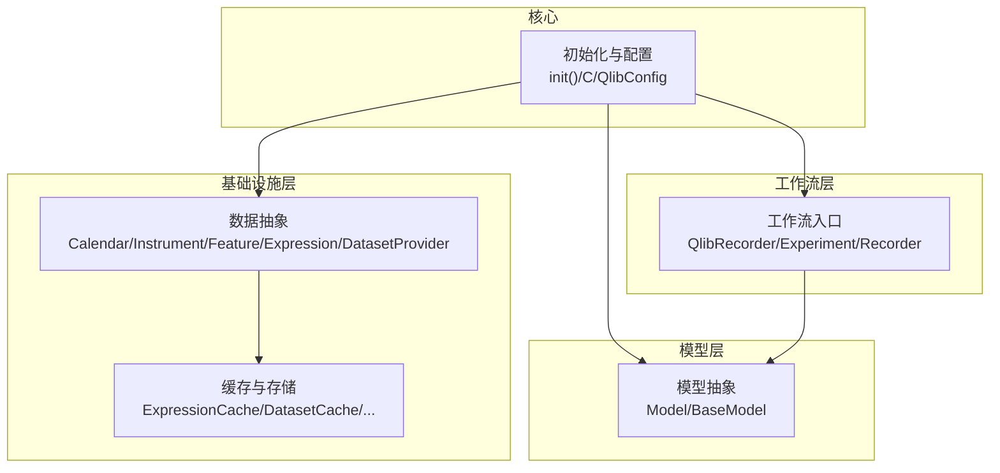
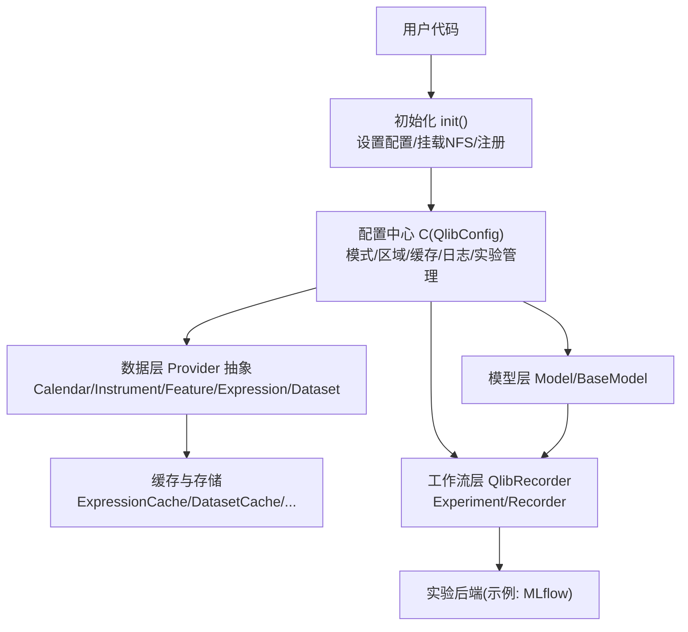
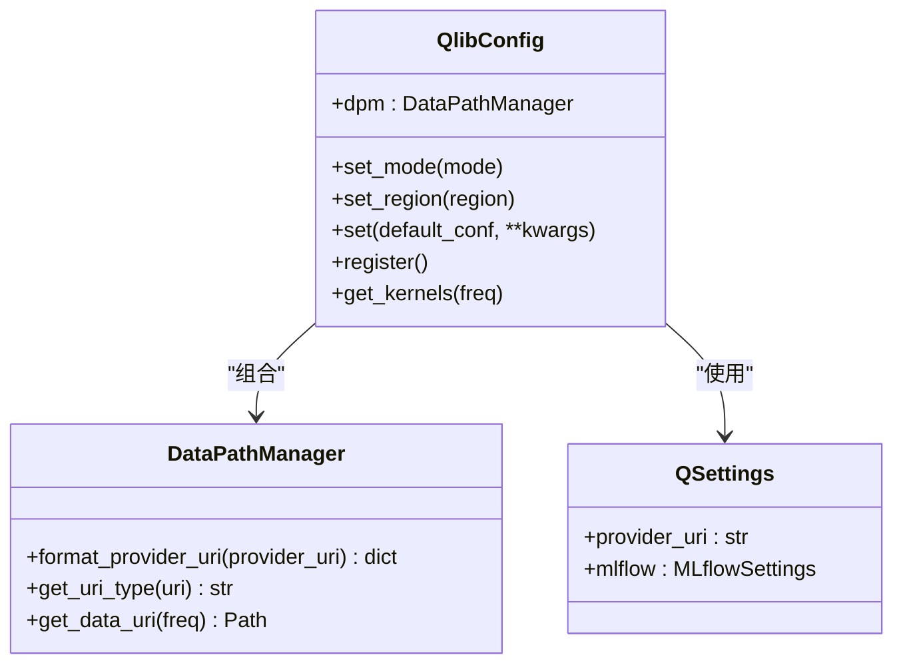
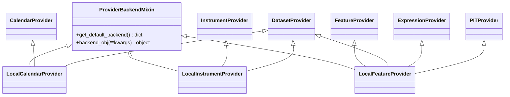
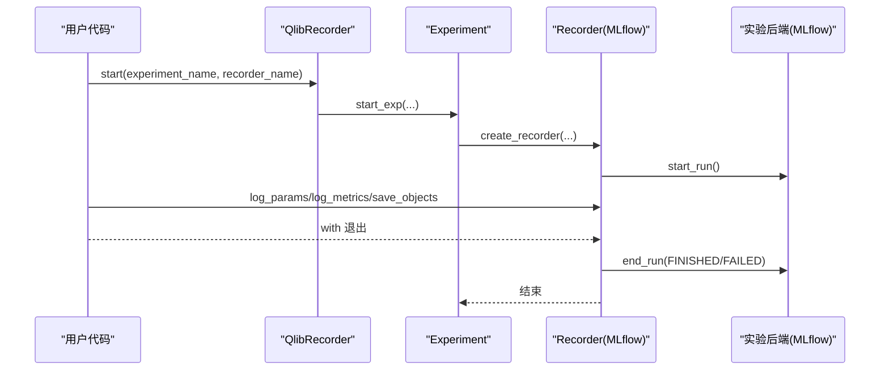
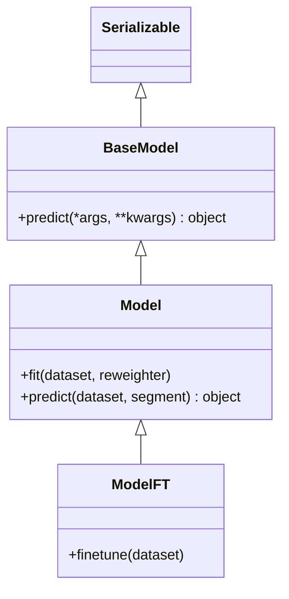
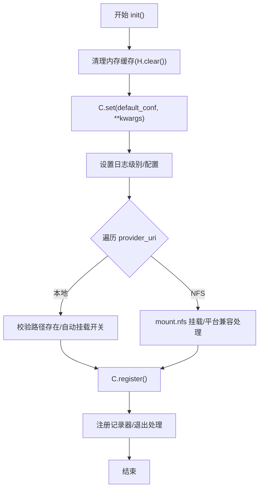
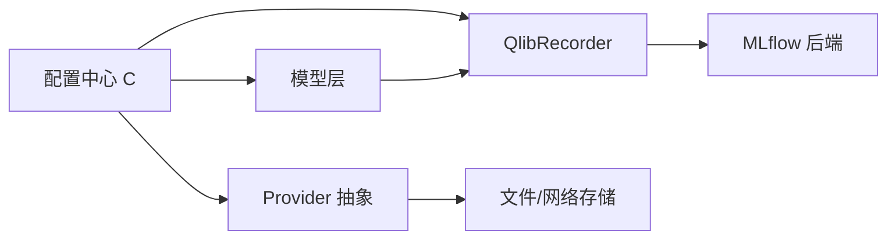

# 整体设计

<cite>
**本文引用的文件**
- [qlib/__init__.py](file://qlib/__init__.py)
- [qlib/config.py](file://qlib/config.py)
- [qlib/workflow/__init__.py](file://qlib/workflow/__init__.py)
- [qlib/workflow/exp.py](file://qlib/workflow/exp.py)
- [qlib/workflow/recorder.py](file://qlib/workflow/recorder.py)
- [qlib/data/__init__.py](file://qlib/data/__init__.py)
- [qlib/data/data.py](file://qlib/data/data.py)
- [qlib/model/__init__.py](file://qlib/model/__init__.py)
- [qlib/model/base.py](file://qlib/model/base.py)
- [qlib/constant.py](file://qlib/constant.py)
</cite>

## 目录
1. [引言](#引言)
2. [项目结构](#项目结构)
3. [核心组件](#核心组件)
4. [架构总览](#架构总览)
5. [详细组件分析](#详细组件分析)
6. [依赖分析](#依赖分析)
7. [性能考虑](#性能考虑)
8. [故障排查指南](#故障排查指南)
9. [结论](#结论)
10. [附录](#附录)

## 引言
本文件面向希望深入理解 Qlib 整体设计与实现的读者，系统阐述其作为量化研究框架的设计理念与工程实践。重点包括：
- 松耦合模块化架构：通过清晰的分层与接口抽象，降低模块间耦合度，提升可维护性与可扩展性。
- 插件化扩展机制：以配置驱动与工厂模式为核心，支持运行时按需加载 Provider、缓存策略、实验管理后端等。
- 配置驱动的灵活性设计：统一的全局配置中心，支持客户端/服务端两种模式，以及区域化参数与缓存策略。
- 分层架构模式：从基础设施层（数据提供者、缓存）到工作流层（实验、记录器）再到模型层的职责分离与交互方式。
- 设计决策的技术考量：在性能、可扩展性、可维护性之间的权衡；跨领域关注点（安全性、监控、灾难恢复）的原则。

## 项目结构
Qlib 的代码组织遵循“功能域+层次”的混合结构：
- 基础设施层（data）：提供数据访问抽象（日历、标的、特征、表达式、数据集）、缓存与存储适配。
- 工作流层（workflow）：提供实验与记录器抽象，封装 MLflow 等后端，统一实验生命周期管理。
- 模型层（model）：定义模型基类与可学习模型接口，支撑训练、预测与微调流程。
- 核心入口与配置（qlib/__init__.py、qlib/config.py）：负责初始化、路径解析、模式切换与注册。

图表来源
- [qlib/data/data.py:65-476](file://qlib/data/data.py#L65-L476)
- [qlib/workflow/__init__.py:26-682](file://qlib/workflow/__init__.py#L26-L682)
- [qlib/model/base.py:10-111](file://qlib/model/base.py#L10-L111)
- [qlib/config.py:315-528](file://qlib/config.py#L315-L528)

章节来源
- [qlib/__init__.py:25-85](file://qlib/__init__.py#L25-L85)
- [qlib/config.py:135-287](file://qlib/config.py#L135-L287)
- [qlib/data/__init__.py:8-66](file://qlib/data/__init__.py#L8-L66)
- [qlib/workflow/__init__.py:26-682](file://qlib/workflow/__init__.py#L26-L682)
- [qlib/model/__init__.py:6-9](file://qlib/model/__init__.py#L6-L9)

## 核心组件
- 初始化与配置中心
  - 全局配置对象 C（QlibConfig），支持客户端/服务端模式、区域化参数、缓存策略、日志配置、实验管理器等。
  - 初始化入口 init()，负责清理内存缓存、设置配置、挂载 NFS、注册记录器与退出处理。
- 数据基础设施
  - Provider 抽象：日历、标的、特征、表达式、数据集提供者，支持本地与远程实现，并通过 ProviderBackendMixin 统一后端装配。
  - 缓存与存储：表达式缓存、数据集缓存、简单缓存、磁盘缓存等，支持 Redis 依赖型缓存与本地缓存。
- 工作流与实验管理
  - QlibRecorder：全局实验记录器，提供 with 上下文启动实验、记录指标/参数/对象、查询与删除等能力。
  - Experiment/Recorder：抽象实验与记录器，MLflow 实现示例展示如何封装 MLflow 后端。
- 模型抽象
  - BaseModel/Model：定义模型预测与可学习模型的 fit/predict 接口，支持微调（ModelFT）。

章节来源
- [qlib/config.py:315-528](file://qlib/config.py#L315-L528)
- [qlib/__init__.py:25-85](file://qlib/__init__.py#L25-L85)
- [qlib/data/data.py:43-63](file://qlib/data/data.py#L43-L63)
- [qlib/workflow/__init__.py:26-682](file://qlib/workflow/__init__.py#L26-L682)
- [qlib/workflow/exp.py:15-380](file://qlib/workflow/exp.py#L15-L380)
- [qlib/workflow/recorder.py:28-494](file://qlib/workflow/recorder.py#L28-L494)
- [qlib/model/base.py:10-111](file://qlib/model/base.py#L10-L111)

## 架构总览
Qlib 的整体架构采用“配置驱动 + 插件化 Provider + 工作流记录器”的设计：
- 配置驱动：C.set() 根据 default_conf 切换客户端/服务端模式，解析 provider_uri 与 mount_path，设置日志、缓存、实验管理器等。
- 插件化 Provider：通过 ProviderBackendMixin 与工厂方法动态实例化具体 Provider 与存储后端，支持本地文件与远程存储。
- 工作流记录器：QlibRecorder 封装 Experiment/Recorder，统一实验生命周期与对象持久化，支持 MLflow 后端。

图表来源
- [qlib/__init__.py:25-85](file://qlib/__init__.py#L25-L85)
- [qlib/config.py:424-528](file://qlib/config.py#L424-L528)
- [qlib/data/data.py:43-63](file://qlib/data/data.py#L43-L63)
- [qlib/workflow/__init__.py:26-682](file://qlib/workflow/__init__.py#L26-L682)
- [qlib/workflow/exp.py:243-380](file://qlib/workflow/exp.py#L243-L380)
- [qlib/workflow/recorder.py:247-494](file://qlib/workflow/recorder.py#L247-L494)
- [qlib/model/base.py:22-78](file://qlib/model/base.py#L22-L78)

## 详细组件分析

### 初始化与配置（C/QlibConfig）
- 职责
  - 提供客户端/服务端两种默认配置模板，支持按区域设置交易单位、涨跌停阈值、成交价等。
  - 解析 provider_uri 与 mount_path，支持本地与 NFS URI 类型识别与挂载校验。
  - 注册记录器、设置日志、版本重置、核数与任务粒度等运行参数。
- 关键点
  - set_mode()/set_region() 用于快速切换模式与区域。
  - DataPathManager 用于根据频率与 URI 类型解析最终数据路径。
  - register() 将记录器注入全局 R，并注册退出处理。

图表来源
- [qlib/config.py:315-528](file://qlib/config.py#L315-L528)

章节来源
- [qlib/config.py:424-528](file://qlib/config.py#L424-L528)

### 数据抽象与 Provider（Provider 抽象与本地实现）
- 职责
  - 定义日历、标的、特征、表达式、数据集提供者的抽象接口，确保上层逻辑与底层数据源解耦。
  - 通过 ProviderBackendMixin 与工厂方法动态装配后端存储，默认使用文件存储。
- 关键点
  - 表达式解析与实例缓存，避免重复构造表达式对象。
  - 数据集加载采用多进程并行与缓存结合，支持按标的分片计算与列名规范化。
  - PITProvider 支持历史财务期间数据查询，强调线程安全与边界检查。

图表来源
- [qlib/data/data.py:43-63](file://qlib/data/data.py#L43-L63)
- [qlib/data/data.py:637-724](file://qlib/data/data.py#L637-L724)
- [qlib/data/data.py:726-742](file://qlib/data/data.py#L726-L742)
- [qlib/data/data.py:338-381](file://qlib/data/data.py#L338-L381)

章节来源
- [qlib/data/data.py:65-476](file://qlib/data/data.py#L65-L476)

### 工作流与实验管理（QlibRecorder/Experiment/Recorder）
- 职责
  - QlibRecorder 提供 with 上下文启动实验、记录指标/参数/对象、查询与删除等统一接口。
  - Experiment/Recorder 抽象实验与记录器，MLflow 实现展示如何封装 MLflow 后端。
- 关键点
  - 支持自动记录未提交代码差异、环境变量等，便于复现实验。
  - 异步日志与对象持久化，减少阻塞；支持 Azure Blob 等对象存储后端清理临时文件。

图表来源
- [qlib/workflow/__init__.py:37-164](file://qlib/workflow/__init__.py#L37-L164)
- [qlib/workflow/exp.py:243-380](file://qlib/workflow/exp.py#L243-L380)
- [qlib/workflow/recorder.py:247-494](file://qlib/workflow/recorder.py#L247-L494)

章节来源
- [qlib/workflow/__init__.py:26-682](file://qlib/workflow/__init__.py#L26-L682)
- [qlib/workflow/exp.py:15-380](file://qlib/workflow/exp.py#L15-L380)
- [qlib/workflow/recorder.py:28-494](file://qlib/workflow/recorder.py#L28-L494)

### 模型抽象（Model/BaseModel）
- 职责
  - BaseModel 定义预测接口；Model 定义 fit/predict 接口，支持权重重加权（Reweighter）。
  - ModelFT 支持基于已有模型的微调流程，配合工作流记录器进行实验追踪。
- 关键点
  - 模型属性命名规范（不以下划线开头）以保证序列化持久化成功。
  - predict 支持按数据集切片或文本标识选择测试/验证段。

图表来源
- [qlib/model/base.py:10-111](file://qlib/model/base.py#L10-L111)

章节来源
- [qlib/model/base.py:10-111](file://qlib/model/base.py#L10-L111)

### 初始化流程（init 与 NFS 挂载）
- 流程要点
  - 清理内存缓存、设置配置、设置日志级别。
  - 根据 provider_uri 类型判断本地/NFS 并执行挂载或校验。
  - 注册记录器与退出处理，输出初始化完成信息与数据路径。

图表来源
- [qlib/__init__.py:25-85](file://qlib/__init__.py#L25-L85)
- [qlib/__init__.py:87-186](file://qlib/__init__.py#L87-L186)

章节来源
- [qlib/__init__.py:25-85](file://qlib/__init__.py#L25-L85)

## 依赖分析
- 组件内聚与耦合
  - 数据层与工作流层通过 Provider 抽象与记录器接口解耦，便于替换后端与实验管理器。
  - 配置中心 C 对外暴露 set()/register()，集中控制初始化与注册流程，降低上层复杂度。
- 外部依赖与集成点
  - MLflow：作为实验后端的参考实现，提供运行生命周期与对象持久化。
  - Redis：可选依赖，用于依赖型缓存（表达式/数据集缓存）。
  - 文件系统/网络存储：通过 DataPathManager 与 ProviderBackendMixin 统一封装。
- 循环依赖
  - 未发现直接循环依赖；初始化与注册顺序确保先配置后使用。

图表来源
- [qlib/config.py:424-528](file://qlib/config.py#L424-L528)
- [qlib/data/data.py:43-63](file://qlib/data/data.py#L43-L63)
- [qlib/workflow/__init__.py:26-682](file://qlib/workflow/__init__.py#L26-L682)
- [qlib/model/base.py:22-78](file://qlib/model/base.py#L22-L78)

章节来源
- [qlib/config.py:424-528](file://qlib/config.py#L424-L528)
- [qlib/data/data.py:43-63](file://qlib/data/data.py#L43-L63)
- [qlib/workflow/__init__.py:26-682](file://qlib/workflow/__init__.py#L26-L682)
- [qlib/model/base.py:22-78](file://qlib/model/base.py#L22-L78)

## 性能考虑
- 并行与任务粒度
  - 数据集加载采用多进程并行（ParallelExt），核数由 C.get_kernels(freq) 动态决定，高频数据建议较小任务粒度。
- 缓存策略
  - 表达式缓存与数据集缓存可选 Redis 依赖型缓存与本地简单缓存，减少重复计算与 IO。
- 内存与资源管理
  - 内存缓存过期时间与大小限制、磁盘缓存目录名可配置；退出时清理资源。
- 日志与异步
  - 记录器使用异步日志队列，降低写入阻塞；对象持久化后及时清理临时文件。

章节来源
- [qlib/data/data.py:548-635](file://qlib/data/data.py#L548-L635)
- [qlib/config.py:127-170](file://qlib/config.py#L127-L170)
- [qlib/workflow/recorder.py:347-396](file://qlib/workflow/recorder.py#L347-L396)

## 故障排查指南
- 初始化失败（NFS 挂载）
  - 现象：提示无效 provider_uri 或挂载失败。
  - 处理：确认 URI 格式、权限与 auto_mount 设置；Linux 下检查 nfs-common 是否安装；Windows 使用 mount 命令。
- 缓存不可用（Redis 连接失败）
  - 现象：日志警告 Redis 连接失败，禁用依赖 Redis 的缓存。
  - 处理：检查 Redis 地址/端口/密码；或关闭相关缓存。
- 实验记录异常
  - 现象：记录器状态异常或对象加载失败。
  - 处理：确认记录器已启动；检查对象命名与后端存储；必要时清理临时文件。

章节来源
- [qlib/__init__.py:87-186](file://qlib/__init__.py#L87-L186)
- [qlib/config.py:466-482](file://qlib/config.py#L466-L482)
- [qlib/workflow/recorder.py:413-444](file://qlib/workflow/recorder.py#L413-L444)

## 结论
Qlib 通过“配置驱动 + 插件化 Provider + 工作流记录器”的整体设计，在量化研究场景中实现了：
- 松耦合与模块化：抽象清晰、职责明确，便于替换与扩展。
- 灵活与可移植：客户端/服务端模式、区域化参数、多种后端存储与实验管理器。
- 可维护与可观测：统一初始化与注册、实验生命周期管理、对象持久化与异步日志。
在性能方面，结合多进程并行与缓存策略，兼顾吞吐与资源占用；在可靠性方面，提供挂载校验、缓存降级与对象清理等保障措施。

## 附录
- 区域常量与通用常量
  - REG_CN/REG_US/REG_TW：区域枚举，影响交易单位、涨跌停阈值等。
  - EPS/INF/时间常量：数值稳定性与时间粒度的通用设定。

章节来源
- [qlib/constant.py:10-23](file://qlib/constant.py#L10-L23)