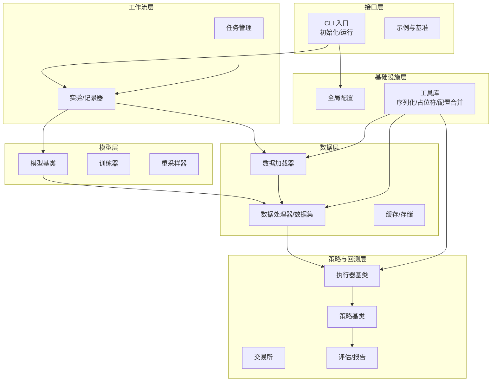
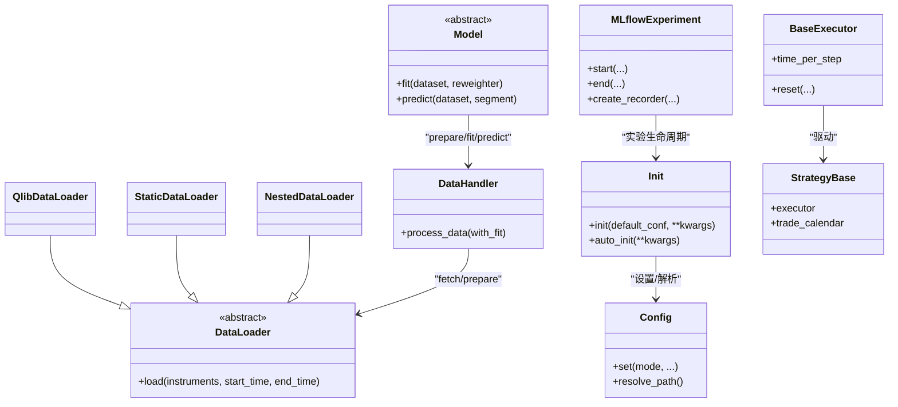
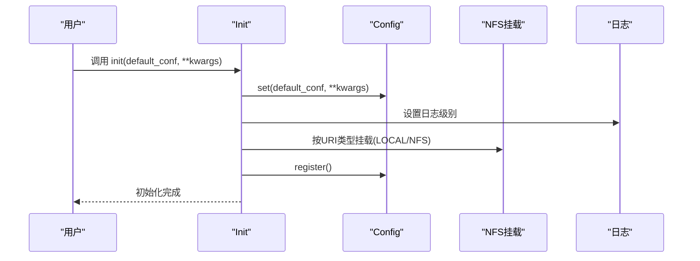
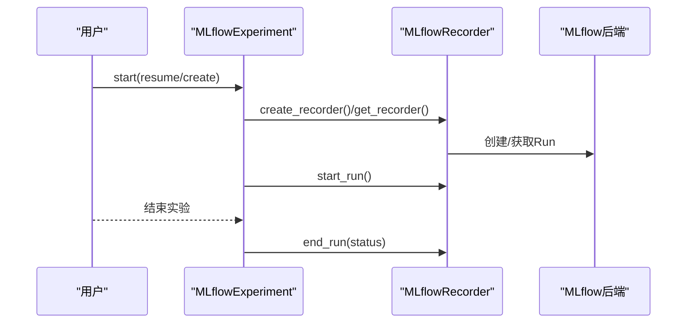
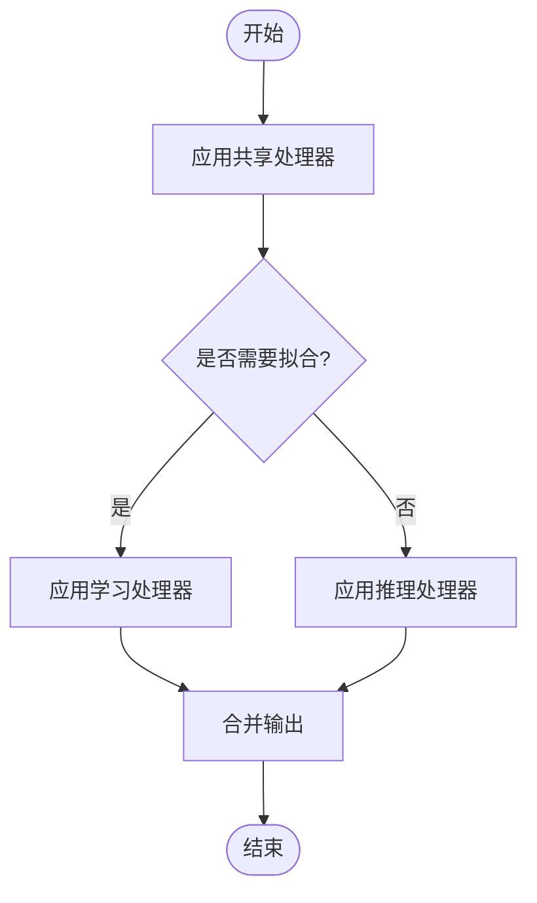
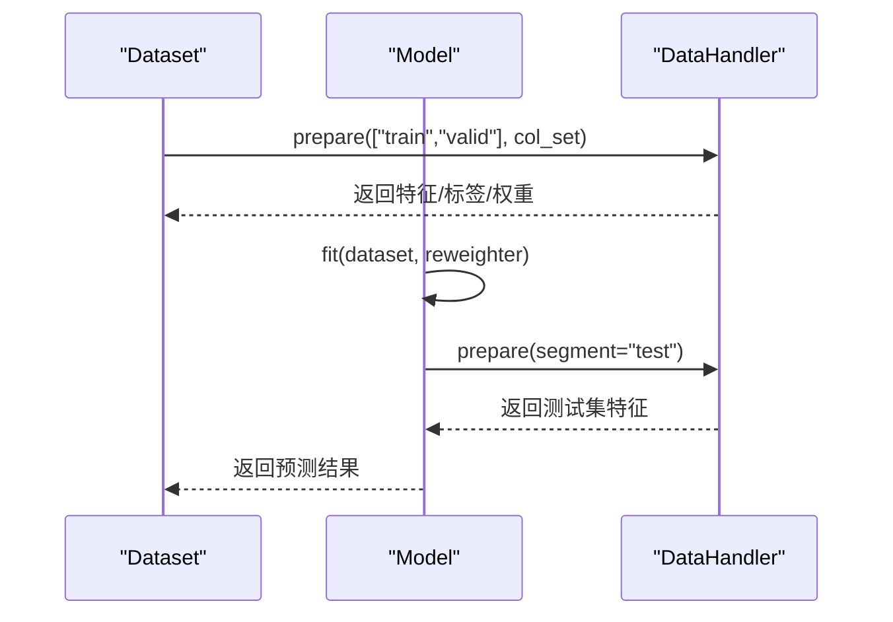
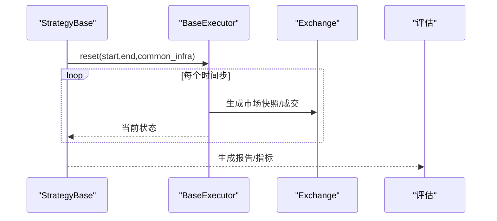
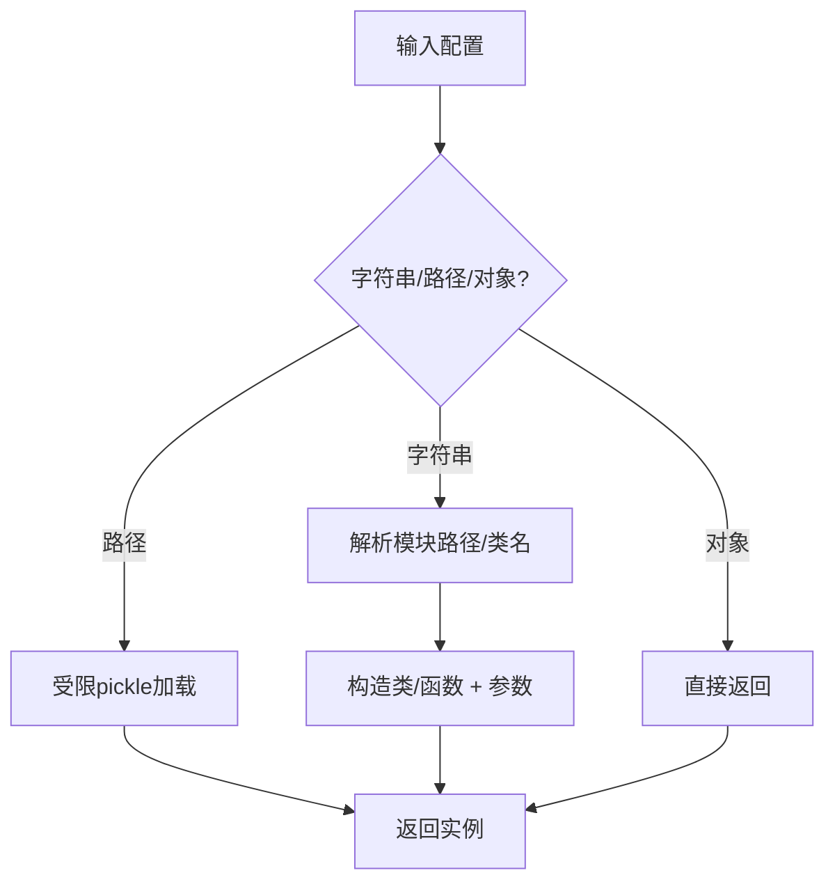
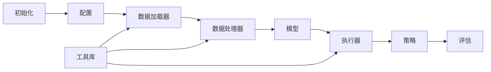
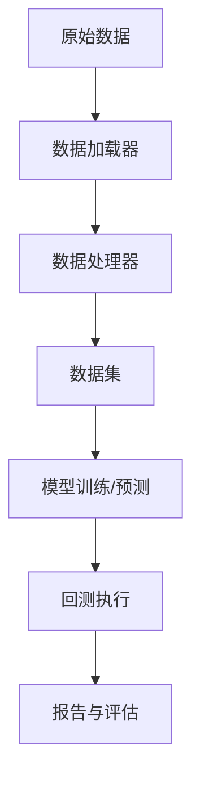

# 核心架构

<cite>
**本文引用的文件**
- [qlib/__init__.py](file://qlib/__init__.py)
- [qlib/config.py](file://qlib/config.py)
- [qlib/utils/mod.py](file://qlib/utils/mod.py)
- [qlib/utils/data.py](file://qlib/utils/data.py)
- [qlib/utils/__init__.py](file://qlib/utils/__init__.py)
- [qlib/typehint.py](file://qlib/typehint.py)
- [qlib/workflow/exp.py](file://qlib/workflow/exp.py)
- [qlib/data/dataset/loader.py](file://qlib/data/dataset/loader.py)
- [qlib/data/dataset/handler.py](file://qlib/data/dataset/handler.py)
- [qlib/model/base.py](file://qlib/model/base.py)
- [qlib/backtest/executor.py](file://qlib/backtest/executor.py)
- [qlib/strategy/base.py](file://qlib/strategy/base.py)
- [qlib/contrib/evaluate.py](file://qlib/contrib/evaluate.py)
- [qlib/rl/order_execution/strategy.py](file://qlib/rl/order_execution/strategy.py)
- [docs/introduction/introduction.rst](file://docs/introduction/introduction.rst)
- [docs/component/workflow.rst](file://docs/component/workflow.rst)
- [examples/rolling_process_data/README.md](file://examples/rolling_process_data/README.md)
</cite>

## 目录
1. [引言](#引言)
2. [项目结构](#项目结构)
3. [核心组件](#核心组件)
4. [架构总览](#架构总览)
5. [详细组件分析](#详细组件分析)
6. [依赖分析](#依赖分析)
7. [性能考量](#性能考量)
8. [故障排查指南](#故障排查指南)
9. [结论](#结论)
10. [附录](#附录)

## 引言
本文件面向Qlib的整体架构与实现，聚焦于松耦合模块化设计理念、组件间交互关系、数据流全链路（从原始数据到回测结果）、设计模式（插件化、配置驱动、工厂模式等）、组件分层（基础设施层到工作流层）以及系统边界与组件分解。同时给出性能优化、可扩展性设计的技术决策与权衡，并覆盖安全性、监控、灾难恢复等跨领域关注点。

## 项目结构
Qlib采用“分层+插件化”的组织方式：
- 基础设施层：配置管理、日志、序列化/反序列化、通用工具（路径解析、占位符填充、配置合并）
- 数据层：数据加载器、处理器、数据集、缓存与存储抽象
- 模型层：模型基类、训练器、权重重采样器
- 策略与回测层：策略基类、执行器、交易所、报告生成
- 工作流层：实验与记录器、任务调度、运行入口（qrun）
- 接口层：CLI、示例与基准

图表来源
- [qlib/__init__.py:25-85](file://qlib/__init__.py#L25-L85)
- [qlib/workflow/exp.py:15-380](file://qlib/workflow/exp.py#L15-L380)
- [qlib/data/dataset/loader.py:18-415](file://qlib/data/dataset/loader.py#L18-L415)
- [qlib/data/dataset/handler.py:552-583](file://qlib/data/dataset/handler.py#L552-L583)
- [qlib/model/base.py:10-111](file://qlib/model/base.py#L10-L111)
- [qlib/backtest/executor.py:95-121](file://qlib/backtest/executor.py#L95-L121)
- [qlib/strategy/base.py:40-68](file://qlib/strategy/base.py#L40-L68)
- [qlib/contrib/evaluate.py:208-257](file://qlib/contrib/evaluate.py#L208-L257)
- [qlib/utils/mod.py:122-184](file://qlib/utils/mod.py#L122-L184)
- [qlib/utils/data.py:87-118](file://qlib/utils/data.py#L87-L118)
- [qlib/utils/__init__.py:784-823](file://qlib/utils/__init__.py#L784-L823)

章节来源
- [docs/introduction/introduction.rst:46-70](file://docs/introduction/introduction.rst#L46-L70)
- [docs/component/workflow.rst:1-36](file://docs/component/workflow.rst#L1-L36)

## 核心组件
- 初始化与配置
  - 初始化入口负责挂载数据源、注册配置、设置日志级别与全局路径解析；支持自动挂载NFS、按区域设置参数等。
  - 配置系统提供默认模板、区域切换、路径解析与键值便捷设置。
- 实验与记录器
  - 实验类抽象了实验生命周期与记录器管理；MLflow实验实现对接MLflow后端，支持查询、删除、列表等。
- 数据加载与处理
  - 多种数据加载器（静态、嵌套、基于处理器）统一输出多索引DataFrame；处理器支持共享/学习/推理三阶段流水线。
- 模型与训练
  - 模型基类定义预测接口；具体模型通过数据集准备特征/标签/权重进行训练与预测。
- 回测与策略
  - 执行器封装时间步进、指标生成与账户/市场环境；策略基类提供交易日历与执行器访问；RL订单执行策略支持细粒度时序推进。
- 工具与序列化
  - 通过配置驱动实例化任意类/函数；支持占位符替换、配置递归合并、受限pickle加载等。

章节来源
- [qlib/__init__.py:25-85](file://qlib/__init__.py#L25-L85)
- [qlib/config.py:428-463](file://qlib/config.py#L428-L463)
- [qlib/workflow/exp.py:15-380](file://qlib/workflow/exp.py#L15-L380)
- [qlib/data/dataset/loader.py:18-415](file://qlib/data/dataset/loader.py#L18-L415)
- [qlib/data/dataset/handler.py:552-583](file://qlib/data/dataset/handler.py#L552-L583)
- [qlib/model/base.py:10-111](file://qlib/model/base.py#L10-L111)
- [qlib/backtest/executor.py:95-121](file://qlib/backtest/executor.py#L95-L121)
- [qlib/strategy/base.py:40-68](file://qlib/strategy/base.py#L40-L68)
- [qlib/contrib/evaluate.py:208-257](file://qlib/contrib/evaluate.py#L208-L257)
- [qlib/utils/mod.py:122-184](file://qlib/utils/mod.py#L122-L184)
- [qlib/utils/data.py:87-118](file://qlib/utils/data.py#L87-L118)
- [qlib/utils/__init__.py:784-823](file://qlib/utils/__init__.py#L784-L823)

## 架构总览
Qlib以“配置驱动 + 插件化”为核心，通过以下模式实现松耦合：
- 配置驱动：所有可插拔组件均通过配置项声明类型与参数，由工具函数动态实例化。
- 工厂模式：统一的实例化入口根据模块路径与关键字参数构建对象。
- 插件化架构：数据加载器、处理器、模型、策略、执行器均可替换或组合。
- 分层解耦：基础设施层提供通用能力，上层仅依赖抽象接口。

图表来源
- [qlib/__init__.py:25-85](file://qlib/__init__.py#L25-L85)
- [qlib/config.py:428-463](file://qlib/config.py#L428-L463)
- [qlib/data/dataset/loader.py:18-415](file://qlib/data/dataset/loader.py#L18-L415)
- [qlib/data/dataset/handler.py:552-583](file://qlib/data/dataset/handler.py#L552-L583)
- [qlib/model/base.py:10-111](file://qlib/model/base.py#L10-L111)
- [qlib/backtest/executor.py:95-121](file://qlib/backtest/executor.py#L95-L121)
- [qlib/strategy/base.py:40-68](file://qlib/strategy/base.py#L40-L68)
- [qlib/workflow/exp.py:243-380](file://qlib/workflow/exp.py#L243-L380)

## 详细组件分析

### 组件A：初始化与配置（Init/Config）
- 设计要点
  - 初始化流程：清理内存缓存、设置默认配置、挂载NFS/本地路径、注册配置、设置日志级别。
  - 配置系统：支持按区域切换、路径解析、键值便捷设置；提供自动挂载开关与错误提示。
- 关键流程（初始化）

图表来源
- [qlib/__init__.py:25-85](file://qlib/__init__.py#L25-L85)
- [qlib/config.py:428-463](file://qlib/config.py#L428-L463)

章节来源
- [qlib/__init__.py:25-85](file://qlib/__init__.py#L25-L85)
- [qlib/config.py:428-463](file://qlib/config.py#L428-L463)

### 组件B：实验与记录器（Experiment/Recorder）
- 设计要点
  - 实验类抽象生命周期与记录器管理；支持创建/启动/结束/查询/删除记录器。
  - MLflow实验实现对接MLflow后端，支持筛选、排序、删除等。
- 关键流程（实验启动）

图表来源
- [qlib/workflow/exp.py:243-380](file://qlib/workflow/exp.py#L243-L380)

章节来源
- [qlib/workflow/exp.py:15-380](file://qlib/workflow/exp.py#L15-L380)

### 组件C：数据加载与处理（DataLoader/Handler）
- 设计要点
  - 多种加载器：静态文件/DF、嵌套合并、基于处理器的数据加载。
  - 处理器流水线：共享/学习/推理三阶段，支持只读保护与推断阶段检查。
- 关键流程（数据处理流水线）

图表来源
- [qlib/data/dataset/handler.py:552-583](file://qlib/data/dataset/handler.py#L552-L583)

章节来源
- [qlib/data/dataset/loader.py:18-415](file://qlib/data/dataset/loader.py#L18-L415)
- [qlib/data/dataset/handler.py:552-583](file://qlib/data/dataset/handler.py#L552-L583)

### 组件D：模型与训练（Model/Trainer）
- 设计要点
  - 模型基类定义预测接口；具体模型通过数据集准备特征/标签/权重进行训练与预测。
  - 支持微调流程，结合记录器实现模型版本化与复用。
- 关键流程（训练与预测）

图表来源
- [qlib/model/base.py:22-79](file://qlib/model/base.py#L22-L79)

章节来源
- [qlib/model/base.py:10-111](file://qlib/model/base.py#L10-L111)

### 组件E：回测与策略（Executor/Strategy/Eval）
- 设计要点
  - 执行器封装时间步进、指标生成与账户/市场环境；策略基类提供交易日历与执行器访问。
  - RL订单执行策略支持细粒度时序推进与成交量统计。
- 关键流程（回测执行）

图表来源
- [qlib/backtest/executor.py:95-121](file://qlib/backtest/executor.py#L95-L121)
- [qlib/strategy/base.py:40-68](file://qlib/strategy/base.py#L40-L68)
- [qlib/contrib/evaluate.py:208-257](file://qlib/contrib/evaluate.py#L208-L257)
- [qlib/rl/order_execution/strategy.py:114-138](file://qlib/rl/order_execution/strategy.py#L114-L138)

章节来源
- [qlib/backtest/executor.py:95-121](file://qlib/backtest/executor.py#L95-L121)
- [qlib/strategy/base.py:40-68](file://qlib/strategy/base.py#L40-L68)
- [qlib/contrib/evaluate.py:208-257](file://qlib/contrib/evaluate.py#L208-L257)
- [qlib/rl/order_execution/strategy.py:114-138](file://qlib/rl/order_execution/strategy.py#L114-L138)

### 组件F：配置驱动与工厂（init_instance_by_config）
- 设计要点
  - 通过模块路径与关键字参数动态实例化任意类/函数；支持受限pickle加载与占位符替换。
  - 提供占位符填充、配置递归合并等工具，便于复杂配置的维护与扩展。
- 关键流程（实例化）

图表来源
- [qlib/utils/mod.py:122-184](file://qlib/utils/mod.py#L122-L184)
- [qlib/utils/__init__.py:784-823](file://qlib/utils/__init__.py#L784-L823)
- [qlib/utils/data.py:87-118](file://qlib/utils/data.py#L87-L118)
- [qlib/typehint.py:44-63](file://qlib/typehint.py#L44-L63)

章节来源
- [qlib/utils/mod.py:49-191](file://qlib/utils/mod.py#L49-L191)
- [qlib/utils/__init__.py:784-823](file://qlib/utils/__init__.py#L784-L823)
- [qlib/utils/data.py:87-118](file://qlib/utils/data.py#L87-L118)
- [qlib/typehint.py:44-63](file://qlib/typehint.py#L44-L63)

## 依赖分析
- 松耦合体现
  - 数据加载器与处理器通过抽象接口解耦；模型仅依赖数据集接口；策略与执行器通过基础设施共享解耦。
- 关键依赖链
  - 初始化 → 配置/路径解析 → 数据加载/处理 → 模型训练/预测 → 回测执行 → 报告生成。
- 可能的循环依赖
  - 通过“配置驱动 + 工厂模式”避免硬编码依赖；工具函数集中于utils，降低跨模块耦合。

图表来源
- [qlib/__init__.py:25-85](file://qlib/__init__.py#L25-L85)
- [qlib/utils/mod.py:122-184](file://qlib/utils/mod.py#L122-L184)
- [qlib/data/dataset/loader.py:18-415](file://qlib/data/dataset/loader.py#L18-L415)
- [qlib/data/dataset/handler.py:552-583](file://qlib/data/dataset/handler.py#L552-L583)
- [qlib/model/base.py:10-111](file://qlib/model/base.py#L10-L111)
- [qlib/backtest/executor.py:95-121](file://qlib/backtest/executor.py#L95-L121)
- [qlib/strategy/base.py:40-68](file://qlib/strategy/base.py#L40-L68)
- [qlib/contrib/evaluate.py:208-257](file://qlib/contrib/evaluate.py#L208-L257)

章节来源
- [qlib/__init__.py:25-85](file://qlib/__init__.py#L25-L85)
- [qlib/utils/mod.py:122-184](file://qlib/utils/mod.py#L122-L184)
- [qlib/data/dataset/loader.py:18-415](file://qlib/data/dataset/loader.py#L18-L415)
- [qlib/data/dataset/handler.py:552-583](file://qlib/data/dataset/handler.py#L552-L583)
- [qlib/model/base.py:10-111](file://qlib/model/base.py#L10-L111)
- [qlib/backtest/executor.py:95-121](file://qlib/backtest/executor.py#L95-L121)
- [qlib/strategy/base.py:40-68](file://qlib/strategy/base.py#L40-L68)
- [qlib/contrib/evaluate.py:208-257](file://qlib/contrib/evaluate.py#L208-L257)

## 性能考量
- 缓存与内存管理
  - 初始化阶段可选择清理内存缓存以提升多次初始化性能；数据层提供缓存与存储抽象，减少重复IO。
- 并行与批处理
  - 工具库提供并行与批处理能力（在相关模块中），建议在数据加载与模型训练阶段合理利用。
- I/O与网络
  - 支持NFS挂载与自动挂载控制；建议在生产环境启用自动挂载并确保权限与网络稳定。
- 配置与实例化开销
  - 通过配置驱动与工厂模式减少硬编码，但需注意配置解析与实例化成本；建议对热点路径进行缓存与预热。

## 故障排查指南
- 初始化失败
  - 检查配置项与路径解析；确认NFS挂载命令与权限；查看日志输出定位具体错误。
- 数据加载异常
  - 确认数据源可用性与过滤器配置；检查嵌套加载器的列冲突与合并策略。
- 训练/预测异常
  - 核对数据集准备阶段的列集合与切片；检查权重与标签一致性。
- 回测执行异常
  - 检查执行器时间步长与交易环境配置；核对策略与执行器的基础设施共享。
- 实验/记录器问题
  - 使用MLflow实验接口查询运行状态与筛选条件；确认记录器名称唯一性与删除权限。

章节来源
- [qlib/__init__.py:87-186](file://qlib/__init__.py#L87-L186)
- [qlib/data/dataset/loader.py:329-348](file://qlib/data/dataset/loader.py#L329-L348)
- [qlib/workflow/exp.py:287-339](file://qlib/workflow/exp.py#L287-L339)
- [qlib/backtest/executor.py:95-121](file://qlib/backtest/executor.py#L95-L121)

## 结论
Qlib通过“配置驱动 + 插件化 + 工厂模式”实现了高度解耦与可扩展的量化研究框架。从基础设施层到工作流层的清晰分层，配合数据处理流水线、模型训练与回测执行链路，满足从研究到生产的多样化需求。建议在实际部署中重点关注缓存策略、并行化与网络稳定性，并结合MLflow实现完整的实验与版本管理。

## 附录
- 概念性工作流（概念图）
