# 组件交互关系

<cite>
**本文引用的文件**
- [qlib/config.py](file://qlib/config.py)
- [qlib/utils/mod.py](file://qlib/utils/mod.py)
- [qlib/utils/__init__.py](file://qlib/utils/__init__.py)
- [qlib/data/base.py](file://qlib/data/base.py)
- [qlib/data/data.py](file://qlib/data/data.py)
- [qlib/data/dataset/handler.py](file://qlib/data/dataset/handler.py)
- [qlib/data/dataset/loader.py](file://qlib/data/dataset/loader.py)
- [qlib/data/dataset/processor.py](file://qlib/data/dataset/processor.py)
- [qlib/data/dataset/storage.py](file://qlib/data/dataset/storage.py)
- [qlib/model/base.py](file://qlib/model/base.py)
- [qlib/model/trainer.py](file://qlib/model/trainer.py)
- [qlib/workflow/exp.py](file://qlib/workflow/exp.py)
- [qlib/workflow/expm.py](file://qlib/workflow/expm.py)
- [qlib/workflow/recorder.py](file://qlib/workflow/recorder.py)
- [qlib/backtest/__init__.py](file://qlib/backtest/__init__.py)
- [qlib/backtest/executor.py](file://qlib/backtest/executor.py)
- [qlib/backtest/strategy/base.py](file://qlib/backtest/strategy/base.py)
- [qlib/strategy/base.py](file://qlib/strategy/base.py)
- [qlib/rl/simulator.py](file://qlib/rl/simulator.py)
- [qlib/rl/contrib/train_onpolicy.py](file://qlib/rl/contrib/train_onpolicy.py)
- [qlib/rl/contrib/backtest.py](file://qlib/rl/contrib/backtest.py)
- [qlib/utils/paral.py](file://qlib/utils/paral.py)
</cite>

## 目录
1. [引言](#引言)
2. [项目结构](#项目结构)
3. [核心组件](#核心组件)
4. [架构总览](#架构总览)
5. [详细组件分析](#详细组件分析)
6. [依赖分析](#依赖分析)
7. [性能考虑](#性能考虑)
8. [故障排查指南](#故障排查指南)
9. [结论](#结论)
10. [附录](#附录)

## 引言
本文件聚焦于 Qlib 的组件交互关系与协作机制，系统梳理数据提供器、处理器、模型训练器、回测执行器等核心模块之间的调用链路与通信方式；阐释基于抽象基类的动态加载与替换能力；解析实验管理、状态变更通知等场景中的事件驱动与观察者模式；给出组件交互序列图与时序图；说明依赖注入与工厂模式在配置驱动下的实现；并覆盖组件生命周期管理与资源清理要点。

## 项目结构
Qlib 将工作流划分为“数据层”“模型层”“策略与回测层”“实验与记录层”，并通过统一的配置与工厂机制完成组件装配与运行时替换。关键目录与职责概览：
- 数据层：提供表达式、特征、数据集与缓存包装器，负责数据的加载、处理与存储。
- 模型层：定义模型抽象与训练接口，支持可插拔的训练器与评估流程。
- 策略与回测层：封装交易策略与执行器，协调账户、交易所、指标生成等基础设施。
- 实验与记录层：提供实验管理、记录器与 MLflow 集成，支撑实验生命周期与结果追踪。

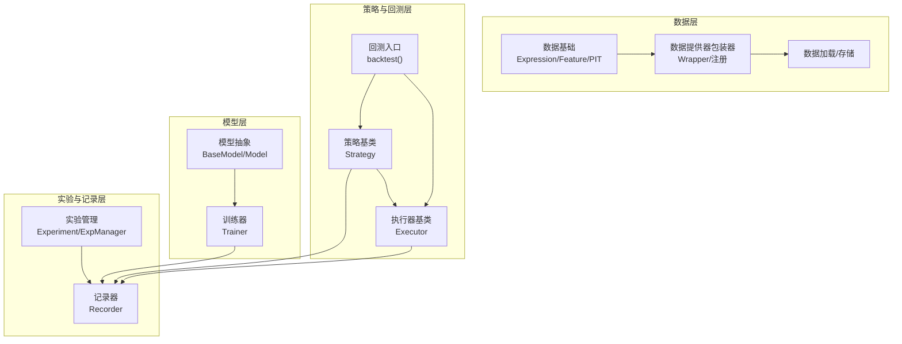

**图表来源**
- [qlib/data/base.py:13-282](file://qlib/data/base.py#L13-L282)
- [qlib/data/data.py:1262-1332](file://qlib/data/data.py#L1262-L1332)
- [qlib/model/base.py:10-111](file://qlib/model/base.py#L10-L111)
- [qlib/backtest/__init__.py:217-276](file://qlib/backtest/__init__.py#L217-L276)
- [qlib/workflow/exp.py:15-380](file://qlib/workflow/exp.py#L15-L380)

**章节来源**
- [qlib/data/base.py:13-282](file://qlib/data/base.py#L13-L282)
- [qlib/data/data.py:1262-1332](file://qlib/data/data.py#L1262-L1332)
- [qlib/model/base.py:10-111](file://qlib/model/base.py#L10-L111)
- [qlib/backtest/__init__.py:217-276](file://qlib/backtest/__init__.py#L217-L276)
- [qlib/workflow/exp.py:15-380](file://qlib/workflow/exp.py#L15-L380)

## 核心组件
- 数据提供器与包装器
  - 表达式与特征抽象：定义统一的数据加载接口与窗口扩展规则，支持缓存与错误处理。
  - 提供器包装器：通过 Wrapper 注册机制将具体 Provider 注入到命名空间，实现按需替换。
- 处理器与数据集
  - 处理器：对原始行情进行标准化、变换与派生，形成可用于建模的特征矩阵。
  - 数据集：组织训练/验证/测试分段，提供样本权重与重采样能力。
  - 加载器与存储：负责数据持久化与缓存命中。
- 模型训练器
  - 训练器：封装模型拟合、预测与微调流程，配合记录器输出指标与对象。
- 回测执行器
  - 执行器：维护交易基础设施（账户、交易所），按时间步推进并生成指标。
  - 策略：根据信号生成订单，与执行器协同完成交易闭环。
- 实验管理与记录
  - 实验：统一管理一次研究任务的生命周期，支持创建、启动、结束与查询。
  - 记录器：记录参数、指标、模型对象等，支持 MLflow 集成。

**章节来源**
- [qlib/data/base.py:13-282](file://qlib/data/base.py#L13-L282)
- [qlib/data/data.py:1262-1332](file://qlib/data/data.py#L1262-L1332)
- [qlib/data/dataset/handler.py](file://qlib/data/dataset/handler.py)
- [qlib/data/dataset/processor.py](file://qlib/data/dataset/processor.py)
- [qlib/data/dataset/loader.py](file://qlib/data/dataset/loader.py)
- [qlib/data/dataset/storage.py](file://qlib/data/dataset/storage.py)
- [qlib/model/base.py:10-111](file://qlib/model/base.py#L10-L111)
- [qlib/model/trainer.py](file://qlib/model/trainer.py)
- [qlib/backtest/executor.py:95-121](file://qlib/backtest/executor.py#L95-L121)
- [qlib/backtest/strategy/base.py:40-68](file://qlib/backtest/strategy/base.py#L40-L68)
- [qlib/workflow/exp.py:15-380](file://qlib/workflow/exp.py#L15-L380)
- [qlib/workflow/recorder.py](file://qlib/workflow/recorder.py)

## 架构总览
Qlib 采用“配置驱动 + 工厂 + 抽象基类”的架构风格：
- 配置驱动：通过 YAML 或字典描述组件类型与初始化参数，统一由工厂函数解析实例化。
- 工厂与反射：根据模块路径与类名动态导入模块并构造对象，支持默认模块回退与关键字参数合并。
- 抽象基类：各层定义清晰的接口契约，便于替换与扩展。
- 包装器注册：数据提供器通过 Wrapper 注册到全局命名空间，实现透明替换。

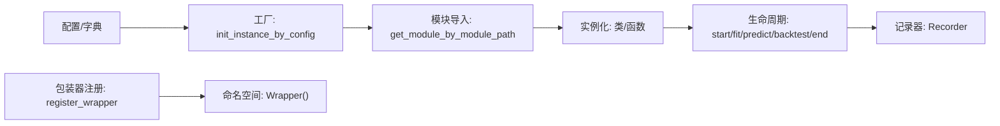

**图表来源**
- [qlib/utils/mod.py:122-185](file://qlib/utils/mod.py#L122-L185)
- [qlib/utils/mod.py:25-46](file://qlib/utils/mod.py#L25-L46)
- [qlib/utils/__init__.py:876-886](file://qlib/utils/__init__.py#L876-L886)
- [qlib/workflow/recorder.py](file://qlib/workflow/recorder.py)

**章节来源**
- [qlib/utils/mod.py:122-185](file://qlib/utils/mod.py#L122-L185)
- [qlib/utils/mod.py:25-46](file://qlib/utils/mod.py#L25-L46)
- [qlib/utils/__init__.py:876-886](file://qlib/utils/__init__.py#L876-L886)
- [qlib/workflow/recorder.py](file://qlib/workflow/recorder.py)

## 详细组件分析

### 数据提供器与包装器注册
- 表达式与特征抽象
  - Expression 定义统一的加载接口与比较/算子重载，内部实现通过缓存与异常日志增强鲁棒性。
  - Feature/PITFeature 将静态特征与点时态特征委托给对应 Provider。
- Provider 包装器
  - Wrapper 是全局注册中心，通过 register_wrapper 将具体 Provider 注册到命名空间，如 FeatureD/DatasetD/ExpressionD 等。
  - register_all_wrappers 负责批量注册，结合配置项 expression_provider/dataset_provider 等完成替换。

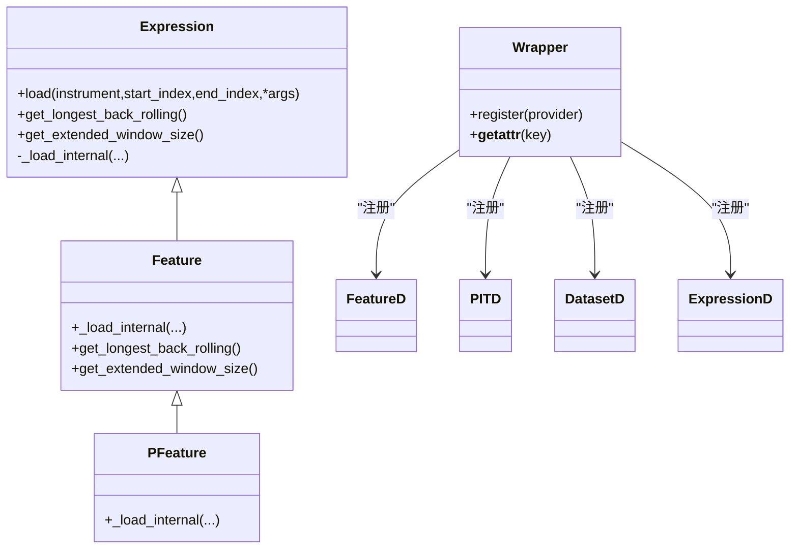

**图表来源**
- [qlib/data/base.py:13-282](file://qlib/data/base.py#L13-L282)
- [qlib/data/data.py:1262-1332](file://qlib/data/data.py#L1262-L1332)
- [qlib/utils/__init__.py:861-886](file://qlib/utils/__init__.py#L861-L886)

**章节来源**
- [qlib/data/base.py:13-282](file://qlib/data/base.py#L13-L282)
- [qlib/data/data.py:1262-1332](file://qlib/data/data.py#L1262-L1332)
- [qlib/utils/__init__.py:861-886](file://qlib/utils/__init__.py#L861-L886)

### 处理器、数据集与加载/存储
- 处理器（Handler）：负责数据清洗、标准化、缺失值处理与特征派生。
- 处理器（Processor）：对特征进行变换、归一化、合成等操作。
- 数据集（Dataset）：按训练/验证/测试划分准备数据，支持权重与重采样。
- 加载器与存储：提供数据持久化与缓存访问，提升重复计算效率。

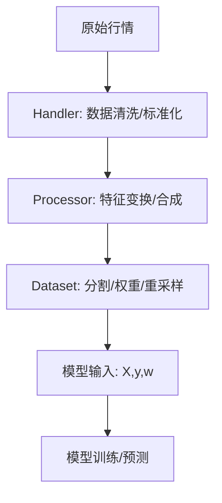

**图表来源**
- [qlib/data/dataset/handler.py](file://qlib/data/dataset/handler.py)
- [qlib/data/dataset/processor.py](file://qlib/data/dataset/processor.py)
- [qlib/data/dataset/loader.py](file://qlib/data/dataset/loader.py)
- [qlib/data/dataset/storage.py](file://qlib/data/dataset/storage.py)

**章节来源**
- [qlib/data/dataset/handler.py](file://qlib/data/dataset/handler.py)
- [qlib/data/dataset/processor.py](file://qlib/data/dataset/processor.py)
- [qlib/data/dataset/loader.py](file://qlib/data/dataset/loader.py)
- [qlib/data/dataset/storage.py](file://qlib/data/dataset/storage.py)

### 模型训练器与工厂注入
- 模型抽象：Model 定义 fit/predict 接口，支持微调与序列化。
- 训练器：封装优化循环、早停、评估与保存逻辑，配合 Recorder 输出指标。
- 工厂注入：通过 init_instance_by_config 从配置中解析类与参数，支持默认模块回退与关键字参数合并。

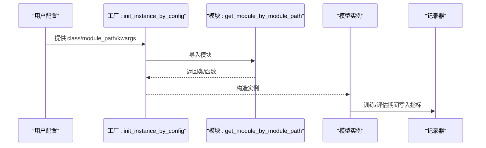

**图表来源**
- [qlib/utils/mod.py:122-185](file://qlib/utils/mod.py#L122-L185)
- [qlib/utils/mod.py:25-46](file://qlib/utils/mod.py#L25-L46)
- [qlib/model/base.py:22-111](file://qlib/model/base.py#L22-L111)
- [qlib/model/trainer.py](file://qlib/model/trainer.py)

**章节来源**
- [qlib/utils/mod.py:122-185](file://qlib/utils/mod.py#L122-L185)
- [qlib/model/base.py:22-111](file://qlib/model/base.py#L22-L111)
- [qlib/model/trainer.py](file://qlib/model/trainer.py)

### 回测执行器与策略协作
- 策略基类：持有执行器与交易日历等共享基础设施，支持按需重置。
- 执行器基类：维护级别基础设施，按时间步推进并生成指标。
- 回测入口：统一初始化策略与执行器，协调账户与交易所，推进交易循环。

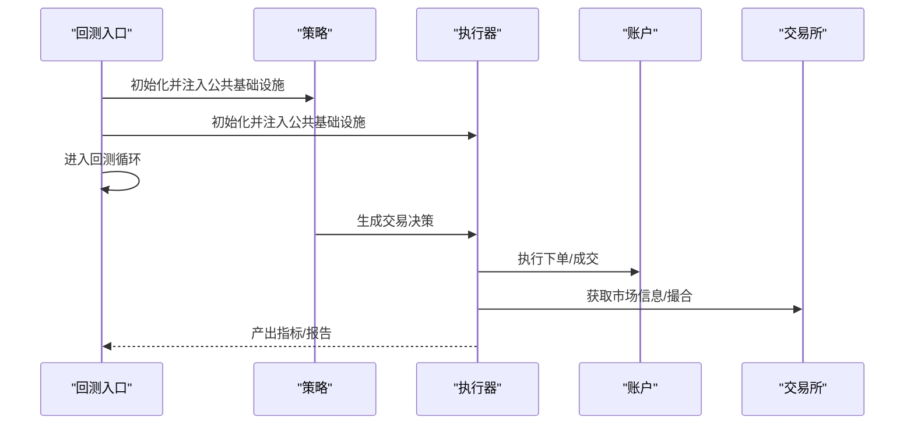

**图表来源**
- [qlib/backtest/__init__.py:217-276](file://qlib/backtest/__init__.py#L217-L276)
- [qlib/backtest/executor.py:95-121](file://qlib/backtest/executor.py#L95-L121)
- [qlib/backtest/strategy/base.py:40-68](file://qlib/backtest/strategy/base.py#L40-L68)
- [qlib/strategy/base.py](file://qlib/strategy/base.py)

**章节来源**
- [qlib/backtest/__init__.py:217-276](file://qlib/backtest/__init__.py#L217-L276)
- [qlib/backtest/executor.py:95-121](file://qlib/backtest/executor.py#L95-L121)
- [qlib/backtest/strategy/base.py:40-68](file://qlib/backtest/strategy/base.py#L40-L68)
- [qlib/strategy/base.py](file://qlib/strategy/base.py)

### 实验管理与状态变更通知
- 实验管理：Experiment/ExpManager 提供创建、启动、结束与查询记录器的能力，支持 MLflow 集成。
- 状态变更：实验与记录器的状态（如 RUNNING/FINISHED/FAILED）贯穿训练与回测过程，用于追踪与恢复。

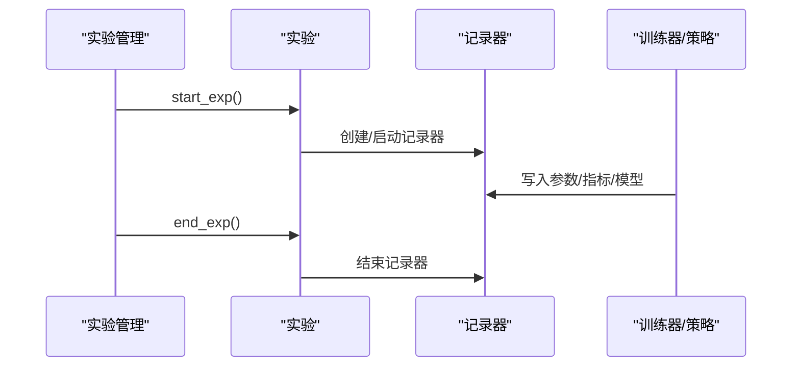

**图表来源**
- [qlib/workflow/expm.py:34-136](file://qlib/workflow/expm.py#L34-L136)
- [qlib/workflow/exp.py:15-380](file://qlib/workflow/exp.py#L15-L380)
- [qlib/workflow/recorder.py](file://qlib/workflow/recorder.py)

**章节来源**
- [qlib/workflow/expm.py:34-136](file://qlib/workflow/expm.py#L34-L136)
- [qlib/workflow/exp.py:15-380](file://qlib/workflow/exp.py#L15-L380)
- [qlib/workflow/recorder.py](file://qlib/workflow/recorder.py)

### 事件驱动与观察者模式
- 观察者模式：实验记录器作为观察者，订阅训练/回测过程中的指标与对象，自动持久化。
- 状态变更通知：实验状态在启动/结束时更新，确保外部系统（如 MLflow）能感知生命周期变化。
- 并发与异步：部分流程通过异步队列与线程池并行化，避免阻塞主线程。

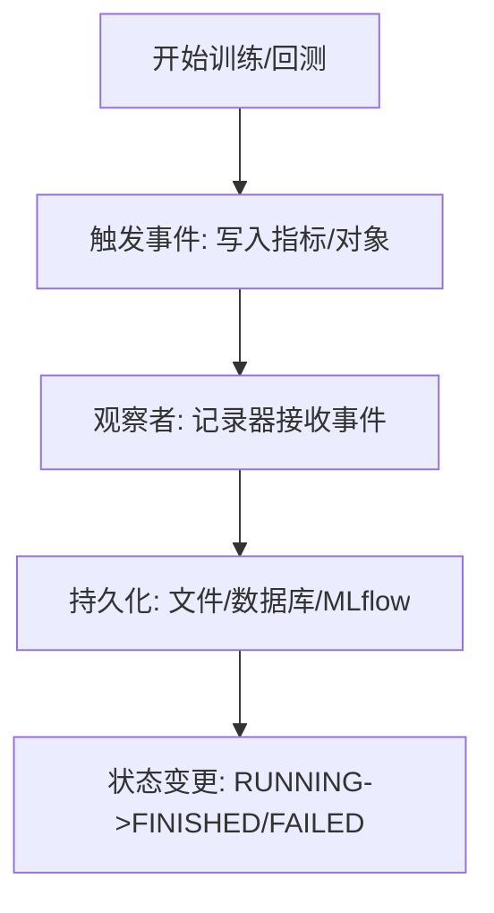

**图表来源**
- [qlib/workflow/recorder.py](file://qlib/workflow/recorder.py)
- [qlib/utils/paral.py:84-129](file://qlib/utils/paral.py#L84-L129)

**章节来源**
- [qlib/workflow/recorder.py](file://qlib/workflow/recorder.py)
- [qlib/utils/paral.py:84-129](file://qlib/utils/paral.py#L84-L129)

### 依赖注入与工厂模式
- 依赖注入：通过配置字典注入类与参数，工厂函数在运行时解析并构造实例，支持默认模块回退与关键字参数合并。
- 工厂模式：统一的工厂方法屏蔽模块导入细节，便于替换与扩展。

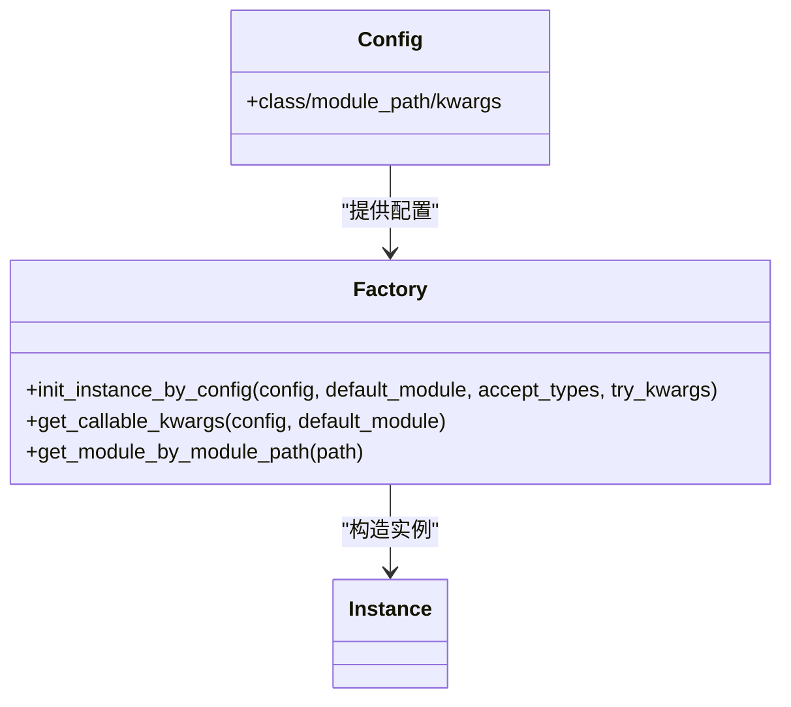

**图表来源**
- [qlib/utils/mod.py:122-185](file://qlib/utils/mod.py#L122-L185)
- [qlib/utils/mod.py:67-116](file://qlib/utils/mod.py#L67-L116)
- [qlib/utils/mod.py:25-46](file://qlib/utils/mod.py#L25-L46)

**章节来源**
- [qlib/utils/mod.py:122-185](file://qlib/utils/mod.py#L122-L185)
- [qlib/utils/mod.py:67-116](file://qlib/utils/mod.py#L67-L116)
- [qlib/utils/mod.py:25-46](file://qlib/utils/mod.py#L25-L46)

### 组件生命周期管理与资源清理
- 生命周期阶段：初始化（工厂注入）、运行（训练/回测）、结束（记录器关闭、资源释放）。
- 清理机制：记录器在实验结束时关闭；Provider/Wrapper 在注册后可被新 Provider 替换；执行器在重置时清理内部状态。
- 并发安全：异步队列与线程池在主进程结束后主动停止，避免死锁。

**章节来源**
- [qlib/workflow/exp.py:275-279](file://qlib/workflow/exp.py#L275-L279)
- [qlib/utils/__init__.py:861-886](file://qlib/utils/__init__.py#L861-L886)
- [qlib/backtest/executor.py:95-121](file://qlib/backtest/executor.py#L95-L121)
- [qlib/utils/paral.py:84-129](file://qlib/utils/paral.py#L84-L129)

## 依赖分析
- 组件耦合
  - 数据层与模型层：通过 Dataset 与特征接口解耦，支持任意 Provider 与 Processor 组合。
  - 策略与执行器：通过公共基础设施注入降低紧耦合，便于替换与并行测试。
  - 实验与记录：记录器作为横切关注点，贯穿训练与回测，不直接参与业务逻辑。
- 外部依赖
  - MLflow：实验与记录器的底层实现之一。
  - 并行库：异步队列与多进程并行用于加速回测或训练。

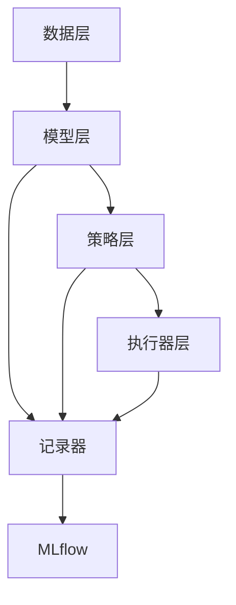

**图表来源**
- [qlib/workflow/exp.py:243-380](file://qlib/workflow/exp.py#L243-L380)
- [qlib/workflow/recorder.py](file://qlib/workflow/recorder.py)

**章节来源**
- [qlib/workflow/exp.py:243-380](file://qlib/workflow/exp.py#L243-L380)
- [qlib/workflow/recorder.py](file://qlib/workflow/recorder.py)

## 性能考虑
- 缓存与懒加载：表达式与 Provider 层广泛使用缓存，减少重复 IO 与计算。
- 并行化：回测与 RL 场景中使用多进程并行，合理设置并发度以平衡吞吐与资源占用。
- 数据预处理：在 Handler/Processor 中尽量向量化与批处理，降低单步开销。
- 记录频率：控制记录器写入频率，避免 I/O 成为瓶颈。

## 故障排查指南
- 工厂解析失败
  - 现象：导入模块或类名错误导致实例化失败。
  - 排查：检查配置中的 class/module_path/kwargs 是否正确，确认模块路径可导入。
- Provider 未注册
  - 现象：访问 FeatureD/DatasetD 等时报错。
  - 排查：确认已调用 register_all_wrappers 并传入有效配置。
- 记录器状态异常
  - 现象：实验结束仍处于 RUNNING。
  - 排查：检查 end_exp 是否被调用，记录器是否正常关闭。
- 并发问题
  - 现象：异步队列导致主线程退出后子线程卡住。
  - 排查：使用异步队列的关闭与等待机制，确保主进程结束后回收线程。

**章节来源**
- [qlib/utils/mod.py:122-185](file://qlib/utils/mod.py#L122-L185)
- [qlib/data/data.py:1292-1332](file://qlib/data/data.py#L1292-L1332)
- [qlib/workflow/exp.py:275-279](file://qlib/workflow/exp.py#L275-L279)
- [qlib/utils/paral.py:84-129](file://qlib/utils/paral.py#L84-L129)

## 结论
Qlib 通过“配置驱动 + 工厂 + 抽象基类 + 包装器注册”的组合拳，实现了数据、模型、策略与实验管理的高内聚低耦合。组件间以清晰的接口与生命周期管理为基础，辅以缓存、并行与记录器机制，既保证了灵活性与可扩展性，也兼顾了性能与可观测性。建议在实际工程中遵循统一的配置规范与生命周期管理，确保组件替换与升级的平滑过渡。

## 附录
- RL 训练与回测集成：RL 训练通过仿真器与策略/奖励解释器协作，回测阶段可并行执行多个标的，最终汇总报告与指标。
  
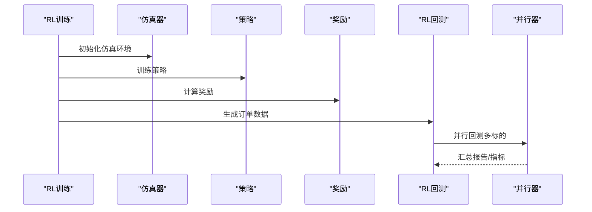

**图表来源**
- [qlib/rl/simulator.py:37-75](file://qlib/rl/simulator.py#L37-L75)
- [qlib/rl/contrib/train_onpolicy.py:159-189](file://qlib/rl/contrib/train_onpolicy.py#L159-L189)
- [qlib/rl/contrib/backtest.py:323-364](file://qlib/rl/contrib/backtest.py#L323-L364)

**章节来源**
- [qlib/rl/simulator.py:37-75](file://qlib/rl/simulator.py#L37-L75)
- [qlib/rl/contrib/train_onpolicy.py:159-189](file://qlib/rl/contrib/train_onpolicy.py#L159-L189)
- [qlib/rl/contrib/backtest.py:323-364](file://qlib/rl/contrib/backtest.py#L323-L364)